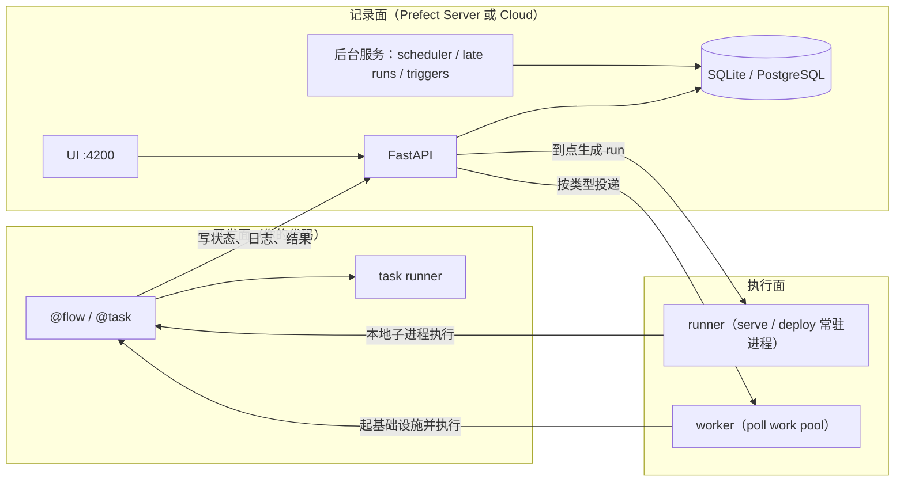

Prefect 的 README 对自己的定位只有一句话：把脚本升级成生产工作流，最简单的方式。把这句话读实，它做的事情是在函数调用的前后各插一段代码——前面向 Prefect API（应用程序接口）注册一条运行记录，后面把状态、日志和结果写回去。装饰器是入口，运行时接管才是商品。

这笔交易里划算的部分很好理解：本地 `python script.py` 和生产上的 deployment（部署）跑同一份函数体，没有 DAG 文件、没有第二套调度语义。需要付学费的部分，多数二手资料讲错了。Prefect 3 换掉了 2.x 的记录模型：缓存、结果持久化、「默认能拿到上一次的返回值」这三件事的语义全变了，而流传最广的示例代码还停在 2.x。

所以本文的判断钉在两份证据上：一份是 PyPI 上的 3.8.6，本机装完真跑过，命令与行数都记在文中；另一份是 GitHub `main` 分支 2026-09-18 的提交，用来读结构与实现。凡是只有 README 口径或只有我推断的，都在原位标出来。

## 目录

- [1. 判断：它接管的是调用，不是你的依赖图](#1-判断它接管的是调用不是你的依赖图)
- [2. 仓库现状与核实口径](#2-仓库现状与核实口径)
- [3. 系统地图：一次运行会经过哪些进程](#3-系统地图一次运行会经过哪些进程)
- [4. 先拆开四对容易混的东西](#4-先拆开四对容易混的东西)
- [5. 运行历史从哪来：本机实测](#5-运行历史从哪来本机实测)
- [6. 装饰器具体替你做了什么](#6-装饰器具体替你做了什么)
- [7. 缓存：3.x 换了实现，也换了命中条件](#7-缓存3x-换了实现也换了命中条件)
- [8. 结果与事务：默认什么都不存](#8-结果与事务默认什么都不存)
- [9. 并发有四条线，各管一层](#9-并发有四条线各管一层)
- [10. 部署：serve、deploy 与 prefect.yaml](#10-部署servedeploy-与-prefectyaml)
- [11. 事件、自动化与服务等级协议（SLA）](#11-事件自动化与服务等级协议sla)
- [12. 数据资产：它开始说「数据应该长什么样」](#12-数据资产它开始说数据应该长什么样)
- [13. 一次 cron 部署如何流过整个系统](#13-一次-cron-部署如何流过整个系统)
- [14. 与 Airflow、Dagster、Temporal 的取舍](#14-与-airflowdagstertemporal-的取舍)
- [15. 不该用它的场景](#15-不该用它的场景)
- [16. 按症状排查](#16-按症状排查)
- [17. 采用顺序](#17-采用顺序)
- [18. 五个自测题](#18-五个自测题)
- [19. 下一步读哪份代码](#19-下一步读哪份代码)
- [20. 维护指引：核实方法与失效条件](#20-维护指引核实方法与失效条件)
- [参考来源](#参考来源)

## 1. 判断：它接管的是调用，不是你的依赖图

多数编排框架的第一等对象是一张图，你的代码要被翻译成图上的节点。Prefect 的第一等对象是一次调用：`@flow` 与 `@task` 把函数包进引擎，依赖关系是调用发生时才确定的——`body(1)` 是同步等待，`body.submit(1)` 交给 task runner 并发，`.map()` 把一组参数摊成一批任务。图是运行之后的产物，不是运行之前的输入。

这个次序决定了它适合什么、不适合什么。适合的是「控制流本来就用 Python 写的」那类管道：分支、循环、动态扇出都不需要额外表达。代价是静态检查器看不到全图，一个 `if` 里少调一次任务，编排层就少一个节点，而 UI 上看不出这是设计还是漏写。

三条主线各自独立，读源码和排障时不要混：

| 主线 | 负责什么 | 代码在哪 |
|---|---|---|
| 开发面 | 装饰器、参数 schema（模式）、重试与缓存语义 | `src/prefect/flows.py`、`tasks.py`、`cache_policies.py` |
| 记录面 | 运行、状态、日志、部署、事件的存储与 UI | `src/prefect/server/`（FastAPI + SQLAlchemy + Alembic） |
| 执行面 | 谁在什么机器上把流跑起来 | `src/prefect/runner/`、`src/prefect/workers/` |

第 13 节用一条 cron 部署把这三条线串一遍。

## 2. 仓库现状与核实口径

下表数字采于 2026-09-20，方法写在第 20 节。

| 项 | 值 | 来源口径 |
|---|---|---|
| star / fork（派生） | 23 869 / 2 526 | GitHub REST（表述性状态转移）API 的 `repos/PrefectHQ/prefect` |
| open issues | 860 | 同上 |
| 仓库创建 | 2018-06-29 | 同上，`created_at` |
| 最近 push（推送） | 2026-09-19 | 同上，`pushed_at` |
| 最新 release | 3.8.6，发布于 2026-09-14 | GitHub `releases/latest`，标题「3.8.6 - Pause for cancellation」 |
| PyPI 版本 | 3.8.6 | `pypi/prefect/json` |
| Python 支持 | `>=3.10,<3.15` | `pyproject.toml` 的 `requires-python`，与 README 「requires Python 3.10+」一致 |
| 许可证 | Apache-2.0 | `LICENSE` 文件正文 |
| 默认分支 / 主语言 | `main` / Python | GitHub API |

README 里还有三句可以直接引用。Prefect Cloud 一段写「By automating over 200 million data tasks monthly」，客户举了 Progressive Insurance 与 Cash App 两家；社区一段写「over 25,000 practitioners」。这三个数是厂商口径，不是可复算指标，本文不拿它们做任何性能或规模推论。

## 3. 系统地图：一次运行会经过哪些进程



关键的一条边界：**调度决策发生在服务端，执行发生在服务端之外**。runner 和 worker 都只是「去问 API 有没有我的活」的进程，它们不保存排期，也不判断依赖。这条边界解释了为什么 `serve()` 退出后要靠 `pause_on_shutdown` 决定调度是否继续（第 10 节），也解释了为什么把数据库换成 Postgres 就能横向扩。

## 4. 先拆开四对容易混的东西

| 混淆对 | 区别 | 混了的后果 |
|---|---|---|
| flow run / deployment | 前者是一次执行记录，后者是「怎么执行」的服务端配置（入口、参数、调度、触发器、并发） | 以为改了代码就是改了部署；实际要重新 `deploy` 或让 pull（拉取）步骤拉到新提交 |
| 缓存 / 结果持久化 | 3.x 里缓存就是持久化：同一个 transaction（事务）记录，命中即复用其结果 | 只写 `cache_policy` 却显式 `persist_result=False`，缓存静默失效（第 7 节实测） |
| task runner / work pool | 前者管一个流内部任务的并发方式（进程内），后者管整个流跑在什么基础设施上 | 用 `ThreadPoolTaskRunner(max_workers=…)` 去解决 K8s 上的资源配额 |
| `serve()` / `deploy()` | 前者当场创建部署并留在本进程执行；后者只登记部署，执行交给 work pool 的 worker | 本地终端一关，生产调度跟着没了（`pause_on_shutdown` 默认为 True） |

## 5. 运行历史从哪来：本机实测

不设 `PREFECT_API_URL`、不启任何服务，直接跑一个流。3.8.6 的实际输出：

```text
00:21:55.114 | INFO    | prefect - Starting temporary server on http://127.0.0.1:8936
00:22:02.911 | INFO    | Flow run 'righteous-doberman' - Beginning flow run 'righteous-doberman' for flow 'probe-flow'
00:22:02.942 | INFO    | Task run 'gt-869' - RUNBODY 5
00:22:02.944 | INFO    | Task run 'gt-869' - Finished in state Completed()
00:22:03.932 | INFO    | Flow run 'righteous-doberman' - Finished in state Completed()
00:22:03.952 | INFO    | prefect - Stopping temporary server on http://127.0.0.1:8936
```

它替你拉起了一个临时 server（随机端口），进程退出时关掉。落盘位置由 `PREFECT_HOME` 决定，默认 `~/.prefect`，数据库是其中的 `prefect.db`。跑完一次最小流之后直接查库：

```bash
sqlite3 ~/.prefect/prefect.db \
  "select 'flow_run', count(*) from flow_run
   union all select 'task_run', count(*) from task_run
   union all select 'flow_run_state', count(*) from flow_run_state
   union all select 'task_run_state', count(*) from task_run_state
   union all select 'log', count(*) from log
   union all select 'deployment', count(*) from deployment;"
```

本机实测结果：`flow_run` 1、`task_run` 1、`flow_run_state` 3、`task_run_state` 3、`log` 4、`deployment` 0。也就是说本地直接跑并非「只在屏幕上打日志」，历史确实进了 SQLite；用同一个 `PREFECT_HOME` 起 `prefect server start`（默认 4200 端口），上面这几条就会出现在 UI 里。`deployment` 为 0 说明另一件事：没有 `serve()` 或 `deploy()` 就不会有部署。

这里有一个即将到来的破坏性变更值得预警。3.8.6 里 `PREFECT_SERVER_EPHEMERAL_ENABLED` 的默认值是 `True`，而 `main` 分支已把它改成 `False`，同时 `get_client()` 在没有 `PREFECT_API_URL` 时直接抛 `ValueError: No Prefect API URL provided.`。升级前如果依赖「裸跑也能留痕」，需要先起服务或显式打开该开关。

自托管 server 的组成按 `prefect server start --help` 的参数看得最清楚：API、UI（`--ui`）、一组后台服务（`--scheduler`、`--late-runs`，可用 `--no-services` 只留 API 与 UI），以及 `--workers`（默认 1）与 `--background`。数据库支持两种，官方文档 `docs/v3/concepts/server.mdx` 写得明确：SQLite 为默认、建议单机轻量场景；生产与多实例用 PostgreSQL，且要求 14.9 以上并启用 `pg_trgm` 扩展。迁移由 Alembic 管理，server 启动时自动执行，也可以手工执行 `prefect server database upgrade` 升级数据库。

版本策略上文档留了一句容易被忽略的警告：建议客户端与服务端同版本。旧客户端配新服务端可行，反过来则可能因为 REST 字段新增而失败，通常表现为 422。

## 6. 装饰器具体替你做了什么

`@flow` 与 `@task` 的参数就是它的全部承诺。3.8.6 的 `Task.__init__` 签名里与执行相关的项：

- `retries`、`retry_delay_seconds`、`retry_jitter_factor`、`retry_condition_fn`
- `timeout_seconds`、`log_prints`、`tags`、`task_run_name`、`version`
- `cache_policy`、`cache_key_fn`、`cache_expiration`、`refresh_cache`、`cache_result_in_memory`
- `persist_result`、`result_storage`、`result_serializer`、`result_storage_key`
- `on_completion`、`on_failure`、`on_running`、`on_commit`、`on_rollback`
- `asset_deps`、`viz_return_value`

`Flow.__init__` 少了缓存那一组，多了 `task_runner`、`flow_run_name`、`validate_parameters` 与 `on_cancellation`、`on_crashed` 两个钩子。全局默认值由设置项兜底：`PREFECT_TASKS_DEFAULT_RETRIES`（默认 0）、`PREFECT_TASKS_DEFAULT_RETRY_DELAY_SECONDS`（默认 0）、`PREFECT_RESULTS_PERSIST_BY_DEFAULT`（默认 False）。

重试延迟可以是标量、列表或可调用对象，官方还给了 `exponential_backoff(backoff_factor)` 生成器：

```python
from prefect import flow, task
from prefect.tasks import exponential_backoff


@task(retries=4, retry_delay_seconds=exponential_backoff(0.5), retry_jitter_factor=0.2)
def flaky(page: int) -> int:
    raise ValueError(f"page {page} unavailable")


@flow(retries=1, log_prints=True)
def ingest(pages: list[int]) -> list[int]:
    return [flaky(p) for p in pages]


if __name__ == "__main__":
    ingest([1, 2])
```

实测这份代码（3.8.6）：`flaky(1)` 共失败 5 次，日志按「Retry 1/4 will start 0.5 second(s) from now」一路写到「4.0 second(s)」，正是 `exponential_backoff(0.5)` 给出的 0.5、1、2、4 秒；`page 2` 从未被执行，因为异常在列表推导第一步就抛出。外层 `@flow(retries=1)` 把整段流体重跑一次（`Encountered exception during execution` 出现两遍），最后 flow run 以 `Failed('Flow run encountered an exception: ValueError: page 1 unavailable')` 结束，异常原样向上传播。也就是说「任务失败会不会把流拖成 CRASHED」这个常见担心，在同步调用的写法下不成立——CRASHED 是引擎没机会写终态时（进程被杀、worker 掉线）才会出现的状态。`StateType` 在 3.8.6 一共九个值：`SCHEDULED`、`PENDING`、`RUNNING`、`COMPLETED`、`FAILED`、`CANCELLED`、`CANCELLING`、`CRASHED`、`PAUSED`，其中终态为 `COMPLETED`、`FAILED`、`CANCELLED`、`CRASHED` 四个。

超时这一项有个必须知道的边界。官方 `docs/v3/how-to-guides/workflows/write-and-run.mdx` 与 `task_engine.py` 里的告警文本一致：同步任务经 `ThreadPoolTaskRunner`（默认）提交时跑在工作线程，`timeout_seconds` **不能打断** `time.sleep()`、网络请求或文件 I/O，只能在阻塞调用自然返回后生效；需要真打断得用 async 任务。引擎会明确打告警，而不是静默失效。

## 7. 缓存：3.x 换了实现，也换了命中条件

2.x 的心智是「缓存一个 Completed 状态」。3.x 换成了 transaction：任务执行被包在一个带 key 的事务里，key 由 cache policy 算出，事务若已提交过就 hydrate 出上一次的结果直接返回。看 `SyncTaskRunEngine.transaction_context` 就明白两件事是一件事：

```python
with transaction(
    key=self.compute_transaction_key(),
    store=get_result_store(),
    overwrite=overwrite,               # refresh_cache 被复用成"覆盖事务记录"
    logger=self.logger,
    write_on_commit=should_persist_result(),
    isolation_level=isolation_level,   # 来自 cache_policy.isolation_level
) as txn:
    yield txn
```

写不写、命中不命中，取决于 `should_persist_result()`。默认策略 `DEFAULT` 由 `INPUTS + TASK_SOURCE + RUN_ID` 复合而成，`RUN_ID` 在里面就意味着每次运行 key 不同；而 `PREFECT_RESULTS_PERSIST_BY_DEFAULT` 又是 False。两条合起来，「我给了 cache_policy 为什么没命中」这个问题就有了确定答案。

四组配置在同一台机器上实测：每组让同一个任务在流里被调用两次，任务体自增一个计数器文件，进程退出后再启动若干次，最后读计数器（`PREFECT_HOME` 固定）。

| 配置 | 进程启动次数 | 任务体执行次数 | 说明 |
|---|---|---|---|
| `@task()` | 1 | 2 | 默认策略未命中，两次调用各跑一次 |
| `@task(cache_policy=INPUTS)` | 1 | 1 | 同一进程内第二次调用即命中 |
| `@task(cache_policy=INPUTS, persist_result=True)` | 3 | 1 | 跨进程仍命中，说明记录已落盘 |
| `@task(cache_policy=TASK_SOURCE + INPUTS)` | 2 | 1 | 同上，且函数体一改就会失效 |

要点三条。给 `cache_policy` 而不给 `persist_result` 时，`Task.__init__` 会隐含打开持久化，所以第二行不需要额外参数就能跨进程命中。反过来显式写 `persist_result=False`，构造时策略被强制改成 `NO_CACHE`，并在日志里给出原文 `Ignoring 'cache_policy' because 'persist_result' is False`——静默失效至少留了警告，别忽略。第三，默认策略含 `RUN_ID`，所以第一行看起来「缓存粒度最粗」其实是完全不缓存。

旧写法仍然可用，但会被翻译成策略对象：`cache_key_fn=task_input_hash` 在构造时被 `CachePolicy.from_cache_key_fn()` 包成 `CacheKeyFnPolicy`；若同时给了 `cache_policy` 与 `cache_key_fn`，日志警告 `cache_key_fn will be used`，即新参数被旧的覆盖。`cache_expiration` 是另一种机制：`task_engine.py` 在任务成功时把它换算成绝对时间写入 state details（状态详情），服务端 `core_policy.py` 的缓存查找按 `cache_key` 相等且（无过期时间或 `cache_expiration > now()`）取最近一条命中。想按「数据版本」而非「时间」失效，更稳的做法是把日期或文件指纹拼进 key，或直接用 `@flow` 参数 + `FLOW_PARAMETERS`。

缓存记录与结果默认落在 `$PREFECT_HOME/storage/` 下按 key 哈希命名的文件里（本机实测单条约 273 字节）。需要跨机器共享时，官方文档给的写法是把 key 存储指到对象存储块，并且要区分两件事：缓存记录的位置用 `configure(key_storage=…)`，结果的位置用 `result_storage`：

```python
from prefect import task
from prefect.cache_policies import INPUTS, TASK_SOURCE
from prefect.locking.memory import MemoryLockManager
from prefect.transactions import IsolationLevel

cache_policy = (TASK_SOURCE + INPUTS).configure(
    key_storage="/var/tmp/prefect-cache",
    isolation_level=IsolationLevel.SERIALIZABLE,
    lock_manager=MemoryLockManager(),
)


@task(cache_policy=cache_policy)
def build(dataset: str) -> int:
    return len(dataset)
```

`configure()` 只接受 `key_storage`、`lock_manager`、`isolation_level` 三个参数，隔离级别两档：`READ_COMMITTED` 允许多个同 key 执行并行发生，`SERIALIZABLE` 才配锁管理器串行化——这是并发正确性问题，不是性能开关。全局关停有两个设置：`PREFECT_TASKS_DISABLE_CACHING`（无论策略一律不缓存）与 `PREFECT_TASKS_DEFAULT_NO_CACHE`（只改默认策略）。

## 8. 结果与事务：默认什么都不存

3.x 里「把返回值存下来」是显式行为。`PREFECT_RESULTS_PERSIST_BY_DEFAULT` 默认 False，`PREFECT_TASKS_DEFAULT_PERSIST_RESULT` 默认 None（跟随前者）。因此下面两件事在 3.8.6 上不成立：流的返回值会被自动持久化、下游运行能读到上游运行的结果。要跨运行取结果，就在源头打开持久化：

```python
from prefect import flow, task


@task(persist_result=True)
def train(split: str) -> float:
    return 0.42 if split == "val" else 0.9


@flow(persist_result=True)
def pipeline(split: str) -> float:
    return train(split)
```

`result_storage` 接受三类值：字符串路径、`Path`、或实现了 `WritableFileSystem` 的块。对象存储用集成包里的块，注意字段名：`prefect_aws.s3.S3Bucket` 的必填字段是 `bucket_name`，另有 `credentials` 与 `bucket_folder`，类名也不是 `S3`。

```python
from prefect import flow
from prefect_aws.s3 import S3Bucket

bucket = S3Bucket.load("prod-results")


@flow(persist_result=True, result_storage=bucket)
def nightly(day: str) -> int:
    return len(day)
```

比「存结果」更进一步的是 `prefect.transactions`：把一段有副作用的写操作包成事务，回滚时按登记顺序执行 `on_rollback`。它的签名是 `transaction(key=…, store=…, commit_mode=…, isolation_level=…, overwrite=…, write_on_commit=…)`，`commit_mode` 三档 `EAGER` / `LAZY` / `OFF`，事务状态五档 `PENDING` / `ACTIVE` / `STAGED` / `COMMITTED` / `ROLLED_BACK`。任务是隐式事务，所以 `@task(on_rollback=[...])` 与手写 `with transaction(...)` 走的是同一套。

## 9. 并发有四条线，各管一层

**进程内怎么并发**：`@flow(task_runner=...)`。3.8.6 核心提供三个：`ThreadPoolTaskRunner`、`ProcessPoolTaskRunner`，以及提交后返回 `PrefectDistributedFuture` 的 `PrefectTaskRunner`（它只出现在 API 参考里，概念文档没有使用指引）；`ConcurrentTaskRunner` 作为兼容名保留。跨机器的 `DaskTaskRunner` 与 `RayTaskRunner` 不在核心包，来自 `src/integrations/` 下的 `prefect-dask`、`prefect-ray`。默认线程池的 `max_workers` 实测是 `sys.maxsize`，也就是**不设上限**；`ProcessPoolTaskRunner` 默认 10。类文档串里点名了风险：频繁提交且每个任务改上下文（例如循环里用 `prefect.tags`）会让线程与文件描述符一起涨，撞上 `OSError: Too many open files`。另一个坑在显式设了上限之后：`_warn_if_nested_submit_would_deadlock` 专门检测「父任务在工作线程里提交子任务并同步等结果，而线程池已满」，命中就告警一次，对应的正是 issue #17060；三条出路写在告警文本里——抬高 `max_workers`、把子任务的提交提到流这一级、或者改用 `.delay()` 交给 task worker 执行。

```python
from prefect import flow, task
from prefect.task_runners import ThreadPoolTaskRunner


@task
def fetch(repo: str) -> int:
    return len(repo)


@flow(task_runner=ThreadPoolTaskRunner(max_workers=4))
def fan_out(repos: list[str]) -> list[int]:
    futures = [fetch.submit(r) for r in repos]
    return [f.result() for f in futures]
```

**一个部署同时跑几条**：`serve(..., limit=…)` 管本进程，`global_limit=…` 管同一部署跨实例；`deploy(..., concurrency_limit=…)` 写进服务端配置。服务端存的是 `ConcurrencyLimitConfig`：`limit` + `collision_strategy` + `grace_period_seconds`（限 60 到 86400 秒，给基础设施启动留时间）。超限时两种策略：`ENQUEUE`（排队，默认）与 `CANCEL_NEW`（后来者直接取消）。

**整个工作区共跑几条**：全局并发性限制，命令行工具（CLI）是 `prefect global-concurrency-limit create / update / inspect / ls / enable / disable / delete`。

**标签级**：任务运行时按标签向并发服务申请租约，`task_engine.py` 里能看到实现是 `names=[f"tag:{tag}" …]`、`occupy=1`、`lease_duration=60`。写代码侧还有上下文管理器 `from prefect.concurrency.sync import concurrency, rate_limit`（async 版在 `prefect.concurrency.asyncio`），可以包住任意一段非任务代码。

## 10. 部署：serve、deploy 与 prefect.yaml

`flow.serve()` 的文档串一句话概括了它的两件事：给这个流创建一个部署，并启动一个 runner 去接调度到的工作。参数里最该记住三个：`cron` / `interval` / `rrule`（都可传列表，一次注册多条排期）、`pause_on_shutdown`（默认 True，进程退出即暂停排期）、`entrypoint_type`（默认 `FILE_PATH`，改 `MODULE_PATH` 时要保证执行环境里可 import）。多个部署一起交给 `from prefect import serve` 也行，官方链式触发的例子就是这么写的。

runner 自己的容量与轮询由设置控制，默认值抄在这里：`PREFECT_RUNNER_PROCESS_LIMIT` 为 5，`PREFECT_RUNNER_POLL_FREQUENCY` 为 10 秒。还有三个默认关闭的开关：`PREFECT_RUNNER_SERVER_ENABLE`（runner 自带的 webserver，关掉时外部无法通过它干预正在跑的流）、`PREFECT_RUNNER_CRASH_ON_CANCELLATION_FAILURE`（观察到取消失败时是把 run 标成 crashed 并退出，还是只记一条错误继续跑）、`PREFECT_RUNNER_AUTO_INSTALL_DEPENDENCIES`（允许 runner 在执行前装依赖）。

`flow.deploy()` 是另一条路：只登记部署，执行交给匹配 work pool 的 worker。签名里与基础设施相关的是 `work_pool_name`、`image`（镜像）、`build`、`push`、`work_queue_name`、`job_variables`；带一个下划线前缀的 `_sla` 用于挂 SLA 定义（第 11 节）。

工程化团队协作时把这一切写进 `prefect.yaml`。`prefect deploy` 生成的模板字段就是这些（原文照抄，未加注释）：

```yaml
---
prefect-version: null
name: null

build: null
push: null
pull: null

deployments:
  -  # base metadata
    name: null
    version: null
    tags: []
    description: null
    schedule: {}
    concurrency_limit: null

    # flow-specific fields
    flow_name: null
    entrypoint: null
    parameters: {}

    # infra-specific fields
    work_pool:
      name: null
      work_queue_name: null
      job_variables: {}
```

工作池类型这张表值得完整看一遍，因为它同时告诉你哪类池需要自己养 worker。文档 `docs/v3/concepts/work-pools.mdx` 分 Cloud 与自托管两个口径：

| 类型 | 自托管 | Cloud | 是否需要自己跑 worker |
|---|---|---|---|
| Process | 有 | 有 | 需要 |
| Docker | 有 | 有 | 需要（依赖 Docker daemon） |
| Kubernetes | 有 | 有 | 需要 |
| AWS ECS / Azure Container Instances（容器实例）/ Google Cloud Run（含 V2）/ Google Vertex AI | 有 | 有 | 需要 |
| ECS / Cloud Run / ACI / Modal 的 `- Push` 变体 | 无 | 有 | 不需要，运行被直接推进目标环境 |
| Coiled、Prefect Managed | 无 | 有 | 不需要 |

代码侧的内置 worker 类型只有 `process`（`src/prefect/workers/process.py`），`docker` 与 `kubernetes` 分别由 `prefect-docker`、`prefect-kubernetes` 提供——仓库 `src/integrations/` 下共 18 个集成包，`prefect-aws`、`prefect-gcp`、`prefect-azure`、`prefect-sqlalchemy`、`prefect-dbt`、`prefect-databricks`、`prefect-slack`、`prefect-shell` 都在里面。集成包的准确名字是 `prefect-kubernetes`，不是 `prefect-k8s`。

## 11. 事件、自动化与服务等级协议（SLA）

自动化是「事件 → 动作」，在 3.x 里既能 UI/CLI 配，也能用 Python 声明（`prefect.automations.Automation`，字段与 `AutomationCore` 一致）。触发器四类：`EventTrigger`、`MetricTrigger`、`ResourceTrigger`，以及组合用的 `SequenceTrigger` / `CompoundTrigger`。`EventTrigger` 的真实字段是 `match`、`match_related`、`after`、`expect`、`for_each`、`posture`、`threshold`、`within`，事件名走 Prefect 的事件语法，例如官方把上游流跑完接下游写成 `expect={"prefect.flow-run.Completed"}` 配 `match_related={"prefect.resource.name": "upstream_deployment"}`。

```python
from datetime import timedelta

from prefect.automations import Automation
from prefect.events.actions import RunDeployment
from prefect.events.schemas.automations import EventTrigger, Posture


async def deploy_fixer(deployment_id: str) -> Automation:
    return await Automation(
        name="nightly-failed-then-remediate",
        trigger=EventTrigger(
            expect={"prefect.flow-run.Failed"},
            match_related={"prefect.resource.name": "nightly-ingest"},
            posture=Posture.Reactive,
            threshold=1,
            within=timedelta(minutes=5),
        ),
        actions=[RunDeployment(deployment_id=deployment_id)],
    ).acreate()
```

动作侧在 3.8.6 一共 17 个类，按用途看更清楚：跑流 `RunDeployment`；处置运行 `CancelFlowRun`、`DeleteFlowRun`、`ChangeFlowRunState`、`SuspendFlowRun`；掐流量 `PauseDeployment` / `ResumeDeployment`、`PauseWorkPool` / `ResumeWorkPool`、`PauseWorkQueue` / `ResumeWorkQueue`、`PauseAutomation` / `ResumeAutomation`；对外 `SendNotification`、`CallWebhook`；事故 `DeclareIncident`；空转 `DoNothing`。想在部署侧而不是自动化侧挂触发，用 `serve(triggers=[...])` / `deploy(triggers=[...])` 接 `DeploymentEventTrigger` 等四个类，Webhook 触发也是这一路（文档有 `docs/v3/concepts/webhooks.mdx`）。

指标型触发是另一条线，值得单独看：`MetricTrigger` 的 `metric` 字段接 `MetricTriggerQuery(name=…, threshold=…, operator=…, window=…)`，`name` 只支持 `lateness`、`duration`、`successes` 三个指标，`operator` 为 `<`、`<=`、`>`、`>=`。这三个恰好对应数据管道最该被叫醒的三种情况：来晚了、跑太久、成功率掉。

SLA 目前在文档里带实验标记，且只给 Prefect Cloud，客户端要求 3.1.12 以上；写 `prefect.yaml` 时形如 `sla: [{name: "time-to-completion", duration: 10, severity: "high"}, {name: "lateness", within: 600, severity: "high"}]`，超阈值产出的仍是事件，再交给自动化处置。把它当成「云上托管的告警语法糖」来判断是否采用，自托管路线不要用。

外部事件用 `from prefect.events import emit_event`，签名是 `emit_event(event, resource, occurred=None, related=None, payload=None)`——资源字典里 `prefect.resource.id` 必填，这决定了自动化能不能 `match` 到你。

## 12. 数据资产：它开始说「数据应该长什么样」

`src/prefect/assets/` 与文档 `docs/v3/concepts/assets.mdx` 说明 3.x 后期加了一层资产抽象：`@materialize(*assets, by=…, **task_kwargs)` 把一个任务标成「这些资产的生产者」（返回 `MaterializingTask`），任务上还能声明 `asset_deps=[...]` 表示依赖哪些上游资产，`add_asset_metadata(asset, {...})` 往资产上挂元数据。

这件事对选型判断有直接影响：过去把 Prefect 归为「任务流」、把 Dagster 归为「资产」，界线在于前者按时间触发、后者按数据是否过期触发。有了 materialize 与 asset_deps 之后，这条线在 Prefect 里也存在了，只是实现方式仍挂在任务上，而不是把资产当作第一等定义对象。至于资产血缘 UI 与自动重算成熟度到什么程度，属于要在你自己场景里 PoC 的事，本文不下结论。

## 13. 一次 cron 部署如何流过整个系统

拿一个具体场景把三条线串起来：`nightly_ingest` 每天 02:00 跑，落在自托管 server + Postgres + 一个 Docker work pool 上。

1. `prefect deploy` 读 `prefect.yaml`，把入口路径、参数、`cron` 与 `work_pool.name` 写成一条 deployment 记录；worker 之前不存在任何排期。
2. server 的 scheduler 服务按排期提前生成 scheduled flow run（这也是 `--late-runs` 那个服务存在的理由：排期到了但没人领走，会被标成迟运行）。
3. Docker 类型的 worker 轮询该 work pool，领到 run 后拉镜像、创建容器。它注入的是自己那一份非默认设置（`workers/base.py` 调 `to_environment_variables(exclude_unset=True)`，键名形如 `PREFECT_HOME`、`PREFECT_API_URL`），本身不执行你的函数。
4. 容器里的进程执行 `prefect flow-run execute <id>`，解析 entrypoint、导入流、进入 `flow_engine.py` 的 `FlowRunEngine`，向 API 把状态从 `PENDING` 推到 `RUNNING`。runner 直跑时它另注入两个内部变量：`PREFECT__FLOW_RUN_ID` 与控制端口的 `PREFECT__CONTROL_PORT`（双下划线，用于回传取消等控制信号）。
5. 每个任务调用被 `task_engine.py` 的 `SyncTaskRunEngine` 包住，先开 transaction：命中就 hydrate 结果直接完成，未命中才执行函数体；成功写 `COMPLETED`，异常按 `retries` 重试并写 `FAILED`。
6. 流终态写回后，事件进入事件流水线；若某条自动化的 `expect` 匹配上 `prefect.flow-run.Failed`，就按动作 `RunDeployment` 拉起修复流——第 11 节那条自动化在这里生效。
7. 全过程的状态、日志、产物落在 Postgres 与 result storage，UI 上的时间线只是这两份存储的读视图。

排障时按这条链定位最快：没有 run → 看 deployment 与 scheduler；有 run 一直 `PENDING` → 看 worker 是否在 poll、池类型是否匹配；容器起来但没记录 → 看容器里的 `PREFECT_API_URL` 与网络；只有部分任务重跑 → 看 transaction key 与 cache policy。

## 14. 与 Airflow、Dagster、Temporal 的取舍

三条判断都尽量给依据，不给依据的地方直说是判断。

相对 Airflow：差别不在功能多少，而在编排描述发生在什么时候。Airflow 需要在导入期把 DAG 对象图建出来，Prefect 的依赖来自运行期的调用与 future（第 1 节）。这让 Prefect 的动态分支不需要自定义 operator，代价是静态可检查性弱。哪边生态更大不在本文范围内比较——Airflow 的 provider 体系是多年积累，这一点无需数字也成立。

相对 Dagster：Dagster 以资产为中心建模，Prefect 以运行为中心建模，但 Prefect 现在有 `@materialize` 与 `asset_deps`（第 12 节），所以更准的说法是「重心仍然在运行，资产是一层注解」。团队如果主要交付的是「报表/特征表是否新鲜」，Dagster 的模型更贴；如果主要交付的是「每晚这一串步骤有没有跑完、失败能不能续」，Prefect 的装饰器路径改造成本更低。

相对 Temporal 与 Argo Workflows：Temporal 管的是长生命周期业务事务，靠可重放的 workflow 代码、信号与查询；Argo 管的是 K8s 上的容器化批任务。两者都不是为 Python 数据管道写的。Prefect 留下的执行记录是「这次跑的观测数据」，不是可重放的确定性事件日志——需要重放语义时，不要用编排框架凑。

## 15. 不该用它的场景

- 流的定义要在导入期被第三方系统读取、校验、渲染成图（例如非工程岗位在 UI 里拼管道），运行期建图的模型帮不上忙。
- 主要工作量在 SQL 转换与血缘治理，而不是任务协调：那时该看转换层工具，编排层只是配角。
- 团队没有 Python 边界，管道核心是 Java / Go / Rust 服务：work pool 能跑容器，但 SDK（软件开发包）的装饰器卖点在跨语言时归零。
- 需要 exactly-once 的业务流程语义：Prefect 提供重试、缓存与事务式副作用控制，不提供跨系统提交协议的保证。
- 已经稳定运行在 Airflow 上、没有额外诉求：迁移收益主要是代码风格，不足以支撑成本。

## 16. 按症状排查

前两类是本地起服务最常见的问题，其余来自上文的实测与源码告警文本。

| 现象 | 更可能的原因 | 依据与处置 |
|---|---|---|
| 升级到新版后裸跑报 `No Prefect API URL provided.` | 不再默认拉起临时 server | 见第 5 节的 `main` 分支变更；起服务或显式开 `PREFECT_SERVER_EPHEMERAL_ENABLED` |
| `prefect` CLI 连不上、UI 空白 | 4200 被占或 API 未起 | `prefect server status`；`prefect config view` 看 `PREFECT_API_URL` 指向 |
| 客户端一调用就 422 | 客户端比服务端新 | 文档 `server.mdx` 的明确警告；对齐版本，服务端不降级时锁客户端 |
| 给了 `cache_policy` 却每次都重跑 | 默认策略含 `RUN_ID`，或显式 `persist_result=False` | 第 7 节实测表；日志里搜 `Ignoring` |
| 下游运行读不到上游返回值 | 3.x 默认不持久化结果 | `persist_result=True` 或全局 `PREFECT_RESULTS_PERSIST_BY_DEFAULT` |
| 任务超时不生效 | 同步任务在工作线程里跑，阻塞调用不可打断 | 第 6 节告警文本与 how-to 文档；改 async 任务 |
| 告警写明「…while all N worker threads are busy」 | 父任务在工作线程里 submit 子任务并同步等结果，线程池已被占满 | `ThreadPoolTaskRunner._warn_if_nested_submit_would_deadlock`（对应 issue #17060）；提高 `max_workers`、把子任务提到流一级提交，或改用 `.delay()` 交给 task worker |
| 长跑容器数增多、文件描述符耗尽 | 线程池无上限叠加上下文变化 | 类文档串点名 `OSError: Too many open files`；显式设上限 |
| 停掉本地 `serve()` 后端上不再排期 | `pause_on_shutdown` 默认 True | 第 10 节；要留存排期改用 `deploy()` + worker |
| 多实例 server 互相抢任务或写入失败 | 后端还在 SQLite | 文档建议生产用 Postgres 且需 14.9+ 与 `pg_trgm` |

## 17. 采用顺序

1. 给现有脚本加 `@flow`、`@task`，本地直接跑，确认 SQLite 里出现 run 与 log（第 5 节的 SQL 可直接复查）。
2. 只在真正会重复计算的地方加 `cache_policy=INPUTS`，然后按第 7 节的计数器方法验证一次：跑两遍，看执行次数是不是 1。
3. 起 `prefect server start`，把 `serve(cron=…)` 换成常驻进程，观察 `pause_on_shutdown` 的行为差异。
4. 换 Postgres、跑 `prefect server database upgrade`，再建 `process` 类型 work pool，用 `deploy()` 把执行挪出开发机。
5. 最后接自动化：先只做 `SendNotification`，稳定后再加 `RunDeployment` 之类的处置动作，避免排障时同时面对两层自动行为。

## 18. 五个自测题

1. 同一个流里连续两次调用 `@task()`（不给任何缓存参数），任务体会执行几次？为什么不是 1 次？
2. `cache_policy` 与 `cache_key_fn` 同时给，最终生效的是哪个？`persist_result=False` 时又是什么行为？
3. `serve()` 与 `deploy()` 谁会在服务端留下 deployment 记录？进程退出后排期分别怎么变？
4. 任务运行在默认 task runner 上，`timeout_seconds=30` 而函数里有一个 120 秒的阻塞读文件，会发生什么？
5. `- Push` 类工作池与 Process/Docker/Kubernetes 池在运维负担上的关键差别是什么？

答案分别对应第 7、7、10、6、10 节的实测与签名，不必背，能定位到那一节即可。

## 19. 下一步读哪份代码

按「一次调用如何变成一条记录」的顺序读，行数为 2026-09-18 `main` 分支：

1. `src/prefect/flows.py`（3 698 行）与 `src/prefect/tasks.py`（2 272 行）：先看 `__init__` 参数如何被消化，尤其 `tasks.py` 第 528 到 560 行那段——缓存策略与是否持久化在这里互相牵制。
2. `src/prefect/flow_engine.py`（2 388 行）与 `src/prefect/task_engine.py`（1 916 行）：`FlowRunEngine` / `AsyncFlowRunEngine`、`SyncTaskRunEngine` / `AsyncTaskRunEngine`，以及任务侧的 `transaction_context`。
3. `src/prefect/cache_policies.py`、`src/prefect/transactions.py`（763 行）、`src/prefect/results.py`（1 371 行）：缓存三件套的真实实现。
4. `src/prefect/server/orchestration/core_policy.py`：服务端策略，`CacheKeyLookup` 一段解释了 `cache_expiration` 到底在哪被比较。
5. `src/prefect/runner/` 与 `src/prefect/workers/`：`_scheduled_run_poller.py`、`_flow_run_executor.py`、`_limit_manager.py` 三个文件足够看懂 runner；worker 侧从 `workers/process.py` 起步，再看 `prefect-docker`。
6. `src/prefect/server/events/` 与 `src/prefect/cli/`：自动化流水线与所有 CLI 的入口。

别从 `src/prefect/engine.py` 开始——它现在只剩 190 行，是历史兼容与信号处理的残留，不是引擎。

## 20. 维护指引：核实方法与失效条件

本文可复现的采集方式：

```bash
git clone --depth 1 https://github.com/PrefectHQ/prefect.git   # 读结构与文档
uv venv pf_env && uv pip install --python pf_env/bin/python "prefect==3.8.6"
HOME=/tmp/pf_home PREFECT_HOME=/tmp/pf_home/.prefect pf_env/bin/python probe.py
```

失效条件按强弱排：签名类事实（参数名、字段名、枚举值、设置项默认值）绑定 3.8.6，小版本内一般不会动，跨大版本要重查；默认值类事实（`PREFECT_SERVER_EPHEMERAL_ENABLED`）已经出现从 `True` 改向 `False` 的既成提交，属于最易过期的一类，文中已就地标注；厂商口径类数字（2 亿任务、25 000 社区人数）只在「README 这么写」的意义上成立；GitHub 的 star/fork 与日期是快照，重新请求第 2 节表里那几个 API 字段即可刷新。

下面这些写法在旧文章与旧教程里仍在流传，在 3.8.6 上已不成立，接手同类文档时先逐条查一遍：

- `cache_key_in`、`load_flow_from_result()`：`Task` 与 `prefect` 包都没有这个名字。
- `from prefect.events import listen_event`：不存在，事件驱动改用 `Automation` 或 `DeploymentEventTrigger`。
- `flow.map()`：`Flow` 上没有 `map`，能映射参数的只有 `Task.map`。
- `S3(bucket=...)`：类名是 `S3Bucket`，必填字段是 `bucket_name`。
- `prefect-k8s`：正确包名是 `prefect-kubernetes`。
- 把自托管 server 说成「Orion + Postgres」：目录已是 `src/prefect/server/`，默认库是 SQLite。
- `prefect agent start`：agent（代理／智能体）这一层已被 worker 取代，仓库里的升级指引指向 workers。

## 参考来源

- PrefectHQ/prefect 仓库：`README.md`、`pyproject.toml`、`docs/v3/concepts/{server,work-pools,workers,assets,slas,automations,webhooks}.mdx`、`docs/v3/how-to-guides/workflows/write-and-run.mdx`、`docs/v3/how-to-guides/automations/*.mdx`、`docs/v3/advanced/caching.mdx`
- 源码：`src/prefect/{flows,tasks,task_runners,task_engine,flow_engine,cache_policies,transactions,results,automations,engine}.py`、`src/prefect/client/schemas/objects.py`、`src/prefect/server/orchestration/core_policy.py`、`src/prefect/server/database/configurations.py`、`src/prefect/settings/models/**`、`src/prefect/cli/{server,flow_run,task_run,global_concurrency_limit,work_pool}.py`、`src/prefect/deployments/templates/prefect.yaml`、`src/integrations/*`
- PyPI 与 GitHub 元数据：<https://pypi.org/p/prefect/>、<https://github.com/PrefectHQ/prefect>
- 官方文档站：<https://docs.prefect.io/>
- 本机实测：`prefect==3.8.6` 在 macOS / Python 3.13 下的四个探针脚本（缓存计数、临时 server 落盘、SQLite 行数、失败传播），日志与行数原文已在正文引用
