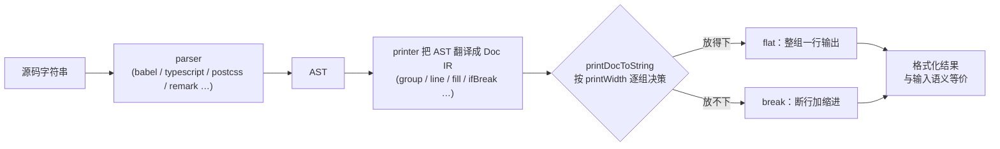

# Prettier 深度拆解：一条打印流水线终结团队格式之争

## 核心判断

Prettier 做的事情是让"代码长什么样"不再是一个需要讨论的问题。它 2017 年 1 月由 James Long 发布第一版，把 Philip Wadler《A prettier printer》提出的 pretty-printing 算法搬进 JavaScript 生态：解析成 AST（抽象语法树），翻译成一串打印指令，再按行宽限制重新打印出来。因为只动空白、换行和标点风格，输出与输入语义等价。

九年后它仍是 JS 生态格式化的事实标准，护城河不在格式化本身，而在 Opinionated 这个立场：官网全部顶级格式选项止步于 27 个（其中还有已废弃的），大多数风格问题根本没有配置项可调。选项给得越少，团队在缩进、引号、分号上消耗的争论越少——这是 Prettier 真正出售的东西。

## 项目坐标

| 维度 | 数据 |
|------|------|
| 仓库 | prettier/prettier |
| Stars | 约 52.2 千 |
| Forks | 约 5.0 千 |
| 贡献者 | 约 430（GitHub 非匿名口径） |
| 当前版本 | 3.9.6（2026-09，要求 Node 14+） |
| License | MIT |
| 首个版本 | 0.0.1（2017-01-10） |
| 主语言 | JavaScript（约 97%） |

Stars、Forks 数据截至 2026 年 9 月。

## 总览：工具链怎么分工，流水线怎么走

看 Prettier 要先分清两个维度：它在工具链里负责哪一段，以及它内部怎么完成这一段。

工具链分工上，Prettier 只管"格式化"这一件事，和它配合的是另外两类工具：

| 层 | 工具 | 时机 | 职责 |
|----|------|------|------|
| 格式化 | Prettier | 被上层调用 | 输出符合统一风格的代码 |
| 质量检查 | ESLint | 保存、提交、CI | 抓未使用变量、潜在 bug，不管风格 |
| 即时反馈 | 编辑器 format on save | 每次保存 | 本地最快的修正回路 |
| 入库闸门 | husky + lint-staged | git commit 前 | 只处理暂存区里的文件 |
| 兜底 | CI 里的 `--check` | push / PR | 防止 hook 被绕过 |

内部流水线则是这条单向路径：



每一步只认输入不认来源，所以同一份代码在任何机器上输出一致——这是"一致性"能成为承诺的前提。

## Opinionated：27 个选项背后的产品决策

Prettier 官网 options 页列出的顶级选项是 27 个（含已废弃项），对比 ESLint 里数量庞大且多数可独立开关的格式类规则，这是两种世界观。Prettier 的态度写在它的设计原则里：每多给一个选项，就多一类团队内战。所以它的选项表被刻意压扁，常用到的其实只有十来个：

| 选项 | 默认值 | 说明 |
|------|--------|------|
| `printWidth` | `80` | 目标行宽，超出会尝试折行 |
| `tabWidth` | `2` | 缩进宽度 |
| `useTabs` | `false` | 缩进用空格 |
| `semi` | `true` | 行尾分号 |
| `singleQuote` | `false` | 字符串用双引号 |
| `trailingComma` | `"all"` | 尾随逗号，3.0 起默认值从 `"es5"` 改为 `"all"` |
| `arrowParens` | `"always"` | 箭头函数参数括号，2.0 起默认 |
| `endOfLine` | `"lf"` | 换行符，2.0 起默认 |

这个表格还藏着一条长期契约：**默认值会随大版本调整**。2.0 改了 `arrowParens` 和 `endOfLine`，3.0 改了 `trailingComma`。选 Prettier 就等于接受"跟着上游审美走"，升级大版本时默认风格会变，这是代价的一部分。

## Doc IR：断行决策是怎么做的

Prettier 里最有意思的是中间这层 Doc IR。printer 不直接输出字符串，而是把 AST 翻译成一串打印指令（builders），最后由 `printDocToString` 统一做断行决策：

- `group` 把一段输出标记成一组：先尝试整组放在一行（flat），放不下再组内断行（break）。
- `line` 是组内"放得下就输出空格，放不下就换行"；`softline` 放得下输出空串；`hardline` 无条件换行。
- `ifBreak` 按 group 的决策切换输出内容，比如断行时补尾随逗号。
- `fill` 处理长序列（import 列表、数组字面量），尽量把元素塞满一行再换。

同一个 AST，行宽不同输出就不同。`const user = { name: "a", age: 1 }` 在 80 列内保持一行；换成很窄的 `printWidth`，group 决策变成 break，每个键值对各占一行。断行决策全部由 printer 统一做出，每条规则只需要声明"这是可以断的位置"，不用自己关心行宽。

一个对老用户重要的细节：早期版本拼接文档要显式调用 `doc.builders.concat()`，它从 2.3 起标记弃用、3.x 正式移除，现在 builders 直接接受数组。"Print Only" 是另一条承诺——Prettier 不改语义，不做重命名、不提取变量，diff 里出现的只有空白与格式。

## 多语言：一个 printer，一排 parser

Prettier 不只格式化 JS。官方文档截至 3.9 列出的支持范围：JavaScript、Flow、JSX、TypeScript、CSS / LESS / SCSS、HTML、Vue、Angular、Ember / Handlebars、JSON（含 JSON5）、GraphQL、Markdown（含 GFM 与 MDX v1）、YAML、Lightning Web Components、MJML。

实现上就是"每种语言配一个 parser，printer 机制共用"：JS 系基于 Babel、TypeScript、Flow 的 parser，样式语言基于 PostCSS 系 parser，HTML 用 angular-html-parser，Markdown 基于 remark。支持边界也值得记住：**TOML 不在官方支持列表里**，需要 TOML 这类格式得靠社区插件（如 prettier-plugin-toml）或换工具。3.9 的 npm 包已整体 bundle 化、无运行时依赖，但这些内部 parser 组合没有变。

## 一次提交里，格式检查发生在哪三层

把前面的机制放进真实工作流。一段代码从写到入库要过三层闸门，每层回答一个问题：保存时（编辑器当场格式化）、提交前（hook 只处理改动）、推送后（CI 检查全仓库）。下面是一套 2026 年当期版本的完整配置，可以直接照搭。

**编辑器层**：VS Code 装官方扩展 `esbenp.prettier-vscode`，在项目 `.vscode/settings.json` 里设为默认格式化工具并开启保存即格式化：

```json
{
  "editor.defaultFormatter": "esbenp.prettier-vscode",
  "editor.formatOnSave": true
}
```

**风格与项目配置**：仓库根目录放一个尽量薄的 `.prettierrc`——只写团队真正有分歧的三两个项，其余吃默认值：

```json
{
  "printWidth": 100,
  "singleQuote": true,
  "trailingComma": "all"
}
```

排除产物的 `.prettierignore` 通常可以不写：Prettier CLI 默认忽略 `node_modules`，并且会读取仓库的 `.gitignore`。

**提交层**：husky v9 加 lint-staged。v9 的 hook 文件就是纯 shell 脚本，`.huskyrc.json` 这类 v4 时代的配置格式早已废弃：

```bash
npm install --save-dev husky lint-staged
npx husky init
echo "npx lint-staged" > .husky/pre-commit
```

`husky init` 会注册 prepare 脚本并生成 hook 文件，改写为调用 lint-staged 后，在 `.lintstagedrc.json` 里声明每种文件跑什么：

```json
{
  "*.{js,ts,jsx,tsx}": ["prettier --write", "eslint --fix"]
}
```

lint-staged 只把 git 暂存区里的文件喂给命令，大仓库不会在每次提交时被全库格式化拖垮。

**质量层**：ESLint 只管代码质量，不管风格。ESLint 10 起 flat config——集中写在一份 `eslint.config.js` 里的扁平配置——是唯一配置方式，旧的 `.eslintrc.js` 已被移除，网上大量旧教程里的写法在新版会直接失效。先装齐三个包再落配置：

```bash
npm install --save-dev eslint @eslint/js eslint-config-prettier
```

```js
import eslint from '@eslint/js';
import prettierConfig from 'eslint-config-prettier';

export default [eslint.configs.recommended, prettierConfig];
```

`eslint-config-prettier` 的作用是关掉 ESLint 里所有与格式相关的规则，放在数组靠后的位置，让两个工具零重叠。

**兜底层**：GitHub Actions 用 `--check` 检查全仓库，格式不符即失败：

```yaml
name: Format
on: [push, pull_request]
jobs:
  format:
    runs-on: ubuntu-latest
    steps:
      - uses: actions/checkout@v4
      - uses: actions/setup-node@v4
        with:
          node-version: 22
          cache: npm
      - run: npm ci
      - run: npx prettier --check .
```

`npm ci` 装好依赖后，`npx prettier` 走的是项目锁定版本，CI 与本地输出一致的前提就在这里。

## 程序化调用：3.x 的 API 全部异步

在脚本里调用 Prettier 时有一处高频踩坑：3.0 起公共 API 全部返回 Promise，2.x 时代的同步写法拿回来的是未 resolve 的 Promise。官方文档列出的公共 API 是 `format`、`formatWithCursor`、`check`、`resolveConfig`、`resolveConfigFile`、`getFileInfo`、`getSupportInfo`、`clearConfigCache`：

```js
import * as prettier from 'prettier';

const formatted = await prettier.format('const foo=()=>{return 1}', {
  parser: 'babel',
});
// 'const foo = () => {\n  return 1;\n};\n'

const ok = await prettier.check('const foo = 1;\n', { parser: 'babel' });
// true，对应 CLI 的 --check

const config = await prettier.resolveConfig('./src/index.ts');
const formatted2 = await prettier.format(source, {
  ...config,
  filepath: './src/index.ts',
});
```

`format` 必须通过 `parser` 或 `filepath`（按扩展名推断）告知语言。确实需要同步版本的场景，用官方的 `@prettier/sync` 包装包。

## 采用顺序与边界

**新项目**：直接装，默认值起步，把 `printWidth`、引号风格这类唯一有分歧的项写进 `.prettierrc`。不要再讨论要不要 Prettier——要讨论的只剩那几个配置项。

**存量项目**：不要第一个提交就全库重排，把几千行的格式 diff 混进 code review 只会消耗信任。可靠顺序是：先落配置文件和 `.prettierignore`；再上 lint-staged 做增量格式化，只有被改到的文件被格式化；团队适应后，单独开一个"格式化提交"的 PR 全库重排，与功能改动彻底分开；最后开 CI `--check` 兜底。

**什么时候不选 Prettier**：

- 纯 JS/TS 新项目、对工具链速度敏感：Biome（当前 2.x）把 lint 和 format 合成一个 Rust 实现，速度领先 Prettier 一个数量级，配置也一体化。代价是语言覆盖集中在前端语系、插件生态小。
- 需要格式化 TOML、Java、Python 等官方不支持的语言：找社区插件，或用 dprint 这类插件化格式化器。
- 多语言内容仓库（Markdown、YAML、CSS、HTML 混杂的大 monorepo）：Prettier 的一站式多语言覆盖仍是它最稳的优势位，这些场景里替代品往往补不齐语言矩阵。

## 常见问题与排查

**升级 3.x 后 `prettier.format()` 返回的不是字符串？** 3.0 起 API 全异步，加 `await`；同步场景用 `@prettier/sync`。

**Windows 同事一提交就出现 CRLF 报错？** `endOfLine` 自 2.0 起默认 `lf`，与 git 的 `autocrlf=true` 冲突。在仓库加 `.gitattributes`（`* text=auto eol=lf`）统一入库换行符，比每个人改本地 git 配置可靠。

**CI 与本地格式结果不一致？** 先确认两边 Prettier 版本完全相同（lockfile 锁定，不要用裸 `npx prettier` 去全局拉最新版），再确认配置文件都提交进了仓库。CLI 还提供 `--debug-check` 输出格式化前后语义差异，用来排查异常。

**大仓库每次跑都很慢？** 自 2.7 起支持 `--cache`（配套 `--cache-strategy` 选 `metadata` 或 `content`，默认 `content`），按缓存键（版本、选项、Node 版本、文件内容或元数据）跳过未变化的文件。

**ESLint 还在报格式问题？** 确认 `eslint-config-prettier` 在配置数组中位于其他共享配置之后；如果你希望 ESLint 直接代跑 Prettier，用 `eslint-plugin-prettier` 的 flat config 入口 `eslint-plugin-prettier/recommended`，官方文档建议的默认做法仍是两个工具分开跑，避免重复解析。

**某些文件就是不想被格式化？** 写进 `.prettierignore`；Prettier 同时会读 `.gitignore`，生成产物通常不需要额外配置。

## 总评

Prettier 的交易结构很清楚：交出代码风格的自主权，换回"风格问题不再消耗协作带宽"。九年间从 0.0.1 走到 3.9.6，大版本改过默认值、移除过 API、bundle 化过发行包，但 Opinionated 这个立场没动过——这是它能长期当事实标准的原因。JS 深度项目和多语言 monorepo 里它仍是默认答案；纯前端新项目且在意工具链速度，Biome 值得先做一轮对比再决定。

## 参考资源

- 仓库：[https://github.com/prettier/prettier](https://github.com/prettier/prettier)
- 官方文档：[https://prettier.io/docs/](https://prettier.io/docs/)
- 配置选项（含默认值与版本变更标注）：[https://prettier.io/docs/options](https://prettier.io/docs/options)
- 在线试用：[https://prettier.io/playground/](https://prettier.io/playground/)
- 与 Linter 集成：[https://prettier.io/docs/integrating-with-linters](https://prettier.io/docs/integrating-with-linters)
- Plugin API：[https://prettier.io/docs/plugins](https://prettier.io/docs/plugins)
- 设计源流：Philip Wadler, *A prettier printer* (2003)
