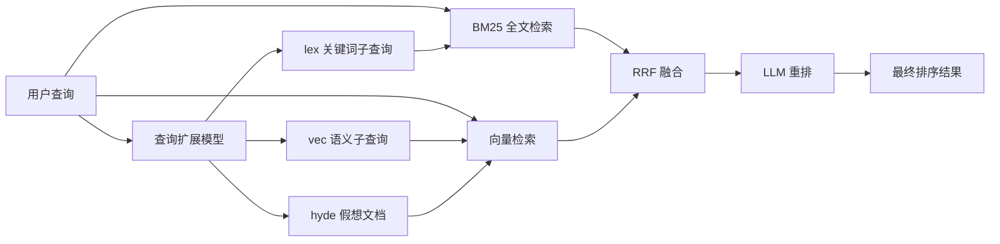

本地文档搜索并不缺工具，缺的是另一件事：把"查询扩展、多路召回、融合排序、LLM 重排"这条真正决定检索质量的完整管线，在不碰任何云服务的前提下跑起来。QMD（Query Markup Documents）把这条管线整体塞进一台笔记本——SQLite 存索引，sqlite-vec 存向量，三个合计约 2GB 的 GGUF 模型分别负责嵌入、重排和查询扩展，全部经 node-llama-cpp 在本地推理。仓库描述里那句 "Tracking current sota approaches while being all local"（跟进当下最好的检索做法，同时保持全本地），就是这个项目的全部野心。

它的第二个身份是 Agent 检索后端。每条搜索结果都带稳定的 docid（`#abc123` 形式的六位哈希）、`qmd://collection/path` 虚拟路径和行号锚点，输出格式专门为机器消费设计；官方同时交付 MCP server、Claude Code 插件和一套 Agent 技能文件。也就是说，它不只是"人用的 grep 替代品"，而是按"让 LLM 拿着检索结果回答问题"来设计的。

资料口径：本文初版发布于 2026-04-06，当时项目最新版本为 v2.1.0；现在的内容按 2026-10-05 复核的 main 分支与 npm 最新版 v2.8.3（2026-08-16 发布）全面重写，机制描述以当次 README 和源码为准。文中单独标注了哪些能力尚未进正式版。项目由 Shopify 联合创始人 Tobi Lütke 开源，MIT 许可，2026-10-05 读数为 30,188 stars、1,888 forks。

## 系统地图：三个入口、三个模型、四套接口

QMD 的结构可以压缩成一张图：



三个搜索入口的分工：

| 命令 | 路径 | 依赖模型 | 什么时候用 |
|------|------|---------|-----------|
| `qmd search` | BM25 全文（SQLite FTS5） | 无 | 已知确切的词、代号、标题、罕见短语 |
| `qmd vsearch` | 向量相似（sqlite-vec） | 嵌入模型 | 换一种说法的概念召回 |
| `qmd query` | 扩展 + 双路 + RRF + 重排 | 三个全部 | 质量优先时的默认选择 |

`vsearch` 和 `query` 各有一个别名（`vector-search`、`deep-search`），源码注释标注为 undocumented alias，日常不必用。

三个本地模型在首次使用时自动从 HuggingFace 下载，缓存在 `~/.cache/qmd/models/`：

| 模型 | 职责 | 体积（官方标注） |
|------|------|-----------------|
| `embeddinggemma-300M-Q8_0` | 查询与文档块嵌入（默认） | ~300MB |
| `qwen3-reranker-0.6b-q8_0` | 对候选逐个做 yes/no 重排 | ~640MB |
| `qmd-query-expansion-1.7B-q4_k_m` | 生成 typed 子查询（作者微调） | ~1.1GB |

所有状态落在两个位置：索引是 `~/.cache/qmd/index.sqlite` 一个文件，内部七张表——`collections`（集合注册）、`path_contexts`（上下文描述）、`documents`（正文与 docid）、`documents_fts`（FTS5 全文索引）、`content_vectors`（嵌入块）、`vectors_vec`（sqlite-vec 向量索引）、`llm_cache`（扩展与重排的 LLM 响应缓存）。配置是 `~/.config/qmd/index.yml`，一份 YAML。

对外有四套接口：CLI、TypeScript SDK（`@tobilu/qmd`）、MCP server、HTTP 端点。后文分别展开。

## 查询文档：把"怎么问"当成一等输入

QMD 里最值得琢磨的设计是查询本身的结构。`docs/SYNTAX.md` 把一次查询定义成"查询文档"：可以是一行裸文本，也可以是多行的 typed 行——`intent:` 说明意图，`lex:` 给关键词子查询，`vec:` 给语义子查询，`hyde:` 给一段"理想答案长什么样"的假想文档（即 HyDE，Hypothetical Document Embeddings，arXiv:2212.10496）。

```text
intent: Find the concept note about metrics as instruments without letting OKRs replace judgment.
lex: cockpit instruments OKR Goodhart metrics judgment
vec: data informed not metric driven product judgment
hyde: A concept note says metrics are useful like cockpit instruments, but leaders
should remain data-informed rather than metric-driven because OKRs and dashboards
can Goodhart product judgment.
```

这个例子逐字来自仓库自带的 Agent 技能文件（`skills/qmd/SKILL.md`），那里面有一句相当直白的判断："You are a better query expander than the built-in model"——你比内置扩展模型更清楚用户真正想要什么、领域词汇是什么、哪些是"看起来相关其实不对"的概念。所以官方对 Agent 的建议是：别把用户的原话直接丢给 `qmd query` 指望扩展模型猜对，自己写 `intent:` 和 `lex:`。

当确实让模型来扩展时（单行裸文本查询，或用户手写 `expand:`），内部流程是确定的：查询交给微调过的 1.7B 模型，输出被一条 GBNF 语法硬约束成 `lex:/vec:/hyde:` 行格式（`src/llm.ts` 里的 grammar 定义只允许这三个前缀），采样参数取 Qwen3 非思考模式的推荐值（temperature 0.7、topK 20、topP 0.8）。格式错误的可能性被语法消掉了，剩下的解析逻辑只做过滤。

这个 1.7B 扩展模型是 Tobi 自己训的：基座 Qwen3-1.7B，仓库里的 `finetune/` 目录完整保留了训练管线——SFT 数据集、评估脚本、GRPO 与 GEPA 实验、GGUF 转换脚本。`finetune/README.md` 自述 SFT 一轮约 45 分钟 A10G、成本约 $1.50，属于"小模型 + 任务足够窄"的典型做法。

lex 子查询有一套自己的小语法：`word` 是前缀匹配（`perf` 能命中 performance）、`"exact phrase"` 短语精确匹配、`-term` 和 `-"phrase"` 排除。vec/hyde 子查询则必须是自然语言——源码会显式拒绝在 vec/hyde 里用 `-` 排除语法，提示"用 lex 做排除"。

## 从多路召回到最终排序

`qmd query` 的完整管线有七步，每一步的参数都能在源码或 README 里找到：

1. **BM25 探针**。先跑一次原始查询的 FTS 搜索；如果最高分不低于 0.85 且领先第二名 0.15 以上（`src/store.ts` 的 `STRONG_SIGNAL_MIN_SCORE` 和 `STRONG_SIGNAL_MIN_GAP`），直接认为关键词已经命中，跳过昂贵的 LLM 扩展。显式给了 `intent` 时这个旁路失效——"performance"这个词的强信号匹配，可能恰恰不是带着"网页加载耗时"意图的调用方想要的。
2. **类型路由**。原始查询同时进 FTS 和向量两路；`lex` 子查询只走 FTS，`vec`/`hyde` 只走向量。所有待嵌入文本（原始查询 + vec/hyde 子查询）合并成一次 `embedBatch()` 调用，省掉多次模型往返。
3. **RRF 融合**。所有结果列表用 Reciprocal Rank Fusion 合并，`score = Σ(1/(k+rank+1))`，k=60；原始查询的列表权重 2.0，扩展列表 1.0。这个权重分配是 v2.5.x 一轮修复（issue #591）的产物——此前"首条 lex 扩展"会意外抢走本该属于原始查询的加权。
4. **头名加分**。在任何一条列表里排第一的文档加 0.05，第二三名加 0.02。README 解释了动机：纯 RRF 会在扩展查询不命中时稀释精确匹配，加分保住"原始查询的头名"。
5. **截取候选**。取前 40 个候选进重排（源码常量 `RERANK_CANDIDATE_LIMIT = 40`，CLI 可用 `-C/--candidate-limit` 调整）。README 的 ASCII 架构图里仍写着 "Top 30 Kept"，图滞后于代码，以源码为准。
6. **块级重排**。重排打分的是文档里与查询最相关的块，而不是全文——源码注释原话称之为 "O(tokens) trap"，对全文重排是给 1 万 token 而不是 1 千 token 付费。
7. **位置感知混合**。按 RRF 排名分段加权：第 1-3 名 75% 检索分 + 25% 重排分（保住精确匹配），第 4-10 名 60/40，第 11 名以后 40/60（更信任重排器）。

最终分数可以按这张表读（README 口径）：

| 分数段 | 含义 |
|--------|------|
| 0.8 - 1.0 | 高度相关 |
| 0.5 - 0.8 | 中度相关 |
| 0.2 - 0.5 | 弱相关 |
| 0.0 - 0.2 | 基本不相关 |

想知道每个结果为什么是这个分数，加 `--explain`：JSON 输出会带上每条列表的 FTS/向量得分、RRF 的 rank/weight/bonus 和每条子查询的贡献明细。调检索质量时先看这个，比猜参数有效。

## 索引侧：collection、context 与切块

索引的入口是集合。`qmd collection add ~/notes --name notes` 把一个目录注册进 `index.yml`，默认 glob 是 `**/*.md`，可用 `--mask` 改写（逗号分隔或 `{a,b}` 花括号都是并集）。内置排除 `node_modules`、`.git`、`.cache`、`vendor`、`dist`、`build`，且不可解除；另有 YAML 层的 `ignore` 字段处理"集合嵌套集合"这类情况。

索引刷新是显式的，没有后台文件监听进程。`qmd update` 扫描文件系统，按内容哈希比对，只处理新增、修改和删除的文件，并报告各集合的 indexed/updated/unchanged/removed 计数。每个集合可以配一个 `update` 命令（如 `git pull --rebase`），在每次 `qmd update` 时先于重索引执行——命令通过 `bash -c` 在集合自己的目录里跑，非零退出会中止整轮更新。顺带一提，早期 README 宣传过 `qmd update --pull`，v2.6.3 的更新日志承认这个 flag "被解析但从未被消费"（parsed but never consumed），真正机制就是 per-collection 的 update 命令，误导性示例随之撤下。

`qmd context` 是官方反复强调的功能。它给集合或路径前缀挂一段描述文字，搜索命中子路径时随结果返回。README 在快速上手里写："This is the key feature of QMD as it allows LLMs to make much better contextual choices when selecting documents. Don't sleep on it!"——对 Agent 场景，这段描述就是"这条命中大概是什么"的先验。context 按 `qmd://` 虚拟路径组织成树：`qmd context add qmd://notes "Personal notes and ideas"` 挂整个集合，`qmd context add qmd://notes/work "Work-related notes"` 挂子树，`qmd context add / "..."` 挂全局。

切块决定向量质量。QMD 不按固定 token 硬切，而是给 Markdown 的各类断点打分——一级标题 100 分、二级 90、代码围栏边界 80、水平线 60、空行 20、列表项 5、普通换行 1——临近 900 token 目标时回看一个 200 token 的窗口，按 `finalScore = baseScore × (1 − (distance/window)² × 0.7)` 选最高分断点下刀，块间留 15% 重叠。代码围栏内部不打断点，代码尽量保持完整。对代码文件（`.ts`/`.tsx`/`.js`/`.jsx`/`.py`/`.go`/`.rs`），`--chunk-strategy auto` 启用 tree-sitter 的 AST 切块，在类、函数、导入边界下刀（此能力为 v2.1.0 引入；缺 grammar 时自动回退正则切块）。

配置文件 `index.yml` 收拢了上面所有东西：`global_context`、`editor_uri`、`models`（embed/rerank/generate 三个角色的 HF URI 覆盖，解析顺序 config > 环境变量 > 内置默认）、每个集合的 `path`/`pattern`/`ignore`/`update`/`includeByDefault`/`context`。改完 `path`/`pattern`/`ignore` 要手动 `qmd update`，换 `models.embed` 要手动 `qmd embed -f`——改配置不会自动重索引。`qmd init` 可以在项目里建 `.qmd/` 目录，配置和索引都落在项目内而不是用户主目录。

## 一次检索任务流过 QMD 的完整路径

以官方技能文件演示的场景为准：在一份本地 wiki 里找"指标是有用的仪表盘，但别让 OKR 替你做判断"这条概念笔记。

建库与索引：

```sh
qmd collection add ~/wiki --name wiki
qmd context add qmd://wiki/concepts "产品理念与原则类笔记"
qmd embed          # 首次运行会下载三个模型，约 2GB
```

Agent 写一条结构化查询（示例来自 `skills/qmd/SKILL.md`）：

```sh
qmd query $'intent: Find the concept note about metrics as instruments without letting OKRs replace judgment.\nlex: cockpit instruments OKR Goodhart metrics judgment\nvec: data informed not metric driven product judgment\nhyde: A concept note says metrics are useful like cockpit instruments, but leaders should remain data-informed rather than metric-driven because OKRs and dashboards can Goodhart product judgment.'
```

命中的输出长这样（同样来自官方技能文件）：

```text
qmd://concepts/note.md  #abc123
---

1: # Metrics as instruments
2:
3: Treat dashboards like cockpit instruments...
```

每条结果自带 `qmd://` 路径、docid 和从 1 开始的行号。接下来取原文不需要任何外部工具，`get` 自己会切行窗口：

```sh
qmd get "#abc123:120:40"      # 从第 120 行读 40 行，docid 也支持同样后缀
qmd multi-get "#abc123,#def432" --format md
```

官方技能文件对这一步有明确纪律：不要 `qmd get ... | sed -n '120,160p'`——管道会丢掉 docid 解析、虚拟路径查找和行号头；引用答案时同时给 docid 和行号，下一轮追问可以直接切片。整个循环就是：查询拿线索 → `get`/`multi-get` 取全文 → 带出处回答。搜索结果里没有的事实不要用片段脑补，这是 SKILL.md 的原话逻辑（"Snippets are only leads"）。

## 给 Agent 用的四套接口

**CLI** 是第一接口，输出设计处处向机器倾斜：`--format` 统一选 cli/json/csv/md/xml/files（`--json` 等旧 flag 保留为别名）；非 TTY 环境自动去掉颜色和超链接转义；`get`/`multi-get` 默认带行号；`--full-path` 把 `qmd://` URI 换成磁盘绝对路径（文件已移动或删除的结果保留 URI 和 docid，并向 stderr 提示跑 `qmd update`）。`-c` 可重复传多个集合（OR 语义），官方提醒：多集合时结果出自一个全局 top-K 池再过滤，小集合可能被挤出默认条数，需要调大 `-n` 或用 `--all`。

**MCP server** 默认走 stdio，`qmd mcp` 即启动。npm v2.8.3 暴露四个工具：`query`（typed 子查询搜索）、`get`（按路径或 docid 取文档，支持 `#abc123:120:40` 形式）、`multi_get`（glob/逗号列表批量取）、`status`（索引健康与集合信息）。main 分支已加入第五个工具 `metadata`（元数据发现，见下文版本一节，尚未发版）。`query` 工具的参数表里最值得注意的是 `searches` 数组——一到十条 typed 子查询，第一条自动拿 2 倍权重——以及 `rerank` 默认开、`candidateLimit` 默认 40。

长期运行的场景用 HTTP 传输，避免每个客户端重复加载模型：`qmd mcp --http` 监听 8181（`--port` 可改，`--daemon` 后台化，`qmd mcp stop` 按 PID 文件停止）。端点有 `POST /mcp`（MCP Streamable HTTP）、`POST /query`（免 MCP 协议的结构化搜索）、`GET /health`。模型常驻显存，嵌入/重排上下文闲置 5 分钟后回收，下个请求约 1 秒重建。

**Claude Code 插件**两条命令装完：

```sh
claude plugin marketplace add tobi/qmd
claude plugin install qmd@qmd
```

仓库的 `.claude-plugin/marketplace.json` 同时注册了 `qmd` 技能和 MCP server 条目，装完即用；Claude Desktop 则在配置文件里手动加 `mcpServers` 条目（`command: "qmd"`, `args: ["mcp"]`）。

**SDK** 面向 Node.js/Bun 应用：`import { createStore } from '@tobilu/qmd'`，支持内联配置、YAML 配置文件、纯重开三种模式。`dbPath` 是显式必填——官方说明这是为了避免库带着隐式副作用嵌进别人的应用。SDK 与 CLI 共享同一套 `search`/`searchLex`/`searchVector`/`get`/`multiGet`/`update`/`embed` 接口和类型定义。

v2.5.0 起还有一组 `qmd skills`/`qmd skill` 命令：从安装的 CLI 里输出与当前版本匹配的技能指令，`qmd skill install` 写入一个稳定的发现桩（discovery stub），QMD 升级后 Agent 读到的用法说明不会过期。

## 检索质量自测：qmd bench 该怎么读

QMD 自带基准命令 `qmd bench`，读它的数字之前先回答三个问题。

**测的是什么？** 一份 JSON 夹具（每条含 query、expected_files、expected_in_top_k）跑四个后端——`bm25`（纯关键词）、`vector`（纯语义）、`hybrid`（BM25+向量融合，无重排）、`full`（完整管线含 LLM 重排）——报 precision@k、recall、MRR、F1。

**数字反映系统的哪部分？** README 给的示例夹具典型读数是 bm25 约 0.50、vector 约 0.70、hybrid 和 full 约 1.00。从 bm25 到 vector 的提升来自嵌入模型的语义召回，从 hybrid 到 full 的提升主要来自 RRF 融合与重排——也就是说，这套管线里"融合与重排"环节对最终排序的贡献，比换嵌入模型更大。

**不能推出什么？** 这些读数来自仓库自带的示例夹具和 `test/eval-docs/` 测试语料，属于官方自报口径，且两者只存在于 git checkout——npm 安装包不包含，用户要自带夹具对着自己的集合跑。另外官方给了一个 heads-up：夹具指向的集合没建索引时，bench 会跑完并全部报零，没有任何警告，跑之前先用 `qmd ls` 确认。

## 安全模型：卖"本地"就要守住本地

"数据不出机器"是 QMD 的卖点，但 v2.8.3（2026-08-16）整版都在补本地图景下的安全洞，这说明作者清楚"本地"不等于"无攻击面"。三件事值得所有本地工具作者参考：

**项目内配置不可信。** `.qmd/index.yml` 会随 `git clone` 落地，在其中任何目录里跑 QMD 都会自动采纳它——而配置里的 `update` 命令是别人写的 shell 脚本。修复前，"克隆一个仓库然后跑 qmd update"等于执行了仓库作者选定的任意命令。现在终端会列出这些受门控字段并询问；没有终端可问（Agent、CI）就跳过并继续索引项目内文件。批准记录在 `~/.config/qmd/trusted.json`，改一个字符就要重新批。`qmd trust`/`trust list`/`trust revoke` 管理审批，`QMD_TRUST_LOCAL_CONFIG=1` 供 CI 显式放行。同一道门也罩住了指向项目外的集合路径和非默认模型 URI。

**HTTP 端口防 DNS rebinding。** 绑定 localhost 挡不住用户自己的浏览器：恶意网页可以把域名解析指到 127.0.0.1，借浏览器之手读取本机索引。修复后每个请求都校验 `Origin` 和 `Host` 头，非回环地址一律 403；curl 和 MCP 客户端这类不带 Origin 的请求不受影响。例外放行走 `QMD_ALLOWED_ORIGINS`/`QMD_ALLOWED_HOSTS`。注意 `--host 0.0.0.0` 会跳过 Host 校验并在启动时警告——HTTP 端点本身无鉴权，暴露到外网前必须自己加认证层。

**路径逃逸封堵。** 索引不再跟随文件符号链接，glob 的 `../` 和绝对路径模式也无法越出集合目录；`qmd://collection/../../../etc/passwd` 这类虚拟路径在解析时做同样的围栏检查。

## 版本漂移：发文时的 v2.1.0 与今天的差别

QMD 迭代很快，把版本线摆出来有助于判断旧资料的时效性：

| 版本 | 日期 | 主线 |
|------|------|------|
| 0.1.0 | 2025-12-07 | CHANGELOG 首个条目，项目起步 |
| 1.0.0 | 2026-02-15 | npm 包首发（`@tobilu/qmd`） |
| 2.0.0 | 2026-03-10 | 架构整备 |
| 2.1.0 | 2026-04-05 | AST 切块、`qmd bench`、`models:` 配置段、OSC 8 可点击链接、`--no-rerank` |
| 2.5.0-2.5.3 | 2026-05 | `qmd skills`/`skill`、`qmd doctor` 诊断、Windows 启动器重写、npm Trusted Publishing、`get :from:count`、默认行号、`--format` 统一 |
| 2.6.3 | 2026-06-24 | `index.yml` 文档化、update 钩子文档化、撤下假的 `--pull` 示例、`embed --timeout` |
| 2.8.3 | 2026-08-16 | 安全专项：信任门、DNS rebinding 防护、路径逃逸封堵；MCP SDK 2.x、node-llama-cpp 3.20 |
| Unreleased | — | 文档元数据过滤与发现（见下） |

热度轨迹：GitHub 存档实拍 2026-04-07 为 19,247 stars，2026-10-05 为 30,188 stars，半年间涨了超过一半；npm 包 2026-02-15 首发至今发了 16 个版本。

两处"文档与代码不同步"的现场，查资料时值得知道：README 的 ASCII 架构图仍写截取前 30 候选，源码常量已是 40；多文档批量获取的默认单文件上限从 10KB 提到了 64KB（`DEFAULT_MULTI_GET_MAX_BYTES`），旧文若写 10KB 即已过期。

Unreleased 里的元数据功能是一个方向性变化：文档可以在 frontmatter 的 `qmd.metadata` 块里声明类型化元数据（字符串、数字、布尔、同构数组），所有搜索面（CLI/SDK/MCP/HTTP）共用一套 `operator` 判别的递归过滤 AST——`eq/ne/gt/gte/lt/lte`、`in/nin/all`、`contains/prefix/suffix`、`type`、`exists` 加 `and/or/not` 组合，过滤发生在 RRF 融合与重排之前；配套的发现命令（`qmd collection metadata`）报告索引里实际存在的键、类型和值分布，让过滤器"照着索引写而不是猜"。这批能力截至复核日只在 main 分支，npm latest 2.8.3 未包含，先用上的办法是等发版或从源码跑。

## 采用建议与边界

适合先上：

- 数据敏感的个人知识库、团队 wiki、会议记录、客户资料——要语义检索又不能出本地的场景，QMD 目前几乎是把完整管线装进笔记本的最省心选项；
- 要给 coding agent 或知识 agent 配检索后端的团队——docid、行号、`qmd://` URI、MCP、版本匹配的技能文件，这条链路是按 Agent 消费设计的，不用自己糊；
- 想读一个"小而全"的混合检索实现的人——RRF、位置感知混合、HyDE、GBNF 约束、小模型微调管线全部有源码可读，`finetune/` 连训练成本都写明了。

先等等或有替代路径：

- 要索引 PDF、Word、EPUB——没有解析层，默认 glob 只收 `**/*.md`，代码文件可用 `--mask` 纳入并由 AST 切块处理，二进制文档需要先自建转换管道；
- 中文语料——默认的 embeddinggemma 官方自述为英文优化、CJK 覆盖有限，README 给的解法是 `QMD_EMBED_MODEL` 换 Qwen3-Embedding-0.6B（官方标注支持 119 种语言）并 `qmd embed -f` 全量重嵌，换模型是必要动作而不是可选项；
- 想服务多人或部署成内网搜索——HTTP 端点无鉴权，`--host 0.0.0.0` 需要自己在前面加认证层；它的设计单位是"一个人和他的机器"；
- 找 `pip install qmd` 的人——PyPI 上的 `qmd` 包（v0.1.2，2026-04-16 上架）是社区 Python 移植，命令面与官方 CLI 不同，且其元数据指向的仓库已迁移；官方发行渠道只有 npm 的 `@tobilu/qmd`。

落地顺序建议：装好先对一两个真实目录建集合、写 context、跑 `qmd query` 看质量，再接 Claude Code 插件；确认日常可用后用 `qmd mcp --http --daemon` 常驻；上量之前自建 bench 夹具测一遍。前置条件记住三条：Node 22+（或 Bun 1.0+）、macOS 需要 Homebrew SQLite（扩展加载需要）、首次使用合计约 2GB 的模型下载；Windows 可用（启动器已在 v2.5.2 重写，CUDA 场景注意 `QMD_EMBED_PARALLELISM` 默认串行）。

回头看，QMD 的价值不在"又一个本地搜索工具"，而在于它验证了一个判断：2025-2026 年检索圈收敛出的那套做法——查询扩展、多路召回、RRF、LLM 重排——并不天然属于云服务，用三个小模型加一个 SQLite 文件就能整体搬回本地，而且可以把"给 Agent 用"当成一等设计约束。对被云端 RAG 锁住的团队，这是一个值得认真评估的对照组。
