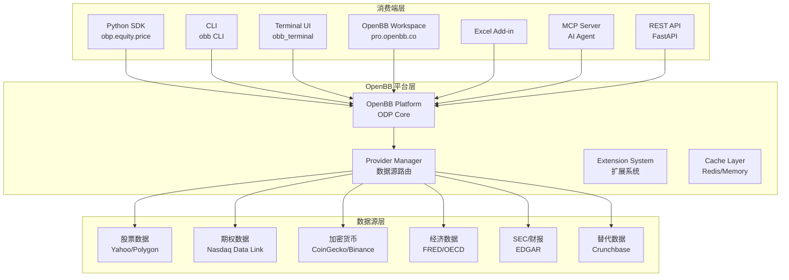
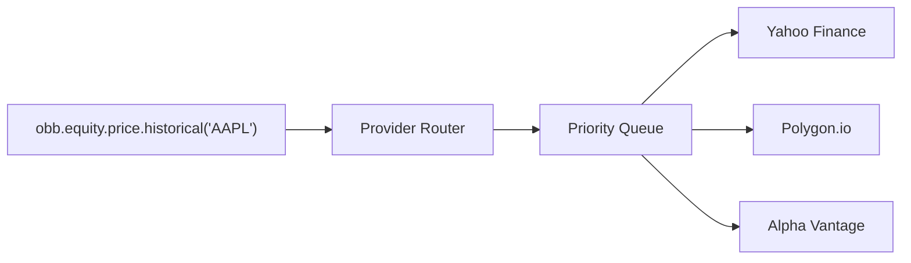

# OpenBB：开源金融数据平台专家级技术文档

> **目标读者**：想要掌握 OpenBB 的数据工程师、量化分析师和 AI 应用开发者
> **核心问题**：OpenBB 是什么？如何设计架构？如何集成到自己的应用？

---

## 1. 学习目标

完成本文档后，你将掌握：

- ✅ 理解 OpenBB 作为开源金融数据平台的核心定位与适用场景
- ✅ 掌握 OpenBB 的模块化架构（ODP 核心、Python SDK、CLI、Terminal、Workspace）
- ✅ 能够独立完成安装配置和数据查询
- ✅ 学会将 OpenBB 集成到 AI Agent 和量化策略
- ✅ 掌握自定义数据 Provider 和扩展开发
- ✅ 了解 OpenBB 与 Bloomberg、Wind 等竞品的核心差异

---

## 2. 原理分析

### 2.1 什么是 OpenBB？

**OpenBB** 是**开源金融数据平台**（Open Data Platform，简称 ODP），由 OpenBB Finance 开发维护。它帮助数据工程师将专有数据、受许可数据 和 公共数据源集成到下游应用（如 AI Copilot 和研究仪表板）。

> 💡 **类比理解**：把 OpenBB 想象成一个「金融数据的瑞士军刀」——它统一了散落在各处的数据源（股票、期权、加密货币、经济数据等），让你只需要「连接一次，到处使用」。

### 2.2 OpenBB 的核心定位

| 维度 | OpenBB | Bloomberg | Wind | QuantConnect |
|------|---------|-----------|------|--------------|
| **许可证** | AGPLv3（开源） | 专有 | 专有 | 专有/部分开源 |
| **成本** | 免费 | 年费数万 | 年费数万 | 按需付费 |
| **部署方式** | 本地/云端 | 专有终端 | 专有终端 | 云端 |
| **数据覆盖** | 股票/期权/加密/经济 | 最全面 | A股最全 | 股票/期权 |
| **API 优先** | ✅ REST API + Python | ✅ API | ✅ API | ✅ API |
| **AI Agent 支持** | ✅ MCP 原生 | ❌ | ❌ | ❌ |
| **开源可扩展** | ✅ 完全开源 | ❌ | ❌ | 部分 |

### 2.3 为什么选择 OpenBB？

**OpenBB 解决的核心问题**：

1. **数据源碎片化**：金融数据散落在多个提供商（Yahoo Finance、Alpha Vantage、各交易所），OpenBB 提供统一接口。
2. **高昂数据成本**：Bloomberg Terminal 年费数万美元，OpenBB 免费提供大部分数据。
3. **AI Agent 集成困难**：传统金融 API 不支持 AI Agent，OpenBB 原生支持 MCP（Model Context Protocol）。
4. **部署复杂**：OpenBB 支持本地 Docker、一键云部署，5 分钟即可运行。

**OpenBB 的设计哲学**：

> "Connect once, consume everywhere" — 连接一次，到处使用

OpenBB 坚持开源优先，代码完全透明，社区驱动开发。ODP 作为「连接层」，将数据统一封装，暴露给多种消费端：Python 环境、Terminal、Workspace、Excel、MCP Server、REST API。

### 2.4 OpenBB 的技术边界

| 能力 | OpenBB 支持 | OpenBB 不支持 |
|------|-------------|---------------|
| 股票数据 | ✅ 美股/A股/港股/欧股 | 实时 Level 2 行情 |
| 期权数据 | ✅ 全美期权链 | 复杂希腊字母计算 |
| 加密货币 | ✅ 主流交易所 | 合约/杠杆数据 |
| 经济数据 | ✅ 宏观经济指标 | 实时央行利率 |
| SEC/财报 | ✅ EDGAR 自动下载 | 人工审核文件 |
| AI Agent | ✅ MCP 原生支持 | LangChain 官方集成 |
| 量化策略回测 | ❌ 需集成 Backtrader | 自有回测引擎 |

---

## 3. 架构分析

### 3.1 整体架构

OpenBB 采用经典的**分层架构**：



### 3.2 核心技术栈

| 组件 | 技术选型 | 说明 |
|------|---------|------|
| **语言** | Python 100% | 金融量化首选 |
| **Web 框架** | FastAPI | REST API 基于 Uvicorn |
| **数据处理** | Pandas | 金融数据DataFrame |
| **异步** | asyncio | 高并发数据获取 |
| **缓存** | Redis | 可选，本地默认内存 |
| **协议** | MCP | AI Agent 通信标准 |
| **桌面** | PyQt/Streamlit | Terminal 和 Workspace |

### 3.3 目录结构

```
OpenBB/
├── openbb_platform/         # 核心平台（ODP）
│   └── openbb/
│       ├── core/           # 核心架构
│       │   ├── extension/   # 扩展系统
│       │   ├── model/       # 数据模型
│       │   ├── provider/    # Provider 基类
│       │   └── query/       # 查询路由
│       ├── standard/        # 标准数据格式
│       └── assets/          # 静态资源
├── cli/                    # CLI 包
│   └── openbb_cli/
├── terminal/               # Terminal UI
├── workspace/              # Enterprise Workspace (专有)
├── desktop/               # Desktop 应用
├── examples/              # 示例代码
├── extensions/            # 官方扩展
│   ├── openbb-polygon/
│   ├── openbb-coingecko/
│   ├── openbb-fred/
│   └── ...
├── docs/                  # 文档
├── pyproject.toml         # 项目配置
└── Dockerfile
```

### 3.4 数据模型

OpenBB 使用**标准化数据格式**（Standard Data Format）：

```python
from openbb import obb

# 获取股票数据，返回 Standard DataFrame
result = obb.equity.price.historical("AAPL")
print(result.data)  # Pandas DataFrame

# 获取期权链
options = obb.options.chains("AAPL")
print(options.data)
```

**标准化优势**：

- 统一接口：不同数据源使用相同格式
- 类型安全：Pydantic 模型验证
- 可缓存：标准化格式便于缓存

### 3.5 Provider 系统

OpenBB 的数据来自多个 **Provider**（数据提供商）：



**Provider 配置示例**（`~/.openbb_provider.json`）：

```json
{
  "polygon": {
    "api_key": "YOUR_POLYGON_API_KEY"
  },
  "fmp": {
    "api_key": "YOUR_FMP_API_KEY"
  }
}
```

---

## 4. 功能详解

### 4.1 Python SDK：核心接口

**Python SDK** 是 OpenBB 的核心，提供统一的数据访问接口：

```python
from openbb import obb

# 股票数据
stocks = obb.equity.price.historical(
    symbol="AAPL",
    start_date="2024-01-01",
    end_date="2024-12-31"
)
df = stocks.to_dataframe()

# 期权数据
options = obb.options.chains("AAPL")
puts = options.data[options.data.type == "put"]

# 加密货币
crypto = obb.crypto.price.historical("BTC")
btc_usd = crypto.to_dataframe()

# 经济指标
gdp = obb.economy.gdp(country="USA")
```

### 4.2 CLI：命令行工具

**OpenBB CLI** 是终端用户界面：

```bash
# 安装
pip install openbb-cli

# 启动 CLI
obb

# 常用命令
obb stocks AAPL            # 查看股票
obb options AAPL           # 查看期权
obb crypto BTC             # 查看加密货币
obb economy gdp            # 查看 GDP
obb forecast aapl          # AI 预测
```

### 4.3 MCP Server：AI Agent 集成

**MCP Server** 让 AI Agent 可以调用 OpenBB 数据：

```bash
# 启动 MCP Server
openbb-mcp

# 配置 Claude Desktop
# ~/Library/Application Support/Claude/claude_desktop_config.json
{
  "mcpServers": {
    "openbb": {
      "command": "openbb-mcp"
    }
  }
}
```

**在 Claude Code 中使用**：

```
User: Get me the latest stock price for AAPL

Claude: (调用 openbb_mcp_get_stock_price with symbol="AAPL")
Result: AAPL is trading at $178.50, up 1.2% today.
```

### 4.4 REST API：应用集成

**REST API** 允许任何应用通过 HTTP 访问 OpenBB 数据：

```bash
# 启动 API Server
openbb-api

# 访问 http://127.0.0.1:6900

# REST 调用
curl http://127.0.0.1:6900/api/v1/equity/price?symbol=AAPL
```

**FastAPI 自动生成文档**：http://127.0.0.1:6900/docs

### 4.5 量化分析工具

OpenBB 内置量化分析工具：

| 工具 | 功能 | 示例 |
|------|------|------|
| **技术指标** | MA/RSI/MACD | `obb.equity.price.target("AAPL")` |
| **财务因子** | PE/ROE/ROA | `obb.equity.fa.ratios("AAPL")` |
| **情绪分析** | 新闻/社交媒体 | `obb.news("AAPL")` |
| **预测模型** | LSTM/ARIMA | `obb.forecast(aapl_data)` |

---

## 5. 使用说明

### 5.1 环境准备

**前置要求**：

| 依赖 | 版本要求 | 说明 |
|------|---------|------|
| Python | 3.9 - 3.12 | 推荐 3.11 |
| pip | ≥20.x | 包管理器 |
| Docker | ≥20.x | 可选，容器部署 |

### 5.2 安装方式

**方式一：pip 安装（推荐）**：

```bash
# 基础安装
pip install openbb

# 完整安装（含所有 Provider）
pip install "openbb[all]"

# CLI 单独安装
pip install openbb-cli
```

**方式二：从源码安装**：

```bash
# 克隆代码仓库
git clone https://github.com/OpenBB-finance/OpenBB.git
cd OpenBB

# 安装
pip install -e openbb_platform
pip install -e cli
```

**方式三：Docker 部署**：

```bash
# 拉取镜像
docker pull openbb/openbb-platform

# 运行容器
docker run -p 6900:6900 openbb/openbb-platform
```

### 5.3 快速开始

**第一步：安装**：

```bash
pip install openbb
```

**第二步：查询数据**：

```python
from openbb import obb

# 获取苹果公司股票数据
result = obb.equity.price.historical("AAPL")
print(result.to_dataframe())
```

**第三步：启动 API Server**：

```bash
openbb-api
# 访问 http://127.0.0.1:6900/docs
```

### 5.4 Provider 配置

OpenBB 支持多个数据 Provider，默认使用免费 Provider：

| Provider | 免费额度 | 数据范围 |
|----------|----------|----------|
| **Yahoo Finance** | 无限 | 股票/ETF/加密 |
| **Alpha Vantage** | 25次/天 | 股票/FX/指标 |
| **Polygon** | 需 API Key | 全美股票/期权 |
| **CoinGecko** | 10-50次/分 | 加密货币 |
| **FRED** | 无限 | 美国经济数据 |

**配置 API Key**：

```bash
# 方式一：环境变量
export OPENBB_POLYGON_API_KEY="your_key"

# 方式二：配置文件
# ~/.openbb_provider.json
{
  "polygon": {
    "api_key": "your_key"
  }
}
```

### 5.5 OpenBB Workspace

**OpenBB Workspace**（pro.openbb.co）是企业级 UI：

1. 注册账号：https://pro.openbb.co
2. 连接 ODP Backend：

```bash
# 启动本地 Backend
openbb-api

# 在 Workspace 中添加 Backend
# Settings → Connect Backend → http://127.0.0.1:6900
```

3. 开始使用可视化界面

---

## 6. 开发扩展

### 6.1 自定义 Provider

扩展 OpenBB 支持新的数据源：

```python
# openbb_platform/openbb/my_provider/
from openbb.core.provider import Provider
from openbb.core.model import Model
from pydantic import BaseModel

class MyProviderModels(BaseModel):
    stock_data: pd.DataFrame

class MyProvider(Provider):
    name = "my_provider"
    
    @staticmethod
    def get_stock_data(symbol: str) -> pd.DataFrame:
        # 实现数据获取逻辑
        response = requests.get(f"https://api.myprovider.com/{symbol}")
        return pd.DataFrame(response.json())
```

### 6.2 创建 Extension

使用 Cookiecutter 创建扩展：

```bash
# 安装 Cookiecutter
pip install cookiecutter

# 创建扩展模板
cookiecutter gh:OpenBB-finance/openbb-cookiecutter

# 填写信息
# project_name: openbb-mystocks
# provider_name: mystocks
# description: My custom stock data provider
```

### 6.3 AI Agent 集成

将 OpenBB 集成到自定义 AI Agent：

```python
from openbb import obb
from agent import Agent

class FinanceAgent(Agent):
    def __init__(self):
        super().__init__()
        self.openbb = obb
    
    def handle_price_query(self, symbol: str) -> str:
        data = self.openbb.equity.price.historical(symbol)
        return f"{symbol} 最新价格: ${data['close'].iloc[-1]:.2f}"
    
    def handle_options_query(self, symbol: str) -> str:
        chains = self.openbb.options.chains(symbol)
        # 处理期权查询
        return formatted_chains
```

---

## 7. 最佳实践

### 7.1 生产环境部署

**使用 Docker Compose**：

```yaml
# docker-compose.yml
version: '3.8'
services:
  openbb-api:
    image: openbb/openbb-platform
    container_name: openbb-api
    ports:
      - "6900:6900"
    environment:
      - OPENBB_POLYGON_API_KEY=${POLYGON_API_KEY}
    volumes:
      - ~/.openbb_provider.json:/app/provider.json
    restart: unless-stopped
```

```bash
# 启动
docker-compose up -d

# 查看日志
docker logs -f openbb-api
```

**使用 systemd（Linux）**：

```bash
# /etc/systemd/system/openbb-api.service
[Unit]
Description=OpenBB API Server
After=network.target

[Service]
Type=simple
User=openbb
WorkingDirectory=/home/openbb
ExecStart=/usr/local/bin/openbb-api
Restart=always

[Install]
WantedBy=multi-user.target
```

### 7.2 安全配置

```bash
# .env 文件
OPENBB_API_KEY=your_api_key
OPENBB_POLYGON_API_KEY=your_polygon_key
OPENBB_FMP_API_KEY=your_fmp_key

# API 安全
# 默认 localhost:6900，仅监听本地
# 生产环境使用 Nginx 反向代理 + HTTPS
```

**安全检查清单**：

- [ ] API Keys 存储在环境变量
- [ ] 生产环境启用 HTTPS
- [ ] 配置防火墙限制访问 IP
- [ ] 定期更新 OpenBB 到最新版本

### 7.3 性能优化

| 优化项 | 建议 | 实现方式 |
|--------|------|----------|
| **缓存** | 启用 Redis | `openbb-api --use-redis` |
| **并发限制** | 限制请求频率 | Nginx `limit_req_zone` |
| **数据压缩** | 启用 gzip | Nginx `gzip on` |
| **连接池** | 复用 HTTP 连接 | Requests Session |

---

## 8. 常见问题

### Q1: OpenBB 和 Bloomberg Terminal 有什么区别？

| 维度 | OpenBB | Bloomberg Terminal |
|------|---------|-------------------|
| **成本** | 免费开源 | 年费 $20k+ |
| **数据覆盖** | 基础数据为主 | 最全面 |
| **可定制性** | 完全开源可扩展 | 闭源有限定制 |
| **学习门槛** | 低（Python 优先） | 高（专有语言） |
| **AI Agent 支持** | ✅ MCP 原生 | ❌ 不支持 |

### Q2: 如何获取实时行情？

OpenBB 默认使用延迟数据（15 分钟）。获取实时数据：

1. 注册 Provider 账号（Polygon、Alpha Vantage 等）
2. 配置 API Key
3. 指定 Provider：

```python
obb.equity.price.historical(
    "AAPL",
    provider="polygon"  # 指定 Provider
)
```

### Q3: 支持 A 股数据吗？

✅ 支持。需要使用支持 A 股的 Provider：

```python
# 使用 AkShare（免费）
obb.equity.price.historical(
    "600519",  # 茅台
    provider="akshare"
)
```

### Q4: 如何贡献代码？

1. Fork 仓库
2. 创建分支：`git checkout -b feature/my-feature`
3. 开发并测试
4. 提交 PR：https://github.com/OpenBB-finance/OpenBB/pulls

---

## 9. 总结

### 核心要点

1. **OpenBB = 开源金融数据平台**：统一接口连接多种数据源
2. **"连接一次，到处使用"**：Python/CLI/Terminal/Workspace/MCP/REST API 多端消费
3. **AI Agent 原生支持**：MCP Server 让 AI 获取金融数据
4. **完全开源免费**：AGPLv3 许可证，代码完全透明
5. **模块化架构**：Provider 系统支持无限扩展

### 资源链接

| 资源 | 链接 |
|------|------|
| **GitHub 仓库** | https://github.com/OpenBB-finance/OpenBB |
| **官方文档** | https://docs.openbb.co |
| **PyPI 包** | https://pypi.org/project/openbb/ |
| **Workspace** | https://pro.openbb.co |
| **Discord 社区** | https://discord.com/invite/xPHTuHCmuV |
| **Twitter** | https://x.com/openbb_finance |

---

*文档信息：OpenBB v4 | 更新日期：2026-03-30 | 难度：⭐⭐⭐⭐*
