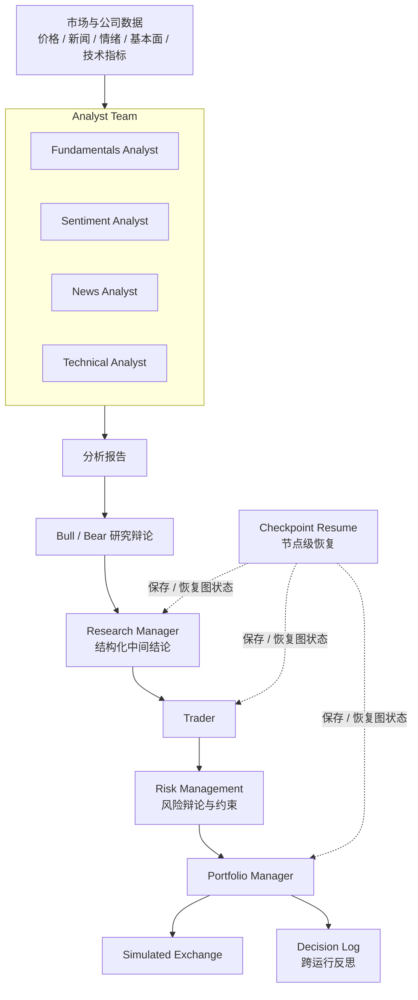

TradingAgents 最值得看的地方，不是“让一个 LLM 直接给出买卖建议”，而是把投研团队里原本混在一起的四件事拆开了：信息采集、观点对抗、交易决策、组合审批。到 2026 年 5 月公开的 `v0.2.5`，这个项目已经不只是论文配套 Demo。它有 CLI、Python 包、多提供商模型、LangGraph checkpoint、跨运行决策日志和 Docker；但它首先仍是研究框架，不是可以直接接券商账户的实盘执行系统。

本文按 2026-05-22 可公开核对的三份材料撰写：[GitHub README](https://github.com/TauricResearch/TradingAgents)、[CHANGELOG](https://github.com/TauricResearch/TradingAgents/blob/main/CHANGELOG.md) 与 [arXiv 论文](https://arxiv.org/abs/2412.20138)。仓库明说的内容按事实写；为了帮助理解而做的解释，我会明确写成“更稳妥的理解方式”，不把讲解误写成上游 API 承诺。

## 三分钟判断

如果你只是想先判断这个项目值不值得花时间，先看这张表：

| 问题 | 结论 |
| --- | --- |
| 它到底是什么 | 一个把分析、辩论、交易和审批串进 LangGraph 的研究型多智能体交易框架 |
| 最值得看的点 | 不是“模型会不会选股”，而是如何把角色分工、状态传递、恢复机制和历史反思放进一条可执行图 |
| 当前公开版本到了哪一步 | 到 `v0.2.5`，已有 CLI、Python API、Docker、多提供商模型、checkpoint resume、decision log 与更真实的 Sentiment Analyst |
| 不该高估什么 | 它没有把券商接入、合规、低延迟执行、实盘监控这些生产问题一并解决 |

如果你按目标跳读，可以直接这样看：

| 你的目标 | 建议优先阅读 |
| --- | --- |
| 快速理解设计思想 | “TradingAgents 真正解决的是什么问题” + “当前公开版本的系统地图” |
| 想知道论文结果该怎么看 | “论文里的实验结果该怎么读” |
| 准备安装体验 | “安装与第一次运行” |
| 想做二次开发 | “从源码入口看，二次开发该从哪里切入” |

## 读完本文后，你应该能回答这 6 个问题

- 为什么 TradingAgents 不适合被理解成“一个更长 Prompt 的交易机器人”。
- 分析师、研究员、交易员、风险团队和 Portfolio Manager 的边界分别在哪里。
- checkpoint 和 decision log 为什么不是一回事。
- 论文里的收益、Sharpe Ratio 和最大回撤改善，究竟能说明什么，不能说明什么。
- 当前公开版本该怎么安装、怎么跑，以及哪些旧资料已经过时。
- 如果要做二次开发，应该先从 `agents/`、`graph/` 还是 `default_config.py` 下手。

## TradingAgents 真正解决的是什么问题

单个 Prompt 在金融场景里最容易出问题的，不是“字写得不够多”，而是把本该分阶段处理的任务，硬塞进一次生成里。一次股票分析至少混着四类工作：拉数据、形成观点、处理冲突、给出可执行决策。把这四件事压在同一个上下文里，模型很容易出现一种表面上很完整、实则没有边界的回答。

TradingAgents 的思路，是把这些工作拆成不同角色，让它们在图里按顺序流动。这样做的价值，不是为了凑“多 Agent”这个热词，而是为了把交易团队里真实存在的分工关系做成可观察、可恢复、可替换的执行链。

| 交易任务 | 单个 Prompt 常见失真 | TradingAgents 的拆法 |
| --- | --- | --- |
| 多源信息采集 | 一次性混写价格、新闻、情绪和基本面，信息来源边界模糊 | 拆给 Fundamentals、Sentiment、News、Technical 四类分析师 |
| 观点冲突处理 | 模型倾向输出“看起来平衡”的结论，而不是真正做对抗 | 由 Bull / Bear 研究员做显式辩论 |
| 风险闸门 | 买卖建议和风险约束混在同一段话里，缺少否决机制 | 交易员先提案，再交给风险团队和 Portfolio Manager 审批 |
| 跨运行连续性 | 每次运行像一次全新对话，无法吸收上一次结果 | 新版本用 decision log 记录结果，并把同票历史反思带回后续运行 |

这也是为什么我更愿意把 TradingAgents 看成“研究型投研工作流框架”，而不是“会做交易的单模型应用”。更值得看的地方，在流程组织能力，不在单次回答的华丽程度。

## 当前公开版本的系统地图

先把资料来源拆开，否则很容易把论文叙述、README 介绍和仓库最新能力混写成一条线：

| 资料 | 能稳定确认什么 |
| --- | --- |
| [README](https://github.com/TauricResearch/TradingAgents) | 框架主线、安装方式、CLI、Python API、支持的提供商，以及“research purposes”的定位 |
| [CHANGELOG v0.2.4 / v0.2.5](https://github.com/TauricResearch/TradingAgents/blob/main/CHANGELOG.md) | structured output 决策链、checkpoint resume、decision log、grounded Sentiment Analyst、远端 Ollama、环境变量覆盖等新增能力 |
| [论文](https://arxiv.org/abs/2412.20138) | 为什么要用 trading firm 式角色分工，以及实验里关注的收益、Sharpe Ratio、最大回撤等指标 |

把这三类材料叠在一起，当前更稳妥的系统地图大致是这样：



上面这张图里，有两点需要特别说明：

1. README 的主图直接强调的是 Analysts、Researchers、Trader、Risk Management 和 Portfolio Manager。
2. `v0.2.4` 的 CHANGELOG 进一步说明，Research Manager、Trader、Portfolio Manager 已进入 structured-output 决策链；也就是说，公开版本的“决策中枢”已经不只是一个 Trader 节点在孤立地产生文本。

### 三条最容易混淆的边界

很多文章写这个项目时会把角色边界抹平，读起来顺，但理解会变浅。真正要先分清的是下面三条线：

1. **分析师不等于研究员。** 分析师负责产出原始观察，研究员负责拿这些观察打多空对抗。前者更像分领域情报员，后者更像质询者。
2. **Trader 不等于 Portfolio Manager。** Trader 负责形成交易提案，Portfolio Manager 负责最终批准或拒绝。能提案，不等于能落单。
3. **checkpoint 不等于 decision log。** checkpoint 解决的是“这次运行中断后怎么续上”；decision log 解决的是“下一次同票分析时，系统还记不记得过去做过什么、结果如何”。一个偏运行时恢复，一个偏跨运行学习。

### 最近两个版本最值得关注的变化

这篇文章原稿把重点停在 `v0.2.3`，现在已经偏旧了。对理解当前项目更关键的是后面两个版本：

| 版本 | 最值得关注的变化 | 为什么重要 |
| --- | --- | --- |
| `v0.2.4` | Research Manager / Trader / Portfolio Manager 的 structured output、checkpoint resume、persistent decision log、Docker | 项目从一次性实验脚本，迈向可恢复、可复盘、可部署的研究框架 |
| `v0.2.5` | grounded Sentiment Analyst、`TRADINGAGENTS_*` 环境变量覆盖、远端 `OLLAMA_BASE_URL`、非美股 alpha benchmark、ticker 路径安全加固 | 把“会跑”进一步收紧成“更少幻觉、更易配置、跨市场更稳、边界更安全” |

尤其是 `v0.2.5` 的 Sentiment Analyst，很值得单独提一句：CHANGELOG 明确写到，新版本会读取真实的 Yahoo News、StockTwits 和 Reddit 数据，替换掉旧流程里在提示压力下可能“编出社交帖子”的路径。对这种系统来说，这不是小修小补，而是在砍一条最危险的幻觉来源。

## 一次分析请求如何流过系统

如果你只盯着目录树，很容易把 TradingAgents 看成静态模块拼图。真正更有用的理解方式，是沿着一次请求走一遍。

假设你在 CLI 里分析 `NVDA` 某个交易日，并启用了 checkpoint：

```bash
tradingagents analyze --checkpoint
```

更稳妥的流转顺序可以这样理解：

1. CLI 先收集 ticker、分析日期、LLM provider、研究深度、输出语言等运行参数。
2. 图开始执行后，分析师团队分别拉取价格、新闻、情绪、基本面与技术指标相关输入，产出各自报告。
3. Bull / Bear 研究员围绕这些报告做结构化对抗，不是单纯把四份报告拼接起来。
4. 研究阶段的中间结论会进入更接近决策面向的节点。按 `v0.2.4` 之后的 CHANGELOG，这里已经有 Research Manager 的 structured output 链路。
5. Trader 基于研究结果给出交易方向、时机和仓位级别这类提案。
6. 风险团队再对提案做约束性审视。当前公开仓库里风险逻辑位于 `tradingagents/agents/risk_mgmt/`，它并不是一句“风控打个分”就能概括掉的单节点。
7. Portfolio Manager 做最终批准或拒绝；只有通过后，提案才会送往 simulated exchange。
8. 本次运行完成后，decision log 记下结论。下一次再分析同一个 ticker，系统会取回已兑现结果、alpha 对比和一段反思，把最近经验注入后续提示。
9. 如果运行中途崩溃，checkpoint 机制会让图从上一个成功节点恢复，而不是整条链重跑。

这一条流转线，正好解释了 TradingAgents 为什么比“多写几个 Agent 名字”更有意思。它把交易系统里原本经常被忽略的两件事一起做了：**一是显式分工，二是把状态留下来。**

## 论文里的实验结果该怎么读

论文摘要会告诉你，这套框架相对基线在 cumulative returns、Sharpe Ratio 和 maximum drawdown 上有改进。读到这里，最容易犯的错，是把“作者实验里更好”直接翻译成“实盘里更能赚钱”。这个跳跃太大了。

更稳妥的读法是看三件事：

| 你该问的问题 | 更稳妥的答案 |
| --- | --- |
| 这些实验主要在测什么 | 在作者设定的数据、时间窗口、模型和流程里，多角色拆分能否比单体或更弱基线得到更好的决策结果 |
| 数字变好更可能反映哪一部分 | 角色分工、辩论机制、风险约束和历史反思这些系统设计，可能确实改善了研究链条的稳定性 |
| 这些数字不能直接推出什么 | 不能直接推出真实市场里的稳定 alpha，也不能推出你换模型、换数据源、换市场后还能得到同样结果 |

换句话说，论文更像是在证明“这种组织方式值得研究”，而不是证明“这套开源仓库已经是成熟实盘系统”。对于 TradingAgents 这种项目，这种边界一定要写清。否则文章很容易从技术分析滑向投资暗示。

## 为什么这类系统偏爱 LangGraph

README 里明确写到，TradingAgents 用 LangGraph 来保证 flexibility 和 modularity。把这句话落到工程层面，它在这个项目里主要对上了四个具体需求：

| LangGraph 能力 | 在 TradingAgents 里的作用 |
| --- | --- |
| 图节点与显式边 | 把分析、辩论、交易、审批拆成可以追踪的阶段，而不是藏在一大段 Prompt 里 |
| 共享状态 | 让分析报告、辩论结果、风险判断这些中间结果在节点之间传递 |
| 条件逻辑 | 支撑多轮 debate、不同 provider、不同研究深度这类动态路径 |
| checkpoint 生态 | `v0.2.4` 以后可以做节点级恢复，而不是中断后整条链重跑 |

所以这里选 LangGraph，并不是因为“多智能体项目都该上图框架”，而是因为这套系统天然需要一个能表达分阶段流程、状态传递和恢复机制的执行骨架。金融研究工作流只是它的应用场景，核心挑战其实是工作流本身。

## 安装与第一次运行：按 `v0.2.5` 的公开接口来

这部分最容易被旧博客误导。我建议你直接按当前公开版本来，而不是按早期文章的截图记忆来。

### 最小安装

当前 `pyproject.toml` 显示的包版本是 `0.2.5`，`requires-python` 为 `>=3.10`。README 给出的最小安装流程仍然是下面这一套：

```bash
git clone https://github.com/TauricResearch/TradingAgents.git
cd TradingAgents

conda create -n tradingagents python=3.13
conda activate tradingagents

pip install .
```

如果你想先跑通，而不是先研究源码，这一步已经足够。

### CLI、Python API 与 Docker 都是公开主路径

| 入口 | 公开用法 | 适合谁 |
| --- | --- | --- |
| CLI | `tradingagents` 或 `python -m cli.main` | 先体验完整流程、看运行中状态展示 |
| Python API | `TradingAgentsGraph(...).propagate("NVDA", "2026-01-15")` | 想把它嵌进自己的实验脚本或 notebook |
| Docker | `docker compose run --rm tradingagents` | 想减少本地环境折腾，或者做更可复制的部署 |

README 里的 Python 入口仍然非常直接：

```python
from tradingagents.graph.trading_graph import TradingAgentsGraph
from tradingagents.default_config import DEFAULT_CONFIG

config = DEFAULT_CONFIG.copy()
config["llm_provider"] = "openai"
config["deep_think_llm"] = "gpt-5.4"
config["quick_think_llm"] = "gpt-5.4-mini"
config["max_debate_rounds"] = 2
config["checkpoint_enabled"] = True

ta = TradingAgentsGraph(debug=True, config=config)
_, decision = ta.propagate("NVDA", "2026-01-15")
print(decision)
```

这里有个细节值得注意：README 示例里的模型 ID 仍然用 `gpt-5.4` / `gpt-5.4-mini`。这不表示项目停在那个模型代际，而只是示例代码没有强行追最新版。按 `v0.2.5` 的 CHANGELOG，当前模型目录已经扩展到 GPT-5.5、Claude Opus 4.7、Gemini 3.1 Flash-Lite、Grok 4.20、Qwen 3.6 等版本。

### Provider 与环境变量：别把旧结论写太满

当前 README 的 provider 覆盖面，已经比原稿里的 `v0.2.3` 广得多：

| 类别 | 当前公开覆盖 |
| --- | --- |
| 主流闭源模型 | OpenAI、Google、Anthropic、xAI |
| 新增国内 / 区域提供商 | DeepSeek、Qwen 国际 / 中国、GLM 国际 / 中国、MiniMax 国际 / 中国 |
| 聚合与本地 | OpenRouter、Ollama |
| 企业路径 | Azure OpenAI，以及 README 中提到的 enterprise provider 配置路径 |

配置上也有两个很实用的新能力：

1. `TRADINGAGENTS_*` 环境变量可以覆盖 `DEFAULT_CONFIG` 的多个键，包括 provider、模型 ID、输出语言、debate rounds、checkpoint 开关和 benchmark ticker。
2. `OLLAMA_BASE_URL` 让远端 `ollama-serve` 变成一等公民，不再局限于本机 `localhost`。

另外，`v0.2.5` 还修掉了一个很实用的细节：`pip install .` 之后通过 console script 运行 `tradingagents` 时，也会读取项目根目录的 `.env`。这让“先装包、再用 `.env` 管理 key”这条路径终于和从源码目录直接启动的体验一致了。

多语言输出也比早期版本完整得多。`v0.2.5` 以后，研究员、风险辩论角色、Research Manager 和 Trader 的用户可见输出都能跟随 `output_language` 走；但按 `v0.2.3` 的公开说明，内部辩论仍保留英文主路径，以尽量减少推理质量波动。

关于数据源，旧稿把“是否需要 Alpha Vantage”写得太绝对了。更稳妥的说法是：README 仍把 `ALPHA_VANTAGE_API_KEY` 列在 Required APIs 里，这说明它依然是公开支持的数据供应商之一；但你是否必须配置它，取决于你到底启用了哪条数据路径。把它写成“完全不需要”或“绝对必填”，都不够严谨。

### `v0.2.4` 之后，第一次体验更值得打开的两个开关

如果你只是想跑一遍 Demo，默认值当然能用；但如果你想真正理解这个系统，我更建议第一次就看这两个能力：

| 能力 | 作用 |
| --- | --- |
| `--checkpoint` | 观察 LangGraph 在节点级恢复时如何保存和继续状态 |
| decision log | 理解项目如何把“上次决策结果”带进“下次同票分析” |

它们是 TradingAgents 从“会跑的论文仓库”走向“可复现实验框架”的关键证据。

## 从源码入口看，二次开发该从哪里切入

如果你准备读源码，先别急着从某个类名往下钻。先把目录边界看清。下面这个目录树，是我根据当前 GitHub 页面能直接核对的结构整理的，重点保留能证实的路径，不把猜测写成事实：

```text
TradingAgents/
├── cli/
├── tradingagents/
│   ├── agents/
│   │   ├── analysts/
│   │   ├── managers/
│   │   ├── researchers/
│   │   ├── risk_mgmt/
│   │   ├── trader/
│   │   ├── utils/
│   │   ├── __init__.py
│   │   └── schemas.py
│   ├── dataflows/
│   ├── graph/
│   │   ├── analyst_execution.py
│   │   ├── checkpointer.py
│   │   ├── conditional_logic.py
│   │   ├── propagation.py
│   │   ├── reflection.py
│   │   ├── setup.py
│   │   ├── signal_processing.py
│   │   └── trading_graph.py
│   ├── llm_clients/
│   ├── __init__.py
│   └── default_config.py
├── tests/
└── main.py
```

对二次开发来说，最有用的不是背目录，而是知道不同改动应该落在哪一层：

### 1. 角色能力改动，看 `agents/`

如果你要新增分析角色、调整研究员辩论提示、改 Portfolio Manager 的输出结构，第一站都在 `tradingagents/agents/`。这层负责“某个角色怎么想、输出什么”，而不是“整个系统怎么串起来”。

### 2. 编排与恢复机制改动，看 `graph/`

如果你要调整执行顺序、多轮 debate 条件、checkpoint 恢复、反思日志注入或最终信号处理，重点看 `tradingagents/graph/`。尤其是 `trading_graph.py`、`propagation.py`、`conditional_logic.py`、`checkpointer.py` 和 `reflection.py`，这几块基本对应了图装配、推进、条件跳转、恢复和跨运行反思。

### 3. 运行时表面改动，看 `default_config.py`、`llm_clients/` 与 `dataflows/`

如果你改的是 provider、模型目录、环境变量覆盖、数据供应商或缓存策略，那就别在 Agent 提示词里兜圈子，应该先看 `default_config.py`、`llm_clients/` 和 `dataflows/`。

### 4. 测试覆盖已经不只是烟雾测试了

这也是 TradingAgents 比很多论文仓库更值得研究的地方。当前公开测试里，已经能直接看到项目在补哪些工程性约束：

| 测试文件 | 覆盖重点 |
| --- | --- |
| `test_structured_agents.py` | structured output 决策链 |
| `test_checkpoint_resume.py` | LangGraph checkpoint 恢复 |
| `test_memory_log.py` | decision log 与反思逻辑 |
| `test_env_overrides.py` | `TRADINGAGENTS_*` 环境变量覆盖 |
| `test_safe_ticker_component.py` | ticker 路径安全加固 |
| `test_signal_processing.py` | Portfolio Manager 信号读取与评分链 |

这意味着你做扩展时，思路也该跟着调整：不要只想着“写一个新 Agent”，而要同时考虑它会不会进入恢复链、会不会污染历史记忆、会不会影响最终信号和测试边界。

## 如果你真的要扩展它，建议按这个顺序动手

很多人第一次读到这类仓库，会忍不住先加一个“更聪明的分析师”。我更建议按下面这个顺序走：

1. 先用 CLI 跑通一次默认流程，最好顺手打开 checkpoint。
2. 再读 `default_config.py` 和 `trading_graph.py`，先搞清配置面和执行主线。
3. 接着只选一个角色切入，比如某个 analyst 或 risk role，画清它的输入、输出和下游消费者。
4. 真正要改功能时，只改一条主线：角色逻辑、图编排、或 provider / dataflow，别三处一起动。
5. 补测试时优先贴着影响面补，而不是跑完 `pytest` 就假设没问题。

按这个顺序，你会更容易分清“系统本体的价值”和“某个模型回答偶尔很惊艳”之间的差别。

## 谁该用它，谁先别急

最后给一个更实际的判断。

**适合现在就用 TradingAgents 的人：**

- 想研究多智能体协作怎么落成一条可执行图的开发者。
- 想复现实验、观察决策链、比较不同模型 / provider 表现的研究者。
- 想把投研、辩论、风险约束和决策日志做成一个可复盘工作流的团队。

**不适合一上来就押注它的人：**

- 需要低延迟、高频交易的人。
- 需要合规审计、券商接入、生产监控和故障切换全套能力的人。
- 想把“论文里分数更好”直接等同于“实盘稳定赚钱”的人。

如果只用一句话收尾：TradingAgents 的价值，不在于证明 LLM 已经会稳定交易，而在于它把“多角色投研如何组织成可恢复、可复盘、可替换的工作流”这件事，做到了可以被源码研究和实验复现的程度。

## 参考资料

- [TradingAgents GitHub 仓库](https://github.com/TauricResearch/TradingAgents)
- [TradingAgents CHANGELOG](https://github.com/TauricResearch/TradingAgents/blob/main/CHANGELOG.md)
- [TradingAgents 论文（arXiv: 2412.20138）](https://arxiv.org/abs/2412.20138)
- [Trading-R1](https://github.com/TauricResearch/Trading-R1)
- [Tauric Research Discord](https://discord.com/invite/hk9PGKShPK)
