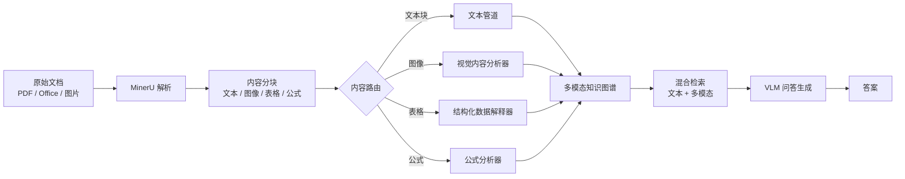

# RAG-Anything：港大开源多模态 RAG 框架，一站式处理文本/图像/表格/公式

RAG-Anything 处理的是文本 RAG 在真实文档上失效的那一段：图表、公式、表格这些非文本内容，传统 RAG 要么直接丢掉，要么靠 OCR 凑成字符串再交给文本检索，语义早就失真。它把文档解析、多模态理解和知识图谱检索压到一条流水线里，让一份 PDF 里的柱状图、资产负债表和 ROE 公式能被同一次查询召回。

项目来自香港大学 HKUDS 团队，基于他们此前开源的 LightRAG 扩展。

> **GitHub**: [HKUDS/RAG-Anything](https://github.com/HKUDS/RAG-Anything)  
> **Stars**: 17,159 ⭐  
> **arXiv**: [2510.12323](https://arxiv.org/abs/2510.12323)  
> **基于**: LightRAG  
> **语言**: Python 3.10+

## 系统总览

RAG-Anything 内部有三条并行主线，先分清边界再看机制：



三条主线职责不同，容易混淆：

| 主线 | 职责 | 输入 | 输出 |
|------|------|------|------|
| 解析主线 | 把原始文档拆成结构化内容块 | PDF、Office、图片 | 文本块、图像、表格、公式 |
| 理解主线 | 给非文本内容生成可检索的语义表示 | 图像、表格、公式 | 描述文本、结构化数据、LaTeX |
| 检索主线 | 跨模态召回并生成答案 | 用户问题 | 多模态证据 + 答案 |

解析主线用 MinerU，理解主线靠三类分析器，检索主线继承自 LightRAG 的图检索能力并叠加多模态证据。下面分别展开。

## 为什么文本 RAG 在真实文档上不够用

文本 RAG 的流水线默认文档内容是字符串：切片、嵌入、向量检索、拼到 prompt 里。这套流程对纯文本有效，遇到下面三类内容会失真。

图表被 OCR 当成图片里的文字提取，丢失"哪个柱子最高""趋势是上升还是下降"这类视觉语义。LaTeX 公式被当普通字符串嵌入，与"这个公式算的是什么"之间没有语义桥梁。表格被打平成行文本，列关系、跨行合计、单位信息丢失。

RAG-Anything 的处理方式是先用 MinerU 把这些内容识别成独立的结构化块，再分别送到对应的分析器生成语义描述，最后把所有内容（文本块、图像描述、表格解析结果、公式含义）写进同一张多模态知识图谱。检索时不再只比对文本嵌入，而是跨模态召回相关证据。

## 解析主线：MinerU 做了什么

MinerU 是文档结构提取层，负责把 PDF、Office 文档、图片转成结构化内容块。它的输出不是一段长文本，而是带类型标记的内容单元：文本块保留段落和章节层次，视觉元素识别图表、示意图、流程图，表格保留行列结构，公式保留 LaTeX 源码。

这一步决定了后续管道能拿到什么。如果 MinerU 把一张柱状图识别成图片但没保留它在文档中的位置上下文，后续检索时就无法回答"图表旁边的段落讲了什么"。RAG-Anything 在这一层保留了原始文档的层次结构，使得跨模态关系（比如"某张图属于某一节"）能在知识图谱里被表达。

除了 MinerU 解析，框架还支持直接注入模式：如果文档已经做过结构化解析，可以跳过 MinerU 直接把内容块喂给后续管道。这种模式适合已有解析能力的团队，或者需要处理 MinerU 不支持的格式时。

## 理解主线：三条并行分析管道

内容路由器根据内容类型把块分发到对应分析器，三条管道并行处理。

视觉内容分析器处理图像和图表，生成描述文本和空间关系。一张柱状图会被转成"2024 年 Q3 营收达到 X 亿元，环比增长 Y%"这类可检索的描述，而不是只存图片 URL。

结构化数据解释器处理表格，保留行列结构并识别趋势和依赖关系。资产负债表不会被压成一行文本，而是保留"总资产 = 负债 + 所有者权益"这类结构关系。

公式分析器处理 LaTeX 公式，把符号串转成语义可理解的表示。ROE = 净利润 / 股东权益 这类公式会被关联到"净资产收益率"这个概念，而不是只匹配字符。

三条管道的输出都汇入多模态知识图谱，作为节点和边参与后续检索。

## 检索主线：从 LightRAG 继承了什么

RAG-Anything 的检索层基于 LightRAG，后者本身是一个带知识图谱的 RAG 框架，支持实体和关系的图检索。RAG-Anything 在此基础上做了两件事：把多模态内容（图像描述、表格解析、公式语义）作为节点写进图谱，与文本实体并列；查询时混合检索，先做文本匹配定位相关章节，再做多模态证据召回，最后由视觉语言模型（VLM）综合生成答案。

`use_vlm=True` 这个参数控制的就是最后一步是否调用 VLM。开启后，被召回的图片、表格会作为视觉证据直接喂给 VLM，而不是只看它们的文本描述。

## 任务流案例：一份财务年报如何被处理

抽象机制讲完，看一次具体任务怎么流过系统。假设有一份上市公司年报 PDF，包含三段管理层讨论文本、一张季度营收柱状图、一张资产负债表、一个 ROE 计算公式。

第一步，MinerU 解析。PDF 被拆成 6 个内容块：3 个文本块、1 个图像块（柱状图）、1 个表格块（资产负债表）、1 个公式块（ROE）。每个块带类型标记和文档位置。

第二步，内容路由分发。3 个文本块进文本管道，柱状图进视觉内容分析器，资产负债表进结构化数据解释器，ROE 公式进公式分析器。四条管道并行处理。

第三步，多模态知识图谱构建。文本管道提取出实体"2024 年""营收""管理层"；视觉分析器生成描述"Q3 营收峰值 X 亿元"；表格解释器保留"总资产""负债""所有者权益"的行列关系；公式分析器把 ROE 关联到"净资产收益率"。这些节点之间建立边：Q3 营收 —[时间]→ 2024 年，ROE —[计算]→ 净利润 / 股东权益。

第四步，用户查询。问题："公司 2024 年 ROE 是多少？营收趋势如何？"

第五步，混合检索。文本检索定位到讨论 ROE 的段落，图检索召回 ROE 公式节点和"净利润""股东权益"实体，多模态检索召回柱状图作为营收趋势证据。

第六步，VLM 生成。VLM 拿到文本段落、公式语义、柱状图图像，综合输出："2024 年 ROE 为 Z%，较上年上升；营收呈上升趋势，Q3 达到峰值 X 亿元。"

整个流程里，柱状图和公式没有被转成字符串再检索，而是作为独立模态参与召回和生成。这是 RAG-Anything 和文本 RAG 在效果上拉开差距的关键点。

## 快速开始

### 安装

```bash
pip install raganything

# 或使用 uv
uv pip install raganything
```

### 基本使用

```python
from raganything import RAGAnything

# 初始化
rag = RAGAnything()

# 添加文档
rag.add_documents("path/to/document.pdf")

# 多模态问答
result = rag.query(
    "这份文档中的图表展示了什么趋势？",
    use_vlm=True  # 启用视觉语言模型
)
```

`use_vlm=True` 适合查询涉及图表、示意图、公式推导的场景；纯文本问答可以关掉以节省调用成本。第一次跑通建议用一份结构清晰的 PDF（比如带图表的财报或论文），对照上面的任务流案例观察每一步的输入输出，比直接拿复杂文档试错更容易定位问题。

### 支持的文档类型

| 类型 | 状态 | 说明 |
|------|------|------|
| PDF | ✅ | 完整支持 |
| Word (DOCX) | ✅ | 文本+表格 |
| PowerPoint (PPTX) | ✅ | 幻灯片+图表 |
| Excel (XLSX) | ✅ | 表格数据 |
| 图片 | ✅ | VLM 增强 |
| Markdown | ✅ | 文本+代码 |
| LaTeX | ✅ | 公式支持 |

## 评估维度：看论文时关注什么

arXiv 论文（2510.12323）给出了系统级评估。读这类多模态 RAG 论文时，比看总分更有用的是分清每个数字在测什么。

文档解析准确率反映 MinerU 这一层的能力，但不能推出后续检索和问答的质量——解析对了不代表召回对。多模态问答正确率反映端到端效果，但受 VLM 能力影响，不能单独归因到框架设计——同样的检索结果换个更强的 VLM 数字就会变。跨模态召回率反映知识图谱和混合检索的设计，但依赖前序解析质量——图谱建错了，检索设计再好也召回不准。

如果只看总分得出"多模态 RAG 全面优于文本 RAG"的结论，会掩盖各层各自的瓶颈。论文里的数字更适合用来定位"哪一层是当前短板"，而不是直接拿来排名。

## 适用边界与采用顺序

RAG-Anything 不是所有 RAG 场景的默认选择。下面按文档类型给出采用建议。

先上的场景：文档里图表、公式、表格占比高，且这些内容承载关键信息。典型如学术论文问答、财报分析、技术文档检索、医疗报告处理。这些场景里文本 RAG 明显失真，多模态处理的收益能覆盖额外成本。

可以等的场景：文档以纯文本为主，几乎没有图表和公式。这时 MinerU 解析和多模态分析的开销大于收益，直接用 LightRAG 或更轻量的文本 RAG 更合适。

不建议上的场景：实时性要求高、单次查询成本敏感的线上服务。多模态管道的延迟和 VLM 调用成本明显高于纯文本 RAG，需要先评估能否接受。

采用顺序上，建议先在一个文档类型固定、问题模式明确的子集上试跑（比如只处理财报 PDF），验证解析质量和召回效果，再扩展到多类型文档混合的场景。一上来就接全类型文档，排查问题时很难分清是解析层、理解层还是检索层出了岔子。

## 常见问题

**MinerU 解析失败怎么排查？** 先确认 PDF 是原生数字 PDF 还是扫描件。扫描件需要先做 OCR，MinerU 对原生数字 PDF 的解析质量更高。如果文档里有大量手写批注或非标准排版，也可能导致分块错误，这时可以改用直接注入模式，用已有的解析结果替代 MinerU。

**VLM 调用成本如何控制？** 对纯文本查询关闭 `use_vlm`，只在涉及图表和公式的查询时开启。也可以在检索阶段先做文本过滤，只对相关度高的章节调用 VLM，避免对整篇文档的多模态内容全量调用。

**和 LightRAG 是什么关系？** RAG-Anything 基于 LightRAG 扩展，复用了后者的知识图谱检索能力，新增了多模态解析、多模态分析和 VLM 问答。已有的 LightRAG 知识图谱可以迁移过来，文本检索部分的行为与 LightRAG 一致。

**什么时候用直接注入模式？** 当文档格式不在 MinerU 支持范围内，或者团队已有更准确的解析能力时。直接注入模式跳过 MinerU，把预先解析好的内容块（带类型标记）喂给后续管道，代价是需要自己保证内容块的结构和类型正确。

## 资源链接

| 资源 | 链接 |
|------|------|
| GitHub | [HKUDS/RAG-Anything](https://github.com/HKUDS/RAG-Anything) |
| arXiv 论文 | [2510.12323](https://arxiv.org/abs/2510.12323) |
| PyPI | [raganything](https://pypi.org/project/raganything/) |
| Discord | [社区讨论](https://discord.gg/yF2MmDJyGJ) |
