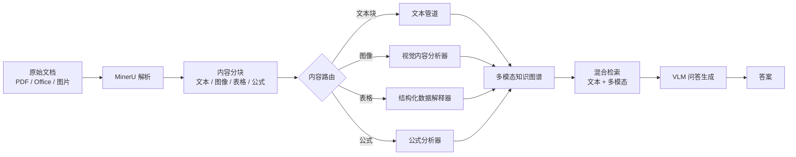

# RAG-Anything：港大开源多模态 RAG 框架，一站式处理文本/图像/表格/公式

RAG-Anything 处理的是文本 RAG 在真实文档上失效的那一段：图表、公式、表格这些非文本内容，传统 RAG 要么直接丢掉，要么靠 OCR 凑成字符串再交给文本检索，语义早就失真。它把文档解析、多模态理解和知识图谱检索压到一条流水线里，让一份 PDF 里的柱状图、资产负债表和 ROE 公式能被同一次查询召回。

项目来自香港大学 HKUDS（Data Science）团队，基于他们此前开源的 LightRAG 扩展。2026-06 起，多模态能力已原生集成进 LightRAG，本文按独立仓库口径介绍。

> **GitHub**: [HKUDS/RAG-Anything](https://github.com/HKUDS/RAG-Anything)  
> **Stars**: 23,414 ⭐ / Forks 2,730（2026-09-25 实测，GitHub API）  
> **arXiv**: [2510.12323](https://arxiv.org/abs/2510.12323)（技术报告，2025-10）  
> **PyPI**: [`raganything`](https://pypi.org/project/raganything/)，当前版本 1.4.1  
> **基于**: LightRAG  
> **语言**: Python 3.10+，MIT

## 学习目标

读完这篇文章后，你应该能够：

- 说清楚文本 RAG 在图表、公式、表格三类内容上分别丢失了什么语义，以及 RAG-Anything 用什么机制补回来
- 区分 RAG-Anything 的三条主线（解析、理解、检索）各自负责的输入输出和边界，避免把 MinerU 解析质量和 VLM 问答质量混为一谈
- 在三种解析器（mineru / docling / paddleocr）之间做选择，知道什么时候该换、什么时候该用直接注入模式
- 跟踪一次多模态查询从 PDF 输入到 VLM 答案生成的完整数据流，指出每一步的输入和产物
- 判断自己的文档场景是否值得引入多模态 RAG，以及应该先用 MinerU 解析还是直接注入模式
- 读论文评估数字时，分清文档解析准确率、跨模态召回率、多模态问答正确率各自反映系统的哪一层

## 系统总览

RAG-Anything 内部有三条并行主线，先分清边界再看机制：


```mermaid
flowchart LR
    A[原始文档<br/>PDF / Office / 图片] --> B[MinerU 解析]
    B --> C[内容分块<br/>文本 / 图像 / 表格 / 公式]
    C --> D{内容路由}
    D -->|文本块| E[文本管道]
    D -->|图像| F[视觉内容分析器]
    D -->|表格| G[结构化数据解释器]
    D -->|公式| H[公式分析器]
    E --> I[多模态知识图谱]
    F --> I
    G --> I
    H --> I
    I --> J[混合检索<br/>文本 + 多模态]
    J --> K[VLM 问答生成]
    K --> L[答案]
```

三条主线职责不同，容易混淆：

| 主线 | 职责 | 输入 | 输出 |
|------|------|------|------|
| 解析主线 | 把原始文档拆成结构化内容块 | PDF、Office、图片 | 文本块、图像、表格、公式 |
| 理解主线 | 给非文本内容生成可检索的语义表示 | 图像、表格、公式 | 描述文本、结构化数据、LaTeX |
| 检索主线 | 跨模态召回并生成答案 | 用户问题 | 多模态证据 + 答案 |

解析主线用解析器（默认 MinerU），理解主线靠三类分析器，检索主线继承自 LightRAG 的图检索能力并叠加多模态证据。

## 为什么文本 RAG 在真实文档上不够用

文本 RAG 的流水线默认文档内容是字符串：切片、嵌入、向量检索、拼到 prompt 里。这套流程对纯文本有效，遇到下面三类内容会失真。

图表被 OCR 当成图片里的文字提取，丢失"哪个柱子最高""趋势是上升还是下降"这类视觉语义。LaTeX 公式被当普通字符串嵌入，与"这个公式算的是什么"之间没有语义桥梁。表格被打平成行文本，列关系、跨行合计、单位信息丢失。

RAG-Anything 的处理方式是先用解析器把这些内容识别成独立的结构化块，再分别送到对应的分析器生成语义描述，最后把所有内容（文本块、图像描述、表格解析结果、公式含义）写进同一张多模态知识图谱。检索时不再只比对文本嵌入，而是跨模态召回相关证据。

## 解析主线：解析器与分块

解析层负责把 PDF、Office 文档、图片转成带类型标记的内容块：文本块保留段落和章节层次，视觉元素识别图表、示意图、流程图，表格保留行列结构，公式保留 LaTeX 源码。这一步决定了后续管道能拿到什么——如果解析把一张柱状图识别成图片却没保留它在文档中的位置上下文，后续检索就无法回答"图表旁边的段落讲了什么"。

解析器不是写死的，`RAGAnythingConfig(parser=...)` 按文件类型和配置选择：

| 解析器 | 擅长 | 典型用途 |
|--------|------|----------|
| `mineru`（默认） | 高保真文档结构提取 | PDF、图片、复杂排版（学术论文、扫描排版） |
| `docling` | Office 与 HTML 结构保留 | DOC/DOCX/PPT/PPTX/XLS/XLSX、HTML |
| `paddleocr` | OCR 文字识别 | 扫描件、图片中的文字 |

`parse_method` 再控制解析方式：`auto`（自动判断）、`ocr`（走 OCR）、`txt`（纯文本直接读）。扫描件建议显式指定 `ocr`；原生数字 PDF 用 `auto` 即可，解析质量更高。

除内置解析器外，`register_parser()` 可以注册自定义解析器，覆盖 MinerU/Docling 不支持的格式。解析结果带缓存：文件内容指纹（SHA-256）+ 解析参数共同决定缓存键，同一文件重复解析直接命中缓存，不重复跑 MinerU。

如果文档已经做过结构化解析，或者要处理解析器不支持的格式，可以跳过解析层，把预先解析好的内容列表（content list）直接喂给后续管道。这种直接注入模式在"快速开始"一节展开。

## 理解主线：三条并行分析管道

内容路由器根据内容类型把块分发到对应分析器，三条管道并行处理。

视觉内容分析器处理图像和图表，生成描述文本和空间关系。一张柱状图会被转成"2024 年 Q3 营收达到 X 亿元，环比增长 Y%"这类可检索的描述，而不是只存图片 URL。

结构化数据解释器处理表格，保留行列结构并识别趋势和依赖关系。资产负债表不会被压成一行文本，而是保留"总资产 = 负债 + 所有者权益"这类结构关系。

公式分析器处理 LaTeX 公式，把符号串转成语义可理解的表示。ROE = 净利润 / 股东权益 这类公式会被关联到"净资产收益率"这个概念，而不是只匹配字符。

三条管道的输出都汇入多模态知识图谱，作为节点和边参与后续检索。

## 检索主线：从 LightRAG 继承了什么

RAG-Anything 的检索层基于 LightRAG，后者本身是一个带知识图谱的 RAG 框架，支持实体和关系的图检索。RAG-Anything 在此基础上做了两件事：把多模态内容（图像描述、表格解析、公式语义）作为节点写进图谱，与文本实体并列；查询时混合检索（`mode="hybrid"`），先做文本匹配定位相关章节，再做多模态证据召回，最后由视觉语言模型（VLM）综合生成答案。

VLM 增强查询（2025-08 引入）的机制是：检索结果里如果带图像，图像本身（像素）会被直接交给 `vision_model_func` 指向的视觉模型，而不是只看入库时的文本描述。描述负责检索召回，像素负责回答细节——这是"图的横轴是什么"这类问题能被回答的原因。查询侧传入显式多模态内容（表格、公式）时，走 `aquery_with_multimodal`，把内容直接作为视觉证据送给 VLM。

## 任务流案例：一份财务年报如何被处理

假设有一份上市公司年报 PDF，包含三段管理层讨论文本、一张季度营收柱状图、一张资产负债表、一个 ROE 计算公式。

第一步，解析。PDF 被拆成 6 个内容块：3 个文本块、1 个图像块（柱状图）、1 个表格块（资产负债表）、1 个公式块（ROE）。每个块带类型标记和文档位置。

第二步，内容路由分发。3 个文本块进文本管道，柱状图进视觉内容分析器，资产负债表进结构化数据解释器，ROE 公式进公式分析器。四条管道并行处理。

第三步，多模态知识图谱构建。文本管道提取出实体"2024 年""营收""管理层"；视觉分析器生成描述"Q3 营收峰值 X 亿元"；表格解释器保留"总资产""负债""所有者权益"的行列关系；公式分析器把 ROE 关联到"净资产收益率"。这些节点之间建立边：Q3 营收 —[时间]→ 2024 年，ROE —[计算]→ 净利润 / 股东权益。

第四步，用户查询。问题："公司 2024 年 ROE 是多少？营收趋势如何？"

第五步，混合检索。文本检索定位到讨论 ROE 的段落，图检索召回 ROE 公式节点和"净利润""股东权益"实体，多模态检索召回柱状图作为营收趋势证据。

第六步，VLM 生成。VLM 拿到文本段落、公式语义、柱状图图像，综合输出："2024 年 ROE 为 Z%，较上年上升；营收呈上升趋势，Q3 达到峰值 X 亿元。"

整个流程里，柱状图和公式没有被转成字符串再检索，而是作为独立模态参与召回和生成。如果团队已有解析能力，可以跳过解析层，直接把内容块喂给后续管道，省下解析开销。

## 快速开始

### 安装

```bash
# 基础安装
pip install raganything

# 扩展格式支持
pip install 'raganything[all]'       # 全部可选依赖
pip install 'raganything[image]'     # BMP / TIFF / GIF / WebP（依赖 Pillow）
pip install 'raganything[text]'      # TXT / MD（依赖 ReportLab）
```

两个前置条件容易踩：

- Office 文档（DOC/DOCX/PPT/PPTX/XLS/XLSX）需要系统装 LibreOffice：macOS 用 `brew install --cask libreoffice`，Ubuntu/Debian 用 `apt-get install libreoffice`。
- MinerU 的模型在首次解析时自动下载，体积以 GB 计，耗时取决于网络；装完后可以用下面两行确认解析器可用：

```bash
mineru --version
python -c "from raganything import RAGAnything; rag = RAGAnything(); print('OK' if rag.check_parser_installation() else 'MISSING')"
```

### 基本使用

真实的 API 是异步的：解析、查询、注入都要在 `async` 函数里 `await`。初始化需要三样东西：配置、LLM/视觉/嵌入三个函数、文档路径。

```python
import asyncio
from raganything import RAGAnything, RAGAnythingConfig

async def main():
    config = RAGAnythingConfig(
        working_dir="./rag_storage",
        parser="mineru",               # mineru / docling / paddleocr
        parse_method="auto",           # auto / ocr / txt
        enable_image_processing=True,
        enable_table_processing=True,
        enable_equation_processing=True,
    )
    rag = RAGAnything(
        config=config,
        llm_model_func=llm_model_func,           # 文本 LLM 回调
        vision_model_func=vision_model_func,     # 视觉模型回调（VLM 增强查询用）
        embedding_func=embedding_func,           # 嵌入回调
    )

    # 解析 + 入库
    await rag.process_document_complete(
        file_path="path/to/document.pdf",
        output_dir="./output",
        parse_method="auto",
    )

    # 纯文本问答
    result = await rag.aquery(
        "这份文档主要讲了什么？",
        mode="hybrid",
    )
    print(result)

asyncio.run(main())
```

三个函数回调的写法参照官方示例 `examples/raganything_example.py`：LLM 与视觉模型基于 `openai_complete_if_cache`（OpenAI 兼容协议），嵌入基于 `openai_embed`，key/base_url 从环境变量读，不要硬编码。

### 多模态查询：表格和公式直接作为证据

查询时想带上文档之外的表格或公式，用 `aquery_with_multimodal`。内容以字典列表传入，表格用 `table_data` + `table_caption`，公式用 `latex` + `equation_caption`：

```python
# 带表格的查询
result = await rag.aquery_with_multimodal(
    "把这份性能数据和文档里的结果对比一下",
    multimodal_content=[{
        "type": "table",
        "table_data": "Method,Accuracy,Time\nRAGAnything,95.2%,120ms\nBaseline,82.1%,200ms",
        "table_caption": "性能对比结果",
    }],
    mode="hybrid",
)

# 带公式的查询
result = await rag.aquery_with_multimodal(
    "解释这个公式，并说明它和文档里的概念有什么关系",
    multimodal_content=[{
        "type": "equation",
        "latex": "F1 = 2 \\cdot \\frac{precision \\cdot recall}{precision + recall}",
        "equation_caption": "F1 分数计算公式",
    }],
    mode="hybrid",
)
```

纯文本问答走 `aquery` 即可，不传多模态内容；涉及图表、公式推导的查询才用 `aquery_with_multimodal`，以省一次视觉模型的调用成本。

### 直接注入模式：跳过解析层

如果文档已经做过结构化解析，或者要处理解析器不支持的格式，可以把预先解析好的内容列表直接交给框架，跳过 MinerU/Docling。内容列表的格式与解析器输出一致：每个块是一个带类型标记的字典（`text` / `image` / `table` / `equation`），并携带来源元数据。框架按类型把块分发到对应分析器，后续的知识图谱构建和检索照常。

```python
content_list = [
    {"type": "text", "text": "2024 年第三季度营收达到 12.3 亿元，同比增长 18%。"},
    {"type": "table", "table_data": "<table>...</table>", "caption": "资产负债表"},
    {"type": "equation", "latex": "ROE = \\frac{\\text{净利润}}{\\text{股东权益}}"},
]
```

直接注入模式的代价是需要自己保证内容块的结构和类型正确——类型标错会让内容路由器把表格送进公式分析器，召回时就会出现语义错位。注入前先打印一遍每个块的 `type` 字段，确认归位。各版本对内容列表的具体字段名有演进，接入前以当前版本文档的 Direct Content List Insertion 一节为准。

### 支持的文档类型

| 类型 | 支持方式 | 说明 |
|------|----------|------|
| PDF | ✅ MinerU（默认） | 复杂排版、图表公式保真 |
| 图片（JPG/PNG 等） | ✅ MinerU / paddleocr | 扫描件建议 `parse_method="ocr"` |
| DOC / DOCX / PPT / PPTX / XLS / XLSX | ✅ Docling 或 LibreOffice 转换 | 需要系统安装 LibreOffice |
| TXT / MD | ✅ 需 `[text]` 依赖 | ReportLab 后端 |
| BMP / TIFF / GIF / WebP | ✅ 需 `[image]` 依赖 | Pillow 后端 |
| HTML | ✅ Docling | 结构保留较好 |
| LaTeX 源码 | ✅ 公式管道 | 以公式块入库 |
| 音频 / 视频 | 🧪 可选处理器 | 依赖 faster-whisper / scenedetect 等，需另行安装 |

## 评估维度：看论文时关注什么

arXiv 论文（2510.12323）给出了系统级评估。读这类多模态 RAG 论文时，比看总分更有用的是分清每个数字在测什么。

文档解析准确率反映解析层的能力，但不能推出后续检索和问答的质量——解析对了不代表召回对。多模态问答正确率反映端到端效果，但受 VLM 能力影响，不能单独归因到框架设计——同样的检索结果换个更强的 VLM 数字就会变。跨模态召回率反映知识图谱和混合检索的设计，但依赖前序解析质量——图谱建错了，检索设计再好也召回不准。

如果只看总分得出"多模态 RAG 全面优于文本 RAG"的结论，会掩盖各层各自的瓶颈。论文里的数字更适合用来定位"哪一层是当前短板"，而不是直接拿来排名。

## 适用边界与采用顺序

RAG-Anything 不是所有 RAG 场景的默认选择。下面按文档类型给出采用建议。

先上的场景：文档里图表、公式、表格占比高，且这些内容承载关键信息。典型如学术论文问答、财报分析、技术文档检索、医疗报告处理。这些场景里文本 RAG 明显失真，多模态处理的收益能覆盖额外成本。

可以等的场景：文档以纯文本为主，几乎没有图表和公式。这时解析和多模态分析的开销大于收益，直接用 LightRAG 或更轻量的文本 RAG 更合适。多模态能力已原生集成进 LightRAG（2026-06 起），纯文本场景留在 LightRAG，需要时再单独装 RAG-Anything。

不建议上的场景：实时性要求高、单次查询成本敏感的线上服务。多模态管道的延迟和 VLM 调用成本明显高于纯文本 RAG，需要先评估能否接受。

采用顺序上，建议先在一个文档类型固定、问题模式明确的子集上试跑（比如只处理财报 PDF），验证解析质量和召回效果，再扩展到多类型文档混合的场景。一上来就接全类型文档，排查问题时很难分清是解析层、理解层还是检索层出了岔子。

## 常见问题

**MinerU 解析失败怎么排查？** 先确认 PDF 是原生数字 PDF 还是扫描件。扫描件需要走 OCR（`parse_method="ocr"` 或换 `paddleocr`），MinerU 对原生数字 PDF 的解析质量更高。如果文档里有大量手写批注或非标准排版，也可能导致分块错误，这时可以改用直接注入模式，用已有的解析结果替代解析层。

**VLM 调用成本如何控制？** 纯文本问答走 `aquery`，只在涉及图表和公式的查询时用 `aquery_with_multimodal`。也可以在检索阶段先做文本过滤，只对相关度高的章节召回多模态证据，避免对整篇文档的多模态内容全量调用。

**和 LightRAG 是什么关系？** RAG-Anything 基于 LightRAG 扩展，复用了后者的知识图谱构建、向量存储与检索能力，新增了多模态解析、多模态分析和 VLM 问答。2026-06 起，LightRAG 已通过原生集成 RAG-Anything 提供多模态能力。RAGAnything 的构造参数里可以直接传入已有的 `LightRAG` 实例，已有知识图谱可以复用；文本检索部分的行为与 LightRAG 一致。

**什么时候用直接注入模式？** 当文档格式不在解析器支持范围内，或者团队已有更准确的解析能力时。直接注入模式跳过解析层，把预先解析好的内容列表（带类型标记）喂给后续管道，代价是需要自己保证内容块的结构和类型正确。

**三个解析器怎么选？** 默认 `mineru` 处理 PDF 和复杂排版；Office 文档和 HTML 优先 `docling`；扫描件和图片里的文字优先 `paddleocr`。拿不准就先用默认解析器跑一遍，解析质量不对再换，解析结果有缓存，换解析器不会重复消耗前面的成果。

## 自测题

1. 文本 RAG 处理图表、表格、公式时各丢掉了什么？RAG-Anything 分别用什么机制补回来？
2. `aquery` 和 `aquery_with_multimodal` 的区别是什么？什么场景必须用后者？
3. 一份全是扫描图片的 PDF，解析配置应该怎么设？为什么？
4. 为什么纯文本为主的文档不建议引入 RAG-Anything？收益和代价怎么算？
5. 直接注入模式省掉了哪一步？它引入的新风险是什么？

答案依次落在"为什么文本 RAG 在真实文档上不够用""快速开始""解析主线""适用边界与采用顺序""快速开始"这几节。答不出的那一题，通常就是对应小节里最容易被跳过的边界。

## 维护指引

本文数字与接口的时效说明，改文前先看这节：

- **仓库类事实**（stars、forks、PyPI 版本、解析器列表、安装方式）采集于 2026-09-25。这类数字随发布更新变化，引用时注明采集日期。复核命令：

```bash
git clone --depth 1 https://github.com/HKUDS/RAG-Anything.git
curl -s https://api.github.com/repos/HKUDS/RAG-Anything | jq '{stargazers_count,forks_count,pushed_at}'
curl -s https://pypi.org/pypi/raganything/json | jq '.info.version'
```

- **论文事实类**绑定 arXiv 2510.12323，不随仓库改版失效，但论文出新版本需重读。
- **接口类**（`RAGAnythingConfig` 字段、`aquery_with_multimodal` 内容字典格式、解析器注册 API）以 `main` 分支源码和官方示例 `examples/raganything_example.py` 为准。直接注入模式的内容列表字段名各版本有演进，写新代码前对照当前 README 的 Direct Content List Insertion 一节。
- **术语口径**：本文沿用 README 的命名——Visual Content Analyzer 译为"视觉内容分析器"、Structured Data Interpreter 译为"结构化数据解释器"、Mathematical Expression Parser 译为"公式分析器"。改动时保持一致。

## 资源链接

| 资源 | 链接 |
|------|------|
| GitHub | [HKUDS/RAG-Anything](https://github.com/HKUDS/RAG-Anything) |
| arXiv 论文 | [2510.12323](https://arxiv.org/abs/2510.12323) |
| PyPI | [raganything](https://pypi.org/project/raganything/) |
| 官方示例 | [examples/raganything_example.py](https://github.com/HKUDS/RAG-Anything/blob/main/examples/raganything_example.py) |
| Discord | [社区讨论](https://discord.gg/yF2MmDJyGJ) |
| 微信群 | [加入方式（issue #7）](https://github.com/HKUDS/RAG-Anything/issues/7) |
