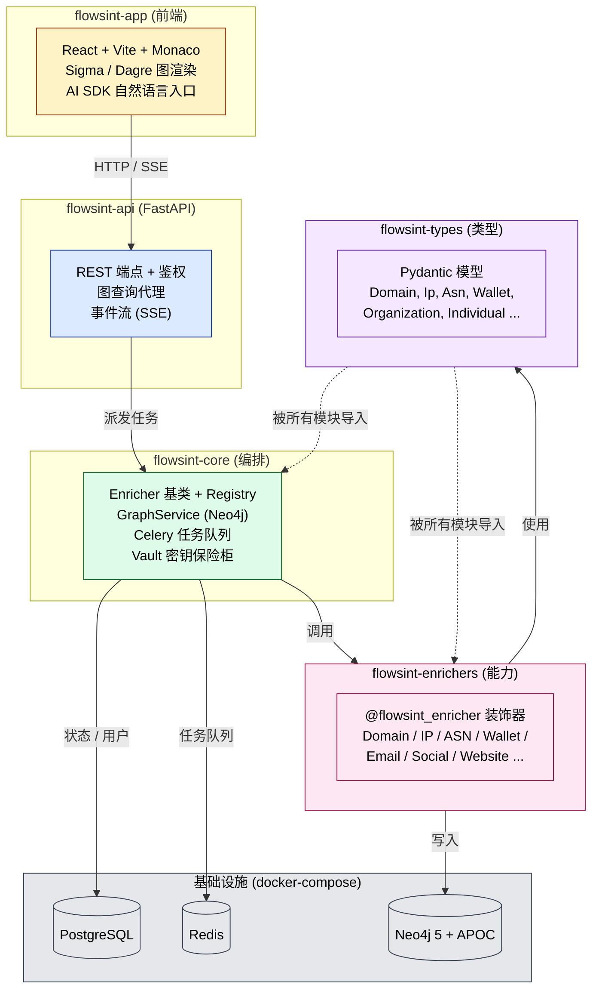
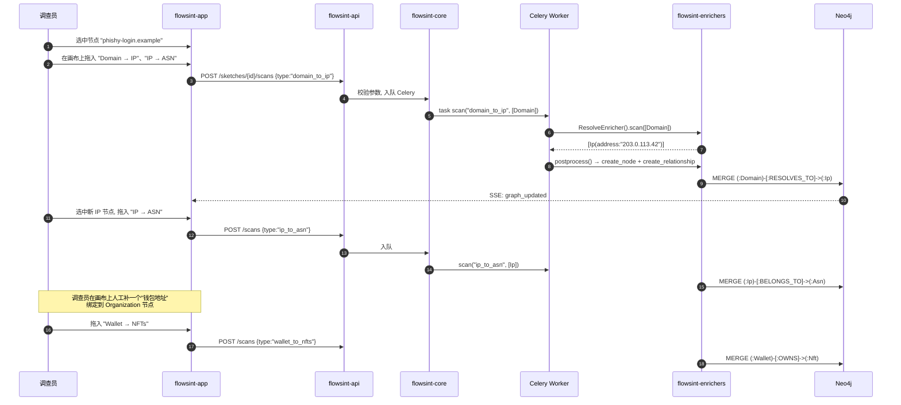

# Flowsint 深度解析：把 OSINT 调查搬上 Neo4j 图谱，以及它和 Maltego / SpiderFoot 的本质区别

**Flowsint 真正解决的不是"再多一个 OSINT 工具"，而是把"散落在十几个网站和 CLI 工具里的查询结果"沉淀成同一张可长期回访的调查图（investigation graph）。**

OSINT 圈不缺工具。Maltego 早就把图谱化做成了商品；SpiderFoot 把自动化扫描做成了 SaaS；Recon-ng、theHarvester、Maigret 各自在垂直方向上很强。Flowsint 的切入点很窄：它假设你只想在自己的机器上跑、不想被订阅费卡住、并且希望每一次查询都留下可回查的节点和边——于是它把 Neo4j 推到台前，把"扫出来的关系"作为一等公民，再用一套 Python 模块化机制（Enricher + Registry + Celery）让所有人能往这张图上接新能力。

[reconurge/flowsint](https://github.com/reconurge/flowsint) 至今 4.5k+ stars、Apache-2.0、TypeScript + Python，模块清晰到几乎是一张架构教学图。但 README 把它讲成了 feature list，真正的工程判断需要从源码里挖：Enricher 基类如何约束输入输出、Registry 怎么自动发现插件、Neo4j 节点和边在哪里被创建、Celery 又在异步链路的哪一环。

下面就是要做这件事：先给判断，再给系统地图，再用一个"域名 → IP → ASN → 钱包 → NFT"的真实调查路径把抽象机制串起来，最后给出和 Maltego / SpiderFoot / Maigret 的差异点与采用建议。

---

## 系统地图：先把五个模块的边界拆开

Flowsint 不是单一应用，它是一个由 5 个子包构成的 monorepo，每个子包都有自己的 `pyproject.toml`（或 `package.json`），并且依赖方向是单向的、严格向下的。



读这张图要抓住一个关键判断：**依赖是单向的、且最底层是 `flowsint-types`**。所以任何模块升级类型定义时，理论上不会反向打穿 API 或前端——它给了项目一个看起来"清楚"的工程边界，也意味着新增一种实体（比如新增 `Vehicle` 实体）只需要触碰 `flowsint-types` 和可能的新 enricher，不会牵连 API。

| 模块 | 语言 | 单一职责 | 你会在哪一类 PR 里改它 |
|------|------|---------|------------------------|
| `flowsint-app` | TypeScript (React + Vite) | 可视化画布、Monaco 编辑、事件流 | UI 交互、可视化性能 |
| `flowsint-api` | Python (FastAPI) | 鉴权、REST 路由、SSE 流 | API 端点、用户/权限 |
| `flowsint-core` | Python | Enricher 基类、Neo4j GraphService、Celery、Vault | 调度逻辑、图写入、密钥管理 |
| `flowsint-enrichers` | Python | 具体能力实现：DNS、WHOIS、Maigret、链上查询… | 新增能力、补数据源 |
| `flowsint-types` | Python (Pydantic) | 实体类型定义 | 新增实体、修改字段 |

如果一句话总结这张图：**类型在底、能力在中、调度在核、API 居中、前端居顶**。这是个很标准的"洋葱 + 分层"结构，但它把"图写入"放在 `core` 而不是放在 `enrichers`，这件事值得记住——所有 enricher 写图都要走 `GraphService`。

---

## 数据模型：调查图里的"节点"和"边"到底是什么

在 Flowsint 里，**实体 = Pydantic 类，关系 = 字符串常量**。这是它和 Maltego 最不一样的地方：Maltego 的实体类型有几十个内置 shape，关系名也受 Ontology 控制；Flowsint 选择了更"工程师"的路径——用 Pydantic 写实体，用字符串写关系。

`flowsint-types/src/flowsint_types/` 这个目录几乎是 OSINT 调查的对象目录：

```text
domain.py, ip.py, asn.py, cidr.py, dns_record.py, whois.py
email.py, phone.py, individual.py, organization.py, affiliation.py
wallet.py, address.py, bank_account.py, credit_card.py
website.py, social_account.py, username.py, gravatar.py
breach.py, leak.py, credential.py, reputation_score.py, risk_profile.py
malware.py, weapon.py, script.py, document.py
ssl_certificate.py, web_tracker.py, port.py, device.py, file.py
session.py, message.py, phrase.py, alias.py
```

每个文件里都是 Pydantic 模型，外加 `flowsint_base.py` 提供 `FlowsintBase` 基类（统一 `to_dict()` / `to_neo4j_props()` 等序列化方法）。这种设计的好处很明显：你在 Python 里 `from flowsint_types import Domain` 之后，类型校验、JSON 序列化、Neo4j 属性转换全都已经做好。

边（关系）则更轻：以字符串常量的形式写在 Enricher 的 `postprocess` 里。`flowsint-enrichers/src/flowsint_enrichers/domain/to_ip.py` 这个最小案例已经把整条链路交代清楚了：

```python
@flowsint_enricher
class ResolveEnricher(Enricher):
    """Resolve domain names to IP addresses."""
    InputType = Domain
    OutputType = Ip

    @classmethod
    def name(cls) -> str:
        return "domain_to_ip"

    async def scan(self, data: List[InputType]) -> List[OutputType]:
        results: List[OutputType] = []
        for d in data:
            try:
                ip = socket.gethostbyname(d.domain)
                results.append(Ip(address=ip))
            except Exception as e:
                Logger.info(self.sketch_id, {"message": f"...{e}"})
                continue
        return results

    def postprocess(self, results, original_input):
        for domain_obj, ip_obj in zip(original_input, results):
            self.create_node(domain_obj)               # MERGE (:Domain {domain: ...})
            self.create_node(ip_obj)                   # MERGE (:Ip {address: ...})
            self.create_relationship(                  # MERGE (:Domain)-[:RESOLVES_TO]->(:Ip)
                domain_obj, ip_obj, "RESOLVES_TO"
            )
            self.log_graph_message(...)
        return results
```

三件东西很关键：

1. **`InputType` / `OutputType` 写在类属性上**，基类 `Enricher` 会自动帮你生成 `input_schema()` / `output_schema()`，并用 Pydantic 校验 `scan()` 的输入。
2. **`scan()` 是 async 的**，意味着整个 enricher 链是事件循环友好的，可以被 Celery 包成任务而不需要再写一层。
3. **`postprocess()` 才真正写图**。`scan()` 只返回结果对象，节点 / 关系的 MERGE 在 `postprocess()` 里集中发生，这给"重试"、"回滚"、"重新跑部分子图"留了空间。

Registry 也不复杂——`flowsint-enrichers/src/flowsint_enrichers/registry.py` 的 `EnricherRegistry.register()` 接受一个 Enricher 类，存到 `_enrichers` 字典里，然后 `load_all_enrichers()` 通过遍历包自动 `importlib` 触发装饰器，**所有 `*Enricher` 类自动注册**。新增能力只要写一个文件、加上 `@flowsint_enricher` 装饰器，零样板代码就能进入调度池。

---

## 任务流案例：一次"域名 → IP → ASN → 钱包 → NFT"会流过哪些模块

光看模块图会很容易抽象。下面用一个真实可能的调查路径走一遍，看一次点击在前端到 Neo4j 之间到底发生了什么。

> 调查假设：已知钓鱼域名 `phishy-login.example`，想顺着网络归属与运营方查到资金出口。



这条路径里有 5 个值得记的工程细节：

**1. 前端是"任务编排器"而不是"查询表单"**。画布上的每条箭头就是一条 `scan_id`，后端把每次拖拽映射成一个 Celery 任务。这种 UX 的好处是"操作即查询"——它鼓励调查员把图谱作为活的工作面，而不是一次性查询的产物。

**2. SSE (Server-Sent Events) 才是图谱同步的通道**。节点和边写进 Neo4j 之后，core 通过事件流把"图更新事件"推给前端，前端增量渲染。这意味着你在画布上看到的不是"轮询刷新"，是真正的 push；这也是为什么 README 敢说"thousands of nodes" 不卡——前端在 `flowsint-app/package.json` 里能看到 `@dagrejs/dagre`（自动布局）、`@ai-sdk/react`（自然语言入口）等重度依赖。

**3. Enricher 之间是松耦合的**。上面 4 个 enricher（`domain_to_ip`、`ip_to_asn`、`wallet_to_nfts`）彼此不互相 import——它们只共享 `flowsint_types` 里的 Pydantic 模型。这是模块依赖图能保持单向的根本原因。

**4. Celery 才是真正的时间换空间**。`flowsint-core` 在 README 里明确写了 "celery tasks, and base classes"。一次大型调查可能有上百次 enricher 调用，没有队列就只能阻塞 API。

**5. `postprocess()` 集中写图是双刃剑**。好处是重跑只重写边、不重写节点；坏处是任何 enricher 写图都要走 core 的 `GraphService`，自定义写入需要谨慎。

---

## 模块边界：哪些东西"看起来有"其实没有

Flowsint 的设计有清晰的边界，但也有几个容易被误读的点：

**1. 它不是工作流引擎（不是 Airflow / Prefect）。** Flowsint 没有 DAG 调度、没有失败重试策略的声明式配置；它只是把"每个 enricher 是一次 Celery 任务"这个语义做对。复杂的"先 A 再 B 再 C 然后聚合"目前需要在前端画布上手动编排。

**2. 它不是规则引擎（不是 YARA / Sigma）。** 没有 if-then 触发器、没有 IOC 模式匹配。要做"命中 IOC 自动告警"得自己包一层。

**3. Vault 还在早期。** `flowsint-core` 的 `core.enricher_base` 里有 `VaultProtocol` 和 `vaultSecret` 类型的参数，它确实在"密钥不进日志、不进前端"这件事上做对了——`enricher_base.py` 的注释也明确写了"Vault secrets are always optional in the Pydantic model to allow for deferred configuration"——但具体后端是 HashiCorp Vault 还是简易加密，README 没明说，源码中也只是 `VaultProtocol` 抽象。**把它当成"已有抽象、未必有生产实现"更稳。**

**4. N8n Connector 暗示了一个方向。** 在 enricher 分类里你能看到 `Integration Enrichers → N8n Connector`，意味着 Flowsint 想把自己变成 N8n 工作流里的一个节点——可被触发，也可以触发别人。这是它和 Maltego 在"生态位置"上最大的差异。

---

## 与 Maltego / SpiderFoot / Maigret 的对比：定位到底差在哪

已经有 Maltego 和 SpiderFoot，为什么要选 Flowsint？

| 维度 | Flowsint | Maltego CE | SpiderFoot | Maigret |
|------|----------|------------|------------|---------|
| 部署 | Docker 单机 / 本地 | 桌面客户端 | Docker / SaaS | CLI |
| 图数据库 | Neo4j 5（强制） | Maltego 私有 | 无图，只有表格 | 无图，只有 JSON |
| 数据持久化 | PostgreSQL + Neo4j | 本地工程文件 | SQLite / 文件 | 无 |
| 异步调度 | Celery + Redis | 无（同步查询） | 内部调度 | 无 |
| 能力扩展 | 写一个 `*Enricher` 类 | 写 Transforms (Paterva 私有 SDK) | 写 SpiderFoot 模块 | 改 Maigret 源码 |
| License | Apache-2.0 | 商业 + Community 限制 | MIT | MIT |
| 隐私模型 | 全部本地 | 本地（无云） | 默认云端 | 本地 |
| 学习曲线 | 中（要懂 Pydantic、Neo4j、Cypher） | 低-中（图形界面） | 低 | 低（CLI） |
| 适合 | 长期调查、需要回查、想沉淀 | 一次性画图、报告 | 全网被动扫描 | 单点用户名扩展 |

差异在于：**Maltego 把图藏在商业格式里、SpiderFoot 把图摊平成表格、Maigret 不存图**。Flowsint 是少数把 Neo4j 当作一等公民、把"图"作为产品核心的开源项目。如果你的工作方式是"先扫一遍，几天后再回到这张图继续挖"——这是它站得住的位置。

---

## 安装与上手：先跑通，再决定要不要深挖

官方推荐路径是"两行命令"：

```bash
# 1) 前置依赖
#    Docker, Make
# 2) 拉起整个栈
git clone https://github.com/reconurge/flowsint.git
cd flowsint
make prod
# 然后访问 http://localhost:5173/register
# 默认无任何账户，第一次访问需要注册一个
```

`docker-compose.yml` 把基础设施都列得很清楚：PostgreSQL 15、Redis（Celery 队列）、Neo4j 5（带 APOC 插件）、API、Worker、Frontend。开发模式用 `make dev`，会自动检查 `.env`、构建镜像、打开浏览器到 `http://localhost:5173`。

开发期调试有个直接路径：

```bash
# 跑各模块单测（README 明确写了"incomplete test suite"）
cd flowsint-core && uv run pytest
cd ../flowsint-types && uv run pytest
cd ../flowsint-enrichers && uv run pytest
cd ../flowsint-api && uv run pytest
```

注意两件事：

- **默认端口**：Postgres 是 `5433:5432`（不是默认 5432），Neo4j Web UI 是 `7474`，Bolt 是 `7687`，Redis 是 `6379`，前端是 `5173`。如果你本机已经有 Postgres，改端口而不是改镜像。
- **不向公网暴露 Neo4j**。APOC 插件开了 `apoc_import_file_enabled=true`，意味着有人能进 Neo4j 就能任意读你的服务器文件——`make prod` 默认绑定 localhost 是合理的，但**不要**把 7474/7687 直接开在公网。

---

## 适用场景与边界：谁该先用、谁可以等等

基于上面的模块图和任务流案例，**值得用**的场景：

- **长期威胁情报沉淀**：SOC（Security Operations Center，安全运营中心）团队希望把"每次钓鱼事件"沉淀成可回访的图谱。
- **隐私敏感的本地调查**：律师、记者、内部审计——`make prod` 全部跑在你机器上，没有任何云依赖。
- **可扩展能力平台**：你有内部数据源（公司自有威胁情报、特殊日志），想用 Pydantic + Enricher 抽象把它们接进图谱。
- **研究 / 教学**：模块边界清晰、依赖单向、类型先于实现——是一个适合用来讲"如何设计可扩展 OSINT 平台"的样本。

**可以等等**的场景：

- 你只想要"扫一下某个域名看 WHOIS 和子域名"——`theHarvester` + `subfinder` 足够，不需要一整套 Neo4j。
- 你想要 SIEM（Security Information and Event Management，安全信息与事件管理）那种"实时告警"语义——Flowsint 没有规则引擎。
- 你不愿意自己跑 Docker / 维护 Neo4j / 写 Pydantic——Maltego 的 GUI 更轻。
- 你的合规要求 SOC2 / ISO 27001 类认证——项目目前测试套件 README 自己写了"incomplete"，不适合直接进生产。

**采用顺序建议**：

1. 先用 `make prod` 拉起栈，用默认几个 enricher 在 Neo4j Browser（`http://localhost:7474`）看图；
2. 再写一个最小 `*Enricher`（复制 `to_ip.py` 改 10 行），跑通"自定义能力 → 注册 → 出现在前端 → 写图"全链路；
3. 之后才考虑接 N8n / 写自定义类型 / 接入企业 SSO。

如果第 1 步你就已经觉得"Neo4j Browser 都不知道看什么"——这工具对你来说偏重了，Maigret / theHarvester 更合适。

---

## FAQ

**Q1: Flowsint 是 Maltego 的开源替代吗？**

不是 1:1 替代。Maltego 强在"图形化画图 + 商业 transforms 库 + 报告输出"，Flowsint 强在"自有图数据库 + 模块化能力扩展 + 完全本地"。如果你要的是"长期沉淀调查图 + 自己写能力"，Flowsint 更合适；如果你要的是"一次性画漂亮图给老板看"，Maltego 更合适。

**Q2: 为什么用 Neo4j 而不是 PostgreSQL 的递归 CTE？**

图遍历是 Neo4j 的本职工作：`(:Domain)-[:RESOLVES_TO]->(:Ip)-[:BELONGS_TO]->(:Asn)-[:OWNS]->(:Organization)` 这条 4 跳查询在 Cypher 里是 1 行，在 SQL 里要写 N 个 JOIN。可视化部分（前端 `@dagrejs/dagre` 自动布局）也是冲着"图"设计的，换成关系表就退化了。

**Q3: 测试套件是 "incomplete" 还能用吗？**

能跑通 demo，但生产化前必须自己补测试。`flowsint-core`、`flowsint-types`、`flowsint-enrichers`、`flowsint-api` 各自都有 `tests/` 目录（README 明确写了 "Each module has its own (incomplete) test suite"），但覆盖率项目自承不足。**不要把当前版本直接接进 SIEM**。

**Q4: 数据源费用谁付？**

Enricher 本身是免费的，但部分数据源有调用成本——比如某些 Email Breach 数据集、链上 API 都可能按调用计费。Flowsint 不会替你付账单，看 `flowsint-enrichers` 里用到的第三方库（Maigret、Dehashed、链上 RPC 等）会清楚得多。

**Q5: 跟前端的 "AI SDK" 入口是什么关系？**

`flowsint-app/package.json` 里有 `@ai-sdk/react` 依赖，README 也有 demo 视频。从工程结构推断，这是个"自然语言生成 enricher 链"的入口——你说"把这个域名查一下归属和钱包"，前端把意图转成 scan 请求。这部分目前还在早期，README 没做完整承诺。

**Q6: 能跑在 ARM Mac 上吗？**

`docker-compose.yml` 没有 `platform: linux/arm64` 显式声明，但底层镜像（postgres:15、redis:alpine、neo4j:5）都支持多架构。`make prod` 应当可以直接在 M1/M2/M3 上跑——如果遇到问题，多半是 Neo4j 内存设置而非架构问题。

---

## 结尾判断

把上面所有内容收束成一句话：

> **Flowsint 的价值不在"又多一个 OSINT 工具"，而在它把"能力 + 类型 + 调度 + 图谱 + 前端"拆成了一个依赖单向、类型在底、能力在上的洋葱，并且让图谱（Neo4j）成为可长期回访的工件。**

它不是 Maltego 的开源替代、不是 SpiderFoot 的轻量化版本、也不是 Maigret 的图谱化扩展——**它把"OSINT 调查是一项持续工作，而不是一次查询"这件事做成了产品形态**。

如果你的场景是"我有一个 OSINT 任务，需要 3 个人协同 2 周"，Flowsint 的架构值得花一个周末跑通 demo；如果只是"我需要一个图标给老板看"，它太重了。

最后一条建议：**把它当平台来评估，不要当工具来评估**。平台意味着你愿意为它写代码、愿意接内部数据源、愿意让团队成员都进同一个 Neo4j——只有进入这个心智模型，Flowsint 的模块化设计才会变成加速器而不是多余抽象。

---

**参考链接**

- [reconurge/flowsint GitHub](https://github.com/reconurge/flowsint)
- [Flowsint 官方主页](https://flowsint.io)
- 关键源码：`flowsint-core/src/flowsint_core/core/enricher_base.py`、`flowsint-enrichers/src/flowsint_enrichers/registry.py`、`flowsint-enrichers/src/flowsint_enrichers/domain/to_ip.py`
- 基础设施：`docker-compose.yml`、`Makefile`
