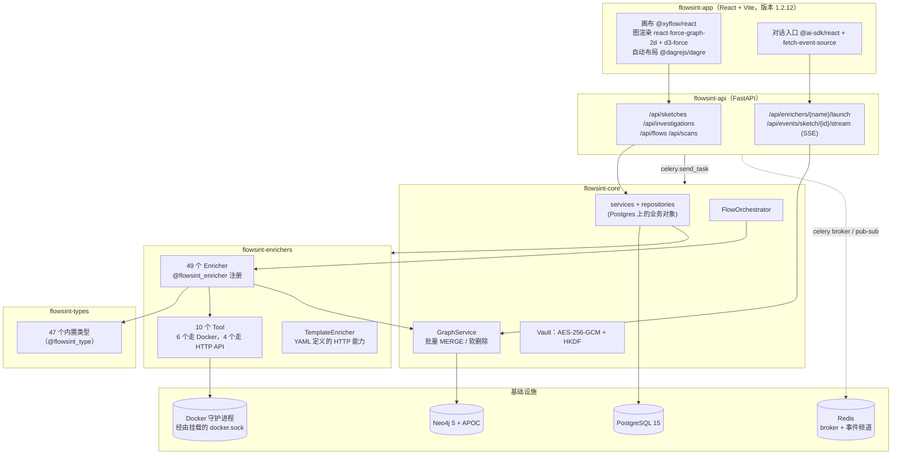
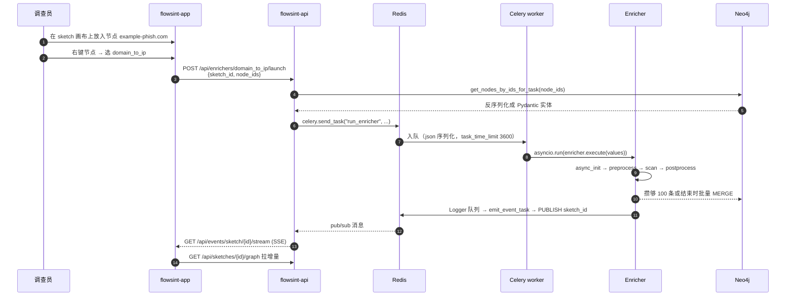

**Flowsint 真正下的注，不是"再多一个 OSINT 工具"，而是把调查图里一个节点是谁定义成 `(实体类型, nodeLabel, sketch_id)` 三元组。** 这个决定写在 `flowsint-core/src/flowsint_core/core/graph/repository.py:120` 那条幂等写入（`MERGE`）语句里。它一次买到三样东西：同一张图不会有重复节点、删除只是打标记、换一个 sketch 就是一份干净的隔离工作面。代价写在同一批文件里：图不是全局知识库，跨 sketch 的关系得靠人脑记。

OSINT（开源情报）圈不缺工具。Maltego 早把图谱化做成商品，SpiderFoot 把自动化扫描做成本地服务，Maigret、theHarvester、Recon-ng 各守一个垂直方向。Flowsint 挤进来的缝隙有三条：全部跑在自己机器上，查询留下的节点和边可以回访可以重放，而接新能力不一定要求你写 Python。

这篇的目标是把这三条讲到源码级，并且把它做砸了的地方一并指出来。所有断言基于默认分支 `main` 的提交树：v1.2.12 于 2026-08-26 发布，最后一次提交在 2026-09-06。文末给了核对方法与失效条件。

## 目录

| → | [系统地图](#系统地图三层扩展与三套存储) | [三组易混概念](#三组容易混在一起的概念) | [Enricher 管线](#enricher-管线从注册到落图) | [图写入](#图写入merge-键软删除与一百条一批的事务) |
|---|---|---|---|---|
| → | [任务流案例](#一次调查如何流过整个系统) | [Flow 编排](#flow把一次性拖拽变成可重放的工件) | [不写 Python 的扩展](#不写-python-的两条扩展路) | [密钥保险柜](#密钥保险柜是一层真实现) |
| → | [数据源与外部依赖](#数据源外部依赖与那根-dockersock) | [AI 入口](#ai-入口做的是模板不是查询) | [同类工具分工](#与-maltego-cespiderfootmaigret-的分工差异) | [部署差异](#部署dev-和-prod-不是同一份-compose) |
| → | [常见故障](#六类常见故障与排查顺序) | [谁该用](#谁该用谁可以等) | [自测题](#自测题) | [练习](#练习) |
| → | [下一步读什么](#下一步读哪份代码) | [结尾判断](#结尾判断) | [仓库快照](#仓库快照与参考资料口径) |

## 系统地图：三层扩展与三套存储

Flowsint 是一个 5 子包的单仓库（monorepo），另有 878 个受版本控制的文件，其中 325 个 `.py`、395 个 `.ts`/`.tsx`。后端约 3.08 万行 Python，前端 `flowsint-app/src` 约 4.78 万行。


```mermaid
flowchart TB
    subgraph APP["flowsint-app（React + Vite，版本 1.2.12）"]
        CANVAS["画布 @xyflow/react<br/>图渲染 react-force-graph-2d + d3-force<br/>自动布局 @dagrejs/dagre"]
        AI["对话入口 @ai-sdk/react + fetch-event-source"]
    end

    subgraph API["flowsint-api（FastAPI）"]
        R1["/api/sketches /api/investigations<br/>/api/flows /api/scans"]
        R2["/api/enrichers/{name}/launch<br/>/api/events/sketch/{id}/stream (SSE)"]
    end

    subgraph CORE["flowsint-core"]
        SVC["services + repositories<br/>(Postgres 上的业务对象)"]
        GS["GraphService<br/>批量 MERGE / 软删除"]
        ORCH["FlowOrchestrator"]
        VLT["Vault：AES-256-GCM + HKDF"]
    end

    subgraph ENR["flowsint-enrichers"]
        E49["49 个 Enricher<br/>@flowsint_enricher 注册"]
        T10["10 个 Tool<br/>6 个走 Docker，4 个走 HTTP API"]
        TPL["TemplateEnricher<br/>YAML 定义的 HTTP 能力"]
    end

    subgraph TYP["flowsint-types"]
        PT["47 个内置类型（@flowsint_type）"]
    end

    subgraph INFRA["基础设施"]
        PG[("PostgreSQL 15")]
        RD[("Redis<br/>broker + 事件频道")]
        N4J[("Neo4j 5 + APOC")]
        WL[("Docker 守护进程<br/>经由挂载的 docker.sock")]
    end

    CANVAS --> R1
    AI --> R2
    R1 --> SVC
    R2 --> GS
    API -->|"celery.send_task"| CORE
    SVC --> ENR
    E49 --> PT
    E49 --> T10
    T10 --> WL
    E49 --> GS
    ORCH --> E49
    SVC --> PG
    API -.->|"celery broker / pub-sub"| RD
    GS --> N4J
```

依赖方向大体向下——`flowsint-app → flowsint-api → flowsint-core → flowsint-enrichers → flowsint-types`，README 里的 `Module dependencies` 一节就是这么画的。有一处例外值得记住：enricher 引用工具时写的是 `from tools.network.subfinder import SubfinderTool`，而这个 `tools` 包位于 `flowsint-enrichers/src/tools/`，并不在 `flowsint_enrichers` 命名空间下。`flowsint-enrichers/pyproject.toml` 的 wheel 目标只声明了 `packages = ["src/flowsint_enrichers"]`，`tools` 不在其中。它在 uv 工作区里能 import 成功（可编辑安装把 `src` 整层放进了搜索路径，具体机制本文未验证），但这意味着一件事值得记住：`tools` 是仓内实现细节，不是对外 API。

| 模块 | 语言 | 职责 | 你会在哪类改动里碰到它 |
|------|------|------|----------------------|
| `flowsint-app` | TypeScript | 交互画布、图渲染、Flow 编辑、富文本笔记 | 交互、可视化性能 |
| `flowsint-api` | Python (FastAPI) | 鉴权、REST 路由、SSE 中继 | 端点、权限 |
| `flowsint-core` | Python | Enricher 基类、GraphService、FlowOrchestrator、Vault、Celery | 调度、图写入、密钥 |
| `flowsint-enrichers` | Python | 49 个 Enricher、10 个 Tool、YAML 模板执行器 | 新增能力 |
| `flowsint-types` | Python (Pydantic) | 47 个内置实体类型、`TYPE_REGISTRY` | 新增实体字段 |

## 三组容易混在一起的概念

大部分对 Flowsint 的误判来自把这三组东西当成一件事。

**Enricher、Tool、Template 是三层。** 官方文档在 `docs/developers/managing-enrichers.mdx` 里写得很直白：加数据源写 Tool，加情报流程写 Enricher。Tool 只有四个类方法加一个 `launch()`，返回原始数据，完全不知道 Flowsint 生态的存在；Enricher 知道类型、知道图、知道参数和密钥，负责把结果落成节点和边。第三层是 YAML 模板，不写代码就能定义一个"调 HTTP 接口并按 JSON 路径映射成实体"的能力。

**Sketch 和 Investigation 是两级容器。** 数据库里有 `investigations`、`sketches`、`sketches_profiles` 三张表。一个调查（Investigation）挂多个 sketch，而图节点只属于 sketch，因为 MERGE 键里带的是 `sketch_id`。权限同样有两套：`SketchesProfiles.role` 是个默认 `editor` 的字符串列，`InvestigationUserRole` 用的是 `OWNER / ADMIN / EDITOR / VIEWER` 枚举。把 sketch 当成"项目"来用会撞墙，它是工作面；沉淀结论的 `Analysis`、AI 对话 `Chat` 都挂在调查上。

**Flow 和 Scan 是两件事。** Scan 是一次执行记录（`/api/scans/sketch/{id}` 只读、可删），Flow 是存在 Postgres 里的一张 `flow_schema`（节点加边），可以被反复启动。二者的关系是"脚本"和"这一趟跑出的日志"。

## Enricher 管线：从注册到落图

`domain/to_ip.py` 是最小的完整样本。真实代码有一个 `__init__` 里的映射表——它不是可有可无的装饰，`postprocess()` 用的就是它，而不是形参 `original_input`：

```python
@flowsint_enricher
class ResolveEnricher(Enricher):
    """Resolve domain names to IP addresses."""

    InputType = Domain
    OutputType = Ip

    def __init__(self, *args, **kwargs):
        super().__init__(*args, **kwargs)
        self.domain_ip_mapping: List[tuple[Domain, Ip]] = []

    @classmethod
    def name(cls) -> str:
        return "domain_to_ip"
```

```python
    async def scan(self, data: List[InputType]) -> List[OutputType]:
        results: List[OutputType] = []
        self.domain_ip_mapping = []
        for d in data:
            try:
                ip = socket.gethostbyname(d.domain)
                ip_obj = Ip(address=ip)
                results.append(ip_obj)
                self.domain_ip_mapping.append((d, ip_obj))
            except Exception as e:
                Logger.info(
                    self.sketch_id,
                    {"message": f"Error resolving {d.domain}: {e}"},
                )
                continue
        return results

    def postprocess(
        self, results: List[OutputType], original_input: List[InputType]
    ) -> List[OutputType]:
        for domain_obj, ip_obj in self.domain_ip_mapping:
            if not self._graph_service:
                continue
            self.create_node(domain_obj)
            self.create_node(ip_obj)
            self.create_relationship(
                domain_obj,
                ip_obj,
                "RESOLVES_TO",
            )
            self.log_graph_message(
                f"IP found for domain {domain_obj.domain} -> {ip_obj.address}"
            )
        return results
```

除了 `RESOLVES_TO` 这条边，这个文件还顺带说明了两件事：`socket.gethostbyname` 只回一个 IPv4 地址且是阻塞调用，多记录解析走的是 `domain_to_dns`（内部调 `dnsx`）；写图集中在 `postprocess()`，`scan()` 只负责拿数据。

真正的入口不是 `scan()` 而是基类的 `execute()`（`enricher_base.py:426`）：

```python
    async def execute(self, values: List[Any]) -> List[Dict[str, Any]]:
        if self.name() != "enricher_orchestrator":
            Logger.info(self.sketch_id, {"message": f"Enricher {self.name()} started."})
        try:
            await self.async_init()
            preprocessed = self.preprocess(values)
            results = await self.scan(preprocessed)
            processed = self.postprocess(results, preprocessed)

            # Flush any pending batch operations
            self._graph_service.flush()

            if self.name() != "enricher_orchestrator":
                Logger.completed(
                    self.sketch_id, {"message": f"Enricher {self.name()} finished."}
                )

            return processed

        except Exception as e:
            if self.name() != "enricher_orchestrator":
                Logger.error(
                    self.sketch_id,
                    {"message": f"Enricher {self.name()} errored: {str(e)}"},
                )
            return []
```

这条管线有三个后果需要写进你的运维预期。第一，`except Exception` 后返回空列表：Enricher 内部任何异常都不会让 Celery 任务失败，只会留下一条 `Logger.error`，任务状态照样是 `COMPLETED`。第二，`asyncio.run()` 出现在 `flowsint-core/src/flowsint_core/tasks/enricher.py`，也就是"同步任务里再套一层事件循环"是实际存在的，异步写法省下的是 Tool 内部的并发，不是这层包装。第三，`preprocess()` 会静默丢弃校验不通过的输入项，只在一条都不剩时才记一条 `Logger.warn` 并把**原始未校验的值**交回给 `scan()`。

注册机制确实简单：`@flowsint_enricher` 把类以 `name()` 为键塞进全局 `ENRICHER_REGISTRY`；`load_all_enrichers()` 用 `os.walk` 递归扫包、跳过下划线开头的文件、`importlib` 逐个 import 来触发装饰器。这里藏着一个坑：import 失败时它只往 stderr 打一行 `Warning: Failed to import ...` 就继续往下走，那个能力于是安静地不存在。前端画布上少了一个 enricher，先去 worker 日志里搜这行警告，比查数据库快。

Enricher 的元数据也不只是 `name()`。`category()`、`key()`、`icon()`、`documentation()` 和 `params_schema` 一起构成前端能画出来的全部信息；`input_schema()` / `output_schema()` 由基类根据 `InputType` / `OutputType` 自动生成。前端 `launch-enricher.tsx` 按节点类型拉取可启动的能力，落到后端就是 `list_by_input_type()` 与 `/api/flows/input_type/{type}` 这条筛选。

49 个 enricher 的类别分布透露了作者的投入方向：Domain 12 个，Website 和 Email 各 7 个，Ip 6 个。剩下的都在个位数：social 4，Organization 3，CryptoWallet、phones、Individual 各 2，Asn、Cidr、external、IP 各 1。顺带一条：类别字符串的大小写没有统一，`Ip` 有 6 个、`IP` 有 1 个，`phones` 与 `Domain` 并存。而 `list_by_categories()` 直接拿原始字符串分组排序，于是前端标题里会出现两组 IP。

## 图写入：MERGE 键、软删除与一百条一批的事务

`repository.py` 里两条查询模板说明了 Flowsint 对"图"的全部理解。节点（`repository.py:120`）：

```python
        query = f"""
        MERGE (n:{node_type} {{ nodeLabel: $node_label, sketch_id: $sketch_id }})
        ON CREATE SET n.created_at = $created_at
        SET n += $props
        SET n.deleted_at = null
        RETURN elementId(n) AS id
        """
```

边（`repository.py:148`）：

```python
        query = f"""
        MATCH (from:{from_type} {{nodeLabel: $from_label, sketch_id: $sketch_id}})
        WHERE from.deleted_at IS NULL
        MATCH (to:{to_type} {{nodeLabel: $to_label, sketch_id: $sketch_id}})
        WHERE to.deleted_at IS NULL
        MERGE (from)-[r:{rel_label} {{sketch_id: $sketch_id}}]->(to)
        SET r += $props
        SET r.deleted_at = null
        """
```

逐条读：

- **身份是 `(类型, nodeLabel, sketch_id)`。** `example.com` 在两个 sketch 里是两个节点。跨 sketch 的全局视图不存在，这是设计而不只是限制——它让"复制一份子图另起调查"成为默认动作。
- **删除是软删除。** `deleted_at` 加一个 `MATCH ... IS NULL`，重跑 enricher 会把用户手动删掉的节点复活（`SET n.deleted_at = null`）。如果你辛苦清理过一张图，重跑之前先想清楚这一点。
- **`SET n += $props` 每次覆盖属性，`created_at` 只在创建时写。** 想留属性变更历史，图里没有。
- **边要求两端都存在且未删除，否则整条语句安静地不产生任何结果。** `create_relationship` 之前忘了 `create_node`，Neo4j 不报错，你只是少一条边。
- 基类还会自动补 `type`（小写类型名）、`sketch_id`、`label` 三个属性。

写入默认是批量的：`create_graph_service(enable_batching=True)`，`_batch_size = 100`，攒满就 `flush_batch()`，`execute()` 结束时再 flush 一次，每一批都在同一个写事务里跑（`connection.py` 的 `execute_batch` 用 `session.execute_write`）。于是有个不太舒服的分界：一次调查产生的图操作如果超过 100 条，前 100 条已经提交，之后的失败会连累不到它们——部分写入是可能的，原子性只在单批内成立。

## 一次调查如何流过整个系统

> 场景：一个钓鱼域名，要一路查到网络归属，并把结论交给同事。


```mermaid
sequenceDiagram
    autonumber
    participant U as 调查员
    participant FE as flowsint-app
    participant API as flowsint-api
    participant BR as Redis
    participant W as Celery worker
    participant E as Enricher
    participant N as Neo4j

    U->>FE: 在 sketch 画布上放入节点 example-phish.com
    U->>FE: 右键节点 → 选 domain_to_ip
    FE->>API: POST /api/enrichers/domain_to_ip/launch<br/>{sketch_id, node_ids}
    API->>N: get_nodes_by_ids_for_task(node_ids)
    N-->>API: 反序列化成 Pydantic 实体
    API->>BR: celery.send_task("run_enricher", ...)
    BR->>W: 入队（json 序列化，task_time_limit 3600）
    W->>E: asyncio.run(enricher.execute(values))
    E->>E: async_init → preprocess → scan → postprocess
    E-->>N: 攒够 100 条或结束时批量 MERGE
    E->>BR: Logger 队列 → emit_event_task → PUBLISH sketch_id
    BR-->>API: pub/sub 消息
    API-->>FE: GET /api/events/sketch/{id}/stream (SSE)
    FE->>API: GET /api/sketches/{id}/graph 拉增量
```

这条链上有几处值得单独记住。

**画布不是查询表单。** 前端送的是 `node_ids`（Neo4j 的 elementId），后端先按 ID 把节点读回来、反序列化成类型对象，再交给 enricher。也就是说：没有节点的自由文本进不了这条链，调查必须先有一张图。

**推送经过两次异步。** Enricher 不直接跟前端说话。`Logger` 把日志塞进内部队列，一个批处理线程负责写 Postgres，同时以 Celery 任务 `emit_event_task` 的形式把事件 `PUBLISH` 到以 `sketch_id` 命名的 Redis 频道。API 侧订阅该频道，再由 SSE（Server-Sent Events，服务器推送事件）端点转成浏览器可读的事件流。`Logger.completed()` 还会额外发一条状态事件用于刷新图。

所以前端看到的更新是最终一致，而不是写入即可见。broker 或 worker 掉线时这条通知会丢，失败只落在 Python 标准库自己的日志输出里；图仍然写进了 Neo4j，只是画布不动。手动刷新 `GET /api/sketches/{id}/graph` 即可确认。

**能力之间互不引用。** 49 个 enricher 只共享 `flowsint_types` 里的模型和 `flowsint_core` 的服务，没有一个 enricher import 另一个。这是依赖能保持单向的原因。

**Celery 用的是线程池。** 两套 compose 里 worker 的启动参数都是 `--pool=threads --concurrency=10`，`Neo4jConnection` 则是双检锁的单例驱动。10 个线程共享一条连接，再配 `worker_prefetch_multiplier=4`、`worker_max_tasks_per_child=1000`。这意味着一次 `socket.gethostbyname` 阻塞会占住一个线程，而不是整个进程。

**`node_ids` 为空时 API 直接返回 404**（`No entities found with provided IDs`），Flow 那边则会退回 `"sample_value"` 这个假输入——两条路径对空输入的处理并不一致。

## Flow：把一次性拖拽变成可重放的工件

README 里没有 Flow 这一节，它只出现在 `docs/getting-started/flows.mdx` 和编排器代码里，但它恰恰是决定要不要用 Flowsint 的那一块。文档给的定义是：一个输入类型加一串链式 enricher，前一个的输出喂给后一个。用法是在 `/dashboard/flows` 里拖好、按 compute 看执行顺序、保存，然后回到某个 sketch，右键同类型的节点启动它。

工程上它是这样落地的：

- 画布上的 `nodes` / `edges` 存成 Postgres 的 `flow_schema`；启动前 `compute_flow_branches()` 做一次 DFS，把它编译成 `FlowBranch` 列表，每个分支是一串 `FlowStep`（`docs` 与 `core/types.py` 里能看到 `FlowNode`/`FlowEdge`/`FlowStep`/`FlowBranch` 四个模型）。
- `POST /api/flows/{id}/compute` 允许你在不给真实节点的情况下先看编译结果，它内部用 `generate_sample_data()` 造 `example.com`、`192.168.1.1` 这类占位值。
- `FlowOrchestrator` 自己继承 `Enricher`（`name()` 返回 `enricher_orchestrator`），于是一次 flow 执行整体就是一条 Celery 任务 `run_flow`，而不是每个 step 一条。
- 步与步之间是**分支内顺序串联**：`enricher_inputs = outputs`，没有并发，也没有跨分支聚合。缓存键是 `f"{node_id}:{str(inputs)}"`，重复输入不重复查。
- 节点 ID 与能力名之间是字符串前缀耦合：`node_id.split("-")[0]` 取 enricher 名。前端命名规则一改，后端就找不到能力。
- 每一步的耗时、输入输出、状态会写进 `flowsint_core/enricher_logs/enricher_execution_{sketch}_{scan}.json`，出错时先读这个文件，比猜快。

需要纠正一个常见印象：Flowsint 有编排器、有失败重试的声明式配置，但两者不在同一层。`FlowOrchestrator` 遇到校验错误或异常时 `return results`——带着已完成步骤返回，不抛异常；于是 `run_flow` 把这条 scan 标成 `COMPLETED`，错误只存在于 `details` 和那份 JSON 日志里。声明式重试在 YAML 模板那层（`TemplateRetryConfig`：默认 `max_retries=3`、`backoff_factor=0.5`、`retry_on_status=[429,500,502,503,504]`），Flow 层没有。它依然不是 Airflow：没有调度周期、没有 SLA（服务等级协议）承诺、没有分支级并发，也不需要。

## 不写 Python 的两条扩展路

**第一条：YAML 模板。** `flowsint-core/tests/templates/example.yaml` 是一份能直接跑的示例——一个把 `ip-api.com` 的返回值映射成 `Ip` 实体的能力。整份文件 50 行，去掉顶部 17 行注释后，可用的定义是 33 行：

```yaml
name: ip-api-lookup
category: Ip
version: 1.0

input:
  type: Ip
  key: address

request:
  method: GET
  url: http://ip-api.com/json/{{address}}
  params:
    fields: query,status,country,city,lat,lon,isp
  timeout: 30

response:
  expect: json
  map:
    # Ip.address <- response["query"]
    address: query
    # Ip.latitude <- response["lat"]
    latitude: lat
    # Ip.longitude <- response["lon"]
    longitude: lon
    # Ip.country <- response["country"]
    country: country
    # Ip.city <- response["city"]
    city: city
    # Ip.isp <- response["isp"]
    isp: isp

output:
  type: Ip
```

同目录另有 8 份示例，各自对应一种返回形态：数组响应靠 `output.is_array: true` 与 `array_path: data.results` 把一条响应摊成多个节点（`map` 的值本身也支持 `location.country` 这种点路径）；还有 POST 请求、XML、重试、带密钥的（`secrets` 段声明 `{{secrets.API_KEY}}`，值从 Vault 取）、两份 GitHub API 实例。最后一份 `example-invalid.yaml` 是故意写错的，用来喂校验器的测试。

模板存在 `enricher_templates` 表里、按 owner 隔离。启动时 `POST /api/enrichers/{name}/launch` 先查代码注册表，查不到再查模板，于是走 `run_template_enricher` 这条任务，URL 对前端完全一致。这是 Flowsint 与 Maltego 在扩展成本上真正的差别：接一个 REST 数据源不需要碰 Python。

**第二条：自定义类型。** `flowsint-types/src/flowsint_types/registry.py` 提供 `@flowsint_type` 装饰器和 `TYPE_REGISTRY`（内置 47 个类型就是这么登记的）；`CustomType` 表把 `schema`（JSON）、`icon`、`color`、`category`、`checksum` 存在 Postgres 里，`/api/custom-types/{id}/schema` 与 `/{id}/validate` 让你在图上放一个不属于内置目录的实体并校验载荷。启动任务时 API 会用 `create_type_registry_service(db).build_type_resolver(user.id)` 把这些运行期类型接进反序列化链路。

一个边界要说清：导入时的自动识别（`imports/entity_detection.py` 的 `detect_type()`）只遍历内置 `TYPE_REGISTRY`，因为自定义类型没有 `detect()` 方法。也就是说自定义类型要你手动建节点，粘贴文本或上传文件不会自动长出它们。

## 密钥保险柜是一层真实现

`flowsint-core/src/flowsint_core/core/vault.py` 里不只有 `VaultProtocol` 那个协议，还有一份完整实现：

```python
    def _encrypt_key(self, plaintext: str):
        """
        Encrypts a secret with AES-256-GCM + HKDF.
        Returns iv, salt, ciphertext+tag, key version.
        """
        master = self._get_master_key()
        salt = os.urandom(16)
        iv = os.urandom(12)

        data_key = self._derive_user_data_key(master, salt)

        aesgcm = AESGCM(data_key)
        ciphertext = aesgcm.encrypt(
            iv,
            plaintext.encode("utf-8"),
            str(self.owner_id).encode("utf-8"),  # AAD = links secret to user_id
        )

        return {
            "ciphertext": ciphertext,
            "iv": iv,
            "salt": salt,
        }
```

要点：主密钥从环境变量 `MASTER_VAULT_KEY_V1` 读，必须是 32 字节（`base64:` 前缀可选）；每个密钥用一段随机盐值（salt）经 HKDF-SHA256 派生独立的数据密钥，`info` 绑定 `owner_id`，GCM 的附加认证数据也是 `owner_id`；密文、IV、salt 分列存进 `keys` 表。跨用户解不出来不是靠 WHERE 条件单独保证的。README 部署一节把这三个环境变量（`AUTH_SECRET`、`MASTER_VAULT_KEY_V1`、`NEO4J_PASSWORD`）列为暴露到网络前必改，与此对应。

Enricher 侧的语义有个容易踩的细节：`build_params_model()` 的注释写明 vault 密钥在 Pydantic 校验层**永远可选**，真正的必填检查发生在 `async_init()` → `resolve_params()`；缺必需密钥时抛的是拼好的英文提示，让你去 Vault 设置里建同名键。

代码里另有一处小瑕疵：`_derive_user_data_key(master_key, salt)` 忽略了传进来的 `master_key`，在函数体内重新调 `self._get_master_key()`。当前所有调用点传的都是同一个值，所以行为没变，但它意味着"派生密钥只依赖入参"这个签名承诺是假的。

## 数据源、外部依赖与那根 docker.sock

Flowsint 自身不收钱，但它的能力分三种价格：

- **不需要密钥**：`domain_to_ip` 用系统解析器，`ip_to_infos` 直接请求 ip-api.com，`email_to_gravatar` 拿邮箱 MD5 去问 Gravatar，`username_to_socials_maigret` 与 `username_to_socials_sherlock` 调用内置的 Python 库。这一档"不要 key"不等于"不外发"：除 `domain_to_ip` 之外，每一个都在向第三方接口发请求。
- **本地工具 + 可选云**：`asnmap`、`dnsx`、`httpx`、`naabu`、`mapcidr`、`subfinder` 这 6 个 projectdiscovery 工具通过 DockerTool 跑。`PDCP_API_KEY` 可选传入，有 key 才用得上云端资产库。
- **必须有 key**：Whoxy、Dehashed、WhoisXML、Veriphone、Scamlytics、HIBP、C99、Etherscan，再加上你自己 n8n 的 `auth_token`。

统计口径是清楚的：enrichers 目录里 `"type": "vaultSecret"` 出现 24 处，分布在 23 个文件，其中 20 处 `required=True`。

DockerTool 有两个必须提前知道的性质。它的 `launch()` 第一件事是无条件调 `self.install()`，也就是 `client.images.pull(...)`，而镜像标签默认写死 `latest`。于是每次跑 `domain_to_subdomains` 都会去 registry 确认一次镜像，实际执行的始终是上游 latest。要可复现，得自己改 `default_tag`。其次，容器非零退出时它会**把同一条命令再跑一次**以捕获 stderr：一次失败的端口扫描等于跑两遍 `naabu`。

安全边界因此不能只盯 Neo4j。dev 和 prod 两套 compose 都把 `/var/run/docker.sock:...:ro` 挂进了 `api` 与 `celery` 两个服务，因为 Tool 要起兄弟容器。但 Docker 的 socket 没有"只读"这回事：能连上它约等于宿主 root。其余端口在 prod 里都老实绑在 `127.0.0.1`——Postgres 5433、Redis 6379、Neo4j 7474 与 7687、API 5001，对外只留 `5173:8080` 一个口子。`neo4j:5` 那套 APOC 的 `apoc_import_file_enabled=true` 因此被限制在本机可达范围内。真正的威胁不是"7474 被扫到"，而是"谁能进到这台宿主机"。

## AI 入口做的是模板，不是查询

前端确实有 `@ai-sdk/react`，后端也确实有两个大语言模型（LLM）Provider：`core/llm/providers/` 下的 openai 与 mistral。选哪个看 `LLM_PROVIDER`，默认 mistral；密钥是按当前用户从 Vault 里取的（键名 `MISTRAL_API_KEY` / `OPENAI_API_KEY`），只有构造 Provider 那一层才会在没传入时退回环境变量。用途比"自然语言查图谱"窄，也更实在：`template_generator_service.py` 的文档字符串写的是"用 LLM 把一段自由文本生成合法的 enricher 模板 YAML"。

提示词的组成值得看一眼。系统提示里是 `Template` 的字段说明、占位符规则（`{{address}}`、`{{secrets.NAME}}`）和两个完整 YAML 例子，而例子一就是上一节那份 `example.yaml`。每次请求再拼上选中输入与输出类型的 JSON schema，并硬性写明 `response.map` 的键只能取这份 schema 里的字段。之后调 provider，用 `_extract_yaml()` 抠出代码块，`_quote_template_placeholders()` 修一个具体问题——`{{address}}` 这类占位符会被 YAML 解析吃掉；最后 `yaml.safe_load()` 加 `Template(**parsed)`，用 Pydantic 兜住合法性。生成物落进和手写模板同一张表，走同一条 `run_template_enricher`。

对话本身在 `/api/chats/stream/{chat_id}`，返回 `text/event-stream`，并带一个 `x-vercel-ai-ui-message-stream: v1` 响应头去匹配前端的 AI SDK。`Chat` 挂在调查下，每条消息可以携带 `context` 一起送进模型。全仓调用 LLM 的只有两个服务：`chat_service` 与 `template_generator_service`。也就是说，"说一句话就替你跑一次调查"这条路目前没有实现。

## 与 Maltego CE、SpiderFoot、Maigret 的分工差异

| 维度 | Flowsint | Maltego CE | SpiderFoot | Maigret |
|------|----------|------------|------------|---------|
| 形态 | Docker 起的本地 Web 服务 | 桌面客户端 | 本地命令行 + 内嵌 web 服务 | 命令行工具 |
| 图 | Neo4j 5，节点身份含 sketch | 桌面画布，导出自有格式 | 结果表 + 层级视图 | 无 |
| 持久化 | PostgreSQL + Neo4j | 本地工程文件 | SQLite | JSON/HTML 报告 |
| 多步复用 | Flow（存库、可重放） | Transform 手动串 | 模块全扫 | 无 |
| 扩展 | Python Enricher / Tool / YAML 模板 / 自定义类型 | Paterva SDK | Python 模块 | 改源码 |
| 异步 | Celery + Redis，线程池 10 并发 | 无 | 内部并发 | 无 |
| License | Apache-2.0 | 商业 + CE 限制 | MIT | MIT |
| Stars（2026-09-19） | 8.8k | 不适用 | 22.4k | 37.8k |

三处常被写错的地方，按源码与上游 README 校正如下。SpiderFoot 是本地程序，数据落在 SQLite。但它的每次查询都会把目标发给上游 API——"数据不出机器"和"请求不出机器"是两件事。Flowsint 同理，Dehashed、Etherscan 这类 enricher 会外发。Maltego 定价页把 CE 与付费版的差别列在两点：Graph / Search 是否 Unlimited，以及集成数量。具体额度以该页当前文案为准，别照抄博客里的旧数字。Maigret 的定位是用户名横向撒网，它不维护调查状态，也就无所谓回访。

真正的分水岭只有一条：**Flowsint 把"下一步能从哪里继续"做成了数据结构**。Flow 存在库里、节点在图里带 `sketch_id`、删除是软删除。一个只跑一次的扫描器不需要这些。

## 部署：dev 和 prod 不是同一份 compose

`make prod` 走 `docker-compose.prod.yml`，只做 `check-env` → `pull` → `up`，**不构建镜像**，镜像来自 `ghcr.io/reconurge/flowsint-api` 与 `.../flowsint-app`，用 `FLOWSINT_VERSION` 锁版本；浏览器也不会自动打开。`make dev` 走 `docker-compose.dev.yml`，会构建本地镜像并轮询 5173 端口准备就绪后开浏览器。

```bash
# 生产：拉预构建镜像
git clone https://github.com/reconurge/flowsint.git
cd flowsint
make prod
# 首次访问 http://localhost:5173/register 注册账户（仓库不带任何默认账号）

# 开发：本机构建
make dev
```

Windows 没有 Make：把 `.env.example` 复制成根目录及 `flowsint-api`、`flowsint-core`、`flowsint-app` 四份 `.env`，再 `docker compose -f docker-compose.prod.yml up -d`。

两套 compose 的差异不止于此：

| 项 | dev | prod |
|----|-----|------|
| Postgres 镜像 | `postgres:15` | `postgres:15-alpine` |
| Redis 镜像 | `redis:alpine` | `redis:7-alpine` |
| 基础设施端口 | 绑 `0.0.0.0` | 绑 `127.0.0.1` |
| 前端 | Vite dev server `5173:5173` | nginx `5173:8080`，`/api/` 反代 |
| Worker | 本地构建 | GHCR 镜像，`SKIP_MIGRATIONS=true` |

生产的前端会把仓库里的 `flowsint-app/nginx.conf` 覆盖进容器，改用系统解析器以兼容 Podman。这份配置里有一段 `map $http_host $is_flowsint_host` 主机名白名单，默认只放行 `localhost`、`127.0.0.1` 和 `[::1]`，用来挡 DNS rebinding（域名重绑定）。要让同事从局域网访问，得把主机名加进这张表，而不只是开端口。

## 六类常见故障与排查顺序

按现象找，比按模块找快。

1. **能力在画布上不见了。** 到 worker 容器日志搜 `Failed to import`。`load_all_enrichers()` 吞掉 import 异常，缺依赖的能力是静默缺席的。
2. **Scan 显示完成，图上什么都没有。** `execute()` 把所有异常吞成空列表。先查 `GET /api/scans/sketch/{id}` 里那条记录的 `error`，再看 `Logger` 写的 `FAILED` 级别日志；密钥没配、`preprocess` 一条都没校验通过，都会落到这里。
3. **少了一条边但不报错。** 边要求两端节点存在且 `deleted_at IS NULL`。节点没建、或者建了又被软删，`MATCH` 直接空集。
4. **图有更新，画布不动。** 事件要经四跳：Logger 队列、Celery `emit_event_task`、Redis 的发布/订阅（pub/sub）、SSE。任一环节断了都只是通知丢，数据仍在 Neo4j。手动打 `GET /api/sketches/{id}/graph` 或 `MATCH (n) ... WHERE n.sketch_id = $id` 验证。
5. **Flow 中途失败却标成 COMPLETED。** `FlowOrchestrator` 出错时返回已完成的部分而不抛异常。读 `flowsint_core/enricher_logs/enricher_execution_*.json`，里面有每步状态和耗时。
6. **Tool 报 `Failed to connect to Docker daemon`。** 容器里没挂到 `/var/run/docker.sock`，或者宿主的 Docker 用户组权限没给。这条与"7474 打不开"是两类问题。

## 谁该用、谁可以等

值得用：

- 调查以周为单位、要回访同一张图并交给别人继续，Sketch/Investigation 两级容器和软删除正好对上。
- 有内部数据源要接：REST 接口能直接写 YAML 模板，不必碰 Python。
- 安全研究者想把 projectdiscovery 那套命令行工具的输出自动沉淀成图，而不是一堆 txt 文件。
- 当"可扩展调查平台"的教学样本读：类型 / Tool / Enricher 三层分离，依赖单向，值得照抄结构。

可以等：

- 只想查一个域名的 WHOIS 和子域名：`theHarvester` + `subfinder` 就够，不必背 Neo4j 和 Celery。
- 要实时告警的规则引擎语义：SIEM（安全信息与事件管理）的地盘，Flowsint 不做匹配触发。
- 团队要等保、SOC2 之类的认证：测试覆盖现在撑不住。后端 545 个测试函数里，404 个在 `flowsint-core` 的 26 个文件中，整个 `flowsint-api` 只有 1 个文件 6 个函数，HTTP 层基本没测。README 自称测试套件 incomplete，数字对得上。
- 不能接受"主要靠一个维护者"的判断：20 位贡献者里，首位提交 896 次，第二名 10 次。

采用顺序：

1. `make prod` 起栈，注册账户，跑一次 `domain_to_ip`，在 Neo4j Browser（`http://localhost:7474`）里确认 `RESOLVES_TO` 边和 `sketch_id` 属性。
2. 导入 `flowsint-core/tests/templates/example.yaml`，看清 YAML 能力如何变成图上的节点。
3. 建一个 Flow，用 `POST /api/flows/{id}/compute` 看编译出的执行顺序，再在 sketch 里启动它，读 `enricher_logs` 那份 JSON。
4. 到这一步再判断要不要写 Python Enricher、要不要把 `latest` 改成固定标签、要不要暴露到局域网。

## 自测题

1. 一个节点在 Neo4j 里的唯一身份由哪几个属性决定？为什么换 sketch 之后同一个 `example.com` 会是另一个节点？
2. `execute()` 的五个阶段是什么？为什么"enricher 内部抛异常"不会让 Celery 任务失败？
3. 一次 flow 执行会产生几条 Celery 任务、几条 scan 记录？
4. 要给一个返回 JSON 数组的 REST 接口接能力，需要写 Python 吗？需要哪几段 YAML？
5. 用户手动删掉的节点在一次重跑之后回来了，原因出在哪条 Cypher 上？

## 练习

**练习 1：把关系名对上（15 分钟）**

打开 `flowsint-enrichers/src/flowsint_enrichers/` 下 `ip/to_asn.py`、`asn/to_cidrs.py`、`domain/to_asn.py`，把三个 enricher 用的关系类型写下来（`BELONGS_TO` / `ANNOUNCES` / `HOSTED_IN`），再解释为什么 `domain_to_asn` 和 `ip_to_asn` 用的是不同的边。

**练习 2：写一份 YAML 模板（30 分钟）**

仿照 `example-array.yaml`，为一个返回 `{"data": {"results": [{...}]}}` 形态的接口写模板：`input` 用 `type: Ip` 加 `key: address`，`output` 打开 `is_array` 并把 `array_path` 指到 `data.results`。写完对照 `flowsint-core/src/flowsint_core/templates/types.py` 自查字段约束——header 名与参数名的正则是 `^[A-Za-z0-9\-]+$`，`max_retries` 上限 10，`backoff_factor` 落在 0.1 到 10.0 之间。

**练习 3：给一次失败定位（20 分钟）**

一个 flow 的第二个 enricher 拿不到输入。读 `enricher_logs/enricher_execution_*.json`，指出应该先看哪个字段；再解释为什么 `run_flow` 记录的 scan 状态仍是 `COMPLETED`。

**练习 4：判断你的场景（10 分钟）**

拿一个你最近做过的调查任务，对照"谁该用"两栏写 100 字：哪一段会被 Flow 省下，哪一段它接不住。

## 下一步读哪份代码

按顺序读，每份都不长：

1. `flowsint-core/src/flowsint_core/core/enricher_base.py` 的 `execute()` 与 `build_params_model()`：一个能力的完整生命周期和参数校验时机。
2. `flowsint-core/src/flowsint_core/core/graph/repository.py` 的 `_build_node_query()` / `_build_relationship_query()`：图的全部语义就藏在这 30 行里。
3. `flowsint-core/src/flowsint_core/core/orchestrator.py` 的 `_async_scan()`：编排的真实边界（顺序、缓存、部分失败）。
4. `flowsint-enrichers/src/tools/dockertool.py`：外部工具边界的现实写法，包括失败重跑。
5. `flowsint-api/app/api/routes/enrichers.py` 与 `flows.py`：前后端契约，以及代码能力与模板能力如何共用一个 URL。

维护这块代码时优先复核三件事：`repository.py` 里的 MERGE 键（图身份的地基）、`create_graph_service` 的 `enable_batching` 与 `_batch_size`（原子性边界）、`DockerTool.launch()` 里那次无条件 `install()`（供应链与延迟来源）。

## 结尾判断

Flowsint 值得花时间的地方，是它把"调查图"当成有身份、有生命周期、可重放的工件来处理：`(类型, nodeLabel, sketch_id)` 是身份，软删除是生命周期，Flow 与 YAML 模板是重放。这三样落在同一层数据结构上。Maltego 把它们拆在桌面工程文件里，SpiderFoot 摊平成结果表，Maigret 干脆不留。

同样值得提前知道的，是它作为一个 20 人贡献、实质单人维护的项目所付的账。异常被吞成 `COMPLETED`，边写空不报错，批量提交让原子性只在一批内成立，外部工具跟着上游 `latest` 走，HTTP 层几乎没有测试。这些不是需要原谅的疏漏，而是同一批设计选择的另一面，并且两面都摊在源码里，没有藏。

如果你的工作单元是"一次查询"，别用它。如果是"一个还会继续的调查"，那么这些约束是可以提前规划的成本，而不是到了生产环境才发现的意外。

## 仓库快照与参考资料口径

| 项 | 值 |
|----|----|
| 许可证 | Apache-2.0 |
| 最新 release | v1.2.12（2026-08-26） |
| 默认分支最后提交 | 2026-09-06 |
| Stars / Forks | 8,810 / 1,073（2026-09-19） |
| 仓库创建 | 2025-01-31 |
| 贡献者 | 20 人，首位 896 次提交，第二名 10 次 |

本文的参考来源有四类，口径各不一样：

- 源码：[reconurge/flowsint](https://github.com/reconurge/flowsint)。核对方式是只要提交树、不要 blobs 的浅克隆（`git clone --depth 1 --filter=blob:none --no-checkout`），再用 `git ls-tree -r --name-only HEAD` 逐项比对目录与文件，用 `git archive HEAD` 导出内容做全文检索。
- 一手文档：`README.md`、`docs/developers/managing-enrichers.mdx`、`docs/developers/graph-format.mdx`、`docs/getting-started/flows.mdx`、`docs/getting-started/vault.mdx`。注意仓库自带的 mdx 文档页 frontmatter 停在 `version: 1.2.8` / `last_updated_at: 2026-05-15`，而应用已是 1.2.12；README 的 Domain Enrichers 列了 8 项，源码里是 12 项。引用前先以代码为准。
- 对比项目：[smicallef/spiderfoot](https://github.com/smicallef/spiderfoot) 的 README（MIT、SQLite 后端、内嵌 web 服务与命令行）、[soxoj/maigret](https://github.com/soxoj/maigret) 的仓库元信息、[Maltego 定价页](https://www.maltego.com/pricing/) 关于 CE 与付费版差别的表述。
- 失效条件：v1.2.12 之后的改动可能推翻本文的三类结论——`execute()` 的吞异常策略、`repository.py` 的 MERGE 键、`DockerTool` 那次无条件 `install()`。复查时先看这三处。
