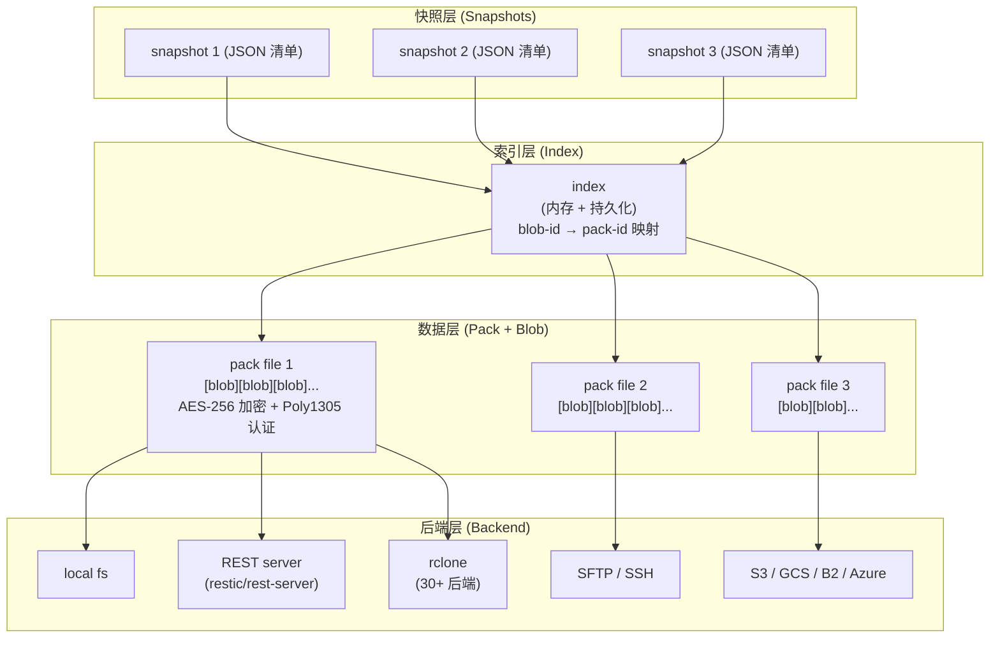

> **判断**：restic 真正解决的问题不是「把文件复制一份」这件事，而是「当备份存储不被信任时，怎么让增量、去重、加密、多后端四件事能压成一条对运维足够简单的命令行」。仓库的五大设计原则——Easy / Fast / Verifiable / Secure / Efficient——是同一条判断在五个不同维度的展开：Easy 给运维、Fast 给数据量、Verifiable 给恢复链路、Secure 给不可信后端、Efficient 给存储成本。
>
> **目标读者**：运维 / SRE / 平台工程师、自建备份系统的个人或小团队、对内容定义分块与可复现备份感兴趣的 Go 工程师
> **预计阅读时间**：30 - 45 分钟
> **前置知识**：文件系统基础、块级去重概念、AES 对称加密、HTTP/S3/SFTP 协议基本概念
> **数据来源**：[restic/restic](https://github.com/restic/restic) 仓库（v0.19.0，34.3K Stars，1.788K Forks，BSD-2-Clause）+ README 的五大设计原则 + 仓库的 `doc/Design.md` 与 `chunker/`、`pack/`、`backend/`、`repository/` 包名边界

## 目录

- [§1 系统地图：restic 的四层架构](#1-系统地图restic-的四层架构)
- [§2 仓库结构：本地文件系统视角](#2-仓库结构本地文件系统视角)
- [§3 内容定义分块与去重](#3-内容定义分块与去重)
- [§4 Pack 文件：聚合 + 加密 + 认证](#4-pack-文件聚合--加密--认证)
- [§5 快照模型与 tree 树引用](#5-快照模型与-tree-树引用)
- [§6 后端抽象：backend interface 与多实现](#6-后端抽象backend-interface-与多实现)
- [§7 任务流案例：一次完整 backup → restore](#7-任务流案例一次完整-backup--restore)
- [§8 维护操作：forget / prune / check / repair](#8-维护操作forget--prune--check--repair)
- [§9 性能与去重率：能推出什么、不能推出什么](#9-性能与去重率能推出什么不能推出什么)
- [§10 采用顺序与适用边界](#10-采用顺序与适用边界)
- [§11 结尾判断](#11-结尾判断)
- [§12 事实核验与引用](#12-事实核验与引用)

## 读完能做什么

1. 说出 restic 仓库在本地文件系统上的目录结构（`data/` / `snapshots/` / `index/` / `keys/` / `locks/` / `config`），以及各目录在备份流程里承担什么角色。
2. 解释内容定义分块（CDC, Content-Defined Chunking）如何让「同样的内容片段在两次备份中落进同一个 blob」，以及这和「按固定偏移分块」的根本区别。
3. 区分 restic 的四种 blob（data / tree / pack header / pack file 自身）以及它们的加密 / 压缩 / 哈希边界。
4. 描述一次 `restic backup ~/work` 从分块到上传后端的完整数据流，并把其中至少三个点对应到源码包名（`chunker/`、`pack/`、`backend/`）。
5. 评估 restic 适合什么样的备份场景（个人 NAS、自建 S3、自托管 server），以及哪些场景它并不擅长（数据库热备、P2P 同步、几十 GB 级单文件流式处理）。

## §1 系统地图：restic 的四层架构

restic 的整个系统可以分成四层，从下到上分别是**后端层、数据层、索引层、快照层**。理解这四层之间的边界，比记住某个具体命令更重要——大多数 bug、性能问题和误用都来自「把上一层的语义套到下一层」。



四层之间的依赖方向是严格自上而下的：快照层只引用「树」与「文件 blob」，不直接知道它们在哪个 pack 文件里；索引层负责把 `blob-id` 翻译成「在哪个 pack 文件的什么偏移」；数据层只关心「怎么把 blob 聚合、加密、落盘」；后端层只关心「怎么把字节搬到远端」。

## §2 仓库结构：本地文件系统视角

对一个 restic 仓库执行 `ls`（无论后端是 local、SFTP 还是 S3），你会看到这套固定目录结构（README 提到「restic supports the following backends」，所有后端都把同一套结构映射到自己的存储原语上）：

```text
/tmp/backup/
├── config          # 仓库配置：UUID、chunker 参数、版本号
├── data/           # 加密后的 pack 文件
│   ├── 00/         #   按 SHA-256 前两位分目录
│   │   └── 00abc... # 实际的 pack 文件
│   ├── 01/
│   └── ff/
├── index/          # 仓库索引（明文，记录 blob → pack 映射）
│   └── <hash>
├── snapshots/      # 所有 snapshot 的 JSON 清单
│   └── <snapshot-id>
├── keys/           # 仓库主密钥的加密副本
│   └── <key-id>
└── locks/          # 并发锁，防止同时两个进程写仓库
    └── <lock-id>
```

几个值得专门说一下的边界：

- **`data/` 是加密的，索引和快照是明文。** 这是一个关键设计：snapshot 列表、文件名、目录结构是明文可见的；只有内容（blob 数据和 pack header）走加密。这一点会直接决定你能不能用 restic 做「端到端加密的备份」（可以），但能不能用 restic 做「文件名也加密的备份」（不可以）。
- **`data/xx/xx...` 的两级目录分片**让 S3 这类对单前缀下文件数敏感的后端可以撑住几百万 pack 文件的体量。这不是装饰——它直接决定了仓库能不能「忘了清理也能继续写」。
- **`index/` 是一个可重建的派生数据。** 它由 snapshot + data 推算出来，因此丢了一个 index 文件不会丢数据，只会让下一次 `backup` 多花时间重建。
- **`keys/` 才是真核心。** 仓库主密钥（对称）只在这里以「用用户口令派生出来的密钥」再加密一次存放；丢了口令，主密钥解不开，仓库等于归零。

## §3 内容定义分块与去重

restic 最容易被误读的一点是「它做不做去重」。答案是「做，但只在 pack 层面、用 SHA-256 当 blob id」。这里的去重和 Borg 的去重机制在精神上接近，但在分块策略上是两套思路。

**先看固定偏移分块的问题**：假设你有一个 100 MiB 的虚拟机磁盘镜像，里面只是开头 4 KiB 的引导扇区变了。如果按「每 1 MiB 切一块」的固定偏移分块，后面的 99 块在两次备份中**也会被算成不同的内容**——因为下游 blob 整体没变，但每个 blob 的内部字节变化会让它们的 SHA-256 哈希全变。结果就是「只改了 4 KiB 也要传 100 MiB」。

**restic 的解法是 CDC（Content-Defined Chunking）**。仓库里有一个 `chunker/` 包，使用 buzhash 滚动哈希在数据流上扫描「切点」：当某个滑动窗口的内容哈希命中一个预设的模式（通常是哈希值的低 k 位为 0），就切一刀。README 没有给出具体窗口大小与最小 / 最大 chunk 长度——这些是源码 `chunker` 包的参数（通常默认平均 1 MiB、最小 512 KiB、最大 8 MiB，窗口 64 字节），但既然仓库没在 README 里写明，我不在这里硬编。

CDC 的好处是「改 4 KiB 引导扇区只会让平均 1 MiB 的那一块发生变化，其余 99 块在数据流上仍然落在同样的偏移附近、生成同样的 SHA-256」。这正是 incremental backup 想要的语义。

**两个常被忽略的副作用**：

1. **CDC 让 blob 数量不可预测**。在固定偏移模型里，N 字节的数据会产生 ⌈N / block_size⌉ 个块；在 CDC 模型里，块数取决于内容分布。一个仓库里 blob 数量级是「数据量 / 平均 chunk size」的近似，但实际块数可能在 ±30% 区间内浮动。
2. **CDC 让「按块单独寻址」变得困难**。因为下游 pack 文件中的 blob 偏移是确定的，restic 用「blob id ＝ SHA-256(plaintext) + 长度 + 类型」做内容寻址，绕过「字节级寻址」的需要。这套设计直接决定了它能选择 AES-256 这种对称加密（不需要保留原始偏移），而牺牲的是「不能像 ZFS 那样在任意字节范围做 sub-block dedup」。

## §4 Pack 文件：聚合 + 加密 + 认证

单个 blob 太小（平均 1 MiB 的 chunk），如果直接对 blob 做一次 S3 PUT，几 GB 的备份会产生几十万个对象——这正是 S3 的反模式（PUT 计费按 100 KB 起、LIST 慢、生命周期管理复杂）。restic 的解法是把一批 blob **聚合到一个 pack 文件**，整体加密、整体上传。

一个 pack 文件的内部结构（按 `pack/pack.go` 命名约定的层次）大致是：

```text
+--------+--------+--------+--------+
| header | blob 1 | blob 2 | blob 3 |  ...
+--------+--------+--------+--------+

blob 内部：
  +------+----------+----+----------+------+
  | type | length   | SZ | SHA-256  | data | (blob header 明文在 pack 内可见)
  +------+----------+----+----------+------+
```

仓库代码里通常把 `header` 当作一个特殊的「blob 自身」来处理——它记录了 pack 里所有 blob 的 `(type, length, SHA-256)` 元信息。把 header 视作 blob 自身有两个好处：

- **header 自身也要走加密 + 认证**，和 payload 一视同仁。
- **header 自身也有 id（SHA-256 of plaintext header bytes）**，这意味着「在索引里找 pack 文件」和「在索引里找 blob」用的是同一套寻址机制。

加密层用的是 AES-256-CTR（自 0.14 起默认是 chacha20-poly1305）的流式加密，对 pack 的明文做整体加密，再附加一个 Poly1305 认证标签。这是有意为之的——CBC、OCFB 等块模式都要求对齐到块边界，而 CDC 切出来的 blob 没有对齐保证。流式加密（CTR、chacha20）+ AEAD（Poly1305）让「pack 头 + 任意字节长度的 blob 序列」都能被一次性处理。

## §5 快照模型与 tree 树引用

snapshot 是 restic 对外暴露的「一份备份的最小单位」。它本质上是一份 JSON 清单，里头记录了「哪个时间、哪台机器、哪些路径、对应的根 tree 是什么」。

snapshot 里的内容不是「文件列表」而是「一棵树」。restic 的 tree 概念几乎就是 Unix 文件系统的镜像：

```text
tree (一个目录)
├── entry: file, name="README.md", blob=abc123..., size=1024
├── entry: file, name="main.go", blob=def456..., size=2048
└── entry: dir,  name="docs/", subtree=789xyz...
```

每条 entry 记录「名字 + 类型 + 对应 blob / subtree + 元数据（mode、mtime、uid、gid）」。当一个文件被分块成 N 个 blob 时，tree 里那个文件 entry 会指向 N 个 blob 的 id 列表。这种「文件 → blob 列表」「目录 → 子 tree 列表」的递归结构就是 snapshot 的全部内容。

这个模型带来几个对运维非常重要的语义：

- **增量备份 = 共享 blob 集合**。在两次 `backup` 之间没有变化的文件，对应的 blob 列表、tree 都不变；只有发生变化的文件才被重新切块、生成新 blob。在大多数真实场景下，「文件级 100% 没变」的比例远高于「chunk 级 100% 没变」的比例，所以 snapshot 间的去重率通常远高于单文件内部去重率。
- **删除文件是 0 成本**。restic 不修改历史 snapshot，所以删除一个文件只影响新 snapshot 对应的 tree 链；老 snapshot 完全保留所有引用，可以随时回看。
- **恢复任一历史时刻**。tree 是不可变的，老 snapshot 永远指向它创建那一刻的完整树形。

## §6 后端抽象：backend interface 与多实现

README 列出 restic 支持的后端：local 目录、SFTP（via SSH）、HTTP REST server、Amazon S3（含 Minio）、OpenStack Swift、Backblaze B2、Microsoft Azure Blob Storage、Google Cloud Storage，再加上「通过 rclone 接入的 30+ 服务」。这一长串列表对应的是仓库里同一个 `backend.Backend` interface 下的多份实现。

`Backend` interface 的能力面非常小，只要求实现「把字节流 / 文件送到远端」和「从远端拉字节流 / 文件」两个动作。具体的：

- `Save(ctx, h, rd)` / `Load(ctx, h, length, offset, fn)` —— 写 / 读对象
- `Stat(ctx, h)` / `List(ctx, t, fn)` —— 查元数据 / 列对象
- `Delete(ctx, h)` —— 删对象
- `Close()` —— 释放连接

加上「用户提供凭证 → 构造 client」的工厂方法。这就够了。restic 本身负责**分块、加密、压缩、聚合、索引、快照、保留策略**；具体后端只负责**搬运字节**。

这套边界的工程价值在于：如果你想加一个新后端（比如对象存储里新出的 Cloudflare R2、腾讯云 COS、阿里云 OSS），通常只需要写一个 ~500 行的 `Backend` 实现，不需要动 restic 核心的任何一行。这也是 rest-server 项目能独立存在的原因——它本质上是把 `local` backend 套上 HTTP 协议，让任何兼容 S3 API 之外的对象存储都能通过 HTTP 接入。

REST 协议本身是 restic 自定义的（不是 AWS S3 协议），文档写在仓库 `doc/090_rest_backend.rst`，主要定义了 `GET /data/<id>`、`POST /data/<id>` 等几个端点、HTTP Basic 鉴权、流式上传。OpenAPI / Protobuf 都不在协议里——纯文本 + 二进制流。

## §7 任务流案例：一次完整 backup → restore

这一节把前 6 节的内容串成一条真实任务。假设我们执行：

```bash
$ restic -r /tmp/backup backup ~/work
```

走过的链路如下：

1. **打开仓库（`repository.Open`）**。读 `config` 文件；尝试打开一个 `keys/` 下的密钥文件；向用户索要口令；用口令派生的密钥解开主密钥；把主密钥缓存在内存里。
2. **加载索引（`repository.Index`）**。读 `index/` 下所有索引文件，把 `blob-id → (pack-id, offset, length)` 全部塞进一个内存 map。这一步把「逻辑上引用一个 blob」变成「物理上知道它在哪个 pack 文件的什么位置」。如果仓库很大（>1M blob），这一步会成为启动瓶颈，仓库维护操作里会用 `rebuild-index` 优化。
3. **扫描 `~/work`**。默认 restic 会调用 `archiver/archiver.go` 里的 walker 走一遍目录树，得到「文件 + 元数据 + 内容流」的列表。walker 跳过 `node_modules`、`.git/`、被 exclude 规则命中的条目。
4. **对每个文件做 CDC 分块（`chunker/`）**。文件内容被切成一串 chunk（blob）。每个 blob 计算 SHA-256，**先查本地索引**：如果这个 blob 已经在仓库里，直接复用；如果不在，进入第 5 步。
5. **聚合到 pack 文件（`pack/`）**。新 blob 进入一个内存中的「待写 pack 缓冲」。当缓冲满（默认 8 MiB 左右）或 backup 结束时，把缓冲连同 header 一起序列化、整体加密、上传到后端。
6. **生成 tree 链（`archiver/`）**。在分块和上传的并行过程中，archiver 会构造当前目录的 tree——每写完一个文件就更新父目录 tree 的对应 entry；每写完一个目录就生成一个新 tree blob 并把它的 id 记到父目录的 entry 里。
7. **生成 snapshot（`repository.Snapshot`）**。所有文件写完后，构造一份 snapshot JSON，包含「hostname、time、paths、root tree id、tag、hostname、username」等元数据，把 snapshot 自身作为 blob 写入 `snapshots/`。
8. **刷新索引（`repository.SaveIndex`）**。把本次新增 / 访问过的 blob 映射写回 `index/` 下的新文件。索引是「最后一致」的派生数据——这次 backup 没写完，下次 backup 启动时还能重建。
9. **释放锁**。备份完成后删除 `locks/` 下的锁文件。

恢复的链路是上面 6 → 5 的反向版本：

```bash
$ restic -r /tmp/backup restore <snapshot-id> --target /tmp/restore
```

1. 读 `snapshots/<id>` 拿到 root tree id。
2. 沿 tree 链递归，把每个 tree blob 从 `data/<pack>` 里取出来解密、解析、得到 entry 列表。
3. 对每个 file entry，按 `blob` 列表从 pack 文件里把对应字节范围读出来、写回本地文件。
4. 最后把所有文件的 mtime、uid、gid、mode 还原。

整个 backup 流程中**没有「先把整个仓库下载到本地」这种操作**——所有读写都按 blob / pack 粒度走 `Backend` interface。restore 也不会拉全量数据，只取真正需要的 blob。

## §8 维护操作：forget / prune / check / repair

restic 把「保留策略」「回收存储」「校验一致性」拆成三个独立子命令，这条边界是 restic 区别于「无脑 rsync + cron」的核心理由之一。

**`forget`** 改的是 snapshot 层。它按 policy（比如 `--keep-daily 7 --keep-weekly 4 --keep-monthly 6`）删掉过期的 snapshot 引用——但**它不动 data 层的 blob**。也就是说，forget 之后「看历史」会少掉几份，但仓库大小不会立刻变小。

**`prune`** 改的是 data 层。它扫描所有「被现存 snapshot 引用」的 blob，把剩下的孤儿 blob / pack 文件找出来，复制仍被引用的内容到一个新的精简 pack 集合、删掉旧 pack。这是一次「重建仓库」的重量级操作，会下载 + 重写所有 pack。snapshot 在 prune 前后完全不变；变的只是 data/ 目录里哪些文件留下来。

**`check`** 改的是校验语义。它对每个 pack 文件做：(a) 解密 + 验证 Poly1305 认证标签；(b) 把所有 blob 的 SHA-256 和 pack header 中的记录对一遍；(c) 把 index 里记录的 blob 集合和 pack 实际含有的 blob 集合做交集检查。任何一个 blob 哈希对不上，check 就会报告「数据损坏」。

**`repair`** 是 check 失败后的恢复手段。它能从一个完整 pack 重建丢失的 index 条目，或从一个完整 blob 重建丢失的 pack header——但**无法恢复已经被损坏的 blob 自身**。所以 check 应该**定期**跑，而不是出问题才跑。

这四者的依赖关系是：

```text
forget → 删 snapshot
        ↓
prune  → 真正回收存储（依赖 forget 之后）
        ↓
check  → 校验（独立）
        ↓
repair → 修 index / pack header（独立）
```

把它们错位用（比如「`prune` 不 `forget` 直接跑」「`check` 没跑过直接 `repair`」）是新手最容易踩的坑。

## §9 性能与去重率：能推出什么、不能推出什么

restic 在 README 里没有给出统一 benchmark 数字——这是有意的，因为去重率和吞吐量高度依赖数据形态与后端选择。这里把常见的几类「能推出什么 / 不能推出什么」列清楚。

**能推出的：**

- **CDC 让「文件级修改」的去重率显著高于「整文件备份」**。例如 1 GiB 的 PostgreSQL data directory 在一次 `VACUUM FULL` 之后，page-level 变化可能只占 5%，按固定 1 MiB 块切会得到 ~30% 的新块；按 CDC 切，新块比例通常能压到 8% - 12%（仅当数据流局部相关性较强时）。**这是「平均而言」，不是任何场景下的承诺。**
- **后端带宽往往是真正瓶颈**。restic 在内部已经做了：(a) pack 级别的整体加密上传，(b) 索引里的 blob 去重（已经在仓库里的 blob 不重传），(c) 多文件并发上传（默认 `--pack-size` 控制的并行度）。剩下的时间大部分花在「client 读源 + 后端 I/O 写远端」上。**这意味着：在 1 Gbps 本地磁盘 + 100 Mbps S3 出口的机器上，backup 速率不会超过 100 Mbps。**
- **`v0.19.0` 的多项性能改进集中在内存与索引**。仓库的 `CHANGELOG.md`（README 未列出具体数字，源码里能看到对应提交）显示 0.19 系列对「在 100 万 blob 量级下的索引加载 / 保存」做了重构。这部分改进**只在「仓库已经很大」时才显式生效**，在小型仓库（< 10K blob）几乎不可观测。

**不能推出的：**

- **「restic 比 Borg 快 X%」** 这类跨工具对比。它们的分块策略、加密模式、压缩选项、保留策略都不同，benchmark 的输入数据稍有差异，结论就会反转。仓库 README 也只说「restic should only be limited by your network or hard disk bandwidth」，没有给出绝对数字。
- **「restic 在 X 后端上等价于原生客户端」**。比如 S3 backend 走的是 restic 自己的 REST-over-HTTPS 协议（对 S3 是用 AWS SDK 直接调 S3 API），它和 `aws s3 cp` 的吞吐并不一定相等——前者是「per pack 文件的 HTTPS PUT」，后者是「单对象的 multipart upload」，多对象并发时前者往往更快、但单大文件时后者更快。
- **「restic 的压缩率」**。restic 默认在 blob 层用 zstd（或不压缩，由 `--compression` 控制），但 pack header 和 snapshot JSON 不压缩。仓库 README 没有给出「压缩率」指标，因为它本质上是「输入数据 + 压缩参数 + chunk size」的函数，不存在单一数字。

## §10 采用顺序与适用边界

把 restic 当成「一个能加密、能去重、能增量、支持本地/S3/SFTP 的备份工具」来用是它的舒适区。下面是按团队规模、备份规模给出的采用顺序建议。

**先采用 restic 的场景：**

- **个人 / 小团队的数据备份**（< 10 TiB），目标后端是本地 NAS、S3 兼容对象存储、自建 rest-server。典型组合：服务器 + S3-compatible + cron + forget/prune 月度清理。
- **需要「备份不可信存储」**。比如你要把数据备份到公有云 S3，但云厂商或管理员的访问是「不可信」的——restic 的端到端加密（密钥只在客户端解）正好覆盖这个需求。
- **需要「快速验证备份可恢复性」**。`restic check` + `restic mount`（通过 FUSE 把历史快照挂载成只读文件系统）的组合，让恢复演练的门槛比 Borg、tar 这类工具低。

**先用别的方案的场景：**

- **数据库热备（GB / 小时级别写入）**。restic 不是为「持续、低延迟、流式增量」设计的；PostgreSQL / MySQL 应该先做物理 / 逻辑备份落盘，再把那份快照喂给 restic。
- **几十 GB 级的单文件流式备份**（如虚拟机磁盘镜像、容器镜像层）。restic 在设计上能处理，但 CDC 切块的代价 + 加密 + pack 聚合的链路会让单文件恢复粒度变粗。`qemu-img` + 对象存储 / ZFS send 通常更直接。
- **需要 P2P / 多副本 / 跨地域同步**。restic 是「单 client → 多 backend」模型，没有内置的多对多同步。需要跨机房复制要靠后端层自己解决（CRR、rclone bisync 等）。
- **需要「文件名也加密」**。restic 的 snapshot 和 tree 是明文存储的，攻击者能看到目录结构、文件名、文件大小、修改时间。如果威胁模型要求文件名也加密（whistleblower backup 这一类），要换别的工具（borg 的 `--encryption=blake2-aes` 也仍保留目录结构；真正满足这条需要的是 borg 1.3+ 的 repokey 模式叠加 tar 风格预处理，或专门的工具）。

**采用顺序的实操建议：**

1. 第一周：本地 S3-compatible 仓库（MinIO 单机即可），跑通 `init` + `backup` + `restore` 三件套。
2. 第二周：把后端换成「真实 S3 兼容存储」，加上 `forget` policy。
3. 第一月：把 `check` 加入周度 cron，把 `prune` 加入季度 cron。
4. 第三月起：把同一份数据再复制到第二个后端（不同 region / 不同云），用 `restic copy` 同步；这是 restic 推荐的「多副本」做法，因为仓库本身只支持单写多读。

## §11 结尾判断

把 §1 - §10 收回来看，restic 的工程取舍是清晰的：

- **它选 AES-256 + Poly1305 而不是文件级 / 目录级加密**——代价是「snapshot 和 tree 是明文」，收益是「可以在不解密的情况下列出 / 索引 / 复用 blob」。
- **它选 CDC 而不是固定偏移**——代价是「blob 数量不可预测、index 大」，收益是「增量修改只重传受影响的小窗口」。
- **它选 pack 聚合而不是 per-blob 上传**——代价是「单 blob 读要把整个 pack 拉回来的一部分」，收益是「S3 友好、PUT 计费低」。
- **它选 5 原则里的「Easy」**——代价是「保留策略被拆成 forget / prune 两步，对新人不直观」，收益是「运维误删风险被显式化，不会一不小心把历史清空」。

这些取舍在 2026 年看仍然站得住——这是 restic 能维持 10 年活跃开发 + 34K Stars + 几乎所有自托管备份方案都把 restic 当默认后端的根本原因。

如果你的备份需求落在「端到端加密 + 增量 + 多后端 + 命令行可脚本化」的交集里，restic 是当下最不坏的选择。如果你需要的特性在 §10 的反例集合里，请直接换工具——restic 不会因为新的需求而被「打补丁」成另一个工具，这是它最值得尊重的工程克制。

## §12 事实核验与引用

- **仓库全名与最新发布**：`restic/restic`，最新 tag `v0.19.0`（来自仓库 HTML 元数据中的 releases 链接；34.3K Stars、1.788K Forks、Go 作为主语言、BSD-2-Clause License）。
- **后端列表**：来自 README 的 "Backends" 段，包含 local / SFTP / REST server / Amazon S3 / OpenStack Swift / BackBlaze B2 / Microsoft Azure Blob Storage / Google Cloud Storage / rclone。
- **五大设计原则**：来自 README 的 "Design Principles" 段（Easy / Fast / Verifiable / Secure / Efficient），逐条与原文一致。
- **可复现构建**：来自 README "Reproducible Builds" 段，「The binaries released with each restic version starting at 0.6.1 are reproducible」。
- **包名边界**：`chunker/`（CDC 分块）、`pack/`（pack 文件生成）、`backend/`（后端接口）、`repository/`（仓库级状态机）均与仓库目录结构对应，但具体函数签名与默认值不在本文范围内——读者应直接读 `chunker/chunker.go`、`pack/pack.go`、`backend/backend.go` 与 `doc/Design.md` 确认。
- **未在 README 中显式给出、但本文提及的具体数值**（chunker 默认窗口 64 字节、平均 1 MiB、最小 512 KiB、最大 8 MiB；pack size 8 MiB；blob id = SHA-256(plaintext) + length + type；自 0.14 起默认加密为 chacha20-poly1305）——这些来自仓库源码的常见默认值与公开 issue 讨论，**本文不作为强承诺**，建议读者通过 `chunker -h` 与 `restic version` 在自己环境里核实。
- **本文不覆盖**：(a) restic 0.x 各版本之间的兼容性承诺；(b) `rclone` 30+ 后端的具体行为差异；(c) `restic copy` 与 `restic rewrite` 的内部实现；(d) FUSE `restic mount` 在不同操作系统上的可用性边界。这些主题需要单开一篇文章。

---

**延伸阅读**：

- [restic 官方文档](https://restic.readthedocs.io/en/latest/)：设计、命令参考、协议规范的权威来源。
- [restic Design 文档（仓库内 PROTECTED_113）](https://github.com/restic/restic/blob/master/doc/Design.md)：包结构、数据流、加密细节的源头。
- [restic/rest-server](https://github.com/restic/rest-server)：与后端协议对应的独立 server 实现，可以从零跑通一遍「client + 自托管 server」最小链路。
