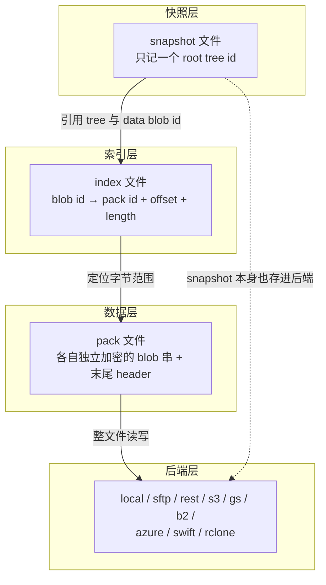

> **判断**：restic 面对的实际问题不是「把文件复制一份」，而是「备份存储不可信时，加密、去重、增量、多后端这四件事如何同时成立，并且对运维仍然只是一条命令行」。README 里的五条设计原则——Easy / Fast / Verifiable / Secure / Efficient——是这条约束在五个方向上的投影：Easy 面向运维，Fast 面向数据量，Verifiable 面向恢复链路，Secure 面向不可信后端，Efficient 面向存储成本。四者同时满足的做法在仓库里写得很具体：对象只写不改，数据靠内容哈希共享，回收只由一个命令负责。`doc/design.rst` 用一节 "Read and Write Ordering" 把它落成四条不变量，本文其余部分基本沿着这条主线展开。
>
> **读完后能做什么**：说出仓库里每个目录归哪条不变量管；解释内容定义分块与 pack 聚合各省下什么、各赔上什么；判断一次中断的 `backup` 重跑要付多少代价；知道 `restic check` 默认到底校验了什么；以及哪些备份场景应该直接换工具。
>
> **依据**：[restic/restic](https://github.com/restic/restic) `main@ba802d4`（末次提交 2026-08-29，`VERSION` 为 `0.19.1-dev`），最新 release 为 `v0.19.1`（2026-07-05），GitHub API（应用程序接口）在 2026-09-20 读到 36,137 stars / 1,878 forks / BSD-2-Clause。格式与设计出自 `doc/design.rst`，运维语义出自 `doc/045_working_with_repos.rst`、`doc/047_tuning_parameters.rst`、`doc/060_forget.rst`、`doc/faq.rst`，接口与常量按 `internal/` 下源码逐条对照。

## 目录

- [§1 系统地图：四层存储格式与一条读写顺序契约](#1-系统地图四层存储格式与一条读写顺序契约)
- [§2 仓库结构：本地文件系统视角](#2-仓库结构本地文件系统视角)
- [§3 内容定义分块：切点从哪来、防的是什么攻击](#3-内容定义分块切点从哪来防的是什么攻击)
- [§4 Pack 文件：聚合 + 加密 + 认证](#4-pack-文件聚合--加密--认证)
- [§5 快照与 tree：增量为什么只是共享 blob](#5-快照与-tree增量为什么只是共享-blob)
- [§6 后端抽象：13 个方法与 5 层包装](#6-后端抽象13-个方法与-5-层包装)
- [§7 缓存与锁：并发写为什么不用停机](#7-缓存与锁并发写为什么不用停机)
- [§8 任务流案例：一次完整 backup → restore](#8-任务流案例一次完整-backup--restore)
- [§9 维护操作：forget / prune / check / repair 各自动了什么](#9-维护操作forget--prune--check--repair-各自动了什么)
- [§10 故障排查：按现象定位](#10-故障排查按现象定位)
- [§11 性能与去重率：能推出什么、不能推出什么](#11-性能与去重率能推出什么不能推出什么)
- [§12 采用顺序与适用边界](#12-采用顺序与适用边界)
- [§13 自测：五个能复述机制边界的问题](#13-自测五个能复述机制边界的问题)
- [§14 下一步读哪份代码](#14-下一步读哪份代码)
- [§15 事实核验与引用](#15-事实核验与引用)

## §1 系统地图：四层存储格式与一条读写顺序契约

谈 restic 的架构要把两件事分开，混在一起谈是绝大多数误用的来源：一件是**存储格式**上的四层，另一件是**代码**上的三个主模块。

存储格式从下到上是后端、pack（装着 blob）、索引、快照。代码上 `internal/` 的分工是 `archiver/`（扫描目录、切块、生成 tree）、`repository/`（加解密、pack、索引、锁、prune/repair）、`backend/`（把字节搬到远端），共享类型放在 `internal/restic/`，校验逻辑独立成 `internal/checker/`，恢复逻辑在 `internal/restorer/`。


```mermaid
graph TB
    subgraph SN["快照层"]
        S["snapshot 文件<br/>只记一个 root tree id"]
    end
    subgraph IX["索引层"]
        I["index 文件<br/>blob id → pack id + offset + length"]
    end
    subgraph PK["数据层"]
        P["pack 文件<br/>各自独立加密的 blob 串 + 末尾 header"]
    end
    subgraph BE["后端层"]
        B["local / sftp / rest / s3 / gs / b2 /<br/>azure / swift / rclone"]
    end

    S -->|"引用 tree 与 data blob id"| I
    I -->|"定位字节范围"| P
    P -->|"整文件读写"| B
    S -.->|"snapshot 本身也存进后端"| B
```

| 层 | 存什么 | 谁负责写 | 能不能重建 |
|---|---|---|---|
| 快照 | 时间、主机、路径、root tree id、summary | `archiver/` + `data.SaveSnapshot` | 否，丢了这份历史就没了 |
| 索引 | blob → pack 的映射 | `internal/repository/index/` | 能，`repair index` 从 pack header 重扫 |
| 数据 | blob 串成的 pack | `internal/repository/pack/` + `packer_manager.go` | 否，唯一真数据 |
| 后端 | 不透明对象 | `internal/backend/` 具体实现 | 与 restic 无关 |

四层之上的那条契约才是重点。设计文档 "Read and Write Ordering" 一节列出四条不变量，并明确区分 *Must*（违反即丢数据）与 *Should*（违反可修复）：

- 快照 *must* 只引用已存在的 tree blob。
- 可达的 tree blob *must* 只引用同样存在的 tree 与 data blob（递归）。
- 索引 *must* 只引用现存 pack 里的合法 blob。
- 快照引用的所有 blob *should* 被登记在某个索引里。

由此推出仓库的写入顺序：**先 pack，再 index，最后 snapshot**；读取顺序相反——快照没写完之前，它引用的一切都不算齐备。删除与重写另有三条规则：清理数据的客户端 *must* 先拿独占锁；pack 从索引里摘除之后才能删文件；重写 pack 必须「写新包 → 更新索引 → 删旧包」按序执行。

这三条顺带解释了一个反直觉现象：备份中断不需要清理。pack 和 index 已经落地且自洽，只是还没有快照引用它们——仓库仍然是正确的，下次运行会绕过它们重新上传，留下的重复数据由 `prune` 收（`doc/faq.rst` 第一条就是这个问答）。restic 不需要「事务回滚」，因为它把一致性做进了文件命名与写入顺序里。

## §2 仓库结构：本地文件系统视角

对一个 restic 仓库执行 `ls`，看到的是固定的一套目录加一个顶层 `config`。`internal/backend/layout/layout_default.go` 的注释把这条规则写死了：`data` 目录有**一层**子目录，取文件名前两个十六进制字符，因此是 256 个分片；其余类型平铺。这 256 个目录由 `local` 与 `sftp` 后端在建立连接时对 `Paths()` 逐个 `MkdirAll` 出来——对象存储没有真目录，分片在那里只是键名前缀。

```text
/tmp/restic-repo
├── config          # 加密。JSON：version、id（32 字节随机数 hex）、chunker_polynomial
├── data/           # pack 文件
│   ├── 21/
│   │   └── 2159dd48f8a2...   # 文件名 = 该 pack 文件内容的 SHA-256
│   ├── 32/
│   └── ff/                   # local / sftp 连接时一次性建出 256 个分片
├── index/          # 索引，加密。单个文件控制在 8 MiB 以内
├── keys/           # 主密钥的口令加密副本，唯一不加密的一类文件（JSON）
├── locks/          # 并发锁，加密
├── snapshots/      # 快照 JSON，加密
└── tmp/            # 写 pack 与上传期间的暂存
```

几个容易踩空的边界：

- **`config` 是加密的。** 设计文档写得很清楚：除 `keys/` 目录下的文件之外，仓库里所有文件都走 AES-256-CTR 加密 + Poly1305-AES 认证，格式统一为 `IV || CIPHERTEXT || MAC`，前 16 字节是 IV、末尾 16 字节是 MAC，总开销 32 字节，每个文件一个全新随机 IV。`config` 也在其列，所以「这个仓库是 restic 仓库」这件事本身对存储侧并不显然。
- **文件名是密文的哈希，不是明文的哈希。** 仓库里对象的命名规则是「文件名的十六进制 = 该文件存储内容的 SHA-256」（设计文档称 storage ID），而存进去的内容已经加过密。blob 的 ID 则相反，是**明文** blob 的 SHA-256。这两个哈希经常被混为一谈，后面 §3、§4 会分别用到。
- **可观测的残余是规模与时间，不是内容。** 对象名、对象大小、创建时间戳在后端日志里是明文。设计文档的威胁模型据此列出读侧攻击者能做什么：通过访问模式猜哪些 pack 装的是 tree、通过创建时间推断备份规模、对仓库副本做口令暴破。它同时明确 restic 不防存储侧删除：设计文档的原话是这类攻击「没什么可做的」，需要保证就得换成无第三方访问权限的存储位置。
- **`keys/` 是唯一的命门。** 每个密钥文件是 JSON，记录 KDF（密钥派生函数）类型与参数、salt（盐值），以及用口令派生密钥二次加密后的主密钥；口令经 scrypt 派生（`internal/repository/crypto/kdf.go`）。主密钥一旦泄露，改口令无济于事，设计文档给的出路只有两条：`restic copy` 换仓库重加密，或者整个重建。
- **`index/` 是派生数据，但重建代价不低。** 它能从 pack 文件的 header 扫出来，因此丢索引不丢数据。前提是 pack 的 header 还在且完好——这就是 `repair index` 与 `repair packs` 分工的分界线（见 §9）。

S3 后端历史上有一套单数命名的遗留布局（`key`/`lock`/`snapshot`，且 pack 直接躺在 `data` 下），设计文档标注 restic 0.17 是最后一个支持它的版本；REST（表述性状态转移）后端另有 `layout_rest.go`，路径为扁平的 `{type}/{name}`，不带 `data/xx/` 分片——分片是文件系统视角的产物，不是格式本身的要求。

## §3 内容定义分块：切点从哪来、防的是什么攻击

restic 的去重粒度是常被误读的一点：它做的既不是文件级去重，也不是块级固定偏移去重，而是内容定义分块（CDC，Content-Defined Chunking），去重发生在 blob 这一层。

**固定偏移分块为什么不够用**：拿一个 100 MiB 的虚拟机镜像举例，只在开头 4 KiB 动了引导扇区。按「每 1 MiB 一切」，插入的 4 KiB 会把后面所有块的边界整体推移，于是 100 个块全部变了哈希——改 4 KiB 要传 100 MiB。

**CDC 的做法**是在字节流上滑动一个窗口，对窗口内容算滚动指纹，指纹满足某个条件就切一刀。插入或删除只会让切点附近的块受影响，其余块落在同样的内容上、得到同样的哈希。设计文档 "Backups and Deduplication" 一节给的参数是：64 字节滑动窗口、Rabin 指纹、小于 512 KiB 的文件不切、blob 尺寸在 512 KiB 到 8 MiB 之间、平均目标 1 MiB。

分块器要找的位置在仓库之外。**restic 自己的目录里没有 `chunker/`**，切块逻辑是一个独立的 Go 模块 `github.com/restic/chunker`（当前 `go.mod` 钉在 v0.5.0），常量就在它的 `chunker.go` 里（`windowSize = 64`、`MinSize = 512 * kiB`、`MaxSize = 8 * miB`、`splitmask = (1 << 20) - 1`，即平均 1 MiB）。restic 侧只留了一层薄封装：`internal/repository/chunker.go` 用 `chunker.BaseChunker` 实现 `restic.ChunkerFactory` 接口，仓库的 `internal/restic/chunker.go` 定义接口本身。

**随机多项式的真实效果，比「防水印攻击」这一句复杂。** 设计文档说切分用的不可约多项式在 `restic init` 时随机选定并写入 `config`，目的是让水印攻击更难做。这条防线后来被证明并不足够。2025 年 Alexeev、Percival 与 Zhang 三人发表的论文（ePrint 2025/532）证明：只要能观察到某个已知文件产生的 chunk 尺寸序列，就能反解出那个秘密多项式，进而判断某个大文件是否在仓库里。设计文档现在直接引用这篇工作，并给出后续缓解措施——**restic 0.18.0 起把 chunk 随机分配到 pack 文件**（PR #5295）。攻击者分不清一个 chunk 属于哪个文件的哪一段，尺寸序列本身就无从还原。

这条时间线对读法有影响：谈 restic 的元数据隐蔽性，得先分清手上那个仓库是 0.18.0 之前还是之后建的、又是哪个版本的客户端在写——0.17 及更早版本的边界并不等于现状。

**两个副作用值得提前知道**：

1. blob 数量由内容决定，不再等于 `⌈数据量 / 块大小⌉`。估索引体积、估对象数量时不能再用固定块大小反推。
2. 内容寻址绕开了字节级寻址的需求，代价是拿不到块内更细粒度（sub-block）的复用——一个 blob 只要有一个字节变了，整个 blob 就得重传。设计文档把这条边界写得很直白：CDC 的好处是「即便字节在任意位置被插入或删除，也只有改动的 blob 需要保存」。

## §4 Pack 文件：聚合 + 加密 + 认证

blob 平均 1 MiB。如果每个 blob 一次 S3 PUT，几 GB 的备份就是几万个对象：请求费、列举成本、生命周期规则全部变成负担，而海量小对象正是对象存储的反模式。restic 的解法是把一批 blob 拼成一个 pack 文件整体上传。

pack 的内部布局（设计文档 "Pack Format"）：

```text
EncryptedBlob1 || ... || EncryptedBlobN || EncryptedHeader || Header_Length

每个 blob 独立加密认证：  IV(16B) || 密文 || MAC(16B)
Header_Length：           4 字节小端整数，写加密 header 自身的长度
header 解密后的每条记录：  类型(1B) || 密文长度(4B) || [明文长度(4B)] || 明文 SHA-256
```

四种 blob 类型：`0b00` data、`0b01` tree、`0b10` 压缩 data、`0b11` 压缩 tree。后两种是仓库格式 v2 才有的类型：明文先过一遍 zstd（Zstandard）压缩再加密，因此 header 里要多记一个明文长度。长度字段一律是 4 字节小端。header 放在文件尾部不是随手为之——备份时 blob 可以边读边连续写出，不必回头改文件头。

header 与 payload 同样加密认证，换来两件事：一是「哪个 blob 在哪、多大」这类寻址元信息对后端和中间人不可读也不可改；二是索引整个 pack 只需读尾部 header，不必把里面每个 blob 都解一遍。

**tree 与 data 不进同一个 pack。** 格式 v1 是「应当分开」，v2 是「必须分开」。代码上的对应物是 `internal/repository/repository.go` 里的两个 packer（`treePM` 与 `dataPM`），以及 `restic.BlobType.IsMetadata()`——tree blob 返回 true。这个区分有直接运维后果：`--repack-cacheable-only` 只重打包元数据类 pack，冷存储场景下 restic 也拒绝把 config、lock、tree 送进 Glacier 档（`doc/faq.rst` 的冷存储一节），为的就是让常规操作仍能走热路径。

pack 文件名怎么来的，在 `internal/repository/packer_manager.go` 的 `savePacker` 里：`Finalize()` 写完 header、`Flush()` 落盘后，**第二遍**读临时文件算 SHA-256，用它当后端 handle 的名字；若后端提供内容哈希（`be.Hasher()`，比如 S3 的 ETag），同一遍顺带算出来供上传校验。所以「文件名 = 内容哈希」这条规则在 blob、tree、snapshot、pack 上完全一致，也正是仓库能「只写不改、重复即丢弃」的前提。

加密只有一套：**AES-256-CTR 加密 + Poly1305-AES 认证**，没有可切换的算法。设计文档 "Keys, Encryption and MAC" 与威胁模型点名的都是同一组原语（`AES-256-CTR-Poly1305-AES` 与 `SHA-256`），`internal/repository/crypto/crypto.go` 里也只有这一条实现路径——32 字节 AES 密钥 + 16 字节 `k` + 16 字节 `r`。`init` 能选的参数是 `--repository-version` 与 `--copy-chunker-params`，其中没有加密算法一项，「restic 可选 AES-256-GCM 或 ChaCha20-Poly1305」这种说法在源码和文档里都找不到落点。

选流式模式而非 CBC 一类分组模式的原因是直接的：CDC 切出的 blob 长度任意、不对齐块边界，CTR 加一个独立 MAC 正好一次处理任意长度的载荷，且密文与明文等长，不需要填充。

## §5 快照与 tree：增量为什么只是共享 blob

snapshot 是 restic 对外的最小备份单位，本质是一份 JSON，落在 `snapshots/` 目录下，文件名就是它的 storage ID。注意它是**独立的加密文件**（走 "Unpacked Data Format"），不是塞进 pack 里的 blob——index、lock 同理。`internal/data/snapshot.go` 的字段是：

```text
time, parent, tree, paths, hostname, username, uid, gid,
excludes, tags, original, program_version, summary
```

`tree` 指向根 tree blob 的明文 ID，`parent` 指向上一份快照（用于变更判定），`original` 用于「元数据变了但内容没变」的情形——比如加了一个 tag，快照要重新加密保存、ID 随之改变，靠 `original` 认出它是同一份。`summary` 记录 `files_new` / `files_changed` / `files_unmodified`、`data_blobs` / `tree_blobs`、`data_added` 与 `data_added_packed` 等统计。

tree 的结构几乎是 Unix 目录树的直接镜像，一个目录一个 tree blob，明文是 `{"nodes": [...]}`。用 `restic cat blob <明文ID> | jq .` 可以直接看：

```text
{ "nodes": [
    { "name": "testfile", "type": "file", "mode": 420,
      "mtime": "...", "atime": "...", "ctime": "...",
      "uid": 1000, "gid": 100, "user": "fd0", "inode": 416863351,
      "size": 1234, "links": 1,
      "content": [ "50f77b3b4291e841...109d" ] },        // 一串 data blob 明文 ID
    { "name": "testdata", "type": "dir", ...,
      "subtree": "b26e315b0988ddcd...b4dc" }              // 指向另一个 tree blob
] }
```

设计文档特意说明几个容易忽略的细节：名字入库前用 `strconv.Quote` 转义（所以含 `"` 或 `\` 的路径存的是转义形式）；`mode` 是按 `os.ModePerm | os.ModeType | os.ModeSetuid | os.ModeSetgid | os.ModeSticky` 掩过一遍的；符号链接的目标放在 `linktarget`，若它不是合法 UTF-8，则自 0.16.0 起改放 base64 编码的 `linktarget_raw`。JSON 编码器被要求做**确定性**输出（与设计文档里那句「匹配 `encoding/json` 的行为」一致），否则同样的目录树会算出不同哈希、去重直接失效。

三条运维语义就从这个模型里长出来：

- **增量 = 共享 blob 集合。** 没变的文件其节点（node）不变、所属 tree 不变、tree blob 的哈希不变，新旧快照指向同一棵子树，一个字都不重传。反过来也成立：mtime 就写在节点里，`touch` 一个文件足以让它的节点变、父目录 tree 变、生成新的 tree blob，只是 data blob 仍然复用。这正是 `backup --ignore-inode`（同时忽略 ctime）与 `--ignore-ctime` 存在的理由，也是 `--host` 提示「想避免昂贵的重新扫描就用 parent」的原因。
- **删除文件近乎零成本。** 历史快照不被修改，删除只影响新快照那条 tree 链，老快照的引用完整保留。真正的空间回收要等 `prune`（§9）。
- **任意历史时刻可恢复。** tree 不可变，快照永远指向它创建那一刻的完整树形。

由这个模型还能看出去重率该往哪儿看：跨快照的共享靠「整个文件的 blob 列表与所属 tree 完全不变」，所以日常备份里「一个字节都没动的文件」占比越高，快照之间的去重率越好看；单文件内部的去重只在文件大且局部修改时才有分量。两者谁高谁低取决于数据形态，不是格式给出的保证，小文件为主的目录还要额外扛 tree blob 的开销。

## §6 后端抽象：13 个方法与 5 层包装

README 列出的原生后端是：本地目录、SFTP（via SSH）、HTTP REST server、Amazon S3（自建或 MinIO）、OpenStack Swift、Backblaze B2、Azure Blob Storage、Google Cloud Storage，外加「many other services via rclone」——注意 README 对 rclone 只说「许多」，没给数字，代码里也没有。`internal/backend/all/all.go` 注册的是 9 个工厂，这是「原生后端」的准确口径；rclone 那一路是 restic 拉起一个子进程、走 REST 协议对接：`internal/backend/rclone/config.go` 的默认参数就是 `rclone serve restic --stdio --b2-hard-delete`，可被 `-o rclone.program` / `-o rclone.args` 覆盖。

`internal/backend/backend.go` 的 `Backend` interface 一共 13 个方法：

| 方法 | 作用 |
|---|---|
| `Save` / `Load` / `Stat` / `List` / `Remove` | 对象的写、读（支持 offset + length 局部读）、查元数据、列举、删单个 |
| `Delete` | 清空整个后端 |
| `Close` | 释放连接 |
| `Properties` | 返回 `Connections`、`HasAtomicReplace`、`HasFlakyErrors` 三个提示 |
| `Hasher` | 后端自己的内容哈希（如 S3 ETag），供上传时一并校验 |
| `IsNotExist` / `IsPermanentError` | 让重试层区分「可重试」与「重试无意义」 |
| `Warmup` / `WarmupWait` | 冷存储取回，非阻塞发起 + 等待完成 |

`Load` 的签名值得看一眼：它接 `length` 与 `offset`，并把读取动作交给一个回调 `fn`，注释里还强调 `fn` 可能被调用多次、必须幂等。restic 能只把一个 blob 的字节范围从几 MiB 的 pack 里取出来，靠的就是这一个方法——这也是「restore 不拉全量」在代码层的确切落点。

这套边界的工程价值可以量化。现有一个后端实现的规模（各目录非测试 Go 代码行数）：swift 410、gs 422、b2 429、rclone 497、local 498、rest 536、azure 555、s3 714、sftp 773。加一个新后端就是写几百行，核心逻辑一行不动。

而 restic 的「所有后端行为一致」其实不是靠各实现自觉，是靠**装饰器栈**：`internal/backend/` 下与具体实现并列的还有 `cache`（本地缓存，783 行）、`retry`（重试与退避）、`limiter`（并发连接限制）、`dryrun`（`--dry-run` 时吞掉写操作）、`logger`（`--verbose` 的输出），外加 `layout` 做路径映射。它们各自实现 `backend.Backend` 并包住下一层，所以 `--dry-run`、`-o s3.connections=5`、缓存命中这些能力对 9 个后端自动等价——反过来说，某个后端的行为异常，先怀疑它在哪一层被包装过。

REST 协议本身是 restic 自定义的（与 S3 协议无关），规范在 `doc/REST_backend.rst`：类型段取 `data` / `keys` / `locks` / `snapshots` / `index` / `config`，端点为 `POST {path}?create=true`、`DELETE {path}`、`GET|HEAD|POST|DELETE {path}/{type}/{name}`、`GET {path}/{type}/`；API 版本用 `Accept: application/vnd.x.restic.rest.v1|v2` 协商；局部读走标准 `Range` 头（响应 206）。**协议本身不含鉴权**——HTTP Basic 与 key 鉴权是 `restic/rest-server` 那个独立项目的行为，把它当作协议的一部分会在换实现时踩空。

## §7 缓存与锁：并发写为什么不用停机

「同一个仓库能被多个客户端同时读写」这件事在 `doc/design.rst` 里是开篇就声明的能力，它的两个支撑件是本地缓存和仓库锁。

**缓存。** 快照、索引、pack 三类文件都会在本地留一份（`internal/backend/cache/`），每个仓库一个子目录，靠仓库 ID 区分。官方文档把它定性为临时数据（ephemeral）：任何一项读不到就直接回源，不需要失效协议。它不是可选优化：`backup` 判断某个 blob 是否已存在、`restore` 取回历史数据，默认都先走缓存。缓存目录按系统默认位置创建：Linux 是 `$XDG_CACHE_HOME/restic`（未设置则 `~/.cache/restic`），macOS 是 `~/Library/Caches/restic`，Windows 是 `%LOCALAPPDATA%/restic`；`--cache-dir` / `RESTIC_CACHE_DIR` 可覆盖，`--no-cache` 彻底关闭并改为一律从仓库读取。`restic cache` 列出各仓库缓存占用，`restic cache --cleanup --max-age 30` 清掉 30 天未用的目录。设计文档在威胁模型的保证条款里额外说明缓存也是加密的，以免成为元数据泄露口。`check` 默认会另建一个临时缓存目录来做完整校验，只有显式 `--with-cache` 才复用现有那份。

**锁。** `locks/` 下的每个锁是一个文件，文件名同样是 storage ID，明文 JSON 记 `time`、`exclusive`、`hostname`、`username`、`pid`、`uid`、`gid`。规则是：独占锁同时只能有一个且期间不得有任何其他锁；非独占锁可以并存。判定冲突时 restic 会检查锁是否失效——时间戳超过 30 分钟即视为 stale；如果是同一台机器上的锁，还会向那个 `pid` 发信号试探进程是否还活着。冲突时 `--retry-lock <duration>` 让客户端周期性重试。

不同命令拿的锁种类不一样（逐个核对自 `cmd/restic/cmd_*.go` 里的 `openWithExclusiveLock` / `openWithReadLock` / `openWithAppendLock` 调用），这张对照表直接决定能不能并发：

| 命令 | 锁 | 含义 |
|---|---|---|
| `backup`、`copy`（目标端）、`key add`、`rewrite` 第一阶段 | 非独占 | 多机可以同时往一个仓库写 |
| `snapshots`、`cat`、`dump`、`ls`、`find`、`diff`、`stats`、`mount`、`restore` | 读锁（非独占） | 只读操作互不阻塞 |
| `check`、`prune`、`forget`、`tag`、`key passwd` / `key remove`、`recover`、`migrate`、三个 `repair` | **独占** | 期间任何其他客户端都会撞锁 |

读锁与追加锁在源码里目前都传 `exclusive=false`，两类操作的区分还停留在语义层面——`cmd/restic/lock.go` 里留着一句 TODO，说明真正的强制要等锁逻辑搬进 `repository` 之后。也就是说，「`backup` 只拿非独占锁」目前更接近设计意图，不是一道运行时护栏。

两个后果值得记住：`restic check` 上 cron 时要和备份错峰，否则备份会以退出码 11（`Failed to lock repository`）失败；而 `prune` 独占整库这件事，正是「不要在业务高峰期跑 prune」的真正理由，不只是带宽问题。所有锁都可以用 `--no-lock` 跳过，但跳过锁意味着 restic 不再替你维护上面那几条不变量。

## §8 任务流案例：一次完整 backup → restore

把前面几节串成一条真实链路。执行：

```bash
$ restic -r /tmp/restic-repo backup ~/work
```

走过的步骤：

1. **开仓与取锁**。读 `config`（先解密），挑一个能用的 `keys/` 文件，用口令跑 scrypt 派生出解密密钥，解出主密钥缓存在内存里；随后写入一个非独占锁。
2. **加载索引**。把 `index/` 下所有索引文件读进来，在内存里合成 `blob id → (pack id, offset, length)` 的映射。仓库到百万级 blob 时这一步是启动成本的主要来源——0.19.0 的 Enh #5713 就是针对它（见 §11）。
3. **确定 parent、扫描 `~/work`**。`internal/walker/` 走目录树得到文件与元数据列表。restic **没有任何内置默认排除**，`.git`、`node_modules` 想跳过必须自己写 `--exclude`，或用 `--exclude-if-present`、`--exclude-caches`（认 `CACHEDIR.TAG`）、`--exclude-larger-than`、`--exclude-cloud-files`。注意从 0.19.0 起，显式传给 `backup` 的路径不会被排除规则命中（Chg #5767）。扫描同时会并发统计文件数与总大小用于估进度，网络盘上不想要这份开销可以加 `--no-scan`。
4. **逐文件 CDC 分块**。`internal/archiver/file_saver.go` 从 `chunkerFactory` 取一个 chunker 切块，每块算明文 SHA-256，**先查索引**：命中就直接复用、不再上传，未命中才进第 5 步。文件级的「有没有变」是另一回事，记在 summary 的 `files_new` / `files_changed` / `files_unmodified` 里。
5. **聚合进 pack**。新 blob 进入 data 或 tree 对应的 packer（`dataPM` / `treePM`），目标大小 16 MiB（`DefaultPackSize`），达到目标或本轮结束时收尾。
6. **生成 tree 链**。文件写完后 archiver 组装所属目录的 tree，目录 entry 指向已定型的子 tree ID，逐层向上，根 tree 落进 metadata pack。
7. **落 pack、写索引**。`Repository.flush()` 在 blob uploader 的作用域结束时执行，顺序是先 `flushPackUploader`（tree 与 data 两类 packer 全部收尾并上传）再 `idx.Flush`（把新索引写进仓库）。索引在备份过程中就会被周期性写出，这就是中断能续传的原因。
8. **写快照**。第 7 步的整个作用域返回之后，`data.SaveSnapshot` 才把快照 JSON 存进 `snapshots/`——顺序严格是 pack → index → snapshot，与 §1 的不变量一致。若 `--skip-if-unchanged` 且与 parent 完全一致，这一步会整个跳过。
9. **释放锁**，打印 summary。

`restore` 是同一张图的反向走法：

```bash
$ restic -r /tmp/restic-repo restore latest --target /tmp/restore
```

读 `snapshots/<id>` 拿 root tree id → 递归取各层 tree blob（局部读 + 解密）→ 按每个 file entry 的 `content` 列表从对应 pack 的字节范围里读数据 → 还原 mode、mtime、uid/gid。全程按 blob/pack 粒度走 `Backend.Load`，**不存在「先把仓库下载一遍」**。restore 会比对目标位置已有文件的内容，把结果分成 `unchanged` / `updated` / `restored` 三类报告；想只看清单不动盘，加 `--dry-run --verbose=2`。

## §9 维护操作：forget / prune / check / repair 各自动了什么

restic 把「保留策略」「空间回收」「一致性校验」「损坏修复」拆成独立命令，这条边界是它区别于「rsync + cron」的关键。搞混的代价是真丢数据，所以逐个说清动的是哪一层。

**`forget` 动快照层。** 按 `--keep-daily 7 --keep-weekly 4 --keep-monthly 6` 这类策略删掉过期快照文件。它不碰 pack，所以跑完之后仓库大小不变——「forget 了却没省空间」不是 bug。它拿独占锁。另有一条与此相关的护栏：`restic init` 在 `config` 之外还会检查 `keys/` 与 `snapshots/` 是否为空，只要还存在快照就拒绝初始化，理由正是防止「保留策略把老文件删光了、config 与 key 也删了」的仓库被重新 `init` 覆盖。从 `v0.19.0` 起，删快照失败会以退出码 3 返回（Fix #5233），脚本里可以据此判断。

**`prune` 动数据层。** 官方文档 "Customizing pruning" 一节给的是四步：扫全部快照与目录算出仍在使用的数据 → 对仓库里每个文件判定「完全占用 / 部分占用 / 完全未用」→ 未用的标记删除、完全占用的保留、部分占用的按选项决定保留还是重打包 → 执行重打包、更新索引、删除废弃文件。重打包要把受影响的 pack 下载再上传，对远端仓库既慢又花钱，因此有几个控制阀：

- `--max-unused`（默认 `5%`）：允许仓库里留多少比例的未用数据，超过才去重打包。设为 `unlimited` 就是「只要还有一个字节在用就整包留着」，用空间换时间和流量。
- `--max-repack-size`：本轮最多重打包多少数据。因为 prune 是「先写新包、最后删旧包」，中途需要额外暂存空间，这个上限是防爆盘用的。
- `--repack-cacheable-only`：只重打包元数据类 pack，几乎全部走缓存，最快。
- `--repack-smaller-than`：把小包合并成目标 `--pack-size` 那么大的包。
- `--repack-uncompressed`：把 v1 时期未压缩的存量数据重压一遍（与 `--compression off` 互斥）。
- `--dry-run`：只打印会做什么。

快照本身在 prune 前后完全不变，变的只是 `data/` 里留下哪些文件。prune 的执行方式保证「任何一步被打断仓库都仍然可用」，代价是它需要暂存空间；盘满卡住时官方出路是 `prune --max-repack-size 0`，再配合 `repair index`（`doc/060_forget.rst` 末节）。

**`check` 动的是「你知道多少」。** 输出固定四行前缀：`load indexes` → `check all packs` → `check snapshots, trees and blobs` →（可选）`read all data`。关键在于**默认它一个 pack 文件都不读**，官方文档的理由写得很直白：那样等于把仓库里每个 pack 都下载一遍。所以默认 `check` 校验的是索引自身的一致性、索引与快照/tree 引用关系是否闭合，而不是磁盘上的密文有没有腐坏。要真正把 MAC 和明文哈希逐个对一遍，必须显式加 `--read-data`，或者用 `--read-data-subset=n/t`（把全部 pack 逻辑上分成 t 组、本轮只查第 n 组）、`--read-data-subset=x%`、`--read-data-subset=<size>` 分批轮询——「每周查 1/5，五周查完一遍」是官方给的排法。

check 报出的问题分成两类，处理路径完全不同：

- 索引层提示。`ErrDuplicatePacks`（同一 pack 被多个索引记录，判为非关键）→ 提示跑 `repair index`；`ErrMixedPack`（v2 里 tree 与 data 混进了同一个 pack）→ 提示跑 `prune`；`ErrIncompletePackEntry` 与读到的坏 pack 会被收进一个「待抢救」集合，`check` 最后直接打印出该执行的两行命令：`restic repair packs <id>...` 和 `restic repair snapshots --forget`。
- 结构层错误。索引整体损坏会直接 `Fatal: repository contains errors` 并终止；官方文档在这里的警告措辞很硬——仓库损坏期间，部分文件与目录的恢复会失败，新快照也不保证可恢复。

**`repair` 有三个子命令，边界各不相同。** 这是最容易记错的一组：

| 子命令 | 做什么 | 不做什么 |
|---|---|---|
| `repair index` | 扫仓库里所有 pack 文件的 header，重建一份新索引 | 不碰 pack 内容；header 坏了的那个 pack 会被丢掉 |
| `repair packs <id>...` | 从指定损坏 pack 里把完好的 blob 抽出来另存，重建索引并把坏 pack 移出仓库 | 不修复那个 pack 本身 |
| `repair snapshots` | 修复或（`--forget`）丢弃损坏的快照文件 | 不恢复快照引用的缺失 blob |

三者都恢复不了**已经坏掉的 blob 数据本身**——那份内容只存在于还完好的 pack 里。所以 `check` 要定期跑（并且定期用 `--read-data-subset` 覆盖一遍全量），而不是出问题才跑。

## §10 故障排查：按现象定位

排布一下最常见的几类现象，以及该看哪一节。这里的每一条都对应文档或源码里的确定行为。

| 现象 | 先判断什么 | 出路 |
|---|---|---|
| 退出码 11，提示仓库已被锁定 | 有没有 `check` / `prune` / `forget` 在跑（它们拿独占锁） | 错峰；或 `--retry-lock 30m`；确认对方已死可 `--no-lock`，但要理解风险 |
| 退出码 12，口令错误 | 用的是哪个 `keys/` 文件、口令是否被改过 | `key list` / `key add`；主密钥泄露只能 `copy` 换库 |
| 退出码 10，仓库不存在 | 后端 URL、路径拼写、桶是否可达 | 0.17.0 之前这种情况返回 1，脚本要兼容 |
| 退出码 3 | 部分源文件读不到，或 forget 删不掉某些快照 | 快照已建但不完整，别当成功处理 |
| `check` 报 `not referenced in any index` | 上一次备份或上传被中断留下的重复数据 | 官方 FAQ 明确说这不是仓库损坏，跑 `prune` 清理即可 |
| 备份重跑一遍还在上传很多数据 | 上一次是否早于首个索引落盘；parent 是否被正确识别 | 索引是周期性写的，中断点之前的数据可复用；扫描阶段本身要重来 |
| 小文件多、备份慢于带宽 | 索引加载与文件打开开销 | 增大 `--pack-size`；调 `-o <backend>.connections`；`--no-scan` |
| `touch` 之后多出一堆变更 | 节点里存着 mtime / ctime / inode | `--ignore-ctime` / `--ignore-inode` |

## §11 性能与去重率：能推出什么、不能推出什么

README 里没有统一的 benchmark 数字，这是有意的：去重率和吞吐高度依赖数据形态与后端。把「能推出什么 / 不能推出什么」分开列清楚，比转述任何单个数字都有用。

**能推出的：**

- **CDC 让「改一部分文件」的成本跟改动量相关，而不是跟总量相关**，这是结构性结论。省多少完全取决于数据形态——同样的 5% 改动量，修改落点是否命中切点会让新块占比差出数倍。当量级判断可以，当承诺不行。
- **后端带宽与请求模式往往是真瓶颈**。可调的旋钮在 `doc/047_tuning_parameters.rst` 里都有默认值：每个后端默认 5 个并发连接（local 是 2），通过 `-o <backend>.connections=N` 改，文档同时警告调太高 *will degrade performance*；目标 pack 大小 `--pack-size`（MiB，默认 16）；`backup --read-concurrency` 默认 2。还有一条容易被忽略的连带效应：临时 pack 文件要占 `$TMPDIR`，需要的大小约为 pack 目标尺寸 ×（连接数 + 1）——64 MiB 包配默认 5 连接就是至少 384 MiB。
- **0.19 系列的改进集中在索引与内存**。`CHANGELOG.md` 里 0.19.0 的 Enh #5713 "Significantly speed up index loading" 说得更细：除加载提速外，`mount` 改成启动时加载一次索引、之后只增量加载新出现的索引文件；Enh #5610 降低 `check` / `copy` / `diff` / `stats` 处理大快照时的内存。这类改动只在仓库已经很大时可感知，万级 blob 以下基本测不出差别。

**不能推出的：**

- **「restic 比 Borg 快 X%」。** 两者分块策略、加密与压缩选项、保留策略、pack 组织全都不同，换一批输入数据结论就可能反转。README 只承诺备份速度「只应受网络或磁盘带宽限制」，没给绝对数字，也没有对照实验。
- **「在某个后端上 restic 等价于该原生客户端」。** restic 的 S3 后端一次 PUT 写一个 pack（大小受 `--pack-size` 影响），`aws s3 cp` 传单个大文件走的是 multipart 分片。请求模式不同，吞吐数字不能互相套用。
- **「restic 的压缩率是 Y」。** 格式 v2 起支持 zstd 压缩，`--compression` 五档 `auto|off|fastest|better|max`，默认 `auto`。它是「输入数据 + 档位 + chunk 分布」的函数，没有单一数字。两条限制要一起记住：已写入的数据改不了压缩级别，官方文档在这一点上说得没有余地（`doc/045_working_with_repos.rst`）；从 v1 升上来的存量元数据要靠一次 `prune --repack-uncompressed` 才会被压。
- **单文件恢复粒度。** pack 聚合降低请求数，代价是读一个 blob 要按 offset 从 pack 里定位——这本身不贵（`Load` 支持局部读），真正变贵的是 pack 数量少而大时的并发度。`--pack-size` 调大不是无条件更好。

## §12 采用顺序与适用边界

restic 的舒适区是「端到端加密 + 增量 + 多后端 + 可脚本化」这个交集。按这个交集判断该不该上，比按功能清单判断准。

**先采用它：**

- 个人或小团队的数据备份，后端是本地 NAS、S3 兼容存储、自建 rest-server。典型组合就是「机器 + S3 兼容 + cron + 定期 forget/prune」。
- 备份目标不可信的场景。要往公有云存但不信任云厂商运维人员——主密钥只在客户端解开，正好覆盖这条。
- 需要低成本验证「备份真的能恢复」。`restic check --read-data-subset` 加 `restic mount`（FUSE 只读挂载历史快照，仅 Linux / macOS / FreeBSD，macOS 需 FUSE-T 或 macFUSE）把恢复演练的门槛降到一条命令。挂载点不能落在仓库目录本身或其父目录，`restic mount` 会主动拒绝——那会让 FUSE 读到自己的后端文件并把内核锁死。
- 多机写同一个仓库。非独占锁 + 只写不改的对象 + 内容寻址，这套组合天然允许并发备份。

**先考虑别的方案：**

- 数据库热备（小时级 GB 写入）。restic 不为持续、低延迟的流式增量设计。正确做法是先让 PostgreSQL / MySQL 出物理或逻辑备份，再把那份文件交给 restic。
- 需要 P2P 或多向同步。restic 是「客户端 → 仓库」模型，没有内置多副本对等复制。跨地域靠后端自己的复制（S3 CRR）或 `restic copy`。
- 需要连备份规模都不可观测。§2 列过读侧攻击者能推断出什么。这类需求不是换一种加密能解决的，得把仓库藏到加密隧道或匿名存储后面，或者在流量层做混淆。
- 单文件级 sub-block 复用。ZFS send / 块级设备镜像在磁盘镜像这类连续结构上更直接；restic 处理大文件是可行的，但它的收益来自 blob 共享而不是块内复用。

**采用顺序的实操建议：**

1. 第一周：本地或 MinIO 单仓库，跑通 `init` + `backup` + `restore` + `snapshots`，并确认缓存目录位置与占用。
2. 第二周：换成真实远端后端，加 `forget` 策略，同时验证一次「删掉之后还能不能恢复上周那份」。
3. 第一个月：`check` 进周度 cron（记得和备份错峰），`prune` 进低频窗口，`--read-data-subset=1/5` 五周轮一遍全量。
4. 第三月起：用 `restic copy` 把同一批快照复制到第二个后端（不同区域或不同云）。`copy` 对源仓库取读锁、对目标仓库取追加锁，是官方在冷存储一节里点名「已知可用」的命令之一。它的两条代价写在命令自述里：源与目标用不同加密密钥，所以整批快照要**下载再重加密**一遍，带宽和请求费用会明显高于日常备份；而且它**不重新切块**，与目标仓库里已有数据的去重可能直接失效，同一份文件最坏占到两倍空间。想保住去重收益，建目标仓库时就要带上 `init --copy-chunker-params`，让两边共用同一套分块参数。

## §13 自测：五个能复述机制边界的问题

回答不出来的，回到对应小节再看一遍。

1. 一次 `backup` 中途断电，为什么不需要人工清理就能重跑？答案要落到「写 pack → 写索引 → 写快照」这个顺序和四条不变量上（§1、§8）。
2. blob 的 ID 和 pack 文件的名字都叫「SHA-256」，它们分别是对什么算的？（§2、§4）
3. 为什么 `restic check` 跑完显示 `no errors were found`，仍然不能证明数据没腐坏？（§9）
4. 一次 `touch` 会让仓库里多出什么、不多出什么？（§5）
5. `repair index` 和 `repair packs` 各自的前提是什么，哪一个会在重建时丢掉 pack？（§9）

## §14 下一步读哪份代码

按问题定位文件，比从头通读快得多：

| 想搞清 | 读 |
|---|---|
| 格式、加密、读写顺序、威胁模型 | `doc/design.rst`（唯一权威，837 行） |
| 一次备份的编排 | `internal/archiver/archiver.go` 的 `Snapshot`，看它在哪里调 `WithBlobUploader` |
| blob 到底有没有变 | `internal/repository/packer_manager.go`、`internal/repository/repository.go` 的 `flush` |
| 索引结构与合并 | `internal/repository/index/` |
| 校验与提示来源 | `internal/checker/checker.go`、`cmd/restic/cmd_check.go` |
| prune 的重打包决策 | `internal/repository/prune.go` |
| 加一个新后端要写多少 | `internal/backend/swift/`（410 行，最小的一个）对照 `backend.go` 的接口注释 |
| 锁的行为 | `cmd/restic/lock.go` 与 `internal/repository/lock.go` |

## §15 事实核验与引用

- **仓库与版本**：`restic/restic`，BSD-2-Clause（LICENSE 起首署名 2014 年 Alexander Neumann），主语言 Go，`go.mod` 声明 `go 1.25.8`。写作核对的是 `main@ba802d4`（末次提交 2026-08-29，`VERSION` = `0.19.1-dev`）；最新 release `v0.19.1`（2026-07-05），GitHub API 于 2026-09-20 读得 36,137 stars / 1,878 forks。
- **五条设计原则与后端清单**：README "Design Principles" 与 "Backends" 两节原文逐条对齐；rclone 一句 README 用词是 "many other services"，未给数量。原生后端工厂 9 个见 `internal/backend/all/all.go`。
- **可复现构建**：README "Reproducible Builds" 原文为 "The binaries released with each restic version starting at 0.6.1 are reproducible"，复现步骤由官方构建工具仓库给出（链接见文末）。
- **分块参数**：64 字节窗口、512 KiB 不切、512 KiB–8 MiB、平均 1 MiB、随机不可约多项式写入 `config`，均出自 `doc/design.rst` "Backups and Deduplication"。实际实现是外部模块 `github.com/restic/chunker` v0.5.0（`windowSize` / `MinSize` / `MaxSize` / `splitmask` 常量），restic 侧封装在 `internal/repository/chunker.go`。
- **chunk 尺寸攻击与 0.18.0 缓解**：设计文档威胁模型一节直接引用 ePrint 2025/532（Alexeev、Percival、Zhang）并写明「restic 0.18.0 起随机分配 chunk 到 pack 文件」以阻断该攻击，另见 PR #5295。
- **加密原语**：`doc/design.rst` "Keys, Encryption and MAC" 与威胁模型的 `AES-256-CTR-Poly1305-AES`、`SHA-256`；实现 `internal/repository/crypto/`（scrypt 口令派生、32+16+16 字节密钥划分、`IV || Ciphertext || MAC`、32 字节总开销、每文件独立 IV）。仓库中不存在可选的 GCM / ChaCha20-Poly1305 后端。
- **pack 与 header 布局**：`EncryptedBlob1 || … || EncryptedHeader || Header_Length`，四种 blob 类型编码与 4 字节小端长度字段，v2 强制 tree/data 分包——见 `doc/design.rst` "Pack Format"；两个 packer 与 `IsMetadata` 见 `internal/repository/repository.go`、`internal/restic/blob.go`；pack 命名的二次哈希见 `packer_manager.go` 的 `savePacker`。
- **格式与压缩**：新建仓库默认版本为 2（`restic.StableRepoVersion`，`internal/restic/config.go`；`init --repository-version` 默认 `stable`）；v2 新增 zstd 压缩，覆盖 data/tree blob 与 index/lock/snapshot 文件（`doc/design.rst` "Changes" 与 "Unpacked Data Format"）；`--compression` 五档与默认 `auto` 见 `internal/global/global.go` 的 flag 描述与 `doc/047_tuning_parameters.rst`。
- **快照与 tree 字段**：`internal/data/snapshot.go` 的 `Snapshot` 结构、`doc/design.rst` 的 `restic cat snapshot` / `cat blob` 示例输出，以及 `strconv.Quote`、mode 掩码、`linktarget_raw`（自 0.16.0）三条说明。
- **后端接口与实现规模**：`internal/backend/backend.go` 的 13 个方法与 `Properties` 三个字段；各后端行数为对应目录下非测试 `.go` 文件行数合计，实测于 `main@ba802d4`；装饰器层见 `internal/backend/{cache,retry,limiter,dryrun,logger,layout}`。
- **REST 协议**：类型段、端点、`Accept` 版本协商、`Range` 局部读见 `doc/REST_backend.rst`；鉴权方式属于 `restic/rest-server`，不在协议文档内。
- **锁**：独占/非独占两类、30 分钟 stale 阈值、同机 `pid` 探活、`--retry-lock`，见 `doc/design.rst` "Locks" 与 `internal/repository/lock.go`；各命令的锁类型逐个核对自 `cmd/restic/` 下对应的 `openWithExclusiveLock` / `openWithReadLock` / `openWithAppendLock` 调用点（`check`、`prune`、`forget`、`tag`、`key add|passwd|remove`、`recover`、`migrate`、`rewrite`、`copy`、`restore`、`snapshots`、`cat`、`ls`、`find`、`diff`、`stats`、`mount`、`dump`、`repair_*`）。
- **可调参数**：连接数默认 5（local 为 2）、`--pack-size` 默认 16 MiB、`--read-concurrency` 默认 2、临时空间公式、`--no-scan`、`--no-extra-verify`，全部出自 `doc/047_tuning_parameters.rst` 与 `cmd/restic/cmd_backup.go`；常量 `MinPackSize = 4 MiB`、`DefaultPackSize = 16 MiB`、`MaxPackSize = 128 MiB` 见 `internal/repository/repository.go`。
- **prune 与 forget**：四步流程与 `--max-unused` 默认 5%、`--max-repack-size`、`--repack-cacheable-only`、`--repack-uncompressed`、`--repack-smaller-than` 见 `doc/060_forget.rst` "Customizing pruning" 与 `cmd/restic/cmd_prune.go`；「已备份数据的压缩级别不可事后更改」见 `doc/045_working_with_repos.rst`。
- **check 与 repair**：默认不读 pack 与 `--read-data` / `--read-data-subset` 语义见 `doc/045_working_with_repos.rst`；`ErrDuplicatePacks` / `ErrMixedPack` / `ErrIncompletePackEntry` 与提示语见 `cmd/restic/cmd_check.go`；三个 repair 子命令的行为取自各 `cmd_repair_*.go` 的命令自述与 `doc/077_troubleshooting.rst`。
- **`copy` 的两条代价与缓解**：整批快照要下载再重加密（源与目标密钥不同）、不重新切块因而可能破坏与目标仓库的去重（最坏两倍空间），缓解手段是建目标仓库时用 `init --copy-chunker-params`——三条都写在 `cmd/restic/cmd_copy.go` 的命令自述里；`copy` 在冷存储「已知可用命令」列表内，见 `doc/faq.rst`。
- **rclone 后端的实现方式**：默认程序与参数 `rclone serve restic --stdio --b2-hard-delete`、连接数 5、连接超时 1 分钟，见 `internal/backend/rclone/config.go`。
- **目录分片的创建**：256 个 `data/xx` 子目录由 `local`（`internal/backend/local/local.go`）与 `sftp` 后端在构造时对 `layout.Paths()` 逐个 `MkdirAll`；`init` 的重复初始化护栏（检查 config / keys / snapshots 三处）见 `internal/repository/repository.go` 的 `Init`。
- **退出码**：0 / 1 / 2 / 3 / 10 / 11 / 12 / 130 及「10、11 自 0.17.0 起，12 自 0.17.1 起」见 `doc/075_scripting.rst` 与 `doc/manual_rest.rst`。
- **0.19 系改动**：Enh #5610、Enh #5713、Chg #5767、Fix #5233、Fix #5234（拒绝挂载到仓库目录之上）逐条对照 `CHANGELOG.md`；#5713 中「mount 只在启动时加载一次索引」是 changelog 原文。
- **本文不覆盖**：0.x 各版本间兼容性承诺、rclone 各后端行为差异、`restic rewrite` 的内部实现、`copy` 的跨密钥流程、FUSE 在各平台的支持矩阵。这些各需单独一篇。

---

**参考出处与延伸阅读**：

- [restic 官方文档](https://restic.readthedocs.io/en/latest/)，其中 [Design](https://github.com/restic/restic/blob/master/doc/design.rst)、[Tuning parameters](https://restic.readthedocs.io/en/latest/047_tuning_parameters.html)、[Checking repositories](https://restic.readthedocs.io/en/latest/045_working_with_repos.html) 三处是本文事实的主要来源。
- [REST 后端协议](https://github.com/restic/restic/blob/master/doc/REST_backend.rst) 与 [restic/rest-server](https://github.com/restic/rest-server)：前者是协议定义，后者是带鉴权的那一个实现，两份一起读才分得清边界。
- [Chunking Attacks on File Backup Services using CDC](https://eprint.iacr.org/2025/532)：§3 里那场攻防的原始论文。
- [restic/builder](https://github.com/restic/builder)：官方复现构建用的工具仓库，§15 提到的「从源码复现出字节一致的发布二进制」的说明在这里。
