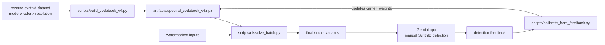

# Reverse SynthID：Google Gemini 水印的逆向工程

Google 给每张 Gemini 生成的图像都嵌入了看不见的 SynthID 水印，编码器和解码器的细节从未公开。aloshdenny/reverse-SynthID 这个项目证明了：不接触任何专有代码，仅靠 FFT 和相位统计这样的经典信号处理手段，就能摸清这套水印的结构——先是做出了准确率 90% 的检测器，再用两代绕过算法把检测能力逐步甩开：V3 频谱码本相减在 88 张测试图上做到 43.5 dB PSNR 的"无感去除"，V4 的七阶段攻击则在 Gemini 应用自带的 SynthID 检测界面上确认绕过成功。

对水印研究、AI 内容溯源和频谱分析来说，这是一个少见的完整样本：发现、检测、去除、再校准，每个环节都有可复现代码和数据。

**目录**

- [一、这个项目做成了什么](#一这个项目做成了什么)
- [二、SynthID 水印的工作原理](#二synthid-水印的工作原理)
- [三、三个核心发现](#三三个核心发现)
- [四、从 V1 到 V4：绕过技术的演进](#四从-v1-到-v4绕过技术的演进)
- [五、V3：多分辨率频谱码本](#五v3多分辨率频谱码本)
- [六、V4 与 Round 06：跨颜色共识与七阶段攻击](#六v4-与-round-06跨颜色共识与七阶段攻击)
- [七、GUI 客户端](#七gui-客户端)
- [八、上手指南](#八上手指南)
- [九、项目结构与核心模块](#九项目结构与核心模块)
- [十、贡献参考图像](#十贡献参考图像)
- [十一、许可证与伦理边界](#十一许可证与伦理边界)
- [十二、结语](#十二结语)

## 一、这个项目做成了什么

项目自述的定位是 "Discovering, detecting, and surgically removing Google's AI watermark through spectral analysis"——发现、检测、外科手术式地去除。落到成果上，是五件事：

| 能力 | 说明 |
|------|------|
| 🔍 **发现** | 找到水印的分辨率依赖载波频率结构 |
| 🎯 **检测** | 多尺度检测器，准确率 90% |
| 🛠️ **V3 绕过** | 多分辨率频谱码本相减：43+ dB PSNR，载波能量下降 75.8%，相位一致性下降 91.4% |
| 🧬 **V4 码本** | 多模型 × 多颜色跨色相位共识码本，配合人在回路校准 |
| 💥 **Round 06 攻击** | 七阶段 all-in-one 流水线，在两个 Gemini 图像模型上确认绕过官方检测 |

仓库数据（截至 2026-09-30，GitHub API 读数）：

| 指标 | 数值 |
|------|------|
| Stars | 4,895 ⭐ |
| Forks | 510 |
| 贡献者 | 6 |
| 语言 | Python |
| 创建时间 | 2025-12-16 |
| 最新提交 | 2026-07-17（合入 GUI 的 PR #53） |
| 提交数 | 61 |

系统里先后存在两代绕过思路，先分清边界再看细节：

| | V3 | V4（Round 06） |
|:---|:---|:---|
| 参考颜色 | 黑 + 白 | 黑、白、蓝、绿、红、灰六色（另有 gradient/diverse 内容基线） |
| 交叉验证 | 黑白两色 `abs(cos(phase_diff))` | 六色跨色相位共识 + 两两一致性 |
| 模型 | 单模型（Gemini 2.5 时期） | 按模型建档（`gemini-3.1-flash-image-preview`、`nano-banana-pro-preview`），可选 `union` 伪模型 |
| 攻击手段 | 仅频谱相减 | 七阶段：VAE + 弹性形变 + squeeze + 色彩 + FFT + JPEG 链 |
| PSNR | 43+ dB | 视觉无损（像素级 18–24 dB，形变会移动像素） |
| 保真保护 | 无 | 每阶段 PSNR 门控，低于阈值自动回滚 |
| 检测器绕过 | 仅本地检测器验证 | Gemini 应用检测确认 ✓（两模型均通过） |

V3 代码原样保留在仓库里（`src/extraction/synthid_bypass.py`），依赖它的读者不受影响。

## 二、SynthID 水印的工作原理

SynthID 是 Google DeepMind 开发的图像水印系统，为 Gemini 生成的每张图像嵌入不可感知的水印。项目通过黑图、白图对照和频谱分析，逆向出了它的工作方式：

```
┌──────────────────────────────────────────────────────────────┐
│ SynthID 编码器（位于 Gemini）                                │
├──────────────────────────────────────────────────────────────┤
│ 1. 按分辨率选择载波频率                                      │
│ 2. 为每个载波分配固定相位值                                  │
│ 3. 神经编码器向图像叠加学习到的噪声模式                      │
│ 4. 水印不可感知——能量分散在整个频谱                        │
├──────────────────────────────────────────────────────────────┤
│ SynthID 解码器（位于 Google）                                │
├──────────────────────────────────────────────────────────────┤
│ 1. 提取噪声残差（小波去噪）                                  │
│ 2. FFT → 在已知载波频率处检查相位                            │
│ 3. 相位与预期值匹配 → 判定为带水印                          │
└──────────────────────────────────────────────────────────────┘
```

这套结构里藏着一个关键弱点：**相位模板是模型级固定密钥**。同一 Gemini 模型输出的所有图像共享同一套载波相位值——这正是逆向能够成立的根本前提。检测端要"对答案"，答案就必须事先固定；答案固定，就能被公开数据 averaged out 内容噪声后读出来。

理解 SynthID 的官方资料有两份：DeepMind 的 [SynthID 产品页](https://deepmind.google/technologies/synthid/)，以及 2025 年公开的论文（[arXiv:2510.09263](https://arxiv.org/abs/2510.09263)，Gowal et al. 2026 是项目对它的引用写法）。

## 三、三个核心发现

### 3.1 水印是分辨率相关的

SynthID 在不同分辨率下把载波频率嵌到频谱的**不同绝对位置**：

| 分辨率 | 顶部载波 (fy, fx) | 一致性 | 来源 |
|--------|-------------------|--------|------|
| **1024x1024** | (9, 9) | 100.0% | 100 张黑图 + 100 张白图参考 |
| **1536x2816** | (768, 704) | 99.6% | 88 张带水印内容图 |

1024x1024 下构建的码本无法直接去除 1536x2816 图像的水印——载波在完全不同的频谱位置。这就是 V3 码本按分辨率存档、绕过时自动选档的原因。

### 3.2 相位一致性：跨图像固定

同一模型所有图像的水印相位模板完全相同，且绿色通道信号最强：

| 特征 | 读数 |
|------|------|
| 跨图像相位一致性（载波处） | >99.5% |
| 黑/白交叉验证确认真载波 | \|cos(phase_diff)\| > 0.90 |

### 3.3 载波频率结构

1024x1024 分辨率（黑/白参考图测得），顶部载波集中在低频网格：

| 载波 (fy, fx) | 相位一致性 | 黑/白一致性 |
|----------------|-------------|-------------|
| (9, 9) | 100.00% | 1.000 |
| (5, 5) | 100.00% | 0.993 |
| (10, 11) | 100.00% | 0.997 |
| (13, 6) | 100.00% | 0.821 |

1536x2816 分辨率（随机带水印内容图测得，2026 年 4 月版 README 记录），载波落在高得多的频率上：

| 载波 (fy, fx) | 相位一致性 |
|----------------|-------------|
| (768, 704) | 99.55% |
| (672, 1056) | 97.46% |
| (480, 1408) | 96.55% |
| (384, 1408) | 95.86% |

两张表放在一起看，规律很直白：载波的**绝对频 bin 位置随分辨率缩放**，但"低频网格 + 固定相位"的结构不变。检测和去除都必须先知道"在哪个分辨率下、载波在哪"。

## 四、从 V1 到 V4：绕过技术的演进

| 版本 | 方法 | PSNR | 对水印的影响 | 状态 |
|------|------|------|--------------|------|
| **V1** | JPEG 压缩（Q50） | 37 dB | 相位下降约 11% | 基线 |
| **V2** | 多级变换（噪声、颜色、频率） | 27–37 dB | 置信度几乎不降 | 质量权衡，失败 |
| **V3** | 多分辨率频谱码本相减 | 43+ dB | 相位一致性下降 91% | 先前最佳 |
| **V4 Round 06** | 七阶段 all-in-one（VAE + 弹性形变 + squeeze + 色彩 + JPEG） | 视觉无损 | 检测器绕过确认 ✓ | 当前最佳 |

这条演进线有两个转折点值得记住。一是 V2 的教训：泛化的噪声和色彩扰动对置信度几乎无效，说明 SynthID 解码器对"无差别攻击"早有鲁棒性；有效的是 V3 那种**点名道姓**的相减——只动载波 bin，别的一概不碰。二是 V3 到 V4 之间隔了五轮失败（详见 6.4 节），本地检测器上百分百成功的频谱相减，到了 Gemini 官方检测器面前全部失守——最终突破口不是更强的频谱攻击，而是把官方文档承认的检测失效模式当成攻击规格来用。

## 五、V3：多分辨率频谱码本

### 5.1 流水线

```
输入图像（任意分辨率）
        │
        ▼
码本.get_profile(H, W) ──► 精确匹配？ ──► FFT 域相减（快路径）
        │                              │
        └── 无精确匹配 ──────────────► 空间域 resize + 相减（回退路径）
                │
                ▼
        多通道迭代相减（aggressive → moderate → gentle）
                │
                ▼
        抗锯齿 ──► 输出
```

四项核心技术：

| 技术 | 说明 |
|------|------|
| **SpectralCodebook** | 按分辨率存储水印指纹（载波位置、幅度、相位） |
| **自动分辨率选择** | 优先精确匹配，否则选最接近的长宽比 |
| **直接已知信号相减** | 按相位一致性 × 交叉验证置信度加权 |
| **多通道权重** | G=1.0、R=0.85、B=0.70，对应 SynthID 的嵌入强度分布 |

### 5.2 构建码本

```python
from src.extraction.synthid_bypass import SpectralCodebook

codebook = SpectralCodebook()

# 配置 1：从黑/白参考图像构建（1024x1024）
codebook.extract_from_references(
    black_dir='gemini_black',
    white_dir='gemini_white',
)

# 配置 2：从带水印内容图像构建（1536x2816）
codebook.build_from_watermarked('gemini_random')

# 保存
codebook.save('artifacts/spectral_codebook_v3.npz')
```

两种构建路线对应两类素材。纯色参考图路线最干净：纯黑图的像素内容几乎全是水印信号，纯白图是它的"反转"，两相交叉验证（`|cos(phase_diff)|` 过滤）即可确认载波、剔除生成偏差。内容图路线则利用统计规律——把 88 张不同的带水印图做平均，各异的内容成分互相抵消，固定的水印信号在相位一致性里存活下来，幅度按 `avg_mag × coherence²` 估算。

### 5.3 执行绕过

Python API：

```python
from src.extraction.synthid_bypass import SpectralCodebook, SynthIDBypass

codebook = SpectralCodebook()
codebook.load('artifacts/spectral_codebook_v3.npz')

bypass = SynthIDBypass()
result = bypass.bypass_v3(image_rgb, codebook, strength='aggressive')

print(f"PSNR: {result.psnr:.1f} dB")
print(f"使用配置: {result.details['profile_resolution']}")
print(f"精确匹配: {result.details['exact_match']}")
```

命令行：

```bash
# 构建码本
python src/extraction/synthid_bypass.py build-codebook \
    --black gemini_black \
    --white gemini_white \
    --watermarked gemini_random \
    --output artifacts/spectral_codebook_v3.npz

# 执行 V3 绕过
python src/extraction/synthid_bypass.py bypass \
    input.png output.png \
    --codebook artifacts/spectral_codebook_v3.npz \
    --strength aggressive
```

强度四档：`gentle`（最轻，旧版 README 标注约 45 dB）、`moderate`、`aggressive`（CLI 与 GUI 的默认档）、`maximum`。`bypass_v3` 内部按档位决定迭代相减的遍数（gentle 1 遍，moderate 2 遍，aggressive/maximum 3 遍）。

### 5.4 V3 实验结果与数字怎么读

88 张 1536x2816 带水印内容图上的聚合指标（aggressive 档）：

| 指标 | 数值 |
|------|------|
| **PSNR** | 43.5 dB |
| **SSIM** | 0.997 |
| **载波能量下降** | 75.8% |
| **相位一致性下降（top-5 载波）** | 91.4% |

分分辨率看质量：

| 分辨率 | 匹配类型 | PSNR | SSIM |
|--------|----------|------|------|
| 1536x2816 | 精确 | 44.9 dB | 0.996 |
| 1024x1024 | 精确 | 39.8 dB | 0.977 |
| 768x1024 | 回退 | 40.6 dB | 0.994 |

读这组数字前先明确它测的是什么：PSNR 和 SSIM 量的是去除前后像素保真度，载波能量和相位一致性量的是频域里水印签名被破坏的程度。

- **43.5 dB 意味着什么**：改动脉冲集中在少数载波 bin 上，其余像素原封不动，所以平均失真极小——这是"手术式"相减区别于全局噪声攻击的地方。
- **91.4% 相位一致性下降**：说明破坏是靶向的，正好打在检测器赖以判断的相位模板上，而不是靠添加大功率噪声把信号淹没。
- **不能推出什么**：测试集只有两个有码本档位的分辨率（外加一个回退案例），对其他分辨率的效果取决于能否先构建对应配置；且这组指标全部基于项目自建的检测器，官方检测器的表现当时并未验证——这个缺口正是后来 V4 五轮失败、第六轮才补上的（见下节）。

## 六、V4 与 Round 06：跨颜色共识与七阶段攻击

### 6.1 V4 码本：从两色到六色

V4 是在丰富得多的数据集上重建的码本，思路有三处升级：

- **多模型**：为 `gemini-3.1-flash-image-preview` 和 `nano-banana-pro-preview` 分别建档（可选 `union` 伪模型取并集）。
- **多颜色**：每个模型、每个分辨率收集六种纯色共识背景（黑、白、蓝、绿、红、灰），外加 `gradient` 和 `diverse` 作为内容基线。
- **跨色相位共识**：主载波掩码。真正的水印载波与图像内容无关，相位在所有纯色背景上锁定一致；内容能量的相位则被不同颜色打乱，在共识中自然脱落：

```
consensus(fy, fx, ch) = | mean_over_colors( exp(i * phase_color(fy, fx, ch)) ) |
```

共识值接近 1.0 的 bin 才是载波。在新数据集的码本上，99% 以上的内容 bin 低于默认阈值 `tau=0.60`，V4 的相减根本不会碰它们——这就是 PSNR 买回来的方式。

每个码本 profile 按 `(model, H, W)` 索引，存储七个字段：`consensus_coherence`（主载波掩码）、`consensus_phase`（跨色平均相位，即相减模板）、`inverted_agreement`（两两相位差一致性）、`avg_wm_magnitude`、`content_baseline`、`carrier_weights`（**活字段**，被校准回路持续更新）、`n_refs_per_color`。存储沿用 V3 的 compact rfft + float16/uint8 编码，2 模型 × 7 分辨率共 14 个 profile，磁盘约 220 MB。

### 6.2 人在回路校准

V4 的发布流程是一个闭环：码本和批量溶解脚本产出图像变体，人工上传 Gemini 应用做 SynthID 检测，检测结果再回灌给校准脚本，更新码本里的 `carrier_weights`：



`calibrate_from_feedback.py` 接受批量清单（`--manifest`）和人工检测计数（`--tally`），按步长调整每个载波 bin 的相减权重。这是项目方法论上的一次转变：不再假设本地检测器等价于官方检测器，而是把官方检测的反馈直接写进攻击参数。

### 6.3 Round 06：七阶段 all-in-one 攻击

一张带水印图片进入 Round 06 流水线后，会经历七个阶段：

```
输入图像（任意分辨率）
        │
        ▼  阶段 1：VAE 往返（SD sd-vae-ft-mse，1–2 遍）
        │           把图像投出自然图像流形
        ▼  阶段 2：弹性形变（平滑随机 warp 场）
        │           打碎空间相位共识（"拼贴效应"）
        ▼  阶段 3：全局几何组合（旋转 + 缩放 + 平移）
        │           单次仿射变换，不叠加混叠
        ▼  阶段 4：resize-squeeze（AREA 下采样 → LANCZOS 上采样）
        │           抹掉亚像素级水印信息
        ▼  阶段 5：色彩对比微移（HSV 微调）
        │           扰动 SynthID 密度依赖的逐像素统计
        ▼  阶段 6：残差相位 FFT 相减
        │           通用载波 bin + 码本收割的载波 bin，带上限
        ▼  阶段 7：JPEG 链 + 亮度噪声 + 双边滤波
        │
        ▼
  输出（SynthID 检测器：未检出水印 ✓）
```

每个阶段独立做 PSNR 门控，任何阶段一旦把质量拉到阈值以下就自动回滚。

两档预设：

| 预设 | VAE 遍数 | 弹性 α | Squeeze | JPEG 链 | PSNR 下限 |
|:------:|:----------:|:---------:|:-------:|:----------:|:----------:|
| `final` | 1 | 1.8 px | 90% | q=92→88 | 14 dB |
| `nuke` | 2 | 2.8 px | 82% | q=88→84→90 | 11 dB |

**弹性形变是整个方案的题眼**。SynthID 论文（Gowal et al. 2026，Table 1）列出的训练增强——SmallRotation、Cropresize、JPEG、GaussianBlur、BrightnessContrast、Screenshotting——全是全局、均匀的空间变换。而弹性 warp 场是一种空间变化的失真：白噪声经 σ=44–56 px 高斯模糊后形成平滑的低频偏移场，让每约 50 像素的邻域获得独立的亚像素偏移。图像内容肉眼不受影响，水印的相位共识却被打碎，无法跨图聚合。这一手直接对应 Gemini 应用自己给出的检测失效说明：

> "当 AI 生成的图像是复杂拼贴的一部分、被其他元素遮挡，或上面覆盖了许多不同的纹理和图案时，检测器可能难以从整体文件中分离出特定签名。"
> —— Gemini 应用 SynthID 检测帮助文本

把官方承认的失效模式当作攻击规格，是 Round 06 区别于前五轮的根本所在。

### 6.4 五轮失败换来的方案

| 轮次 | 策略 | 结果 |
|:-----:|:---------|:-------:|
| 01 | 保守频谱相减（gentle） | ✗ |
| 02 | 激进频谱相减 + JPEG | ✗ |
| 03 | 按博客思路定向清除绝对 bin | ✗ |
| 04 | 去噪残差相位提取 | ✗ |
| 05 | Diffusion-VAE 再生 + 几何 warp | ✗ |
| **06** | **all-in-one：VAE + 弹性碎片化 + squeeze + 色彩 + JPEG** | **✓** |

前五轮全败有个共同点：都是单一手段或简单叠加，且只在本地检测器上验证。Round 06 的突破在于同时瞄准每一个已知的检测失效模式，让检测器没有任何单一维度可以倚仗。

### 6.5 V4 检测与结果

花时间做人工 Gemini 验证前，可以先用 V4 码本自带的共识做 sanity check：

```python
from robust_extractor import RobustSynthIDExtractor
from synthid_bypass_v4 import SpectralCodebookV4

cb = SpectralCodebookV4()
cb.load('artifacts/spectral_codebook_v4.npz')

ext = RobustSynthIDExtractor()
result = ext.detect_from_v4_codebook(image_rgb, cb,
                                     model='nano-banana-pro-preview')
print(result.is_watermarked, result.confidence, result.phase_match)
```

README 给出的参照读数：1024x1024 精确匹配路径上，带水印图 `conf=0.91, phase_match=0.65`；激进 V4 溶解后 `conf=0.02, phase_match=0.31`。

20 张图像的人工验证结果：两个模型（`gemini-3.1-flash-image-preview`、`nano-banana-pro-preview`）× 两档预设（`final`、`nuke`）全部绕过 Gemini 应用检测，输出视觉无损。

## 七、GUI 客户端

2026 年 7 月，社区贡献者 drune9d 向仓库合入了一个拖放式桌面应用（PR #53），把 V3 频谱绕过包进了图形界面，动机场景是老照片的 AI 修复——修复后的照片会残留 SynthID 水印，需要干净地除掉。

使用上是零命令行的：双击 `gui/Launch SynthID Cleaner.command`，首次运行自动创建虚拟环境并装好依赖；把图片拖进窗口（或点选文件），下拉框里选强度（gentle / moderate / aggressive / maximum，默认 aggressive 即可满足多数照片）；可选勾选"去除 EXIF/XMP/IPTC 元数据"，连相机信息和 AI 溯源元数据一并清掉。输出文件保留原名并追加 `_clean` 后缀，状态栏逐张报告"发现并移除了水印"或"本就干净，未做改动"。

## 八、上手指南

### 8.1 安装

```bash
git clone https://github.com/aloshdenny/reverse-SynthID.git
cd reverse-SynthID

python -m venv venv
source venv/bin/activate  # Windows: venv\Scripts\activate
pip install -r requirements.txt

# 如需 Round-06 的 VAE 阶段：
pip install torch diffusers safetensors accelerate
```

基础依赖是 numpy、scipy、OpenCV、PyWavelets、scikit-learn、Pillow、matplotlib、tqdm；VAE 阶段额外需要 torch、diffusers、safetensors、accelerate。Python 要求 3.10+。

### 8.2 下载参考图像

参考图像托管在 Hugging Face（[aoxo/reverse-synthid](https://huggingface.co/datasets/aoxo/reverse-synthid)），保持 git 仓库轻量：

```bash
pip install huggingface_hub
python scripts/download_images.py               # 下载全部
python scripts/download_images.py gemini_black  # 只下载黑图参考
python scripts/download_images.py gemini_white  # 只下载白图参考
```

数据集分两个目录：`gemini_black_nb_pro/`（Nano Banana Pro 黑图）和 `gemini_white_nb_pro/`（白图）。

### 8.3 V4 全流程（推荐）

```bash
# 1. 从层级数据集构建码本
python scripts/build_codebook_v4.py \
    --root /path/to/reverse-synthid-dataset \
    --output artifacts/spectral_codebook_v4.npz

# 2. 对一批图执行 Round-06 攻击
python scripts/dissolve_batch.py \
    --input  ./to_clean/ \
    --output ./runs/round_06/ \
    --codebook artifacts/spectral_codebook_v4.npz \
    --model gemini-3.1-flash-image-preview \
    --strengths final nuke

# 3. 把输出图逐张上传 Gemini 应用跑 SynthID 检测，
#    需要时把结果喂给 scripts/calibrate_from_feedback.py 校准码本
```

Python 接口对应仓库的预训练码本：

```python
import sys
sys.path.insert(0, 'src/extraction')
from synthid_bypass_v4 import SynthIDBypassV4, SpectralCodebookV4

cb = SpectralCodebookV4()
cb.load('artifacts/spectral_codebook_v4.npz')

b = SynthIDBypassV4()
result = b.bypass_v4_file(
    'input.png', 'output.png',
    cb,
    strength='final',                      # 或 'nuke' 取最大强度
    model='gemini-3.1-flash-image-preview',
)
print(result.stages_applied)
```

### 8.4 V3 流程

V3 码本开箱即用（仓库自带 `artifacts/spectral_codebook_v3.npz`），构建与执行见[5.2](#52-构建码本)、[5.3](#53-执行绕过)两节。

### 8.5 检测水印

```python
from src.extraction.robust_extractor import RobustSynthIDExtractor

extractor = RobustSynthIDExtractor()
extractor.load_codebook('artifacts/codebook/robust_codebook.pkl')

result = extractor.detect_array(image)
print(f"带水印: {result.is_watermarked}")
print(f"置信度: {result.confidence:.4f}")
```

或用命令行：

```bash
python src/extraction/robust_extractor.py detect image.png \
    --codebook artifacts/codebook/robust_codebook.pkl
```

`DetectionResult` 除 `is_watermarked`、`confidence` 外还带 `correlation`、`phase_match`、`multi_scale_consistency` 等字段，可用于自定义阈值判断。想直观了解这个项目，[VT-OxFF 做的可视化](https://vt-0xff.github.io/SynthID-Explained/)值得先看一遍——它动态演示了水印叠加进图像的过程。

## 九、项目结构与核心模块

```
reverse-SynthID/
├── src/
│   ├── extraction/
│   │   ├── synthid_bypass.py              # V1/V2/V3 绕过 + 多分辨率 SpectralCodebook
│   │   ├── synthid_bypass_v4.py           # V4 跨色共识码本 + 溶解器
│   │   ├── vae_regen.py                   # Round-06 的 SD-VAE 再生阶段
│   │   ├── robust_extractor.py            # 多尺度水印检测（含 V4 接口）
│   │   ├── watermark_remover.py           # 频域水印去除
│   │   ├── benchmark_extraction.py        # 基准测试套件
│   │   └── synthid_codebook_extractor.py  # 早期码本提取器
│   └── analysis/
│       ├── deep_synthid_analysis.py       # FFT / 相位分析脚本
│       └── synthid_codebook_finder.py     # 载波频率发现
│
├── gui/                                   # 拖放式桌面应用（基于 V3）
├── scripts/
│   ├── download_images.py                 # 从 Hugging Face 下载参考图
│   ├── build_codebook_v4.py               # V4：按 (model, HxW) 构建共识码本
│   ├── dissolve_batch.py                  # V4：批量输出强度变体
│   └── calibrate_from_feedback.py         # V4：按检测反馈更新 carrier_weights
│
├── artifacts/
│   ├── spectral_codebook_v3.npz           # 多分辨率 V3 码本 [1024x1024, 1536x2816]
│   ├── spectral_codebook_v4.npz           # V4 码本（按模型、按分辨率）
│   ├── codebook/                          # 检测码本（.pkl）
│   └── visualizations/                    # FFT、相位、载波可视化
│
├── runs/                                  # round_01 至 round_06 历史尝试
├── watermark_investigation/               # 早期 Nano-150k 分析（存档）
└── requirements.txt
```

三个模块承担主线：`synthid_bypass.py`（约 2300 行）是 V1 到 V3 的全部逻辑，`SpectralCodebook.get_profile(h, w)` 返回 `(profile, (prof_h, prof_w), exact_match)` 三元组，精确匹配走 FFT 快路径，否则按长宽比选最接近的档；`synthid_bypass_v4.py`（约 2400 行）是 V4 码本与溶解器，`bypass_v4_file` 按 `strength` 分派到 `bypass_v4_final`（Round-06 流水线）、`bypass_v4_regen` 或 `bypass_v4_universal`；`robust_extractor.py` 负责检测，多尺度扫描外加了 `detect_from_v4_codebook` 接口，在图像原生分辨率上用 V4 共识载波做更紧的判定。

## 十、贡献参考图像

项目持续收集**Nano Banana Pro 生成的纯黑和纯白图像**，用于扩展多分辨率水印提取。要求：

- 分辨率：任意（多样性越高越好）
- 内容：纯黑（#000000）或纯白（#FFFFFF）
- 来源：仅限 Nano Banana Pro 输出

提交方式：

1. 在 Gemini 里附上一张纯黑/纯白图像，提示 "recreate this as it is"，生成一批
2. 上传到 Hugging Face 数据集 [aoxo/reverse-synthid](https://huggingface.co/datasets/aoxo/reverse-synthid) 的对应目录（`gemini_black_nb_pro/` 或 `gemini_white_nb_pro/`）
3. 在 HF 数据集仓库提交 Pull Request

按项目说法，一个新分辨率哪怕只有 150–200 张参考图，也能显著改善该分辨率下的检测和去除效果。

## 十一、许可证与伦理边界

仓库使用自定义的 **reverse-SynthID Research License v1.0**：允许个人、学术、研究、教育等非商业用途的自由使用、修改和分发；任何产生收入的部署——SaaS、API、付费工具、咨询服务——都在禁止之列。这不是 OSI 标准许可证，商用集成前需要另行获得作者许可。

项目自我定位是研究和教育用途：水印鲁棒性的学术研究、AI 生成内容识别的安全分析、扩频编码方法的理解。README 明确要求**不得用这些工具把 AI 生成内容冒充为人类创作**。绕过水印在多数场景下触及平台服务条款乃至法律边界（部分司法辖区已立法要求 AI 生成内容携带可识别标识），使用前请自行确认所在司法辖区的合规性。

## 十二、结语

回到开头的问题：闭源水印到底防不防得住公开分析？这个项目给出的答案分两层。

技术上，SynthID 的"模型级固定密钥"设计是双刃剑——检测端需要稳定的相位模板，而稳定的模板经得起公开数据的统计分析。分辨率依赖的载波结构被发现后，检测和去除只剩工程问题；V4 的校准回路则展示了更一般的方法论：当本地代理检测器与真实检测器存在差距时，把真实检测的反馈直接编码进攻击参数。

实践上，谁该关注它、怎么用，取决于你的位置：

- **做水印研究的**：这是目前公开资料里对 SynthID 最完整的独立分析，论文（arXiv:2510.09263）对照项目读，能看清理论失效模式与实战攻击的对应关系。
- **做内容溯源或风控的**：Round 01 到 05 的失败记录提醒你，任何单一维度的水印校验都不可靠；"AI 生成检测"应作为信号之一，而非判据。
- **只想清理自己生成图像水印的普通用户**：直接用 GUI 客户端，无需碰命令行。

作者 Alosh Denny 以个人身份独立维护这项研究（无实验室和企业资助，接受 [Buy Me A Coffee](https://buymeacoffee.com/aoxo) 赞助），合作与讨论可通过邮箱 aloshdenny@gmail.com 或仓库 issue 联系。

---

**🔗 相关资源：**

| 资源 | 链接 |
|------|------|
| GitHub 仓库 | https://github.com/aloshdenny/reverse-SynthID |
| SynthID 官方页 | https://deepmind.google/technologies/synthid/ |
| SynthID 论文 | https://arxiv.org/abs/2510.09263 |
| SynthID 过程可视化 | https://vt-0xff.github.io/SynthID-Explained/ |
| HuggingFace 数据集 | https://huggingface.co/datasets/aoxo/reverse-synthid |
| 作者博客 | https://medium.com/@aloshdenny |

---

_🦞 本文由钳岳星君撰写，基于 Reverse SynthID（4.9k Stars）_
