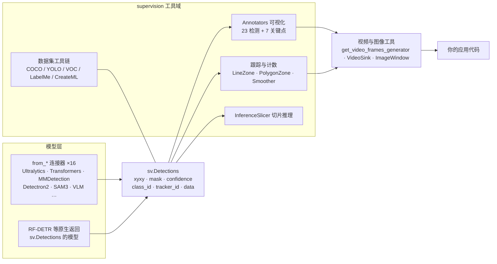

supervision 解决的不是"模型不准"或"推理不快"，而是模型出结果之后的全部杂活：格式转换、画框画掩膜、跨帧跟踪、越线计数、视频读写、数据集格式互转。这些活每换一个模型框架就要重写一遍，supervision 的答案是把它们全部挂在一个统一的数据结构 `sv.Detections` 上。5.1 万 stars 的需求基础就在这里。

版本基线先说清楚：本文以 0.30.5（2026-09-22 发布）为基线，源码引用与 API 签名核对到该版本，stars、下载量等读数截至 2026-09-29。0.30.0（2026-08-04 发布）是一次大版本转折——OpenCV 从必装依赖降级为可选后端——所以涉及安装与依赖的内容一律以 0.30.x 口径为准，与 0.29.x 的差异单独标出。

## 项目速览

- **仓库**：[roboflow/supervision](https://github.com/roboflow/supervision)
- **Stars / Forks**：51,071 / 4,865（2026-09-29，GitHub API）
- **最新版**：0.30.5（2026-09-22）
- **License**：MIT
- **Python**：>= 3.10（0.30.0 起；0.29.x 时代为 >= 3.9）
- **文档**：[supervision.roboflow.com](https://supervision.roboflow.com)
- **下载量**：PyPI 月下载约 82 万次（pypistats.org，2026-09-29，不含国内镜像）

README 的自我定位只有一句：「We are your essential toolkit for computer vision. From data loading to real-time zone counting, we provide the building blocks so you can focus on building applications around your models.」

## 系统总览

supervision 自己不训练模型。它站在模型下游，左手把 16 种框架的输出收进 `sv.Detections`，右手提供四类工具消化这个结构：



四类工具的分工：Annotators 管"画出来"，跟踪与计数管"算出来"，视频工具管"读进来、写出去"，数据集工具链管"存起来、转格式"。InferenceSlicer 是独立的推理辅助，处理大图上的小目标。

## sv.Detections：一个数据结构撑起全部工具

`sv.Detections` 是整个工具箱的基石，字段不多：

| 字段 | 类型 | 说明 |
|------|------|------|
| `xyxy` | ndarray，形状 (N, 4) | 边界框坐标 |
| `mask` | ndarray 或 CompactMask | 实例分割掩膜，可选；0.30.0 起支持压缩表示 |
| `confidence` | ndarray | 置信度，可选 |
| `class_id` | ndarray | 类别索引，可选 |
| `tracker_id` | ndarray | 跟踪 ID，由跟踪器填入，可选 |
| `data` | dict | 自定义附加数据，各连接器把模型原始输出塞在这里 |

把各家模型的输出收进来靠的是 `Detections` 上的 `from_*` 类方法，目前有 16 个：`from_yolov5`、`from_ultralytics`、`from_yolo_nas`、`from_tensorflow`、`from_deepsparse`、`from_mmdetection`、`from_transformers`、`from_detectron2`、`from_inference`、`from_sam`、`from_sam3`、`from_azure_analyze_image`、`from_paddledet`、`from_vlm`、`from_easyocr`、`from_ncnn`。README 对连接器设计的原话：「Supervision was designed to be model agnostic.」——下游代码只认 `sv.Detections`，换模型不动下游。

两个方向值得单独说：

**RF-DETR 不走连接器**。它是 Roboflow 自家的检测模型（[roboflow/rf-detr](https://github.com/roboflow/rf-detr)，Apache-2.0，ICLR 2026 论文），`model.predict()` 直接返回 `sv.Detections`，无需适配层。这是上下游同家的闭环设计：

```python
import supervision as sv
from PIL import Image
from rfdetr import RFDETRSmall

image = Image.open("path/to/image.jpg")
model = RFDETRSmall()
detections = model.predict(image, threshold=0.5)

len(detections)
# 5
```

**VLM 输出也能收**。`sv.Detections.from_vlm(...)` 把视觉语言模型的 grounding 输出解析成检测框——12 个模型开箱即用：PaliGemma（含 PaliGemma 2）、Florence-2、Qwen2.5-VL、Qwen3-VL、DeepSeek-VL2、Gemini 2.0 / 2.5 / 3.5 / 3.6 / 3.7、Moondream、Kosmos-2，其中 Gemini 2.5 及以上还解析分割掩膜。对靠文本提示做开放词汇检测的场景，这是把 VLM 拉进统一下游的入口。

## Annotators：可组合，但会原地作画

标注器分两组：23 个检测类（`BoxAnnotator`、`MaskAnnotator`、`LabelAnnotator`、`TraceAnnotator`、`HeatMapAnnotator`、`PolygonAnnotator`、`HaloAnnotator`、`PixelateAnnotator` 等）和 7 个关键点类（`EdgeAnnotator`、`VertexAnnotator`、`VertexLabelAnnotator`，以及 `VertexEllipse`、`VertexEllipseArea`、`VertexEllipseHalo`、`VertexEllipseOutline` 四个椭圆标注器，用于把关键点的不确定度画成协方差椭圆）。检测类共享同一个签名：

```python
annotated = annotator.annotate(scene=image, detections=detections)
```

一个容易踩的细节：**标注器把图形直接画进传入的 `scene` 数组，然后把它原样返回**。看 `BoxAnnotator.annotate` 的源码就明白——循环里调用 `cv2.rectangle(img=scene, ...)`，没有任何拷贝。官方示例一律写作 `annotate(scene=image.copy(), ...)`，那个 `.copy()` 是调用者的责任，为的是保住原图。链式叠加时只需要在第一层拷贝，后续直接传上一步的返回值：

```python
frame = image.copy()
frame = sv.BoxAnnotator().annotate(scene=frame, detections=detections)
frame = sv.LabelAnnotator().annotate(scene=frame, detections=detections, labels=labels)
frame = sv.TraceAnnotator().annotate(scene=frame, detections=detections)
```

每一步都在同一个数组上叠加，返回值让你能把链条写成赋值。标注器同时接受 `numpy.ndarray` 和 `PIL.Image.Image`，内部自动转换。

## 跟踪、计数与平滑

**ByteTrack 正在退场**。它是 supervision 长期内置的多目标跟踪器，但 0.30.0 的发布说明写得明白：ByteTrack 等弃用接口原定 0.30.0 移除，推迟到 0.31.0。现状是——0.30.5 里 `sv.ByteTrack` 仍可导入（通过弃用兼容层，不在 `__all__` 里），0.31.0 开发分支已删掉整个 `tracker/` 目录，官方尚未指名替代实现。新项目要谨慎依赖它；存量项目升级 0.31 前需要锁定版本或另选跟踪方案。

计数有两个正交的场景。`LineZone` 数"越线"：在画面上定义一条线，`trigger(detections)` 用检测框的角点锚位判断哪些目标从哪侧穿过，返回本帧两个方向的越线数组，累计值在 `in_count` / `out_count` 属性上；典型用例是门口客流、单行道车流。`PolygonZone` 数"在区域内"：画一个多边形，查询哪些检测落在里面，典型用例是停车场占用、危险区域闯入。两者都配了对应的标注器。

此外还有几件跨帧工具：`DetectionsSmoother` 平滑相邻帧的检测抖动；Soft-NMS（0.30.0 新增，`detections.with_soft_nms(sigma=0.5)`）在拥挤场景用降置信度代替硬删除；`HeatMapAnnotator`、`TraceAnnotator`、`DetectionsSmoother` 在 0.30.0 补了 `reset()`，同一个实例可以跨视频流复用。

## 视频与图像工具

这层在不少"画框库"对比里被忽略，却是 supervision 粘性的重要来源：

- `sv.get_video_frames_generator(source_path=...)`：逐帧迭代视频，0.30.0 起 支持 `prefetch=...` 后台线程解码；
- `sv.VideoInfo.from_video_path(...)`：读取分辨率、帧率、总帧数；
- `sv.VideoSink(target_path=..., video_info=...)`：上下文管理器式的写出，配 `write_frame()`；
- `sv.process_video(...)`：对整段视频跑一个回调，0.29.0 起支持 `preserve_audio` 把音轨混回输出；
- `sv.FPSMonitor`：实测推理管线吞吐；
- `sv.ImageWindow`（0.30.0 新增）：tkinter + Pillow 的桌面预览窗，替代 `cv2.imshow`——这是 OpenCV 可选化后"没有 cv2 怎么预览"的配套答案；
- `sv.load_image_from_url(...)`（0.30.0 新增）：直接从 HTTP(S) 地址加载图片，可选本地缓存。

## InferenceSlicer：大图小目标的切片推理

检测小目标的经典难题：整图缩到模型输入尺寸，目标只剩几个像素。`InferenceSlicer` 的做法是把大图切成带重叠的小块，逐块跑你给的回调，再把结果合并、对重叠区的重复检测做融合。多线程并行切片，0.30.0 起支持 `batch_size` 批量回调。

0.30.0 还给遥感场景开了条路：配合 `WindowedRasterDataset`，InferenceSlicer 可以按窗口流式读取 rasterio 打开的 GeoTIFF，多 GB 的航拍图不必整图进内存。这需要额外装一个 extra：`pip install "supervision[geotiff]"`。

## 数据集工具链

类名先纠正一个常见误写：**没有 `sv.Dataset`，正确名字是 `sv.DetectionDataset`**（分类任务另有 `sv.ClassificationDataset`）。加载用 `from_*`，导出用 `as_*`：

```python
import supervision as sv

dataset = sv.DetectionDataset.from_yolo(
    images_directory_path="...",
    annotations_directory_path="...",
    data_yaml_path="...",
)

train, test = dataset.split(split_ratio=0.7)
```

支持五种格式来回转：COCO、YOLO、Pascal VOC，加上 0.30.0 新增的 LabelMe 和 CreateML。`split` 按比例切分，`merge` 合并多个数据集并自动并类别表。"YOLO 训的模型要用 COCO 格式评估"这类杂活，三条 `as_*` 语句的事。

## 一段视频的完整流转：门口越线计数

把上面的机制串起来。任务：读一段门口监控，检测行人，跟踪，统计进出人数，画框画轨迹画计数线，写出新视频：

```python
import supervision as sv
from ultralytics import YOLO

model = YOLO("yolov8n.pt")

video_info = sv.VideoInfo.from_video_path(video_path="gate.mp4")
frames = sv.get_video_frames_generator(source_path="gate.mp4")

byte_track = sv.ByteTrack()  # 0.30.x 仍可用；0.31.0 起移除，升级前需另选跟踪方案
line_zone = sv.LineZone(
    start=sv.Point(x=0, y=video_info.height // 2),
    end=sv.Point(x=video_info.width, y=video_info.height // 2),
)
box_annotator = sv.BoxAnnotator()
label_annotator = sv.LabelAnnotator()
trace_annotator = sv.TraceAnnotator()
line_annotator = sv.LineZoneAnnotator()

with sv.VideoSink(target_path="gate_annotated.mp4", video_info=video_info) as sink:
    for frame in frames:
        result = model(frame)[0]
        detections = sv.Detections.from_ultralytics(result)
        detections = byte_track.update_with_detections(detections)
        crossed_in, crossed_out = line_zone.trigger(detections)

        labels = [f"#{track_id}" for track_id in detections.tracker_id]

        annotated = box_annotator.annotate(scene=frame.copy(), detections=detections)
        annotated = label_annotator.annotate(
            scene=annotated, detections=detections, labels=labels
        )
        annotated = trace_annotator.annotate(scene=annotated, detections=detections)
        annotated = line_annotator.annotate(frame=annotated, line_counter=line_zone)
        sink.write_frame(annotated)

print(f"in: {line_zone.in_count}, out: {line_zone.out_count}")
```

每一帧的流转：视频工具从文件解码出一帧 → YOLO 推理，`from_ultralytics` 把结果收进 `sv.Detections` → ByteTrack 关联前后帧，填上 `tracker_id` → `LineZone.trigger` 用检测框角点判断是否越线，更新累计计数 → 三个标注器依次叠加（先拷贝保住原始帧）→ `VideoSink` 按 `video_info` 的帧率写回文件。仓库 `examples/` 目录下有 `count_people_in_zone`、`speed_estimation`、`time_in_zone`、`heatmap_and_track` 等完整可跑的版本。

换模型只动一处：把 `from_ultralytics` 换成 `from_transformers` 或换成 RF-DETR 的直接返回，后面所有代码原样不动。这就是"统一数据结构"的回报。

## 0.30.0：OpenCV 从必装依赖变成可选后端

这个大版本的标题就是「Run supervision without OpenCV」。0.29.x 时代，`opencv-python` 是硬依赖；从 0.30.0 起，supervision 用一套私有的 `_cv2` 后端（基于 NumPy 和 Pillow，视频路径走 PyAV）重写了库内需要的全部 OpenCV 调用。行为是：环境里已有兼容的 `cv2` 就自动优先用；没有也能跑，`opencv-python-headless` 也可以。

对部署的实际意义：serverless 函数、容器镜像、边缘设备——这些场景里 OpenCV 要么拖体积、要么装不上 GUI 依赖。`av>=14.2`（PyAV）顶替它成为必装依赖，此外核心依赖还有 numpy、pillow、matplotlib、scipy、defusedxml、pyyaml、requests、tqdm。

同一版本的其他破坏性变更，升级 0.29.x 时需要过一遍：

- **Python 最低 3.10**（3.9 已于 2025 年 10 月停止维护）；
- `JSONSink` 输出原生 JSON 类型（数字就是数字，不再是字符串）；
- `mask_non_max_merge` 改为精确掩膜重叠计算，重叠阈值需要重新调；
- `Detections.merge()` 混合稠密掩膜与 `CompactMask` 时返回 `CompactMask`——官方给的收益数字是 1080p 下 40 个检测时峰值内存约省 2500 倍、速度约 13 倍（项目方自测口径，未复测）。

## 适用边界与采用顺序

**适合**：多模型下游的统一胶水层（可视化、跟踪、计数）；视频结构化管线；数据集格式互转；大图小目标与遥感切片推理。

**不适合**：模型训练——supervision 完全不碰，训练仍在 Ultralytics、MMDetection 这些框架里；整条管线只有一个模型、只需要画一个框的场景——`cv2.rectangle` 两行代码的事，引入 supervision 的依赖树不划算；非 Python 栈——这是纯 Python 库。

**建议的采用顺序**：

1. 先当"下游统一层"用：已有模型跑通推理，`pip install supervision`，用它替换画框、跟踪、计数的自写胶水；
2. 数据杂活交给 `DetectionDataset`，格式互转和切分合并顺手解决；
3. 有小目标或遥感需求再上 `InferenceSlicer`（GeoTIFF 记得装 extra）；
4. 从 0.29.x 升级前，过一遍 0.30.0 的破坏性变更清单，并确认自己是否依赖 ByteTrack——它在 0.31.0 就要移除。

两件 supervision 没替你做的事：一是性能背书，实时视频流的吞吐取决于你的模型和硬件，官方不承诺数字，`FPSMonitor` 给你量测的工具；二是训练闭环，它的边界始终画在推理结果之后。

回头看，supervision 的价值不在任何单个功能——画框有 cv2，跟踪有开源实现，计数逻辑自己写也不难。价值在接口统一带来的可替换性：模型层从 YOLO 换到 RF-DETR 再换到 VLM 开放词汇检测，下游几十行代码一行不改。而 0.30.0 把 OpenCV 降为可选，说明这个"下游工具箱"开始把部署环境也当作要照看的对象——对一个定位为"标准件"的库来说，这是正确的进化方向。
