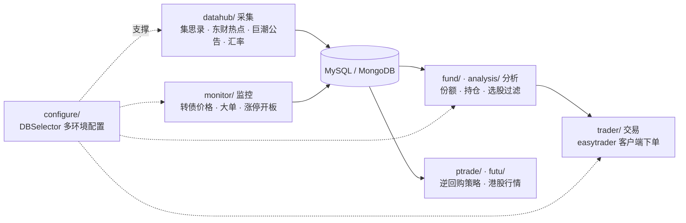

# Rockyzsu/stock：10 年实盘攒出的 Python 量化交易工作台

先给判断：这不是一个拿来就能用的策略库，而是一个人把炒股全流程代码化的活标本。数据怎么采、登录态怎么维持、行情怎么监控、单子怎么下、持仓怎么入库——工程侧的每一环都有能跑的实盘代码；至于策略本身，仓库里没有圣杯，作者自己的 README 开头就把姿态摆正了：**"更好的帮助自己炒股(亏钱-。-)"**。

作者 Rocky Chen 从 2016 年 4 月开始维护这个仓库，写代码的同时经营博客 [30daydo.com](http://30daydo.com) 和公众号"可转债量化分析"，仓库描述是"30天掌握量化交易 (持续更新)"。截至 2026-09-30，它有 8614 stars、1654 forks、747 次提交，BSD-3-Clause 许可，纯 Python。

## 先知道一件事：README 已经落后于代码

读这个仓库前有一个必要前提。README 顶部留着一行 2022 年 12 月的声明：

> 目前正在重构项目代码，目录结构可能与下面描述有些出入，后期会慢慢更新修改，感谢大家的关注与支持。

这不是客套话。README 后半部分列的根目录脚本，一半以上已经搬进子目录或改名，对照 2026-09-30 的 master 分支实际目录：

| README 说的 | 实际情况 |
|------|------|
| 根目录 `filter_stock.py` | 已迁到 `analysis/filterstock.py`（`FilterStock` 类） |
| 根目录 `jisilu.py` | 已迁到 `datahub/jisilu.py`（15KB 的 `Jisilu` 类） |
| 根目录 `push_msn.py` | 已迁到 `utils/push_msn.py` |
| 根目录 `big_deal.py` | 已迁到 `monitor/big_deal.py`，根目录另有 `real_time_big_deal.py` |
| 根目录 `get_break_high.py` | 已迁到 `analysis/get_break_high_low.py` |
| `fund/LOFShareDection.py` | 实际文件名是 `LOFShareDetection.py`（README 少了个 t） |
| `analysis/get_zt_info` | 当前分支已找不到此文件 |
| `bond_monitor/` | 当前分支已找不到此目录 |

`fetch_each_day.py`、`simulation.py`、`win_or_lost_each_day.py`、`foreign_exchange.py`、`ipo_stock.py` 这些 README 点过名的脚本也都不在了。所以本文全部按实际目录讲，不按 README 讲。

## 系统地图：一条流水线，五个环节

抛开目录名，这个仓库真正的东西是一条个人量化流水线：



各环节的体量（文件数按 2026-09-30 的 git tree 统计）：

| 环节 | 目录 | 体量 | 干什么 |
|------|------|------|------|
| 采集 | `datahub/` | 33 个文件 | 集思录、东财热点板块、同花顺行业、巨潮公告、汇率、黑名单 |
| 分析 | `fund/` + `analysis/` | 54 + 50 | LOF/ETF 份额、ARK 持仓、封基轮动、选股过滤、龙虎榜 |
| 监控 | `monitor/` | 10 个文件 | 转债实时价格、大单、涨停开板、预警推送 |
| 交易 | `trader/` `ptrade/` `futu/` | 3 + 3 + 6 | easytrader 客户端下单、PTrade 逆回购、富途行情 |
| 底座 | `configure/` `common/` `utils/` | 4 + 8 + 4 | 数据库多环境切换、日志基类、推送、交割单 |

## 底座：DBSelector 和一份诚实的 config.json

几乎所有脚本的数据存取都走 `configure/settings.py` 里的 `DBSelector`。它的思路简单直接：一份 `config.json`，按"数据库类型 + 环境名"两维取连接参数，同一套代码在本地和服务器之间切换时只改一个参数：

```python
class DBSelector(object):
    def config(self, db_type='mysql', local='qq'):
        db_dict = self.json_data[db_type][local]
        user = db_dict['user']
        password = db_dict['password']
        host = db_dict['host']
        port = db_dict['port']
        return (user, password, host, port)
```

`configure/sample_config.json` 给出了全貌：MySQL 预留了 `local`/`qq`/`ubuntu`/`ptrade`/`tencent-1c` 五个环境，MongoDB、Redis、邮件各一节，剩下的配置键暴露了这个系统真实的依赖面——`jsl_cookies`（集思录登录态）、`jsl_monitor`（监控参数）、`ts_token`（tushare）、`xc_token_pro`（湘财证券版 tushare）、`enterprise_wechat`（企业微信推送）、`twilio`。

对这套设计的取舍，作者在 README 里写得坦白：这是"为了同一套代码便于切换线上和本地的数据库，并没有采用环境变量的方式存储用户密码"，需要的人可以自己改。注意文件名是 `settings.py`，README 里写的 `setting.py` 是旧写法。

一个要提醒的坑：`sample_config.json` 也滞后于代码。`monitor/jsl_monitor.py` 读的是 `ZZ_PERCENT`、`ZG_PERCENT`、`REMAIN_SIZE`、`ACCESS_INTERVAL_REALTIME` 这些键，sample 里根本没有，sample 给的是另一个名字 `MONITOR_PERCENT`。照着 sample 配置，监控模块跑不起来——配的时候以代码里实际读取的键为准。

## 采集：集思录是整个仓库的中轴

`datahub/jisilu.py` 是这个仓库最有含金量的单文件。它解决的问题是：集思录的可转债数据要登录才能拿全，而登录有前端加密。作者的解法是 `jsl_login.py` 配一个 126KB 的 `js_file/encode_jsl.js`，把加密参数的计算交给 JS 引擎执行，拿到登录态后抓全市场转债行情，写入 MySQL。

同样思路贯穿其他采集脚本：`ark_funds.py` 抓 ARK 官网的持仓 PDF 并解析，写进 MongoDB 并建了唯一索引防重：

```python
class ARKFundSpider(BaseService):
    def __init__(self):
        super(ARKFundSpider, self).__init__('../log/ark.log')
        self.url = 'https://ark-funds.com/auto/gettopten.php'
        self.data = {'ticker': None}
        self.doc = self.mongodb()
```

其余采集脚本各有分工：`zdt.py` 抓涨停热度、`SPSIOP_PRICE.py` 爬华宝油气估值来算折价、`jucao_announcement.py` 批量下载巨潮公告 PDF、`black_list_sql.py` 维护有黑历史的股票名单。`foreignexchange.py` 盯美元兑人民币汇率。宁稳网的可转债数据在 `ninwen.py`（README 写作 `niwen.py`，又是旧拼写）。

## 分析：基金侧最厚，选股有两条线

`fund/` 是全仓库最大的目录。除了采集脚本，核心是三类：

**份额监控**。`LOFShareDetection.py`、`ETFShareDetection.py` 和共用的 `ShareDetection.py` 跟踪场内基金份额变动——LOF/ETF 份额申赎是这类折溢价策略的核心信号。`fund_share_update.py` 和 `fund_share_monitor.py` 分别负责沪深两所份额的更新和查询。

**封基轮动回测**。`closed_end_fund_backtrade/` 子目录带了一套完整的周度份额轮动回测，目录里还留着一张跑出来的收益率曲线图。这是仓库里少有的"策略 + 回测 + 结果"齐全的部分。

**持仓穿透**。`etf_info.py` 监控指数基金的持仓股，`ttjj.py` 和 `danjuan_fund.py` 分别对接天天基金和雪球蛋卷。

选股这边的新旧分明要这么看。根目录 `select_stock.py` 是文件头自注"适用 tushare 0.7.5"的老代码，里面还有 `Queue`、`unicode()` 这种 Python 2 写法，在新版 tushare 和 Python 3 下跑不了；`analysis/filterstock.py` 名字最接近 README 说的"多因子选股"，实际内容却是另一回事——一年新低筛选、每日全市场行情入库、地区分类统计，用的同样是 tushare 已下线的旧接口。选股相关的工作更多以 notebook 形态留在 `analysis/选股.ipynb`（198KB）里；README 那句"市盈率、流通量、股东数、基金持股数"描述的旧版 `filter_stock.py` 已被删除，`select_stock.py` 里只剩零星的市盈率统计，成型的多因子过滤器在当前仓库并不存在。

`analysis/` 里还散着几十个 Jupyter notebook，从龙虎榜到退市转债分析，是作者的日常工作台，质量参差，翻翻可以，别当成品。

## 机器学习：一个文件，而且不在本地跑

`machine_learning/` 目录只有一个文件：`贝叶斯预测涨跌.py`。它基于优矿（uqer）平台的 `DataAPI` 取行业分类和行情，用 `BernoulliNB` 做次日涨跌预测，特征是三组五分位：行业哑变量、对数市值、5 日动量，逐日滚动训练、滚动预测，最后按预测结果加权画出策略累计收益曲线。

两句实话：第一，它依赖优矿平台的 DataAPI，克隆下来直接跑不了；第二，`scikit-learn` 不在 `requirements.txt` 里。README 里"机器学习预测"这四个字的实际分量，就是这个文件。想参考的是它把行业、市值、动量编码成哑变量喂朴素贝叶斯的写法，而不是预期一个能上实盘的模型。

## 交易执行：easytrader 是主力，PTrade 和富途是配角

`trader/auto_trader.py` 是真正的实盘下单代码，接的是 easytrader 的国金证券客户端：

```python
self.user = easytrader.use('gj_client')
self.user.prepare('user.json')
```

它的日常流程：从 MySQL 的候选表读可转债列表，开盘后轮询行情，跌幅达到条件就按卖一价加 0.1 元买入 10 手；收盘前执行 `set_ceiling()`，按"昨收 × 1.07"给持仓挂涨停附近的卖单（`SELL = 7` 是写死的个人经验值，源码注释里还留着"配置为8%个点卖"的旧注释）；持仓快照每天存回 MySQL。全程走 `logging` 落盘到 `log/`。

`ptrade/` 的实际内容只有一个 `逆回购.py`——一段 PTrade 平台策略脚本，每天 14:58 把闲置资金买成国债逆回购（沪市 204001、深市 131810 可开关）。README 说的"ptrade 自动交易实盘代码"，体量就这一个样例，价值在于展示了 PTrade 的 `run_daily` + `order` 接口怎么用。

`futu/` 是富途官方 `futu-api` 的基础用法：`OpenQuoteContext` 连本机 FutuOpenD 网关（`127.0.0.1:11111`），拿港股行情快照、订阅推送，六个文件都在 basic usage 层面。

顺带说清 README 末尾那段"券商福利"：这是作者的推广返佣。开通量化接口的门槛是入金——券商一 1 万、券商二 2 万；费率按品种是股票万一、可转债万 0.4、基金 ETF/LOF 万 0.5。要不要为这个门槛换券商，读者自己权衡，接口文档在 README 里是两张截图，仓库内没有可点的文档链接。

## 监控与提醒：邮件为主，企业微信为辅

`monitor/` 的 `jsl_monitor.py` 是转债监控的主程序：带着集思录登录态按配置的间隔轮询行情，对持仓候选按涨跌幅阈值触发预警，触发的标的记进一个自带的 `HistorySet`（内存字典加过期时间，默认 1800 秒）防止重复推送，并且默认过滤已公告强制赎回（强赎）的转债。`big_deal.py` 用 tushare 的分笔数据过滤大单成交；`ceiling_break.py` 做涨停开板监测，封板打开就发提醒；根目录的 `yesterday_zt_monitor.py` 盯的是"昨日涨停的今日实时情况"，配画图推送。

提醒推送这块，`utils/push_msn.py` 走的是 SMTP 邮件（价格触发阈值就发邮件到手机），文件里 `import itchat` 的微信推送被注释掉了；企业微信推送在 `configure/util.py` 里，被 `jisilu.py` 等脚本调用。README 里"短信提醒"的说法对应的是老版本，现在实际是邮件 + 企业微信两条路。

## 一天怎么跑通：转债轮动的完整流转

把前面的模块串起来，作者的可转债轮动一天是这样过的：

1. **盘前采集**：`datahub/jisilu.py` 带登录态抓全市场转债行情（价格、溢价率、余额），写入 MySQL 当日表。
2. **筛候选**：按价格、溢价率等条件从库里筛出候选池，写进 `tb_stock_candidates` 表。
3. **盘中监控**：`monitor/jsl_monitor.py` 按固定间隔轮询候选转债的实时价格，触发阈值就推送预警。
4. **下单**：`trader/auto_trader.py` 从候选表读列表，开盘按跌幅条件买入，收盘前 `set_ceiling()` 挂 +7% 卖单。
5. **收盘落账**：持仓快照写回 MySQL，`utils/delivery_order.py` 还能把交割单导入数据库对账。

数据库是这条链的中枢——这也解释了为什么 `DBSelector` 和那份 config.json 是全仓库最先该看的东西。

## 部署：能跑，但别指望开箱即用

真实的依赖清单（`requirements.txt`，2026-09-30 版）：`easytrader`、`easyquotation`、`tushare`、`akshare`、`sqlalchemy`、`pymysql`、`pymongo`、`redis`、`loguru`、`parsel`、`rsa`、`pypinyin`、`xlwt`。注意里面没有 `scikit-learn`、没有 `TA-Lib`——机器学习和 K 线形态那两个目录的依赖要自己补。

部署路径是 README 给的三步：克隆仓库，`cp configure/sample_config.json configure/config.json` 填数据库和各平台的凭证，然后从仓库根目录运行各脚本。第三步有个隐含约束：子目录脚本都是 `sys.path.append('..')` 加相对路径 `../log` 的写法，工作目录不对就会挂，别从子目录里单独启动。

没有 Docker，没有 CI，没有测试——个人仓库的正常形态。另外根目录那批 2017 年前后的老脚本（`select_stock.py`、`new_stock_break.py` 用的是 tushare 早已下线的 `get_stock_basics` 接口）多数已经跑不通，这是"持续更新"仓库里新老代码并存的现状，遇到先看文件头的时间注释。

## 谁该看，谁不必

**值得读源码的三类人**：

- 做 A 股、可转债的个人开发者，想抄一条"采集 → 入库 → 监控 → 下单"的流水线——这仓库每一环都有能跑的写法；
- 需要集思录数据的人——`jsl_login` + `encode_jsl.js` 处理登录加密的方案是现成参考；
- 想接实盘但没见过真代码的人——`auto_trader.py` 展示了 easytrader 接券商客户端、挂单、撤单、查持仓的完整姿势。

**不必期待的四种人**：找现成盈利策略的（策略要自己写，`SELL = 7%` 这类参数是作者个人经验）；想要 pip 装完就用的（无包、无文档站、目录在重构中）；想找多因子回测框架的（`backtest/` 只是几个 backtrader 课程练习，SMA 金叉demo 水平）；期待工程规范的（无测试无 CI，`settings.py` 里还有裸 `except`）。

上手顺序建议：先配 `config.json` 跑通 `datahub/jisilu.py` 的数据入库，再挑 `monitor/` 里一个监控脚本接到企业微信，最后才看 `trader/auto_trader.py`。实盘代码动的是真钱，easytrader 依赖券商客户端版本，接之前先用模拟环境验证。

## 回到判断

这个仓库的价值排序很清楚：**数据采集与监控的工程细节 > 实盘接入的真实姿势 > 策略本身**。它最像一份"一个人如何把炒股流程代码化"的十年实验记录——有精巧的部分（集思录登录态、多环境配置），有过时的部分（Python 2 遗留脚本、README 漂移），也有被 README 放大了的部分（"机器学习预测"其实是一个依赖优矿的单文件）。把它当参考实现和脚手架素材，比当策略库更符合它的真实成色。

## 相关资源

| 资源 | 链接 |
|------|------|
| GitHub 仓库 | https://github.com/Rockyzsu/stock |
| 作者博客 | http://30daydo.com |
| 公众号 | 可转债量化分析 |

数据口径：Stars、Forks、提交数、贡献者、目录结构均按 GitHub API 于 2026-09-30 读取；代码引用对应 master 分支当日快照。
