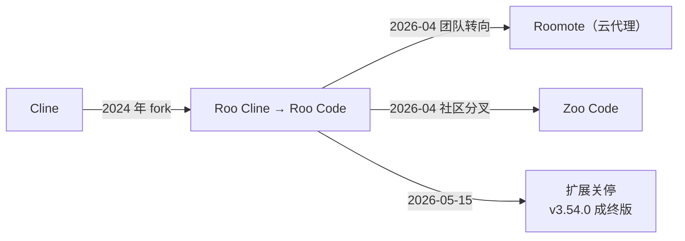

# Roo Code 关停之后：VS Code 里的 AI 编程团队，和它的三条后路

Roo Code 已经关停。2026 年 5 月 15 日，官方在仓库 README 里留下一句免责声明："The Roo Code Extension was shut down on May 15th"，仓库停更在 v3.54.0。距它发布 v3.53.0、承诺"插件不会消失"，只过了 22 天。

这篇文章写给两类人：还装着 Roo Code 的，和听说它好用正打算装的。前者需要知道接下来迁去哪；后者需要知道这段历史里哪些东西还活着——五大模式的设计被社区 fork Zoo Code 延续，原团队的精力转向了云代理 Roomote，而这条线的源头 Cline 仍在活跃开发。

## 先看现状

| 维度 | 数据（截至 2026-09-29）|
|------|------|
| 仓库 | RooCodeInc/Roo-Code |
| Stars / Forks | 24.3k / 3.4k |
| 主语言 | TypeScript |
| 许可证 | Apache-2.0 |
| 最终版本 | v3.54.0（2026-05-15 发布，同日宣布关停）|
| Marketplace 安装量 | 约 204 万 |
| Marketplace ID | `RooVeterinaryInc.roo-cline`（前身 Roo Cline 的名字留在了 ID 里）|
| 当前状态 | 已关停，仓库自 2026-05-15 起无新提交 |

README 里的免责声明只有两句话，却把整个谱系说完了：

> The Roo Code Extension was shut down on May 15th. If you're looking for an alternative, check out [ZooCode](https://github.com/Zoo-Code-Org/Zoo-Code/) (a fork started by the Roo Code community) and [Cline](https://cline.bot/) (from where Roo Code originated).

往上数是 Cline，往下数是 Zoo Code。中间这个曾经热闹的项目，现在只剩一个冻结的仓库。

## 谱系：从 Cline 分出来，又分出两条线

Roo Code 2024 年从 Cline 分叉而来（GitHub 上 RooCodeInc/Roo-Code 建于 2024-10-31），最初叫 Roo Cline，后来改名 Roo Code。Marketplace 的 publisher ID 至今还是 `roo-cline`，是这个名字存在过的最直接物证。

关键节点按时间排开：

| 时间 | 事件 |
|------|------|
| 2024-10 | RooCodeInc/Roo-Code 建库，项目当时叫 Roo Cline |
| 2025 年 | 改名 Roo Code，模式体系逐步成型 |
| 2026-04-23 | 发布 v3.53.0：公告称安装量达 300 万、原团队 all-in Roomote、承诺"社区团队已接手，插件会继续维护"；同版 CHANGELOG 里已出现"sunsetting Roo Code 博客文章"的条目。同日，社区在 Zoo-Code-Org/Zoo-Code 建库分叉 |
| 2026-05-15 | v3.54.0 发布；同日 README 挂出关停声明，承诺的交接以关停告终 |
| 2026-09 | Zoo Code 仍在活跃开发（已到 v3.84.0）；roocode.com 整站重定向到 Roomote |

"Roo 团队转向 Roomote"这个说法的直接出处是 Zoo Code README 的自述："Zoo Code continues development of this project after the Roo team wound down active Roo Code work to focus on Roomote"。打开 roocode.com 验证，首页已经是 Roomote 的产品页——"your own cloud coding agent"，署名 "By the creators of"。

## 它是个什么工具

Roo Code 的定位写在自己仓库的 description 里："a whole dev team of AI agents in your code editor"。它不是一个代码补全插件，而是把多个分工不同的智能体塞进 VS Code，核心是五个模式：

| 模式 | 职责（README 原述）| 典型场景 |
|------|------|------|
| Code Mode | 日常编码、编辑、文件操作 | 写新功能、改代码、批量调整 |
| Architect Mode | 规划系统、规格与迁移方案 | 设计服务结构、定迁移路径 |
| Ask Mode | 快速解答、解释与文档 | 弄懂一段代码、答疑 |
| Debug Mode | 追踪问题、加日志、隔离根因 | 排查 bug、定位故障 |
| Custom Modes | 为团队或工作流定制专属模式 | 把团队规范固化成可复用的模式 |

这套设计的意图是：把"一个智能体什么都干"改成"一组专职智能体各干一段"。规划、实现、排查、解释分属不同模式，切换模式就是切换任务阶段，避免长会话里一个上下文从头背到尾。

除模式之外，它还有两块能力。一是 MCP（Model Context Protocol，模型上下文协议）服务器支持，让智能体调用外部工具和数据源，README 列在能力清单里（"Utilize MCP Servers"）。二是检查点（Checkpoints）机制，在对话关键节点存档、随时回溯——这个功能的官方文档页已随关停下线，现在访问会得到 404，这也是"死项目"处境的一个缩影：扩展还能装，但周边文档正在一点点失效。

## 一次任务怎么在五个模式间流转

用一个具体任务看模式分工的价值。假设要给一个 Express 后端加接口限流：

1. **Architect 模式出方案**。先不写代码，让它规划：限流算法选固定窗口还是令牌桶、中间件放在哪一层、计数存内存还是 Redis。产出一份简短规格。
2. **切到 Code 模式实现**。按规格改路由文件、装依赖、跑通。实现阶段不再讨论方案，方案已经在规格里定死。
3. **压测出问题，Debug 模式介入**。限流偶发失效，让它加日志、追踪变量，最后定位到并发计数上的竞态，修掉。
4. **Ask 模式收尾**。让它解释修复后的代码，把限流策略写成文档留给团队。

全程可以在动手前和改完后各打一个检查点，方案不对就回退重来。

这个流程里每个模式的动作，都落在 README 描述的职责范围内。模式切换真正约束的是人的习惯——先规划再动手、排查和实现分开、解释单独做，这比单一大上下文会话更容易保持任务清晰。后来 Zoo Code 的演进方向也印证了这条路的延续：它把模式间的委派做成了 Orchestrator 父子任务结构，把"分工"推到了"编排"。

## 为什么会走到关停

能核实的事实是一条清晰、且带有反转的时间线：

- 2026-04-23，v3.53.0 发布。CHANGELOG 顶部写着："The Roo Code plugin is not going away"——公告说 Roo Code 达到 300 万安装，原团队 all-in Roomote，同时承诺"社区团队已挺身接手，我们正在和他们做官方交接，你依赖的这个插件会继续得到维护和改进"。同一版本的 CHANGELOG 里，还有一条"添加 sunsetting Roo Code 博客文章"的记录。
- 2026-05-15，v3.54.0 发布，同日 README 挂出关停声明。22 天前承诺的"官方交接"，以扩展关停收场。社区实际走的是另一条路：Zoo Code 在 v3.53.0 发布当天就已建库，其 README 自述核心团队是"previously contributed to Roo"的开发者。
- roocode.com 如今整站重定向到 roomote.dev——Roomote 是一个支持自托管或云端的编码智能体，主打异步执行、多模型混搭（BYOK，Bring Your Own Key，自带密钥）、自动化任务，官网标注 "Source available"。
- 那篇 sunsetting 博客文章随 roocode.com 改版下线，现在访问该站任何路径都会跳到 Roomote 首页。官方解释关停原因的公开文本，实际上已经找不到了；README 只剩免责声明和一个账单联系邮箱（billing@roocode.com）。

官方没说的部分只能推测：商业上，免费开源的编辑器扩展难以直接变现，而 Roomote 走云端或自托管、按任务编排的路子，更接近一个可持续收费的产品形态。这个推断的依据是两个产品形态的公开差异，不含任何内部信息——关停的真实原因，官方到今天没有公开说明。

## 现在的三条路

| 选项 | 是什么 | 现状（2026-09-29）| 适合谁 |
|------|--------|------|--------|
| **Zoo Code** | 社区分叉，原样继承 Roo Code 的模式体系 | 1.9k stars，主仓库当天仍有提交，已迭代到 v3.84.0；新增 Semble 语义代码检索、Orchestrator 编排强化、危险命令拦截（DCG）| 想保留 Roo Code 使用体验和现有配置的存量用户 |
| **Cline** | Roo Code 的上游本尊 | 69.5k stars，持续活跃；定位已扩展为 SDK、IDE 扩展、CLI 多形态 | 不依赖 Roo 的模式体系、想要最大生态与活跃维护的用户 |
| **Roomote** | 原 Roo 团队的新产品 | 云端或自托管的编码智能体，BYOK、多 provider、支持 Slack/Teams/Discord/Telegram 触发，source available | 想要异步云代理、自动化编排的团队，且不介意产品形态从"编辑器内"变成"云端接活" |

迁移时的几件实事：

- Roo → Zoo 有官方迁移指南：[docs.zoocode.dev/roo-to-zoo-migration](https://docs.zoocode.dev/roo-to-zoo-migration)，Zoo Code 的 Marketplace ID 是 `ZooCodeOrganization.zoo-code`。
- Roo Code 扩展不会再有更新。模型 API 一旦变更，旧版本可能直接失效，不该再当活跃工具使用。
- 曾付费的用户，账单问题按 README 指引写信至 billing@roocode.com。

## 结尾判断

Roo Code 停在 v3.54.0，但它留下两样东西。

一是模式化分工的智能体设计。Architect、Code、Debug、Ask 各管一段任务的做法，被 Zoo Code 原样继承并往编排方向推进；在"单一全能 agent"和"多智能体流水线"之间，这条路证明了中间态是可行的。

二是一个值得记住的教训：开源项目的维护权悬在团队手里。团队转向新产品，204 万装机量的工具说停就停，自定义模式、配置这些用户资产只能自己迁。选编辑器里的 AI 工具时，维护方的存续意愿和社区分叉的活跃度，和功能清单一样重要。

对今天的新用户，结论很简单：不要再装 Roo Code。想要它的体验就装 Zoo Code，想要上游生态就用 Cline，想要原团队的后续就看 Roomote。

## 数据口径

- Roo-Code 仓库数据（Stars、Forks、语言、许可证、最终版本、关停日期）来自 GitHub API 与仓库 README，截至 2026-09-29。
- Marketplace 安装量、版本号与 publisher ID 来自 VS Code Marketplace 页面，2026-09-29 查询。
- Zoo Code 数据（Stars、建库时间、最新版本、新增特性）来自 GitHub API 与其 README，截至 2026-09-29；"Roo 团队转向 Roomote"的表述出自 Zoo Code README 自述。
- Cline 数据来自 GitHub API，截至 2026-09-29。
- Roomote 产品信息来自 roocode.com，2026-09-29 访问。
- 五大模式职责的描述引自 Roo Code 仓库 README。
- 关停的官方原因未公布，文中相关推断已显式标注为推测。

## 参考

| 资源 | 链接 |
|------|------|
| Roo Code 仓库 | [RooCodeInc/Roo-Code](https://github.com/RooCodeInc/Roo-Code) |
| Roo Code 文档（已冻结）| [roocodeinc.github.io/Roo-Code](https://roocodeinc.github.io/Roo-Code/) |
| Zoo Code 仓库 | [Zoo-Code-Org/Zoo-Code](https://github.com/Zoo-Code-Org/Zoo-Code) |
| Roo → Zoo 迁移指南 | [docs.zoocode.dev/roo-to-zoo-migration](https://docs.zoocode.dev/roo-to-zoo-migration) |
| Cline 仓库 | [cline/cline](https://github.com/cline/cline) |
| Roomote 官网 | [roocode.com](https://roocode.com) |
| VS Code Marketplace | [Roo Code 扩展页](https://marketplace.visualstudio.com/items?itemName=RooVeterinaryInc.roo-cline) |
