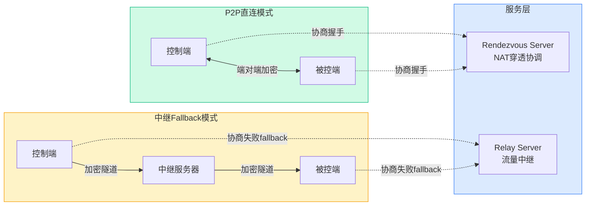
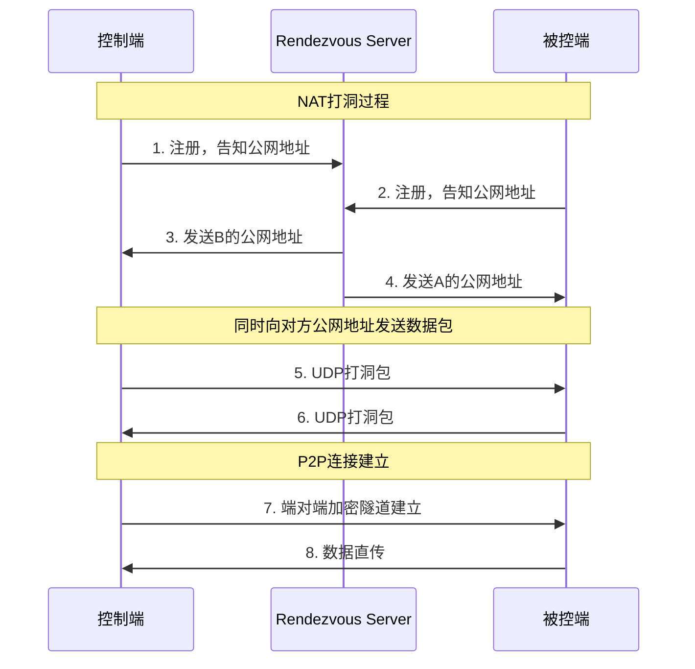
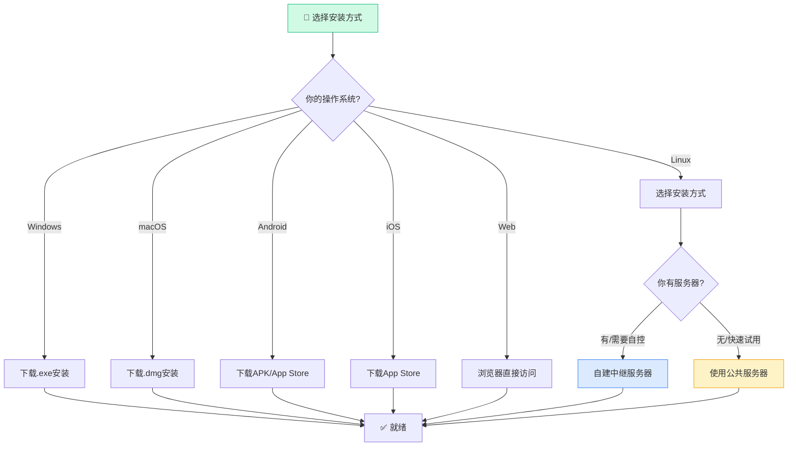
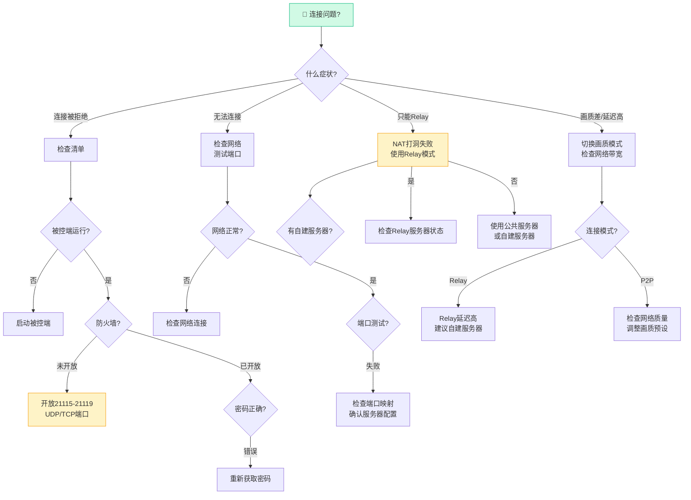
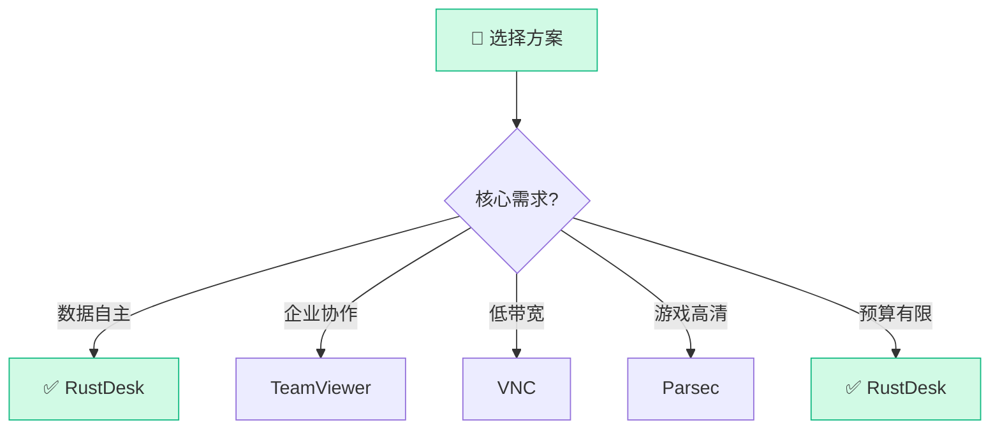

> **目标读者**：需要远程桌面解决方案的个人开发者、中小企业IT管理员、重视数据隐私的用户，以及对Rust语言应用感兴趣的开发者。
> **核心问题**：RustDesk 如何用 Rust 实现一个开箱即用的远程桌面应用？它的 P2P 直连和中继架构是怎么工作的？如何自建服务器保证数据完全自主？
> **事实边界**：本文基于 `rustdesk/rustdesk` 公开仓库信息整理，涵盖 README 功能列表、官方文档及 GitHub Issues 讨论。

---

## 阅读导航

- 只想快速安装跑起来 → 直接看 `§5 使用说明`
- 想理解 P2P 直连和 中继架构 → 重点看 `§2 原理分析`
- 想搭建自己的中继服务器 → 重点看 `§6 自托管部署`
- 想了解开发扩展方法 → 重点看 `§7 开发扩展`
- 想比较和其他远程桌面方案 → 重点看 `§8 竞品对比`

---

## §1 项目概述

RustDesk 是目前最受欢迎的开源远程桌面项目之一，采用 Rust 语言从零开发，GitHub 星标数突破 **112k**，远超同类开源竞品。

**核心特性：**

- **开箱即用**：无需配置，下载即用，有免费公共服务器可用
- **完全自控**：数据完全归用户自己掌控，支持自建中继/穿透服务器
- **跨平台**：支持 Windows、macOS、Linux、Android、iOS、Web
- **Rust 实现**：高性能、低内存、内存安全，无 JavaScript/ Electron 依赖
- **Flutter GUI**：桌面端使用 Flutter 构建，UI 现代美观
- **开源免费**：MIT 协议，完全免费

**技术指标：**

| 指标 | 数值 |
|------|------|
| GitHub Stars | 112,138 |
| Forks | 16,764 |
| 主语言 | Rust + Dart (Flutter) |
| 协议 | MIT |
| Releases | 持续更新，Nightly Build 可用 |

---

## §2 架构设计

### 2.1 整体架构

RustDesk 采用经典的 C/S 架构，但支持两种连接模式：



**连接流程**：

| 阶段 | 描述 |
|-------|-------|
| 1. 注册 | 双方登录Rendezvous Server，获取公网地址 |
| 2. 协商 | Server协助双方建立P2P连接 |
| 3. 直连 | 成功则P2P传输，失败则中继Fallback |
| 4. 加密 | Curve25519密钥交换 + ChaCha20加密 |

### 2.2 P2P 直连原理

当两端都在可靠网络环境下，RustDesk 会尝试建立 P2P 直连：



**NAT打洞三步骤**：

| 步骤 | 操作 | 结果 |
|------|------|------|
| **1. 注册** | 双方连接Server，交换公网IP:Port | Server知道双方地址 |
| **2. 打洞** | 同时向对方地址发送UDP包 | NAT映射建立 |
| **3. 直连** | 数据直接在两端传输 | Server不参与数据传输 |

### 2.3 中继Fallback

当 P2P 直连失败时（对称NAT、企业防火墙等），流量经中继服务器转发：

- ** rendezvous server** 负责设备发现、NAT穿透协调
- ** relay server** 负责实际流媒体数据转发
- **延迟更高但可用性更强**：Relay 模式延迟通常增加 50-200ms

### 2.4 技术栈

| 组件 | 技术选型 | 说明 |
|------|---------|------|
| 核心 | Rust | 无GC、内存安全、高性能 |
| GUI | Flutter/Dart | 跨平台UI框架 |
| 视频编解码 | libyuv + AOM/AV1 | 高效屏幕压缩 |
| 音频 | Opus | 低延迟音频编码 |
| 视频 | VPX/AV1 | 高效屏幕内容编码 |
| 网络 | tokio | 异步IO框架 |
| 加密 | libsodium (NaCl) | Curve25519 + ChaCha20-Poly1305 |

### 2.5 安全架构

```mermaid
flowchart TB
    subgraph 客户端[端对端加密]
        A[控制端] <-->|Curve25519密钥交换| B[被控端]
        A1[ChaCha20加密] <--> B1[ChaCha20解密]
    end

    subgraph 中继[中继模式(加密但不端对端)]
        R[Relay Server]
        A2[控制端TLS] -->|TLS| R
        R -->|TLS| B2[被控端TLS]
    end

    style 客户端 fill:#d1fae5,stroke:#10b981
    style 中继 fill:#fef3c7,stroke:#f59e0b
```

**安全对比**：

| 模式 | 加密 | Server能解密 | 推荐场景 |
|-------|------|-------------|----------|
| **P2P直连** | 端对端(E2E) | ❌ 无法 | 高安全性需求 |
| **中继Fallback** | TLS传输加密 | ⚠️ Server可见 | 无法P2P时 |

---

## §3 功能详解

### 3.1 核心功能

**远程控制**
- 键盘鼠标完全控制
- 文件传输（拖拽或内置文件管理器）
- 剪贴板双向同步（文字、图片）
- 文字聊天
- 音频传输（可选开启）

**会话管理**
- 简短的 ID + 密码连接，无需注册账号
- 地址本（收藏常用设备）
- 允许多并发会话

**画质与性能**
- 支持多种画质模式（自动/游戏/视频/文字）
- 帧率自适应网络状况
- 自动调整编码参数

### 3.2 安全特性

- **端对端加密**： libsodium (Curve25519 + ChaCha20-Poly1305)
- **ID/密码机制**：每次会话随机生成，无长期凭证
- **IP 白名单**：可选限制访问 IP
- **TLS 传输**：relay 模式下全链路 TLS
- **开源可审计**：代码完全透明，无后门

### 3.3 平台支持

| 平台 | 状态 | 安装方式 |
|------|------|---------|
| Windows | ✅ 稳定 | exe 安装包 |
| macOS | ✅ 稳定 | dmg 安装包 |
| Linux | ✅ 稳定 | AppImage/deb/Flatpak |
| Android | ✅ 稳定 | Google Play/F-Droid/APK |
| iOS | ✅ 稳定 | App Store |
| Web | ✅ Beta | 浏览器直接访问 |

---

## §4 使用说明

### 4.1 安装决策树



**安装方式对比**：

| 操作系统 | 推荐方式 | 备选方式 |
|----------|----------|----------|
| **Windows** | .exe安装包 | Scoop: `scoop install rustdesk` |
| **macOS** | .dmg安装包 | Homebrew: `brew install --cask rustdesk` |
| **Linux** | .deb/AppImage | Snap/Flatpak |
| **Android** | APK/F-Droid | Google Play |
| **iOS** | App Store | TestFlight |
| **Web** | 浏览器访问 | 无 |

### 4.2 快速开始（30秒上手）

**步骤1：下载安装**

访问 [RustDesk Releases](https://github.com/rustdesk/rustdesk/releases) 下载对应平台安装包，或：

```bash
# Linux (AppImage)
wget https://github.com/rustdesk/rustdesk/releases/latest/download/rustdesk_x.x.x_amd64.AppImage
chmod +x rustdesk_x.x.x_amd64.AppImage
./rustdesk_x.x.x_amd64.AppImage

# 或通过包管理器
# Arch: yay -S rustdesk
# Ubuntu/Debian: 下载 .deb 安装
```

**步骤2：启动获取 ID**

安装后启动 RustDesk，界面显示您的 ID 和密码：

```
┌─────────────────────────────┐
│  RustDesk                   │
│                             │
│  ID: 123-456-789           │
│  Password: abcd1234         │
│                             │
│  [我的 ID] [变更密码]       │
└─────────────────────────────┘
```

**步骤3：远程连接**

在被控端电脑上，输入控制端的 ID 和密码，点击"连接"即可。

### 4.2 自建服务器（数据完全自主）

使用公共服务器有隐私顾虑？自建只需要一台有公网 IP 的服务器：

**使用 Docker 快速部署**

```bash
# 克隆服务器仓库
git clone https://github.com/rustdesk/rustdesk-server.git
cd rustdesk-server

# 使用 Docker Compose 启动
docker-compose up -d

# 或手动启动
docker run --name rustdesk-server \
  -d --network host \
  -e "RELAY=your-server-ip:21117" \
  -e "NATHP=your-server-ip:21116" \
  rustdesk/rustdesk-server:latest
```

**配置客户端使用自建服务器**

安装目录下创建 `rustdesk.yml` 配置文件：

```yaml
# rustdesk.yml
rendezvous_server: your-server-ip:21116
nat_type_detection_server: your-server-ip:21116
relay_server: your-server-ip:21117
```

### 4.3 移动端使用

Android/iOS 端功能与桌面端一致，支持：
- 触控鼠标模拟
- 虚拟键盘
- 快速连接码

iOS App Store 下载地址：搜索 "RustDesk"  
Android Google Play / F-Droid 可用

### 4.4 故障排除决策树



**故障速查表**：

| 问题 | 快速解决方案 | 命令/检查点 |
|------|--------------|-------------|
| 连接被拒绝 | 启动被控端+开放端口 | `netstat -tlnp | grep rustdesk` |
| P2P失败 | 使用Relay模式 | 检查NAT类型 |
| 延迟高 | 自建服务器+调画质 | ping测试 |
| 画质差 | 切换画质预设 | 设置→画质模式 |
| 剪贴板不工作 | 重启应用+检查权限 | 更新到最新版本 |
| 音频无声音 | 开启音频选项 | 设置→音频传输 |

**端口检查命令**：

```bash
# 检查RustDesk端口状态
netstat -tlnp | grep -E "21115|21116|21117|21118|21119"

# 测试UDP端口
nc -vz -u your-server 21115-21119

# 检查防火墙规则 (Ubuntu)
sudo ufw status
sudo ufw allow 21115:21119/udp
sudo ufw allow 21115:21119/tcp
```

---

## §5 开发扩展

### 5.1 编译开发环境

```bash
# 安装 Rust
curl --proto '=https' --tlsv1.2 -sSf https://sh.rustup.rs | sh

# 安装依赖 (Ubuntu)
sudo apt install -y zip g++ gcc git curl wget nasm yasm \
  libgtk-3-dev clang libxcb-randr0-dev libxdo-dev \
  libxfixes-dev libxcb-shape0-dev libxcb-xfixes0-dev \
  libasound2-dev libpulse-dev cmake make \
  libclang-dev ninja-build libgstreamer1.0-dev \
  libgstreamer-plugins-base1.0-dev

# 安装 vcpkg
git clone https://github.com/microsoft/vcpkg.git
cd vcpkg && ./bootstrap-vcpkg.sh
export VCPKG_ROOT=$PWD

# 安装 RustDesk 依赖
vcpkg install libvpx:x64-windows-static libyuv:x64-windows-static \
  opus:x64-windows-static aom:x64-windows-static

# 克隆并构建
git clone https://github.com/rustdesk/rustdesk.git
cd rustdesk
cargo run --release
```

### 5.2 API 与二次开发

RustDesk 提供了一套工具函数和事件系统，支持第三方集成：

**监听连接事件**

```rust
// 注册连接回调
rustdesk::on_connect(|id, password| {
    println!("New connection: {} with password: {}", id, password);
});
```

**自定义控制逻辑**

```rust
// 实现自定义屏幕控制
let screen = rustdesk::screenshare::new_session()?;
screen.set_quality(rustdesk::screenshare::Quality::Game)?;
```

### 5.3 插件扩展（未来计划）

根据 GitHub Issues 讨论，RustDesk 团队正在规划：
- Web 插件系统
- REST API 接口
- 更多视频编解码支持

---

## §6 竞品对比

### 6.1 性能对比

| 方案 | 延迟(P2P) | 带宽占用 | 内存占用 | 适合场景 |
|------|-----------|----------|---------|----------|
| **RustDesk** | 20-50ms | 1-5 Mbps | 80-150MB | 通用远程桌面 |
| TeamViewer | 30-80ms | 2-8 Mbps | 100-200MB | 企业协作 |
| AnyDesk | 40-100ms | 1-5 Mbps | 50-100MB | 轻量远程支持 |
| VNC | 100-300ms | 0.5-2 Mbps | 30-80MB | 低带宽环境 |
| Parsec | 15-30ms | 5-15 Mbps | 150-300MB | 游戏/高清 |

### 6.2 选择决策树



### 6.3 功能矩阵

| 方案 | 自托管 | 端对端加密 | 跨平台 | 文件传输 | 语音聊天 |
|------|--------|------------|--------|----------|----------|
| **RustDesk** | ✅ | ✅ | ✅ | ✅ | ✅ |
| TeamViewer | ❌ | ✅ | ✅ | ✅ | ✅ |
| AnyDesk | ❌ | ✅ | ✅ | ✅ | ✅ |
| VNC | ✅ | ❌ | ✅ | ⚠️需配置 | ❌ |
| Parsec | ❌ | ✅ | ⚠️桌面 | ✅ | ✅ |

**RustDesk 优势**：
1. **完全开源**：代码可审计，无后门风险
2. **自托管**：数据完全自主，不经过第三方服务器
3. **免费**：无使用费用，无设备数量限制
4. **Rust实现**：性能优异，无Electron的资源占用问题

## §7 进阶配置

### 7.1 高画质配置

编辑 `rustdesk.yml`：

```yaml
video:
  quality: 4  # 0=文字 1=平衡 2=娱乐 3=视频 4=自定义
  fps: 60
  bitrate: 8000

audio:
  enabled: true
  codec: opus
```

### 7.2 仅局域网模式

不希望暴露到互联网，仅局域网使用：

```yaml
net:
  lan_only: true
```

### 7.3 日志调试

```bash
# Linux 启动调试模式
RUST_LOG=debug ./rustdesk
```

---

## §8 总结

RustDesk 是目前最值得使用的开源远程桌面方案：
- **112k GitHub Stars** 验证了项目的受欢迎程度和技术质量
- **开箱即用 + 自托管** 的灵活性满足从个人到企业的各层次需求
- **Rust + Flutter** 技术栈保证了性能与跨平台能力
- **MIT 协议** 意味着可以自由使用、修改、商业化

无论你是需要一个免费的 TeamViewer 替代品，还是对 Rust 语言在生产力应用中的实践感兴趣，RustDesk 都是一个值得关注和深入研究的项目。

---

**🦞 每日 GitHub 趋势榜自动分析 | 数据来源：GitHub Trending**
