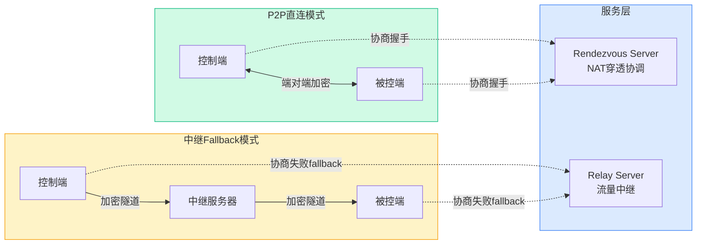
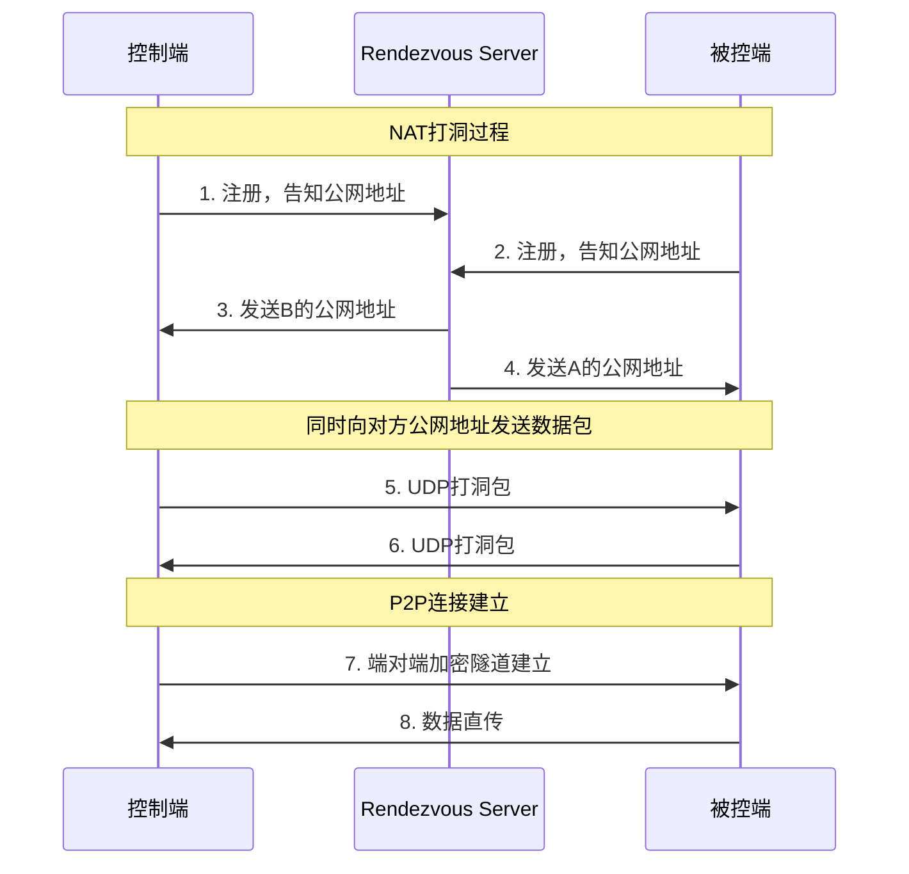
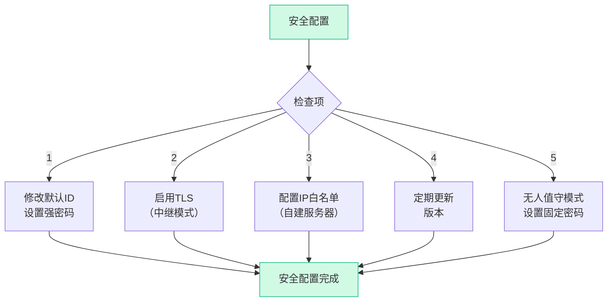
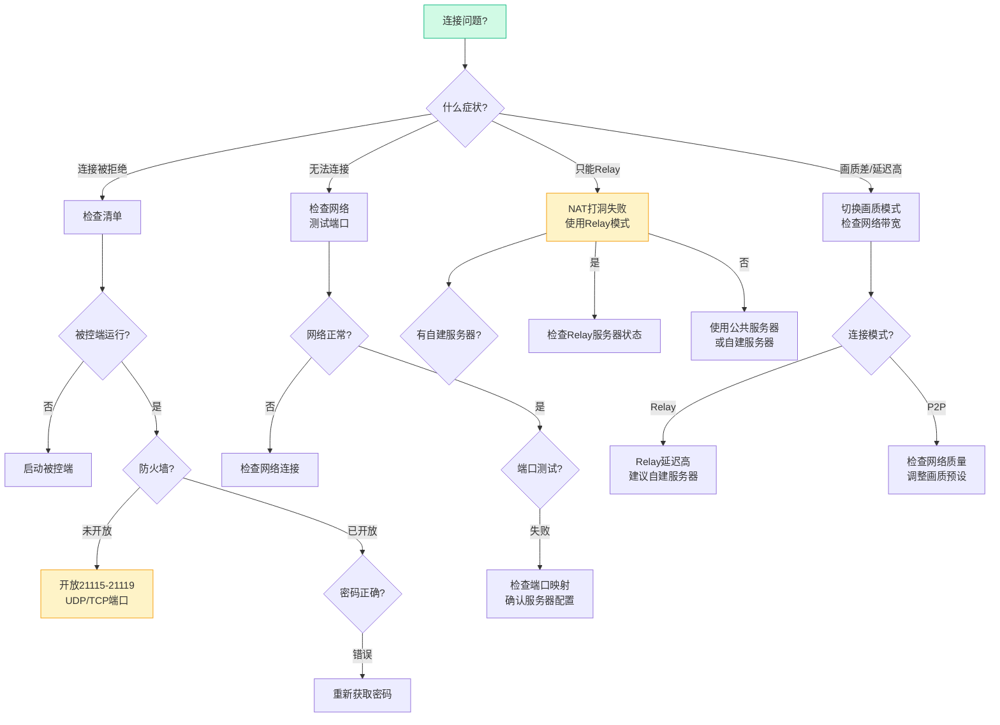
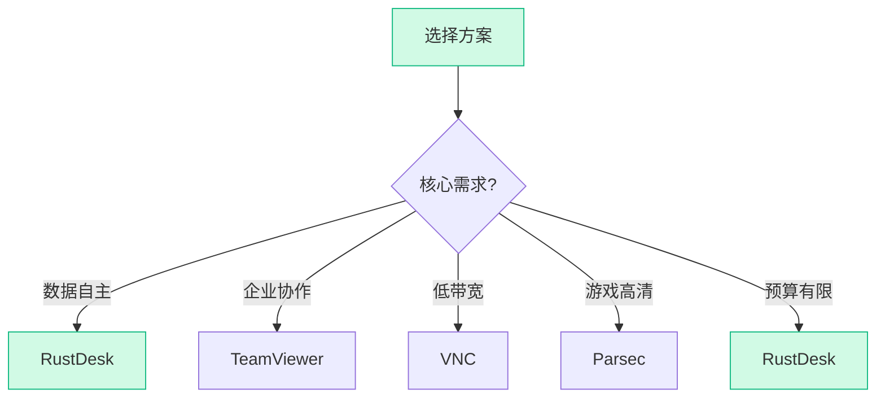

> **目标读者**：需要远程桌面解决方案的个人开发者、中小企业 IT 管理员、重视数据隐私的用户，以及对 Rust 语言应用感兴趣的开发者。
> **核心问题**：RustDesk 如何用 Rust 实现一个开箱即用的远程桌面应用？它的 P2P 直连和中继架构是怎么工作的？如何自建服务器保证数据完全自主？
> **事实边界**：本文基于 `rustdesk/rustdesk` 公开仓库信息整理，涵盖 README 功能列表、官方文档及 GitHub Issues 讨论。

---

## 阅读导航

- 只想快速安装跑起来 → 直接看 `§4 使用说明`
- 想理解 P2P 直连和中继架构 → 重点看 `§2 原理分析`
- 想搭建自己的中继服务器 → 重点看 `§5 自托管部署`
- 想了解开发扩展方法 → 重点看 `§6 开发扩展`
- 想比较和其他远程桌面方案 → 重点看 `§7 竞品对比`

---

## §1 项目概述

RustDesk 解决的核心问题是：**远程桌面能不能既做到开箱即用，又让数据完全留在自己手里**。大多数远程桌面软件在这两条路上只能选一条——要么像 TeamViewer 那样方便但数据经过第三方服务器，要么像 VNC 那样数据可控但配置繁琐。RustDesk 用一套 P2P 优先、中继兜底的架构同时覆盖了这两端。

项目用 Rust 从零编写，GitHub 星标数突破 **112k**，MIT 协议开源。

**技术指标：**

| 指标 | 数值 |
|------|------|
| GitHub Stars | 112,138 |
| Forks | 16,764 |
| 主语言 | Rust + Dart (Flutter) |
| 协议 | MIT |
| Releases | 持续更新，Nightly Build 可用 |

---

## §2 架构设计

### 2.1 整体架构

RustDesk 内部实际上跑着两条并行的连接路径：一条是 P2P 直连（低延迟、端对端加密、不经过服务器），另一条是中继转发（兼容性强、但延迟更高、服务器可见流量）。两条路径共用同一套 rendezvous（会合）服务器做设备发现，连接建立时优先走 P2P，失败则自动降级到中继。



**连接流程：**

| 阶段 | 描述 |
|-------|-------|
| 1. 注册 | 双方登录 Rendezvous Server，获取公网地址 |
| 2. 协商 | Server 协助双方建立 P2P 连接 |
| 3. 直连 | 成功则 P2P 传输，失败则中继 Fallback |
| 4. 加密 | Curve25519 密钥交换 + ChaCha20 加密 |

### 2.2 一次远程会话的完整数据路径

在拆解 P2P 和中继之前，先看一个完整的任务是怎么流过系统的。假设你从公司电脑（控制端 A）远程连回家里的台式机（被控端 B）：

1. **设备上线**：A 和 B 各自启动 RustDesk，向 Rendezvous Server 注册自己的公网 IP 和端口。此时 Server 只知道"有两个设备在线"，还没有任何屏幕数据流经它。
2. **发起连接**：A 输入 B 的 ID 和密码，向 Rendezvous Server 请求与 B 建立连接。
3. **NAT 打洞协商**：Server 把 A 和 B 的公网地址分别发给对方。A 和 B 同时向对方地址发送 UDP 打洞包，试探 NAT 是否允许直连。
4. **路径分叉**：
   - 如果打洞成功 → A 和 B 之间建立 P2P 加密通道，屏幕数据、键鼠事件、剪贴板全部直接从 A 到 B，不经过任何服务器。
   - 如果打洞失败（比如公司防火墙做了对称 NAT）→ 数据改走 Relay Server 转发，A 和 B 各自与 Relay 建立 TLS 连接，Relay 在中间转发加密流量。
5. **会话维持**：连接建立后，A 看到的屏幕画面由 B 端实时编码（VP8/AV1/H264/H265），通过已建立的通道推送到 A 端解码显示。键鼠操作反向传递。

关键点：**Rendezvous Server 只管设备发现和打洞协商，不碰屏幕数据**。中继只在 P2P 失败时介入。

### 2.3 P2P 直连原理



**NAT 打洞三步骤：**

| 步骤 | 操作 | 结果 |
|------|------|------|
| **1. 注册** | 双方连接 Server，交换公网 IP:Port | Server 知道双方地址 |
| **2. 打洞** | 同时向对方地址发送 UDP 包 | NAT 映射建立 |
| **3. 直连** | 数据直接在两端传输 | Server 不参与数据传输 |

### 2.4 中继 Fallback

当 P2P 直连失败时（对称 NAT、企业防火墙等），流量经中继服务器转发：

- **Rendezvous Server** 负责设备发现、NAT 穿透协调
- **Relay Server** 负责实际流媒体数据转发
- 中继模式下延迟通常增加 50-200ms，但可用性更强

### 2.5 技术栈

| 组件 | 技术选型 | 说明 |
|------|---------|------|
| 核心 | Rust | 无 GC、内存安全、高性能 |
| GUI | Flutter/Dart | 跨平台 UI 框架 |
| 视频编解码 | libyuv + VP8/AV1/H264/H265 | 高效屏幕压缩 |
| 音频 | Opus | 低延迟音频编码 |
| 网络 | tokio | 异步 IO 框架 |
| 加密 | libsodium (NaCl) | Curve25519 + ChaCha20-Poly1305 |

### 2.6 安全架构

```mermaid
flowchart TB
    subgraph 客户端[端对端加密]
        A[控制端] <-->|Curve25519密钥交换| B[被控端]
        A1[ChaCha20加密] <--> B1[ChaCha20解密]
    end

    subgraph 中继[中继模式(加密但不端对端)]
        R[Relay Server]
        A2[控制端TLS] -->|TLS| R
        R -->|TLS| B2[被控端TLS]
    end

    style 客户端 fill:#d1fae5,stroke:#10b981
    style 中继 fill:#fef3c7,stroke:#f59e0b
```

**安全对比：**

| 模式 | 加密 | Server 能解密 | 推荐场景 |
|-------|------|-------------|----------|
| **P2P 直连** | 端对端 (E2E) | 无法 | 高安全性需求 |
| **中继 Fallback** | TLS 传输加密 | Server 可见 | 无法 P2P 时 |

---

## §3 功能详解

### 3.1 远程控制

- 键盘鼠标完全控制
- 文件传输（拖拽或内置文件管理器）
- 剪贴板双向同步（文字、图片）
- 文字聊天
- 音频传输（可选开启）

### 3.2 会话管理

- 简短的 ID + 密码连接，无需注册账号
- 地址本（收藏常用设备）
- 允许多并发会话

### 3.3 画质与性能

RustDesk 支持多种画质模式，背后是编码参数的自适应调整。选择"游戏"模式时，帧率优先、码率拉高；选择"文字"模式时，清晰度优先、帧率降低。自动模式会根据网络状况动态切换：

- 自动模式 — 帧率和编码参数自适应网络状况
- 游戏模式 — 高帧率、牺牲部分画质
- 视频模式 — 平衡帧率和画质
- 文字模式 — 最高清晰度、低帧率

### 3.4 安全特性

- **端对端加密**：libsodium (Curve25519 + ChaCha20-Poly1305)
- **ID/密码机制**：每次会话随机生成，无长期凭证
- **IP 白名单**：可选限制访问 IP
- **TLS 传输**：中继模式下全链路 TLS
- **开源可审计**：代码完全透明

### 3.5 平台支持

| 平台 | 状态 | 安装方式 |
|------|------|---------|
| Windows | 稳定 | exe 安装包 |
| macOS | 稳定 | dmg 安装包 |
| Linux | 稳定 | AppImage/deb/Flatpak |
| Android | 稳定 | Google Play / F-Droid / APK |
| iOS | 稳定 | App Store |
| Web | Beta | 浏览器直接访问 |

---

## §4 使用说明

### 4.1 安装决策树


**安装方式对比：**

| 操作系统 | 推荐方式 | 备选方式 |
|----------|----------|----------|
| **Windows** | .exe 安装包 | Scoop: `scoop install rustdesk` |
| **macOS** | .dmg 安装包 | Homebrew: `brew install --cask rustdesk` |
| **Linux** | .deb / AppImage | Snap / Flatpak |
| **Android** | APK / F-Droid | Google Play |
| **iOS** | App Store | TestFlight |
| **Web** | 浏览器访问 | 无 |

### 4.2 快速开始（30 秒上手）

**步骤 1：下载安装**

访问 [RustDesk Releases](https://github.com/rustdesk/rustdesk/releases) 下载对应平台安装包，或：

```bash
# Linux (AppImage)
wget https://github.com/rustdesk/rustdesk/releases/latest/download/rustdesk_x.x.x_amd64.AppImage
chmod +x rustdesk_x.x.x_amd64.AppImage
./rustdesk_x.x.x_amd64.AppImage

# 或通过包管理器
# Arch: yay -S rustdesk
# Ubuntu/Debian: 下载 .deb 安装
```

**步骤 2：启动获取 ID**

安装后启动 RustDesk，界面显示你的 ID 和密码：

```
┌─────────────────────────────┐
│  RustDesk                   │
│                             │
│  ID: 123-456-789           │
│  Password: abcd1234         │
│                             │
│  [我的 ID] [变更密码]       │
└─────────────────────────────┘
```

**步骤 3：远程连接**

在被控端电脑上，输入控制端的 ID 和密码，点击"连接"即可。

### 4.3 自建服务器（数据完全自主）

自建只需要一台有公网 IP 的服务器：

**使用 Docker 快速部署**

```bash
# 克隆服务器仓库
git clone https://github.com/rustdesk/rustdesk-server.git
cd rustdesk-server

# 使用 Docker Compose 启动
docker-compose up -d

# 或手动启动
docker run --name rustdesk-server \
  -d --network host \
  -e "RELAY=your-server-ip:21117" \
  -e "NATHP=your-server-ip:21116" \
  rustdesk/rustdesk-server:latest
```

**配置客户端使用自建服务器**

安装目录下创建 `rustdesk.yml` 配置文件：

```yaml
# rustdesk.yml
rendezvous_server: your-server-ip:21116
nat_type_detection_server: your-server-ip:21116
relay_server: your-server-ip:21117
```

### 4.4 移动端使用

Android / iOS 端功能与桌面端一致，支持：

- 触控鼠标模拟
- 虚拟键盘
- 快速连接码

iOS App Store 搜索 "RustDesk"；Android Google Play / F-Droid 可用。

### 4.5 安全配置检查清单



**安全强化命令：**

```bash
# 检查当前安全配置
grep -E "password|tls|ip_whitelist" ~/.config/rustdesk/rustdesk.yml

# 查看连接历史（排查异常）
cat ~/.local/share/rustdesk/logs/*.log | grep "Connection"

# 重置所有密码
rustdesk-cli reset password
```

### 4.6 故障排除决策树



**故障速查表：**

| 问题 | 快速解决方案 | 命令/检查点 |
|------|--------------|-------------|
| 连接被拒绝 | 启动被控端 + 开放端口 | `netstat -tlnp | grep rustdesk` |
| P2P 失败 | 使用 Relay 模式 | 检查 NAT 类型 |
| 延迟高 | 自建服务器 + 调画质 | ping 测试 |
| 画质差 | 切换画质预设 | 设置 → 画质模式 |
| 剪贴板不工作 | 重启应用 + 检查权限 | 更新到最新版本 |
| 音频无声音 | 开启音频选项 | 设置 → 音频传输 |

**端口检查命令：**

```bash
# 检查RustDesk端口状态
netstat -tlnp | grep -E "21115|21116|21117|21118|21119"

# 测试UDP端口
nc -vz -u your-server 21115-21119

# 检查防火墙规则 (Ubuntu)
sudo ufw status
sudo ufw allow 21115:21119/udp
sudo ufw allow 21115:21119/tcp
```

---

## §5 自托管部署

### 5.1 部署架构

自托管模式下，需要部署两个服务：

| 服务 | 端口 | 协议 | 作用 |
|------|------|------|------|
| hbbs (Rendezvous) | 21116 (TCP+UDP) | 自定义协议 | 设备注册、NAT 类型检测、打洞协调 |
| hbbr (Relay) | 21117 (TCP) | 自定义协议 | 中继流量转发 |

额外端口：21115 (TCP) 用于 NAT 类型测试，21118/21119 (TCP) 用于 WebSocket 连接。

### 5.2 Docker Compose 部署

```yaml
# docker-compose.yml
version: '3'

services:
  hbbs:
    container_name: hbbs
    image: rustdesk/rustdesk-server:latest
    command: hbbs
    volumes:
      - ./data:/root
    network_mode: "host"
    depends_on:
      - hbbr
    restart: unless-stopped

  hbbr:
    container_name: hbbr
    image: rustdesk/rustdesk-server:latest
    command: hbbr
    volumes:
      - ./data:/root
    network_mode: "host"
    restart: unless-stopped
```

启动后，hbbs 会在 `./data` 目录下生成密钥对。客户端需要拿到公钥才能连接自建服务器。

### 5.3 客户端配置

将生成的公钥内容写入客户端的 `rustdesk.yml`：

```yaml
rendezvous_server: your-server-ip:21116
nat_type_detection_server: your-server-ip:21116
relay_server: your-server-ip:21117
key: "你的公钥内容"
```

---

## §6 开发扩展

### 6.1 编译开发环境

```bash
# 安装 Rust
curl --proto '=https' --tlsv1.2 -sSf https://sh.rustup.rs | sh

# 安装依赖 (Ubuntu)
sudo apt install -y zip g++ gcc git curl wget nasm yasm \
  libgtk-3-dev clang libxcb-randr0-dev libxdo-dev \
  libxfixes-dev libxcb-shape0-dev libxcb-xfixes0-dev \
  libasound2-dev libpulse-dev cmake make \
  libclang-dev ninja-build libgstreamer1.0-dev \
  libgstreamer-plugins-base1.0-dev

# 安装 vcpkg
git clone https://github.com/microsoft/vcpkg.git
cd vcpkg && ./bootstrap-vcpkg.sh
export VCPKG_ROOT=$PWD

# 安装 RustDesk 依赖
vcpkg install libvpx:x64-windows-static libyuv:x64-windows-static \
  opus:x64-windows-static aom:x64-windows-static

# 克隆并构建
git clone https://github.com/rustdesk/rustdesk.git
cd rustdesk
cargo run --release
```

### 6.2 API 与二次开发

RustDesk 提供了一套工具函数和事件系统，支持第三方集成：

**监听连接事件**

```rust
// 注册连接回调
rustdesk::on_connect(|id, password| {
    println!("New connection: {} with password: {}", id, password);
});
```

**自定义控制逻辑**

```rust
// 实现自定义屏幕控制
let screen = rustdesk::screenshare::new_session()?;
screen.set_quality(rustdesk::screenshare::Quality::Game)?;
```

### 6.3 插件扩展（未来计划）

根据 GitHub Issues 讨论，RustDesk 团队正在规划：

- Web 插件系统
- REST API 接口
- 更多视频编解码支持

---

## §7 竞品对比

### 7.1 性能对比

下表数据来自各项目官方文档及社区实测，但需要注意：**远程桌面的延迟和带宽高度依赖网络环境**，同一个工具在不同网络条件下表现差异可能很大。以下数字反映的是典型局域网或良好公网环境下的表现，不应直接用于跨网络场景的结论。

| 方案 | 延迟 (P2P) | 带宽占用 | 内存占用 | 适合场景 |
|------|-----------|----------|---------|----------|
| **RustDesk** | 20-50ms | 1-5 Mbps | 80-150MB | 通用远程桌面 |
| TeamViewer | 30-80ms | 2-8 Mbps | 100-200MB | 企业协作 |
| AnyDesk | 40-100ms | 1-5 Mbps | 50-100MB | 轻量远程支持 |
| VNC | 100-300ms | 0.5-2 Mbps | 30-80MB | 低带宽环境 |
| Parsec | 15-30ms | 5-15 Mbps | 150-300MB | 游戏/高清 |

这些数字主要测的是屏幕编码延迟和传输延迟之和，能反映各自编码器效率（RustDesk 用 VP8/AV1，Parsec 用自研编码器）和协议栈开销。但**不能推出的结论**包括：

- 不能直接推出"RustDesk 比 TeamViewer 快"——跨运营商网络下，中继服务器的位置和带宽才是瓶颈。
- 内存占用低不意味着所有场景都省资源——屏幕分辨率、帧率、编码器选择都会显著改变实际占用。
- VNC 的延迟数字在低带宽场景下反而可能优于其他方案，因为它的编码策略刻意降低了带宽需求。

### 7.2 选择决策树



### 7.3 功能矩阵

| 方案 | 自托管 | 端对端加密 | 跨平台 | 文件传输 | 语音聊天 |
|------|--------|------------|--------|----------|----------|
| **RustDesk** | 是 | 是 | 是 | 是 | 是 |
| TeamViewer | 否 | 是 | 是 | 是 | 是 |
| AnyDesk | 否 | 是 | 是 | 是 | 是 |
| VNC | 是 | 否 | 是 | 需配置 | 否 |
| Parsec | 否 | 是 | 桌面 | 是 | 是 |

---

## §8 进阶配置

### 8.1 高画质配置

编辑 `rustdesk.yml`：

```yaml
video:
  quality: 4  # 0=文字 1=平衡 2=娱乐 3=视频 4=自定义
  fps: 60
  bitrate: 8000

audio:
  enabled: true
  codec: opus
```

### 8.2 仅局域网模式

不希望暴露到互联网，仅局域网使用：

```yaml
net:
  lan_only: true
```

### 8.3 日志调试

```bash
# Linux 启动调试模式
RUST_LOG=debug ./rustdesk
```

---

## §9 采用建议

RustDesk 在不同场景下的适用度差异很大，下面是按团队类型给出的建议：

**个人用户 / 自由职业者**

直接下载公共服务器版本即可。如果对隐私有要求，花 30 分钟在一台轻量云服务器上跑 Docker Compose 自建。自建后延迟和公共服务器基本一致，但数据不再经过 RustDesk 官方基础设施。

**中小企业 IT 团队**

自建服务器几乎是必选项。企业内网环境下，P2P 直连成功率远高于跨公网场景，实际体验可以接近局域网 VNC 的延迟水平。注意：中继模式下 Relay Server 能看见解密后的流量，涉密环境应在防火墙层面限制中继降级，或者只启用 P2P 模式。

**看重安全的团队**

RustDesk 的端对端加密只在 P2P 直连模式下生效。中继模式虽然全链路 TLS，但 Relay Server 是加密端点而非透明转发——如果 Relay Server 被攻破，流量会暴露。可以在客户端配置里关闭中继降级，强制只走 P2P，代价是某些网络环境无法连接。

**需要游戏/高清场景的团队**

Parsec 在编码效率和延迟上仍然有明显优势，RustDesk 不适合作为游戏串流主力。但如果你的场景是"偶尔需要在远程桌面里看视频或做简单的图形操作"，RustDesk 的画质模式足够覆盖。

**不急着用 RustDesk 的情况**

- 已有 TeamViewer/AnyDesk 企业授权且无自托管需求的团队，迁移成本高于收益。
- 纯内网环境且不需要跨平台的场景，VNC 更轻量。
- 需要细粒度权限控制（如只允许查看不允许操作）的合规场景，RustDesk 目前缺少这类功能。

---

**每日 GitHub 趋势榜自动分析 | 数据来源：GitHub Trending**