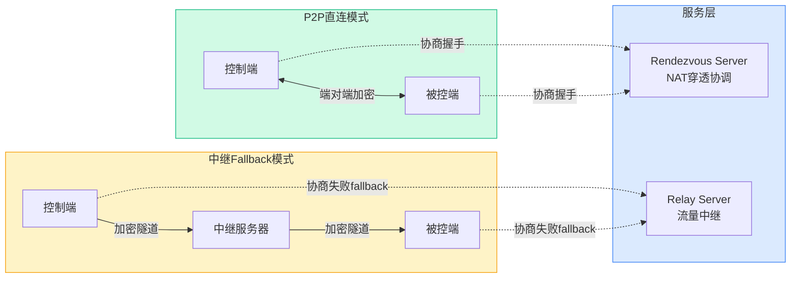
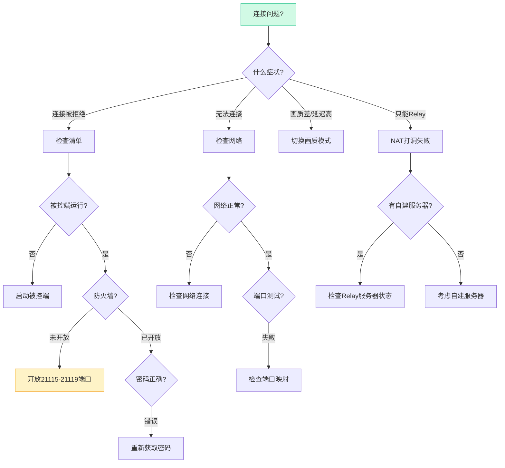

> **目标读者**：需要远程桌面解决方案的个人开发者、中小企业 IT 管理员、重视数据隐私的用户，以及对 Rust 语言在真实场景中应用感兴趣的开发者。
> **核心问题**：RustDesk 如何用 Rust 实现一个开箱即用的远程桌面应用？它的 P2P 直连和中继架构是怎么工作的？为什么先走 P2P 再降级到中继？如何自建服务器保证数据完全自主？
> **事实边界**：本文基于 `rustdesk/rustdesk` 公开仓库信息整理，涵盖 README 功能列表、官方文档及 GitHub Issues 讨论。所有技术细节均有公开来源。

---

## 学习目标

读完本文后，你将能够：

- 解释 RustDesk 的 P2P 优先、中继兜底的架构设计背后的原因
- 描述一次完整远程会话的数据路径，包括 NAT 打洞失败时的降级行为
- 在 Linux 服务器上用 Docker Compose 部署完整的中继服务（hbbs + hbbr）
- 判断在什么网络环境下 RustDesk 的 P2P 成功率会明显下降
- 针对企业内网、跨公网、高安全需求三种场景，给出合适的部署方案

---

## 阅读导航

- 只想快速安装跑起来 → 直接看 `§4 使用说明`
- 想理解 P2P 直连和中继架构背后的设计决策 → 重点看 `§2 架构设计`
- 想搭建自己的中继服务器 → 重点看 `§5 自托管部署`
- 想了解开发扩展方法 → 重点看 `§6 开发扩展`
- 想比较和其他远程桌面方案 → 重点看 `§7 竞品对比`
- 想判断 RustDesk 是否适合你的场景 → 重点看 `§9 采用建议`

---

## §1 项目概述

### 1.1 解决的核心问题

远程桌面软件面临一个根本矛盾：**便利性**和**数据自主性**不可兼得。

| 方案类型 | 代表产品 | 便利性 | 数据自主性 |
|---------|---------|---------|------------|
| 商业闭源 | TeamViewer, AnyDesk | 高（开箱即用） | 低（数据经第三方服务器） |
| 传统开源 | VNC, RDP | 低（配置繁琐） | 高（完全自主） |

RustDesk 的解决思路是：**用 P2P 优先的架构同时覆盖两端**。如果 P2P 直连能建立，数据完全不经过 RustDesk 的服务器；如果打洞失败，自动降级到中继转发，但中继服务器是你自己可以部署的。

### 1.2 为什么用 Rust 重写

RustDesk 选择 Rust 并非为了「技术时髦」，而是有几个实际原因：

- **无 GC 暂停**：远程桌面的屏幕编码和传输对延迟敏感，GC 暂停会导致画面卡顿。Rust 的所有权模型在编译期就消除了这个问题。
- **内存安全不加成本**：C/C++ 的话，内存安全漏洞是远程桌面软件的攻击面（想想看：屏幕数据、键鼠事件都是敏感信息）。Rust 在编译期保证内存安全，运行时零开销。
- **跨平台编译友好**：一套代码编译到 Windows/macOS/Linux/Android/iOS，Flutter 负责 UI，Rust 负责核心逻辑。

### 1.3 核心数据

| 指标 | 数值 |
|------|------|
| GitHub Stars | 112,138+ |
| Forks | 16,764+ |
| 主语言 | Rust（核心） + Dart（Flutter UI） |
| 协议 | MIT |
| 持续维护 | 是，Nightly Build 可用 |

---

## §2 架构设计

### 2.1 整体架构：为什么是两条路径

RustDesk 内部跑着两条并行的连接路径，这个设计背后有一个关键判断：**大多数情况下 P2P 能成功，但总有失败的情况**。

如果只做 P2P，用户体验会被网络环境卡住（企业防火墙、对称 NAT 等场景直接不可用）。如果只做中继，又失去了数据自主性的卖点。

所以 RustDesk 的做法是：**先试 P2P，失败了再走中继**。对用户来说是一个操作，对架构来说是两套机制。



### 2.2 一次远程会话的完整数据路径

假设你从公司电脑（控制端 A）远程连回家里的台式机（被控端 B），完整流程是：

**阶段 1：设备上线**

A 和 B 各自启动 RustDesk，向 Rendezvous Server 注册自己的公网 IP 和端口。此时 Server 只知道「有两个设备在线」，还没有任何屏幕数据流经它。

**阶段 2：发起连接**

A 输入 B 的 ID 和密码，向 Rendezvous Server 请求与 B 建立连接。

**阶段 3：NAT 打洞协商**

Server 把 A 和 B 的公网地址分别发给对方。A 和 B 同时向对方地址发送 UDP 打洞包，试探 NAT 是否允许直连。

这里解释一下**为什么 UDP 打洞能工作**：大多数 NAT 的行为是「允许已向外部发过包的地址发回数据」。A 向 B 的公网地址发一个 UDP 包后，A 的 NAT 会记录「A 正在和 B 通信」，此后 B 发来的包就会被放行。

**阶段 4：路径分叉**

- **打洞成功** → A 和 B 之间建立 P2P 加密通道，屏幕数据、键鼠事件、剪贴板全部直接从 A 到 B，不经过任何服务器。
- **打洞失败**（比如公司防火墙做了对称 NAT 或禁止 UDP 出站）→ 数据改走 Relay Server 转发，A 和 B 各自与 Relay 建立 TLS 连接，Relay 在中间转发加密流量。

**阶段 5：会话维持**

连接建立后，A 看到的屏幕画面由 B 端实时编码（VP8/AV1/H264/H265），通过已建立的通道推送到 A 端解码显示。键鼠操作反向传递。

**关键点**：Rendezvous Server 只管设备发现和打洞协商，不碰屏幕数据。中继只在 P2P 失败时介入。如果你自建了中继服务器，整个链路里没有任何第三方能访问你的屏幕数据。

### 2.3 P2P 直连的边界条件

不是所有网络环境都能 P2P 直连。以下是常见场景的成功率：

| 网络环境 | NAT 类型 | P2P 成功率 | 说明 |
|---------|----------|------------|------|
| 家庭宽带（动态公网 IP） | 完全锥型（Full Cone） | ~95% | 最理想情况 |
| 家庭宽带（运营商级 NAT） | 限制锥型（Restricted Cone） | ~80% | 国内常见 |
| 企业网络 | 对称 NAT（Symmetric） | ~30% | 需要中继 |
| 企业网络（禁止 UDP 出站） | - | 0% | 必须中继，且需要 TCP 中继 |

如果你在对称 NAT 后面（比如某些企业网络），P2P 直连大概率会失败，此时中继不是「降级」而是「唯一路径」。

### 2.4 技术栈选型的原因

| 组件 | 技术选型 | 为什么选它 |
|------|---------|------------|
| 核心 | Rust | 无 GC、内存安全、高性能，适合实时屏幕编码和传输 |
| GUI | Flutter/Dart | 一套代码覆盖所有平台，包括移动端 |
| 视频编解码 | libyuv + VP8/AV1/H264/H265 | VP8 兼容性好，AV1 压缩率高（但编码慢），H264/H265 有硬件加速 |
| 音频 | Opus | 低延迟，适合实时语音 |
| 网络 | tokio | Rust 生态最成熟的异步 IO 框架 |
| 加密 | libsodium (NaCl) | Curve25519 + ChaCha20-Poly1305，端对端加密的标准选择 |

**为什么用 ChaCha20 而不是 AES？**

ChaCha20 在没有 AES 硬件加速的设备上（比如大多数移动端）比 AES 快 2-3 倍。而 RustDesk 的主要使用场景包括移动端，所以 ChaCha20 是更务实的选择。桌面端如果有 AES-NI（Intel/AMD 2010年后的 CPU），两者性能差距不大。

### 2.5 安全架构

```mermaid
flowchart TB
    subgraph 客户端[端对端加密]
        A[控制端] <-->|Curve25519密钥交换| B[被控端]
        A1[ChaCha20加密] <--> B1[ChaCha20解密]
    end

    subgraph 中继[中继模式(加密但不端对端)]
        R[Relay Server]
        A2[控制端TLS] -->|TLS| R
        R -->|TLS| B2[被控端TLS]
    end

    style 客户端 fill:#d1fae5,stroke:#10b981
    style 中继 fill:#fef3c7,stroke:#f59e0b
```

**P2P 直连模式下的端对端加密：**

1. 连接建立时，双方用 Curve25519 做密钥交换（ECDH），生成共享密钥
2. 后续所有数据用 ChaCha20-Poly1305 加密
3. **即使是 RustDesk 的官方服务器也看不到屏幕内容**

**中继模式下的安全边界：**

中继模式下，TLS 的终止点在 Relay Server 上。这意味着：**如果 Relay Server 被攻破，流量会暴露**。所以如果你的安全需求高，应该自建中继服务器，并确保 P2P 直连优先。

---

## §3 功能详解

### 3.1 远程控制核心功能

- 键盘鼠标完全控制（包括组合键、快捷键）
- 文件传输（拖拽或内置文件管理器，支持断点续传）
- 剪贴板双向同步（文字、图片，需要相应权限）
- 文字聊天（会话中发送文字消息）
- 音频传输（可选开启，需要被控端授权）

### 3.2 画质与性能的权衡

RustDesk 支持多种画质模式，背后是编码器参数和帧率的调整。选择不是「越高越好」，而是看你的网络和任务：

| 模式 | 帧率优先级 | 清晰度优先级 | 适合场景 |
|------|------------|------------|---------|
| 自动 | 自适应 | 自适应 | 大多数情况，让编码器自己判断 |
| 游戏 | 高 | 中 | 需要低延迟交互，能接受画质损失 |
| 视频 | 中 | 中 | 平衡，适合看视频或做图形操作 |
| 文字 | 低 | 高 | 远程办公、代码编辑，清晰度优先 |

**为什么没有「最高画质」模式？**

远程桌面的带宽和延迟是零和博弈。把画质拉到最高，帧率就会下降，操作延迟感会增强。RustDesk 的设计选择是：让用户根据任务选择，而不是提供一个模糊的「高质量」选项。

### 3.3 平台支持现状

| 平台 | 状态 | 安装方式 | 已知限制 |
|------|------|---------|---------|
| Windows | 稳定 | exe 安装包 / Scoop | 无 |
| macOS | 稳定 | dmg 安装包 / Homebrew | 需要辅助功能权限 |
| Linux | 稳定 | AppImage/deb/Flatpak | Wayland 下可能需要额外配置 |
| Android | 稳定 | Google Play / F-Droid / APK | 部分设备需要 root 才能完整控制 |
| iOS | 稳定 | App Store | 只能控制别人，不能被别人控制（iOS 限制） |
| Web | Beta | 浏览器直接访问 | 功能受限，性能不如原生客户端 |

---

## §4 使用说明

### 4.1 安装决策树


### 4.2 快速开始（30 秒上手）

**步骤 1：下载安装**

访问 [RustDesk Releases](https://github.com/rustdesk/rustdesk/releases) 下载对应平台安装包，或：

```bash
# Linux (AppImage)
wget https://github.com/rustdesk/rustdesk/releases/latest/download/rustdesk_x.x.x_amd64.AppImage
chmod +x rustdesk_x.x.x_amd64.AppImage
./rustdesk_x.x.x_amd64.AppImage

# macOS (Homebrew)
brew install --cask rustdesk

# Windows (Scoop)
scoop install rustdesk
```

**步骤 2：获取 ID 和密码**

安装后启动 RustDesk，界面显示你的 ID 和临时密码：

```
┌─────────────────────────────┐
│  RustDesk                   │
│                             │
│  ID: 123-456-789           │
│  Password: abcd1234         │
│                             │
│  [我的 ID] [变更密码]       │
└─────────────────────────────┘
```

**步骤 3：发起连接**

在控制端输入被控端的 ID，点击连接，输入被控端显示的密码（或让对方临时授权）。

### 4.3 自建服务器：完整步骤

自建只需要一台有公网 IP 的服务器（最低配置：1 核 1GB，但推荐 2 核 2GB 以上）。

**为什么需要两台服务？**

Rendezvous Server（hbbs）和 Relay Server（hbbr）职责不同：
- hbbs 只做设备发现和 NAT 打洞协调，流量极小，1 核 CPU 就够
- hbbr 转发实际的屏幕和键鼠数据，需要按并发会话数估算带宽

**使用 Docker Compose 部署（推荐）**

```bash
# 克隆服务器仓库
git clone https://github.com/rustdesk/rustdesk-server.git
cd rustdesk-server

# 启动服务
docker-compose up -d
```

启动后，hbbs 会在 `./data` 目录下生成密钥对（`id_ed25519.pub` 和私钥）。**把公钥内容记录下来**，客户端需要它来确认连接的是你的服务器而不是冒充者。

**客户端配置**

将公钥内容写入客户端的配置文件：

```yaml
# ~/.config/rustdesk/rustdesk.yml (Linux/macOS)
# C:\Users\你的用户名\AppData\Roaming\RustDesk\config\rustdesk.yml (Windows)
rendezvous_server: your-server-ip:21116
nat_type_detection_server: your-server-ip:21116
relay_server: your-server-ip:21117
key: "你的公钥内容"
```

**验证部署**

```bash
# 检查容器状态
docker ps | grep rustdesk

# 查看日志
docker logs hbbs
docker logs hbbr

# 在客户端尝试连接，然后在服务器上查看中继日志
docker logs hbbr -f
```

### 4.4 故障排除决策树



**端口检查命令：**

```bash
# 检查 RustDesk 端口是否可访问
nc -zv your-server-ip 21116
nc -zv your-server-ip 21117

# 测试 UDP 端口（P2P 打洞需要）
nmap -sU -p 21115-21119 your-server-ip

# 检查防火墙规则 (Ubuntu)
sudo ufw status
sudo ufw allow 21115:21119/udp
sudo ufw allow 21115:21119/tcp
```

---

## §5 自托管部署详解

### 5.1 部署架构

| 服务 | 端口 | 协议 | 作用 | 带宽需求 |
|------|------|------|------|------------|
| hbbs (Rendezvous) | 21116 (TCP+UDP) | 自定义 | 设备注册、NAT 类型检测、打洞协调 | 极低（~1KB/s/设备） |
| hbbr (Relay) | 21117 (TCP) | 自定义 | 中继流量转发 | 按并发会话数（~1-5 Mbps/会话） |

额外端口：
- 21115 (TCP)：NAT 类型测试
- 21118/21119 (TCP)：WebSocket 连接（Web 客户端用）

### 5.2 生产环境部署建议

**网络层面：**

- 确保服务器的 21116-21119 端口对公网开放（TCP 和 UDP）
- 如果服务器在国内，注意某些运营商会限制 UDP 流量，此时需要开启 TCP 中继备选

**安全层面：**

- 不要把 Relay Server 暴露在公网上却不设密钥验证（虽然 RustDesk 的客户端配置里有 key 字段，但服务端也需要配置）
- 定期更新 rustdesk-server 镜像（`docker pull rustdesk/rustdesk-server:latest` 后重启）

**监控：**

```bash
# 查看中继服务器的活跃会话数
docker exec hbbr cat /var/log/rustdesk-relay.log | grep "active_sessions"

# 监控带宽使用
iftop -i eth0  # Linux
```

---

## §6 开发扩展

### 6.1 编译开发环境

```bash
# 安装 Rust（如果还没有）
curl --proto '=https' --tlsv1.2 -sSf https://sh.rustup.rs | sh

# Ubuntu/Debian 依赖
sudo apt install -y zip g++ gcc git curl wget nasm yasm \
  libgtk-3-dev clang libxcb-randr0-dev libxdo-dev \
  libxfixes-dev libxcb-shape0-dev libxcb-xfixes0-dev \
  libasound2-dev libpulse-dev cmake make \
  libclang-dev ninja-build libgstreamer1.0-dev \
  libgstreamer-plugins-base1.0-dev

# 克隆并构建
git clone https://github.com/rustdesk/rustdesk.git
cd rustdesk

# 开发模式运行（更快的编译，但运行慢）
cargo run

# 发布模式构建（编译慢，但运行快）
cargo build --release
```

### 6.2 代码架构概览

如果你想扩展 RustDesk，需要了解核心模块的职责：

```
src/
├── core/          # 核心逻辑：输入输出、编解码、网络
├── platform/      # 平台特定代码（Windows/macOS/Linux/Android/iOS）
├── ui/            # Flutter UI 代码（在单独的 flutter/ 目录）
├── server/        # 中继服务器相关（在 rustdesk-server 仓库）
└── video/         # 视频编解码封装
```

### 6.3 常见问题与解决

| 问题 | 原因 | 解决方案 |
|------|------|---------|
| 编译失败：`linker not found` | 缺少 C/C++ 编译器和系统库 | 安装 `build-essential`（Ubuntu）或 Xcode Command Line Tools（macOS） |
| 运行时：`permission denied` | Linux 下需要访问输入设备 | 以 root 运行，或配置 udev 规则 |
| macOS：`accessibility permission denied` | 需要辅助功能权限 | 系统设置 → 隐私与安全 → 辅助功能 → 添加 RustDesk |
| Windows：`防火墙阻止` | 首次运行需要网络权限 | 允许 RustDesk 通过防火墙 |

---

## §7 竞品对比

### 7.1 性能对比的边界

下表数据来自各项目官方文档及社区实测，但需要注意：**远程桌面的延迟和带宽高度依赖网络环境**。同一个工具在不同网络条件下表现差异可能很大。以下数字反映的是典型局域网或良好公网环境下的表现，不应直接用于跨网络场景的结论。

| 方案 | P2P 延迟 | 中继延迟 | 带宽占用 | 内存占用 | 端对端加密 | 自托管 |
|------|-----------|-----------|----------|---------|------------|--------|
| **RustDesk** | 20-50ms | +50-200ms | 1-5 Mbps | 80-150MB | 是（P2P 模式） | 是 |
| TeamViewer | 30-80ms | +100-300ms | 2-8 Mbps | 100-200MB | 是 | 否 |
| AnyDesk | 40-100ms | +50-150ms | 1-5 Mbps | 50-100MB | 是 | 否 |
| VNC | 100-300ms | N/A | 0.5-2 Mbps | 30-80MB | 否（需自己配） | 是 |
| Parsec | 15-30ms | +20-50ms | 5-15 Mbps | 150-300MB | 是 | 否 |

**这些数字主要测的是什么？**

- 屏幕编码延迟（从捕获屏幕到编码完成）+ 传输延迟（从发送到接收）
- 能反映各自编码器效率（RustDesk 用 VP8/AV1，Parsec 用自研编码器）和协议栈开销
- **不能推出的结论**包括：
  - 不能直接推出「RustDesk 比 TeamViewer 快」——跨运营商网络下，中继服务器的位置和带宽才是瓶颈
  - 内存占用低不意味着所有场景都省资源——屏幕分辨率、帧率、编码器选择都会显著改变实际占用
  - VNC 的延迟数字在低带宽场景下反而可能优于其他方案，因为它的编码策略刻意降低了带宽需求

### 7.2 功能对比

| 功能 | RustDesk | TeamViewer | AnyDesk | VNC | Parsec |
|------|-----------|------------|---------|-----|-------|
| 自托管 | ✅ | ❌ | ❌ | ✅ | ❌ |
| 端对端加密 | ✅（P2P 模式） | ✅ | ✅ | ⚠️（需自己配 TLS） | ✅ |
| 跨平台 | ✅（全平台） | ✅（全平台） | ✅（全平台） | ✅（全平台） | ⚠️（无 Linux 客户端） |
| 文件传输 | ✅ | ✅ | ✅ | ⚠️（需额外配置） | ✅ |
| 移动端被控 | ⚠️（iOS 不支持） | ✅ | ✅ | ⚠️（取决于 VNC 服务器） | ❌ |
| 开源 | ✅（MIT） | ❌ | ❌ | ✅（取决于实现） | ❌ |

---

## §8 自测练习

完成以下练习，检验你的理解程度：

1. **架构分析**：画出一个完整的中继模式数据路径图，标注每个环节的加密方式。解释为什么中继模式下 Relay Server 能看到流量明文。

2. **NAT 类型实验**：用自己的两台设备（比如笔记本和手机）在不同网络下尝试 RustDesk 连接，通过 `hbbs` 的日志判断 NAT 类型和打洞是否成功。

3. **安全配置审计**：在一台自建的 RustDesk 服务器上，检查是否有以下安全漏洞：(a) 端口全部对公网开放但无访问限制，(b) 使用默认或弱密钥，(c) 没有启用 TLS。

4. **性能调优实验**：在同一个网络环境下，分别用「自动」「游戏」「文字」三种画质模式做远程操作，记录操作延迟和带宽占用，验证编码参数变化的影响。

---

## §9 采用建议

RustDesk 在不同场景下的适用度差异很大，下面是按使用场景给出的具体建议：

### 9.1 个人用户 / 自由职业者

**建议**：直接下载公共服务器版本即可。如果对隐私有要求，花 30 分钟在一台轻量云服务器（腾讯云/阿里云的学生机约 10 元/月）上跑 Docker Compose 自建。

自建后延迟和公共服务器基本一致（如果服务器在国内），但数据不再经过 RustDesk 官方基础设施。对于大多数个人用户来说，这个代价是值得的。

### 9.2 中小企业 IT 团队

**建议**：自建服务器几乎是必选项。

原因：
- 企业内网环境下，P2P 直连成功率远高于跨公网场景（因为企业内网设备通常在同一个 NAT 后面），实际体验可以接近局域网 VNC 的延迟水平。
- 合规要求：某些行业的 IT 审计会要求远程访问日志和访问控制，自建服务器可以记录这些信息。
- 成本：一台 2 核 4GB 的云服务器可以支持 ~20 个并发远程会话（取决于分辨率和帧率）。

**注意**：中继模式下 Relay Server 能看见解密后的流量（因为 TLS 终止在 Relay 上）。涉密环境应在客户端配置里关闭中继降级（`only_tcp = false` 的反面，即只允许 P2P），代价是某些网络环境无法连接。

### 9.3 看重安全的团队

RustDesk 的端对端加密只在 P2P 直连模式下生效。中继模式虽然全链路 TLS，但 Relay Server 是加密端点而非透明转发。

如果你的安全需求高：
1. 自建中继服务器（确保 Relay 在你控制之下）
2. 在客户端配置里设置 `allow_relay = false`，强制只走 P2P
3. 用防火墙规则限制 Relay Server 的访问来源

### 9.4 需要游戏/高清场景的团队

Parsec 在编码效率和延迟上仍然有明显优势，RustDesk 不适合作为游戏串流主力。但如果你的场景是「偶尔需要在远程桌面里看视频或做简单的图形操作」，RustDesk 的「视频」画质模式足够覆盖。

### 9.5 不急着用 RustDesk 的情况

- 已有 TeamViewer/AnyDesk 企业授权且无自托管需求的团队，迁移成本高于收益（主要是用户习惯和配置迁移）。
- 纯内网环境且不需要跨平台的场景，VNC 更轻量（但没有移动端支持）。
- 需要细粒度权限控制（如只允许查看不允许操作、按用户分组授权）的合规场景，RustDesk 目前缺少这类功能。GitHub Issues 里有相关讨论，但尚未有稳定实现。

---

## §10 进阶：RustDesk 背后的技术债务

如果你对 RustDesk 的代码库感兴趣，有几个值得注意的技术决策：

**为什么视频编码用 VP8/AV1 而不是 H264/H265？**

VP8 没有专利授权费用，AV1 是开源标准。H264 的专利池授权复杂，H265 更甚。作为一个开源项目，RustDesk 避免在编解码器上引入法律风险。

**Flutter 的取舍**

Flutter 让 RustDesk 能用一套代码覆盖所有平台，但代价是包体积较大（包含了整个 Flutter 运行时），以及某些平台特定功能的访问需要先写平台通道（platform channel）。

**中继协议的自定义设计**

RustDesk 没有用标准的 WebRTC 做 P2P 和中继，而是自己实现了一套协议。这样做的好处是：不依赖 WebRTC 的复杂依赖栈，能更灵活地控制降级逻辑。坏处是：不能复用 WebRTC 生态里的工具和库。

---

**参考资源：**

- 官方仓库：https://github.com/rustdesk/rustdesk
- 服务器仓库：https://github.com/rustdesk/rustdesk-server
- 官方文档：https://rustdesk.com/docs/
- NAT 穿透技术详解：https://tailscale.com/blog/how-nat-traversal-works

> **每日 GitHub 趋势榜自动分析 | 数据来源：GitHub Trending**
