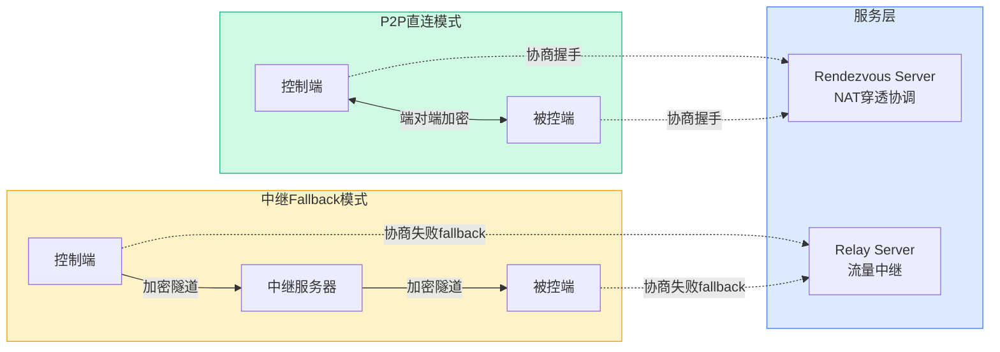
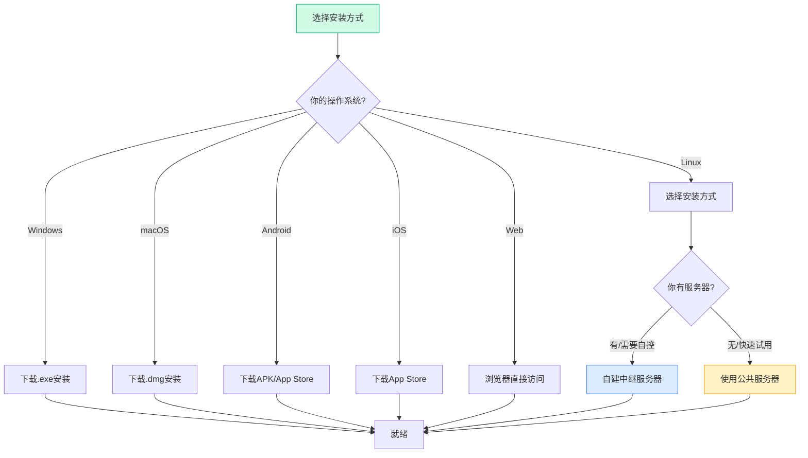
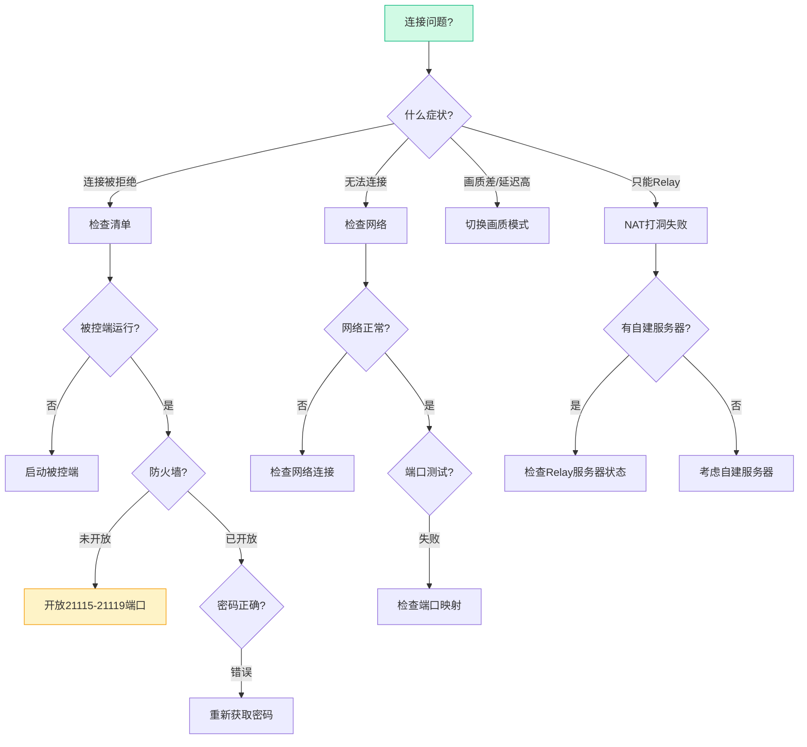

> **目标读者**：需要远程桌面解决方案的个人开发者、中小企业 IT 管理员、重视数据隐私的用户，以及对 Rust 语言在真实场景中应用感兴趣的开发者。
> **核心问题**：RustDesk 如何用 Rust 实现一个开箱即用的远程桌面应用？它的 P2P 直连和中继架构是怎么工作的？为什么先走 P2P 再降级到中继？如何自建服务器保证数据完全自主？
> **事实边界**：本文基于 `rustdesk/rustdesk` 与 `rustdesk/rustdesk-server` 公开仓库信息整理，涵盖 README、官方文档（rustdesk.com/docs）、GitHub API 与客户端源码，事实核实于 2026-09-15；涉及安全模型的描述以官方文档为准。

---

## 学习目标

读完本文后，你将能够：

- 解释 RustDesk 的 P2P 优先、中继兜底的架构设计背后的原因
- 描述一次完整远程会话的数据路径，包括 NAT 打洞失败时的降级行为
- 在 Linux 服务器上用 Docker Compose 部署完整的中继服务（hbbs + hbbr）
- 判断在什么网络环境下 P2P 直连会失败、连接会落到中继
- 针对企业内网、跨公网、高安全需求三种场景，给出合适的部署方案

---

## 阅读导航

- 只想快速安装跑起来 → 直接看 `§4 使用说明`
- 想理解 P2P 直连和中继架构背后的设计决策 → 重点看 `§2 架构设计`
- 想搭建自己的中继服务器 → 重点看 `§5 自托管部署`
- 想了解开发扩展方法 → 重点看 `§6 开发扩展`
- 想和其他远程桌面方案做对比 → 重点看 `§7 竞品对比`
- 想判断 RustDesk 是否适合你的场景 → 重点看 `§9 采用建议`

---

## §1 项目概述

### 1.1 解决的核心问题

远程桌面软件面临一个根本矛盾：**便利性**和**数据自主性**不可兼得。

| 方案类型 | 代表产品 | 便利性 | 数据自主性 |
|---------|---------|---------|------------|
| 商业闭源 | TeamViewer, AnyDesk | 高（开箱即用） | 低（数据经第三方服务器） |
| 传统开源 | VNC, RDP | 低（配置繁琐） | 高（完全自主） |

RustDesk 的解决思路是：**用 P2P 优先的架构同时覆盖两端**。如果 P2P 直连能建立，数据完全不经过 RustDesk 的服务器；如果打洞失败，自动降级到中继转发，但中继服务器是你自己可以部署的。

### 1.2 为什么用 Rust 重写

RustDesk 选择 Rust 并非为了「技术时髦」，而是有几个实际原因：

- **无 GC 暂停**：远程桌面的屏幕编码和传输对延迟敏感，GC 暂停会导致画面卡顿。Rust 的所有权模型在编译期就消除了这个问题。
- **内存安全不加成本**：C/C++ 的话，内存安全漏洞是远程桌面软件的攻击面（想想看：屏幕数据、键鼠事件都是敏感信息）。Rust 在编译期保证内存安全，运行时零开销。
- **跨平台编译友好**：一套代码编译到 Windows/macOS/Linux/Android/iOS，Flutter 负责 UI，Rust 负责核心逻辑。

### 1.3 核心数据

| 指标 | 数值 |
|------|------|
| GitHub Stars | 123,000+（2026-09 经 GitHub API 核实） |
| 主语言 | Rust（核心）+ Dart（Flutter UI） |
| 协议 | AGPL-3.0（客户端与服务端均为） |
| 最新版本 | 1.4.9（2026-07 发布，官方持续发版） |

---

## §2 架构设计

### 2.1 整体架构：为什么是两条路径

RustDesk 内部跑着两条并行的连接路径，这个设计背后有一个关键判断：**大多数情况下 P2P 能成功，但总有失败的情况**。

如果只做 P2P，用户体验会被网络环境卡住（企业防火墙、对称 NAT 等场景直接不可用）。如果只做中继，又失去了数据自主性的卖点。

所以 RustDesk 的做法是：**先试 P2P，失败了再走中继**。对用户来说是一个操作，对架构来说是两套机制。


```mermaid
flowchart LR
    subgraph P2P[P2P直连模式]
        A[控制端] <-->|端对端加密| B[被控端]
    end

    subgraph Relay[中继Fallback模式]
        C[控制端] -->|加密隧道| R[中继服务器]
        R -->|加密隧道| D[被控端]
    end

    subgraph Server[服务层]
        RV[ Rendezvous Server<br/>NAT穿透协调]
        REL[Relay Server<br/>流量中继]
    end

    A -.->|协商握手| RV
    B -.->|协商握手| RV
    C -.->|协商失败fallback| REL
    D -.->|协商失败fallback| REL

    style P2P fill:#d1fae5,stroke:#10b981
    style Relay fill:#fef3c7,stroke:#f59e0b
    style Server fill:#dbeafe,stroke:#3b82f6
```

### 2.2 一次远程会话的完整数据路径

假设你从公司电脑（控制端 A）远程连回家里的台式机（被控端 B），完整流程是：

**阶段 1：设备上线**

A 和 B 各自启动 RustDesk，向 Rendezvous Server 注册自己的公网 IP 和端口。此时 Server 只知道「有两个设备在线」，还没有任何屏幕数据流经它。

**阶段 2：发起连接**

A 输入 B 的 ID 和密码，向 Rendezvous Server 请求与 B 建立连接。

**阶段 3：NAT 打洞协商**

Server 把 A 和 B 的公网地址分别发给对方。A 和 B 同时向对方地址发送 UDP 打洞包，试探 NAT 是否允许直连。

UDP 打洞能工作的前提，是多数 NAT 的行为规则：允许已向外部发过包的地址发回数据。A 向 B 的公网地址发一个 UDP 包后，A 的 NAT 就记下了「A 正在与 B 通信」，B 发来的包随后会被放行。

**阶段 4：路径分叉**

- **打洞成功** → A 和 B 之间建立 P2P 加密通道，屏幕数据、键鼠事件、剪贴板全部直接从 A 到 B，不经过任何服务器。
- **打洞失败**（比如公司防火墙做了对称 NAT 或禁止 UDP 出站）→ 数据改走 Relay Server（hbbr）转发。A 和 B 各自与 Relay 建立连接，Relay 在中间转发加密流量，本身不接触明文。

**阶段 5：会话维持**

连接建立后，A 看到的屏幕画面由 B 端实时编码（软件编码走 VP8/VP9/AV1，支持硬件加速时用 H264/H265），沿已建立的通道推送到 A 端解码显示；键鼠操作反向传递。

**关键点**：Rendezvous Server 只管设备发现和打洞协商，不碰屏幕数据。中继只在 P2P 失败时介入。如果你自建了中继服务器，整个链路里没有任何第三方能访问你的屏幕数据。

### 2.3 P2P 直连的边界条件

不是所有网络环境都能 P2P 直连，决定性因素是 NAT 类型——两端各自允不允许外部 UDP 包进来：

| NAT 类型 | 典型场景 | 打洞可行性 |
|---------|----------|------------|
| 完全锥型（Full Cone） | 部分家庭宽带 | 任意来源的回包都放行，最容易打通 |
| 限制锥型（Restricted Cone） | 多数家庭宽带、运营商级 NAT | 可以打洞，需要两端配合发包 |
| 对称型（Symmetric） | 部分企业网络 | 对每个目的地映射不同端口，对端无法预知，基本打不通 |
| 禁止 UDP 出站 | 严格的企业防火墙 | UDP 打洞完全不可行，只能走 TCP 中继 |

对称 NAT 后面的设备（常见于某些企业网络）P2P 直连基本无望，此时中继不是「降级」而是「唯一路径」。想确认出口网络的 NAT 类型，可以用 `stunclient` 之类的 STUN 客户端独立测试。

### 2.4 技术栈选型的原因

| 组件 | 技术选型 | 为什么选它 |
|------|---------|------------|
| 核心 | Rust | 无 GC、内存安全、高性能，适合实时屏幕编码和传输 |
| GUI | Flutter/Dart | 一套代码覆盖所有平台，包括移动端 |
| 视频编解码 | libvpx/libaom（软件 VP8/VP9/AV1）+ 硬件 H264/H265；libyuv 做像素格式转换 | VP8/VP9 兼容性好，AV1 压缩率高但编码较重，H264/H265 走硬件加速以降低功耗 |
| 音频 | Opus | 低延迟，适合实时语音 |
| 网络 | tokio | Rust 生态最成熟的异步 IO 框架 |
| 加密 | libsodium（NaCl） | Curve25519 密钥交换 + secretbox（XSalsa20-Poly1305），端到端加密 |

**加密怎么落地：**

会话密钥由两台客户端直接协商，不经过服务器。RustDesk 基于 NaCl 加密库实现：Curve25519 做密钥交换，secretbox（XSalsa20-Poly1305）加密会话数据，Ed25519 负责签名。这套组合在桌面端和移动端都靠软件实现，不依赖特定硬件的 AES 加速，因此能从 x86 覆盖到 ARM 设备。

### 2.5 安全架构


```mermaid
flowchart TB
    subgraph 客户端[会话密钥由两端协商]
        A[控制端] <-->|Curve25519 密钥交换| B[被控端]
    end

    subgraph 中继[中继只转发密文]
        R[Relay Server / hbbr]
        A2[控制端] -->|加密后的会话数据| R
        R -->|加密后的会话数据| B2[被控端]
    end

    style 客户端 fill:#d1fae5,stroke:#10b981
    style 中继 fill:#dbeafe,stroke:#3b82f6
```

**一条会话从头到尾都是端到端加密的：**

1. 连接建立时，控制端和被控端直接用 Curve25519 交换密钥并协商出会话密钥，这一环节不经过服务器。
2. 后续的屏幕画面、键鼠、剪贴板、文件数据全部用这颗会话密钥加密。
3. 无论走 P2P 直连还是中继转发，中继服务器（hbbr）都只转发密文，不落盘、不解密，看不到会话内容。

**一个常见误解是中继模式会让数据变回明文。**实际上 hbbr 是中继节点，不是 TLS 终止点；会话密钥只存在于两台客户端之间，即便某台中继服务器被攻破，攻击者拿到的也只是密文流。

**真正值得谨慎的边界：**

端到端加密保护的是会话内容，但服务器仍能看到一部分元数据——控制端请求了哪个被控端的 ID、双方在何时通过中继建立连接。对绝大多数场景这不是问题；若你的合规要求连连接关系都不能外泄，就自建 hbbs/hbbr，把协商与转发都收回到自己控制的机器上。

---

## §3 功能详解

### 3.1 远程控制核心功能

- 键盘鼠标完全控制（包括组合键、快捷键）
- 文件传输（拖拽或内置文件管理器，支持断点续传）
- 剪贴板双向同步（文字、图片，需要相应权限）
- 文字聊天（会话中发送文字消息）
- 音频传输（可选开启，需要被控端授权）

### 3.2 画质与性能的权衡

RustDesk 支持多种画质模式，背后是编码器参数和帧率的调整。选择不是「越高越好」，而是看你的网络和任务：

| 模式 | 帧率优先级 | 清晰度优先级 | 适合场景 |
|------|------------|------------|---------|
| 自动 | 自适应 | 自适应 | 大多数情况，让编码器自己判断 |
| 游戏 | 高 | 中 | 需要低延迟交互，能接受画质损失 |
| 视频 | 中 | 中 | 平衡，适合看视频或做图形操作 |
| 文字 | 低 | 高 | 远程办公、代码编辑，清晰度优先 |

**为什么没有「最高画质」模式？**

远程桌面的带宽和延迟是零和博弈。把画质拉到最高，帧率就会下降，操作延迟感会增强。RustDesk 的设计选择是：让用户根据任务选择，而不是提供一个模糊的「高质量」选项。

### 3.3 平台支持现状

| 平台 | 状态 | 安装方式 | 已知限制 |
|------|------|---------|---------|
| Windows | 稳定 | exe 安装包 / Scoop | 无 |
| macOS | 稳定 | dmg 安装包 / Homebrew | 需要辅助功能权限 |
| Linux | 稳定 | AppImage/deb/Flatpak | Wayland 下可能需要额外配置 |
| Android | 稳定 | Google Play / F-Droid / APK | 部分设备需要 root 才能完整控制 |
| iOS | 稳定 | App Store | 只能控制别人，不能被别人控制（iOS 限制） |
| Web | Beta | 浏览器直接访问 | 功能受限，性能不如原生客户端 |

---

## §4 使用说明

### 4.1 安装决策树


```mermaid
flowchart TD
    START["选择安装方式"] --> Q1{你的操作系统?}
    Q1 -->|Windows| WIN[下载.exe安装]
    Q1 -->|macOS| MAC[下载.dmg安装]
    Q1 -->|Linux| LINUX["选择安装方式"]
    Q1 -->|Android| ANDROID[下载APK/App Store]
    Q1 -->|iOS| IOS[下载App Store]
    Q1 -->|Web| WEB[浏览器直接访问]

    LINUX --> L1{你有服务器?}
    L1 -->|有/需要自控| SELF["自建中继服务器"]
    L1 -->|无/快速试用| PUB["使用公共服务器"]

    WIN & MAC & ANDROID & IOS & WEB --> DONE["就绪"]
    SELF & PUB --> DONE

    style START fill:#d1fae5,stroke:#10b981
    style SELF fill:#dbeafe,stroke:#3b82f6
    style PUB fill:#fef3c7,stroke:#f59e0b
```

### 4.2 快速开始（30 秒上手）

**步骤 1：下载安装**

访问 [RustDesk Releases](https://github.com/rustdesk/rustdesk/releases) 下载对应平台安装包，或：

```bash
# Linux (AppImage)，版本号以 Releases 页实际资产名为准（撰写时最新为 1.4.9）
wget https://github.com/rustdesk/rustdesk/releases/download/1.4.9/rustdesk-1.4.9-x86_64.AppImage
chmod +x rustdesk-1.4.9-x86_64.AppImage
./rustdesk-1.4.9-x86_64.AppImage

# macOS (Homebrew)
brew install --cask rustdesk

# Windows (Scoop)
scoop install rustdesk
```

**步骤 2：获取 ID 和密码**

安装后启动 RustDesk，界面显示你的 ID 和临时密码：

```
┌─────────────────────────────┐
│  RustDesk                   │
│                             │
│  ID: 123-456-789           │
│  Password: abcd1234         │
│                             │
│  [我的 ID] [变更密码]       │
└─────────────────────────────┘
```

**步骤 3：发起连接**

在控制端输入被控端的 ID，点击连接，输入被控端显示的密码（或让对方临时授权）。

### 4.3 自建服务器：完整步骤

自建只需要一台有公网 IP 的服务器。hbbs/hbbr 本身非常轻量，1 核 1GB 就能跑，生产环境建议 2 核 2GB 起，把余量留给系统和带宽。

**为什么需要两台服务？**

Rendezvous Server（hbbs）和 Relay Server（hbbr）职责不同：
- hbbs 只做设备发现和 NAT 打洞协调，流量极小，1 核 CPU 就够
- hbbr 转发实际的屏幕和键鼠数据，需要按并发会话数估算带宽

**使用 Docker Compose 部署（推荐）**

```bash
# 克隆服务器仓库
git clone https://github.com/rustdesk/rustdesk-server.git
cd rustdesk-server

# 启动服务
docker-compose up -d
```

启动后，hbbs 会在 `./data` 目录下生成密钥对（`id_ed25519.pub` 和私钥）。**把公钥内容记录下来**，客户端需要它来确认连接的是你的服务器而不是冒充者。

**客户端配置**

配置方式有两种：日常最省事的是在客户端「设置 → 网络」里填 ID Server、Key（可选 Relay Server）；批量部署或需要脚本化时，再把同样的内容写进 `RustDesk2.toml` 的 `[options]` 段：

```toml
# Linux：~/.config/rustdesk/RustDesk2.toml
# Windows：C:\Users\<用户名>\AppData\Roaming\RustDesk\config\RustDesk2.toml
# 其他平台优先用界面配置；改文件前先退出客户端（含托盘进程），否则内存中的旧配置可能被回写覆盖
[options]
custom-rendezvous-server = 'your-server-ip:21116'
relay-server = 'your-server-ip:21117'
key = '你的公钥内容'
```

**验证部署**

```bash
# 检查容器状态
docker ps | grep rustdesk

# 查看日志
docker logs hbbs
docker logs hbbr

# 在客户端尝试连接，然后在服务器上查看中继日志
docker logs hbbr -f
```

### 4.4 故障排除决策树


```mermaid
flowchart TD
    START["连接问题?"] --> Q1{什么症状?}
    Q1 -->|连接被拒绝| REJECT["检查清单"]
    Q1 -->|只能Relay| RELAY["NAT打洞失败"]
    Q1 -->|画质差/延迟高| QUALITY["切换画质模式"]
    Q1 -->|无法连接| CONN["检查网络"]

    REJECT --> R1{被控端运行?}
    R1 -->|否| RUN["启动被控端"]
    R1 -->|是| R2{防火墙?}
    R2 -->|未开放| FW["开放21115-21119端口"]
    R2 -->|已开放| R3{密码正确?}
    R3 -->|错误| PWD["重新获取密码"]

    CONN --> C1{网络正常?}
    C1 -->|否| NET["检查网络连接"]
    C1 -->|是| C2{端口测试?}
    C2 -->|失败| PORTS["检查端口映射"]

    RELAY --> REL1{有自建服务器?}
    REL1 -->|是| REL2["检查Relay服务器状态"]
    REL1 -->|否| PUB["考虑自建服务器"]

    style START fill:#d1fae5,stroke:#10b981
    style FW fill:#fef3c7,stroke:#f59e0b
```

**端口检查命令：**

```bash
# 检查 RustDesk 端口是否可访问
nc -zv your-server-ip 21116
nc -zv your-server-ip 21117

# 测试 UDP 端口（打洞与心跳只用 21116）
nmap -sU -p 21116 your-server-ip

# 检查防火墙规则 (Ubuntu)：TCP 开 21115-21119，UDP 只需 21116
sudo ufw status
sudo ufw allow 21115:21119/tcp
sudo ufw allow 21116/udp
```

---

## §5 自托管部署详解

### 5.1 部署架构

| 服务 | 端口 | 协议 | 作用 | 流量特征 |
|------|------|------|------|------------|
| hbbs (Rendezvous) | 21116 (TCP+UDP) | 自定义 | 设备注册、NAT 类型检测、打洞协调 | 心跳与注册，KB 量级 |
| hbbr (Relay) | 21117 (TCP) | 自定义 | 中继转发加密流量，不解密 | 随会话编码码率走，典型 1-5 Mbps/会话（取决于分辨率与帧率） |

额外端口：
- 21115 (TCP)：NAT 类型测试
- 21118/21119 (TCP)：Web 客户端 WebSocket（不用 Web 客户端可以不开放）
- 21114 (TCP)：Pro 版 Web 控制台专用，OSS 部署用不到

### 5.2 生产环境部署建议

**网络层面：**

- 确保服务器的 21116-21119 端口对公网开放（TCP 和 UDP）
- 如果服务器在国内，注意某些运营商会限制 UDP 流量，此时需要开启 TCP 中继备选

**安全层面：**

- 服务器首次启动时会生成密钥对（`id_ed25519` 与 `id_ed25519.pub`）。要让客户端只接受你的服务器，必须把公钥内容填入每个客户端的 Key 配置；缺失这一步，客户端就无法校验服务器身份。
- 若对外暴露 21118/21119（Web 客户端 WebSocket），官方文档提醒：启用 WebSocket 时服务端会信任 `X-Real-IP` / `X-Forwarded-For` 头，该头可被伪造；建议只经反向代理暴露这两个端口，用不到就直接关闭。
- 定期更新 rustdesk-server 镜像（`docker pull rustdesk/rustdesk-server:latest` 后重启），并跟踪 GitHub 发布说明。

**监控：**

```bash
# OSS 版服务端没有内置指标面板，活动情况直接看容器日志
docker logs -f hbbr

# 监控带宽使用
iftop -i eth0  # Linux
```

### 5.3 部署验收清单

对照下面的检查项逐个验证，全部通过再对外提供服务：

- 服务器公网可访问：`nc -zv your-server-ip 21116` 有回应，UDP 端口用 `nmap -sU -p 21115-21119` 复查。
- 服务都在监听：`ss -tlnp | grep -E '21115|21116|21117|21118|21119'` 看得到 hbbs 与 hbbr。
- 密钥已生成并分发：`data/id_ed25519.pub` 存在，且沿用到每台客户端。
- 客户端已指向你的服务器：控制端与被控端都在设置里填了同一套 ID Server / Key。
- 端到端可连：从外网客户端发起连接，画面与键鼠正常；在 hbbs 日志里能看到"打洞成功"或"走中继"的路径标记。
- 直连失败可降级：临时断开其中一端所在网络的 P2P 通道，确认连接能自动落到 hbbr 中继。

---

## §6 开发扩展

### 6.1 编译开发环境

```bash
# 安装 Rust（如果还没有）
curl --proto '=https' --tlsv1.2 -sSf https://sh.rustup.rs | sh

# Ubuntu/Debian 依赖
sudo apt install -y zip g++ gcc git curl wget nasm yasm \
  libgtk-3-dev clang libxcb-randr0-dev libxdo-dev \
  libxfixes-dev libxcb-shape0-dev libxcb-xfixes0-dev \
  libasound2-dev libpulse-dev cmake make \
  libclang-dev ninja-build libgstreamer1.0-dev \
  libgstreamer-plugins-base1.0-dev

# 克隆并构建
git clone https://github.com/rustdesk/rustdesk.git
cd rustdesk

# 开发模式运行（更快的编译，但运行慢）
cargo run

# 发布模式构建（编译慢，但运行快）
cargo build --release
```

### 6.2 代码架构概览

如果你想扩展 RustDesk，需要了解核心模块的职责：

```
rustdesk/
├── src/                        # 核心 Rust 逻辑
│   ├── client.rs               # 控制端会话实现
│   ├── server.rs               # 被控端服务（屏幕捕获、输入注入、文件服务）
│   ├── rendezvous_mediator.rs  # 与 hbbs 的注册、心跳与打洞协商
│   ├── platform/               # 平台相关代码（Windows/macOS/Linux 等）
│   └── ipc/                    # 进程间通信
├── flutter/                    # Flutter UI（Dart）
└── libs/
    ├── hbb_common/             # 公共库：protobuf 消息、NaCl 加密封装、网络（git 子模块）
    ├── scrap/                  # 屏幕采集
    └── enigo/                  # 键鼠输入模拟
```

服务端是独立的 `rustdesk-server` 仓库，不在客户端代码树里。

### 6.3 常见问题与解决

| 问题 | 原因 | 解决方案 |
|------|------|---------|
| 编译失败：`linker not found` | 缺少 C/C++ 编译器和系统库 | 安装 `build-essential`（Ubuntu）或 Xcode Command Line Tools（macOS） |
| 运行时：`permission denied` | Linux 下需要访问输入设备 | 以 root 运行，或配置 udev 规则 |
| macOS：`accessibility permission denied` | 需要辅助功能权限 | 系统设置 → 隐私与安全 → 辅助功能 → 添加 RustDesk |
| Windows：`防火墙阻止` | 首次运行需要网络权限 | 允许 RustDesk 通过防火墙 |

---

## §7 竞品对比

### 7.1 性能对比的边界

远程桌面没有权威的跨方案公开基准：各家官方文档都不发布延迟与带宽数字，社区测试大多不控制变量——分辨率、帧率、编码器、直连还是中继、网络路径，任何一个不同都会让数字失去可比性。所以本节只做定性对比；要为自己的链路做选型，最可靠的办法是按下面的方法实测一轮。

| 方案 | 设计重心 | 编码方案 | 自托管 | 端到端加密 | 授权模式 |
|------|---------|----------|--------|------------|----------|
| **RustDesk** | 远程办公与运维，自托管优先 | VP8/VP9/AV1 软编 + H264/H265 硬编 | ✅ | ✅ | 开源（AGPL-3.0） |
| TeamViewer | 企业远程支持，功能全面 | 自研，未公开细节 | ❌ | ✅ | 商业订阅 |
| AnyDesk | 低带宽场景的流畅性 | 自研 DeskRT，未公开细节 | ❌ | ✅ | 商业订阅 |
| VNC 系列 | 协议简单、实现广泛 | 依实现而定（Raw、Tight 等） | ✅ | ⚠️ 依实现，通常需额外配置 | 开源（各实现不同） |
| Parsec | 游戏与低延迟串流 | 硬件编码优先（H264/H265） | ❌ | ✅ | 免费 + 商业混合 |

**如果要自己测，怎么测、怎么解读：**

- 先固定变量再比较：同一对设备、同一分辨率与帧率、同一编码器，直连和中继分开测。混在一起的数字没有意义。
- 把编码延迟和传输延迟分开看：前者取决于编码器与两端机器性能，后者取决于链路（是否中继、中继服务器位置）。RustDesk 这两段的实现都是公开可见的，TeamViewer/AnyDesk 是黑盒。
- 不能推出的结论：Parsec 为低延迟而生，不代表它是办公场景的综合最优——为压延迟它付出了更高的带宽开销；VNC 在低带宽链路上可能反而流畅，因为它主动降低了画质与帧率，代价是清晰度。

### 7.2 功能对比

| 功能 | RustDesk | TeamViewer | AnyDesk | VNC | Parsec |
|------|-----------|------------|---------|-----|-------|
| 自托管 | ✅ | ❌ | ❌ | ✅ | ❌ |
| 端到端加密 | ✅（直连与中继均端到端） | ✅ | ✅ | ⚠️（VNC 需自行配置） | ✅ |
| 跨平台 | ✅（全平台） | ✅（全平台） | ✅（全平台） | ✅（全平台） | ⚠️（无 Linux 客户端） |
| 文件传输 | ✅ | ✅ | ✅ | ⚠️（需额外配置） | ✅ |
| 移动端被控 | ⚠️（iOS 不支持） | ✅ | ✅ | ⚠️（取决于 VNC 服务器） | ❌ |
| 开源 | ✅（AGPL-3.0） | ❌ | ❌ | ✅（取决于实现） | ❌ |

---

## §8 自测练习

完成以下练习，检验你的理解程度：

1. **架构分析**：画出直连和中继两条数据路径，在每个环节标注加密状态。解释为何即使流量经过 hbbr，中继也拿不到会话明文。

2. **NAT 类型实验**：用自己的两台设备（比如笔记本和手机）在不同网络下尝试 RustDesk 连接，通过 `hbbs` 的日志判断 NAT 类型和打洞是否成功。

3. **安全配置审计**：在一台自建的 RustDesk 服务器上，检查是否有以下隐患：(a) 端口全部对公网开放却无访问限制，(b) 客户端没有配置服务器的公钥（`id_ed25519.pub`），可能连上伪造的服务器，(c) 服务端与客户端长期未升级。

4. **性能调优实验**：在同一个网络环境下，分别用「自动」「游戏」「文字」三种画质模式做远程操作，记录操作延迟和带宽占用，验证编码参数变化的影响。

---

## §9 采用建议

RustDesk 在不同场景下的适用度差异很大，下面是按使用场景给出的具体建议：

### 9.1 个人用户 / 自由职业者

**建议**：直接下载公共服务器版本即可。如果对隐私有要求，花 30 分钟在一台低配轻量云服务器上跑 Docker Compose 自建，成本就是这台服务器的月租。

自建后延迟和公共服务器基本一致（如果服务器在国内），但数据不再经过 RustDesk 官方基础设施。对于大多数个人用户来说，这个代价是值得的。

### 9.2 中小企业 IT 团队

**建议**：自建服务器几乎是必选项。

原因：
- 企业内网环境下，P2P 直连成功率远高于跨公网场景（因为企业内网设备通常在同一个 NAT 后面），实际体验可以接近局域网 VNC 的延迟水平。
- 合规要求：某些行业的 IT 审计会要求远程访问日志和访问控制，自建服务器可以记录这些信息。
- 成本：hbbs/hbbr 本身对 CPU 和内存的要求很低，瓶颈在中继带宽；一台低配云服务器足以支撑一个小团队的并发会话，扩容优先加带宽而不是加配置。

**注意**：RustDesk 的会话在直连和中继两种模式下都是端到端加密的，中继不接触明文。真正需要评估的是「连接关系」这类元数据是否允许外泄。若某台设备的合规要求连控制端与被控端之间的映射关系都不能让第三方知道，就应自建 hbbs/hbbr，并让所有客户端只连你自己的服务器。

### 9.3 看重安全的团队

端到端加密在直连和中继两种模式下都成立，安全评估真正要回答的是：你信任让谁当协商与转发的中介，它能观测到什么。

如果安全需求高，按下面的顺序做：

1. 自建 hbbs/hbbr，把公钥（`id_ed25519.pub`）配置进每个客户端，让客户端只认你自己的服务器，从而抵御伪造服务器与中间人攻击。
2. 用防火墙规则限制各端口来源，去掉不需要对外开放的端口（比如只开放 21115-21119 中的必需项）。
3. 只允许本企业授权的设备接入，必要时结合网络层准入控制。
4. 关注官方发布的安全公告与 CVE，及时升级客户端和服务端。

### 9.4 需要游戏/高清场景的团队

Parsec 在编码效率和延迟上仍然有明显优势，RustDesk 不适合作为游戏串流主力。但如果你的场景是「偶尔需要在远程桌面里看视频或做简单的图形操作」，RustDesk 的「视频」画质模式足够覆盖。

### 9.5 不急着用 RustDesk 的情况

- 已有 TeamViewer/AnyDesk 企业授权且无自托管需求的团队，迁移成本高于收益（主要是用户习惯和配置迁移）。
- 纯内网环境且不需要跨平台的场景，VNC 更轻量（但没有移动端支持）。
- 需要按用户/用户组授权的细粒度权限体系（谁能连哪台机器、只读还是可控）的合规场景：开源版只有设备级的权限开关（键盘、鼠标、剪贴板、文件传输），面向组织的访问控制与审计在商业版 Pro 的 Web 控制台里。选型时把这条算进成本。

---

## §10 进阶：RustDesk 背后的技术债务

如果你对 RustDesk 的代码库感兴趣，有几个值得注意的技术决策：

**为什么软件编码用 VP8/VP9/AV1，硬件加速才用 H264/H265？**

VP8、VP9、AV1 都是免专利授权费的开源编码标准，作为软件编码默认项没有授权风险；H264/H265 的专利授权更复杂，RustDesk 只在需要硬件加速时启用，把编码负担交给 GPU/专用硬件。

**Flutter 的取舍**

Flutter 让 RustDesk 能用一套代码覆盖所有平台，但代价是包体积较大（包含了整个 Flutter 运行时），以及某些平台特定功能的访问需要先写平台通道（platform channel）。

**中继协议的自定义设计**

RustDesk 没有用标准的 WebRTC 做 P2P 和中继，而是自己实现了一套协议。好处是不依赖 WebRTC 那套复杂依赖栈，能更灵活地控制降级逻辑；坏处是不能复用 WebRTC 生态里的工具和库。

---

## §11 常见问题

**为什么连接时说"ID 服务器不可用"？**

要么客户端设置的 ID Server 地址填错，要么服务器的 21116 端口（TCP/UDP）没对公网开放。先在服务器上用 `nc -zv` 与 `nmap -sU` 自测，再检查客户端网络设置里的 ID Server 与 Key 是否一致。

**连接总是走到中继，P2P 打洞不成功，正常吗？**

正常。这通常是因为你的网络是对称 NAT，或运营商禁了 UDP。连接能建立就说明中继工作正常；若想提高 P2P 成功率，可以检查被控端所在网络是否开启了全锥型 NAT，或咨询运营商 UDP 策略。

**被控端画面卡顿，先调哪里？**

先看是网络问题还是编码问题：局域网内同样卡，多半是画质模式或编码器导致，切换到「自动」或调低清晰度；仅跨公网时卡，则看延迟与丢包，优先排查中继服务器带宽和客户端两端带宽。

**iOS 设备能当被控端吗？**

不能。受 iOS 系统限制，RustDesk 的 iOS 客户端只能作为控制端去连别人，不能反向被别人控制。

**用官方公共服务器安全吗？**

会话内容仍端到端加密，官方服务器接触不到明文，但它能看到设备 ID 与连接关系这两类元数据。介意这点就自建服务器，把数据与连接关系都收回到自己手里。

**把服务器公钥丢了/换了会怎样？**

换公钥等同换服务器身份。客户端若还填旧 Key，将无法连接或提示不匹配，需要把所有客户端更新为新的公钥。生产环境务必备份 `id_ed25519` / `id_ed25519.pub`。

---

## §12 术语表与维护指引

### 术语表

| 术语 | 中文 | 说明 |
|------|------|------|
| Rendezvous Server / hbbs | 会合服务器 | 设备注册、NAT 类型检测与打洞协调，不承载会话数据 |
| Relay Server / hbbr | 中继服务器 | P2P 失败时的转发节点，只转发密文 |
| NAT | 网络地址转换 | 决定能否被外部直连的关键网络结构 |
| P2P | 点对点 | 两台客户端直接建立加密通道，不经过服务器 |
| E2EE | 端到端加密 | 会话密钥只在两端协商，服务器不接触明文 |
| NaCl / libsodium | 加密库 | Curve25519 密钥交换 + secretbox 会话加密 |
| 打洞 | Hole Punching | 通过 UDP 试探让 NAT 放行直连的技术 |
| id_ed25519.pub | 服务器公钥 | 客户端用来校验服务器身份的凭证 |

### 维护指引

- 版本追溯：文中 Stars、版本、协议等随时间变化的数值，均以官方仓库当时状态为准；本文事实核实于 2026-09-15，涉及安全模型的描述以官方文档与源码为准。
- 术语管理：全文统一使用上表译名；遇到新术语，先查表，表中没有则保留原文并补一句中文释义。
- 修改提示：改端口、加密参数、编解码相关内容时，先对照官方自托管文档（rustdesk.com/docs）与客户端源码，避免与客户端默认配置冲突。

---

**参考资源：**

- 官方仓库：https://github.com/rustdesk/rustdesk
- 服务器仓库：https://github.com/rustdesk/rustdesk-server
- 官方文档 - 自托管：https://rustdesk.com/docs/zh-cn/self-host/
- 官方文档 - 客户端配置：https://rustdesk.com/docs/en/self-host/client-configuration/
- 官方文档：https://rustdesk.com/docs/
- NAT 穿透技术详解：https://tailscale.com/blog/how-nat-traversal-works

> **每日 GitHub 趋势榜自动分析 | 数据来源：GitHub Trending**
