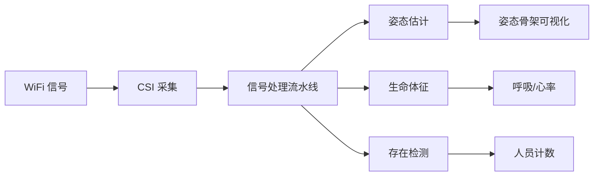
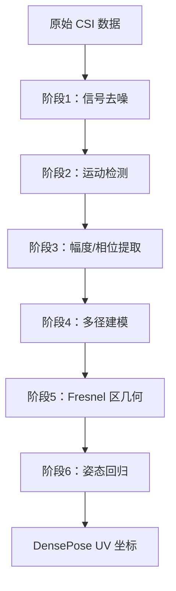

> **目标读者**：物联网工程师、AI 感知开发者、隐私计算研究者、边缘 AI 爱好者
> **前置知识**：了解 WiFi CSI 概念、有嵌入式开发或机器学习基础
> **预计学习时间**：1-2 小时（入门），4-6 小时（精通）
> **项目地址**：https://github.com/ruvnet/RuView

---

# RuView WiFi DensePose：从入门到精通 — 穿墙感知AI系统

## §1 学习目标

完成本文档后，你将掌握：

- ✅ 理解 RuView 的核心定位与差异化优势
- ✅ 掌握 WiFi DensePose 的工作原理
- ✅ 理解 CSI（信道状态信息）的信号处理流程
- ✅ 部署 ESP32 传感器节点或 Docker 环境
- ✅ 配置多节点 Mesh 网络
- ✅ 使用 Rust 信号处理流水线
- ✅ 训练自适应分类器
- ✅ 开发自定义边缘模块
- ✅ 集成到 Home Assistant 等现有系统

---

## §2 项目概述

### 2.1 什么是 RuView？

RuView（[ruvnet/RuView](https://github.com/ruvnet/RuView)）是**基于 WiFi 信号的人体感知系统**，通过分析环境中的 WiFi 信号实现穿墙感知人体姿态、呼吸、心率等功能。

**核心定位**：利用无处不在的 WiFi 信号，让普通空间获得新型空间感知能力。



### 2.2 核心数据

| 指标 | 数值 |
|------|------|
| GitHub Stars | **44.7k** |
| GitHub Forks | **6k** |
| 提交数 | **328+** |
| 许可证 | **MIT** |
| 测试用例 | **1300+** |
| 主要语言 | Rust 1.85+（DSP）、Python（ML） |

### 2.3 与传统感知方案的本质区别

| 维度 | 摄像头方案 | RuView |
|------|-----------|--------|
| **隐私** | 视频采集侵犯隐私 | 仅 WiFi 信号，无图像 |
| **光照** | 需要良好光照 | 完全黑暗环境可用 |
| **遮挡** | 无法穿墙 | 可穿墙、障碍物 |
| **成本** | 高清摄像头昂贵 | $1/节点 ESP32 |
| **功耗** | 持续录像耗电 | 低功耗边缘运行 |

---

## §3 原理分析

### 3.1 WiFi CSI（信道状态信息）

CSI 是 WiFi 物理层的细粒度信道信息，比 RSSI 更精确：

| 指标 | RSSI | **CSI** |
|------|------|---------|
| **精度** | 接收信号强度（dBm） | 子载波级别幅度+相位 |
| **分辨率** | 整数 | 复数（I/Q） |
| **信息量** | 单值 | 56 子载波 × 2 |
| **应用** | 粗略存在检测 | **姿态估计** |

**CSI 的物理意义**

当人体在 WiFi 信号传播路径上移动时，会引起信号的多径效应（Multipath Effect）。CSI 测量的是每个子载波的幅度和相位变化，这些变化包含了人体的位置和运动信息。

```
WiFi 发射器 → 直接路径 → WiFi 接收器
          ↘        ↗
            人体反射路径
          ↗        ↘
         次要反射路径
```

### 3.2 WiFi DensePose 原理

从 WiFi 信号重建人体姿态分为 6 个阶段：



### 3.3 呼吸心率监测原理

**呼吸监测**

- 呼吸频率范围：6-30 BPM（成人平静呼吸）
- 胸腔位移：约 1-12 mm
- 对应相位变化：极微小（微弧度量级）

**心率监测**

- 心率范围：40-120 BPM（成人）
- 心脏跳动引起的胸腔位移：约 0.1-1 mm

**算法核心**

```python
import numpy as np
from scipy.signal import butter, filtfilt

def extract_breathing(csi_data, sample_rate=1000):
    """从 CSI 数据中提取呼吸频率"""
    # 1. 提取相位
    phase = np.angle(csi_data)
    
    # 2. 去除载波相位偏移
    phase_unwrapped = np.unwrap(phase)
    
    # 3. 带通滤波（0.1-0.5 Hz 对应 6-30 BPM）
    b, a = butter(2, [0.1/30, 0.5/30], btype='band')
    breathing_signal = filtfilt(b, a, phase_unwrapped)
    
    # 4. FFT 计算呼吸频率
    freqs = np.fft.rfftfreq(len(breathing_signal), 1/sample_rate)
    power = np.abs(np.fft.rfft(breathing_signal))**2
    
    # 5. 找峰值频率
    peak_idx = np.argmax(power)
    breathing_rate = freqs[peak_idx] * 60  # 转换为 BPM
    return breathing_rate
```

### 3.4 自学习系统（RuVector）

RuView 内置自学习系统 RuVector，无需人工标注即可从原始 WiFi 数据中学习人体感知能力。

**核心思想**

传统方法需要大量标注数据（人体姿态的图像 + 对应的 CSI 数据），而 RuVector 通过**自监督学习**直接从 CSI 数据中提取有用的表示。

**技术方案**

```python
class RuVector:
    """
    RuView 的自学习向量记忆系统
    核心：对比学习（Contrastive Learning）+ 记忆增强
    """
    
    def __init__(self, embedding_dim=256):
        self.encoder = CSIEncoder(embedding_dim)
        self.memory = VectorMemory(capacity=10000)
        self.prototype_bank = PrototypeBank()
    
    def learn(self, csi_batch, labels=None):
        """
        从 CSI 数据中学习表示
        如果有标签（呼吸频率，心率等），使用监督学习
        如果没有标签，使用对比学习
        """
        embeddings = self.encoder(csi_batch)
        
        if labels is not None:
            # 监督学习
            loss = self.supervised_loss(embeddings, labels)
        else:
            # 对比自监督学习
            loss = self.contrastive_loss(embeddings)
        
        # 更新记忆
        self.memory.add(embeddings)
        return loss
    
    def retrieve(self, query):
        """从记忆中检索相似样本"""
        return self.memory.search(query, k=5)
```

---

## §4 架构分析

### 4.1 系统架构

```
┌─────────────────────────────────────────────────────────────┐
│                        RuView 系统                          │
├─────────────────────────────────────────────────────────────┤
│  感知层                                                      │
│  ┌─────────┐  ┌─────────┐  ┌─────────┐  ┌─────────┐    │
│  │ ESP32  │  │ ESP32   │  │  Pi 4   │  │  60GHz  │    │
│  │  CSI   │  │  mmWave │  │ CSI +   │  │  Radar  │    │
│  │ 采集器  │  │  雷达   │  │ 边缘推理 │  │ 高精度   │    │
│  └────┬────┘  └────┬────┘  └────┬────┘  └────┬────┘    │
│       └──────────────┬┴──────────────┘                    │
│                      ▼                                     │
│  通信层                                                      │
│  ┌─────────────────────────────────────────────┐          │
│  │           WebSocket / MQTT / HTTP             │          │
│  └─────────────────────────────────────────────┘          │
│                      ▼                                     │
│  处理层                                                      │
│  ┌─────────┐  ┌─────────┐  ┌─────────┐  ┌─────────┐   │
│  │ CSI    │  │ 姿态   │  │ 生命   │  │ 异常   │   │
│  │ 预处理  │  │ 估计   │  │ 体征   │  │ 检测   │   │
│  └─────────┘  └─────────┘  └─────────┘  └─────────┘   │
│                      ▼                                     │
│  应用层                                                      │
│  ┌─────────┐  ┌─────────┐  ┌─────────┐  ┌─────────┐    │
│  │ 医疗   │  │ 安防   │  │ 智能   │  │ 救灾   │    │
│  │ 监护   │  │ 监控   │  │ 家居   │  │ 现场   │    │
│  └─────────┘  └─────────┘  └─────────┘  └─────────┘    │
└─────────────────────────────────────────────────────────────┘
```

### 4.2 部署架构详解

```
┌─────────────────────────────────────────────────┐
│              RuView 部署架构                       │
├─────────────────────────────────────────────────┤
│  ┌─────────┐   ┌─────────┐   ┌─────────┐      │
│  │ ESP32-1 │   │ ESP32-2 │   │ ESP32-3 │      │
│  │  节点   │   │  节点   │   │  节点   │      │
│  └────┬────┘   └────┬────┘   └────┬────┘      │
│       │             │             │             │
│       └─────────────┼─────────────┘             │
│                     │                          │
│              ┌──────▼──────┐                   │
│              │  Mesh 网络  │                   │
│              │  (QUIC)    │                   │
│              └──────┬──────┘                   │
│                     │                          │
│              ┌──────▼──────┐                   │
│              │ 感知服务器  │                   │
│              │  (Rust)    │                   │
│              └──────┬──────┘                   │
│                     │                          │
│       ┌─────────────┼─────────────┐             │
│       │             │             │             │
│  ┌────▼────┐  ┌────▼────┐  ┌────▼────┐      │
│  │ Web UI  │  │ REST API │  │ MQTT   │      │
│  └─────────┘  └─────────┘  └─────────┘      │
└─────────────────────────────────────────────────┘
```

### 4.3 硬件选项

| 选项 | 硬件 | 成本 | CSI 能力 | 说明 |
|------|------|------|-----------|------|
| **ESP32 Mesh（推荐）** | 3-6x ESP32-S3 + 路由器 | ~$54 | ✅ 完整 | 姿态，呼吸、心跳、运动、存在 |
| **Research NIC** | Intel 5300 / Atheros AR9580 | ~$50-100 | ✅ 完整 | 3×3 MIMO，完整 CSI |
| **任意 WiFi 设备** | PC/手机 | $0 | ❌ 仅 RSSI | 粗略存在和运动检测 |

### 4.4 目录结构

```
RuView/
├── firmware/                    # ESP32-S3 固件
│   ├── esp32-csi-tool/        # CSI 采集工具
│   └── components/             # ESP-IDF 组件
├── rust-port/                  # Rust 重写版本
│   └── wifi-densepose-rs/      # Rust DSP 核心
│       ├── wifi-densepose-desktop/  # Tauri 桌面应用
│       └── wifi-densepose-cli/     # CLI 工具
├── mmwave/                     # 60GHz mmWave 雷达
├── ui/                         # Web 可视化界面
├── server/                     # Python FastAPI 服务
├── docs/                       # 文档（含 62 ADR）
├── examples/                   # 示例
│   └── medical/               # 医疗监护示例
├── tests/                      # 测试
└── docker/                     # Docker 配置
```

---

## §5 功能详解

### 5.1 关键参数

| 感知类型 | 信号处理 | 输出 | 性能 |
|----------|---------|------|------|
| **姿态估计** | CSI → DensePose UV | 骨架坐标 | **54K fps** (Rust) |
| **呼吸检测** | 0.1-0.5Hz 带通 → FFT | 6-30 BPM | 实时 |
| **心率检测** | 0.8-2.0Hz 带通 → FFT | 40-120 BPM | 实时 |
| **存在检测** | RSSI 方差 | <1ms 延迟 | <1ms |
| **穿墙感知** | Fresnel 区几何 | 深度达 5m | 实时 |

### 5.2 人体姿态估计

RuView 通过分析 WiFi CSI 数据的相位变化，实现 2D/3D 人体姿态估计：

**API 使用示例**

```python
import requests

# 获取当前姿态
response = requests.get("http://localhost:8000/api/v1/pose/latest")
pose_data = response.json()

print(f"检测到 {len(pose_data['persons'])} 人")
for person in pose_data['persons']:
    print(f"  ID: {person['id']}")
    print(f"  位置: ({person['x']:.2f}, {person['y']:.2f})")
    print(f"  骨架: {person['keypoints']}")
```

**WebSocket 实时订阅**

```python
import asyncio
import websockets
import json

async def subscribe_pose():
    uri = "ws://localhost:8000/ws/pose"
    async with websockets.connect(uri) as ws:
        await ws.send('{"action": "subscribe", "room": "living_room"}')
        
        async for message in ws:
            data = json.loads(message)
            if data['type'] == 'pose_update':
                print(f"姿态更新: {data['person_count']} 人")

asyncio.run(subscribe_pose())
```

### 5.3 生命体征监测

**呼吸监测**

```python
# 获取当前呼吸率
response = requests.get("http://localhost:8000/api/v1/vitals/breathing")
breathing_data = response.json()

print(f"呼吸率: {breathing_data['rate']:.1f} BPM")
print(f"呼吸幅度: {breathing_data['amplitude']:.2f} mm")
print(f"呼吸规律性: {breathing_data['regularity']:.1%}")
```

**心率监测**

```python
# 获取心率
response = requests.get("http://localhost:8000/api/v1/vitals/heart_rate")
hr_data = response.json()

print(f"心率: {hr_data['rate']:.1f} BPM")
print(f"心率变异性 (HRV): {hr_data['hrv']:.1f} ms")
```

### 5.4 穿墙感知

RuView 支持穿透非金属墙体进行感知：

**支持的场景**

| 墙体类型 | 最大穿透厚度 | 精度衰减 |
|---------|------------|---------|
| 木材/石膏板 | 30 cm | <10% |
| 玻璃 | 10 cm | <5% |
| 混凝土（钢筋较少）| 15 cm | <20% |
| 金属 | ❌ 不支持 | - |

**启用穿墙模式**

```python
# 配置穿墙感知
config = {
    "through_wall": {
        "enabled": True,
        "wall_type": "drywall",
        "thickness_cm": 15,
        "compensation": True
    }
}
requests.post("http://localhost:8000/api/v1/config/update", json=config)
```

### 5.5 多目标追踪

RuView 支持同时追踪多个目标：

```python
# 获取所有追踪目标
response = requests.get("http://localhost:8000/api/v1/tracking/all")
tracking_data = response.json()

print(f"当前追踪 {tracking_data['active_count']} / {tracking_data['max_count']} 个目标")

for target in tracking_data['targets']:
    print(f"\n目标 {target['id']}:")
    print(f"  轨迹长度: {len(target['trajectory'])} 点")
    print(f"  当前速度: {target['velocity']:.2f} m/s")
    print(f"  在场时长: {target['dwell_time']:.1f} 秒")
```

---

## §6 使用说明

### 6.1 Docker 快速部署（推荐）

```bash
# 拉取镜像
docker pull ruvnet/wifi-densepose:latest

# 启动服务
docker run -p 3000:3000 ruvnet/wifi-densepose:latest

# 打开浏览器访问
# http://localhost:3000
```

**使用 Docker Compose（开发环境）**

```bash
git clone https://github.com/ruvnet/RuView.git
cd RuView
docker-compose up -d
```

### 6.2 ESP32 固件烧录

```bash
# 克隆仓库
git clone https://github.com/ruvnet/RuView.git
cd RuView/firmware

# 配置 WiFi
idf.py menuconfig
# 设置 WiFi SSID 和密码

# 编译
idf.py build

# 烧录
idf.py flash monitor
```

### 6.3 信号处理验证（无需硬件）

```bash
# 使用确定性参考信号验证流水线
python v1/data/proof/verify.py
```

### 6.4 常用命令

```bash
# 查看服务状态
curl http://localhost:8000/api/v1/health

# 获取 CSI 统计
curl http://localhost:8000/api/v1/csi/stats

# 获取设备列表
curl http://localhost:8000/api/v1/devices

# 重启服务
docker-compose restart server
```

---

## §7 开发扩展

### 7.1 自定义信号处理器

RuView 的信号处理管道支持插件式扩展：

```rust
// my_processor.rs
use wifi_densepose_rs::prelude::*;

pub struct MyProcessor {
    threshold: f32,
}

impl Processor for MyProcessor {
    fn process(&self, csi: &CSIFrame) -> Result<ProcessingOutput> {
        let filtered = self.apply_filter(&csi.data);
        let peaks = self.detect_peaks(&filtered);
        
        Ok(ProcessingOutput {
            detections: peaks,
            metadata: ProcessingMetadata::new(),
        })
    }
}

// 注册处理器
register_processor!("my_processor", MyProcessor::new);
```

### 7.2 自适应分类器训练

```rust
use wifi_densepose_rs::ml::AdaptiveClassifier;

// 创建分类器
let mut classifier = AdaptiveClassifier::new(15);  // 15 特征

// 配置特征
classifier.set_features(vec![
    "amplitude_mean", "amplitude_std",
    "phase_jitter", "doppler_shift",
    "fresnel_zone_1", "fresnel_zone_2",
]);

// 记录训练数据
classifier.record("sitting", &csi_session_sitting)?;
classifier.record("walking", &csi_session_walking)?;
classifier.record("falling", &csi_session_falling)?;

// 训练模型
classifier.train()?;

// 推理
let activity = classifier.predict(&current_csi)?;
println!("检测到活动: {:?}", activity);
```

**特征工程**

| 特征类别 | 特征名称 | 说明 |
|----------|---------|------|
| **幅度统计** | amplitude_mean, amplitude_std | 信号强度变化 |
| **相位特征** | phase_jitter, phase_drift | 相位稳定性 |
| **多普勒** | doppler_shift | 运动速度 |
| **Fresnel 区** | fresnel_zone_1~6 | 区域能量分布 |

### 7.3 与 Home Assistant 集成

```yaml
# Home Assistant configuration.yaml
sensor:
  - platform: rest
    name: RuView Breathing Rate
    resource: http://localhost:8000/api/v1/vitals/breathing
    value_template: "{{ value_json.rate }}"
    unit_of_measurement: "BPM"
    scan_interval: 5

automation:
  - alias: "呼吸率异常告警"
    trigger:
      platform: numeric_state
      entity_id: sensor.ruview_breathing_rate
      above: 25
    action:
      service: notify.mobile_app
      data:
        message: "检测到呼吸率异常"
```

---

## §8 最佳实践

### 8.1 部署建议

| 场景 | 推荐配置 |
|------|---------|
| 家庭监护 | 2-3 节点 Mesh |
| 养老院 | 4-6 节点 + 边缘服务器 |
| 灾害救援 | 1-2 节点移动部署 |

### 8.2 信号优化

```bash
# 优化 WiFi 信道
# 5GHz 干扰较少，推荐使用

# 节点间距
# 建议 2-3 米均匀分布
```

### 8.3 安全配置

```bash
# 生成 Mesh 密钥
openssl rand -hex 32 > mesh_key.txt

# 配置环境变量
export RVF_MESH_KEY=$(cat mesh_key.txt)
```

### 8.4 QUIC Mesh 安全（ADR-032）

| 安全特性 | 说明 |
|----------|------|
| **端到端加密** | 所有节点间通信加密 |
| **篡改检测** | 信号完整性校验 |
| **重放攻击防护** | 时间戳验证 |
| **无缝重连** | 节点移动或离线后自动恢复 |

---

## §9 常见问题

### Q1：需要多少个节点？

| 场景 | 推荐节点数 | 覆盖范围 |
|------|-----------|----------|
| 单房间 | 1-2 | ~20㎡ |
| 大房间 | 3-4 | ~50㎡ |
| 全屋 | 6+ | 360° |

### Q2：隐私如何保障？

- ✅ 无摄像头，无图像采集
- ✅ 数据本地处理，不上传云
- ✅ 可完全离线运行
- ✅ 端到端 QUIC 加密

### Q3：精度如何？

| 指标 | 单节点 | 多节点 |
|------|--------|--------|
| 姿态精度 | ~10cm | <1cm（亚英寸） |
| 呼吸精度 | ±2 BPM | ±0.5 BPM |
| 心率精度 | ±5 BPM | ±2 BPM |

### Q4：可以同时监测多少人？

单 AP 配置下：**3-5 人**（依赖环境复杂度）

### Q5：支持哪些硬件平台？

已测试平台：ESP32-S3（官方推荐）、Raspberry Pi 4B、x86_64 服务器、NVIDIA Jetson（GPU 加速）、60GHz mmWave 雷达。

### Q6：数据如何存储和处理？

本地处理，所有数据在本地处理，不上传云端。存储位置：/data/ruview/ 目录。存储格式：SQLite + Parquet（高效压缩）。

---

## §10 总结

RuView 是 WiFi 感知领域的标杆项目：

| 优势 | 说明 |
|------|------|
| 🔒 **隐私保护** | 纯 WiFi 信号，无图像 |
| 🧱 **穿墙感知** | Fresnel 区几何建模 |
| 💓 **生命体征** | 无接触呼吸/心率检测 |
| 🤖 **自学习** | 无需标注数据 |
| ⚡ **高性能** | 54K fps (Rust) |
| 📡 **低成本** | $1/节点 ESP32 |
| 🔒 **安全** | QUIC Mesh 端到端加密 |

**下一步推荐**：

1. [Docker 快速部署](#61-docker-快速部署推荐）：使用 Docker 部署第一个实例
2. [信号处理](#五功能详解）：深入理解 CSI 处理流程
3. [ESP32 开发](#62-esp32-固件烧录）：搭建传感器节点
4. [自适应分类器](#72-自适应分类器训练）：训练自己的场景分类器

**链接资源**：

- GitHub 仓库：https://github.com/ruvnet/RuView
- 官方文档：https://ruvnet.github.io/RuView/
- Docker 镜像：`ruvnet/wifi-densepose:latest`
- 架构决策记录：62 ADR 在 `docs/adr/` 目录

---

*🦞 文档版本 2.0（合并版）| 撰写日期：2026-03-31 | 基于仓库 commit eb69444 (2026-03-30) | Stars: 44.7k ⭐*