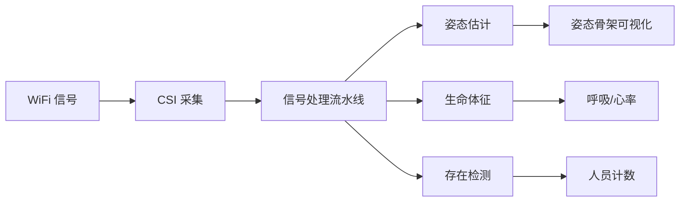
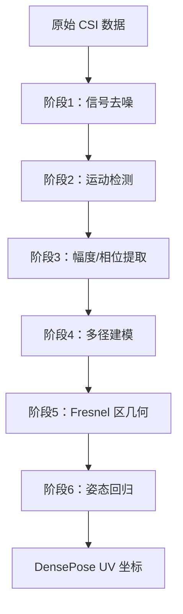

# RuView WiFi DensePose：从入门到精通 — 穿墙感知AI系统

> **目标读者**：物联网工程师、AI感知开发者、隐私计算研究者、边缘AI爱好者
> **前置知识**：了解 WiFi CSI 概念、有嵌入式开发或机器学习基础
> **预计学习时间**：1-2 小时（入门），4-6 小时（精通）

---

## 🎯 学习目标

完成本文档后，你将掌握：

- ✅ 理解 RuView 的核心定位与差异化优势
- ✅ 掌握 WiFi DensePose 的工作原理
- ✅ 理解 CSI（信道状态信息）的信号处理流程
- ✅ 部署 ESP32 传感器节点
- ✅ 配置多节点 Mesh 网络
- ✅ 使用 Rust 信号处理流水线
- ✅ 训练自适应分类器
- ✅ 开发自定义边缘模块
- ✅ 集成到现有系统

---

## 一、项目概述与背景

### 1.1 什么是 RuView？

RuView（[ruvnet/RuView](https://github.com/ruvnet/RuView)）是**基于 WiFi 信号的人体感知系统**，通过分析环境中的 WiFi 信号实现穿墙感知人体姿态、呼吸、心率等功能。

**核心定位**：利用无处不在的 WiFi 信号，让普通空间获得新型空间感知能力。



### 1.2 项目数据

| 指标 | 数值 |
|------|------|
| GitHub Stars | **44.7k** |
| GitHub Forks | **6k** |
| Commits | **328** |
| 许可证 | MIT |
| 测试用例 | **1300+** |

### 1.3 与传统感知方案的本质区别

| 维度 | 摄像头方案 | RuView |
|------|-----------|--------|
| **隐私** | 视频采集侵犯隐私 | 仅 WiFi 信号，无图像 |
| **光照** | 需要良好光照 | 完全黑暗环境可用 |
| **遮挡** | 无法穿墙 | 可穿墙、障碍物 |
| **成本** | 高清摄像头昂贵 | $1/节点 ESP32 |
| **功耗** | 持续录像耗电 | 低功耗边缘运行 |

---

## 二、核心技术原理解析

### 2.1 WiFi CSI（信道状态信息）

CSI 是 WiFi 物理层的细粒度信道信息，比 RSSI 更精确：

| 指标 | RSSI | CSI |
|------|-------|-----|
| **精度** | 接收信号强度（dBm） | 子载波级别幅度+相位 |
| **分辨率** | 整数 | 复数（I/Q） |
| **信息量** | 单值 | 56 子载波 × 2 |
| **应用** | 粗略存在检测 | 姿态估计 |

### 2.2 WiFi DensePose 原理

从 WiFi 信号重建人体姿态分为 6 个阶段：



### 2.3 关键参数

| 感知类型 | 信号处理 | 输出 | 性能 |
|----------|-----------|------|------|
| **姿态估计** | CSI → DensePose UV | 骨架坐标 | **54K fps** (Rust) |
| **呼吸检测** | 0.1-0.5Hz 带通 → FFT | 6-30 BPM | 实时 |
| **心率检测** | 0.8-2.0Hz 带通 → FFT | 40-120 BPM | 实时 |
| **存在检测** | RSSI 方差 | <1ms 延迟 | <1ms |
| **穿墙感知** | Fresnel 区几何 | 深度达 5m | 实时 |

---

## 三、硬件架构详解

### 3.1 硬件选项

| 选项 | 硬件 | 成本 | CSI 能力 | 说明 |
|------|------|------|-----------|------|
| **ESP32 Mesh（推荐）** | 3-6x ESP32-S3 + 路由器 | ~$54 | ✅ 完整 | 姿态、呼吸、心跳、运动、存在 |
| **Research NIC** | Intel 5300 / Atheros AR9580 | ~$50-100 | ✅ 完整 | 3×3 MIMO，完整 CSI |
| **任意 WiFi 设备** | PC/手机 | $0 | ❌ 仅 RSSI | 粗略存在和运动检测 |

### 3.2 ESP32-S3 节点配置

```
ESP32-S3 规格：
├── WiFi：802.11n 2.4GHz
├── 内存：8MB PSRAM
├── 存储：4MB Flash
├── 特性：双核 240MHz，CSI 支持
└── 功耗：~240mA @ 5V
```

### 3.3 多节点 Mesh 网络

多节点配置可实现 360° 全覆盖：

| 节点数 | 信号路径 | 空间覆盖 | 精度 |
|--------|----------|-----------|------|
| 1 节点 | 2 | ~120° | 中等 |
| 3 节点 | 6 | ~240° | 高 |
| 6 节点 | 12+ | 360° | 亚英寸级 |

---

## 四、快速开始

### 4.1 Docker 快速部署（无需工具链）

```bash
# 拉取镜像
docker pull ruvnet/wifi-densepose:latest

# 启动服务
docker run -p 3000:3000 ruvnet/wifi-densepose:latest

# 打开浏览器
# 访问 http://localhost:3000
```

### 4.2 ESP32 固件烧录

```bash
# 克隆仓库
git clone https://github.com/ruvnet/RuView.git
cd RuView/firmware

# 配置 WiFi
idf.py menuconfig
# 设置 WiFi SSID 和密码

# 编译
idf.py build

# 烧录
esptool.py -p /dev/ttyUSB0 write_flash 0x1000 bootloader.bin 0x8000 partitions.bin 0x10000 wifi_densepose.bin
```

### 4.3 信号处理验证（无需硬件）

```bash
# 使用确定性参考信号验证流水线
python v1/data/proof/verify.py
```

---

## 五、信号处理流水线详解

### 5.1 六阶段处理流程

| 阶段 | 功能 | 算法 |
|------|------|------|
| 1 | 信号去噪 | 带通滤波 + 小波变换 |
| 2 | 运动检测 | 滑动窗口方差 |
| 3 | 幅度/相位提取 | 复数解调 |
| 4 | 多径建模 | Fresnel 区几何 |
| 5 | 环境建模 | 背景减除 |
| 6 | 姿态回归 | 神经网络 |

### 5.2 Rust 信号处理代码示例

```rust
use wifi_densepose::{csi::CSIData, pose::PoseEstimator};

fn process_csi(csi: &CSIData) -> Result<PoseResult, Error> {
    // 阶段1：去噪
    let denoised = csi.apply_bandpass(0.1, 50.0)?;
    
    // 阶段2：运动检测
    let motion = denoised.detect_motion(THRESHOLD)?;
    
    // 阶段3：提取 CSI 特征
    let features = denoised.extract_features()?;
    
    // 阶段4-6：姿态估计
    let pose = PoseEstimator::new()
        .with_fresnel_model()
        .with_multipath_model()
        .estimate(&features)?;
    
    Ok(pose)
}
```

### 5.3 生命体征检测

```rust
// 呼吸检测（0.1-0.5 Hz）
let breathing_rate = csi
    .apply_bandpass(0.1, 0.5)  // Hz
    .compute_fft_peak(6.0, 30.0)?;  // BPM

// 心率检测（0.8-2.0 Hz）
let heart_rate = csi
    .apply_bandpass(0.8, 2.0)  // Hz
    .compute_fft_peak(40.0, 120.0)?;  // BPM
```

---

## 六、自适应分类器开发

### 6.1 ADR-048 自适应分类器

RuView 的自适应分类器记录标记的 CSI 会话，在纯 Rust 中训练 15 特征逻辑回归模型：

```rust
use wifi_densepose::classifier::{AdaptiveClassifier, ClassifierConfig};

let classifier = AdaptiveClassifier::new(ClassifierConfig {
    // 15 个 CSI 特征
    features: vec![
        "amplitude_mean", "amplitude_std",
        "phase_jitter", "doppler_shift",
        "fresnel_zone_1", "fresnel_zone_2",
        // ... 共 15 个
    ],
    learning_rate: 0.01,
    max_iterations: 1000,
});

// 记录训练数据
classifier.record("sitting", &csi_session_sitting)?;
classifier.record("walking", &csi_session_walking)?;
classifier.record("falling", &csi_session_falling)?;

// 训练模型
classifier.train()?;

// 推理
let activity = classifier.predict(&current_csi)?;
println!("检测到活动: {:?}", activity);
```

### 6.2 特征工程

| 特征类别 | 特征名称 | 说明 |
|----------|----------|------|
| **幅度统计** | amplitude_mean, amplitude_std | 信号强度变化 |
| **相位特征** | phase_jitter, phase_drift | 相位稳定性 |
| **多普勒** | doppler_shift | 运动速度 |
| **Fresnel 区** | fresnel_zone_1~6 | 区域能量分布 |

---

## 七、部署架构详解

### 7.1 系统架构

```
┌─────────────────────────────────────────────────┐
│              RuView 系统架构                       │
├─────────────────────────────────────────────────┤
│  ┌─────────┐   ┌─────────┐   ┌─────────┐      │
│  │ ESP32-1 │   │ ESP32-2 │   │ ESP32-3 │      │
│  │  节点   │   │  节点   │   │  节点   │      │
│  └────┬────┘   └────┬────┘   └────┬────┘      │
│       │             │             │             │
│       └─────────────┼─────────────┘             │
│                     │                          │
│              ┌──────▼──────┐                   │
│              │  Mesh 网络  │                   │
│              │  (QUIC)    │                   │
│              └──────┬──────┘                   │
│                     │                          │
│              ┌──────▼──────┐                   │
│              │ 感知服务器  │                   │
│              │  (Rust)    │                   │
│              └──────┬──────┘                   │
│                     │                          │
│       ┌─────────────┼─────────────┐             │
│       │             │             │             │
│  ┌────▼────┐  ┌────▼────┐  ┌────▼────┐      │
│  │ Web UI  │  │ REST API │  │ MQTT   │      │
│  └─────────┘  └─────────┘  └─────────┘      │
└─────────────────────────────────────────────────┘
```

### 7.2 QUIC Mesh 安全（ADR-032）

| 安全特性 | 说明 |
|----------|------|
| **端到端加密** | 所有节点间通信加密 |
| **篡改检测** | 信号完整性校验 |
| **重放攻击防护** | 时间戳验证 |
| **无缝重连** | 节点移动或离线后自动恢复 |

### 7.3 部署方式

| 部署方式 | 命令 | 说明 |
|----------|------|------|
| **Docker** | `docker run -p 3000:3000 ruvnet/wifi-densepose` | 推荐方式 |
| **Docker Compose** | `docker-compose up` | 开发环境 |
| **源码编译** | `cargo build --release` | 生产环境 |
| **ESP32 固件** | `idf.py flash` | 边缘节点 |

---

## 八、核心模块详解

### 8.1 目录结构

```
RuView/
├── .claude/           # Claude Code 配置
├── .github/workflows/  # CI/CD
├── assets/            # 资源文件
├── docs/              # 文档（含 62 个 ADR）
├── docker/            # Docker 配置
├── examples/          # 示例代码
├── firmware/          # ESP32 固件
├── rust-port/         # Rust 重写版本
│   └── wifi-densepose-rs/
│       ├── wifi-densepose-desktop/  # Tauri 桌面应用
│       └── wifi-densepose-cli/     # CLI 工具
├── ui/                # Web UI
├── wifi_densepose/    # Python 核心库
├── v1/                # 信号处理 v1
└── pyproject.toml     # Python 配置
```

### 8.2 Python 核心库

```python
from wifi_densepose import WiFiDensePose, ESP32Node

# 初始化
wfp = WiFiDensePose()

# 连接 ESP32 节点
node = wfp.add_node("192.168.1.100")

# 获取姿态
pose = node.get_pose()
print(f"姿态: {pose.keypoints}")

# 获取生命体征
vitals = node.get_vitals()
print(f"呼吸: {vitals.breathing_rate} BPM")
print(f"心率: {vitals.heart_rate} BPM")
```

### 8.3 域模型（DDD）

7 个界限上下文：

| 上下文 | 职责 |
|--------|------|
| **RuvSense** | 传感器抽象和 CSI 采集 |
| **Signal Processing** | 信号处理流水线 |
| **Training Pipeline** | 模型训练和工作流 |
| **Hardware Platform** | ESP32 和硬件抽象 |
| **Sensing Server** | 感知服务器逻辑 |
| **WiFi-Mat** | WiFi 矩阵运算 |
| **CHCI** | 通道接口 |

---

## 九、应用场景

### 9.1 隐私保护监控

```
场景：老年人独居监护
方案：WiFi 感知替代摄像头
效果：
  ✅ 穿墙检测跌倒
  ✅ 无摄像头侵犯隐私
  ✅ 呼吸心率监测
  ✅ 异常报警
```

### 9.2 灾害救援

```
场景：建筑物坍塌幸存者搜索
方案：穿墙生命体征检测
效果：
  ✅ 检测被困幸存者位置
  ✅ START 三级分类
  ✅ 指导救援优先级
  ✅ 减少救援人员风险
```

### 9.3 智能家居

```
场景：智能家居存在感控
方案：融入现有 WiFi 网络
效果：
  ✅ 人来灯亮
  ✅ 无人自动节能
  ✅ 呼吸心率睡眠监测
  ✅ 跌倒检测告警
```

---

## 十、已知限制与注意事项

### 10.1 Alpha 软件警告

RuView 标注为 **Alpha 软件**，存在以下已知限制：

| 问题 | 说明 | 状态 |
|------|------|------|
| 多节点人员计数 | 输出可能相同 | 正在修复 (#249) |
| MM-Fi 训练 | 可能 plateau 在低 PCK | 超参调优中 (#318) |
| 无预训练权重 | 需从零训练 | 文档已说明 |
| ESP32-C3/原版 ESP32 | 单核不支持 | 不支持 |
| 单节点分辨率 | 空间分辨率有限 | 需多节点 |

### 10.2 硬件要求

> ⚠️ **CSI 限制**：姿态估计、生命体征、穿墙感知依赖 CSI（信道状态信息），普通消费级 WiFi 仅提供 RSSI，无法实现完整功能。

---

## 十一、最佳实践

### 11.1 部署建议

| 场景 | 建议配置 |
|------|----------|
| 家庭监护 | 2-3 节点 Mesh |
| 养老院 | 4-6 节点 + 边缘服务器 |
| 灾害救援 | 1-2 节点移动部署 |

### 11.2 信号优化

```bash
# 优化 WiFi 信道
# 5GHz 干扰较少，推荐使用

# 节点间距
# 建议 2-3 米均匀分布
```

### 11.3 安全配置

```bash
# 生成 Mesh 密钥
openssl rand -hex 32 > mesh_key.txt

# 配置环境变量
export RVF_MESH_KEY=$(cat mesh_key.txt)
```

---

## 十二、常见问题

### Q1: 需要多少个节点？

| 场景 | 推荐节点数 | 覆盖范围 |
|------|-----------|----------|
| 单房间 | 1-2 | ~20㎡ |
| 大房间 | 3-4 | ~50㎡ |
| 全屋 | 6+ | 360° |

### Q2: 隐私如何保障？

- ✅ 无摄像头，无图像采集
- ✅ 数据本地处理，不上传云
- ✅ 可完全离线运行
- ✅ 端到端 QUIC 加密

### Q3: 精度如何？

| 指标 | 单节点 | 多节点 |
|------|--------|--------|
| 姿态精度 | ~10cm | <1cm（亚英寸） |
| 呼吸精度 | ±2 BPM | ±0.5 BPM |
| 心率精度 | ±5 BPM | ±2 BPM |

---

## 十三、总结

RuView 是 WiFi 感知领域的标杆项目：

| 优势 | 说明 |
|------|------|
| 🔒 **隐私保护** | 纯 WiFi 信号，无图像 |
| 🧱 **穿墙感知** | Fresnel 区几何建模 |
| 💓 **生命体征** | 无接触呼吸/心率检测 |
| 🤖 **自学习** | 无需标注数据 |
| ⚡ **高性能** | 54K fps (Rust) |
| 📡 **低成本** | $1/节点 ESP32 |
| 🔒 **安全** | QUIC Mesh 端到端加密 |

**下一步推荐**：

1. [快速开始](#四快速开始)：使用 Docker 部署第一个实例
2. [信号处理](#五信号处理流水线详解)：深入理解 CSI 处理流程
3. [ESP32 开发](#三硬件架构详解)：搭建传感器节点
4. [自适应分类器](#六自适应分类器开发)：训练自己的场景分类器

---

**文档信息**

- 难度：⭐⭐⭐（进阶）
- 类型：完整教程
- 更新日期：2026-03-31
- 预计学习时间：1-2 小时（入门），4-6 小时（精通）
- GitHub：https://github.com/ruvnet/RuView
- Stars：44.7k ⭐
- 文档：https://github.com/ruvnet/RuView#-documentation

🦞 由钳岳星君撰写 | 项目源码：https://github.com/ruvnet/RuView