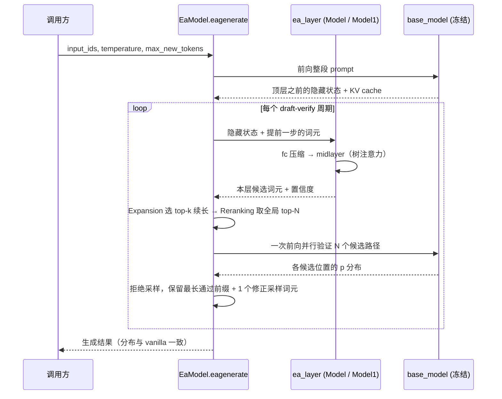

## 先给判断

EAGLE 三代做的事情可以归成一件：让大语言模型（LLM）每跑一次前向，能多带出几个真正落地的词元（token）。

这句话决定了读这套系统的方式。推测解码不是"让小模型多写几个字"，而是用一次大模型前向去并行验证一批候选，只留下从左到右的第一条一致前缀。所以真正值钱的量是**平均接受长度 τ**——一个"起草—验证"周期里平均落到最终输出里的词元数。仓库和三篇论文的加速数字，几乎都能还原成"τ 涨了多少、起草开销占一次前向的几成"这两件事。

τ 有两条涨法：把草稿猜得更准，或者把同样的草稿预算分得更聪明。EAGLE-1 和 EAGLE-3 走前者，EAGLE-2 只走后者。按 EAGLE-3 论文 Table 1 的五数据集平均（Vicuna-13B，Temperature=0，即贪心解码），标准推测解码（拿 Vicuna-68M 当草稿模型）τ 是 2.24，EAGLE-1 是 3.96，EAGLE-2 是 4.83，EAGLE-3 是 6.62。

判断也因此可以提前给出：如果你的负载是单请求、长输出，EAGLE-3 现在就是推测解码这一档的工程上限；如果你要的是大 batch 吞吐，EAGLE-1 的实现在 batch 24 附近就已经开始亏，而 EAGLE-3 论文自己在 H100 + SGLang 上报到 batch 64 仍有 1.38 倍——这一步是三代里唯一真正改变"能不能上生产"结论的变化。

## 目录

- [先给判断](#先给判断)
- [三代之间到底换了什么](#三代之间到底换了什么)
- [加速比、平均接受长度与接受率：三个指标各说一件事](#加速比平均接受长度与接受率三个指标各说一件事)
- [无损性的来源与它的证明位置](#无损性的来源与它的证明位置)
- [EAGLE-1：把自回归从词元层挪到特征层](#eagle-1把自回归从词元层挪到特征层)
- [EAGLE-2：草稿树的 Expansion 与 Reranking](#eagle-2草稿树的-expansion-与-reranking)
- [EAGLE-3：取消特征约束、多层融合与推理侧扩展律](#eagle-3取消特征约束多层融合与推理侧扩展律)
- [一次 eagenerate 调用的完整流转](#一次-eagenerate-调用的完整流转)
- [一个可复算的例子：加速比和接受长度之间差的是什么](#一个可复算的例子加速比和接受长度之间差的是什么)
- [数字该怎么读：README、论文、Spec-Bench 三套口径](#数字该怎么读readme论文spec-bench-三套口径)
- [从零跑通：安装、推理、训练、评测](#从零跑通安装推理训练评测)
- [框架集成：仓库列了 15 个入口](#框架集成仓库列了-15-个入口)
- [什么时候不值得上](#什么时候不值得上)
- [采用顺序](#采用顺序)
- [常见故障与排查](#常见故障与排查)
- [五个自测题](#五个自测题)
- [下一步读哪份代码](#下一步读哪份代码)
- [参考文献](#参考文献)

## 三代之间到底换了什么

[SafeAILab/EAGLE](https://github.com/SafeAILab/EAGLE) 是 EAGLE 系列的官方实现，作者为 Yuhui Li、Fangyun Wei、Chao Zhang、Hongyang Zhang，单位横跨北京大学、微软研究院、滑铁卢大学与 Vector Institute。GitHub 上仓库的描述写得很直接："Official Implementation of EAGLE-1 (ICML'24), EAGLE-2 (EMNLP'24), and EAGLE-3 (NeurIPS'25)"。

| 代次 | 发表 | 换了什么 | 没换什么 |
|------|------|----------|----------|
| EAGLE-1 | ICML 2024（2024-01-26 提交 arXiv） | 草稿模型不再预测词元，改为自回归预测目标模型次顶层特征；输入拼一路提前一步的真实词元序列 | 单层 Transformer 架构的解码器 + 复用目标模型的语言模型头（LM head）；静态草稿树 |
| EAGLE-2 | EMNLP 2024（2024-06-24） | 草稿树从"每层固定 top-k"改成按累计置信度选点，并加一次全局重排 | 草稿模型结构、训练目标完全不动，权重与 EAGLE-1 通用 |
| EAGLE-3 | NeurIPS 2025（2025-03-03 提交 arXiv） | 取消特征回归约束、直接预测词元；特征输入从次顶层换成低/中/高三层融合；训练数据扩到约 8 倍 | 仍是单层解码器量级的草稿头，仍是 draft-verify 两阶段 |

README 对三代关系的原话是：EAGLE-3 "removes the feature prediction constraint in EAGLE and simulates this process during training using training-time testing"，并且"Considering that top-layer features are limited to next-token prediction, EAGLE-3 replaces them with a fusion of low-, mid-, and high-level semantic features"。

仓库当前的分支布局也值得一开始说清楚，因为它决定了你能不能跑对代码。README 里用一整行标题写着："The default main branch is the implementation of EAGLE-3 and EAGLE-2. For using EAGLE-1, please switch to the v1 branch." 但 `main` 上并没有把 EAGLE-1 删掉——`eagle/model/cnets1.py` 仍在，且被 `ea_model.py` 以 `from .cnets1 import Model as Model1` 引入，专门给非 EAGLE-3 权重用。所以准确的说法是：`main` 同时装着两条推理路径，靠 `use_eagle3` 开关分派；`v1` 分支保留的是 EAGLE-1 那一代的完整训练与评测流程。

一个容易踩的版本坑：仓库**既没有 GitHub Release，也没有任何 git tag**——两个页面打开都是空的。README 顶部那个 "Version-v3.0.0" 徽章是张静态 shield 图，不对应任何可 checkout 的制品。要锁定代码版本，只能用提交（commit）的 SHA；README 的 Update 段给出的时间线才是可核对的：

```text
2023.12.8   EAGLE v1.0 is released
2024.1.17   支持 Mixtral-8x7B-Instruct
2024.2.25   被 Spec-Bench 第三方评测评为当时最快的推测解码方法
2024.6.27   EAGLE-2 发布
2024.8.8    支持 Qwen-2
2025.3.19   EAGLE-3 发布
2025.7.23   强烈推荐用 SpecForge 做 EAGLE-3 开箱即用训练
2025.9.18   EAGLE-3 被 NeurIPS'25 接收
```

最后一行是"接收"，不是"发布"。把 2025-09-18 当成 v3.0.0 的发布日期会找不到对应制品——EAGLE-3 的代码与权重早在 2025-03-19 就进了仓库。

## 加速比、平均接受长度与接受率：三个指标各说一件事

EAGLE 论文自己不混用指标，三篇论文对度量的定义高度一致，值得原样搬过来用：

| 指标 | 论文定义 | 它随什么变 |
|------|----------|------------|
| Walltime speedup ratio | 相对 vanilla 自回归解码的实测加速比 | 换 GPU、换精度、换 batch、换实现都会变 |
| Average acceptance length τ | 平均每个 draft-verify 周期产出的词元数（EAGLE-1 的措辞是"每次目标模型前向被接受的词元数"） | 随草稿准确率、任务分布，以及草稿预算怎么分配而变；EAGLE-2 论文明确说它"独立于硬件与运行环境" |
| Acceptance rate α | 起草阶段被接受词元数与生成词元数之比 | EAGLE-1 论文自己补了一句：树形草稿每个位置采样多个候选，这个指标"less applicable" |

这张表是读后面所有数字的前提。τ 是可跨机器比较的那一个；加速比不是。EAGLE-3 论文另外定义了 `n-α`，表示输入里含 `n` 个草稿模型自预测值时的接受比例——这是为了把"自己的误差累积了多少"这件事单独量化，和表里按"生成/接受"计数的 α 不是一回事。

## 无损性的来源与它的证明位置

推测解码之所以敢叫"无损"，靠的是拒绝采样：草稿词元 `x_q` 以 `min(1, p(x_q)/q(x_q))` 的概率接受；一旦拒绝，就从修正分布 `norm(max(0, p - q))` 里重新采一个。这样每一步产出的边际分布严格等于目标模型的分布，多出来的开销只是时间。

关于这条性质的出处，EAGLE-3 论文给的位置很具体："Appendix A.1 of Leviathan et al. 2023 proves that speculative sampling is consistent with the distribution of vanilla autoregressive decoding." 引用时按这个位置指到附录，比转述成"某定理"更可核对。

需要把边界说清：无损性属于**验证规则**，不属于草稿模型质量。草稿再差也只会拖慢速度，不会改变输出分布——这也是 EAGLE-1 论文里那句略带傲慢的话的依据："evaluating the quality of EAGLE's generated results is both unnecessary and meaningless"。真正会破坏无损的是放宽接受条件：EAGLE-3 论文 §4 的 Metrics 段点名 Medusa "relax acceptance conditions under non-greedy settings, which do not guarantee lossless acceleration. Therefore, we do not compare EAGLE-3 with these methods when temperature=1"；EAGLE-1 论文的 Figure 2 图注交代了另一侧——"Lookahead is confined to greedy decoding, and the non-greedy generation of Medusa does not guarantee lossless performance."

这条区分对选型有两个方向的后果。一是**跨方法的无损性不等价**：拿 EAGLE 和 Medusa 在非贪心下比加速比，两篇 EAGLE 论文都因此只在 temperature=0 做这组对比。二是**严格无损不等于不掉速**：温度升高后目标分布变平、采样随机性上升，接受率随之下降（这一步是标准推测解码的通用推理，论文未单列数字）。EAGLE-3 论文 Table 1 里 Vicuna-13B 的 EAGLE-3 从 temperature=0 的 5.58x（五数据集平均 5.51x）降到 temperature=1 的 4.57x（平均 4.65x），τ 从 6.65 降到 5.42；同一张表里 EAGLE-1 是 3.07x → 2.32x，降幅更陡。

## EAGLE-1：把自回归从词元层挪到特征层

EAGLE-1 的论文标题就是它的论点：*Speculative Sampling Requires Rethinking Feature Uncertainty*。摘要里给了两条观察，一是"autoregression at the feature (second-to-top-layer) level is more straightforward than at the token level"，二是这种特征层自回归本身被"the inherent uncertainty in feature level autoregression"卡住。第二条观察是方法的真正来源。

为什么在特征层做自回归更容易？词元层预测要重新决定"下一个字是什么"，是一次跨整个词表的分类；而目标模型已经算好的次顶层隐藏状态（hidden state）里，上下文信息是现成的，草稿头只需要外推一步。代价是隐藏状态是高维连续量，没法像词元那样"采样一个新值"注入下一步——误差会一路漂下去。这就是 feature uncertainty。

EAGLE-1 的解法是：**把真实序列提前一步的词元喂进草稿头**。摘要原话是"By incorporating a token sequence advanced by one time step, EAGLE effectively resolves the uncertainty"。直觉上，预测第 t+1 步的隐藏状态时，第 t+1 步的词元已经把"上一个字定成了什么"这条最强的信息递给了草稿头，漂移被锚住。

这条推理在代码里能一行对上。`eagle/model/cnets1.py` 中 `Model.forward` 的第一步是：

```python
inputs_embeds = self.embed_tokens(input_ids)
hidden_states = self.fc(torch.cat((inputs_embeds, hidden_states), dim=-1))
```

`self.fc` 的构造是 `nn.Linear(2 * config.hidden_size, config.hidden_size, bias=bias)`——输入维度恰好是"词元嵌入 + 隐藏状态"两份。压缩之后送进一个解码器层，`self.layers = nn.ModuleList([LlamaDecoderLayer(config, index) for index in range(config.num_hidden_layers)])`，层数由配置决定：仓库自带的 `eagle/train/vicuna_13B_config.json` 与 `eagle/traineagle3/config.json` 都把 `num_hidden_layers` 写成 1。EAGLE-1 论文对同一个结构的表述是："The method adds only a lightweight plug-in (a single transformer decoder layer) to the LLM"。

还有一点常被二手资料写错：**EAGLE-1 的草稿头没有自己的语言模型头**。`cnets1.py` 的 `Model` 类里根本没有 `lm_head` 这个子模块，草稿头输出的隐藏状态直接借用目标模型的 LM head 得到词表分布。`ea_model.py` 只在草稿层与 LM head 不在同一张卡时才做兜底：`self.ea_layer.headweight = base_model.lm_head.weight.clone().to(device)`。

### 训练目标不是 MSE

EAGLE-1 用两个损失联合训练。回归项针对特征，原文是"Predicting the next feature constitutes a regression task, for which we employ **Smooth L1 loss**"；分类项针对最终目的，用交叉熵对齐目标模型 LM head 的分布。两者相加：

```text
L = L_reg + w_cls * L_cls
```

论文给了 0.1 这个取值的理由："Typically, the classification loss is an order of magnitude larger than the regression loss in numerical terms. Consequently, we set w_cls to 0.1." 0.1 不是调参偏好，而是把两项拉回同一量级。

训练配置的原文在实验节：固定目标模型权重，在 ShareGPT 上取 **68,000 段对话**，学习率 3e-5，AdamW 且 β 取 (0.9, 0.95)，梯度裁剪 0.5。成本描述出现在引言：对 LLaMA2-Chat 70B，"EAGLE trains a decoder layer with fewer than 1B parameters using no more than 70k dialogues from the ShareGPT dataset. The training is completed in 1-2 days on 4x A100 (40G) GPUs"，而 7B/13B/33B 甚至可以压在一台 RTX 3090 节点上，同样 1-2 天。README 的口径与之一致："trainable (within 1-2 days) and testable on 8x RTX 3090 GPUs"。

EAGLE-1 论文用一组消融回答了一个实际问题：把 ShareGPT 固定问答对与"用目标模型重新生成回答"两种训练集对比，LLaMA2-Chat 7B 上前者拿到 2.78x 加速、τ=3.62，后者只是"marginally improves performance"。论文的结论是 EAGLE 对训练数据不敏感，所以宁可固定数据集省开销。这个性质到 EAGLE-3 才被反转——见后文扩展律一节。

### 与 Medusa 的分野到底在哪

| 维度 | EAGLE-1 | Medusa |
|------|---------|--------|
| 草稿来源 | 单个自回归解码器层，用上一步草稿输出继续外推特征 | 一组并行 MLP 头，每个头直接预测第 k 个位置的词元 |
| 复用目标模型什么 | 紧邻 LM head 之前的那层特征，并借用目标模型的 LM head 出词表分布 | 同样是紧邻 LM head 之前的特征，但另训自己的头 |
| 同一位置的候选 | 多路并行采样成树 | 每个头各自 top-k 成树 |
| 非贪心无损 | 是 | 否（放宽接受条件） |
| Vicuna-13B 草稿参数量 | 0.37B，约为基座 2.8% | 未在 EAGLE 材料中给出 |

两篇 EAGLE 论文都把 Medusa 归为"复用目标模型特征"的一派（EAGLE-3 论文原话："EAGLE and speculative sampling methods such as Medusa reuse the top-layer features of the target model, specifically the features immediately before the LM head"），所以真正的分野不在取哪一层，而在**草稿是外推出来还是并行猜出来**。

README 报的三组相对数字是：13B 上比 vanilla 快 3 倍、比 Lookahead 快 2 倍、比 Medusa 快 1.6 倍。gpt-fast 那条不来自 README——README 只写 "achieving 2x speedup on gpt-fast"，具体数字在 EAGLE-1 论文引言："with gpt-fast, EAGLE accelerates LLaMA2-Chat 7B decoding to 160.4 tokens/s on a single RTX 3090 GPU"。

参数量这一行是 EAGLE 系列成本的来源。README 的 EAGLE 权重表逐行标了参数量：Vicuna-7B 0.24B、Vicuna-13B 0.37B、Vicuna-33B 0.56B、LLaMA2-Chat 7B/13B/70B 分别 0.24B/0.37B/0.99B、LLaMA3-Instruct 8B/70B 分别 0.25B/0.99B、Qwen2-7B/72B-Instruct 分别 0.26B/1.05B。按稠密基座的标称规模折算，落在约 1.4%–3.7%，而不是常见转述的"3%–5%"。Mixtral-8x7B 的 0.28B 是例外——它的基座是混合专家模型（Mixture of Experts, MoE），拿总参数或激活参数去除都会得出不同比例，不适合并进同一个百分比区间。

## EAGLE-2：草稿树的 Expansion 与 Reranking

EAGLE-2 不动草稿模型，只动树。摘要把动机讲得很清楚：主流方法用静态草稿树，"implicitly assuming that the acceptance rate of draft tokens depends only on their position"，而作者发现接受率其实是**上下文相关**的。论文点名的静态做法包括 EAGLE 与 Medusa："at the i-th step of the draft phase, k candidates are added, with k being fixed"；Sequoia 则被指为"explicitly assumes that the acceptance rate of a draft token depends only on its position in the tree"。

### 一个可核对的经验性质

支撑动态树的是 EAGLE-2 论文 §3.2 的一条观察，措辞是校准而非定理："we find that EAGLE is well-calibrated: the confidence score (probability) of the draft model is a good approximation of the acceptance rate of draft tokens"。

这条性质之所以够用，是因为树形草稿里一个词元被拒会连带丢掉它后面的整条分支——EAGLE-2 论文的表述是"rejecting a draft token leads to discarding all subsequent tokens; a token is ultimately accepted only if all its prefixes are accepted"。于是一个节点真正被接受要求根到它的路径全部通过，论文就把节点价值定义成路径上的连乘，再用草稿置信度近似：

```text
V_i = ∏ p_j  (j 取 root 到 t_i 路径上的节点)
    ≈ ∏ c_j  (c_j 是草稿模型给出的置信度)
```

论文没有把它写成接受率上界，也没有这个必要——近似误差小就足够指导预算分配。

### 两阶段，而不是"按置信度决定深度"

对 EAGLE-2 最常见的误述是画一棵"高置信分支深、低置信分支浅"的可变深度树。真实做法分两步，深度和分支数是固定的，变的是**每一层谁有资格继续长**以及**最后送去验证的是哪些节点**。

```text
Expansion 阶段（§4.1）
  第 0 层：当前已接受序列末尾
  每往下一层：只对上一层里 V_i 最高的 k 个节点做草稿前向
  树注意力让这一批节点一次前向全部算完
        │
        ▼
Reranking 阶段（§4.2）
  在整棵树的所有节点上按 V_i 重新排序
  取全局 top-N 送去验证 —— 未展开的浅层节点可能胜过已展开的深层节点
```

论文给出的理由是：接受率落在 0 到 1 之间，所以越深的节点 V_i 天然越低，"Some shallow nodes that were not expanded may have higher values than the deeper expanded nodes"，因此不能直接把 Expansion 选出的那批节点当作验证输入。

树注意力不是 EAGLE-2 的发明，它是让这套预算分配策略在成本上可行的前提。EAGLE-2 论文的说法是："Thanks to tree attention, the draft model can simultaneously input all tokens from the current layer and compute the probabilities for the next tokens in a single forward pass."

代码侧的落点在 `eagle/model/cnets.py`。`Model.__init__` 的签名把预算参数全部显式暴露出来：

```python
class Model(nn.Module):
    def __init__(self, config, load_emb=False, path=None, bias=True,
                 total_tokens=63, depth=5, top_k=8, threshold=1.0):
```

`init_tree()` 干的事是把初始树掩码建成单位阵，也就是同一层的 k 个候选彼此互不可见：

```python
def init_tree(self):
    self.tree_mask_init = torch.eye(self.top_k, device=self.embed_tokens.weight.device)[None, None]
    self.position_ids = torch.zeros(self.top_k, device=self.embed_tokens.weight.device, dtype=torch.long)
```

三个默认值需要和论文实验附录对齐着读。EAGLE-2 论文附录 A 给的实际配置是：7B（8B）、13B、70B 的草稿词元总数分别设为 **60、50、48**，草稿树深度 **6**，Expansion 阶段每层选 **10** 个节点。`total_tokens=63, depth=5, top_k=8` 是代码默认值，不等于论文用值；`self.total_tokens = total_tokens - 1` 这一行减法在两个版本的 `Model` 里都存在，配置时容易忽略。

## EAGLE-3：取消特征约束、多层融合与推理侧扩展律

EAGLE-3 的论文标题把方法直接写进去了：*Scaling up Inference Acceleration of Large Language Models via **Training-Time Test***。引用这个术语时留意两种写法：论文与 BibTeX 用 Training-Time Test，README 的表述句里写作 "using training-time testing"，指的是同一件事，但作为方法名以论文标题的形式为准。

### 它要解决的问题是"加数据不涨点"

论文的问题陈述很具体：社区普遍在靠扩数据提升模型能力而不增加推理成本，但"we observe that scaling up data provides limited improvements for EAGLE"。作者把原因归到特征预测约束本身——要求草稿头去回归一个连续高维目标，等于给它加了一道限制表达能力的额外约束，数据再多也用不上。

拆开约束之后出现了新麻烦。论文把这一步的失败写了进来：去掉特征约束、扩数据，第一个草稿词元的接受率确实明显改善，但草稿头第 1 步的输出离真值很远，导致后续输入序列整体偏离。训练时按真值喂、推理时吃自己的输出，这个错位就是训练—推理不一致。

### training-time test 与多层特征融合

对应的两项改动，论文措辞是"abandons feature prediction in favor of direct token prediction and replaces reliance on top-layer features with multi-layer feature fusion via a technique named training-time test"。

- **training-time test**：训练阶段就模拟多步草稿过程，让草稿头在训练时吃到自己前几步的预测结果，从而学会在带误差的输入上继续往下写。
- **低/中/高层特征融合**：不再只用紧邻 LM head 之前的那一层。README 的说法是"Considering that top-layer features are limited to next-token prediction, EAGLE-3 replaces them with a fusion of low-, mid-, and high-level semantic features"。论文给的动机更精确：满秩的 LM head 之下，顶层特征与下一个词元的 logits 一一对应，因此"predicting the next-next token based solely on top-layer features—which are inherently limited to the next token—poses a significant challenge"。

两项也不是并列关系，论文写的是因果：正因为训练时移除了特征预测损失，中间层的特征才变得可用——"the training-time test technique described above enables the use of features from intermediate layers instead of relying solely on the top layer, as the feature prediction loss has been removed during training"。先解约束，才能换输入。

两项各自的贡献量，论文用消融表（Table 2，temperature=0）给齐了。目标模型 LLaMA-Instruct 3.1 8B：

| 方法 | MT-bench 加速 / τ | GSM8K 加速 / τ |
|------|-------------------|----------------|
| EAGLE-2 | 3.16x / 4.05 | 3.39x / 4.24 |
| + 去特征约束 | 3.82x / 5.37 | 3.77x / 5.22 |
| + 多层融合（EAGLE-3） | 4.40x / 6.13 | 4.48x / 6.23 |

第三项才是 EAGLE-3 的完整形态：MT-bench 上比 EAGLE-2 高约 39%。

### 代码里能直接读到的三处改动

融合层的数量不是一个说法，是一个矩阵形状。`eagle/model/cnets.py` 的 `Model.__init__` 里：

```python
if hasattr(config, "target_hidden_size"):
    self.fc = nn.Linear(config.target_hidden_size * 3, self.hidden_size, bias=False)
else:
    self.fc = nn.Linear(config.hidden_size * 3, self.hidden_size, bias=False)
```

乘 3 就是低/中/高三层。往下一步，`LlamaDecoderLayeremb.forward` 把嵌入与特征各自归一化后拼在一起：

```python
hidden_states = self.hidden_norm(hidden_states)
input_emb = self.input_layernorm(input_emb)
hidden_states = torch.cat((input_emb, hidden_states), dim=-1)
```

所以这个类里被注释掉的那行 `self.fc = nn.Linear(config.hidden_size * 2, config.hidden_size)` 才有意义——拼接后的 2 倍维度直接喂给注意力投影，`LlamaAttention` 里 `q_proj`/`k_proj`/`v_proj` 的输入维度都写成 `self.hidden_size * 2`。草稿头只有一层：`self.midlayer = LlamaDecoderLayeremb(config)`。

第三处改动决定了草稿头的输出形状：**EAGLE-3 的草稿头有自己的、词表规模独立于目标模型的语言模型头**。

```python
self.lm_head = nn.Linear(config.hidden_size, config.draft_vocab_size, bias=False)
...
d2t = torch.zeros((config.draft_vocab_size), dtype=torch.long)
t2d = torch.zeros((config.vocab_size), dtype=torch.bool)
```

`draft_vocab_size` 与 `vocab_size` 不等时才需要 `d2t` 和 `t2d`。从形状和用法看，`d2t` 是一张按草稿词表索引、给出目标词表下标的映射表，`t2d` 是反方向的布尔掩码；`ea_model.py` 里有一条对应的清理逻辑：`if self.use_eagle3 and config.vocab_size == config.draft_vocab_size: del self.ea_layer.d2t, self.ea_layer.t2d`。推理时草稿头的输出靠 `input_ids = topk_index + self.d2t[topk_index]` 落回目标词表。仓库自带的示例配置把这套机制的具体尺度写死了：`eagle/traineagle3/config.json` 里 `vocab_size` 是 128256，`draft_vocab_size` 是 32000——草稿头只在自己那 3.2 万个候选里排序，再用一张表换回目标词表下标。

这一处是 EAGLE-1 与 EAGLE-3 在结构上真正的分界：前者借用目标模型的 LM head，后者自带一个小词表头。论文没有把扩展律的成立归因于这个裁剪词表，所以这里只记为架构差异，不当成因果结论。

### 扩展律：这一代真正的新东西

README 把 EAGLE-3 讲成速度增量，论文把 EAGLE-3 讲成一个可外推的关系："increasing the amount of training data for the draft model leads to a proportional increase in the speedup ratio of EAGLE-3. This scaling behavior was not observed in the original EAGLE architecture." 论文的 Figure 1 用 LLaMA-Instruct 3.1 8B 在 MT-bench 上画这条曲线，横轴是相对 ShareGPT 的数据规模。

数据配置的原文在实现细节附录：AdamW，β=(0.9, 0.95)，梯度裁剪 0.5，学习率 **5e-5**（EAGLE-1 是 3e-5），训练集为 ShareGPT（约 68K 条）与 UltraChat-200K（约 464K 条），并且"**We call the target model to generate responses rather than using a fixed dataset**"。对推理模型 DeepSeek-R1-Distill-LLaMA 8B 额外用了 OpenThoughts-114k-math。

最后一句是方向性变化：EAGLE-1 论证过固定数据集够用、对训练数据不敏感；EAGLE-3 却必须用目标模型自己生成的回答来喂草稿头，才让扩数据换到加速比。论文给的结果是"trained with approximately 8x more data than EAGLE, achieves a 1.4x latency speedup over EAGLE-2 at batch size 1"。

还有一条对硬件规划有用的信息藏在相关工作一节："EAGLE inspired the multi-token prediction technique used in the pre-training of DeepSeek-v3, which in turn inspired new architectural designs in EAGLE-3." EAGLE-3 的架构改动方向，部分来自 DeepSeek-V3 的多词元预测预训练实践。

## 一次 eagenerate 调用的完整流转

把三代机制放回真实调用里看。下面按 `eagle/model/ea_model.py` 的实际路径走一遍，参数取代码默认值。


```mermaid
sequenceDiagram
  participant App as 调用方
  participant EM as EaModel.eagenerate
  participant Draft as ea_layer (Model / Model1)
  participant Base as base_model (冻结)
  App->>EM: input_ids, temperature, max_new_tokens
  EM->>Base: 前向整段 prompt
  Base-->>EM: 顶层之前的隐藏状态 + KV cache
  loop 每个 draft-verify 周期
    EM->>Draft: 隐藏状态 + 提前一步的词元
    Draft->>Draft: fc 压缩 → midlayer（树注意力）
    Draft-->>EM: 本层候选词元 + 置信度
    EM->>EM: Expansion 选 top-k 续长 → Reranking 取全局 top-N
    EM->>Base: 一次前向并行验证 N 个候选路径
    Base-->>EM: 各候选位置的 p 分布
    EM->>EM: 拒绝采样，保留最长通过前缀 + 1 个修正采样词元
  end
  EM-->>App: 生成结果（分布与 vanilla 一致）
```

流转里三个点最值得记：

1. 目标模型全程冻结，草稿头是唯一可训练部分。`eagenerate` 的签名里能看出推理侧可调的东西很少——`temperature=0.0, top_p=0.0, top_k=0.0, max_new_tokens=512, max_length=2048, log=False, is_llama3=False`。
2. 一个周期产出的词元数等于"最长通过前缀 + 那个必定落地的修正采样词元"，所以每周期至少产出 1 个词元。但每周期也要付一次大模型前向加草稿开销，即 1+c 的时间——加速比的下限是 `1/(1+c)`，**可以低于 1**。后面"什么时候不值得上"一节里 EAGLE 的 batch 表就出现了 0.88x、0.71x 这样的实测值。
3. 树的形状由草稿置信度决定，验证之前就已经定了。这正是 EAGLE-2 相对 EAGLE-1 的全部收益来源。

## 一个可复算的例子：加速比和接受长度之间差的是什么

EAGLE-3 论文 Table 1 报的 Vicuna-13B / temperature=0 / MT-bench：EAGLE-2 是 4.26x、τ=4.83；EAGLE-3 是 5.58x、τ=6.65。这两个数同时给了"周期产出"和"实际墙钟"，可以反解出草稿与验证的相对开销。

设一个周期里目标模型跑一次前向的耗时为 1，草稿头与额外验证开销合计为 c，那么每周期耗时 1+c、产出 τ 个词元，加速比≈τ/(1+c)。论文数字代进去：

| 方法 | 加速比 | τ | 反解出的 c = τ/加速比 − 1 |
|------|--------|-----|--------------------------|
| EAGLE-1 | 3.07x | 3.98 | ≈0.30 |
| EAGLE-2 | 4.26x | 4.83 | ≈0.13 |
| EAGLE-3 | 5.58x | 6.65 | ≈0.19 |

**这张表是我对公开数字做的算术，不是论文结论**，但它的形状有用：三代之间 τ 涨了 67%，反解开销一直压在 0.1–0.3 区间，说明加速比的增长几乎全部来自接受长度而非省开销。它也解释了为什么同一份权重换个 harness 数字会大变——c 对实现细节敏感，τ 不太敏感。

把同一个换算用到第三方榜单上，差距立刻可见。Spec-Bench 在 A100 / Vicuna-13B-v1.3 / 贪心 / FP16 / batch=1 上报 EAGLE-3 总体 3.02x、平均被接受词元数 5.71，反解 c≈0.89，接近论文值的 4.7 倍。两个 c 不是同一套代码、同一套树配置量出来的，所以真正该带走的结论不是"论文夸大了"，而是：**c 才是你的框架需要自己测的那一项。**

## 数字该怎么读：README、论文、Spec-Bench 三套口径

同一件事在三份材料里有三组数字，混起来就会得出错误判断。

| 来源 | 条件 | Vicuna-13B 上 EAGLE-3 的说法 |
|------|------|------------------------------|
| 仓库 README | 2×RTX 3090、fp16、Vicuna 13B（图注未写数据集） | "5.6 faster than vanilla decoding (13B)"、"1.8x faster than EAGLE-1 (13B)" |
| EAGLE-3 论文 Table 1 | temperature=0、MT-bench、5 个数据集之一 | 5.58x，τ=6.65；五数据集平均 5.51x、τ=6.62；HumanEval 最高 6.47x、τ=7.54 |
| Spec-Bench（第三方） | 单张 A100、贪心、FP16、batch=1、统一 harness | 总体 3.02x，平均被接受词元 5.71 |

先说这三组各测什么。README 那组明确标了设备——图注写的是 "Inference is conducted on 2x RTX 3090 GPUs at fp16 precision using the Vicuna 13B model"，而仓库的推理代码支持跨卡装载权重；论文 Table 1 只写了模型、数据集与温度，没有标 GPU 型号；Spec-Bench 则把所有方法塞进同一个单卡环境测**相对排名**。三者的口径本来就不齐。

数字差异更可能反映哪部分？前两组之间几乎一致（5.58 vs 5.6），差异全在最后一组。从 5.58x 到 3.02x，τ 只从 6.65 降到 5.71（−14%），加速比却降了 46%——按前一节的分解，掉的那部分几乎全在开销 c 里：不同 GPU、不同 batch、不同实现。Spec-Bench 自己在榜单顶部写的提醒也正是这个意思："model speedup rates may differ across various devices. For more precise speedup metrics, we recommend conducting evaluations of specific models on your intended devices."

由此，这些数字**不能**推出四件事：

- 不能推出大 batch 吞吐。README 与论文 Table 1 都是 batch=1 的延迟数字；吞吐要另看论文 §4.3、§4.4。
- 不能推出跨模型规模保持。同为 EAGLE-3，论文 Table 1 里 Vicuna-13B 五数据集平均 5.51x，LLaMA-Instruct 3.3 70B 只有 4.12x。代际增益也随规模衰减：EAGLE-2 相对 EAGLE-1 在 13B 上是 3.05x→4.22x（+38%），而 Spec-Bench 的 A100 / Vicuna-33B 子榜上 EAGLE 到 EAGLE-2 只从 2.43x 到 2.59x（+6.6%）。
- 不能推出跨任务保持。任务差别直接影响草稿命中率：论文里 EAGLE-3 在 HumanEval 上最好，理由是代码里"many fixed templates"最容易起草；DeepSeek-R1-Distill-LLaMA 8B 反而在 GSM8K 上最高，作者猜测是因为它的草稿头额外用 OpenThoughts-114k-math 训练过。
- 不能推出"Spec-Bench 榜单还认 EAGLE 是第一"。README 徽章写的"certified by the third-party evaluation as the fastest speculative method so far"对应的是 Update 里 2024.2.25 那一条；当前 3090 榜上 EAGLE-1 已排第三，榜首是 SAMD[EAGLE2]（2.38x），EAGLE-2 以 2.19x 居次，而 EAGLE-3 没有出现在 3090 榜单上，只在 A100 的 Vicuna-13B 子榜以 3.02x 排第一。

同一组条件对读比单个数字更有信息量，但要用**同一来源内部**的比值。EAGLE-3 论文 Table 1（temperature=0）里，EAGLE-3 相对 EAGLE 在 Vicuna-13B 五数据集平均上是 5.51x/3.05x ≈ 1.8 倍；Spec-Bench 的 A100 / 13B 子榜里，同一对方法是 3.02x/2.16x ≈ 1.4 倍。两份材料给出的相对增益并不一致——这本身就是结论：**跨来源连比值都不可迁移，能迁移的只有"同一实现下 EAGLE-3 明显优于 EAGLE"这个排序。**

## 从零跑通：安装、推理、训练、评测

### 环境

仓库安装段给的命令原样可用：

```bash
git clone https://github.com/SafeAILab/EAGLE.git
cd EAGLE
python -m venv ~/venvs/ea_env
source ~/venvs/ea_env/bin/activate
pip install -r requirements.txt
```

根目录另有一份 `requirements-rocm.txt`，供 AMD ROCm 环境使用；`setup.py` 存在，但 README 的安装路径没有走 `pip install -e .`。

### 权重

EAGLE-3 权重表共 18 行基座模型，其中标 Official=Yes 的只有 **4 个**：Vicuna-13B v1.3、LLaMA-3.1-8B-Instruct、LLaMA-3.3-70B-Instruct、DeepSeek-R1-Distill-LLaMA-8B，均由 `yuhuili/` 发布。其余 **14 个基座对应 21 个非官方 checkpoint**，上传方包括 lmsys、nvidia、AngelSlim、Tengyunw、wantsleep、Zjcxy-SmartAI、thoughtworks，另有 MiniCPM4 那一个托管在 ModelScope 而非 Hugging Face。覆盖的基座是 LLaMA-4 Scout/Maverick、Qwen3 全系（1.7B/4B/8B/14B/30B-A3B/32B/235B-A22B）、MiniCPM4-8B、OLMoE-1B-7B、granite-3.1-1b-a400m、GPT-OSS-120B 与 GLM-4.7-Flash。

这一区分比"支持 18 个模型"这种说法更有用。README 在权重表前专门写了一段："This repository recognizes only official EAGLE-3 checkpoints. Performance of unofficial checkpoints may vary. If you want to compare with EAGLE-3, please compare with official checkpoints and official draft tree setups." 拿社区权重跑出的加速比去对表论文数字，按 README 的口径这个比较不成立。

老的 EAGLE（EAGLE-1 系）权重表有 12 个官方 + 1 个社区条目，两张表不通用。README 的提醒是："The current code defaults to using EAGLE-3. If you want to use EAGLE weights, please specify `use_eagle3=False` in `EaModel.from_pretrained`."

还有一条会直接影响输出正确性的注记："When Qwen2 is the target model, please use bf16 precision instead of fp16 to avoid numerical overflow. The training dataset for the draft model of Qwen2 is ShareGPT, which has removed non-English data."

### 命令行界面

```bash
python -m eagle.application.webui \
  --ea-model-path [path of EAGLE weight] \
  --base-model-path [path of the original model] \
  --model-type [vicuna\llama2\llama3] \
  --total-token [int]
```

这段是 README 原文，但 `--model-type` 的取值写错了，照抄会直接被 argparse 拒绝。`eagle/application/webui.py` 里的实际定义是：

```python
parser.add_argument("--model-type", type=str, default="vicuna",
                    choices=["llama-2-chat", "vicuna", "mixtral", "llama-3-instruct"])
```

要填的是 `llama-2-chat` 与 `llama-3-instruct`，不是 README 里的 `llama2` / `llama3`。同一个文件里还有几个 README 没提的开关：`--no-eagle3`（回退到 EAGLE-1/2 权重）、`--load-in-8bit` / `--load-in-4bit`、`--max-new-token`（默认 512），以及 `--total-token` 的默认值 **60**。两个模型路径参数的 default 也是作者本机的 `/home/lyh/weights/...`，不显式传会直接报错。

README 对 `--total-token` 的说明是：它是草稿词元数，模型越小、GPU 越好就可以设越大，需按具体设备与模型调整；"If set to -1, **EAGLE-2** will automatically configure this parameter." 这句话只点了 EAGLE-2，EAGLE-3 的自动配置行为 README 没有承诺。

### 代码内推理

README 给的 `eagenerate` 示例（注意它省略了 `import torch`，实跑要自己补）：

```python
from eagle.model.ea_model import EaModel
from fastchat.model import get_conversation_template
model = EaModel.from_pretrained(
    base_model_path=base_model_path,
    ea_model_path=EAGLE_model_path,
    torch_dtype=torch.float16,
    low_cpu_mem_usage=True,
    device_map="auto",
    total_token=-1
)
model.eval()
your_message="Hello"
conv = get_conversation_template("vicuna")
conv.append_message(conv.roles[0], your_message)
conv.append_message(conv.roles[1], None)
prompt = conv.get_prompt()
input_ids=model.tokenizer([prompt]).input_ids
input_ids = torch.as_tensor(input_ids).cuda()
output_ids=model.eagenerate(input_ids,temperature=0.5,max_new_tokens=512)
output=model.tokenizer.decode(output_ids[0])
```

README 在代码块后用加粗强调过一句："Vicuna, LLaMA2-Chat, and LLaMA3-Instruct are both chat models. You need to use the correct chat template, otherwise it will cause abnormal output from the model and affect the performance of EAGLE." 模板错了同时伤输出质量和接受率，这是排查表里第一条的原因。

### 训练与评测

EAGLE-3 的训练入口在仓库里是独立目录，和 EAGLE-1/2 的 `eagle/train/` 分开：

```bash
cd eagle/traineagle3
deepspeed main.py --deepspeed_config ds_config.json
```

`eagle/traineagle3/` 下除 `main.py`、`ds_config.json` 外，还自带一份 `cnets.py`、`configs.py` 与 `modeling_llama_kv.py`——训练与推理各持一套草稿头实现，改动时两边都要看。

README 紧接着推荐了另一条路："We strongly recommend using [SpecForge](https://github.com/sgl-project/SpecForge) for out-of-the-box training of EAGLE-3 with SGLang." 这条建议的时间戳是 2025.7.23。

评测命令也值得一抄，因为它是仓库自己认可的可复现入口：

```bash
python -m eagle.evaluation.gen_ea_answer_llama3chat \
  --ea-model-path yuhuili/EAGLE3-LLaMA3.1-Instruct-8B \
  --base-model-path meta-llama/Llama-3.1-8B-Instruct --use_eagle3

python -m eagle.evaluation.gen_baseline_answer_llama3chat \
  --ea-model-path yuhuili/EAGLE3-LLaMA3.1-Instruct-8B \
  --base-model-path meta-llama/Llama-3.1-8B-Instruct
```

两条命令各产出一个 `.jsonl`，记录生成结果与 wall time，README 说再用 `evaluation/speed.py` 求速度比，也说明要看具体加速比就必须把基线那条一起跑。但 `speed.py` 得先改：文件顶部三行是硬编码的作者本机路径与文件名——

```python
tokenizer=AutoTokenizer.from_pretrained("/home/lyh/weights/hf/llama2chat/13B/")
jsonl_file = "llama-2-chat-70b-fp16-ea-in-temperature-0.0.jsonl"
jsonl_file_base = "llama-2-chat-70b-fp16-base-in-temperature-0.0.jsonl"
```

它按题号累加 `choices[0]['new_tokens']` 与各轮耗时，最后一行输出 `ratio = mean(speeds)/mean(speeds0)`。README 里另一条 Qwen3 的示例命令同样带着作者的绝对路径 `/workspace/yunhai/Qwen3-4B_eagle3`，直接复制会失败。

想测接受率而不是只测速度，仓库里有 `gen_ea_answer_*` 之外的两个脚本：`gen_ea_alpha_vicuna.py` / `gen_ea_alpha_llama2chat.py` 配合 `alpha.py`，会按草稿位置记录 `alpha` 与 `alpha_num` 两个数组——这正好对应 EAGLE-1 论文里那个"1-α 到 4-α"的鲁棒性分析。但这条路径目前跑不通：两个 alpha 脚本都 `from model.utils_alpha import *`，而仓库里不存在 `utils_alpha.py`（`eagle/model/` 下只有 `utils.py` 与 `utils_c.py`）。`alpha.py` 顶部同样写死了 `/home/lyh/code/nlp/EAGLE/data/...`。要测 α，实际得自己补这个模块。

## 框架集成：仓库列了 15 个入口

README 的 Support 段按字母序列出 15 个条目，标题写的是"merged in the following mainstream LLM serving frameworks"。逐条核对过链接：

| 条目 | 接入形式 |
|------|----------|
| AMD ROCm | ROCm 博客的 MTP 优化文 |
| AngelSlim | 文档 `features/speculative_decoding/eagle.html` |
| AWS NeuronX Distributed Core | nxd-inference feature guide 的 eagle 一节 |
| CPM.cu | OpenBMB 仓库 |
| Intel® Extension for Transformers | PR intel/intel-extension-for-transformers#1504 |
| Intel® LLM Library for PyTorch | PR intel-analytics/ipex-llm#11104 |
| MLC-LLM | REST（表述性状态转移）接口的部署文档 |
| NVIDIA NeMo Framework | `model-optimization/speculative/speculative.html` |
| NVIDIA TensorRT-LLM | `examples/eagle` |
| NVIDIA TensorRT Model Optimizer | `7_speculative_decoding.html` |
| PaddleNLP | `predict/speculative_decoding.html` |
| SGLang | `advanced_features/speculative_decoding.html` |
| SpecForge | 训练侧仓库 |
| speculators | vLLM 项目下的独立仓库 |
| vLLM | PR vllm-project/vllm#16937 |

两点需要在动手前知道。第一，这 15 项里 AMD ROCm、AWS NeuronX、两个 Intel 条目指的是硬件平台的接入文档，真正的推理框架数量比 15 小；把 README 的条目数当成"框架适配数"会高估生态。第二，vLLM 那条链接指向的 PR 标题是 "[V1][Spec Decode] EAGLE-3 Support"，页面显示它已于 2025-04-25 合并——所以它是 **EAGLE-3 在 vLLM V1 路径上的支持**，而 README 的 Todo 段另一条 vLLM 记录指向的是更早的 PR #6830。

至于"接入要改几行配置"，README 与论文都没给数字，各框架的开关名与参数形态也各不相同。唯一可直接引用的是 README 那句能力声明：EAGLE "combinable with other parallelled techniques such as vLLM, DeepSpeed, Mamba, FlashAttention, quantization, and hardware optimization"。想评估接入成本，只能拿自己那套框架的文档去核对。

Todo 段的完成状态澄清了一个常见误传。整段 10 项里只有两项未勾选：`Support official EAGLE-3 for Qwen-3` 与 `EAGLE-4`。这**不等于** Qwen3 跑不起来——`eagle/model/modeling_qwen3_kv.py` 已存在，`gen_ea_answer_qwen3` 评测脚本已在 `eagle/evaluation/` 下，权重表里还有 7 个 Qwen3 基座对应的 12 个社区 EAGLE-3 checkpoint。未勾选的只是"官方 Qwen3 EAGLE-3 权重"这一项：代码支持、社区权重、官方权重是三件事。

## 什么时候不值得上

### 值得上的条件

- 单请求、长输出。加速来自减少大模型前向次数，输出越长摊得越开；论文的加速比表以单请求为主口径，EAGLE-3 论文在给出跨 batch 数据前也明写 "at batch size 1"。
- 基座落在权重一节列出的那几个官方 EAGLE-3 模型里，或者你愿意自己练一个草稿头。
- 已经在用 README Support 列表里的框架，并且能沿用列表给出的那条官方文档路径。
- 需要和量化、FlashAttention 等技术共存——README 明确说可以叠加。
- 目标模型是 Mixtral 8x7B 这类混合专家模型（Mixture of Experts, MoE）：`modeling_mixtral_kv.py` 与官方 EAGLE 权重 `yuhuili/EAGLE-mixtral-instruct-8x7B`（0.28B）都在仓库里，README 的 Mixtral 支持记录在 2024.1.17。注意这是 EAGLE-1 时代的官方权重，不是 EAGLE-3。

### 不值得上的条件

- **输出很短**。一个周期要付草稿前向与更大验证输入的代价，只换来多几个词元；EAGLE 论文的度量口径本身就是 MT-bench 这类长回答。
- **基座不在权重表、又不打算自己训练**。这时可以先看免训练的那一类：Spec-Bench 榜单顶部点名 PLD、Lookahead 与 Recycling 是"plug-and-play methods that require minimal extra parameters, making them easier to integrate into a wider range of models"。
- **要求严格受控解码**（受限 beam search、语法约束生成）。仓库的 README 与三篇论文都没有覆盖这个场景，动态草稿树与这类解码器的候选管理如何共存没有可引用的结论。
- **只关心大 batch 吞吐，且停留在 EAGLE-1**。论文 §4.3 的 H100 + SGLang 表格是硬证据：以不开推测解码为 1.00x，EAGLE 在 batch 2 是 1.40x，到 batch 16 只剩 1.02x，batch 24 起跌到 1.00x 以下（0.93x、0.94x、0.88x、0.99x、0.99x）。

| batch size | 2 | 4 | 8 | 16 | 24 | 32 | 48 | 56 | 64 |
|------------|-----|-----|-----|-----|-----|-----|-----|-----|-----|
| EAGLE | 1.40x | 1.38x | 1.23x | 1.02x | 0.93x | 0.94x | 0.88x | 0.99x | 0.99x |
| **EAGLE-3** | 1.81x | 1.82x | 1.62x | 1.48x | 1.39x | 1.32x | 1.38x | 1.34x | **1.38x** |

（EAGLE-3 论文 Table 3：H100、LLaMA-Instruct 3.1 8B、MT-Bench、SGLang v0.4.4，实验由 SGLang 团队完成；该组**未使用树结构**，链长固定为 3。）

EAGLE-3 论文的 vLLM 一节给出同方向的第二组证据：

| batch size | 2 | 4 | 8 | 16 | 24 | 32 | 48 | 56 |
|------------|-----|-----|-----|-----|-----|-----|-----|-----|
| EAGLE | 1.30x | 1.25x | 1.21x | 1.10x | 1.03x | 0.93x | 0.82x | 0.71x |
| **EAGLE-3** | 1.75x | 1.68x | 1.58x | 1.49x | 1.42x | 1.36x | 1.21x | **1.01x** |

（Table 5：vLLM、LLaMA-Instruct 3.1 8B、MT-Bench，同样未用树结构，最大链长 2。）

正文里那句解读要连着看："EAGLE shows the maximum throughput improvement at a batch size of 24, while EAGLE-3 shows this at 56." 对照 Table 5，24 是 EAGLE 仍 ≥1.00x 的最大 batch，56 是 EAGLE-3 仍 ≥1.00x 的最大 batch——这句讲的是**收益上限所在的 batch**，不是峰值。峰值在 batch=2（1.30x 与 1.75x）。

一处需要标注 unresolved：这组实验的正文说设备是 RTX 3090，Table 5 的标题写的是 A100，论文内部两处口径不一致，引用时最好把两种说法都带上。

一个需要分开的判断是：**EAGLE-3 在高 batch 上并非没有价值**。论文引言的原话是"Speculative sampling is often thought to reduce throughput at large batch sizes. However, in SGLang, a production-grade framework, EAGLE-3 improves throughput by 40% at a batch size of 64"（同一件事在摘要里写作 1.38x）。目前缺的那块证据是大 batch 下**开着树结构**的吞吐。

### 训练与工程上的已知坑

- 精度：Qwen2 作为目标模型时 README 要求 bf16，理由是 fp16 下数值溢出。
- 语言：Qwen2 草稿头训练用的 ShareGPT 已剔除非英文数据，中文场景需按 README 的指示用对应数据重训。
- 权重代次：EAGLE-3 与 EAGLE 权重不能混用，需在 `from_pretrained` 里对齐 `use_eagle3`。
- 树掩码只在构造时建：`init_tree()` 在 `EaModel.__init__` 末尾被调用一次，用 `top_k` 决定初始掩码形状；运行期改 `top_k` 不会自动重建树掩码。
- 自定义结构：目标模型的层结构与仓库内置的四份 `modeling_*_kv.py`（llama / mixtral / qwen2 / qwen3）都对不上时，README 的指引是从 Transformers 里拷 `modeling_basemodelname.py` 自行改，并参考 `model/modeling_llama_kv.py`——那里的改动点用 `# [MODIFIED]` 标注。README 对改动量的判断是"These modifications are minimal"。实际标记分布：`modeling_llama_kv.py` 6 处、`modeling_mixtral_kv.py` 2 处、`modeling_qwen3_kv.py` 1 处、`cnets.py` 与 `cnets1.py` 各 2 处。

## 采用顺序

按下面这个顺序推进，每一步都有明确的通过条件，任何一步不过就不要往下投。

1. **确认负载形态**。输出长度分布和并发度决定收益上限。单请求长回答直接进第 2 步；大 batch 为主的，只看论文 §4.3、§4.4 那两组吞吐表所对应的场景（当前证据下的安全区大约到 batch 56，且不含树草稿）。
2. **核对权重代次**。基座在那 4 个官方 EAGLE-3 权重里最好；否则先确定用哪个社区 checkpoint，并把它标成"非官方、性能可能浮动"，因为 README 明说比较要用官方权重与官方草稿树设置。
3. **测自己的 c，不要抄别人的加速比**。跑评测一节那两条命令，改完 `speed.py` 顶部的硬编码路径再算 wall time 比。要拿 τ，`eagenerate` 传 `log=True` 时返回 `(input_ids, new_token, idx)`：`new_token` 是**累计**值——`eagle/model/utils.py` 里每个周期执行 `new_token += accept_length + 1`，循环前才初始化成 0——`idx` 是周期下标（从 0 计），所以 τ = `new_token / (idx + 1)`，不要把 `new_token` 直接当成单周期均值。另有一条容易忽略的循环上限：`eagenerate` 里有 `max_length = max_length - self.ea_layer.total_tokens - 10`，长上下文生成时这个扣减会先于 `max_new_tokens` 生效。τ 用来判断草稿头质量，加速比用来判断你的开销。
4. **决定放在哪一层**。已有 vLLM / SGLang / TensorRT-LLM 的，走各自文档，注意 vLLM 的 EAGLE-3 支持在 2025-04-25 才随 PR #16937 合入 V1 路径，版本要求以 vLLM 侧文档为准；自研推理栈要按 README 的"custom models"路径改一份 `modeling_*.py`。
5. **上线后按 τ 判收益衰减**。生产负载的 τ 相对试点明显下滑，通常是数据分布漂移，此时先看模板与语言，再考虑重训。仓库没有提供"τ 低于某个值就不值得"的阈值，任何阈值都得由你在第 3 步的对照实验里定。
6. **需要自定义模型时按 EAGLE-3 的数据口径估成本**。论文用的是 ShareGPT（约 68K）+ UltraChat-200K（约 464K），并且要调用目标模型生成回答；EAGLE-1 时代"固定数据集就够"的结论在 EAGLE-3 上不再成立。GPU 预算按 README 的"within 1-2 days on 8x RTX 3090"作为起点。

不建议一上来就在主流量上启用。先用一周小流量，把 τ 和 wall time 两条曲线拉出来对照，再决定扩大范围。

## 常见故障与排查

按现象分类，最常见的一类是模板与精度配错，第二类才是性能不达预期。第三列给出每条判断的出处：

| 现象 | 先查什么 | 依据 |
|------|----------|------|
| 输出乱码或明显劣化，同时加速比变差 | chat template 是否与基座匹配 | README 加粗提示：Vicuna / LLaMA2-Chat / LLaMA3-Instruct 都是 chat 模型，模板错会同时导致异常输出与性能下降 |
| Qwen2 上出现 NaN / inf | 精度是否写成 fp16 | README 要求 Qwen2 用 bf16 以避免数值溢出 |
| 中文任务接受率很低 | 草稿头训练数据语言 | README：Qwen2 的 ShareGPT 训练集剔除了非英文数据，需换数据重训 |
| 加载权重报 size mismatch | `use_eagle3` 与权重代次是否对应 | README：代码默认走 EAGLE-3，用 EAGLE 权重要显式 `use_eagle3=False` |
| 换到非 LLaMA/Mixtral 结构就报错 | 是否补了对应 `modeling_*_kv.py` | 仓库只内置 llama / mixtral / qwen2 / qwen3 四份；其余按 README 的 custom models 指引自行改 |
| vLLM 上找不到 EAGLE-3 开关 | 版本是否落在 PR #16937（2025-04-25 合并）之后的 V1 路径 | vLLM 侧文档 |
| 训练 loss 不降 | 是否把目标模型权重一起塞进了优化器 | EAGLE-1 论文实验节写 "We fixed the target LLMs"，EAGLE-3 论文 §4 的 Metrics 段写 "EAGLE-3 does not modify the target model's weights"；`Model.__init__` 里也显式冻结了从基座载入的嵌入：`for param in self.embed_tokens.parameters(): param.requires_grad = False` |
| 加速比远低于 README | 是否用社区权重 / 非官方草稿树配置 / 输出过短 / batch 过大 | README 权重段的比较要求 + 论文 §4.3 的 batch 衰减表 |
| `--total-token` 设 -1 后行为不变 | 用的到底是 EAGLE-2 还是 EAGLE-3 路径 | README 只对 EAGLE-2 承诺了自动配置 |

## 五个自测题

1. 一个周期里，为什么"草稿全被拒"仍然会产出 1 个词元？这决定了加速比的下限是什么。
2. EAGLE-2 的节点价值为什么写成路径上的连乘而不是单点置信度？这决定了 Expansion 与 Reranking 两步各自的必要性。
3. EAGLE-3 的 `fc` 输入维度是隐藏维度的 3 倍，`LlamaAttention` 的三个投影却是 2 倍。这两处分别对应架构里的哪两件事？
4. 去掉特征回归约束之后，第一个草稿词元的接受率涨了，但整体并不立刻变好。论文给出的原因是什么，它如何指向 training-time test？
5. 同一份 EAGLE-3 权重，论文报 5.58x、Spec-Bench 报 3.02x。用 τ 与开销 c 的分解说明：哪一部分是跨设备可比的，哪一部分必须自己测。

## 下一步读哪份代码

想改机制，按这个顺序读，每步都能对上前面的一条断言：

- 先读 `eagle/model/cnets1.py` 的 `Model.forward`，只看 `torch.cat` 那一行和它后面的层调用。EAGLE-1 的全部机制就在"嵌入 + 提前一步的词元"这个拼接里。
- 再读 `eagle/model/cnets.py` 的同名函数，对比 `fc` 从 2 倍变 3 倍、以及 `self.lm_head` 是新增的这两处。EAGLE-3 的两项改动在这里可验证。
- 然后读 `eagle/model/ea_model.py` 的 `EaModel.__init__`，`use_eagle3` 分派、`load_emb=True`、`d2t/t2d` 清理、`init_tree()` 全在几十行里。
- 草稿树策略读 `eagle/model/choices.py` 与 `cnets.py` 里 `total_tokens / depth / top_k / threshold` 的使用点，和论文 §4.1、§4.2 对照。
- 训练侧读 `eagle/traineagle3/main.py` 与 `ds_config.json`，注意它与 `eagle/model/cnets.py` 是两份实现。
- 想理解验证为何能并行，读 `eagle/model/kv_cache.py` 里的 `initialize_past_key_values`，再看 `modeling_llama_kv.py` 上那 6 处 `# [MODIFIED]`。
- 最后读 EAGLE-3 论文 §4.3、§4.4 两张吞吐表：目前能支撑"大 batch 也能上"的官方证据只有这两组。

## 参考文献

- 仓库：<https://github.com/SafeAILab/EAGLE>（`main`，核对时 HEAD 为 `cb7e0841`）
- EAGLE-1：Yuhui Li et al. *EAGLE: Speculative Sampling Requires Rethinking Feature Uncertainty.* ICML 2024。<https://arxiv.org/abs/2401.15077>
- EAGLE-2：Yuhui Li et al. *EAGLE-2: Faster Inference of Language Models with Dynamic Draft Trees.* EMNLP 2024。<https://arxiv.org/abs/2406.16858>
- EAGLE-3：Yuhui Li et al. *EAGLE-3: Scaling up Inference Acceleration of Large Language Models via Training-Time Test.* NeurIPS 2025。<https://arxiv.org/abs/2503.01840>
- Leviathan et al. *Fast Inference from Transformers via Speculative Decoding.*（arXiv 于 2022-11-30 提交，无损性证明见附录 A.1）<https://arxiv.org/abs/2211.17192>
- 官方博客：<https://sites.google.com/view/eagle-llm>
- Spec-Bench 第三方榜单：<https://github.com/hemingkx/Spec-Bench/blob/main/Leaderboard.md>
- SpecForge（README 推荐的 EAGLE-3 训练入口）：<https://github.com/sgl-project/SpecForge>
- vLLM EAGLE-3 支持 PR：<https://github.com/vllm-project/vllm/pull/16937>
- TensorRT-LLM 示例：<https://github.com/NVIDIA/TensorRT-LLM/tree/main/examples/eagle>
- 对比方法 Medusa：<https://arxiv.org/abs/2401.10774>
- 对比方法 Lookahead：<https://lmsys.org/blog/2023-11-21-lookahead-decoding/>

最后放三件背景数据，核对时间 2026-09-20：仓库约 2.5k star、约 300 fork，最后一次提交是 2026-02-20 合并的 PR #330（把 GLM-4.7-Flash 加进 EAGLE-3 社区权重表），默认分支 `main`，主体语言 Python。许可证条款写在 `LICENSE` 文件里，首行是 "Copyright 2025 SafeAI Lab (SAIL)"，正文为 Apache-2.0；由于这份自定义头部，GitHub 在仓库页面上不识别它，显示成 "Other"——只按页面标签判断许可证会得出错误结论。

> 本文事实来源为 SafeAILab/EAGLE 仓库（README、`eagle/model/`、`eagle/traineagle3/`、`eagle/evaluation/`）、EAGLE 系列三篇 arXiv 原文与 Spec-Bench 公开榜单，核对时间 2026-09-20。文中性能数字一律标注测量条件；仅由本文对公开数字做的算术（"可复算的例子"一节）已就地标明，不作为论文结论引用。vLLM 论文正文与 Table 5 标题的设备口径不一致处已标 unresolved。
