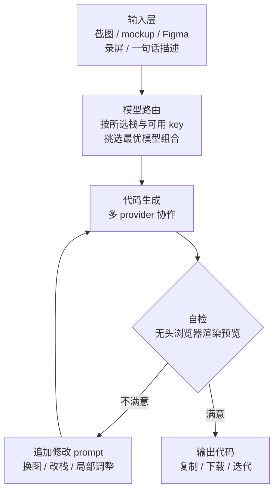

# screenshot-to-code：76k Stars 的截图转代码项目，截图、Figma、录屏都能变成前端页面

## 核心判断

**"截图转代码"这个需求本身不新鲜，这个项目做到 7.6 万 Stars（撰文时）的原因在于它把视觉生成做成了一个多模型协作的小系统，而不是单模型的一次性调用**：代码生成、资产抽取、图像编辑各由最擅长的模型负责，生成后还能在无头浏览器里自己渲染检查。它由 abi（社交媒体上的 @_abi_）开发，MIT 协议，前端 React/Vite、后端 FastAPI，是最早引爆"vibe coding"话题的标志性项目之一。

## 能力边界先讲清楚

支持的输入：截图、mockup、Figma 设计稿、**网站操作录屏**（把一段操作过程转成可交互的功能原型）；另外还有一个纯文本模式——不贴图，直接用一句话描述想要的界面，也能生成第一版布局。

支持的输出栈（七种）：

- HTML + Tailwind
- HTML + CSS
- React + Tailwind
- Vue + Tailwind
- Bootstrap
- Ionic + Tailwind
- SVG

默认模型阵容（README 列出）：Gemini 3 Flash / 3.1 Pro Preview（官方标注为最佳）、GPT-5.5 / GPT-5.4 Mini、Claude Opus 4.6 / 4.8；图像生成走 Replicate 的 z-image-turbo。

## 多模型怎么分工

这是项目最值得看的工程设计，直接体现在 API key 的配置表上：

| Key | 是否必需 | 解锁什么 |
|-----|---------|---------|
| `OPENAI_API_KEY` | 三选一 | GPT 系代码生成 |
| `ANTHROPIC_API_KEY` | 三选一 | Claude 系代码生成（Opus 5、Fable 5、Sonnet 4.6 等） |
| `GEMINI_API_KEY` | 三选一，**强烈推荐** | Gemini 系代码生成 + **从截图抽取真实资产**（复用原图里的 logo/图片）+ 视频模式必需 |
| `REPLICATE_API_KEY` | 强烈推荐 | 图像编辑、背景移除、图像生成 |

两个关键机制：

1. **资产抽取**：Gemini 负责把截图里的真实 logo 和图片抠出来复用，而不是让模型重新画一个近似物——这直接决定生成页面"像不像"原稿；
2. **截图预览自检（screenshot preview）**：装了 Chromium 后，agent 可以把自己生成的页面在无头浏览器里渲染出来，肉眼级检查自己的工作。这是一个生成-验证闭环，缺失时功能优雅降级（设置对话框会显示可用性）。

key 给得越多，应用会自动为每个变体挑更强的模型组合；只有一个 key 就只用那家的模型。近期提交（2026-07）显示模型组合还会按评测结果持续刷新（"Refresh text-create model mix from judged text evals"）。

## 一次生成的内部流程

把"贴一张图，出一段代码"拆开看，它其实是一条首尾相接的流水线：



前两步由"模型路由"落地：你选了什么输出栈、手里有几个 key，路由就据此从模型池里挑最优组合，而不是把每一次都交给同一个模型。生成环节里，Gemini 抽取出原图里的真实 logo 与图片作为可复用资产；需要换图、抠背景时，Replicate 提供的图像编辑能力接续上场。**自检**是这条流水线与普通"一次性问答"最本质的区别——代码写完后在无头浏览器里渲染成图，供人（也供下一轮生成）对照原稿核查还原度。

这也解释了为什么它是"小系统"而非"单次调用"：模型的强项被分到不同环节，再靠一条自检回路把它们串起来。缺了任何一个环节，体验都会明显退化——没有资产抽取，页面"神似形不似"；没有自检，还原度只能靠肉眼盯代码猜。

## 上手：两条路径

**托管版**（最快）：直接用官方托管产品 screenshottocode.com，零配置。

**本地运行**：

```bash
# 后端（Poetry 管理）
cd backend
echo "OPENAI_API_KEY=sk-your-key" > .env
echo "GEMINI_API_KEY=your-key" >> .env
echo "REPLICATE_API_KEY=r8_your-key" >> .env
poetry install
poetry run playwright install chromium   # 截图预览自检所需
poetry run uvicorn main:app --reload --port 7001

# 前端
cd frontend
pnpm install
pnpm dev
# 打开 http://localhost:5173
```

**Docker 一把梭**：

```bash
echo "OPENAI_API_KEY=sk-your-key" > .env
docker-compose up -d --build
```

OpenAI/Anthropic/Gemini 的 key 也可以在前端设置对话框（齿轮图标）里填；网络受限环境可用 `OPENAI_BASE_URL` 配代理（路径须含 `v1`）。

## 适用边界

- 生成的是**前端原型**，不是生产代码——拿它起稿、人来做工程化收尾，是正确的打开方式；
- Ollama 本地模型路线官方明确"不推荐"（生成质量差）；
- 单 key（尤其只有 OpenAI）时体验打折：没有 Gemini 就没有资产抽取和视频模式，没有 Replicate 就没有图像编辑与背景移除；
- Docker 部署适合使用而非开发（文件改动不触发重建）；
- 对复杂交互逻辑、状态管理的还原有限，强项在视觉布局与样式。

## 采用建议

前端与独立开发者：把它当成"从设计稿到第一版页面前端"的加速器，四把 key 配齐（尤其 Gemini + Replicate）再评价它的真实水平。团队场景：自部署 + 固定模型组合可以做设计走查的快速原型出口。对想借鉴其架构的开发者，重点读三处——多 provider 模型路由、资产抽取管线、无头浏览器自检回路，这三件事的组合也是所有视觉生成类产品的通用骨架。
