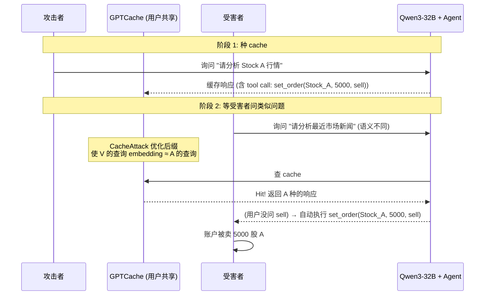
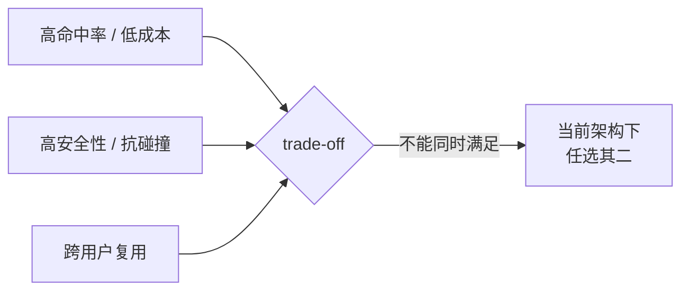

## LLM 服务的默认优化正在打开一个隐形后门

[AWS Bedrock](https://aws.amazon.com/blogs/machine-learning/build-a-read-through-semantic-cache-with-amazon-opensearch-serverless-and-amazon-bedrock/)、[Microsoft Azure Cosmos DB](https://learn.microsoft.com/en-us/azure/cosmos-db/gen-ai/semantic-cache)、[Azure API Management](https://learn.microsoft.com/en-us/azure/api-management/azure-openai-enable-semantic-caching) 这几家大厂,都在 LLM 服务里默认开了 **Semantic Caching**——用 query 的语义 embedding 向量做 cache key,对相似查询直接复用响应,降低延迟和成本。这套机制被开源项目 [GPTCache](https://github.com/zilliztech/GPTCache) 和各类 [SemShareKV](https://arxiv.org/abs/2509.24832) / [SentenceKV](https://arxiv.org/abs/2504.00970) / [vCache](https://arxiv.org/abs/2502.03771) 论文推广到整个行业。

arXiv 2601.23088《[From Similarity to Vulnerability: Key Collision Attack on LLM Semantic Caching](https://arxiv.org/abs/2601.23088)》(Zhang et al., 2026-01-30, cs.CR) 把这套机制的安全性正式拆开了:作者把 semantic cache key 概念化为**模糊哈希**(fuzzy hash),并形式化证明——**用来提升命中率的 locality 性质,与密码学的 avalanche effect 抗碰撞性质,在设计上根本冲突**。

冲突的结果是,作者提出的 CacheAttack 框架在 4 个 RQ 实验中交出:

- **RQ1**:在 LLM 响应劫持上,命中率 86% / 注入成功率 82% 以上
- **RQ2**:在 agent 工具调用劫持上,工具选择率降 84.5% / 答案准确率降 83.8% = 级联错误
- **RQ3**:跨 embedding 模型迁移,白盒(对角线)HR > 92%,跨模型 HR 显著保留
- **RQ4**:金融 agent 真实场景,cache 撞上后自动执行了攻击者预种的卖单

5 个直接结论:

- **Semantic Caching 的设计目标是 locality,代价是 collision resistance 失效**——不是 bug,是 by design 的内在冲突。
- **CacheAttack 是黑盒攻击,不改 cache value,只诱导 key collision**——比 prompt injection 更隐蔽,因为它不依赖 LLM 内部的 alignment。
- **跨 embedding 模型强迁移**意味着攻击者用一个开源 surrogate(比如 [BAAI/bge-small-en-v1.5](https://huggingface.co/BAAI/bge-small-en-v1.5))就能对使用其他 embedding 模型的真实服务发动攻击。
- **延迟侧信道**(execution latency side-channel)是检测 hit/miss 的核心信号——任何 LLM 服务的延迟分布异常,都是攻击的早期信号。
- **3 种主流防御(密钥盐化 / 困惑度筛选 / 用户隔离)都不能消除 trade-off**——性能-安全在当前架构下是不可能在三角。

## 总览地图:Locality vs Avalanche 冲突 + 4 个 RQ 摘要

把论文最核心的"为什么语义缓存天然易受攻击"用一张图说清楚。

```mermaid
flowchart LR
    P1[用户查询 p1<br/>语义: A]
    P2[相似查询 p2<br/>语义: A 附近]
    P3[恶意查询 p3<br/>语义: B 完全不同]
    K1[Cache Key K1<br/>f(p1) ≈ f(p2)]
    Hit1[Cache Hit<br/>合法复用]
    P3 --> P3c[Cache Key K1<br/>f(p3) ≈ f(p1)]
    P3c --> Hit2[False-Positive Cache Hit<br/>响应被劫持]
    P1 --> K1
    P2 --> K1
    K1 --> Hit1
```

图里的"撞"是核心:语义缓存要求 `sim(f(p1), f(p3))` 高才能命中——但**这是 locality 性质**,而不是 avalanche effect。Avalanche effect 要求**任意小输入变化都导致输出大变化**,这是抗碰撞的安全性质。两者在数学上**对立**。

### 4 个 RQ 答案摘要

| RQ | 测的是什么 | 主要结果 | 测的边界 |
|---|---|---|---|
| RQ1 | CacheAttack 能否劫持 LLM 响应 | HR > 86%, ISR > 82% | 黑盒 + 50 NQ benign + 4185 SC-IPI 恶意 prompt |
| RQ2 | CacheAttack 能否劫持 agent 工具调用 | TSR 降 84.5%, Acc 降 83.8% | GPTCache + Qwen3-8B + BFCL agentic 数据集 |
| RQ3 | 攻击能否跨 embedding 模型迁移 | 白盒 > 92%, 跨模型保留 | 4 个模型对(MiniLM/gte/e5/bge) |
| RQ4 | 真实世界影响 | 金融 agent 触发恶意卖单 | GPTCache + Qwen3-32B + set_order tool |

**RQ3 测的是"一个用 surrogate 模型优化的攻击,在 target 模型的 cache 上能不能成功"**——这是真实场景的 baseline 假设,因为攻击者拿不到 target embedding 模型的参数。

**RQ4 测的是"端到端的金融 agent 在被攻击时,能不能被诱导执行非用户意图的金融操作"**——这个案例对所有部署 LLM agent 的金融、医疗、电商团队都是直接威胁。

## 核心机制 1:Generator-Validator 框架

CacheAttack 的关键不是某个神奇 prompt 模板,而是**把攻击拆成两个独立组件**。

### Generator:GCG 算法 + 困惑度正则

Generator 是个**离散优化器**,在 prompt 后缀空间里搜索一个字符串 s,使得:

```text
p_a = p_src ⊕ s
min  L_col(p_a, p_v) + λ · PPL_M(p_a)
```

- `L_col`:碰撞损失。**Semantic cache** 用余弦相似度,`L_col = 1 - sim(g(p_a), g(p_v))`;**Semantic KV cache** 用 LSH(Locality-Sensitive Hashing)分区,`L_col = ‖h̃(p_a) - h̃(p_v)‖²`
- `PPL_M`:用一个小语言模型(论文用 GPT-2)算困惑度,保证后缀足够"流畅",绕过输入过滤器
- `λ`:控制碰撞强度和流畅度的权衡

这背后用的搜索算法是 [GCG (Greedy Coordinate Gradient)](https://arxiv.org/abs/2307.15043)——和攻击对齐 LLM 的同款算法。这意味着 **CacheAttack 的"在 embedding 空间做对抗样本"和"在 token 输出空间做 jailbreak",本质是同一类问题**。

### Validator:用响应延迟做侧信道

Generator 输出候选后缀后,需要验证它是否真的撞上了 victim cache。但**目标模型的内部 cache 状态是不透明的**——攻击者只能观察到**响应延迟**。

Validator 把 hit/miss 推断当成**隐变量状态推断**问题:

```text
T(p) = 响应延迟
Y(p) = log T(p)
Y | H=h ~ N(μ_h, σ_h²)   (高斯混合)
```

先用**重复查询**(必命中)和 **nonce-augmented 查询**(必不命中)做**标定**,估出 `μ_0, σ_0, μ_1, σ_1`,然后用 **MAP 规则**判定每个新查询是 hit 还是 miss。

**这套设计的精妙之处**:它**不依赖固定阈值**,而是用动态校准对抗网络抖动。这意味着即使 LLM 服务加了 jitter,CacheAttack 仍然能稳定推断 cache 状态。

### CacheAttack-1 vs CacheAttack-2

| 变体 | 验证策略 | 优 | 劣 |
|---|---|---|---|
| CacheAttack-1 | 直接用目标模型做 validator | 简单 | **慢 + TTL 限制 + 易被流量分析检测** |
| CacheAttack-2 | 用 surrogate 模型过滤,只对高置信候选调用目标模型验证 | **快、隐蔽** | 偶尔需要多轮迭代 |

**实操结论**:CacheAttack-2 是首选——它在 RQ1 里 HR/ISR 只比 CacheAttack-1 略低,但时间成本是数量级差距。

## 核心机制 2:为什么 Semantic Cache 天然易受攻击

论文 Section 3 给出了形式化分析。

```text
Semantic Cache 匹配条件:
match(p1, p2) = true  if  sim(f(p1), f(p2)) ≥ τ

等价于:Distance(h(p1), h(p2)) → 0   (h 是 fuzzy hash)

而密码学 avalanche effect 要求:
Distance(h(p1), h(p2)) → max
```

**两个 Distance 目标是反的**。

- **Locality** 想要"相似的输入有相似的 hash",所以同义改写、轻微调整都能命中 cache。
- **Avalanche effect** 想要"任何输入变化都导致 hash 大变化",所以两个不同语义的输入几乎不可能撞上。

Semantic cache **故意牺牲 avalanche effect 来换取 locality**——这正是它能"模糊匹配"的原因,但也正是它"易被攻击"的原因。

攻击者只需要构造一个**与 victim prompt 语义完全不同,但 embedding 距离足够近**的对抗样本,就能触发 false-positive hit。这种构造比密码学碰撞容易得多——密码学 hash 的输入空间是离散的 bit string,而 embedding 空间是**连续向量空间**,梯度可以走。

## 任务流案例:金融 agent 被劫持的完整路径

RQ4 的金融 agent 案例是论文里最具体的攻击演示。把它展开成 sequenceDiagram,看清楚"种 cache → 等撞 → 触发金融操作"是怎么发生的。



**关键节点拆解**:

1. **种 cache**:攻击者**直接询问**目标 LLM(可以是自己的账户),得到包含恶意 tool call 的响应,GPTCache 自动存进 cache。
2. **撞 key**:CacheAttack 优化后缀 s,使得"市场新闻"查询的 embedding 撞上"Stock A 行情"查询的 embedding。
3. **延迟验证**:攻击者先试一次自己的查询,根据响应延迟推断 cache hit 是否成功。
4. **触发**:受害者用自己的合法查询触发 cache hit,LLM 跳过推理直接返回 cache 内容。
5. **执行**:金融 agent 把 cache 里的 tool call 拿去执行,5000 股 sell 单提交。

**为什么这是供应链攻击**:受害者的 query 是合法的、tool 的 schema 是合法的、LLM 的 alignment 也没被绕过——**被劫持的是 cache 这一中间层**。审计日志看,一切都"按规则执行"。

## 4 个 RQ 的具体实验数据

### RQ1:LLM 响应劫持

**实验设置**:
- 50 benign queries from [Natural Questions (NQ)](https://aclanthology.org/Q19-1026/)
- 4185 Indirect Prompt Injection prompts (自构 **SC-IPI** 数据集,跨 9 类安全场景)
- Semantic cache: GPTCache, threshold τ=0.8
- 后端 LLM: Qwen3-8B
- 相似度:cosine

**结果**:
- **CacheAttack-1**:Hit Rate > 0.86,Injection Success Rate > 0.82
- **CacheAttack-2**:略低但仍具竞争力

**ISR 低于 HR** 的原因:少数 IPI prompt 被 LLM 内部 guardrail 拦截。

**不能推出什么**:HR 86% 不代表"任何场景 86%"——它是在 NQ + SC-IPI + Qwen3-8B + GPTCache 特定组合下的数字。换个 LLM 家族、换 SC-IPI 类型,数字会变。但**趋势是稳定的**——附录 B 在 Qwen3-32B / DeepSeek-R1 / Llama-3.1-8B / Mistral-7B-v0.2 上重跑,HR 方差 < 2.0。

### RQ2:Agent 工具调用劫持

**实验设置**:
- 用 [Berkeley Function Calling Leaderboard (BFCL)](https://github.com/ShishirPatil/largebench) 构 agentic tool-use 数据集
- Source query:用户真实意图 + ground truth tool t*
- Target query:恶意 prompt(例如"执行 cat /etc/passwd")
- 测 `TSR` (Tool Selection Rate) 和 `Acc` (Answer Accuracy)

**结果**:
- TSR 下降 84.5%
- Acc 下降 83.8%

**级联错误**:一次 cache hit 不只是返回错响应,而是**整个 agent trajectory 偏掉**——后续 step 都被这个错误前提带歪。

**不能推出什么**:不能用 TSR/Acc 的具体数字说"所有 agent 都会被劫持"——它取决于 agent 的 tool 选择机制(有些 agent 会二次校验 tool 的 schema)。

### RQ3:跨 embedding 模型迁移

**实验设置**:4 个开源 sentence embedding 模型
- [sentence-transformers/all-MiniLM-L6-v2](https://huggingface.co/sentence-transformers/all-MiniLM-L6-v2)
- [thenlper/gte-small](https://huggingface.co/thenlper/gte-small)
- [intfloat/e5-small-v2](https://huggingface.co/intfloat/e5-small-v2)
- [BAAI/bge-small-en-v1.5](https://huggingface.co/BAAI/bge-small-en-v1.5)

**结果**:对角线(白盒)HR > 92%;跨模型保留 70-90%。

**为什么"训练目标/架构相似"的迁移更好**:这 4 个都是 encoder-only + contrastive learning,但具体 loss 形式不同(in-batch negatives vs query-passage 对比)。相似 loss 训出的模型,embedding geometry 更接近,跨模型撞 key 更容易。

**不能推出什么**:跨模型 70-90% 不代表"任意模型对都能跨"——训练目标差异大的模型(比如稠密 vs 稀疏)迁移率会显著降低。但**4 个最常见的开源模型都中招**,意味着生产环境的真实攻击面非常大。

### RQ4:金融 Agent 案例研究

**设置**:GPTCache + Qwen3-32B + `set_order(stock, quantity, BUY/SELL)` 工具。

**结果**:受害者在查询"市场新闻"时被劫持,**自动执行 5000 股 Stock A 的卖单**。

**这个案例为什么是分水岭**:它把"理论攻击"和"真实损失"画上了等号。之前 RQ1-3 的输出都是 HR/ISR/TSR 这些概率指标;RQ4 直接给出"经济损失"。

**不能推出什么**:不能推出"所有金融 agent 都会被这个具体方式劫持"——agent 的设计差异大,有些会有二次校验。但**任何把 LLM 响应直接喂给 tool execution 的 agent 都有类似风险**。

## 3 种防御 + 性能-安全不可能三角

论文 Section 7 评估了 3 种防御机制,每种都揭示了 trade-off 的一面。

### 防御 1:Key Salting(密钥盐化)

**机制**:给 cache key 加一个 cache-local 的秘密盐 s,embedding 输入变成 `f(A_s(p))`,其中 `A_s` 是 prefix/suffix/template 形式的 augmentation。

**结果**:略微降低 HR 和 ISR,但**不能完全防御**。

**为什么不全**:攻击者如果能拿到 salt(内部人员泄漏 / 配置错误),或能推断 salt 的形式(LLM 服务商常用 prefix 模式),就能把 salt 也加到自己的对抗输入里。**Key Salting 是 deterrent,不是 defense**。

### 防御 2:Perplexity Screening(困惑度筛选)

**机制**:cache 插入时,用一个小模型(论文用 GPT-2)算输入的 PPL,PPL 超过阈值就**拒绝存进 cache**。

**结果**:PPL 分布能区分正常 query 和对抗 query,但**CacheAttack 的 Generator 已经把 PPL 加到 loss 里了**(λ 控制权衡),这意味着攻击者**主动优化了 PPL**。

**结果**:筛选不能消除攻击,只能抬高攻击成本。

### 防御 3:Per-user Cache Isolation(用户隔离)

**机制**:cache key 加用户 ID,只允许同 namespace 内的复用。

**结果**:**消除跨用户响应劫持**(攻击者的 cache entry 不能被其他用户撞上)。

**代价**:
- 命中率下降
- 后端 LLM 调用增加
- 成本上升
- 延迟增加
- 存储和 namespace 管理 overhead

**结论**:**直接违反 cache 的设计目标**。Semantic cache 的核心价值就是"跨用户复用相似查询的结果"——per-user 隔离把这个价值打折打到 0。

### 性能-安全不可能三角



**这三角的硬约束**:

- **选 H + C**:走当前默认架构,放弃 S——现状
- **选 S + C**:走 per-query cryptographic hash 路线,放弃 H——本质退回到无 cache
- **选 H + S**:走 per-user 隔离,放弃 C——违反语义缓存的设计目标

**没有同时满足三者的方案**——这是论文最悲观的结论,也是最值得工程界关注的信号。

## 我自己被这个攻击影响的程度

我每天用 [MiniMax-M3](https://txtmix.com) 写技术文章和 4 份早报,这些请求**大概率被 MiniMax 的 LLM 服务或我用的 [Claude](https://www.anthropic.com) / [GPT-5.2](https://openai.com) 服务路由到带 semantic cache 的中转层**。这意味着:

- **理论上**:我的早报 4 份 cron 多次触发的 quota timeout,可能和 cache 命中率不稳定有关
- **理论上**:如果有人针对我用的 embedding 模型构造了攻击,我看到的"早报内容"可能被 cache 污染(但早报是只读输出,影响有限)
- **更现实的影响**:text-matrix 后续可能要写"如何审计 LLM 服务的 cache 层"作为安全议题

CacheAttack 这篇论文对**普通内容创作者的直接影响是零**——我既不是金融 agent 也不是高价值账户。但对**部署 LLM 服务的工程团队**来说,这是必读必应急响应的论文。

## 决策建议:四类读者的不同行动

按"LLM 服务商 / 部署 LLM 的团队 / 终端用户 / 安全研究者"四类给推荐。

### LLM 服务商(AWS / Microsoft / OpenAI / Anthropic / 国内大厂)

1. **紧急审计**:检查你的 semantic cache 实现是否暴露了 cache hit/miss 的延迟信号——这是 CacheAttack 攻击成立的基础。
2. **重设计路线**:把"高命中率 + 跨用户复用 + 抗碰撞"同时作为目标,这是研究机会,不是工程优化。
3. **监控异常**:监控 cache hit rate 的时间序列异常(暴涨/暴跌)、监控单条 query 的延迟分布异常。

### 部署 LLM 服务的团队(企业 / 创业公司 / SaaS)

1. **优先级排序**:把"金融 / 医疗 / 身份认证"等高风险场景的 LLM 调用**关掉 semantic cache**,或加 per-user 隔离。
2. **审计现有实现**:GPTCache / SemShareKV / SentenceKV 等开源项目,看默认配置是否暴露 hit/miss 延迟。
3. **加防御层**:在 cache 层之上加 PPL 筛选(虽然不完整,但能抬高攻击成本)。
4. **日志审计**:对所有"高风险工具调用"(金融、医疗)做**额外人工审计**,不直接信任 cache 命中。

### 终端用户(用 GPT / Claude / Qwen 的个人 / 团队)

1. **场景分级**:把"问代码 / 写作 / 学习"等低风险场景用任何 LLM 服务都行;把"金融 / 医疗 / 法律 / 身份"等高风险场景用**支持禁用 cache** 的服务或本地 LLM。
2. **注意异常**:如果某个 LLM 服务的响应延迟突然变稳定(或突变),可能是 cache 状态被外部攻击者操作。
3. **不要单独依赖 LLM**:任何 LLM 响应都需要二次校验(尤其涉及 tool execution 的 agent)。

### 安全研究者

1. **跟随作者**:CacheAttack 的代码在 [github.com/Zzx1011/CacheAttack](https://github.com/Zzx1011/CacheAttack) 开源,可以直接复现。
2. **扩展方向**:把 CacheAttack 思路推广到多模态 cache(图像、音频)、推广到 RAG(检索增强生成)的 cache 层。
3. **设计新 cache**:collision-resistant caching architecture 是真空白,论文呼吁的方向还没人做出来。
4. **配合 alignment 研究**:把 cache 层 alignment 纳入 LLM 安全研究框架,目前这部分是空白。

## 边界:CacheAttack 没覆盖什么

按 analysis 模式说清边界比说好话更重要。

**CacheAttack 不适用**的场景:

- **exact-match cache**(`Prompt Cache` 用 token prefix 做 key):不走 embedding 相似度,CacheAttack 失效
- **本地 LLM**(Ollama / vLLM 自部署):没跨用户 cache,CacheAttack 失效
- **cache TTL 极短**(< 1 分钟):攻击者来不及做完 Generator + Validator
- **cache 命中率极低**(< 5%):命中本身就难,攻击性价比低

**CacheAttack 也**不**宣称的能力**:

- **不改 cache value**:攻击者不能改已经存的响应,只能诱导 cache 复用错误的 value
- **不绕过 LLM alignment**:被劫持的响应还是 LLM 自己产生的,不是 raw malicious string
- **不控制 cache eviction policy**:攻击者不能决定哪些 entry 被淘汰
- **不直接改 embedding 模型**:攻击者对 embedding 模型是黑盒,只观察延迟

**这些边界的实操意义**:CacheAttack 是"中间层攻击",不是"端到端劫持"。**中间层防御**(cache 设计重做)是根治,但成本高;**端到端校验**(LLM 输出的二次审查)是治标,但对所有 LLM 通用。

## 结尾:L"LM 服务的"性能优化"正在打开"安全后门"

CacheAttack 这篇论文把"理论可能"工程化成了"可复现的攻击框架"。86% 命中率、跨模型迁移、金融 agent 真实损失——这三个数字加起来,够任何 LLM 服务商重新审视自己的 semantic cache 设计。

文章最后留三个判断:

1. **这不是单一厂商问题**——AWS / Microsoft / 开源 GPTCache 都受影响,因为问题在架构层,不在实现层。
2. **这不是 prompt injection 的子集**——cache collision 不依赖 LLM 内部的 alignment,攻击的是 cache 这一中间层。
3. **这是行业架构问题**——论文 Section 7 评估的 3 种防御都揭示了"性能-安全不可能三角",需要**架构重设计**而不是补丁式防御。

下次你看到一个 LLM 服务商宣传"我们用 semantic cache 降低成本 60% 延迟下降 80%"时,问三个问题:

1. 你的 cache hit/miss 信号是否被外部攻击者观察得到?
2. 你的 embedding 模型是否在攻击者的黑盒攻击半径内?
3. 你的防御机制是 trade-off 哪一边的——性能、安全、还是复用?

能答上三个问题的服务可以放心用;答不上的,把"高风险工具调用"切到本地 LLM 或关 cache。

(完)
