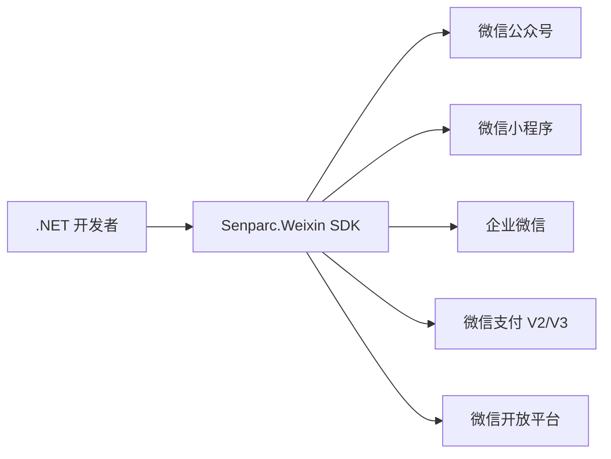
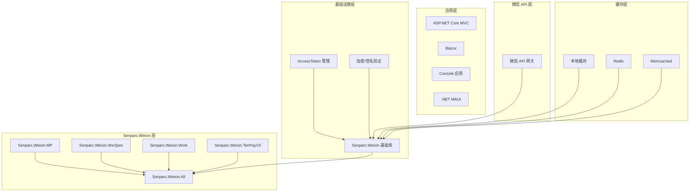
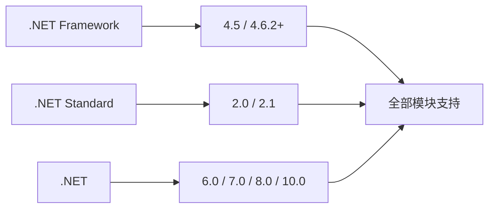
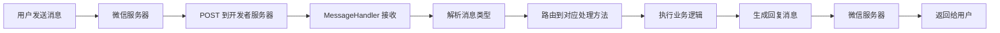
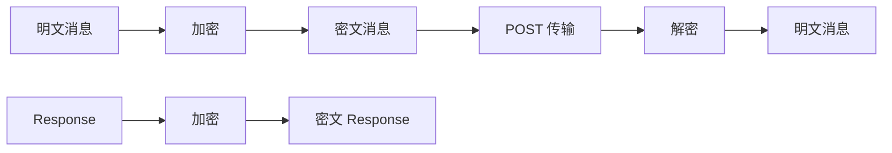
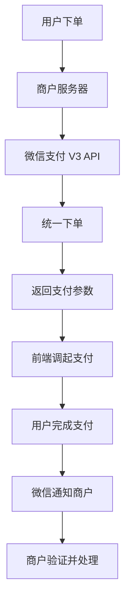

# Senparc.Weixin（微信 .NET SDK）从入门到精通：架构、原理与实战开发

> **目标读者**：.NET 开发者，需要集成微信各平台能力的团队
> **前置知识**：C# 基础、.NET 6/8/10 开发经验、了解 REST API 概念
> **预计阅读时间**：45-60 分钟

---

## 🎯 学习目标

完成本文档后，你将掌握：

- ✅ 理解 Senparc.Weixin 的设计哲学与核心架构
- ✅ 能够快速配置并运行第一个微信公众号应用
- ✅ 掌握消息处理的完整流程（MessageHandler）
- ✅ 熟练使用中间件（Middleware）和控制器（Controller）两种开发模式
- ✅ 集成微信支付、小程序、企业微信等多平台能力
- ✅ 理解分布式缓存策略并应用于生产环境
- ✅ 掌握 AccessToken 自动生命周期管理
- ✅ 完成 AI 能力集成（Senparc.AI）

---

## 一、项目概述与背景

### 1.1 什么是 Senparc.Weixin？

Senparc.Weixin（曾用名 WeiXinMPSDK）是一款开源的微信 .NET SDK，由盛派网络（Senparc）团队开发和维护。**这是目前使用率最高的微信 .NET SDK，也是国内最受欢迎的 .NET 开源项目之一**。

**核心定位**：帮助 .NET 开发者快速、简单地集成微信全平台能力，无需深入理解微信复杂的 API 细节和签名机制。



### 1.2 项目数据

| 指标 | 数值 |
|------|------|
| GitHub Stars | **8.8k** |
| GitHub Forks | **4.4k** |
| 维护历史 | **超过 12 年**（自 2013 年） |
| Commits | **11,074** |
| 贡献者 | 数百位开发者 |
| 许可证 | Apache-2.0 |

### 1.3 为什么选择 Senparc.Weixin？

| 特性 | 说明 |
|------|------|
| **零学习成本** | Hello World 仅需 3 行代码 |
| **全平台覆盖** | 微信公众号、小程序、企业微信、微信支付、开放平台一网打尽 |
| **自动 AccessToken 管理** | SDK 自动处理 Token 刷新，开发者无需关心过期问题 |
| **灵活架构** | 支持中间件模式和控制器模式，可自由选择 |
| **分布式缓存** | 内置 Redis/Memcached 支持，支持自定义扩展 |
| **持续维护** | 12 年如一日，持续跟进微信 API 更新 |
| **.NET 全版本支持** | .NET Framework 4.5 / .NET Standard 2.0+ / .NET 6 / .NET 8 / .NET 10 |

### 1.4 官方资源

| 资源 | 链接 |
|------|------|
| GitHub 仓库 | https://github.com/JeffreySu/WeiXinMPSDK |
| 在线示例 | https://sdk.weixin.senparc.com/ |
| NuGet 包 | https://www.nuget.org/packages/Senparc.Weixin |
| 开发社区 | https://weixin.senparc.com/ |

---

## 二、核心模块架构

### 2.1 模块一览

Senparc.Weixin 采用**模块化设计**，各模块独立发布，可按需引用：

| # | 模块 | 功能 | NuGet 包 |
|---|------|------|----------|
| 1 | **Senparc.Weixin** | 基础库，所有模块的依赖 | `Senparc.Weixin` |
| 2 | **Senparc.Weixin.MP** | 微信公众号 / JSSDK / 摇周边 | `Senparc.Weixin.MP` |
| 3 | **Senparc.Weixin.WxOpen** | 微信小程序（含小游戏） | `Senparc.Weixin.WxOpen` |
| 4 | **Senparc.Weixin.Work** | 企业微信 | `Senparc.Weixin.Work` |
| 5 | **Senparc.Weixin.TenPay** | 微信支付 V2（已不推荐） | `Senparc.Weixin.TenPay` |
| 6 | **Senparc.Weixin.TenPayV3** | 微信支付 V3（推荐） | `Senparc.Weixin.TenPayV3` |
| 7 | **Senparc.Weixin.Open** | 微信开放平台 | `Senparc.Weixin.Open` |
| 8 | **Senparc.Weixin.Cache.Redis** | Redis 分布式缓存 | `Senparc.Weixin.Cache.Redis` |
| 9 | **Senparc.Weixin.Cache.Memcached** | Memcached 分布式缓存 | `Senparc.Weixin.Cache.Memcached` |
| 10 | **Senparc.Weixin.AspNetCore** | ASP.NET Core 集成 | `Senparc.Weixin.AspNetCore` |
| 11 | **Senparc.WebSocket** | WebSocket 支持（独立项目） | `Senparc.WebSocket` |
| 12 | **Senparc.Weixin.All** | 全模块集成包（一步到位） | `Senparc.Weixin.All` |

### 2.2 架构分层



### 2.3 .NET 版本兼容性



---

## 三、快速开始：Hello World

### 3.1 环境要求

- .NET 6.0+（推荐 .NET 8.0 或 .NET 10.0）
- Visual Studio 2022+ 或 VS Code
- 微信公众平台开发者账号
- 微信商户平台账号（如需支付功能）

### 3.2 安装 SDK

**方式一：使用全模块集成包（推荐新手）**

```bash
dotnet add package Senparc.Weixin.All
```

**方式二：按需引用特定模块**

```bash
# 公众号开发
dotnet add package Senparc.Weixin.MP

# 小程序开发
dotnet add package Senparc.Weixin.WxOpen

# 微信支付
dotnet add package Senparc.Weixin.TenPayV3
```

### 3.3 配置 appsettings.json

在 `appsettings.json` 中添加微信配置：

```json
{
  "SenparcWeixinSetting": {
    // 公众号配置
    "Token": "你的Token",
    "EncodingAESKey": "你的EncodingAESKey",
    "AppId": "你的AppId",
    "AppSecret": "你的AppSecret",
    
    // 是否为沙盒模式（开发环境设为 true）
    "IsDebug": true
  }
}
```

### 3.4 三行代码开启微信开发

Senparc.Weixin 的核心理念是**用最少的代码完成最多的功能**。

#### 第一步：注册服务（1 行）

在 `Program.cs` 的 `builder.Build()` **之前**添加：

```csharp
// Program.cs
builder.Services.AddSenparcWeixinServices(builder.Configuration);
```

> 💡 **为什么这样设计？**
> ASP.NET Core 的依赖注入（DI）容器是管理全局服务的最佳场所。将 Senparc.Weixin 注册到 DI 容器中，可以确保整个应用随时可以访问微信能力。

#### 第二步：启用中间件（1 行）

在 `builder.Build()` **之后**添加：

```csharp
var registerService = app.UseSenparcWeixin(app.Environment, null, null, 
    register => { }, 
    (register, weixinSetting) => {
        // 注册公众号账号
        register.RegisterMpAccount(weixinSetting, "【盛派网络小助手】公众号");
    });
```

> 💡 **为什么需要注册账号？**
> 一个应用可能对接多个公众号或小程序。SDK 需要知道每个账号的 AppId、AppSecret、Token 等信息，才能正确调用对应的微信 API。

#### 第三步：调用接口（1 行）

在应用任意位置调用微信接口：

```csharp
// 发送客服消息
await CustomApi.SendTextAsync("AppId", "OpenId", "Hello World!");
```

### 3.5 完整示例：接收并回复消息

创建自定义 MessageHandler 来处理用户消息：

```csharp
/// <summary>
/// 自定义消息处理器
/// </summary>
public class CustomMessageHandler : MessageHandler
{
    public CustomMessageHandler(
        Stream inputStream, 
        PostModel postModel, 
        int maxRecordCount = -1,
        bool outputApiXml = false,
        IServiceProvider serviceProvider = null) 
        : base(inputStream, postModel, maxRecordCount, outputApiXml, serviceProvider)
    {
    }

    public override async Task<IResponseMessageBase> OnTextRequestAsync(RequestMessageText requestMessage)
    {
        var responseMessage = requestMessage.CreateResponseMessage<ResponseMessageText>();
        
        switch (requestMessage.Content.ToUpper())
        {
            case "你好":
                responseMessage.Content = "您好！很高兴为您服务！";
                break;
            case "帮助":
                responseMessage.Content = "发送\"你好\"打招呼，发送\"帮助\"查看功能";
                break;
            default:
                responseMessage.Content = $"您发送了：{requestMessage.Content}\n\n" +
                    "这是一条自动回复消息。";
                break;
        }
        
        return responseMessage;
    }

    public override async Task<IResponseMessageBase> OnImageRequestAsync(RequestMessageImage requestMessage)
    {
        var responseMessage = requestMessage.CreateResponseMessage<ResponseMessageText>();
        responseMessage.Content = "收到图片！";
        return responseMessage;
    }
}
```

然后在 `Program.cs` 中启用消息处理中间件：

```csharp
app.UseMessageHandlerForMp(
    "/WeixinAsync",  // 微信服务器回调地址
    (stream, postModel, maxRecordCount, serviceProvider) => 
        new CustomMessageHandler(stream, postModel, maxRecordCount, false, serviceProvider),
    options => {
        options.AccountSettingFunc = context => 
            Senparc.Weixin.Config.SenparcWeixinSetting;
    });
```

### 3.6 微信公众平台配置

在微信公众平台的**开发 → 基本配置**中设置：

| 配置项 | 说明 |
|--------|------|
| 服务器地址(URL) | `https://你的域名/WeixinAsync` |
| Token | 与 appsettings.json 中的 Token 保持一致 |
| EncodingAESKey | 与 appsettings.json 中的 EncodingAESKey 保持一致 |
| 消息加密方式 | 根据需要选择 |

---

## 四、核心概念深度解析

### 4.1 AccessToken 生命周期管理

**什么是 AccessToken？**

AccessToken 是调用微信 API 的"通行证"。每个 AccessToken 有效期为 **7200 秒（2 小时）**，过期后需要重新获取。

```mermaid
sequenceDiagram
    participant SDK as Senparc.Weixin
    participant Cache as 缓存
    participant Weixin as 微信服务器
    
    SDK->>Weixin: 请求 AccessToken
    Weixin->>SDK: 返回 AccessToken (有效期2小时)
    SDK->>Cache: 存入缓存
    Note over SDK,Cache: 设置缓存过期时间 = 7100秒<br/>(提前100秒刷新)
    
    2小时后
    SDK->>Cache: 检查 Token
    Cache->>SDK: Token 已过期
    SDK->>Weixin: 刷新 AccessToken
    Weixin->>SDK: 返回新 AccessToken
```

**Senparc.Weixin 的优势**：开发者**无需关心** AccessToken 的获取、刷新和存储。SDK 会自动在后台完成这一切。

```csharp
// 开发者只需这样调用
var userInfo = await UserApi.InfoAsync("AppId", "openId");

// SDK 内部自动处理：
// 1. 检查本地缓存的 AccessToken 是否有效
// 2. 如果无效或即将过期，自动获取新 Token
// 3. 使用新 Token 调用微信 API
```

### 4.2 消息处理流程



**MessageHandler 是 Senparc.Weixin 的核心组件**，它负责：

1. **接收**微信服务器转发过来的消息
2. **解析**消息类型（文本、图片、语音、视频、链接等）
3. **路由**到对应的处理方法（OnTextRequestAsync、OnImageRequestAsync 等）
4. **生成**回复消息并返回

### 4.3 中间件模式 vs 控制器模式

Senparc.Weixin 支持**两种开发模式**，适应不同的项目结构和偏好：

| 模式 | 适用场景 | 优点 | 缺点 |
|------|----------|------|------|
| **中间件模式** | 新项目、追求简洁 | 代码量少、自动路由 | 集中式处理，复杂业务需要拆解 |
| **控制器模式** | 已有 MVC 项目、需要细粒度控制 | 完全可控、可复用 MVC 特性 | 需要更多配置 |

#### 中间件模式示例

```csharp
app.UseMessageHandlerForMp(
    "/WeixinAsync",
    (stream, postModel, maxRecordCount, serviceProvider) => 
        new CustomMessageHandler(stream, postModel, maxRecordCount, false, serviceProvider),
    null);
```

#### 控制器模式示例

```csharp
[Route("api/[controller]")]
[ApiController]
public class WeixinController : Controller
{
    [HttpPost]
    public async Task<IActionResult> Post()
    {
        var messageHandler = new CustomMessageHandler(
            Request.Body, 
            Request.GetPostModel());
        
        await messageHandler.ExecuteAsync();
        return Content(messageHandler.ResponseMessage.ToXml(), "text/xml");
    }
}
```

### 4.4 消息加密与安全

微信消息采用 **AES 加密**传输。Senparc.Weixin 内置了完整的加密/解密逻辑：



**关键配置项说明**：

| 配置项 | 说明 |
|--------|------|
| Token | 用于生成签名，验证请求来自微信 |
| EncodingAESKey | 43 位 Base64 字符串，用于 AES 加密 |
| AppId | 公众号唯一标识 |

---

## 五、微信支付开发详解

### 5.1 微信支付 V3 架构



### 5.2 支付集成步骤

#### 第一步：安装微信支付包

```bash
dotnet add package Senparc.Weixin.TenPayV3
```

#### 第二步：配置支付参数

```json
{
  "SenparcWeixinSetting": {
    "TenPayV3_AppId": "商户 AppId",
    "TenPayV3_AppSecret": "商户 AppSecret",
    "TenPayV3_MchId": "商户号",
    "TenPayV3_SubMchId": "子商户号（可选）",
    "TenPayV3_Key": "商户API密钥",
    "TenPayV3_CertPath": "证书路径",
    "TenPayV3_CertPassword": "证书密码"
  }
}
```

#### 第三步：统一下单

```csharp
// 创建订单
var orderData = new
{
    appid = "AppId",
    mchid = "商户号",
    description = "商品描述",
    out_trade_no = "商户订单号",
    time_expire = DateTimeOffset.UtcNow.AddHours(2).ToUnixTimeSeconds(),
    amount = new { total = 1, currency = "CNY" },
    payer = new { openid = "用户 OpenId" },
    notify_url = "https://yourdomain.com/api/tenpay/notify"
};

var result = await TenPayApiV3.UnifiedOrderAsync(orderData);
var prepayId = result.prepay_id;
```

#### 第四步：调起支付

```csharp
// 生成前端调起支付的签名
var package = await TenPayApiV3.PrepayAsync(prepayId);
```

### 5.3 支付回调处理

```csharp
public async Task<IActionResult> Notify()
{
    var stream = await Request.Body.ReadToEndAsync();
    var response = await TenPayApiV3Notify.ParseAsync(Request, stream);
    
    if (response.TradeState == TradeState.SUCCESS)
    {
        // 支付成功，处理订单
        var order = await _orderService.GetByTradeNoAsync(response.OutTradeNo);
        if (order != null && order.Status == OrderStatus.Pending)
        {
            order.Status = OrderStatus.Paid;
            order.PaidAt = DateTime.UtcNow;
            await _orderService.UpdateAsync(order);
        }
        
        return Json(new { code = "SUCCESS", message = "成功" });
    }
    
    return Json(new { code = "FAIL", message = "失败" });
}
```

---

## 六、小程序开发

### 6.1 小程序消息处理

小程序使用**客服消息接口**，处理流程与公众号类似：

```csharp
public class CustomWxOpenMessageHandler : MessageHandler
{
    public CustomWxOpenMessageHandler(
        Stream inputStream, 
        PostModel postModel,
        int maxRecordCount = -1,
        IServiceProvider serviceProvider = null)
        : base(inputStream, postModel, maxRecordCount, false, serviceProvider)
    {
    }

    public override async Task<IResponseMessageBase> OnTextRequestAsync(
        RequestMessageText requestMessage)
    {
        var responseMessage = requestMessage.CreateResponseMessage<ResponseMessageText>();
        responseMessage.Content = $"收到消息：{requestMessage.Content}";
        return responseMessage;
    }
}
```

### 6.2 小程序码生成

```csharp
// 生成小程序码
var qrCodeData = new
{
    scene = "userId=123",
    page = "pages/index/index",
    width = 430
};

var result = await QrCodeApi.CreateAsync(qrCodeData);
// 返回小程序码图片
```

---

## 七、企业微信集成

### 7.1 企业微信的特点

| 特性 | 公众号 | 企业微信 |
|------|--------|----------|
| 面向用户 | 社交用户 | 企业员工/客户 |
| 消息限制 | 48 小时内 | 24 小时内 |
| 外部联系人 | 不支持 | 支持 |
| 应用管理 | 订阅号/服务号 | 应用 |

### 7.2 企业微信消息处理

```csharp
app.UseMessageHandlerForWork(
    "/WorkAsync",
    (stream, postModel, maxRecordCount, serviceProvider) => 
        new CustomWorkMessageHandler(stream, postModel, maxRecordCount, false, serviceProvider),
    null);
```

---

## 八、分布式缓存与性能优化

### 8.1 为什么需要分布式缓存？

在多实例部署（负载均衡）环境下，每个实例都需要 AccessToken。如果不共享缓存，可能导致：

- **Token 冲突**：多个实例同时刷新 Token，浪费 API 调用次数
- **Token 失效**：实例 A 获取的 Token 可能对实例 B 不可用
- **限流风险**：微信 API 有调用频率限制

### 8.2 缓存策略配置

**本地缓存（默认，开发环境）**

```json
{
  "SenparcWeixinSetting": {
    "Cache_Mode": "Local"
  }
}
```

**Redis 缓存（生产环境推荐）**

```bash
dotnet add package Senparc.Weixin.Cache.Redis
```

```json
{
  "SenparcWeixinSetting": {
    "Cache_Mode": "Redis",
    "Redis_CacheConnectionString": "localhost:6379"
  }
}
```

```csharp
// 在 Program.cs 中启用 Redis
builder.Services.AddSenparcWeixinServices(builder.Configuration, 
    senparcWeixinSetting => {
        senparcWeixinSetting.Cache_Mode = CacheMode.Redis;
        senparcWeixinSetting.Redis_CacheConnectionString = "localhost:6379";
    });
```

### 8.3 缓存接口扩展

如果需要支持其他缓存系统，可以实现 `ICache` 接口：

```csharp
public class CustomCache : ICache
{
    private readonly Dictionary<string, CacheEntry> _store = new();
    
    public T Get<T>(string key) where T : class
    {
        if (_store.TryGetValue(key, out var entry) && !entry.IsExpired)
        {
            return entry.Value as T;
        }
        return null;
    }
    
    public void Set(string key, object value, TimeSpan expiry)
    {
        _store[key] = new CacheEntry(value, expiry);
    }
    
    public void Remove(string key)
    {
        _store.Remove(key);
    }
}
```

---

## 九、实践建议

### 9.1 项目结构推荐

```
src/
├── Senparc.Weixin.Config/      # 微信配置
├── Senparc.Weixin.MessageHandlers/  # 消息处理器
├── Senparc.Weixin.Services/    # 业务服务
└── Senparc.Weixin.Workers/     # 后台任务
```

### 9.2 配置管理

**推荐使用环境变量 + 配置文件的组合**：

```csharp
builder.Services.AddSenparcWeixinServices(
    builder.Configuration,
    null, // 使用默认缓存
    null, // 使用默认日志
    (register, weixinSetting) => {
#if DEBUG
        register.RegisterMpAccount(weixinSetting, "测试公众号");
#else
        register.RegisterMpAccount(weixinSetting, "正式公众号");
#endif
    });
```

### 9.3 错误处理

```csharp
public override async Task<IResponseMessageBase> OnTextRequestAsync(
    RequestMessageText requestMessage)
{
    try
    {
        // 业务逻辑
        var result = await SomeService.ProcessAsync(requestMessage.Content);
        
        var responseMessage = requestMessage.CreateResponseMessage<ResponseMessageText>();
        responseMessage.Content = result;
        return responseMessage;
    }
    catch (WeixinException ex)
    {
        // 记录日志
        Logger.LogError(ex, "处理消息失败");
        
        // 返回友好提示
        var responseMessage = requestMessage.CreateResponseMessage<ResponseMessageText>();
        responseMessage.Content = "处理失败，请稍后重试。";
        return responseMessage;
    }
}
```

### 9.4 日志记录

```csharp
// 启用详细日志
builder.Services.AddLogging(logging => 
{
    logging.AddConsole();
    logging.SetMinimumLevel(LogLevel.Debug);
});
```

---

## 十、常见问题

### Q1: 为什么消息回复延迟？

**可能原因**：
1. 服务器响应时间过长
2. 消息量过大，队列堆积
3. 网络延迟

**解决方案**：
- 使用异步处理
- 开启消息队列缓冲
- 优化数据库查询

### Q2: AccessToken 获取失败怎么办？

**检查清单**：
1. ✅ AppId 和 AppSecret 是否正确
2. ✅ 是否已经设置 IP 白名单（如果有）
3. ✅ 微信商户号是否与企业号绑定

### Q3: 如何处理消息加密？

Senparc.Weixin 自动处理加密解密，只需确保配置正确。如果使用"安全模式"，必须提供有效的 EncodingAESKey。

### Q4: 如何支持多公众号？

```csharp
// 注册多个公众号
(register, weixinSetting) => {
    register.RegisterMpAccount(weixinSetting, "公众号A", "AppId_A");
    register.RegisterMpAccount(weixinSetting, "公众号B", "AppId_B");
}
```

### Q5: 消息处理中的 Session 不可用？

微信消息处理每次请求都是独立的 HTTP 调用，传统的 ASP.NET Session 无法使用。Senparc.Weixin 提供了**上下文持久化机制**：

```csharp
public override async Task<IResponseMessageBase> OnTextRequestAsync(
    RequestMessageText requestMessage)
{
    // 使用缓存存储用户状态
    var cache = Cache.GetCache();
    var userState = cache.Get<UserState>($"user_{requestMessage.FromUserName}");
    
    if (userState == null)
    {
        userState = new UserState { Step = 1 };
        cache.Set($"user_{requestMessage.FromUserName}", userState, TimeSpan.FromDays(7));
    }
    
    // 处理业务...
}
```

---

## 十一、AI 集成：Senparc.AI

Senparc.Weixin 正在深度集成 AI 能力，支持：

- **智能客服**：基于大语言模型的自动回复
- **内容生成**：AI 自动生成营销文案
- **知识库问答**：结合企业知识库的智能问答

```csharp
// 集成 Senparc.AI
dotnet add package Senparc.AI

// 在 MessageHandler 中使用 AI（示例，具体 API 请参考 Senparc.AI 文档）
public override async Task<IResponseMessageBase> OnTextRequestAsync(
    RequestMessageText requestMessage)
{
    // 使用 AI 处理消息
    var aiContext = new Senparc.AI.Context.ConversationContext();
    aiContext.Messages.Add(new Senparc.AI.Messages.UserMessage(requestMessage.Content));
    
    var aiResult = await _chatService.ChatAsync(aiContext);
    var reply = aiResult.Content;
    
    var responseMessage = requestMessage.CreateResponseMessage<ResponseMessageText>();
    responseMessage.Content = reply;
    return responseMessage;
}
```

> 💡 **Senparc.AI 集成说明**：Senparc.AI 是盛派网络开发的通用 AI 集成框架，支持 OpenAI、Azure OpenAI、智谱 GLM 等多种大语言模型。具体 API 和集成方式请参考 [Senparc.AI GitHub](https://github.com/Senparc/Senparc.AI)。

---

## 总结

Senparc.Weixin 是 .NET 开发者集成微信能力的不二之选。**12 年的持续维护、简洁的 API 设计、完善的文档**，让它成为国内最具影响力的 .NET 开源项目之一。

**核心优势回顾**：

| 优势 | 说明 |
|------|------|
| 🚀 **3 行代码入门** | Hello World 简单到难以置信 |
| 🔒 **安全可靠** | 自动 AccessToken 管理、AES 加密 |
| 🏗️ **模块化设计** | 按需引用，零耦合 |
| 🌐 **全平台覆盖** | 公众号/小程序/企业微信/支付 |
| ⚡ **性能优化** | 分布式缓存支持 |
| 🤖 **AI 集成** | 支持大语言模型扩展 |

**下一步推荐**：

- [微信支付 V3 实战开发](https://sdk.weixin.senparc.com/Docs/TenPayV3/)
- [企业微信开发指南](https://sdk.weixin.senparc.com/Docs/Work/)
- [Senparc.AI 集成示例](https://github.com/Senparc/Senparc.AI)

---

**文档信息**

- 难度：⭐⭐⭐⭐（专家级）
- 类型：完整教程
- 更新日期：2026-03-30
- 预计阅读时间：45-60 分钟

🦞 由钳岳星君撰写 | 源码：https://github.com/JeffreySu/WeiXinMPSDK
