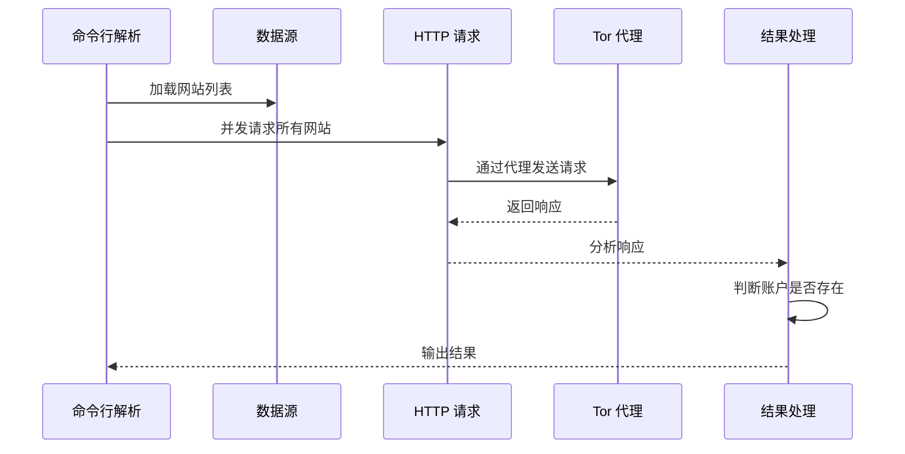

# Sherlock：从入门到精通 — 跨 400+ 社交网络用户名侦查工具

> **目标读者**：安全研究人员、渗透测试工程师、OSINT 爱好者
> **前置知识**：命令行基础、了解 Python 3、了解网络请求概念
> **预计学习时间**：1-2 小时（入门），4-6 小时（精通）

---

## 🎯 学习目标

完成本文档后，你将掌握：

- ✅ 理解 Sherlock 的设计理念与 OSINT 侦查原理
- ✅ 掌握多种安装方式（pipx、Docker、dnf）
- ✅ 熟练使用 Sherlock 进行单用户和多用户查询
- ✅ 理解输出格式（CSV、XLSX、JSON、TXT）
- ✅ 配置 Tor / 代理实现匿名请求
- ✅ 自定义数据源和超时设置
- ✅ 部署 Apify Actor 实现云端运行
- ✅ 理解源码结构并参与开发
- ✅ 掌握批量查询和结果分析方法

---

## 一、项目概述与背景

### 1.1 什么是 Sherlock？

Sherlock（[sherlock-project/sherlock](https://github.com/sherlock-project/sherlock)）是一款开源的 **OSINT（开源情报搜集）工具**，通过用户名在 **400+ 社交网络平台**上搜索目标账户。

**核心定位**：让安全研究人员和渗透测试工程师能够快速发现目标在互联网上的数字足迹。


### 1.2 项目数据

| 指标 | 数值 |
|------|------|
| GitHub Stars | **74.5k** |
| GitHub Forks | **8.8k** |
| 许可证 | MIT |
| 最新版本 | v0.16.0（2025年9月16日） |
| Commits | **2,891** |
| Contributors | **281** |
| 支持网站数 | **400+** |

### 1.3 它解决了什么问题？

| 问题 | Sherlock 的解决方案 |
|------|-------------------|
| 手动在每个平台搜索用户名 | 自动化批量搜索 |
| 不知道哪些平台有账户 | 并发请求 400+ 网站 |
| 匿名性要求 | Tor / 代理支持 |
| 结果分散 | 统一输出（CSV/XLSX/JSON） |
| 云端部署需求 | Apify Actor 支持 |

### 1.4 适用场景

| 场景 | 说明 |
|------|------|
| 渗透测试 | 信息收集阶段快速定位目标账户 |
| 数字取证 | 追踪嫌疑人网络足迹 |
| 品牌保护 | 监控仿冒账户 |
| 个人安全 | 检查自己是否被冒用 |
| OSINT 研究 | 学术研究和社会工程演练 |

### 1.5 与同类工具对比

| 工具 | 覆盖网站数 | 语言 | Tor 支持 | 云部署 | 维护状态 |
|------|-----------|------|---------|---------|-----------|
| **Sherlock** | **400+** | Python | ✅ | ✅ Apify | 活跃 |
| Namechk | 100+ | Web | ❌ | ❌ | 活跃 |
| WhatsMyName | 300+ | Web | ❌ | ❌ | 一般 |
| UserSearch | 50+ | Web | ❌ | ❌ | 一般 |

---

## 二、快速开始：15 分钟入门

### 2.1 环境要求

- Python 3.x
- pip 或 pipx
- Git（可选）
- Tor（可选，用于匿名请求）

### 2.2 安装方式

Sherlock 支持多种安装方式，根据你的操作系统选择合适的方法：

#### 方式一：pipx 安装（推荐）

```bash
# 安装 pipx（如果还没有）
python3 -m pip install pipx
pipx install sherlock-project
```

#### 方式二：pip 安装

```bash
pip install sherlock-project
```

#### 方式三：Docker 安装（无需配置环境）

```bash
docker run -it --rm sherlock/sherlock --help
```

#### 方式四：dnf 安装（Fedora/RHEL）

```bash
sudo dnf install sherlock-project
```

#### 方式五：从源码安装

```bash
# 克隆仓库
git clone https://github.com/sherlock-project/sherlock.git
cd sherlock

# 使用 pip 安装依赖
pip install -r requirements.txt

# 验证安装
python sherlock --help
```

> ⚠️ **注意**：ParrotOS 和 Ubuntu 24.04 的第三方包目前存在兼容性问题，建议使用 pipx 或 Docker 安装。

### 2.3 基本使用

#### 搜索单个用户名

```bash
sherlock user123
```

结果将保存到 `user123.txt` 文件中。

#### 搜索多个用户名

```bash
sherlock user1 user2 user3
```

所有结果将保存到各自对应的文件中。

#### 指定输出文件夹

```bash
sherlock user1 user2 user3 --folderoutput ./results
```

#### 浏览器直接打开结果

```bash
sherlock user123 --browse
```

---

## 三、核心功能详解

### 3.1 命令行参数完整列表

```bash
$ sherlock --help

usage: sherlock [-h] [--version] [--verbose] [--folderoutput FOLDEROUTPUT]
                [--output OUTPUT] [--tor] [--unique-tor] [--csv] [--xlsx]
                [--site SITE_NAME] [--proxy PROXY_URL] [--json JSON_FILE]
                [--timeout TIMEOUT] [--print-all] [--print-found]
                [--no-color] [--browse] [--local] [--nsfw]
                USERNAMES [USERNAMES ...]

Sherlock: Find Usernames Across Social Networks (Version 0.14.3)

位置参数:
  USERNAMES              要搜索的用户名，支持一个或多个

可选参数:
  -h, --help            显示帮助信息
  --version              显示版本和依赖信息
  -v, --verbose         显示调试信息和指标
  --folderoutput FOLDEROUTPUT
                        多用户名时，结果保存到此文件夹
  --output OUTPUT, -o OUTPUT
                        单用户名时，结果保存到此文件
  --tor, -t              通过 Tor 请求（需安装 Tor）
  --unique-tor           每次请求使用新的 Tor 电路
  --csv                  生成 CSV 文件
  --xlsx                 生成 Excel 文件
  --site SITE_NAME       只搜索指定站点
  --proxy PROXY_URL      使用代理，如 socks5://127.0.0.1:1080
  --json JSON_FILE       从 JSON 文件加载数据
  --timeout TIMEOUT     请求超时时间（秒），默认 60
  --print-all            输出所有网站（包括未找到的）
  --print-found          只输出找到的网站
  --no-color             不使用彩色输出
  --browse, -b           在默认浏览器打开结果
  --local, -l            强制使用本地 data.json
  --nsfw                 包含 NSFW 网站检查
```

### 3.2 输出格式详解

#### 3.2.1 文本输出（默认）

```bash
sherlock user123
```

输出示例：

```
[+] Profile found: GitHub
[+] Profile found: Instagram
[-] Profile not found: Twitter
[+] Profile found: LinkedIn
...
```

#### 3.2.2 CSV 输出

```bash
sherlock user123 --csv
```

生成 `user123.csv` 文件，格式：

```csv
Site Name,Site URL,Username Found,Response Message
GitHub,https://github.com/user123,Yes,Found
Instagram,https://instagram.com/user123,Yes,Found
Twitter,https://twitter.com/user123,No,Not Found
```

#### 3.2.3 Excel 输出

```bash
sherlock user123 --xlsx
```

生成 `user123.xlsx` 文件，可在 Excel 中进行数据分析。

#### 3.2.4 JSON 输出

```bash
sherlock user123 --json results.json
```

生成 JSON 格式报告：

```json
{
  "username": "user123",
  "sites_found": [
    {"name": "GitHub", "url": "https://github.com/user123"},
    {"name": "Instagram", "url": "https://instagram.com/user123"}
  ],
  "sites_not_found": [
    {"name": "Twitter", "url": "https://twitter.com/user123"}
  ]
}
```

### 3.3 匿名请求配置

#### 3.3.1 使用 Tor

```bash
# 安装 Tor（macOS）
brew install tor
tor

# 在另一个终端运行 Sherlock
sherlock user123 --tor
```

#### 3.3.2 使用代理

```bash
sherlock user123 --proxy socks5://127.0.0.1:1080
```

#### 3.3.3 Tor + 唯一电路

每次请求使用新的 Tor 出口节点，最大化匿名性：

```bash
sherlock user123 --unique-tor
```

> ⚠️ 注意：`--unique-tor` 会显著增加运行时间，因为每次请求后需要建立新的 Tor 电路。

### 3.4 高级查询选项

#### 3.4.1 只搜索特定网站

```bash
# 只搜索 GitHub 和 Twitter
sherlock user123 --site github --site twitter
```

#### 3.4.2 自定义超时

```bash
# 设置 30 秒超时
sherlock user123 --timeout 30
```

#### 3.4.3 包含 NSFW 网站

```bash
sherlock user123 --nsfw
```

#### 3.4.4 使用本地数据源

```bash
sherlock user123 --local
```

---

## 四、云端部署：Apify Actor

如果你不想在本地安装，可以使用 Apify Actor 在云端运行 Sherlock。

### 4.1 什么是 Apify Actor？

Apify Actor 是一种在 Apify 平台上运行的服务器less 微程序。Sherlock 已被打包为 Apify Actor，可以直接在云端运行。

### 4.2 使用 Apify CLI 运行

```bash
# 安装 Apify CLI
npm install -g apify-cli

# 运行 Sherlock Actor
echo '{"usernames":["user123"],"links":["https://www.1337x.to/user/user123/"]}' | apify call netmilk/sherlock
```

### 4.3 云端运行的优势

| 优势 | 说明 |
|------|------|
| 无需安装 | 直接在浏览器运行 |
| 免费配额 | 每月有一定免费计算时间 |
| 全球分布 | 多个地理位置可选 |
| API 支持 | 可编程调用 |
| 自动扩展 | 无需管理服务器 |

### 4.4 访问地址

- **Apify 页面**：https://apify.com/netmilk/sherlock
- **API 文档**：https://apify.com/netmilk/sherlock/api
- **JS/TS SDK**：https://docs.apify.com/sdk/js
- **Python SDK**：https://docs.apify.com/sdk/python

---

## 五、源码架构解析

### 5.1 目录结构

```
sherlock/
├── .actor/              # Apify Actor 配置
├── .github/             # GitHub Actions CI/CD
├── devel/               # 开发文档
├── docs/                # 用户文档
├── sherlock_project/    # 核心代码
│   ├── __init__.py
│   ├── cli.py           # 命令行接口
│   ├── notify.py        # 通知模块
│   ├── result.py        # 结果处理
│   ├── sherlock.py      # 主逻辑
│   └── data.py          # 数据源管理
├── tests/               # 测试用例
├── pyproject.toml       # 项目配置
├── pytest.ini           # Pytest 配置
├── tox.ini              # Tox 配置
└── Dockerfile           # Docker 配置
```

### 5.2 核心模块

| 模块 | 职责 |
|------|------|
| `sherlock.py` | 主逻辑，遍历网站列表 |
| `data.py` | 管理 400+ 网站数据 |
| `result.py` | 结果格式化和输出 |
| `cli.py` | 命令行参数解析 |
| `notify.py` | 结果通知 |

### 5.3 数据源结构

每个社交网络的数据定义在 `data.py` 中，格式如下：

```python
SITES_DATA = {
    "github": {
        "name": "GitHub",
        "url": "https://github.com/{}",
        "errors": ["Not Found"],
        "headers": {
            "User-Agent": "Mozilla/5.0 ..."
        }
    },
    # ... 400+ more sites
}
```

### 5.4 请求流程



---

## 六、扩展开发指南

### 6.1 添加新网站

如果你想添加 Sherlock 不支持的网站，可以在 `data.py` 中添加：

```python
# 添加到 SITES_DATA 字典
"mywebsite": {
    "name": "My Website",
    "url": "https://mywebsite.com/user/{}",
    "errors": ["User not found", "404"],
    "rate_limit": {
        "success": 1,
        "fail": 0
    }
}
```

### 6.2 贡献代码

1. **Fork 仓库**

2. **创建分支**

```bash
git checkout -b feature/new-site
```

3. **添加网站或修复问题**

4. **运行测试**

```bash
# 安装开发依赖
pip install -r requirements.txt

# 运行测试
pytest tests/

# 运行 lint
flake8 sherlock_project/
```

5. **提交 Pull Request**

### 6.3 测试覆盖

```bash
# 完整测试
pytest tests/ -v

# 带覆盖率报告
pytest tests/ --cov=sherlock_project

# 只运行特定测试
pytest tests/test_sherlock.py -v
```

---

## 七、使用场景实战

### 7.1 渗透测试信息收集

在渗透测试的信息收集阶段，使用 Sherlock 快速定位目标的网络足迹：

```bash
# 假设目标是 "john.doe"
sherlock "john.doe" --tor --output john-doe-report

# 查看哪些网站有账户
cat john-doe-report.txt | grep "Profile found"
```

### 7.2 品牌保护监控

企业安全团队可以使用 Sherlock 监控品牌被冒用的情况：

```bash
# 监控公司名称
sherlock "yourcompany" --print-found --csv --output company-monitor.csv

# 定期运行并比对结果
diff old-report.csv new-report.csv
```

### 7.3 数字取证追踪

在数字取证场景中，追踪嫌疑人的网络活动：

```bash
# 使用 Tor 保持匿名
sherlock "suspect_username" --unique-tor --json forensic-result.json

# 分析 JSON 结果
python analyze_forensic.py forensic-result.json
```

### 7.4 批量查询

对于多个目标，使用批量查询提高效率：

```bash
# 准备用户名列表
echo -e "user1\nuser2\nuser3\nuser4" > targets.txt

# 批量查询
while read user; do
    sherlock "$user" --csv --folderoutput ./batch-results/
done < targets.txt
```

---

## 八、最佳实践

### 8.1 匿名使用建议

| 场景 | 推荐配置 |
|------|----------|
| 基本使用 | 直接请求 |
| 隐私要求 | `--tor` |
| 高隐秘要求 | `--unique-tor` |
| 绕过地域限制 | `--proxy` |

### 8.2 结果分析

```bash
# 只显示找到的账户
sherlock user123 --print-found

# 显示详细日志
sherlock user123 --verbose

# 生成多种格式报告
sherlock user123 --csv --xlsx --json report.json
```

### 8.3 性能优化

| 优化项 | 方法 |
|--------|------|
| 减少超时 | `--timeout 10`（快速失败） |
| 并发请求 | 默认已支持 |
| 使用本地数据 | `--local` |
| 选择性网站 | `--site github --site twitter` |

---

## 九、常见问题

### Q1: 安装失败怎么办？

**解决方案**：
1. 确保 Python 版本 >= 3.7
2. 使用虚拟环境：
```bash
python3 -m venv sherlock-env
source sherlock-env/bin/activate
pip install sherlock-project
```

### Q2: Tor 请求超时？

**可能原因**：
- Tor 未正确安装或运行
- 网络连接问题
- Tor 出口节点被封

**解决方案**：
```bash
# 确认 Tor 运行
tor --version

# 使用代理代替
sherlock user123 --proxy socks5://127.0.0.1:9050
```

### Q3: 结果不准确？

**可能原因**：
- 某些网站更新了检测逻辑
- 网络问题导致请求失败

**解决方案**：
- 使用 `--local` 强制使用本地数据源
- 检查 `--verbose` 日志排查问题
- 提交 Issue 或 Pull Request 更新检测逻辑

### Q4: 如何处理 Rate Limit？

**解决方案**：
- 使用 `--timeout` 增加超时时间
- 使用 `--tor` 切换 IP
- 使用代理池轮换 IP

### Q5: 支持中文网站吗？

**支持**。Sherlock 支持许多中文平台，包括但不限于：
- 微博
- 知乎
- 豆瓣
- 哔哩哔哩

---

## 十、总结

Sherlock 是一款强大的 OSINT 侦查工具，它的价值在于：

| 优势 | 说明 |
|------|------|
| 🔍 **全面覆盖** | 400+ 社交网络一网打尽 |
| ⚡ **高效快速** | 并发请求，秒级完成 |
| 🔒 **隐私保护** | Tor / 代理支持 |
| 📊 **多格式输出** | CSV/XLSX/JSON/TXT |
| ☁️ **云端运行** | Apify Actor 无需安装 |
| 🛠️ **易于扩展** | 添加新网站简单 |
| 📈 **活跃维护** | 281 位贡献者持续更新 |

**下一步推荐**：

1. [安装 Sherlock](#二快速开始15-分钟入门)：选择适合你的安装方式
2. [尝试基本查询](#三核心功能详解)：搜索一个用户名看看效果
3. [阅读源码](#五源码架构解析)：深入理解工作原理
4. [贡献代码](#六扩展开发指南)：为项目添砖加瓦

---

**文档信息**

- 难度：⭐⭐⭐（进阶）
- 类型：完整教程
- 更新日期：2026-03-31
- 预计学习时间：1-2 小时（入门），4-6 小时（精通）
- GitHub：https://github.com/sherlock-project/sherlock

🦞 由钳岳星君撰写 | 项目源码：https://github.com/sherlock-project/sherlock