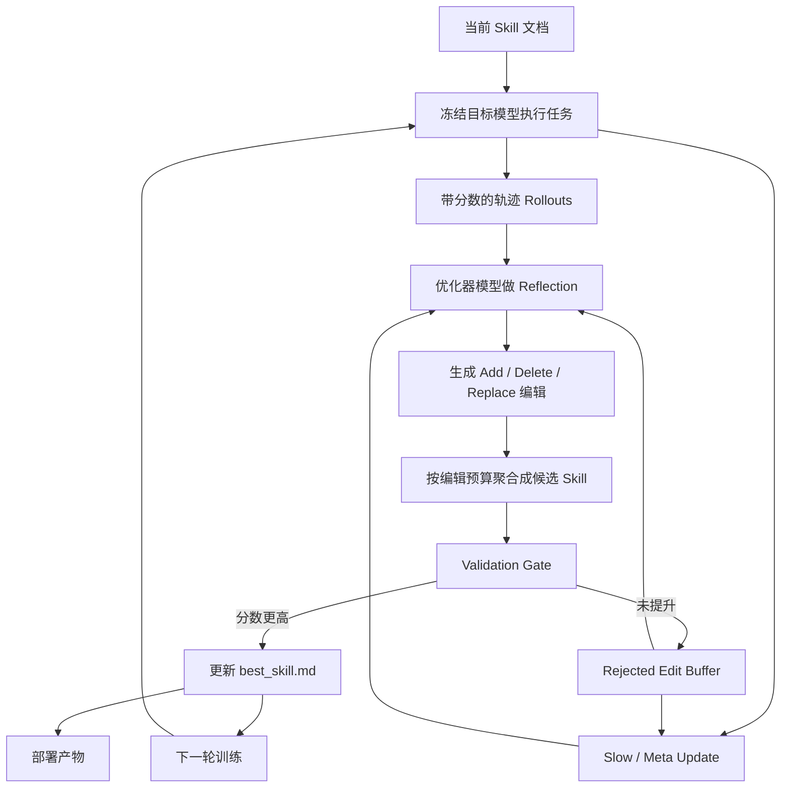

SkillOpt 最值得注意的地方，不是它把 prompt 换了个名字，而是它把 Agent 的程序性知识从“人手改提示词”推进到了“可训练的外部状态”。模型权重不动，执行环境不动，真正被训练的是那份指导 Agent 如何取证、调用工具、验证结果、组织输出的 Skill 文档。

如果你正在做闭源大模型上的 Agent，这个思路很关键。很多时候你改不了权重，LoRA 或 SFT 也不现实，真正能持续迭代的适配层只剩下 prompt、tool policy、workflow instruction 这类文本工件。SkillOpt 的贡献，不是发明了“文本可优化”这件事，而是把 Skill 这类文本工件明确拉进了一个带步长控制、验证门和失败记忆的训练框架。

## 学习目标

读完这篇文章，你应该能够：

1. 解释 SkillOpt 为什么不是普通的 prompt 优化，而是一套面向 Agent Skill 的训练回路
2. 区分 Skill 文档、优化器侧记忆和目标模型权重三者的边界
3. 说清 rollout、reflection、bounded edit、validation gate、slow/meta update 各自解决什么问题
4. 看懂论文里的 52 个评估单元、迁移实验和消融实验究竟说明了什么，又不能推出什么
5. 判断自己的 Agent 系统是否值得引入类似 SkillOpt 的机制，以及应该从哪里开始

## 目录

- [核心判断](#核心判断)
- [先看系统地图](#先看系统地图)
- [SkillOpt 到底在训练什么](#skillopt-到底在训练什么)
- [一次更新是怎么发生的](#一次更新是怎么发生的)
- [为什么它更稳定](#为什么它更稳定)
- [它和同类方法差在哪](#它和同类方法差在哪)
- [一个具体任务流案例](#一个具体任务流案例)
- [实验结果该怎么看](#实验结果该怎么看)
- [迁移结果为什么重要](#迁移结果为什么重要)
- [学到的 Skill 长什么样](#学到的-skill-长什么样)
- [仓库实现透露了什么工程信号](#仓库实现透露了什么工程信号)
- [适用边界与局限](#适用边界与局限)
- [落地顺序建议](#落地顺序建议)
- [总结](#总结)
- [参考资料](#参考资料)

## 核心判断

我对这篇论文的判断很直接：**SkillOpt 不是在替代模型训练，而是在补上闭源 Agent 时代缺失的“外部策略训练层”。**

过去两年，行业在 Agent 上主要有三种常见做法：

| 做法 | 典型方式 | 常见问题 |
| --- | --- | --- |
| 手工写 Skill | 工程师凭经验写规则和流程 | 可维护，但很难持续逼近最优 |
| 一次性生成 Skill | 让强模型直接生成一版 prompt / skill | 起步快，但后续没有稳定迭代路径 |
| 自我反思式改写 | 让模型根据失败轨迹自己重写说明 | 可能有效，但容易大幅漂移，越改越偏 |

这三类方法有一个共同缺口：**没有谁真正像优化器那样工作。** 它们没有明确的步长控制，没有独立的验证门，没有对失败编辑的记忆，也没有跨轮次的稳定更新机制。

SkillOpt 要解决的正是这个缺口。它不是让模型“更会写提示词”，而是把 Skill 更新这件事变成了一个有训练集、留出选择集、测试集、步长、门控、记忆和导出工件的过程。

## 先看系统地图

先不要急着记术语，先看这套系统里到底有哪些对象在流动：



这张图里最重要的不是“优化器模型”四个字，而是三个边界：

1. **目标模型被冻结**。SkillOpt 不改权重，目标模型只负责执行任务。
2. **Skill 文档是训练对象**。它是唯一要被持续编辑和导出的文本工件。
3. **优化器侧有自己的记忆，但不会跟着部署**。例如 rejected-edit buffer、meta skill，这些都服务训练，不属于最终线上产物。

这三个边界决定了 SkillOpt 的工程意义：它把“训练过程需要的复杂性”留在离线阶段，把“线上部署需要的简洁性”留给 `best_skill.md`。

## SkillOpt 到底在训练什么

论文里反复强调，Skill 是 frozen agent 的 external state。这个说法如果只停在概念上，很容易显得抽象。更清楚的理解方式是把系统拆成三层：

| 层 | 里面是什么 | 训练时会变吗 | 部署时会带上吗 |
| --- | --- | --- | --- |
| 目标模型层 | GPT / Qwen 这类 target model | 不会 | 会 |
| Skill 工件层 | 程序、规则、工具策略、输出约束 | 会 | 会 |
| 优化器记忆层 | rejected edits、meta skill、slow update 痕迹 | 会 | 不会 |

这意味着 SkillOpt 训练的不是“文本表面”，而是**文本承载的程序性知识**。一份 Skill 文档通常包含下面几类信息：

- 什么时候该调用工具，什么时候先继续推理
- 调工具后要不要二次验证
- 输出格式要满足哪些约束
- 常见失败模式应该怎样规避
- 在某个 benchmark 或 harness 下，哪些操作顺序更稳

这也是为什么论文里会频繁使用 “procedure” 这个词。SkillOpt 真正在逼近的，不是更漂亮的措辞，而是更可靠的执行程序。

## 一次更新是怎么发生的

如果把 SkillOpt 看成一个“文本版优化器”，那它的一次更新大致可以拆成五步。

### 1. Rollout：先让当前 Skill 真的跑起来

给定当前 Skill `s`、目标模型 `M`、任务样本 `x` 和执行环境 `h`，系统先得到一条带分数的轨迹：

```text
trajectory, reward = h(M, x, s)
```

这里的轨迹不只是最终答案，还包括中间消息、工具调用、验证结果、失败位置等信息。对 Agent 系统来说，这些中间痕迹往往比最终答错本身更重要，因为真正要修的是过程，不只是结果。

### 2. Reflection：把成功和失败拆开看

SkillOpt 不直接从单条轨迹下结论，而是把多条轨迹分成 success minibatch 和 failure minibatch，再让优化器模型做 reflection（反思归纳）。

这么做有两个原因：

- 单条轨迹很容易带有偶然性，适合 debug，不适合提炼可复用规则
- 多条相似失败放在一起，更容易暴露程序性缺陷，例如“总是没有校验工具输出”“总是先查错表格页”“总是跳过最后一步核验”

换句话说，SkillOpt 不是在问“这次为什么错了”，而是在问“这些错误背后是不是有一个能写进 Skill 的共性程序”。

### 3. Edit：输出结构化编辑，而不是整篇重写

优化器模型输出的不是“给你一版更好的全文”，而是结构化的 add / delete / replace 编辑。论文里把这一层叫 bounded text updates（受限文本更新），本质上是在文本空间里加一个学习率。

这一步的意义非常大。很多 prompt 自修方法失控，问题并不在模型不会反思，而在**它一改就是大改**。规则一旦大幅重写，局部修复很容易带来整体回归。

### 4. Gate：只有过了验证门，编辑才算数

候选 Skill 必须在 held-out validation split（留出验证集）上重新跑分，只有**严格优于**当前最好版本，编辑才会被接受。

这个门非常像训练里的 selection criterion。它让 SkillOpt 从“模型提建议”变成“模型提建议，但系统只接收被验证过的建议”。

也正是因为这个 gate 存在，SkillOpt 才更像训练，而不是一套包装得更复杂的 prompt chaining。

### 5. Memory：被拒绝的编辑也不是白费

论文里我最喜欢的设计之一，是 rejected-edit buffer。很多系统里，失败的修改尝试会被直接丢掉；SkillOpt 则把它们显式保存下来，作为后续 reflection 的负反馈。

这很像在告诉优化器模型两件事：

- 这个方向试过了，不行
- 你现在该避开的是哪类编辑，而不只是继续堆更多“看起来合理”的建议

这让训练过程开始具备“少走回头路”的能力。

## 为什么它更稳定

如果只看表面，SkillOpt 和很多“自我反思改 prompt”工作都像是在做文本更新。但两者的差别并不小。

| 维度 | 普通自我改写 | SkillOpt |
| --- | --- | --- |
| 证据来源 | 常常只看几条失败样例 | 看带分数的 rollout 批次 |
| 更新粒度 | 容易整段重写 | 以 add / delete / replace 为主 |
| 步长控制 | 通常没有 | 有编辑预算 `L_t` 和调度器 |
| 接受条件 | 往往默认采纳 | 必须过 held-out gate |
| 失败记忆 | 通常没有显式记忆 | 有 rejected-edit buffer |
| 长周期稳定性 | 容易震荡 | 有 epoch-wise slow/meta update |
| 部署产物 | 常常混着训练提示 | 导出紧凑的 `best_skill.md` |

论文里有一个很重要的实验观察：**bounded update 比随意重写稳定得多。** 这不是枝节，而是文本优化能否真正工程化的前提。没有步长控制，优化器就容易从“修局部问题”滑向“推翻整套规则”。

另外，slow update 和 meta update 也很关键。前者把跨 epoch 反复出现的教训写进 protected field，后者把优化器自己学到的经验沉淀成 meta skill。两者合起来，系统才不至于每一轮都只围着当前 batch 打转。

## 它和同类方法差在哪

论文的对比组并不只是在跟“人工写得好不好”竞争，还覆盖了几类已经在尝试把执行经验转回文本工件的方法：Human Skill、One-shot LLM Skill、Trace2Skill、TextGrad、GEPA、EvoSkill。

但这里需要避免过度简化。SkillOpt 并不是凭空出现在一片空白里。论文的 related work 自己就把邻近路线分成两类：

1. **prompt auto tuning 和 agent-configuration search**：比如 TextGrad、GEPA 这类，把 prompt、配置或系统设计当成可优化对象
2. **skill construction 和 skill evolution**：比如从轨迹、失败分析、经验库里生成或演化技能工件

SkillOpt 真正往前推的一步，不是“只有它会改文本”，也不是“只有它会从轨迹学经验”，而是把这些已有方向里比较分散的能力，收束成了一套更接近训练器的流程。

换成工程语言，就是下面这张表：

| 关注点 | 邻近方法常见做法 | SkillOpt 的强化点 |
| --- | --- | --- |
| 优化对象 | prompt、配置、经验总结、skill 库里的某个工件 | 明确聚焦一份可部署的 Skill 文档 |
| 更新依据 | 评分、轨迹、反思、候选搜索 | 带分数的 rollout 批次与 success / failure 反思 |
| 更新方式 | 重写、进化、蒸馏、搜索 | bounded add / delete / replace |
| 接受条件 | 可能有选择，但不一定严格 held-out | 明确的 validation gate，且要求严格提升 |
| 长期记忆 | 依方法而异，常常较弱或分散 | rejected-edit buffer + slow/meta update |
| 部署产物 | 有时是 prompt，有时是多组件配置 | 单个 `best_skill.md` 工件 |

所以更准确的说法不是“SkillOpt 第一次想到改 Skill”，而是：**它把 Skill 优化组织成了一套更可控、可验证、可导出的训练过程。**

## 一个具体任务流案例

论文里最亮眼的提升之一来自 SpreadsheetBench。这个 benchmark 很适合用来说明 SkillOpt 训练的到底是什么。

假设任务是：让 Agent 打开一个财务表格，判断“华东区 Q2 的毛利率是否高于 Q1，并给出依据”。一个初始 Skill 往往会犯下面几类错：

1. 先在错误的 sheet 上查数
2. 读到单元格值后直接下结论，不检查公式和单位
3. 没有核对区域维度，把全国汇总当成华东区
4. 最后只输出结论，不带可追溯依据

如果只是让模型自己重写 prompt，很可能得到一版更长、更像“注意事项大全”的文本，但不一定真的解决这些错。SkillOpt 的路径不一样：

1. 当前 Skill 先跑一批类似表格任务，收集成功与失败轨迹
2. 优化器在 failure minibatch 里发现，错误集中出现在 sheet 选择、公式核对和证据回填三个位置
3. 它不重写整篇 Skill，而是提出几条结构化编辑，例如：
   - 加一条规则：先确认工作表名称与业务区域是否匹配
   - 加一条规则：引用数值前先检查是否为公式结果、百分比还是原始分子分母
   - 替换输出规范：答案必须附带单元格坐标或表格片段依据
4. 候选 Skill 再去 validation split 上验证，只有分数真的提升才接受

这一轮训练留下来的，实际上不是“针对某张表的技巧”，而是一套**面向表格任务的程序性检查顺序**。这就是为什么论文后面会看到跨 harness 和跨模型的迁移增益。

## 实验结果该怎么看

论文主结果很强：**Across six benchmarks, seven target models, and three execution harnesses, SkillOpt 在 52 个评估单元上全部取得最佳或并列最佳。**

先补一句这个 headline 的读法。这里的“52 个评估单元”，指的是不同模型、基准和执行环境组合出来的实验格子；主结果表报告的是 held-out test split 上的准确率或成功率变化。也就是说，它主要在测：**当任务、模型和 harness 固定后，Skill 这层程序指导被训练过之后，Agent 的最终完成质量能提高多少。**

如果只摘几个 headline，最容易记住的是 GPT-5.5 的平均增益：

| 设置 | 基线到 SkillOpt 的平均提升 |
| --- | --- |
| Direct Chat | +23.5 |
| Codex agentic loop | +24.8 |
| Claude Code agentic loop | +19.1 |

在 direct chat 条件下，GPT-5.5 的若干单项提升也很夸张：

- SearchQA：`77.7 -> 87.3`，提升 `+9.6`
- SpreadsheetBench：`41.8 -> 80.7`，提升 `+38.9`
- OfficeQA：`33.1 -> 72.1`，提升 `+39.0`
- DocVQA：`78.8 -> 91.2`，提升 `+12.4`
- LiveMathematicianBench：`37.6 -> 66.9`，提升 `+29.3`
- ALFWorld：`83.6 -> 95.5`，提升 `+11.9`

但真正值得解读的，不只是“涨了很多”，而是**哪些地方涨得多，说明了什么**。

### 1. 工具链和流程约束越重，SkillOpt 往往越有空间

SpreadsheetBench 和 OfficeQA 这种需要多步工具调用、格式约束和结果核验的任务，提升特别明显。这说明 SkillOpt 最擅长优化的是“过程”，而不是单次回答的文采。

### 2. 不同 harness 都有效，说明 Skill 不是绑死在单一界面上的

论文同时覆盖 direct chat、Codex、Claude Code。这个结果很重要，因为它意味着 SkillOpt 学到的不是某个 UI 按钮顺序，而是更底层的执行程序。

### 3. “52/52 全胜”不等于“所有 Agent 任务都该上 SkillOpt”

这个结果证明的是：在六个 benchmark、七个模型、三种 harness 的组合里，SkillOpt 非常稳。它**不能直接推出**：

- 所有开放域任务都会同样受益
- 没有可验证 reward 的任务也适合这样训
- 更长、更复杂的多 skill 组合场景一定还能保持同样增幅

看论文结果，最有价值的方式不是把它当成“通用银弹”，而是把它当成一条很强的工程原则：**只要任务能被反复执行、能稳定打分、程序性错误会重复出现，Skill 就值得被训练。**

再补一个容易被忽略的点：这些 benchmark 主要测的是**程序执行质量**，不是品牌意义上的“模型智商”。SpreadsheetBench、OfficeQA、ALFWorld 这类提升大，更多说明 SkillOpt 改善了工具使用顺序、核验步骤和输出约束，而不是把底层模型本体变强了。

### 4. 还要看“它赢的是谁”

论文在摘要和引言里用了一个重要限定：SkillOpt 击败的是**per-cell competitor**。这句话的意思不是“它在所有可能方法上都绝对最强”，而是“对每个实验格子，都拿该格子里表现最强的基线来比，它仍然赢或并列赢”。

这个限定很重要，因为它避免了一个常见误读：不是所有 baseline 都在每个设置里同时出现，也不是每种方法都天然适用于每个 harness。论文的强点，在于它面对的是逐格挑出的最强对手，而不是一组刻意放弱的陪跑配置。

## 迁移结果为什么重要

论文的迁移实验比 headline 更能说明 SkillOpt 的上限，因为它在回答一个更根本的问题：训练出来的到底是“模型特定提示词”，还是“可复用程序知识”。

### 跨模型迁移

在 SpreadsheetBench 上，用 GPT-5.4 优化出的 Skill 迁移到更小模型后仍然有效。对 GPT-5.4-mini，直接优化分数约为 `47.5`，迁移后达到 `45.5`；对 GPT-5.4-nano，直接优化分数约为 `42.5`，迁移后为 `26.5`。这说明迁移不是无损的，但也不是一碰就碎。

### 跨 harness 迁移

更有意思的是 Codex 和 Claude Code 之间的互迁。在 SpreadsheetBench 上，Codex 训练出来的 Skill 迁到 Claude Code，可把基线 `22.1` 拉到 `81.8`；反过来，Claude Code 训练出来的 Skill 迁到 Codex，也能把 `27.5` 拉到 `71.1`。

这组结果的含义非常强：**Skill 文档里编码的是程序和约束，不只是某个 harness 的表面命令。**

### 跨 benchmark 迁移

在数学任务上，从 OlympiadBench 到 Omni-MATH 的迁移增益虽然不大，但仍然为正。这类结果说明 SkillOpt 学到的有一部分是“解题程序”，不是只适用于单一数据集格式的模板。

综合看，迁移实验支持一个很重要的结论：**训练出来的 Skill 是一种独立工件。** 它既不同于模型权重，也不同于一次性 prompt 草稿，更接近可复查、可携带、可复用的“程序性资产”。

当然，迁移实验也有边界。它说明“同一类任务里的程序知识有可搬运性”，不等于“任意领域之间都能直接迁移”。从表格到表格、从数学到相近数学成立，不代表从文档问答迁到编程 Agent 也会同样顺滑。

## 学到的 Skill 长什么样

如果只看方法图，SkillOpt 很容易被理解成“把一堆训练术语搬到 prompt 上”。论文在 4.4 节和 4.5 节里其实给了更关键的信息：**最终学到的 Skill 并不长，也不是实例记忆堆砌出来的补丁墙。**

有几个结果很值得记住：

- 部署产物通常是 `300–2,000` tokens 的 `best_skill.md`
- 很多实验里，最终最优 Skill 只靠 `1–4` 次被接受的编辑就成形
- 论文把这一点总结为 compact、inspectable、procedural rather than instance-specific

这三点合起来说明一件事：SkillOpt 学到的不是“把更多提醒写进去”，而是**把真正有用的程序规则留下来，把无效或偶然的内容挡在验证门外。**

这也是为什么我不太赞成把它理解成“自动写一篇更长的 system prompt”。如果最后留下来的有效更新只有几条，反而说明这套方法真正擅长做的是**提纯规则**，不是扩写说明书。

## 仓库实现透露了什么工程信号

论文之外，开源仓库也很值得看，因为它暴露了作者认为这套方法在工程上需要哪些支撑。

### 1. 训练输出不是只有一份 `best_skill.md`

仓库默认会保存 `history.json`、`runtime_state.json`、每一步的 `skills/skill_vXXXX.md`、`steps/step_XXXX/`、`slow_update/epoch_XX/`、`meta_skill/epoch_XX/` 等产物。这个设计很像真正的训练系统，而不是一个单次 prompt optimizer。

这意味着作者默认你会关心：

- 哪一步提升了，哪一步退化了
- 某次接受的编辑到底改了什么
- slow update 和 meta skill 是否真的在起作用
- 训练中断后能否从上次状态继续

### 2. 数据组织方式明显偏“训练框架”而不是“prompt playground”

仓库要求显式准备 `train/`、`val/`、`test/` split，并用 benchmark 对应的 dataloader 读取。这说明 SkillOpt 的前提不是“我有几个失败案例”，而是“我已经能把任务组织成可重复执行、可分片评估的数据集”。

### 3. 部署时没有额外优化器调用，但离线训练并不便宜

这是 SkillOpt 最吸引人的一点，也是最容易被误解的一点。论文和项目页都强调**部署零额外模型调用**，因为线上只需要目标模型和最终 Skill 工件。

但别忘了另一半：离线阶段要反复 rollout、reflection、validation，这本身是有成本的。它适合高频、可复用、值得离线投资的 Agent 场景，不适合一次性的短促任务。

### 4. 仓库已经开始暴露“硬门控可能卡住训练”的现实问题

README 里提到社区提供了 `soft_gate.yaml` 作为参考配置，用来处理 selection split 很小、reward 又偏连续时，hard gate 容易把所有候选都拒掉的情况。

这条信息很工程化，也很诚实。它说明 validation gate 是核心机制，但具体怎么 gate，仍然是一个要根据任务分布调整的设计问题。

### 5. 论文方法和仓库能力之间要分开看

还有一个写文章时很容易混掉的边界：论文报告的是主方法和论文实验；仓库则已经开始朝“可复现框架”扩展，例如文档站、WebUI、社区配置、后续的 SkillOpt-Sleep 预览等。

写解读时最好把两者分开：

- **能算论文结论的**：以论文主文和附录实验协议为准
- **能算工程信号的**：以仓库和文档站当前能力为准

不把这条线划清，文章很容易出现一种低级错误：把“后续仓库演进出来的能力”误写成“论文已经验证过的结论”。

## 适用边界与局限

SkillOpt 很强，但它也有明显边界。

### 适合的场景

- 任务会重复出现，而且错误模式有复现性
- 任务结果可以打分，至少能得到相对稳定的 reward
- 过程比单次答案更重要，例如工具使用、格式遵守、核验步骤、证据回填
- 模型权重不方便改，但团队又需要持续提升特定领域表现

### 不太适合的场景

- 高度开放式、低约束、难验证的创意任务
- 需求和工具接口天天变，Skill 刚训好就过时
- 数据量极小，连 train / validation 拆分都很难稳定成立
- 主要瓶颈其实在工具质量、环境权限或上下文管理，而不是 Skill 本身

### 我认为论文还没有完全解决的点

1. **Skill 的容量边界**：当任务越来越复杂，一份单文档 Skill 是否会成为新的瓶颈？
2. **多 skill 组合**：现实系统常常不是一个 Skill，而是一个 skill library。不同 Skill 间的交互、优先级和冲突如何训练，论文还没有展开。
3. **reward 设计问题**：只要评分设计不好，SkillOpt 也会被带偏。它能优化的是目标函数，不会自动修正目标函数本身。
4. **局部最优风险**：严格 gate 能防止退化，但也可能让训练在小验证集上变得保守。
5. **成本与收益平衡**：在中小团队里，什么时候值得把 Skill 当成“训练对象”，什么时候手工维护就够，仍然要看任务频率和业务价值。
6. **论文与现实任务的落差**：基准里的 reward 和成功条件通常比真实业务更清楚，真实系统里“什么算改进”往往更难定义。

## 落地顺序建议

我不建议一上来就照着论文完整复刻。更现实的路径是分五步。

### 第一步：先把任务做成可评分

没有稳定 reward，就没有优化闭环。先别急着做 optimizer，先把“什么算成功”这件事说清楚。

### 第二步：把现有 prompt / policy 外化成 Skill 工件

很多团队的规则散落在 system prompt、工具描述、代码注释和 reviewer 口头经验里。要训练，先得把它们收成一个可版本化、可比较的 Skill 文档。

### 第三步：建立最小化的 held-out gate

哪怕一开始只是一个很小的 validation split，也比完全没有 gate 强。没有 gate，所谓“自我进化”很快就会滑回人工盲调。

### 第四步：先做 bounded edit，再做 meta

最先值得引入的是结构化编辑和编辑预算。很多系统的问题，不在没有 meta skill，而在一开始就允许模型整篇重写。

### 第五步：等系统稳定后，再考虑 slow update 和 rejected buffer

这两者能显著提升长期稳定性，但前提是你的训练数据、reward 和 validation 机制已经足够可靠。否则只是给一个基础不稳的系统增加复杂度。

## 总结

SkillOpt 真正新鲜的地方，不是“让模型改 prompt”，而是**把 Skill 当成一个可以像模型权重那样被训练、验证、挑选和导出的外部状态**。

这篇工作至少说明了三件事：

1. 对很多 Agent 来说，真正值得优化的不是一段提示词，而是整套执行程序
2. 只要任务可重复、可打分、可验证，Skill 就可以从手工资产变成训练资产
3. 在闭源大模型时代，`best_skill.md` 这类外部工件，可能会成为比微调更现实的领域适配层

如果把 Prompt Engineering、Context Engineering、Harness Engineering 看成 Agent 工程化的几次重心迁移，那么 SkillOpt 很可能代表着下一步：**Procedure Engineering 也要进入训练时代。**

它未必会是唯一正确的路线，但它已经把一个关键问题说透了：当权重难改、环境复杂、任务又足够重复时，最值得被系统训练的，往往就是那份原来被大家当作文档维护的 Skill。

这篇论文真正让人重视的，不只是分数，而是方法姿态。它把 Skill 从“工程师写给模型看的说明文字”抬成了“可训练、可审计、可导出的适配层”。只要这个判断成立，后面无论具体实现是 SkillOpt、别的 skill optimizer，还是更强的混合训练器，方向都很难再退回纯手工维护。

## 参考资料

- [SkillOpt 论文（arXiv:2605.23904）](https://arxiv.org/abs/2605.23904)
- [SkillOpt 项目主页](https://microsoft.github.io/SkillOpt/)
- [微软研究院论文页面](https://www.microsoft.com/en-us/research/publication/skillopt-executive-strategy-for-self-evolving-agent-skills/)
- [SkillOpt GitHub 仓库](https://github.com/microsoft/SkillOpt)
