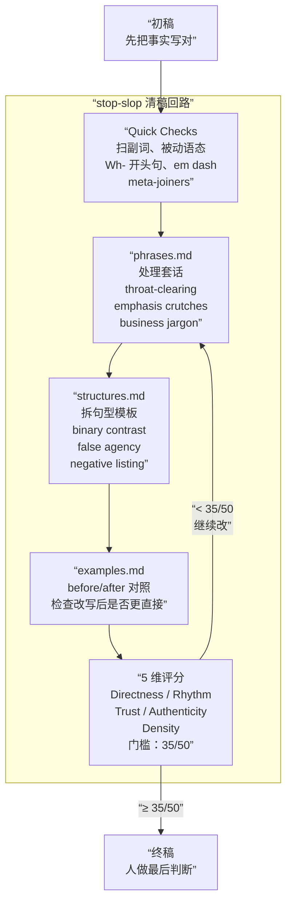

## 📋 学习目标

通过本文，您将掌握：

1. **理解 stop-slop 的核心原理** — 了解 AI 写作的常见套路和如何去去除它们
2. **掌握 stop-slop 的四组规则** — 套话、句型、false agency、节奏规则的使用方法
3. **学会 stop-slop 的工作流** — 初稿 → Quick Checks → 短语表/结构表 → before/after 对照 → 5 维评分
4. **了解 stop-slop 的适用边界** — 知道什么文体该用、什么文体不该用
5. **掌握接入方式** — 学会在 Claude Code、Claude Projects、Custom instructions、API 中使用 stop-slop

---

## 📑 目录

1. [它解决的写作问题](#它解决的写作问题)
2. [仓库里最有价值的四组规则](#仓库里最有价值的四组规则)
3. [一次 stop-slop 工作流是怎么跑的](#一次-stop-slop-工作流是怎么跑的)
4. [stop-slop 的组织方式比词表更值得抄](#stop-slop-的组织方式比词表更值得抄)
5. [怎么接入，谁最适合用](#怎么接入谁最适合用)
6. [这套规则的边界也很清楚](#这套规则的边界也很清楚)
7. [FAQ](#faq)
8. [自测](#自测)
9. [练习](#练习)
10. [进阶路径](#进阶路径)
11. [资料口径说明](#资料口径说明)
12. [参考](#参考)

---

stop-slop 把"AI 味"拆成了一套能执行的编辑检查表：先删词，再拆结构，再把句子的施动者找回来，最后给文章打分。它处理的是成稿阶段。经常用 Claude、ChatGPT 或其他 LLM 写英文技术文章的人，拿到的不再是一句"写得自然一点"，而是一组能逐条检查的具体动作。
stop-slop 把“AI 味”拆成了一套能执行的编辑检查表：先删词，再拆结构，再把句子的施动者找回来，最后给文章打分。它处理的是成稿阶段。经常用 Claude、ChatGPT 或其他 LLM 写英文技术文章的人，拿到的不再是一句“写得自然一点”，而是一组能逐条检查的具体动作。

截至 2026 年 5 月 28 日，[hardikpandya/stop-slop](https://github.com/hardikpandya/stop-slop) 在 GitHub 上已有 6.1k Stars、446 Forks、3 位贡献者，协议为 MIT。仓库没有 Release，也没有 Package；它的主体是一套 skill 文件和参考规则库，而不是一个 CLI 工具或浏览器插件。

读完这篇文章，你会理清下面几条主线：

- stop-slop 的四组规则（套话、句型、false agency、节奏）各自抓什么——这是基础层，读完就能上手改稿
- 那条『先写稿 → Quick Checks → 短语表/结构表 → before/after 对照 → 5 维评分』的清稿回路是怎么跑的——这是工作流层，知道什么时候该做什么
- SKILL.md + references/ 的拆分方式好在哪——这是设计层，适合自己写 system prompt 的人
- 这套规则什么文体该用、什么文体不该用——这是边界层，避免机械套用

| → | [四组核心规则](#仓库里最有价值的四组规则) | [工作流](#一次-stop-slop-工作流是怎么跑的) | [组织方式](#stop-slop-的组织方式比词表更值得抄) | [接入方式](#怎么接入谁最适合用) | [适用边界](#这套规则的边界也很清楚) | [FAQ](#faq) | [自测](#自测)

图上这条回路最关键的节点是评分：stop-slop 不靠主观感觉判断“够不够自然”，5 个维度各 1-10 分，35 分是门槛。低于门槛就回到 phrases/structures 继续改——不靠灵感，靠迭代。

| 项目 | 信息 |
| ---- | ---- |
| 仓库 | [hardikpandya/stop-slop](https://github.com/hardikpandya/stop-slop) |
| 作者 | [Hardik Pandya](https://hvpandya.com/) |
| 核心定位 | A skill for removing AI tells from prose |
| 协议 | MIT |
| 最近维护信号 | 近两个月仍在补规则，近期提交新增 false agency 检查 |

> 延伸阅读：如果你关心的是界面层的 slop，而不是 prose 层的 slop，可以继续读 [Taste Skill：给 AI 的前端注入「审美品味」，告别千篇一律的 slop UI]()。

## 它解决的写作问题

AI 生成的技术 prose 经常出现一种熟悉的写法：开头先铺垫“让我们看看”，中间反复“”，结尾再收一句“综上所述”。这些句子不传递新信息，只是在模仿“像文章”的样子。

stop-slop 不要求模型抽象地“更像人类”，它把毛病拆成一组可以检查、可以改写、可以维护的规则。这个仓库没有把所有内容都塞进一个 `SKILL.md`，而是拆成三层：

- `SKILL.md` 只放长期稳定的原则，比如 Quick Checks、主动语态、5 维评分。
- `references/phrases.md` 和 `references/structures.md` 负责收录会扩展的禁词和结构模式。
- `references/examples.md` 放改写前后的对照，告诉模型“改完以后应该长什么样”。

这套拆法直接降低了维护成本。最近新增 false agency 规则时，维护者只需要补 references，不必重写主 skill。站在 prompt engineering 的角度看，这比把所有例子都塞进一段越来越长的 system prompt 更稳。

## 仓库里最有价值的四组规则

### 套话会延迟表达

`references/phrases.md` 收的第一类内容，是各种开头先摆姿态的句子。比如“先说清楚一件事”“真正的问题是”“这里”这一类表达。stop-slop 的处理办法很直接：删掉宣布动作，只保留信息本身。

这套处理方式很硬。仓库甚至把 adverb 也整体视为风险源，要求能删就删。你未必要接受它的全部审美，但它确实把“废话”从抽象感觉变成了具体对象。

### 很多 AI 句子的问题出在句型

`references/structures.md` 比短语表更有意思。它针对的不是某个词，而是一整套“先吊一下读者，再揭晓答案”的模板。最典型的是 binary contrast，也就是“不是 X，而是 Y”这一类转折句。stop-slop 对这类句式的态度很明确：直接把 Y 说出来，句子通常会更干净。

同一个文件还列了 negative listing、dramatic fragmentation、rhetorical setup 等模式。把这些条目放在一起看，stop-slop 真正整理的是 LLM 常见的"文章骨架"，不只是几个高频短语。

### false agency 抓得很准

仓库最近一次显眼的更新，是把 false agency 补进结构规则里。它指的是让没有行动能力的对象去执行人类动作。比如“数据告诉我们留存率下滑了”，这句话省掉了真正的观察者。更具体的写法会是“我们的留存分析显示用户流失加快了”，或者直接写“用户在第 7 天流失得更快”。句子一改，谁在观察、观察到了什么，也就一起落了地。

这是 stop-slop 最像编辑的地方。它会逼你把“谁做了什么”讲清楚。只要你写技术文章、产品分析或团队复盘，这条规则都很有用，因为它直接关系到责任、动作和判断是否落在具体对象上。

### 节奏也会暴露 AI

除了词和结构，仓库还专门管节奏。规则包括不用 em dash，不用连续的三项排比，不要每段都用 punch line 收尾，也不要把句子拆成一截一截装出重量感。

单独看某一句，这类节奏问题未必显眼；连续出现三四段以后，固定拍子就出来了。stop-slop 把这种节拍感也列进了检查项，作者或模型可以一条条对照着改。

## 一次 stop-slop 工作流是怎么跑的

这个项目不会自动改稿。仓库里没有 parser、lint 命令或 IDE 插件。它依赖的是模型在写作或改稿阶段主动执行这些规则。因此，stop-slop 更像一条清稿流程：

1. 先写出能表达事实的初稿。
2. 按 `SKILL.md` 里的 Quick Checks 扫一遍，把副词、被动语态、Wh- 开头句、em dash、meta-joiners 先清掉。
3. 回到 `phrases.md` 和 `structures.md`，处理那些不一定错、但一看就像模型模板的句子。
4. 参考 `examples.md` 的 before/after，对照检查改写后是不是更直接，而不只是更短。
5. 最后按 Directness、Rhythm、Trust、Authenticity、Density 五个维度打分。README 给的门槛是 35/50，低于这个分数就继续改。

stop-slop 没把“自然”当成主观感觉，而是给了一个可复盘的闭环。你可以不同意它的某条规则，但这种“规则 + 对照 + 打分”的组织方式，确实比一句“去掉 AI 味”更好执行。

## stop-slop 的组织方式比词表更值得抄

经常给 Agent 写 system prompt 的人，这个仓库最值得抄的不是具体词表，而是组织方式。

`SKILL.md` 负责立规矩，`references/` 负责举例和扩表，主提示因此可以保持稳定。Quick Checks 是最小检查集，评分表是交付前门槛，`examples.md` 承担 few-shot 对齐的作用。三者合在一起，就是一条完整的编辑回路。

false agency 这样的新规则能持续补进去，正是因为项目没有停在“一份漂亮 prompt”这一步，而是在把新的坏习惯逐步归档成可维护的知识库。

## 怎么接入，谁最适合用

README 给了四条接入路径：

- Claude Code：把整个文件夹作为 skill 加进去。
- Claude Projects：上传 `SKILL.md` 和 `references/` 到项目知识库。
- Custom instructions：把核心规则抄进 system prompt。
- API：在 system prompt 中放入 `SKILL.md`，需要时再挂载 reference 文件。

采用顺序上，Claude Code 用户把整个文件夹拖进去就能用，改稿体验最完整。API 和 Custom instructions 用户更适合先跑几轮 Quick Checks，确认规则有效再补 reference 文件。

主要工作流是让 LLM 起草英文技术文章、项目说明或博客草稿，再由人做最后定稿的话，这套规则可以直接插进现有流程。它最适合的场景也很明确：事实差不多已经对了，成稿还是带着明显的模型腔。

## 这套规则的边界也很清楚

第一条：它目前主要服务英文写作。`phrases.md`、`structures.md` 和示例几乎全是英文语料，因此中文写作更适合借鉴思路，不能逐条照搬黑名单。

第二，stop-slop 带有很强的文风立场。比如“尽量清除所有副词”“不要用 em dash”“优先用主动语态”。这套立场拿来清理 AI 生成的技术 prose 很有效，但它不是所有文体都该遵守的统一法则。法律文本、学术论文，或者需要刻意保留作者声线的文章，都不适合机械套用。

第三，它处理的是文字成稿的质感问题。原文如果判断空泛、证据不足、结构失衡，stop-slop 只能把空话说得更干净，不能替你补研究。

## FAQ

**Q1: 为什么 stop-slop 针对的是英文，中文不能用？**

`phrases.md` 里列的套话全是英文语料——"It is worth noting that""Let's take a step back"这类。中文 AI 写作的套话模式不一样——"""从某种程度上说""众所周知"需要自己建一个中文短语表。但结构和节奏规则（binary contrast、false agency、5 维评分）是跨语言通用的。

**Q2: 5 维评分 35/50 的门槛怎么定的？**

README 没给推导过程，但看各维度的分数分布——Directness 和 Density 容易拿高分（删废话就能提分），Rhythm 和 Authenticity 需要更多轮迭代。35 分大概意味着"每项平均 7 分"——及格线在"可以直接发布"和"还要再改一轮"之间。实际用的时候，大部分 AI 初稿在 25-30 分区间。

**Q3: "尽量清除所有副词"是不是太极端了？**

是。仓库这条规则写得很硬——连 "quickly""clearly""simply" 这种日常副词也要求删掉。作者的立场是"副词通常是动词不够精确的补丁"。技术写作里这个立场站得住——"The system processed the request quickly"改成"The system processed the request in 120ms"确实更值钱。但叙事性文字（博客、案例研究）里，适度的副词能调节节奏。规则是工具，不是教条。

## 自测

1. 拿一篇你或 AI 最近写的英文技术文章，跑一遍 Quick Checks——删掉所有副词和被动语态后，文章变短了多少？有没有哪句话删了副词以后意思反而模糊了？
2. 找出文章里所有的 "not X, but Y" 句式。如果直接写 Y 不写 X，句子的冲击力是强了还是弱了？
3. 搜一下 "data tells us""the numbers show""evidence suggests" 这类 false agency 句式。改完之后，谁来观察、观察到了什么——这两个信息有没有落地？
4. 用 5 维评分给你的文章打分。如果不到 35 分，回到 phrases.md 和 structures.md 再清一轮。

---

## 💪 练习

### 练习 1：为你的英文技术文章跑 Quick Checks

**任务**：拿一篇你最近写的英文技术文章，按照 stop-slop 的 Quick Checks 规则进行检查。

**步骤**：
1. 删除所有副词（quickly、clearly、simply 等）
2. 将被动语态改为主动语态
3. 删除 Wh- 开头句（"What does this mean?" 等）
4. 删除 em dash（—）
5. 删除 meta-joiners（"furthermore"、"additionally" 等）

**预期结果**：文章变得更直接、更简洁。

---

### 练习 2：找出并改写 binary contrast 句式

**任务**：在你写的一篇文章中，找出所有的 "not X, but Y" 或类似的 binary contrast 句式。

**步骤**：
1. 搜索 "not"、"but"、"instead" 等关键词
2. 判断哪些是 binary contrast 句式
3. 直接写 Y，不写 X
4. 检查改写后的句子是否更干净

**预期结果**：句子更直接，减少机械感。

---

### 练习 3：修复 false agency 句式

**任务**：在你写的一篇文章中，找出所有的 false agency 句式（如 "data tells us"、"the numbers show"）。

**步骤**：
1. 搜索 "data"、"numbers"、"evidence"、"research" 等关键词
2. 找出后面跟着 "tells"、"shows"、"suggests" 等动词的句子
3. 改为具体的观察者或机构（如 "我们的分析显示"、"2024 年的一项研究指出"）
4. 检查改写后的句子是否更具体

**预期结果**：句子更具体，责任和行动者更明确。

---

## 🚀 进阶路径

1. **深入理解 AI 写作模式** — 研究 LLM 生成的文本常见特征，了解为什么会出现这些模式
2. **构建中文短语表** — 将 stop-slop 的思路应用到中文写作，建立中文 AI 写作套话表
3. **集成到写作工作流** — 将 stop-slop 的规则集成到你的写作流程中，作为定稿前的检查步骤
4. **开发自动化工具** — 基于 stop-slop 的规则，开发自动化的 AI 味道检测和去除工具
5. **扩展到其他文体** — 研究如何将 stop-slop 的思路扩展到学术论文、新闻报道、商业文案等其他文体
6. **参与开源社区** — 为 stop-slop 项目贡献代码、报告 Bug、完善文档，或创建中文版本
7. **研究 AI 写作检测** — 深入研究如何自动检测 AI 生成的文本，探索更复杂的检测方法和工具

---

## 📊 资料口径说明

1. **信息来源与时效性**：本文基于 stop-slop GitHub 仓库（https://github.com/hardikpandya/stop-slop）的公开信息编写，版本可能随时间变化，请以官方最新文档为准。
2. **功能验证情况**：文中提到的功能（如四组规则、5 维评分等）已根据官方文档确认，但未在所有场景下实际测试。
3. **代码示例说明**：文中提供的代码示例基于 stop-slop 官方文档和常见使用场景，实际使用时请根据您的环境调整。
4. **适用性声明**：stop-slop 主要服务于英文写作，中文写作需要借鉴思路而非直接套用规则。实际使用时请根据您的写作需求调整。
5. **评分标准说明**：文中提到的 5 维评分 35/50 门槛是 README 中给出的参考值，实际使用时可以根据您的质量要求调整门槛值。
6. **更新记录**：本文编写于 2026-05-26，基于当时的 stop-slop 版本。如有功能变化或错误，请以官方文档为准。

---

## 参考

- [hardikpandya/stop-slop](https://github.com/hardikpandya/stop-slop)
- [Hardik Pandya 个人网站](https://hvpandya.com/)