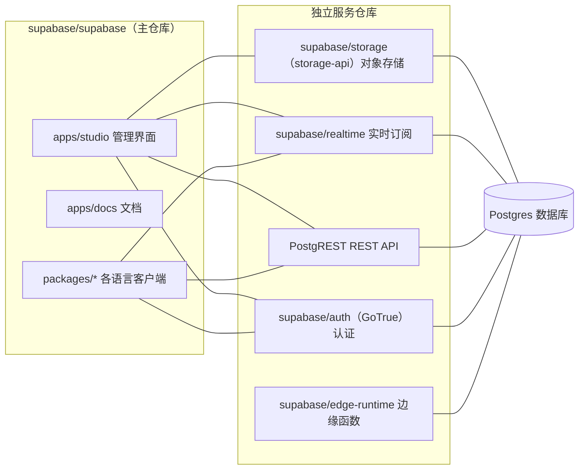

## 本文导读

读完本文你将能够：

- 说清 Supabase 在「开源 BaaS（后端即服务）」里的定位，以及它和 Firebase、Neon、Appwrite 的分野
- 看懂主仓库与 GoTrue、PostgREST、Realtime、Storage 等独立服务之间的编排关系
- 顺着一条真实请求，理解 PostgREST 生成 REST API、行级安全（RLS）、JWT 认证、Realtime 推送如何逐层配合
- 判断你的项目该不该用 Supabase，以及从哪一步开始接入

适合读者：正在做后端技术选型的架构师，需要 Postgres 但不想自己维护周边设施的全栈工程师，想搞清 Supabase「组件到底怎么分」的开发者。

## 一、先给判断

Supabase 真正解决的问题不是「给我一个数据库」，而是「我想用 Postgres，但不想运维数据库之外的那一圈设施」。它把 Postgres 当作底座，在上面补上认证、对象存储、实时订阅和边缘函数，最后用一套 Web 管理界面（Studio）把全部能力包起来。对开发者来说，它交付的是一个「打开就能用、背后是标准 Postgres」的完整后端。

很长一段时间里它被贴上「开源版 Firebase」的标签，这并不完整。Firebase 的数据模型是文档型（Firestore），而 Supabase 从头到尾就是一个标准的 Postgres 实例——你随时能用 `pg_dump` 把数据搬去任何自托管的 Postgres。它的差异化恰恰在底层协议的开放性，而不是在使用习惯上与 Firebase 对标。

关注度为什么长期居高不下，可以看两个可核实的外部信号：

- 2026 年 6 月，Supabase 完成 5 亿美元 F 轮融资，新加坡主权基金 GIC 领投，估值 105 亿美元——距上一轮（2025 年 10 月，估值 50 亿美元）不到八个月，估值翻倍。
- 同一轮融资披露的数据显示，新增数据库中超过六成由 AI 编码工具（Claude Code、Cursor、Lovable、Bolt 一类）创建；Supabase 正成为这些工具生成应用时的默认后端。

这两个数字放在一起，能解释它的热度从哪来：不是某一天的一次性爆发，而是「AI 应用后端」这条叙事在持续兑现。GitHub 上的活跃度是这种趋势的日常反映，不必当成单日事件来读。

## 二、系统地图

先搞清楚一件事，很多误解从这里来：**Supabase 不是一个把数据库引擎装在一个仓库里的项目。** 主仓库 `supabase/supabase` 是一个 monorepo，但它不含数据库引擎，也不含绝大多数服务本体。真正干活的服务是几个独立的仓库，主仓库负责把它们编排起来，并托管 Web 界面与文档。

各仓库的职责大致是：

| 仓库 | 职责 | 说明 |
| --- | --- | --- |
| `supabase/supabase` | 编排 + Studio + 文档 + 客户端 SDK | monorepo，不含数据库引擎 |
| `supabase/auth`（GoTrue） | 用户认证，签发 JWT | Go 实现，独立仓库 |
| PostgREST | 把 Postgres 表自动暴露成 REST API | 独立开源项目 |
| `supabase/realtime` | 监听数据库变更，经 WebSocket 推送 | Elixir / Phoenix 实现 |
| `supabase/storage` | S3 兼容的对象存储 | 元数据存在 Postgres |
| `supabase/edge-runtime` | 边缘函数运行时 | 基于 Deno |

这套分工的好处是每个服务可以独立演进、独立发布；代价是接口契约变更要跨多个仓库同步。对使用者而言，这些仓库边界大多不影响日常开发——你只需要通过客户端 SDK 访问统一的入口，但了解边界能帮你判断「某个能力坏了该去查哪个仓库」、「自托管时 docker-compose 到底把哪些容器拉起来了」。

## 三、两条主线

把系统拆开看，其实是两条相互独立的线，别混在一起读。

**第一条：数据访问线。** 你建表，PostgREST 按 schema 自动生成 REST 端点，Auth 提供 JWT，RLS 决定这条 JWT 能碰哪些行。这条线处理「谁、能读/写哪些数据」，是 Supabase 安全模型的全部。

**第二条：平台服务线。** Realtime 把数据变更推出去，Storage 存文件，Edge Functions 跑服务端逻辑、也能触发数据库操作。这条线管「数据之外的能力」。

这两条线在边缘函数处交汇：一个函数可以带用户身份调用数据访问线（PostgREST），也可以把结果写回数据库再通过 Realtime 推给客户端。下文先讲机制，再用一个任务把它们串起来。

## 四、核心机制

按第三节的划分展开：第 1、2 小节属于数据访问线，第 3、4、5 小节属于平台服务线。

### 1. 数据访问线：PostgREST + RLS

PostgREST 读取数据库 schema，为每张表和视图生成对应的 REST 端点（`GET /rest/v1/todos` 之类）。它不生成代码，是运行时动态映射。安全性不靠应用层过滤，而是靠 Postgres 的行级安全：

- 你给某张表开 RLS 并创建 policy，例如 `todos` 表只允许 `user_id = auth.uid()` 的行被读取；
- PostgREST 把请求里的 JWT 解析成数据库角色上下文，再执行查询；
- 查询落到 Postgres 时，RLS policy 在返回行之前生效，越界的行根本到不了应用层。

这一设计的关键点在于：**RLS 是数据库层面的硬约束，不是应用层的软过滤。** 只要请求走的是 `anon`、`authenticated` 这类受限数据库角色，不管它来自哪个客户端、哪门语言，policy 一视同仁。这也是为什么要反复强调「所有表都开 RLS」——它是 Supabase 安全的承重墙。

两个容易被忽略的前提：其一，`auth.uid()` 能拿到用户 ID，是因为 PostgREST 把请求头里的 JWT 写进了 Postgres 的会话变量，函数再从这些变量里取值——所以 policy 生效的前提是请求确实经过 PostgREST 或等价的身份注入。其二，`service_role`（服务端密钥）对应的角色带 `BYPASSRLS`，用它访问时 RLS 默认被绕过。生产环境要避免把 `service_role` 泄漏到客户端。

### 2. 认证：GoTrue 与 PKCE

认证服务是 GoTrue（仓库现名 `supabase/auth`），负责注册登录、签发 JWT，并为数据库角色提供上下文。

登录协议有两种走向，这里容易写错，值得单独讲清：

- **implicit flow**：授权完成后 access token 直接落在 URL 片段（`#access_token=...`）。只适用于纯客户端应用，服务器拿不到 token。
- **PKCE flow**：授权返回的是一个一次性授权码（`code`），由客户端用验证码再换 token，可服务端处理和签名验证，对 SSO、深度链接更安全。

Supabase 官方在**服务端渲染（SSR）场景默认用 PKCE**——`@supabase/ssr` 初始化的客户端直接走 PKCE，并把会话写进 Cookie。但在**纯 JS / Dart 客户端，默认仍是 implicit flow**，需要你显式设置 `flowType: 'pkce'` 才算切过去。所以笼统说「PKCE 已全局成为默认、implicit 已废弃」并不准确——准确的说法是：官方推荐新项目在新客户端（尤其需要服务端参与、走深度链接或跨设备单点登录时）用 PKCE，而旧的隐式流程仍然保留给纯客户端场景。

一个实际约束：PKCE 的 code verifier 在发起流程时就存在发起端，因此授权码交换必须在同一浏览器、同一设备发起，否则会换取失败——这在多标签页或 OAuth 弹窗（如 Chrome 扩展）里会踩坑。

### 3. Realtime：数据库变更怎么推给前端

Realtime 订阅的是数据库本身，不是应用内存状态。它通过 Postgres 的逻辑复制（logical replication）监听 WAL，捕获表变更，经 WebSocket 推给订阅了对应 channel 的客户端。应用服务端不需要自己维护连接映射。

它的能力分三块：`postgres_changes` 订阅表变更，`broadcast` 在客户端之间发自定义消息，`presence` 维护在线状态。典型用途：

- 协作类应用（多人编辑、共享看板）：一条记录被改，所有在线客户端同步拿到变更；
- 订单 / 通知类场景：后端或边缘函数写入状态，前端实时收到；
- 在线人数、打字状态这类信号，交给 presence，不用自己写心跳。

多区域扩展依赖的是**读副本（Read Replicas）**：把只读副本部署到其他区域，让读请求就近访问副本，降低跨区域延迟。写操作的主写入仍在一个主区域，副本是异步追平的。不要把它理解成「跨区域秒级一致的读写集群」——副本数据有一定延迟，也没有就近写。

### 4. Edge Functions：贴近数据的服务端逻辑

边缘函数跑在基于 Deno 的 `edge-runtime` 里，定位是「离数据近、需要快速触发」的服务端逻辑：Webhook 回调、OAuth 令牌交换、定时任务（cron），以及带着用户身份去查数据库。它和「长期运行的服务」是两类东西——函数有执行时限、无状态、靠请求触发，不适合放长时间任务或重计算。

### 5. Storage 与 Vector

Storage 是 S3 兼容的对象存储，文件本身的访问控制同样走 RLS：可以写 policy 指定「这个桶里的对象只有上传者能读」。元数据（对象名、大小、所属用户）存在 Postgres 里。

向量能力来自 `pgvector` 扩展，直接复用主数据库。两种索引各有取舍：`HNSW` 查询性能更好、召回稳定，代价是构建慢、内存占用多；`ivfflat` 构建快、省内存，适合数据量大、能接受查询质量略降的场景。Supabase 在 Studio 里把这套索引参数做了可视化，省掉了手写 SQL 这一步。

## 五、一个任务流过系统

把两条线串起来，看一次「用户登录后拉取自己的待办，并实时看到新条目」会经历什么：

1. 用户在客户端用邮箱密码登录，GoTrue 校验并签发 JWT，客户端把它带在之后的所有请求头上。
2. 客户端通过 supabase-js 发起 `GET /rest/v1/todos`，请求头带着 JWT 到达 PostgREST。
3. PostgREST 把 JWT 映射成数据库角色，执行查询；`todos` 表上的 RLS policy 把返回集收敛到 `user_id = auth.uid()` 的行，越界行被丢弃。
4. 客户端同时订阅 `todos` 的 Realtime channel。
5. 过了一会儿，一条边缘函数（比如定时任务）往 `todos` 插入了一行分配给当前用户的新记录。Realtime 捕获这条变更，经 WebSocket 推给订阅者，前端界面无需轮询便更新。

这条路径正是 Supabase 的产品主张：CRUD、权限、实时更新几乎不需要你手写服务端代码。而一旦某一步（比如 RLS 忘了开，或把服务端密钥放进前端）出了问题，整条安全链会在一处断裂，所以下面会专门讲注意点。

## 六、选型边界与对比

先给一张对照表，再讲哪些情况下该选、哪些情况别选。表里的判断只代表能力方向，具体配额随套餐变动，判断时看的是「有没有」而不是「精确到几位」：

| 维度 | Supabase | Firebase | Neon | Appwrite |
| --- | --- | --- | --- | --- |
| 数据模型 | Postgres（关系型） | Firestore / RTDB（文档型） | Postgres | 主库 MySQL/MariaDB，可选 Postgres |
| 复合查询能力 | 关系查询、JOIN、CTE、全文 | 较弱 | 关系查询 | 一般 |
| 认证 | 自带（GoTrue） | 自带 | 需自接 | 自带 |
| 对象存储 | 自带 | 自带 | 无 | 自带 |
| Realtime | 数据库变更 + WebSocket | 一等公民 | 无 | 有 |
| 边缘函数 | Deno 运行时 | Cloud Functions | 无 | 内置运行时 |
| AI / 向量 | pgvector，Studio 可视化 | 需额外方案 | pgvector | 无原生方案 |
| 数据可迁移 | 标准 Postgres，pg_dump 即可 | 强绑定 | 标准 Postgres | 中 |
| 自托管 | 支持（docker-compose） | 不支持 | 支持（不推荐） | 支持 |

### 该选的情况

- **从 0 到 1 的新项目，需要 DB + Auth + Storage 快速跑通**，一两天能搭出 MVP；
- **AI / RAG 应用**，有现成的向量与嵌入流，且想要可视化调索引；
- **不想自己运维 Postgres**，但又希望它躲在标准 Postgres 后面、将来可搬走；
- **需要实时同步**，且不想自己写长连接的推送服务。

### 别急着选的情况

- **强监管行业**（金融、医疗），对细粒度合规审计有硬要求，希望完全掌控自托管链路——这一点 Supabase 有自托管选项，但要自行承担运维复杂度；
- **单库体量极大**：免费档约 0.5 GB，付费档按 compute 档位和磁盘配置往上扩，但单个平台实例在容量、连接数、IOPS 上都有阶梯上限。体量一旦逼近单实例上限，你要考虑拆表拆库，这时自建 PostgreSQL 集群反而更直接；
- **低延迟（个位数毫秒 p99）的强要求**：托管平台在网络上多一跳，连接还要过一层连接池，裸机/自建的延迟下限更低；
- **需要多区域可就近写入**：读副本只解决读、主写入仍单区域，写密集且分布全球的业务要另行评估；
- **完全想摆脱 Postgres 的团队**：Supabase 的一切都长在 Postgres 上，离开它的成本很高。

### 与两条自建路线的取舍

- **Firebase 存量项目**：可迁移，Firestore 的文档模型要重构成关系表 + RLS，迁移成本主要体现在数据模型而不是协议。
- **Neon + Clerk + 自建对象存储**：如果你只需要 Postgres + Auth 且已有既定栈，这条路更轻、组件更小；当你还想要存储与实时推送时，Supabase 的一体化才更有优势。

## 七、几个常见的坑

下面这些坑在引入 Supabase 时最容易踩，列出来比靠经验挨个试更省事。

1. **表没开 RLS**。新建表默认不启用行级安全。忘了开，等于把整张表通过匿名角色暴露出去。建议每个表和存储桶都默认开 RLS。
2. **把 `service_role` 密钥放进前端**。它是服务端密钥，绕过 RLS。泄漏等于数据库裸奔。
3. **客户端默认还在跑 implicit**。JS / Dart 客户端默认不是 PKCE，如果走 SSR 或深度链接，务必显式切到 PKCE 并用 Cookie 存会话。
4. **把 Realtime 读副本当「强一致多区域写入」用**。副本异步、就近读，写入仍主区域，别在上面做写逻辑。
5. **假设边缘函数可以跑重活**。它有执行时限、无状态，长任务要换普通服务或队列。

## 八、采用顺序

如果确定要上，按下面的顺序推进，每步都先验证再往下走：

1. **先从官方云端一个项目起步**，注册后拿到 DB + Auth + Storage + Realtime + Edge Functions，验证主链路（登录 → 写数据 → 实时推送）是否符合预期。
2. **把安全基线做在前面**：所有表开 RLS、写好最小 policy、确认 `service_role` 只在服务端使用。这一步决定后面是否要返工。
3. **数据访问线先稳定**：把核心表和 RLS 定好，用客户端 SDK 跑通 CRUD，再谈其他能力。
4. **按需叠加平台服务**：需要文件加 Storage，需要实时加 Realtime，需要边缘逻辑加 Edge Functions，不用的就不开。
5. **规模化的迹象出现后再谈迁移**：当单个实例的容量、连接、IOPS 摸到阶梯上限，且读多写多、想就近读时，再评估读副本或自建集群。

一句话收尾：Supabase 的价值不在「免费」「开源」这些标签，而在把一组容易分散成多个服务的能力，收敛到一个你熟悉的 Postgres 之上。如果你欢迎这种收敛，它是当下最省事的起点；如果你更需要颗粒度与自治，从自建开始会更适合。