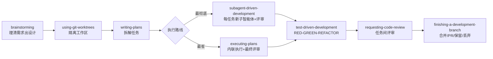

# Superpowers：给编程智能体装上一套完整开发方法论

AI 编程工具最常见的失败模式不是代码写得太差，而是不守纪律：需求没弄清就动手，测试后补甚至不写，中途偏离计划，最后靠人肉审查兜底。Superpowers 的切入点就在这里——它不提供更强的模型，而是把一套软件开发方法论做成可自动触发的技能（skills），让智能体在动手之前先问清需求、写好设计、拆细计划，再按 TDD 一步步执行。用仓库自己的描述说，这是 "An agentic skills framework & software development methodology that works"。

它由 Jesse Vincent 和 Prime Radiant 团队开发，2025 年 10 月 9 日开源（仓库创建与发布公告同日）。截至 2026 年 9 月 30 日，GitHub 上已有 292,890 Stars、26,217 Forks，最新版本 v6.4.2（2026-09-25），main 分支仍在活跃推进。**本文按 2026-09-30 的 main 分支 README 与 v6.4.2 核实**；文章初版写于 2026 年 5 月（当时为 v5.1.0），半年间项目跨了一个大版本，v6 的变化在正文中单独说明。

## 项目概览

| 项目信息 | |
|---|---|
| 仓库 | [obra/superpowers](https://github.com/obra/superpowers) |
| 作者 | Jesse Vincent 与 [Prime Radiant](https://primeradiant.com) 团队 |
| Stars / Forks | 292,890 / 26,217（2026-09-30） |
| 当前版本 | v6.4.2（2026-09-25） |
| 主语言 | Shell |
| License | MIT |
| 开源发布 | 2025-10-09 |

Superpowers 的定位是"面向编程智能体的完整软件开发方法论"（a complete software development methodology for your coding agents），由一组可组合的技能加初始指令构成，确保智能体真正使用这些技能。它不是新模型，也不是 GUI 工具。

## 核心问题：AI 编程工具缺的是约束

README 的 "How it works" 一节描述了默认行为的反面：智能体看到你在构建东西时，**不会**直接跳去写代码，而是退一步问你真正想做什么；设计确认后，它产出的实现计划要详细到"一个热情但品味差、没有判断力、没有项目上下文、还讨厌测试的初级工程师"（an enthusiastic junior engineer with poor taste, no judgement, no project context, and an aversion to testing）也能照着执行；计划强调真正的 red/green TDD、YAGNI 和 DRY。

Superpowers 的解法是把这些实践做成**强制工作流而非建议**：智能体在任何任务前都会先检查是否有适用技能。README 的原话是 "Mandatory workflows, not suggestions."

## 工作流程：七步强制触发

Superpowers 把开发流程拆成七个阶段，每个阶段对应一个自动触发的技能。一个任务流过系统的完整路径如下：

以一个最小的真实场景串起来——README 自己的验收测试就是让智能体 "make a react todo list"：正常安装后，智能体在写任何代码之前会先触发 `brainstorming`，用提问收敛需求（要哪些功能、状态怎么管理），把设计文档分段展示给你确认；你说 "go" 之后才进入计划与实现。以下逐步展开：

### 1. brainstorming（设计前阶段）

写代码之前激活。用苏格拉底式提问打磨粗糙想法（README 对这个技能的一句话概括是 "Socratic design refinement"），探索备选方案，把设计分段展示给用户确认，最后保存设计文档。

### 2. using-git-worktrees（隔离工作区）

设计确认后激活。在新分支上创建隔离的 worktree 工作区，跑项目初始化，验证干净的测试基线。v6.0.0 起有个位置变化：worktree 不再放在全局目录 `~/.config/superpowers/worktrees/`，而是落在项目内——已有 `.worktrees/` 或 `worktrees/` 目录就用现有的，否则新建 `.worktrees/`。

### 3. writing-plans（任务规划）

把工作拆成 2-5 分钟的小任务，每个任务带精确文件路径、完整代码和验证步骤，详细程度以"初级工程师也能执行"为准。

### 4. subagent-driven-development / executing-plans（执行与审查，二选一）

计划确认后，两条执行路线：

- **subagent-driven-development**（最彻底）：每个任务派一个全新的子智能体完成，完成后做评审再进入下一个。v6.0.0 重写了这套评审：原先每任务两个评审 prompt（规格符合、代码质量各一个），现在合并为一个 `task-reviewer-prompt.md`，单次读取任务 diff，同时给出规格符合与质量两个裁决，外加一个"无法从 diff 验证"的新裁决，标记需要控制器自行检查的需求。
- **executing-plans**（最省）：在当前会话内联执行所有任务，结束时对整个分支做一次完整评审。注意这个技能的语义在半年内变过：v5.1.0 时代它是"批量执行加检查点"（batch execution with checkpoints），现行 README 改为"一个上下文、一次最终评审"（inline plan execution: one context, one final review）。

README 提到，智能体连续自主工作几个小时而不偏离计划并不罕见。

### 5. test-driven-development（TDD 执行）

实现期间激活，强制 RED-GREEN-REFACTOR 循环：先写失败测试、看着它失败、写最少量代码让它通过、提交。在测试之前写出的代码会被删除。

### 6. requesting-code-review（代码评审）

任务之间触发，对照计划检查实现，按严重程度报告问题，Critical 级别直接阻断推进。

### 7. finishing-a-development-branch（收尾）

任务全部完成后激活：验证测试，提供合并、提 PR、保留分支、丢弃四个选项，并清理 worktree。

## 技能库一览

main 分支的 `skills/` 目录共 15 个技能，README 按四类组织：

**测试**
- `test-driven-development`：RED-GREEN-REFACTOR 全流程，含测试反模式参考

**调试**
- `systematic-debugging`：四阶段根因分析（含 root-cause-tracing、defense-in-depth、condition-based-waiting 技术）
- `verification-before-completion`：确认问题真的修复了
- `diagnosing-superpowers`：排查 Superpowers 自身的会话故障（v5.1.0 时点尚无，后加入）

**协作**
- `brainstorming`、`writing-plans`、`executing-plans`、`subagent-driven-development`、`dispatching-parallel-agents`、`requesting-code-review`、`receiving-code-review`、`using-git-worktrees`、`finishing-a-development-branch`

**元**
- `writing-skills`：如何按最佳实践创建新技能（含测试方法论）
- `using-superpowers`：技能系统入门

`diagnosing-superpowers` 值得单独说：会话行为异常时（技能误触发、该触发时不触发、智能体无视计划、token 消耗异常），让编程智能体 "figure out what went wrong with superpowers in this session" 即可触发它；要查更早的会话就报会话 ID。这个技能会读会话转录，带行级证据报告发生了什么，还能打包一份脱敏材料用于提 bug。

## 安装与支持

README 现在覆盖 16 个编程工具，每个都单独维护安装引导、工具映射与测试。**多工具使用者需要为每个工具分别安装。**

| 工具 | 安装方式 |
|---|---|
| Claude Code | `/plugin install superpowers@claude-plugins-official`（官方市场）；或先 `/plugin marketplace add obra/superpowers-marketplace` 再 `/plugin install superpowers@superpowers-marketplace` |
| Antigravity | `agy plugin install https://github.com/obra/superpowers`，重装同命令即更新 |
| Codex App | 侧边栏 Plugins，Coding 区找到 Superpowers 点 `+` |
| Codex CLI | `/plugins` 搜索 superpowers，选 Install Plugin |
| Cursor | Agent 聊天里 `/add-plugin superpowers` |
| Devin CLI | `devin plugins install obra/superpowers`，更新用 `devin plugins update superpowers` |
| Factory Droid | 先 `droid plugin marketplace add https://github.com/obra/superpowers`，再 `droid plugin install superpowers@superpowers` |
| Gemini CLI | `gemini extensions install https://github.com/obra/superpowers` |
| GitHub Copilot CLI | 先 `copilot plugin marketplace add obra/superpowers-marketplace`，再 `copilot plugin install superpowers@superpowers-marketplace` |
| Grok Build CLI | `grok plugin install superpowers@xai-official --trust`（xAI 官方市场） |
| Kimi Code | `/plugins` 进 Marketplace 选 Superpowers，或直接从仓库安装 |
| OpenCode | 让智能体抓取并执行 [INSTALL.md](https://raw.githubusercontent.com/obra/superpowers/refs/heads/main/.opencode/INSTALL.md) 里的指令 |
| Pi | `pi install git:github.com/obra/superpowers`（Pi 有原生 skills，无需兼容层） |
| Qwen Code | `qwen extensions install obra/superpowers` |
| Hermes Agent | `hermes plugins install obra/superpowers --enable`，装完重启会话 |
| Muse | 克隆仓库后 `muse plugins install ./superpowers` 并 `muse plugins approve superpowers` |

两处容易踩的坑：一是带 marketplace 的工具（Factory Droid、GitHub Copilot CLI）**必须先注册 marketplace 再 install**，跳过第一步命令会失败；二是 Hermes 没有 post-compaction 钩子，超长会话在第一轮就发生压缩时会丢掉 bootstrap，技能不再触发就开个新会话。

安装是否成功可以直接验证：开一个全新会话，发一句 "Let's make a react todo list"，正常安装的智能体会在写任何代码之前先触发 `brainstorming`。

## 设计原则

README 的 Philosophy 一节列出四条：

- **Test-Driven Development**：永远先写测试
- **Systematic over ad-hoc**：流程优先于猜测
- **Complexity reduction**：简单性是首要目标
- **Evidence over claims**：验证之后再宣告成功

这四条通过强制触发的技能嵌入每个任务的执行路径，而不是停在文档里。

## v5 到 v6：半年间的演化

文章初版对应 v5.1.0，六月中旬发布的 v6.0.0 是一次大版本重写，读旧版文章的人需要知道这些变化：

- **每任务评审从两个评审员变一个。** 两个按职责拆分的评审 prompt（规格、质量）合并为单个 `task-reviewer-prompt.md`，一次读 diff、出两个裁决。官方给出的理由是旧流程又贵又容易糊弄（expensive and easy to game）。
- **worktree 目录迁入项目。** 全局 `~/.config/superpowers/worktrees/` 弃用，改为项目内 `.worktrees/`。
- **接入面从 8 个工具扩到 16 个。** v6.0.0 一次加入 Kimi Code、Pi、Antigravity 三个，之后陆续补齐 Devin CLI、Grok Build CLI、Qwen Code、Hermes Agent、Muse 等。
- **官方评测口径**：v6.0.0 发布说明称，在其自有 evals 中，Claude Code 与 Codex 产出相近质量结果的速度约为原来的两倍，token 消耗少近 50%。注意这是官方自报数字，发布说明同时明确"这些数字不会在每个 harness、每类负载上都成立"（these numbers won't hold on every harness and for every workload），引用时不能外推。

## 采用边界与公开政策

几条直接影响使用决策的信息，均出自仓库现行文档：

- **贡献政策偏保守。** README 原话："we don't generally accept contributions of new skills"——项目一般不接受新技能贡献，且技能改动必须在其支持的所有编程工具上工作。想定制技能的现实路径是按 `writing-skills` 技能自己写、本地维护，而不是提 PR。技能行为测试用 [superpowers-evals](https://github.com/prime-radiant-inc/superpowers-evals/) 的 drill 评测框架（克隆到 `evals/`），插件基础设施测试在 `tests/`。
- **有一处默认开启的轻量遥测。** brainstorming 技能的可选"视觉伴侣"功能默认从 Prime Radiant 官网加载一个 logo 图片，其中包含使用的 Superpowers 版本号；官方声明不含项目、prompt 或编程工具的任何细节。设置环境变量 `SUPERPOWERS_DISABLE_TELEMETRY` 可关闭，Claude Code 的 `DISABLE_TELEMETRY` 与 `CLAUDE_CODE_DISABLE_NONESSENTIAL_TRAFFIC` 同样生效。
- **企业支持是商业服务。** README 的 Commercial Services 一节提供企业级支持、附加工具与托管额度（managed spending），联系方式 sales@primeradiant.com；项目本身以 MIT 协议开源。
- **更新节奏因工具而异，但通常自动。** README 的 Updating 一节只有这一句，具体机制取决于所用工具的插件更新机制。

## 适用场景与局限

适合的场景：

- 需要 AI 编程工具完成**多文件、较复杂**的功能开发，而不只是补 snippet
- 团队希望 AI 产出**可审查、可复现**的代码，评审结论有严重度分级
- 需要 AI 在长时间自主工作中**保持计划不偏移**

不适合或需要调整的场景：

- 探索型原型、一次性脚本：brainstorming 与完整 TDD 流程对这类工作偏重
- 不接受工作区里多出 `.worktrees/` 目录、或对网络请求（遥测）零容忍的团队：前者是默认行为，后者需要设置环境变量

本文未展开、可自行深入的：各工具 harness 的集成细节（见各工具安装文档）、`writing-skills` 技能的完整指南（仓库内 `skills/writing-skills/SKILL.md`）、官方 evals 框架的用法（`evals/README.md`）。

## 结论

Superpowers 做的事情可以概括为：把软件工程里早已达成共识的纪律——先设计、先测试、小步提交、评审后推进——写成智能体会自动执行的技能，用强制触发替代自觉。29 万 Stars 的关注度（半年内从约 19 万涨到 29 万）说明"约束工作流"这个方向击中了痛点。

采用建议：如果你主力用 Claude Code，从官方市场一条命令装上，先用一个低风险项目跑完整的七步流程，观察 brainstorming 是否在第一条消息之前触发、评审是否真的阻断过推进——这两点决定了它对你的团队是方法论还是摆设。Cursor、Codex、Gemini CLI 等工具的用户按上表安装即可；若你的工具不在 16 个之列，等官方支持比自己折腾兼容层更省力，因为这个项目对"跨所有 harness 一致工作"有明确执念。

**发布通知**：[primeradiant.com/superpowers](https://primeradiant.com/superpowers/)
**Discord 社区**：[discord.gg/35wsABTejz](https://discord.gg/35wsABTejz)
**作者博客**：[blog.fsck.com](https://blog.fsck.com)（[开源发布公告](https://blog.fsck.com/2025/10/09/superpowers/)）

---

*资料口径：仓库与版本数据按 2026-09-30 GitHub API 读数；技能清单、安装命令、政策条款按 main 分支 README（对应 v6.4.2，2026-09-25 发布）核实；v6.0.0 变化引自其官方发布说明。*
