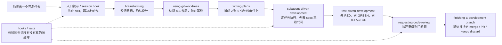

<!-- markdownlint-disable-file MD003 MD041 -->

插件市场当然显眼，但 Superpowers 真正改的是编码对话的起手式。任务一旦开始，agent 不该直接写代码，而是先过需求澄清、设计确认、计划拆分、隔离工作区、TDD 和 review 这些环节。README 里那句 “Mandatory workflows, not suggestions” 说的就是这个意思：这些步骤是默认路径，不是点缀。

把官方 README、当前 v5.1.0 仓库结构和 Jesse Vincent 的发布说明放在一起看，会更容易看清它是什么：skills 定义动作，入口提示决定这些动作何时必须触发，hooks 和 tests 负责盯着它们有没有在真实任务里被跳过。把它叫成“提示词仓库”不算错，但明显说轻了。

如果把这套系统压成一张最小地图，大致会是下面这样：



图里步骤看着不少，真正有用的是这些阶段门。设计没确认，就不该开始拆任务；没有干净基线，就很难判断一次修改到底有没有把问题带进来；测试没先失败一次，后面的通过也缺少约束。Superpowers 做的事很具体：把这些门一道一道摆在前面，逼着 agent 少走捷径。

## 这篇文章真正要回答什么

1. Superpowers 到底更像插件包，还是一套能落到执行环节的软件工程方法。
2. 为什么它要把 brainstorming、worktree、TDD 和 review 放在默认路径里。
3. 第一次上手时，该看哪些信号，才能判断它是真的接管了流程。

## 它管的是开发过程里的失控点，不是模型上限

很多 coding agent 的问题，并不出在能力上限，而是出在默认行为。需求还没讲清楚就开始实现，代码写完才想起补测试，做到一半跳过 review，最后用一句“已经完成”收尾。这些失误在人类工程师身上也常见，只是模型把它们放大了。

Superpowers 对准的正是这类失控点。它要让 agent 在有时间压力、已有沉没成本、上下文不完整的情况下，仍然按工程流程走，而不是把 agent 变成更会写某种框架的专家。

| 常见失控点 | 没有 Superpowers 时常见表现 | Superpowers 的对应处理 |
| ------ | ------ | ------ |
| 太快进入实现 | 直接写代码，用默认假设补齐需求 | `brainstorming` 先提问、比较方案、确认设计 |
| 任务越做越大 | 一次性生成大段实现，难以回滚 | `writing-plans` 拆成 2 到 5 分钟粒度任务 |
| 已经投入很多 | 因为“已经写了不少”而跳过规范步骤 | `using-superpowers` 要求先查技能，再决定怎么做 |
| 测试滞后 | 先写代码，最后凭感觉补几条测试 | `test-driven-development` 强制 RED → GREEN → REFACTOR |
| 完成即宣布成功 | 没有独立复查，直接声称修好 | `requesting-code-review` 与分支收尾流程阻断这种捷径 |

这一点也是 Superpowers 和“把提示词写长一点”的区别。后者主要影响回答内容，前者直接改 agent 的工作顺序。

## 先把这套系统拆开来看

| 项目 | 情况 |
| ------ | ------ |
| 定位 | 面向 coding agent 的技能框架与软件开发方法论 |
| 写作时仓库状态 | 约 203k Stars、18.1k Forks，最新公开发布为 v5.1.0 |
| 官方支持的 harness | Claude Code、Codex CLI、Codex App、Factory Droid、Gemini CLI、OpenCode、Cursor、GitHub Copilot CLI |
| 关键仓库结构 | 多平台插件目录、`skills/`、`hooks/`、`tests/`、入口引导文件 |
| 核心口号 | Mandatory workflows, not suggestions |

如果再往下拆，这套系统至少有四个层面：

| 层面 | 作用 | 对应仓库对象 |
| ------ | ------ | ------ |
| 分发面 | 把能力装进不同 harness | `.claude-plugin`、`.codex-plugin`、`.cursor-plugin`、`.opencode`、`gemini-extension.json` |
| 强制面 | 让 agent 在会话开始就知道“有技能就必须用技能” | `AGENTS.md`、`CLAUDE.md`、`GEMINI.md` 之类的入口文件 |
| 执行面 | 把设计、计划、TDD、review 等动作写成可调用技能 | `skills/` 里的 workflow、debugging、testing、meta skills |
| 验证面 | 检查这些技能在真实代理会话里是否会被遵守 | `hooks/`、`tests/`、跨 harness 的验证流程 |

容易被安装步骤盖住的一点是：安装只是分发，真正起约束作用的是强制面和执行面。插件市场解决的是“怎么装进去”，skills 和入口引导解决的是“装进去以后 agent 会不会真的照做”。

另外，README 明确写了一个部署边界：如果你同时用多个 harness，需要分别安装。Superpowers 不是“一次安装，全平台生效”的全局层。

## 为什么技能才是主角，而不是插件市场

把 Superpowers 看成“高级提示词”只说对了一半。更贴近事实的理解是：它把一组工程动作做成了运行时规程，要求 agent 在合适的时点按顺序执行。

先看触发时机。README 写得很直白：agent 会在每个任务前检查相关 skills。也就是说，skill 首先是入口，不是卡住时翻出来的补充材料。

再看 skill 本身的形状。像 `test-driven-development`、`systematic-debugging`、`verification-before-completion` 这几类内容，里面不只是几句建议，通常还带着前置条件、检查清单和退出标准。读起来更像操作规程，而不是一段提示词摘要。

发布说明里还有一层常被忽略的设计：这些 skill 会被丢进时间压力和沉没成本都很高的场景里反复测试。原因很实际。容易失守的是“系统正在烧钱”“代码已经写了 45 分钟”这种时刻，不是演示环境。多平台支持当然重要，但它服务的是同一件事：让这套规程在不同 harness 里接管相同的工作流。

## 七步主工作流，才是 Superpowers 的骨架

README 当前给出的 Basic Workflow 一共七步，顺序也很重要。很多介绍只记住 brainstorming、planning 和 TDD，实际少掉的那几步恰好是把流程从“好建议”变成“能落地”的部分。

README 对 `writing-plans` 的要求还给了一个很有代表性的标准：implementation plan 要清楚到“一个热情但品味不佳、没有判断力、没有项目上下文、而且不爱测试的初级工程师”也能照着执行。话说得不客气，但意思很明确：计划写得细是为了降低 agent 在长流程里的偏航概率，不是为了文档好看。

| 阶段 | 触发时机 | 作用 | 这一段为什么不能省 |
| ------ | ------ | ------ | ------ |
| `brainstorming` | 开始写代码之前 | 通过提问澄清目标、比较备选方案、分段确认设计 | 不先把需求和边界说清楚，后面的计划再精细也只是把错事做得更工整 |
| `using-git-worktrees` | 设计获批后 | 创建隔离工作区、切新分支、验证干净基线 | 没有隔离工作区，就很难把当前任务的结果和既有脏状态分开 |
| `writing-plans` | 设计确认后 | 把任务拆成 2 到 5 分钟粒度的小步骤 | 这是把 spec 变成可执行清单的关键桥梁 |
| `subagent-driven-development` 或 `executing-plans` | 有计划之后 | 调度新鲜子 agent 执行任务，或按批次推进并设置检查点 | 重点是避免一个上下文越做越歪，不是“多开几个 agent” |
| `test-driven-development` | 实现过程中 | 强制 RED → GREEN → REFACTOR | 官方表述很强：先看到测试失败，再写最小实现；测试之前写出来的代码该删就删 |
| `requesting-code-review` | 任务之间 | 按严重级别审查问题，阻断关键缺陷继续扩散 | 它让 review 成为阶段门，而不是结尾礼仪 |
| `finishing-a-development-branch` | 任务完成后 | 统一跑验证，并给出 merge / PR / keep / discard 等收尾选项 | 结束开发也有流程，避免“能跑就散场” |

这一套顺序里，有两个细节值得特别记住。

第一，`subagent-driven-development` 的重点是两阶段审查，不是并行：先看 spec compliance，再看 code quality。先判断有没有做对，再判断写得好不好，这个顺序很对症，因为 agent 最常犯的错误往往是偏题，不是代码风格不好。

第二，`using-git-worktrees` 放在 brainstorming 之后，而不是一开始就建工作区。原因很简单：在需求还没定下来之前，隔离分支只是形式；设计一旦确认，隔离工作区立刻就变成了验证与回滚的边界。

## 一次真实任务，如何流过这套系统

官方和发布说明都反复用一个简单任务来演示：让 agent 做一个 React Todo List。这个例子不复杂，但足够看清 Superpowers 的运行方式。

假设你输入一句：

```text
Let's make a React todo list
```

在没有 Superpowers 的普通对话里，agent 往往会立刻开始搭项目、写组件、生成样式，顺手替你假设状态管理、数据持久化和交互范围。

Superpowers 生效时，更合理的路径会是下面这样：

1. `brainstorming` 先把问题问窄：这是单人 Todo 还是协作 Todo，要不要持久化，是否需要登录，移动端是不是目标场景。
2. 设计得到确认后，`using-git-worktrees` 才进入隔离工作区，并检查当前仓库是不是干净基线。
3. `writing-plans` 把事情拆开，例如先搭骨架，再写列表交互，再补存储，再做测试和 review。
4. 你说 “go” 之后，`subagent-driven-development` 或 `executing-plans` 才真正推进实现。
5. 每个实现步骤里，`test-driven-development` 要求先写失败测试，再写最小实现。
6. 任务切换前，`requesting-code-review` 先把关键问题拦下来，不让它滚到后面的步骤。
7. 全部完成后，`finishing-a-development-branch` 统一验证，并让你决定是合并、开 PR、保留 worktree 还是丢弃。

把这条路径走顺以后，你会发现 Superpowers 的收益是“把一次编码请求变成了一个可管理、可回看、可复查的工程过程”，不是“更会写 React”。

## 发布说明里最有价值的一点：这些技能是按压力场景打磨的

Jesse Vincent 在发布说明里专门写了两类测试场景。一类是“生产系统正在出故障，每分钟都在烧钱”；另一类是“你已经花了 45 分钟把东西做完，而且它现在能跑”。这两类场景抓得很准，因为它们刚好对应模型最容易偏离流程的两个时刻：时间压力和沉没成本。

这也解释了为什么 Superpowers 的入口提示会写得那么硬。像“如果有 skill，就必须用 skill”“先去查技能再行动”这类措辞，看起来近乎啰嗦，但它们是为高压下的偏航写的，不是为演示写的。发布说明里最值得记住的是这一层设计意图，不是某条安装命令：skill 必须在“最想跳过它的时候”仍然能起作用。

从这个角度再看 Superpowers，会更容易理解它为什么不满足于“给一组提示词模板”。它在做的其实是另一件事：把容易被忽略的工程纪律，预先写进 agent 的选择架构里。

## Skill 库里真正重要的，不只是那七步

主工作流之外，README 还把技能分成几组。这个分类很有帮助，因为它说明 Superpowers 不只管实现，还管调试、审查和技能自身的维护。

| 组别 | 代表技能 | 它在流程里解决什么问题 |
| ------ | ------ | ------ |
| 测试 | `test-driven-development` | 防止“先写后补”的惯性，把验证前置 |
| 调试 | `systematic-debugging`、`verification-before-completion` | 防止凭直觉改代码，要求先找根因，再证明真的修好 |
| 协作 | `brainstorming`、`writing-plans`、`executing-plans`、`dispatching-parallel-agents`、`requesting-code-review`、`receiving-code-review`、`using-git-worktrees`、`finishing-a-development-branch`、`subagent-driven-development` | 把从设计到交付的整条协作链条拉直 |
| 元技能 | `writing-skills`、`using-superpowers` | 规范如何写新技能、如何让 agent 持续遵守技能 |

这也是它和普通“提示词仓库”的根本差别。后者大多停在内容层，Superpowers 已经把设计、实现、调试、审查和收尾装进同一套运行机制里。

## 安装与支持平台：看的是边界是否清楚，不是命令多少

当前 README 给出的官方支持平台和安装方式如下：

| 平台 | 官方安装方式 |
| ------ | ------ |
| Claude Code | `/plugin install superpowers@claude-plugins-official`；也可先注册 `obra/superpowers-marketplace` 再安装 |
| Codex CLI | 打开 `/plugins`，搜索 `superpowers`，再选择安装 |
| Codex App | 在 Plugins 侧栏的 Coding 分类中找到 `Superpowers` 并安装 |
| Factory Droid | `droid plugin marketplace add https://github.com/obra/superpowers`，然后 `droid plugin install superpowers@superpowers` |
| Gemini CLI | `gemini extensions install https://github.com/obra/superpowers` |
| OpenCode | 让 OpenCode 读取并执行 `.opencode/INSTALL.md` 的官方安装说明 |
| Cursor | 在 Agent 聊天中执行 `/add-plugin superpowers`，或从插件市场安装 |
| GitHub Copilot CLI | 先注册 `obra/superpowers-marketplace`，再安装 `superpowers@superpowers-marketplace` |

安装命令本身不难，真正需要记住的是两个边界。

第一，安装方式因 harness 而异。Superpowers 是一套要嵌入不同宿主工具的技能体系，不是一个统一二进制。

第二，如果你同时使用多个 harness，需要分别安装。这个细节官方写得很明白，也很容易被忽略。

## 什么时候值得上，什么时候没必要上

Superpowers 的成本主要在流程，不在安装。它会让 agent 慢下来：先问、先拆、先测、先审，再继续。这对中等以上复杂度的任务通常是赚的，对极小任务则未必。

| 更适合启用 Superpowers 的场景 | 不必急着启用 Superpowers 的场景 |
| ------ | ------ |
| 多文件、多步骤、需要连续验证的功能开发 | 二十来行的一次性脚本 |
| 你已经被 agent 的错误假设、漏测和过早宣告成功坑过 | 只想极快做个原型，不太在乎过程约束 |
| 任务需要 spec、TDD、review、branch isolation 这些工程纪律 | 当前任务没有测试、没有 Git、没有长期维护压力 |
| 希望 agent 连续工作更久，但不轻易偏航 | 只是问语法、改文案、调一个很小的样式 |

所以，Superpowers 不是“任何任务都更好”的默认答案。它更适合有维护成本的开发任务；如果拿去覆盖所有对话，只会显得笨重。

更实际一点说，它最适合两类团队：一类已经认同 spec、TDD、review 这些动作重要，但执行总是不稳定；另一类已经开始让 agent 处理多文件、多轮修改，吃过“写得很快，返工更多”这种亏。它并不能替团队补上工程共识。如果项目里本来就没有测试、没有分支纪律，也不打算认真 review，那把这套流程装进去，多半只会把现有混乱写成更正式的样子。

## 第一次采用，建议按这个顺序落地

1. 先只在你最常用的一个 harness 里安装，不要同时铺开多套入口。
2. 选一个中等复杂度的小功能做第一次验收，最好满足“有 Git、有测试、至少改 2 到 3 个文件”这三个条件。
3. 第一次只盯三个核心信号：`brainstorming` 有没有先问清需求，`writing-plans` 有没有把任务拆细，`test-driven-development` 有没有真的先看到失败测试。
4. 这三步稳定以后，再把 `using-git-worktrees`、`subagent-driven-development` 和 `requesting-code-review` 纳入日常流程。
5. 如果某一步没有出现，先查安装和入口注入是否生效，不要急着下结论说“Superpowers 没用”。

这个顺序的好处是，你先验证最核心的收益：agent 有没有从“直接开写”变成“先理解、再规划、后实现”。这件事成立了，后面的并行子 agent、worktree 和分支收尾才值得继续推。

## 装好了却没感觉，通常卡在这 4 处

不少人第一次装完 Superpowers，会先得出一个误判：代码照样会生成，于是觉得“好像没什么变化”。这种判断常常下得太早。变化主要出现在流程里，不会总是体现在第一屏输出上。如果你装完以后觉得 agent 还是老样子，通常先查这 4 处。

1. 你给的是不是一个真正的“开始任务”信号。README 和发布说明都强调，只有当 agent 识别到你在启动一个项目或具体任务时，它才会默认进入 brainstorming → plan → implement 这条链。问一句语法、改一行文案、补个小样式，往往看不到整套工作流。
2. 会话是不是重新开始了。Jesse 在发布说明里专门提到，Claude Code 安装后要退出并重启，才能看到注入的 session-start prompt。对其他 harness 来说，逻辑也是一样的：入口没重新加载，再完整的 skills 也不会先于对话接管流程。
3. 当前目录是不是 Git 仓库，而且基线是否足够干净。`using-git-worktrees` 的可见信号依赖 Git 环境；如果你根本不在仓库里，或者当前工作区已经混着一堆未整理改动，隔离工作区与基线验证这两个环节就不容易显出来。
4. 你看的是不是结果而不是过程。Superpowers 最先改变的通常是对话形态，不是代码质量：先问问题、先产 spec、先拆 plan、先让测试失败，再继续实现。如果你判断它有没有生效时只盯着“代码写得快不快”，很容易错过真正的接管信号。

反过来看会更容易判断：如果 agent 一上来就直接实现，没有澄清、没有计划、没有失败测试、没有阶段性 review，那多半还没进入 Superpowers 的节奏。

## 如果还拿不准，用这 3 个问题检查

1. 如果 agent 一上来就开始实现，你最先该怀疑的是安装没成功，还是入口引导没有把 skill 检查放在任务之前？
2. 为什么 `using-git-worktrees` 出现在 design approval 之后，而不是 brainstorming 之前？
3. README 为什么把 two-stage review 放在 `subagent-driven-development` 阶段，而不是等全部任务结束后再统一 review？

如果这 3 个问题都能回答清楚，基本就已经抓住了 Superpowers 的主线：它要解决的是“怎么让 agent 少走错路”，不是“怎么让 agent 多干活”。

## 最后的判断

如果只把 Superpowers 当成一个插件，很容易低估它。现在并不缺会写代码的 agent，缺的是能把设计、测试、review 和收尾守住的 agent。Superpowers 补的正是这块。

如果你遇到的主要问题是 agent 爱抢跑、计划写得粗、测试总在最后、做完就急着宣告成功，那它值得试。反过来，如果当前任务只是临时脚本或一次性修改，这套流程就未必划算。

我会把 Superpowers 看成一套把“靠自觉完成的工程动作”改成默认值的框架。它让 agent 在该慢的时候慢下来，而不是让 agent 看起来更聪明。对已经开始依赖 agent 做正经开发的团队，这比再追一轮提示词技巧更有复利。

## 参考资料

- [obra/superpowers](https://github.com/obra/superpowers)
- [Superpowers: How I'm using coding agents in October 2025](https://blog.fsck.com/2025/10/09/superpowers/)
- [Superpowers demo transcript](https://blog.fsck.com/blog/2025/superpowers/superpowers-demo.txt)
