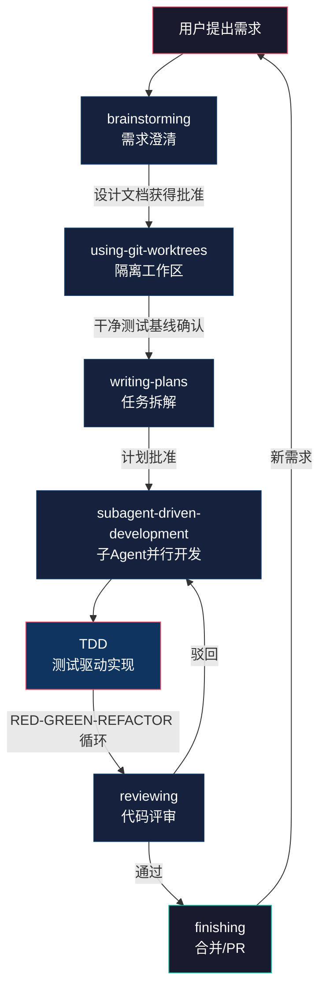

# Superpowers：让 Coding Agent 拥有完整开发方法论的插件系统

2025 年 10 月 9 日，Anthropic 正式发布 Claude Code 插件系统。同一天，Jesse Vincent 发布了 Superpowers 的第一个版本。截至 2026 年 5 月，这个项目在 GitHub 上积累了超过 199,000 个 Star，成为 Claude Code 生态中安装量仅次于 Anthropic 官方插件的第三方项目。

Superpowers 做的事情，表述起来简单得有些不真实：它给 Coding Agent 装上了一套开发流程。但「流程」这个词太轻了——它更像一个飞行模拟器里的自动驾驶仪，Agent 每次起飞都遵循同一条航线，每一步都不可跳过。

## 为什么直接写代码是错的

大多数 Coding Agent 的行为模式可以概括为：收到指令 → 开始写代码。这听起来像效率，实际上是一种错觉。一个没有约束的 Agent 会同时暴露三个问题：

1. **意图偏差**。你说「帮我做一个用户认证系统」，Agent 的理解和你想要的可能差了十万八千里，但它不会停下来问——它已经在写了。
2. **零测试防护**。每写一个功能，Agent 不会验证它是否破坏了已有功能。你今天修了一个 Bug，明天它悄悄被另一个修改覆盖了。
3. **架构漂移**。Agent 没有「设计」概念。它只是在当前文件的上下文中做出局部最优选择，但局部最优的叠加往往等于全局灾难。

这些问题不是 Agent 能力不够导致的。Claude、GPT-5 这些模型在代码生成上的能力已经足够强。问题是它们缺少工程纪律——那种在动手之前先停下来想一想的肌肉记忆。

Jesse Vincent 的洞察是：你没法靠更好的 prompt 解决这个问题。你没法写一条提示词让 Agent 「永远先写测试」——它会点头，然后继续直接写生产代码。你需要的是一个在系统层面强制执行流程的机制。

## 6 个技能构成的闭环

Superpowers 在 Agent 的决策链路中埋入了 6 个检查点，形成一个从需求到交付的完整闭环。每个技能不是建议——是强制规程。不满足条件，流程不会继续。



### brainstorming：先问清楚，再动手

brainstorming 在 Agent 检测到你要构建东西时自动触发。Agent 不会写代码，而是退后一步，像有经验的产品经理一样提问：

- 你真正想解决的问题是什么？不要描述你想要的方案，描述你遇到的困境。
- 技术栈有什么约束？团队规范是什么？有不可以改的遗留代码吗？
- 「完成」的定义是什么？什么情况下这个功能算交付了？

Agent 用一个关键技巧呈现设计文档：每段不超过 200-300 字。传统 AI 对话中，Agent 一上来就丢给你一堵墙一样的文字，你根本不会读完。Superpowers 把设计文档拆成短段落，一段一段让你确认，确保你真的消化了每个决策点。

### writing-plans：拆成 2-5 分钟能完成的小任务

需求确认后，Agent 把整个实现计划拆成若干个原子任务。每个任务包含三个要素：精确的文件路径、完整的代码改动描述、可执行的验证步骤。

这个颗粒度的选择经过了精心设计。2-5 分钟是一个「人类愿意看一眼」的时间窗口——太长了你会跳过检查，太短了拆解本身就是浪费。每个任务完成后，Agent 会自动进入验证环节，确认结果符合预期后再推进下一个。

### using-git-worktrees：隔离不是可选项

设计批准后，Agent 不会在你的主分支上操作。它使用 Git worktree 创建一个隔离的工作空间，在新分支上运行项目初始化，验证干净的测试基线。这意味着：

- 不同功能的工作完全隔离，互不污染
- 测试基线在开始前就被确认，任何新增的失败都可以追溯到当前改动
- 如果方向错了，丢弃整个 worktree 零成本回退

### subagent-driven-development：每个任务一个干净的上下文

这是 Superpowers 最激进的设计决策。传统 AI 编程助手的上下文会随着对话越来越长，Agent 越跑越偏。Superpowers 的做法是：每个任务派一个全新的子 Agent 去独立实现——零上下文污染。

主 Agent 把任务描述发给子 Agent，子 Agent 在自己的会话中实现、自测、提交、自审。然后派发另一个子 Agent 做规格审查（第一轮）和代码质量审查（第二轮）。两轮审查都通过后，结果返回主 Agent，继续下一个任务。

这意味着多个独立任务可以并行执行。主 Agent 不再是线性地一个一个做，而是像工程经理一样分配工作、收集结果、做质量把控。

### TDD：不是建议，是铁律

Superpowers 的 TDD 是真正的 RED-GREEN-REFACTOR 循环：

1. 先写失败测试
2. 运行测试，确认它失败（红色）
3. 写最小代码让测试通过（绿色）
4. 重构，保持测试通过
5. 提交

如果 Agent 先写了生产代码再写测试，Superpowers 要求**删除生产代码**，从测试开始重来。这不是教学示范，是强制执行。同时强调 YAGNI（You Aren't Gonna Need It）和 DRY（Don't Repeat Yourself），防止 Agent 过度设计。

### reviewing：两阶段审查

每个子 Agent 完成任务后，代码不会直接进入主线。Superpowers 启动两阶段审查：

1. **规格审查**：代码是否按照计划实现了？有没有遗漏或多余的功能？
2. **代码质量审查**：代码风格是否一致？有没有潜在的性能问题或安全漏洞？

审查结果按严重程度分级。严重问题会阻塞流程，Agent 必须修复后才能继续。轻微问题记录在案，不阻塞但会在后续任务中提醒。

## 为什么这套流程有效

人类开发者之所以能在复杂项目中保持方向感，靠的不是一次写出完美的代码，而是一套内化的工程纪律：先理解需求，再设计方案，拆成小步，每步验证，持续重构。这套纪律是多年经验积累的产物，已经变成了肌肉记忆。

AI Coding Agent 没有这种肌肉记忆。它接收到指令后，行为模式是直接响应——这是对话模型的设计特性，不是 bug。Superpowers 做的事情本质上是在 Agent 的决策链路上安装了一个「工程纪律层」，在每次代码生成之前强制插入一个检查点。

结果是 Claude Code 可以自主工作数小时而不偏离方向——不是因为它更聪明了，而是因为它被约束在了一个正确的流程里。

Jesse 在 README 中写道：

> Next up, once you say 'go', it launches a subagent-driven-development process, having agents work through each engineering task, inspecting and reviewing their work, and continuing forward. It's not uncommon for Claude to be able to work autonomously for a couple hours at a time without deviating from the plan you put together.

## 实战案例：从一句需求到合并 PR

下面用一个真实场景走完 Superpowers 的完整流程。假设你正在开发一个博客平台，需要添加一个「文章阅读时间估算」功能。

### 第 1 步：brainstorming——对话还原

你告诉 Claude Code：「给文章详情页加上阅读时间显示。」

Agent 没有直接写代码，而是开始了 brainstorming：

**Agent**：在开始之前，我想确认几个细节。这个阅读时间应该显示在文章详情页的什么位置？标题下方还是文章末尾？

**你**：标题下方，作者名字旁边。

**Agent**：阅读时间的计算基准是什么？一般中文阅读速度是每分钟 300-500 字，英文是 200-300 词。你希望用哪个基准？还是需要自动检测语言？

**你**：用户大部分是中文读者，用中文基准，每分钟 400 字。

**Agent**：阅读时间的最小显示单位是什么？比如一篇 100 字的文章，按 400 字/分钟算只有 0.25 分钟。是显示「少于 1 分钟」还是显示「1 分钟」？

**你**：向上取整到整数分钟，最少显示 1 分钟。

**Agent**：这个功能需要应用到已有的所有文章，还是只对新发布的文章生效？如果历史文章也需要，是否需要在渲染时动态计算，还是在文章发布时预先存储？

**你**：动态计算，这样修改基准后不需要重新发布所有文章。

**Agent**：最后一个问题——这个功能需要有测试吗？我的建议是至少要有单元测试覆盖计算逻辑和边界情况（空文章、纯图片文章、超长文章）。

**你**：对，需要测试。

Agent 生成了一份设计文档，分成 3 个短段落逐段展示：

1. 阅读时间计算逻辑（纯函数，输入文章内容，输出分钟数）
2. 前端展示位置和样式（标题下方，小号灰色文字）
3. 测试策略（单元测试覆盖计算逻辑，集成测试验证页面渲染）

你逐段确认后，brainstorming 阶段完成。

### 第 2 步：using-git-worktrees

Agent 创建了一个名为 `feature/reading-time` 的 Git worktree，切换到新分支，运行 `npm install && npm test` 确认测试基线全部通过。

### 第 3 步：writing-plans

Agent 将实现拆成 4 个原子任务：

| 任务 | 文件 | 预估时间 |
|------|------|---------|
| 实现 `estimateReadingTime` 纯函数 | `src/utils/reading-time.ts` | 3 分钟 |
| 编写阅读时间计算逻辑的单元测试 | `src/utils/reading-time.test.ts` | 3 分钟 |
| 在文章详情页组件中集成展示 | `src/components/ArticleDetail.tsx` | 3 分钟 |
| 编写集成测试验证页面渲染 | `src/components/ArticleDetail.test.tsx` | 4 分钟 |

你批准计划后，Agent 进入执行阶段。

### 第 4 步：subagent-driven-development + TDD

**任务 1：实现 `estimateReadingTime` 函数**

子 Agent 1 启动，它首先做的事情是——写测试。

```typescript
import { estimateReadingTime } from './reading-time';

describe('estimateReadingTime', () => {
  it('returns 1 for empty content', () => {
    expect(estimateReadingTime('')).toBe(1);
  });

  it('returns 1 for content under 400 characters', () => {
    expect(estimateReadingTime('短文章')).toBe(1);
  });

  it('calculates reading time correctly for typical article', () => {
    const content = 'a'.repeat(800);
    expect(estimateReadingTime(content)).toBe(2);
  });

  it('rounds up to nearest minute', () => {
    const content = 'a'.repeat(401);
    expect(estimateReadingTime(content)).toBe(2);
  });

  it('handles very long articles', () => {
    const content = 'a'.repeat(40000);
    expect(estimateReadingTime(content)).toBe(100);
  });
});
```

运行测试——全部失败（红色），因为函数还不存在。然后子 Agent 写最小实现：

```typescript
const CHARS_PER_MINUTE = 400;

export function estimateReadingTime(content: string): number {
  if (!content || content.length === 0) {
    return 1;
  }
  return Math.max(1, Math.ceil(content.length / CHARS_PER_MINUTE));
}
```

运行测试——全部通过（绿色）。子 Agent 提交代码，自审通过。

**任务 2 到 4**：同样的 RED-GREEN-REFACTOR 循环，子 Agent 依次完成测试编写、组件集成、集成测试。每个子 Agent 都在干净的上下文中工作，不继承前一个 Agent 的任何对话状态。

### 第 5 步：reviewing

所有任务完成后，审查 Agent 启动：

- 规格审查通过——4 个任务全部按照计划完成
- 代码质量审查通过——函数签名清晰，边界情况覆盖完整，组件样式与现有设计一致

### 第 6 步：合并

Agent 运行完整测试套件——全部通过。然后提交 PR，附带完整的实现说明和测试报告。

整个过程从你提出需求到 PR 提交，你只做了两件事：回答 brainstorming 阶段的问题，批准实施计划。Agent 自主完成了代码编写、测试、审查和文档。

## 与其他方法论的对比

Superpowers 不是凭空出现的。它处于 2025-2026 年 AI 辅助开发方法论演进的一个关键节点上。理解它与相关方法论的关系，有助于判断什么时候该用哪个。

### Superpowers vs Harness Engineering

Harness Engineering 由 Mitchell Hashimoto（HashiCorp 联合创始人）在 2026 年初正式提出，OpenAI 随后发表的 Codex 实验文章使其成为行业焦点。其核心公式是：

```
Agent = Model + Harness
```

Harness 包含 7 个组件：Context Engineering、Architectural Constraints、Tools & MCP Servers、Sub-Agents、Hooks & Back-Pressure、Self-Verification、Human-in-the-Loop。

两者的关系不是竞争，而是不同抽象层次：

| 维度 | Superpowers | Harness Engineering |
|------|------------|-------------------|
| 定位 | 开箱即用的开发流程插件 | 系统级工程方法论框架 |
| 抽象层次 | 技能层（Skill） | 架构层（Architecture） |
| 实现方式 | 预定义的自动触发技能 | 需要手动搭建的约束系统 |
| 适用场景 | 个人开发者，快速上手 | 团队/组织，定制化工程环境 |
| 核心关注 | 开发流程的纪律性 | Agent 环境的可靠性 |

Superpowers 可以理解为 Harness Engineering 的一个具体实现——它把 Harness 理念中的 Context Engineering（AGENTS.md）、Sub-Agents（子 Agent 开发）、Self-Verification（TDD + Review）等组件打包成了一个可安装的插件。如果你是一个独立开发者想立刻获得工程纪律，Superpowers 是最快的路径。如果你在为一个团队搭建 Agent 开发环境，Harness Engineering 提供了更底层的设计原则。

### Superpowers vs Compound Engineering

Compound Engineering 是 2026 年兴起的另一个范式，核心思想是「每次完成的任务都让下一次变得更快」——通过 AI Agent、自动化测试和快速反馈循环实现指数级生产力提升（300-700%）。它强调知识积累、可复用模式和自我文档化代码库。

| 维度 | Superpowers | Compound Engineering |
|------|------------|---------------------|
| 增长模型 | 线性质量保障 | 指数级加速 |
| 核心机制 | 强制执行流程 | 反馈循环复用 |
| 产出物 | 经过验证的代码 | 经过验证的代码 + 可复用知识 |
| 时间维度 | 单次任务的正确性 | 多次任务的累积效应 |

Compound Engineering 解决的是「如何让第 100 个任务比第 1 个任务快 10 倍」的问题，Superpowers 解决的是「如何让第 1 个任务做对」的问题。两者并不冲突——Superpowers 的 TDD 产生的测试套件本身就是 Compound Engineering 所依赖的知识资产。用 Superpowers 做出来的代码库天然具备 Compound Engineering 所需的测试覆盖和可维护性。

### 三者的关系

如果把 AI 辅助开发比作赛车：

- **Harness Engineering** 是赛道设计——弯道的角度、护栏的位置、安全标准
- **Superpowers** 是驾驶规范——起步前检查胎压、过弯前减速、每圈记录圈速
- **Compound Engineering** 是性能调校——根据上一圈的数据调整悬挂、优化换挡时机

三者可以叠加使用。一个团队可以基于 Harness Engineering 原则设计 Agent 环境，用 Superpowers 实施开发流程，最终通过 Compound Engineering 实现持续加速。

## FAQ

**Q1：Superpowers 适合所有项目吗？**

不适合。Superpowers 的 overhead 是真实存在的——brainstorming 阶段可能需要 5-10 分钟，计划拆解也需要时间。对于改动一个变量名、写一个工具函数这类 30 秒能完成的任务，用 Superpowers 是过度设计。它的最佳适用场景是持续时间超过 30 分钟、涉及多个文件的复杂任务。

**Q2：Agent 真的能自主工作数小时吗？**

Jesse 在 README 中的表述是「a couple hours at a time」。实际体验取决于任务复杂度、Agent 的能力（不同模型差异很大）和你的项目结构。结构清晰、测试覆盖好的项目，Agent 自主工作时间更长。混乱的遗留代码会显著缩短这个时间窗口。

**Q3：如果我不认同 Agent 的设计方案怎么办？**

brainstorming 阶段的设计文档是逐段确认的，你可以在任何一步提出修改。这不是一个「Agent 说了算」的流程——你始终是决策者，Agent 是执行者。如果你对某个设计决策不满意，直接告诉 Agent 修改方向，它会基于新方向重新生成对应的设计段落。

**Q4：TDD 强制要求会不会导致过度测试？**

Superpowers 的 TDD 结合了 YAGNI 原则——只测试当前需求需要的功能，不测试「将来可能需要」的场景。同时测试是作为实现的一部分产生的，不是事后的额外工作。你不会得到一个测试覆盖率 100% 但代码臃肿的项目，因为每个测试都对应一个明确的需求。

**Q5：Superpowers 和直接写 prompt 有什么区别？**

直接写 prompt 是一次性的、线性的交互。你说一句，Agent 做一下。流程控制完全靠你手动管理。Superpowers 是结构化的、自动触发的流程——Agent 的行为是预设的，不需要你每次提醒「先写测试」「先确认需求」。区别类似于让一个实习生「用敏捷开发方法论」和直接给他一个 Sprint 管理工具——前者靠自觉，后者靠系统。

**Q6：多个 Harness（如 Claude Code + Cursor）同时使用会冲突吗？**

Superpowers 在不同 Harness 中独立安装、独立运行。你在 Claude Code 中安装的 Superpowers 不会影响 Cursor 中的 Superpowers 行为。但如果你在两个工具中同时操作同一个项目，Git worktree 隔离机制会确保它们不会互相干扰——每个 Harness 在自己的 worktree 中工作。

**Q7：Superpowers 适合团队使用吗？**

Superpowers 的主要设计场景是个人开发者。但团队可以使用它来统一 Agent 的行为规范——确保团队中每个人使用的 Agent 都遵循同样的开发流程、同样的代码风格、同样的测试标准。不过团队级的 Agent 工程化，Harness Engineering 提供了更系统的框架。

## 自检测试

安装 Superpowers 后，你可以用以下检查项验证它是否正常工作。这些检查项也适合作为日常开发中的自我审查清单。

**检查 1：Agent 是否在写代码前先提问？**

提出一个模糊的需求，比如「帮我加个功能」。正常工作的 Superpowers 会让 Agent 进入 brainstorming 模式，开始提问而不是直接写代码。如果 Agent 直接开始写代码，说明 brainstorming 技能没有正确触发。

**检查 2：是否创建了 Git worktree？**

批准设计后，检查你的 Git 仓库是否有新的 worktree 被创建（`git worktree list`）。没有 worktree 意味着 using-git-worktrees 技能没有生效。

**检查 3：子 Agent 是否先写测试再写代码？**

观察 Agent 的输出。如果它先写生产代码再写测试，说明 TDD 技能没有正确执行。Superpowers 的设计要求子 Agent 在实现功能之前先输出测试代码。

**检查 4：测试是否真的运行了？**

测试代码写完后，Agent 应该主动运行测试并报告结果。如果 Agent 写了测试但没有运行，或者运行了但没有报告失败/通过状态，说明验证环节有缺失。

**检查 5：审查环节是否触发？**

一个任务完成后，Agent 应该启动审查流程。如果 Agent 直接跳到下一个任务而没有审查，说明 requesting-code-review 技能没有正确触发。

**检查 6：RED-GREEN-REFACTOR 循环是否完整？**

观察一个完整的任务执行过程。正确流程应该是：测试代码（红）→ 运行测试确认失败 → 实现代码（绿）→ 运行测试确认通过 → 重构（保持绿色）→ 提交。任何一个环节缺失都说明 TDD 流程被跳过了。

**检查 7：Agent 是否在合并前运行了完整测试套件？**

所有任务完成后，在合并/提交 PR 之前，Agent 应该运行一次完整的测试套件并确认全部通过。如果跳过这一步，可能意味着 finishing-a-development-branch 技能没有正确执行。

## 支持的 Harness

| Agent | 安装方式 |
|-------|---------|
| Claude Code | `/plugin install superpowers@claude-plugins-official` |
| Codex CLI | `/plugins` 搜索安装 |
| Cursor | `/add-plugin superpowers` |
| OpenCode | Fetch from `raw.githubusercontent.com/.../INSTALL.md` |
| Gemini CLI | `gemini extensions install https://github.com/obra/superpowers` |
| Factory Droid | `droid plugin install superpowers@superpowers` |
| GitHub Copilot CLI | `copilot plugin install superpowers@superpowers-marketplace` |

## 适用边界

Superpowers 有明显的 overhead，不适合所有场景。

**改造收益最大的场景：**

- 持续时间超过 30 分钟、涉及多个文件修改的复杂任务
- 有明确验收标准的功能开发（知道「做完」长什么样）
- 需要测试覆盖率的项目（库、API、后端服务）
- 和 Agent 协作中反复出现「方向偏离」问题的开发者

**用 Superpowers 反而浪费时间的场景：**

- 30 秒内能完成的单文件修改（改变量名、修一个 typo）
- 纯探索性任务——你还不确定要做什么，需要边试边看
- 一次性脚本或临时工具（写完就扔的代码不需要工程纪律）

**一个实用的判断标准：** 如果你在开始一个任务之前，自己会先花 5 分钟做设计——那这个任务就应该用 Superpowers。

## 相关阅读

- [12-factor-agents：构建生产级LLM应用的核心原则](/posts/tech/12-factor-agents-production-llm-guide/)
- [Andrej Karpathy Skills：提升Claude Code的实战指南](/posts/tech/andrej-karpathy-skills-guide/)
- [Claude Code Plugins 官方目录](/posts/tech/anthropics-claude-plugins-official-guide/)