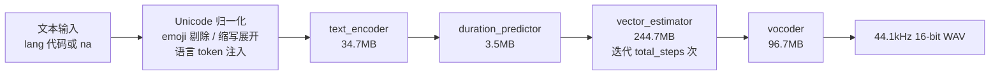

Supertonic 用一条激进的体积路线回答端侧 TTS 问题：把模型压到约 99M 参数，全部导出 ONNX，不要求 GPU，在树莓派和电子阅读器上实时出声。这条路走通了——2026 年 4 月发布的 Supertonic 3 支持 31 种语言、44.1kHz 16-bit WAV 输出、10 个行内表达标签，朗读准确率在与更大模型的对比中不掉队。

但今天评估它，先要面对一个更急迫的事实：**2026-07-23 Supertone 官方宣布仓库归档，停止全部开发与支持；Voice Builder 音色定制服务于 2026-08-31 关闭。** 仓库已迁移到 `supertone-oss-archive` 组织并标记 archived，issues 和 PR 不再受理，不会再有 bug 修复和安全补丁。所以本文要回答的问题不是「要不要用」，而是「拿它当什么」：一份还能跑、但不会再修的遗产代码，还是一次值得读的端侧语音工程样本。

> **事实边界**：本文核对的是归档仓库 `supertone-oss-archive/supertonic` 的 `main` 分支 README、GitHub API（应用程序接口）在 2026-09-29 的读数、`supertonic-py` 仓库 main 分支文档，以及 PyPI 上 `supertonic` 1.3.1（2026-05-18 上传，仍是最新版）wheel 的解包源码。Hugging Face 模型文件清单来自 HF API 的实际读取。Voice Builder 站点状态是 2026-09-29 的实测结果。文中所有性能数字除注明外均出自仓库 README 或 HF 模型卡，属官方自述口径。

## 目录

- [项目坐标](#项目坐标2026-09-29-核对)
- [三代模型：从单语英语到 31 种语言](#三代模型从单语英语到-31-种语言)
- [合成管线：四个 ONNX 文件](#合成管线四个-onnx-文件)
- [31 种语言里没有中文](#31-种语言里没有中文)
- [朗读准确率：这组数字能说明什么](#朗读准确率这组数字能说明什么)
- [一次合成如何流过系统](#一次合成如何流过系统)
- [SDK 与 CLI：1.3.1 的真实接口](#sdk-与-cli131-的真实接口)
- [本地 HTTP 服务：supertonic serve](#本地-http-服务supertonic-serve)
- [多运行时与生态](#多运行时与生态)
- [归档时间线与残余可用性](#归档时间线与残余可用性)
- [适用边界与采用建议](#适用边界与采用建议)
- [FAQ](#faq)
- [维护指引](#维护指引)
- [参考来源](#参考来源)

## 项目坐标（2026-09-29 核对）

| 字段 | 值 |
|---|---|
| 仓库 | [supertone-oss-archive/supertonic](https://github.com/supertone-oss-archive/supertonic)（原 supertone-inc/supertonic，301 迁移） |
| 状态 | **已归档**（archived: true，官方公告 2026-07-23） |
| Stars / Forks | 13,790 / 1,548 |
| 建仓 / 最后推送 | 2025-11-18 / 2026-09-09 |
| 许可证 | 示例代码 MIT；**模型权重 OpenRAIL-M**（HF 仓库另附 LICENSE） |
| 模型文件 | [supertone-oss-archive/supertonic-3](https://huggingface.co/supertone-oss-archive/supertonic-3) |
| Python 包 | [supertonic 1.3.1](https://pypi.org/project/supertonic/)（Python >= 3.9，2026-05-18） |

仓库在 GitHub 上标为主语言 Swift，那是因为 iOS 和 Swift 示例代码体量最大；模型本体是一组 ONNX 文件，Python SDK 独立在 `supertonic-py` 仓库。这也是理解这个项目结构的关键：**主仓库是「模型 + 十一种运行时的示例集合」，SDK 是另一个包**。

## 三代模型：从单语英语到 31 种语言

从 2025 年 11 月到 2026 年 4 月，五个月里发了三代，每代的能力边界差得很远，讨论「Supertonic 支持什么」时必须先说清是哪一代：

| | Supertonic 1 | Supertonic 2 | Supertonic 3 |
|---|:---:|:---:|:---:|
| 发布 | 2025-11 | 2026-01-06 | 2026-04-29 |
| 参数量 | 约 66M | 约 66M | 约 99M |
| 语言 | 1（英语） | 5 | 31 + `na` 回退 |
| 表达标签 | — | — | 10 个 |
| 代码位置 | — | `release/supertonic-2` 分支 | `main` |

三代全部归档，权重都留在 HF 的 `supertone-oss-archive` 命名空间下。10 个内置音色是 F1–F5 和 M1–M5 十个 JSON 文件（2025-12-10 从 4 个扩到 10 个），没有训练环节，合成时选一个用。

## 合成管线：四个 ONNX 文件

Supertonic 3 的公开权重是四个 ONNX 文件，外加推理配置和 Unicode 词表两份 JSON，实测体积如下：



近三分之二的权重体积压在 `vector_estimator` 上，质量参数 `total_steps`（5 到 12，默认 8）花的也是它——迭代步数直接决定这段跑多久。文本侧的归一化在 Python 层做，1.3.1 的 `UnicodeProcessor` 源码里能看到完整步骤：去 emoji、符号替换、缩写展开、标点清理、补句号、注入语言 token。

架构依据是四篇论文，都挂在仓库 Citation 节：SupertonicTTS 主架构（[arXiv:2503.23108](https://arxiv.org/abs/2503.23108)，语音自编码器加基于 flow matching 的文本到隐空间模块）、LARoPE 文本-语音对齐（[arXiv:2509.11084](https://arxiv.org/abs/2509.11084)）、Self-Purifying Flow Matching 噪声标签训练（[arXiv:2509.19091](https://arxiv.org/abs/2509.19091)）、RobustSpeechFlow（[arXiv:2605.22083](https://arxiv.org/abs/2605.22083)）。官方没有逐一标注四个 ONNX 文件与论文模块的对应关系，上图的模块名就是文件名。

「端侧能跑」有一组可对照的官方演示：树莓派实机合成视频、Onyx Boox Go 6 电子阅读器飞行模式下平均 RTF 0.3×、Chrome 扩展把整页网页转成音频用时不到一秒。这些出自 README 自述和演示视频，不是第三方复测。RTF 0.3× 的含义是合成一秒音频约需 0.3 秒计算，即便数字有水分，在阅读器这类低压设备上实时性也有余量。

## 31 种语言里没有中文

这是中文读者最需要的一条。官方清单是 31 个 ISO 代码：阿拉伯语、保加利亚语、克罗地亚语、捷克语、丹麦语、荷兰语、英语、爱沙尼亚语、芬兰语、法语、德语、希腊语、印地语、匈牙利语、印尼语、意大利语、日语、韩语、拉脱维亚语、立陶宛语、波兰语、葡萄牙语、罗马尼亚语、俄语、斯洛伐克语、斯洛文尼亚语、西班牙语、瑞典语、土耳其语、乌克兰语、越南语。**没有中文（zh）。**

不知道输入是什么语言时可以传 `lang="na"`，模型按语言无关方式处理——这是给「混合语言或拿不准语言」准备的回退，不是中文支持：官方没有声称 `na` 模式下的中文效果，31 语言基准里也没有中文读数。把中文文本丢给 `na` 能出声，但读得对不对、自然不自然，没有任何官方材料背书，用前自己测。

表达标签同理别高估：README 称支持 10 个行内标签，文档点名了其中三个——`<laugh>`、`<breath>`、`<sigh>`，直接写进文本即可，不需要参考音频。完整清单没有随归档文档留下，写代码时按「确定存在的只有这三个」处理。

## 朗读准确率：这组数字能说明什么

README 给的基准是在 Minimax-MLS-test 上与 VoxCPM2、OmniVoice、Qwen3-TTS 等对比的逐语言 WER（词错误率，日韩等字符语言用 CER，字符错误率）。挑几行有代表性的：

| 语言 | VoxCPM2 | OmniVoice | Qwen3-TTS | Supertonic 3 |
|---|:---:|:---:|:---:|:---:|
| 英语 | 2.11 | 2.02 | 2.25 | **2.06** |
| 韩语（CER） | 4.70 | 3.22 | 4.07 | **3.26** |
| 西班牙语 | 1.34 | 0.99 | 0.75 | **1.13** |
| 日语（CER） | 3.35 | 3.81 | 3.67 | **4.61** |
| 越南语 | 1.48 | 0.79 | — | **4.49** |

三个问题先于数字：

1. **测的是什么**：朗读准确率——把文本读对的能力，包括数字、缩写、货币符号这类文本归一化难题。不测音质、韵律和音色相似度。
2. **数字反映系统的哪部分**：文本前处理和发音路径的稳健性。README 对 Supertonic 3 相对 v2 的官方结论也是这一类——重复/跳读失败更少，共享语言集上说话人相似度更高。
3. **不能推出什么**：推不出「全面优于 VoxCPM2」。西班牙语它输给 Qwen3-TTS，日语和越南语明显落后（越南语 4.49 对 OmniVoice 的 0.79）。对比对象是各自当时的版本，非中文语言的成绩也推不到中文。

这个基准反而佐证了定位：Supertonic 3 的朗读准确率在英语等强项语言上能和 0.7B–2B 级模型掰手腕，代价是没有情感控制和音色克隆管线——开源仓库明确说 fixed-voice，不包含官方声音克隆路径。

## 一次合成如何流过系统

把「一条 curl 请求变成 WAV」作为任务流案例，它能同时串起管线和 API 两层：

1. 一个只懂 OpenAI SDK 的客户端把 base URL 指到本地，发出 `POST /v1/audio/speech`，请求体里 `model` 必填、`input` 必填、`voice` 不填。
2. serve 进程按 Pydantic schema 校验：`voice` 缺省补 `M1`，`speed` 限制在 0.7 到 2.0，`response_format` 只认 `wav`/`flac`/`ogg`。这个别名端点随后归一到原生端点 `/v1/tts`。
3. 引擎加载的是启动时指定的模型（默认 `supertonic-3`）。文本先进 `UnicodeProcessor` 归一化，若超长会按 `max_chunk_length`（默认上限 300 字符，韩语自动 120）切块。
4. 每个块按上文管线走一遍：编码、预测时长、`vector_estimator` 迭代 8 步（`steps` 参数）、vocoder 出 44.1kHz 采样，块间插 `silence_duration`（默认 0.3 秒）静音。
5. 音频通过 `soundfile` 打包进响应体返回，不是落盘路径。出错时返回 OpenAI 形状的错误信封（`code: unsupported_response_format` 这类），所以 OpenAI SDK 的报错处理直接可用。

这条链路的每一步都来自 1.3.1 wheel 源码与官方 serve 文档，不是推测。它的价值在于划清两件事的边界：**文本归一化在 Python 层、可读可改；声学推理在 ONNX 层、黑盒但快**。想改发音习惯改前者，想提速度调 `steps` 和 `speed`。

## SDK 与 CLI：1.3.1 的真实接口

网上流传的 Supertonic Python 示例有一部分调用的方法在包里并不存在，这里以 1.3.1 wheel 解包后的真实签名为准。`TTS` 类只有两个公开调用方法：`synthesize` 和 `save_audio`，**没有 `.tts()`、没有 `.save()`、也没有任何流式方法**：

```python
from supertonic import TTS

tts = TTS()                          # 默认模型 supertonic-3
style = tts.get_voice_style("M1")    # 内置音色：M1–M5、F1–F5

wav, duration = tts.synthesize(
    "Good morning, thank you for calling.",
    voice_style=style,               # 必传，Style 对象
    lang="en",                       # 31 个 ISO 代码之一；不传则走 na 回退
)
tts.save_audio(wav, "output.wav")    # 44.1kHz 16-bit WAV
```

`synthesize` 的完整参数是 `total_steps`（默认 8，质量档）、`speed`（默认 1.05，范围 0.7–2.0）、`max_chunk_length`（默认 None）、`silence_duration`（默认 0.3 秒）、`verbose`。首次运行会把约 400MB 模型下载到 `~/.cache/supertonic3/`——参数量 99M 是 fp32 的 ONNX 文件，`onnx/` 目录实测约 380MB，宣传数字和磁盘占用是两回事。

自定义音色走 `get_voice_style_from_path()`，加载一份音色 JSON（Voice Builder 的导出格式，或内置音色文件）。依赖只有四个：onnxruntime、numpy、soundfile、huggingface-hub。

CLI 有八个子命令（`tts`、`say`、`synth`、`voices`、`info`、`download`、`version`、`serve`），最常用的是：

```bash
pip install supertonic
supertonic tts 'Meeting starts in five minutes.' -o output.wav --voice F1 --steps 10 --lang en
```

`say` 命令本地播放，需要额外装 `supertonic[playback]`。

## 本地 HTTP 服务：supertonic serve

1.3.1 内置本地 HTTP 服务，给 n8n、浏览器扩展、Home Assistant 这类已经会说 OpenAI Audio Speech API 的调用方当本地后端：

```bash
pip install 'supertonic[serve]'      # serve 是可选依赖：fastapi + uvicorn
supertonic serve                     # 默认绑定 127.0.0.1:7788
```

默认回环地址，绑到其他接口会在 stderr 打一行警告——暴露到外网要自己在反向代理层加认证。六个端点：

| 方法 | 路径 | 用途 |
|---|---|---|
| GET | `/v1/health` | 就绪状态，返回模型名、采样率、已加载音色数 |
| GET | `/v1/styles` | 列出内置与导入的音色 |
| POST | `/v1/styles/import` | 导入音色 JSON，存到 `~/.cache/<model>/custom_styles/` |
| POST | `/v1/tts` | 原生合成，参数最全 |
| POST | `/v1/audio/speech` | OpenAI 兼容别名 |
| POST | `/v1/tts/batch` | 单请求最多 64 条，返回 base64 |

`/v1/tts` 请求体字段：`text`（必填）、`voice`（默认 `M1`）、`lang`、`speed`、`steps`、`max_chunk_length`、`silence_duration`、`response_format`。注意请求体里**没有输出路径字段**，音频直接在响应体里，用 `curl -o` 接：

```bash
curl -X POST http://127.0.0.1:7788/v1/audio/speech \
  -H 'content-type: application/json' \
  -d '{"model":"supertonic-3","input":"Hello from my local server.","voice":"M1","response_format":"wav"}' \
  -o output.wav
```

输出格式只有 `wav`（默认）、`flac`、`ogg` 三种，mp3、aac、opus 被有意排除——文档给出的理由是 libsndfile 的 OPUS 编码器只支持 8/12/16/24/48kHz，与模型的 44.1kHz 对不上，而 mp3/aac 会引入额外编码器依赖。要这些格式得在客户端外转。运行中的服务在 `/docs` 有交互式 OpenAPI 文档。

## 多运行时与生态

主仓库为十一个运行时各留了一个示例目录：Python、Node.js、Browser（WebGPU/WASM）、Java、C++、C#、Go、Swift、iOS、Rust、Flutter。目录里是可运行的示例，不是发布到各包管理器的官方 SDK——除 PyPI 上的 `supertonic` 外，其他生态要用，基本是把示例代码拷进项目。

几个非显然的运行前提，出自归档 README：Go 示例要装 ONNX Runtime C 库（macOS 上 `brew install onnxruntime`）；Java 要 JDK 而非 JRE（示例按 openjdk@17 验证）；C# 目标 .NET 9；iOS 示例用 xcodegen 生成工程。

生态页列了一批基于它构建的东西，能看出端侧 TTS 的几类典型用法：浏览器扩展（TLDRL、Read Aloud）、iOS 电子书朗读（PageEcho）、浏览器内语音对话（VoiceChat）、照片+语音生成说话头像（OmniAvatar）、给 Cursor 和 Claude Code 做本地回复语音的 Aftertone，以及社区维护的推理后端移植 `supertonic-mnn`（fp32/fp16/int8）。Transformers.js 对它的支持走的还是社区 PR。

## 归档时间线与残余可用性

| 时间 | 事件 |
|---|---|
| 2025-11-18 | 仓库创建，Supertonic 1（仅英语） |
| 2025-12-10 | PyPI 包上线；内置音色从 4 个扩到 10 个 |
| 2026-01-06 | Supertonic 2：5 种语言 |
| 2026-01-22 | Voice Builder 上线（参考音频定制音色，云服务） |
| 2026-04-29 | Supertonic 3：31 种语言、10 个表达标签 |
| 2026-05-18 | PyPI 1.3.1：`supertonic serve` 与 OpenAI 兼容端点 |
| 2026-05-20 | Supertonic 3 进入 Supertone Play 与 Supertone API（托管服务） |
| 2026-07-23 | **归档公告**：停止开发与支持；Voice Builder 定于 8 月 31 日关闭 |
| 2026-09-09 | 仓库最后一次推送（迁移至 supertone-oss-archive） |
| 2026-09-29 | 本文核查时点：Voice Builder 域名已返回 404 |

归档不等于内容消失，但它改变了每一类依赖的性质：

- **权重还在，且锁了版本**。归档 README 给出的下载命令把 HF revision 钉死在 `aafc6e3`，意思是给你一个不会再变的快照，适合复现，不适合期待改进。
- **pip 自动下载暂时还能用，但口径已经变了**。1.3.1 的 wheel 里钉的是旧 `Supertone` HF 命名空间，2026-09-29 实测仍返回 200；归档文档明说旧版包「may still use the original namespace」，并建议改走手动下载加 `model_dir`、`auto_download=False` 的路径。依赖自动下载的构建流程随时可能断，别把它当稳定依赖。
- **Voice Builder 服务的残值只剩本地半截**。服务已关，但曾经导出的音色 JSON 依然有效——`get_voice_style_from_path()` 和 `/v1/styles/import` 都能加载。托管的替代路径是 Supertone Play 与 Supertone API（README 口径；本文核查时 `play.supertone.ai` 连接超时，可达性请自行验证）。
- **社区支持归零**。131 个未关闭的 issue 和 PR 停在那里，Discord 邀请链接虽然还通着，官方已不再承担支持义务。

## 适用边界与采用建议

先说它仍然成立的场景：

- **固定音色的端侧朗读**：电子书、网页朗读、设备播报。10 个内置音色、无网络、无 GPU、44.1kHz 直出，这条路上它依然是完成度很高的开源样本。
- **嵌入式与浏览器实验**：树莓派和 WebGPU 两条路都有现成示例，MNN 移植覆盖量化推理。
- **本地批处理**：serve 的 64 条批量端点加整段合成，适合离线把文稿转音频。

再说不成立的：

- **中文产品**。31 语言无中文，`na` 回退无背书，这条直接否掉。
- **实时对话式语音**。没有流式接口，长句只能等整段合成完；对话场景要的是首包延迟，它给不了。
- **需要长期支持的生产依赖**。无安全补丁、无 bug 修复，出了问题只能自己读源码。
- **精细情感与音色克隆**。表达标签只有三类被文档确认，克隆管线不开源，云服务还关了。

落到决策上：

- **今天要选型语音合成**：把 Supertonic 当能力基准而不是候选——用它的 WER 表和 RTF 数字校准预期，候选池里找维护中的项目。选它进生产的前提是你接受「从此自己维护」。
- **已经在用且跑得稳**：把 HF revision 和模型文件一起锁进你的制品库，断开对自动下载的依赖，按归档软件对待——能用很多年，但每个升级和补丁都是你的事。
- **做端侧语音研究或教学**：这是难得的完整样本——四篇论文、四个可查体积的 ONNX 模块、十一种运行时的对照实现，拿来讲「99M 参数怎么塞进端侧」比多数教学项目扎实。
- **想要自定义音色**：开源路径已不存在。 Voice Builder 的存量 JSON 还能用；新需求只能看 Supertone 的托管服务，那是商业产品，不在开源仓库的承诺范围内。

## FAQ

**Q1：Supertonic 支持中文吗？**

不支持。31 种语言的官方清单里没有中文，基准里也没有中文读数。`lang="na"` 回退模式会做语言无关处理，但官方没有对中文效果做任何声明，中文文本只能自行实测。

**Q2：有流式合成接口吗？**

没有。1.3.1 wheel 全包搜不到任何 stream API，`synthesize` 是整段进整段出，serve 也只返回完整音频。对话式低延迟场景不适用。

**Q3：能商用吗？**

要分两层看。示例代码是 MIT；模型权重是 OpenRAIL-M，一种带使用限制的开源模型许可，商用前需要读 HF 仓库里的 LICENSE 文件确认你的用途不在限制清单里。归档不收回许可，但也不会再更新条款解释。

**Q4：模型到底多大？**

参数量约 99M（对 0.7B–2B 级开源 TTS 而言很小）；磁盘上 `onnx/` 目录实测约 380MB（fp32），Python 文档的下载口径约 400MB（含配置与音色文件），缓存在 `~/.cache/supertonic3/`。

**Q5：现在还能 `pip install supertonic` 吗？**

能。1.3.1 仍在 PyPI（2026-09-29 核对），首次运行的自动下载走的旧 HF 命名空间实测也还通。但官方建议归档后改用手动下载权重加 `model_dir`、`auto_download=False`，避免命名空间再次变动时构建中断。

**Q6：Voice Builder 关了，自定义音色还有办法吗？**

本地训练音色的开源路径本来就不存在（仓库是 fixed-voice）。已有的 Voice Builder 导出 JSON 可通过 `get_voice_style_from_path()` 或 `/v1/styles/import` 继续使用；新的音色定制只能走 Supertone 的托管产品（Play/API），那属于商业服务。

## 维护指引

本文的关键断言、核实入口与失效条件：

| 断言 | 核实入口 | 失效条件 |
|---|---|---|
| 仓库已归档、迁移至 supertone-oss-archive | GitHub API `archived` 字段 | 字段翻转为 false（基本不可能） |
| stars 13,790 / forks 1,548 | GitHub API，2026-09-29 读数 | 归档仓库读数仍会小幅变动，引用需带日期 |
| 无中文、31 语言清单 | README「Supported Languages」与 HF 模型卡语言表 | 归档仓库不会再改；若未来有社区 fork 支持中文，另当别论 |
| 无流式 API、`.tts()`/`.save()` 不存在 | PyPI wheel 解包，`supertonic/pipeline.py` | 有社区 fork 发布新包时需重查 |
| serve 默认端口 7788 | wheel 源码 `cli.py` 与 `docs/cli/serve.md` | 同上 |
| Voice Builder 已关闭 | 2026-07-23 官方公告 + 2026-09-29 实测 404 | 域名恢复只说明历史快照可访问，服务不会回归 |
| pip 自动下载仍可用 | 实测旧 HF 命名空间返回 200 | 随时可能失效，引用需带核对日期 |
| 代码 MIT / 模型 OpenRAIL-M | 根目录 LICENSE 与 HF 仓库 LICENSE 文件 | 许可不会追溯变更 |

本文环境注记：作者在 macOS 上核对源码与 API 读数，未实跑合成与 serve 服务；代码示例均照录 1.3.1 源码签名与官方文档，未经实机验证的部分已注明。

## 参考来源

- 归档仓库：<https://github.com/supertone-oss-archive/supertonic>（原 supertone-inc/supertonic）
- Python 包文档（仓库内）：<https://github.com/supertone-oss-archive/supertonic-py/blob/main/docs/index.md>
- serve 文档：<https://github.com/supertone-oss-archive/supertonic-py/blob/main/docs/cli/serve.md>
- PyPI：<https://pypi.org/project/supertonic/>
- 模型权重（Supertonic 3）：<https://huggingface.co/supertone-oss-archive/supertonic-3>
- 官方试听展示：<https://supertonic3.github.io/>
- SupertonicTTS 论文：<https://arxiv.org/abs/2503.23108>
- 原命名空间 <https://supertone.github.io/supertonic/> 已失效（404，2026-09-29 实测），旧文提到的 `Supertone/supertonic-3` HF 地址目前经重定向仍可访问，但请以 `supertone-oss-archive` 为准。
