用 Rust 重写的 JavaScript 工具链不少，SWC 是被生产验证得最彻底的一个。Next.js 自 v12 起默认用它编译，Deno 通过 `deno_ast` 调它的 parser 和 transforms，`@swc/core` 一周被下载三千八百万次。但围绕它的两句流行说法，跟当前仓库对不上。

一句是"SWC 靠 SIMD 把 Babel 甩开几十倍"。把 main 分支浅克隆下来，`core::arch` 与 `std::arch` 在 `crates/` 下命中 0 次，唯一一处 `is_x86_feature_detected` 在 WASM（WebAssembly）插件后端的一句 TODO 注释里。另一句是"SWC 正在把重心转向自研 bundler（打包工具）"。官方文档那一页顶部的施工告示写的是相反方向：这个功能会在 v2 移除。

下面按 2026-09-19 的 main 分支拆开看：119 个 crate 怎么组织，对外为什么是三层入口，一次 `transformSync` 实际穿过哪些层。速度收益单独一节处理，只列仓库里能指认到的手段。读它不需要会写 Rust，但如果正在考虑把整条编译链路交给一个 Rust 组件，后面几节的边界会直接影响判断。

## 三个先行的判断

**对外暴露的入口有三层。** 仓库里没有"一个 `swc` crate 导出全部应用程序接口（API）"的结构。三层各管一类调用方：`swc` 是端到端编译入口，`swc_ecmascript` / `swc_css` 是按特性开关的语法域聚合，`swc_core` 是给插件作者按需开特性用的门面。把它们混为一谈，会直接导致选错依赖。

**速度是架构与并行度带来的，跟指令集无关。** 官方给出的那组数字本身就说明了重心——单线程 20 倍、四核 70 倍。从 20 到 70 的那一段增量来自并行，而不是微优化。

**这一年的改动重心在绑定层，不在打包工具。** `bindings/` 下 12 个宿主绑定 crate，最近 90 天有 43 次提交；其中一件是 2026-09-13 落地的"原生 npm 发布要过载体校验"。同一时间窗内 `crates/swc_bundler` 也有 25 次提交。其中 24 次形如 "chore: Publish crates with swc_core v78.0.0"，出自发布机器人；剩下一次是跟着一次 AST 重构改的下游代码。一个在被继续投入，一个只在跟着版本走。

## 项目坐标

| 字段 | 值 |
|------|------|
| 仓库 | [swc-project/swc](https://github.com/swc-project/swc) |
| 定位 | Rust 写的 TypeScript / JavaScript 编译器，同时是 Rust 库和 npm 包 |
| Stars / Forks | 34,198 / 1,556（2026-09-19，GitHub API） |
| License | Apache-2.0（主仓）；平台原生包标注 `Apache-2.0 AND MIT` |
| `crates/` 条目数 | 119，全部带 `Cargo.toml` |
| 根 crate `swc` 版本 | 78.0.0；`swc_core` 80.0.0 |
| MSRV（最低支持 Rust 版本） | 1.73（README 声明）；仓库自身用 `nightly-2026-04-10` 构建 |
| Node.js 要求 | 使用 `@swc/core` 需 v10+；开发 SWC 本身需 v20+ |
| `@swc/core` | npm 最新稳定 1.16.2（2026-09-04 发布） |

`crates/swc/Cargo.toml` 的 `description` 是 "Speedy web compiler"，`name` 字段与仓库同名。README 第一行也交代了它的双重身份："It's a library for Rust and JavaScript at the same time."

## 仓库结构：workspace 才是主体

打开仓库的第一层，`Cargo.toml` 里 `[workspace]` 的成员声明是：

```toml
members = [
  "xtask",
  "bindings/*",
  "crates/*",
  "tools/generate-code",
  "tools/swc-releaser",
  "tools/swc-native-addon-pack",
]
```

也就是说根 `Cargo.toml` 只是清单。目录职责按语言层和宿主层分开：

```text
swc-project/swc/
├── crates/            ← 119 个 Rust crate，编译器本体
│   ├── swc/                     端到端编译入口
│   ├── swc_ecma_parser/         JS/TS 解析器
│   ├── swc_ecma_lexer/          词法器（新拆出，尚未接线）
│   ├── swc_ecma_ast/            AST（抽象语法树）类型
│   ├── swc_ecma_visit/          Fold / VisitMut / Visit 的生成实现
│   ├── swc_ecma_transforms/     内建 transform 聚合
│   ├── swc_ecma_transforms_base/  resolver / hygiene / fixer
│   ├── swc_ecma_codegen/        AST → 源码
│   ├── swc_ecma_minifier/       JS 压缩
│   ├── swc_typescript/          TS 专属 transform
│   ├── swc_ts_fast_strip/       不建全量 AST 的类型剥离
│   ├── swc_css_parser/ … swc_css_minifier/   CSS 一族
│   ├── swc_html_parser/ … swc_html_minifier/  HTML 一族
│   ├── swc_xml_parser/ … swc_xml_visit/        XML 一族
│   ├── swc_bundler/             实验性打包器
│   ├── swc_core/                插件作者门面
│   ├── swc_ecmascript/          ECMAScript 域聚合
│   └── swc_atoms/ swc_common/ swc_visit/ swc_allocator/ swc_graph_analyzer/
├── bindings/          ← 12 个绑定 crate 加一份 README
│   ├── binding_core_node/       napi-rs，产出 @swc/core 的 .node
│   ├── binding_core_wasm/  binding_html_node/  binding_minifier_node/
│   └── swc_cli/                 发布为 swc_cli 与 @swc/cli
├── packages/          ← 6 个 npm 包源码
│   ├── core/ helpers/ types/ html/ minifier/ react-compiler/
├── scripts/           ← 维护脚本
├── tools/             ← 代码生成与发版工具
├── ARCHITECTURE.md    ← 151 行，一手架构说明
├── MAINTENANCE.md     ← 发版流程
└── docs/              ← ADR 与原生载体说明
```

几处容易记错的落点：CLI（命令行工具）不在 `crates/` 下，而在 `bindings/swc_cli`（crate 名 `swc_cli`，0.125.2），实现体在 `crates/swc_cli_impl`；JS 压缩 crate 叫 `swc_ecma_minifier`，写作 `swc_minifier` 查不到；Node.js 绑定叫 `bindings/binding_core_node`，没有 `swc_node_bindings` 这个 crate；`crates/swc_module_graph` 已经从树上消失，承担类似职责的是 `swc_graph_analyzer`。前三个名字在 crates.io 上查也是 404。

树上有两个 crate 值得单独留意，它们透露了下一步的拆分方向。`swc_ecma_lexer`（"This crate provides a lexer for ECMAScript and TypeScript"）目前是零依赖：`swc_ecma_parser` 仍然带着自己的 `src/lexer/`，`Cargo.toml` 里没有引用它。也就是说词法器被搬出去了，但还没接线。同期的 `swc_ecma_transformer`（"Compatibility layer for the ECMAScript standard"，21.0.2）则已有三处仓内依赖者。两者都在 2026-05 前后的发布提交里落到当前位置。看这类大 workspace 的演进方向，"新 crate 有没有人依赖"比 changelog 的措辞更早给出信号。

## 三层入口，各管一类调用方

把 `swc`、`swc_ecmascript`、`swc_core` 说成"一个 umbrella"是常见误读。三者的 re-export 策略完全不同。

**`crates/swc`** 是编译器入口。它的 `transform` 签名（`crates/swc/src/lib.rs:925`）收一个已经解析好的 `Program` 和一个实现了 `swc_ecma_visit::Fold` 的 pass，返回新的 `Program`：

```rust
pub fn transform(
    &self,
    handler: &Handler,
    program: Program,
    external_helpers: bool,
    mut pass: impl swc_ecma_visit::Fold,
) -> Program
```

它对外的 `pub use` 很少，只包括 `swc_compiler_base::{PrintArgs, TransformOutput}`、`swc_config::types` 的几个配置类型、`try_with_handler`、`SwcComments`，以及把 `swc_sourcemap` 重命名导出为 `sourcemap`。想 `use swc::*` 拿到 parser 和 AST 类型是拿不到的——那些要直接依赖 `swc_ecma_parser`、`swc_ecma_ast`。

**`crates/swc_ecmascript`** 才是语法域聚合器，把子 crate 改名后统一暴露：

```rust
pub use swc_ecma_ast as ast;
#[cfg(feature = "codegen")]
pub use swc_ecma_codegen as codegen;
#[cfg(feature = "minifier")]
pub use swc_ecma_minifier as minifier;
#[cfg(feature = "parser")]
pub use swc_ecma_parser as parser;
#[cfg(feature = "transforms")]
pub use swc_ecma_transforms as transforms;
#[cfg(feature = "visit")]
pub use swc_ecma_visit as visit;
```

写法是"改名 + 特性开关"：`swc_ecmascript::parser` 这条路径稳定，但要用 `minifier` 必须显式开 `minifier` 特性。`swc_css` 用的是同一套手法（`pub extern crate`），HTML、XML 两族亦然。

**`crates/swc_core`** 面向写插件的人，特性粒度更细：`base`、`common`、`ecma_ast`、`ecma_visit`、`ecma_transforms`、`ecma_loader`、`bundler`、`quote`、`utils`、`transform_common`、`plugin_transform` 等，官方文档专门有一页《Selecting swc_core》讲怎么挑。插件作者只依赖它，不必自己拼十几个 crate 的版本号。

这三层是分开的抽象，好处很清楚：`swc` 可以激进调整端到端接口，因为下游少；`swc_ecma_parser` 这类底层 crate 保持窄接口，被 Deno（经 `dprint-swc-ext` 这层扩展）、Parcel、Next.js 各自封装，也不会互相牵连。代价是版本矩阵——119 个 crate 各自有独立版本号，`swc` 78.0.0 和 `swc_core` 80.0.0 就不同步，这也是下面"版本同步"一节存在的原因。

## 一次 transformSync 调用穿过哪些层

抽象层级摆清楚了，看一次真实调用。装 `@swc/core@1.16.2`，跑这段：

```javascript
import { transformSync } from "@swc/core";

const result = transformSync(
  `const greet = (name: string) => console.log("Hi " + name);`,
  {
    jsc: { parser: { syntax: "typescript" }, target: "es2020" },
    filename: "a.ts",
  }
);
console.log(result.code);
```

实测输出（`@swc/core` 1.16.2 / Node.js 24.18）：

```javascript
const greet = (name)=>console.log("Hi " + name);
```

返回值只有 `code` 和 `diagnostics` 两个键，加上 `sourceMaps: true` 才会多出 `map`。这次调用在进程里的路径是：

```mermaid
flowchart LR
    A["JS: transformSync()"] --> B["options 序列化为 Buffer"]
    B --> C["binding_core_node（napi-rs）"]
    C --> D["swc::config::Options 反序列化"]
    D --> E["swc / swc_compiler_base 编排"]
    E --> F["swc_ecma_lexer → swc_ecma_parser"]
    F --> G["resolver → 内建 transforms → hygiene → fixer"]
    G --> H["swc_ecma_codegen"]
    H --> I["SourceMap 与诊断回传 JS"]
```



两个细节值得单独说，都会直接影响排错。

其一是 options 以 `Buffer` 过界。`packages/core/index.js` 里那行调用是 `bindings.transformSync(src, isModule, toBuffer(newOptions))`，配置先编码再在 Rust 侧反序列化。所以键名写错时报的是反序列化失败，不是类型错误。把 `module` 误放进 `jsc` 里，拿到的是这么一段：

```text
Error: Failed to deserialize buffer as swc::config::Options
JSON: {"jsc":{"parser":{"syntax":"typescript"},"module":{"type":"commonjs"}},"filename":"x.ts"}
Caused by:
    unknown field `module`, expected one of `assumptions`, `parser`, `transform`,
    `externalHelpers`, `target`, `loose`, `keepClassNames`, `baseUrl`, `paths`,
    `minify`, `experimental`, `lints`, `preserveAllComments`, `output`,
    `rewriteRelativeImportExtensions`, `preserveSymlinks` at line 1 column 79
```

`module` 是顶层键，不在 `jsc` 下。这段 `expected one of` 就是当前版本 `jsc` 的权威字段清单，排查配置问题时比翻文档快。目标版本写错走的是同一个入口，只是末行换成 `Unknown ES version: es2025`。

其二是全局状态被三层线程局部作用域包住。`swc::transform` 的实际顺序是 `Globals` → `HELPERS.set(...)` → `HANDLER.set(handler, op)`，最内层才执行 `program.fold_with(&mut pass)`。`Globals` 结构体里装的是 hygiene 数据与 `Mark` 分配表（`hygiene_data`、`dummy_cnt`、`marks`），`Mark::new()` 就是 `Mark::fresh(Mark::root())`。这解释了为什么每个 worker 线程要各自持有一个 `Globals`。

`target: "es5"` 时同一份输入编译成：

```javascript
var greet = function greet(name) {
    return console.log("Hi " + name);
};
```

`JscTarget` 是一个闭合枚举：`es3`、`es5`、`es2015` 一直到 `es2024`，外加 `esnext`。截至 1.16.2 没有 `es2025` 这一档。

## 三个基础 pass：resolver、hygiene、fixer

`ARCHITECTURE.md` 只有一百多行，但点出了 SWC 的 transform 之所以能组合的原因：

> There are three core transforms named `resolver`, `hygiene`, `fixer`. Other transforms depend on them.

**resolver** 把文件里所有标识符解析并打标。`let a = 1; { let a = 1; }` 变成 `let a#0 = 1; { let a#1 = 1; }`，`#` 后面是 hygiene id；符号同名但 id 不同就视为不同变量。**hygiene** 再把它们改成真实不同的名字（`a` 和 `a1`）。这一步是自动变量管理的基础——任何生成代码的 transform 都不必顾虑会撞上用户已有的变量名，生成 AST 时可以随便起名。

**fixer** 修补结构上合法但打印时会出错的 AST。ARCHITECTURE.md 给的例子是运算符优先级：某个 pass 生成 `BinExpr { left: "1 + 2", op: "*", right: "3" }`，fixer 会把它改成显式带括号的形态，最终打印为 `(1 + 2) * 3;`。这意味着写 transform 时不需要自己维护优先级。

这三层解释了为什么 `Fold` 够格当对外抽象：一个 pass 只描述"遇到什么节点换成什么"，作用域唯一性和打印正确性交给头尾的公共 pass 兜底。少了这层兜底，每个插件都得自己处理重名和括号。

CSS 是另一条独立流水线（`swc_css_parser` → `swc_css_*`），HTML 和 XML 各成一套，四族共享的只是 `swc_common`、`swc_visit`、`swc_atoms` 这些底座。ECMAScript 这一支内部还有两种模式。一种是走完整解析、建 AST、再做 transform；另一种用 `swc_ts_fast_strip` 只剥类型、不建 AST。后者在 `Cargo.toml` 里自称 "Super-fast TypeScript stripper based on SWC"，Deno 的 `type_strip` 特性接的就是它。只需要删掉类型标注时，走后一条路径可以省掉整棵树的构建开销。

## 速度：官方数字测的是什么，仓库里能指认什么

swc.rs 首页那句是：

> SWC is **20x faster than Babel** on a single thread and **70x faster** on four cores.

它测的是同一份转译工作在三种执行环境下的耗时——单线程 Rust、四核并行 Rust、跑在 V8 里的 Babel；不含冷启动、不含量化产物体积，也不能推出"接进你的项目就快 20 倍"。从 20 到 70 的增量说明并行度比单点优化更值钱，这个判断和仓库里能翻到的实现手段是自洽的。

Next.js 官方文档给的是另一组数：编译器"17x faster than Babel"，切到 SWC 后"~3x faster Fast Refresh and ~5x faster builds"，v13 起默认的压缩"7x faster than Terser"。测的对象各不相同——前者是单文件转译，中间是端到端开发体验，最后是压缩阶段。三组数字放在一起看，越接近整条构建链路，收益越小，因为编译只占其中一段。

那 SWC 快在哪？以下是 `crates/` 里能逐个指认到的手段，不是推测：

| 手段 | 落点 | 作用 |
|------|------|------|
| 编译产物为原生码 | 全仓 | 相对 V8 解释执行 AST 遍历的直接优势 |
| 区域分配（bump allocation） | `swc_allocator`（"A thin wrapper for bumpalo"） | AST 节点批量分配、整体释放，省掉逐个 `drop` |
| 字符串驻留（interning） | `swc_atoms` 包一层 `hstr` | 标识符以驻留句柄 `Atom` 承载；crate 文档建议 AST 节点里优先用 `Atom` 而不是 `String` |
| 数据并行 | `rayon` + 各 crate 的 `concurrent` 特性 | 多文件转译并行；`swc` 的 `concurrent` 会同时打开 transforms、common、minifier 三条 |
| 过程宏生成样板 | `ast_node`、`string_enum`，另有 `parser_macros`、`codegen_macros` | Visit/Fold 遍历代码由生成得到，手写只留语义 |


这些手段有一个共同点：压的是每个 AST 节点的处理成本，以及跨文件之间的可并行性，跟单个热循环的指令吞吐关系不大。按这个归因链，收益应当随文件数增长而放大；只转译单个文件时，`concurrent` 特性基本没有介入空间。这条推论在自己的代码库上一次 `time` 就能验，不必信任何人的机器。

`ARCHITECTURE.md` 末尾还交代了正确性怎么保证：解析结果要和 `test262/pass-explicit` 逐条相同，代码生成对齐黄金文件。快是拿测试矩阵换来的。评估"要不要把编译链路交出去"时，这一条比 benchmark 数字更有用。

## Node 绑定：napi-rs，和一块 26 MB 的原生码

`@swc/core` 不含第二套编译器，它是 `bindings/binding_core_node` 的 npm 发布形态。依赖清单里是 `napi` 3、`napi-derive` 3、`napi-build` 2，即 napi-rs 一套，没有 Neon。这个区别也不只是名字。WASM 那一侧走的是另一条路：`bindings/binding_core_wasm` 依赖 `wasm-bindgen`（还开了 `enable-interning`），与 napi 无关。同一份 Rust 编译器因此有两个互不通用的宿主接口。

体积常被写成"`@swc/core` 约 9 MB"，这个数字两头都不贴。npm 上的主包解包后只有 133,980 字节、14 个文件，装进 `node_modules` 是 160 KB。原生码在平台专属的可选依赖里：`@swc/core-darwin-arm64@1.16.2` 解包后 26,624,226 字节，实测目录占用 26 MB。

主包的 `optionalDependencies` 与 `packages/core/package.json` 的 `napi.targets` 一一对应，共 12 项。覆盖 macOS 的 x86_64 与 aarch64，Windows 的 x86_64、i686、aarch64-msvc，Linux 上 x86_64 与 aarch64 各分 GNU 和 musl，另有 armv7-gnueabihf、powerpc64le、s390x。一次安装只会命中其中一项。

仓库里还多了一层载体机制，但尚未进入稳定版发布。`docs/native-addon-carriers.md` 由 2026-09-13 的 `feat(bindings): gate native npm releases on verified carriers` 引入，方案是让 `@swc/core`、`@swc/html`、`@swc/minifier`、`@swc/react-compiler` 在主要平台上只发布一个 zstd 压缩、自加载的 `.node`：首次加载时解压出原始 addon，校验长度、镜像格式与 SHA-512 摘要后转发注册，物化出的字节与构建输入一致；缓存按用户隔离，目录形如 `swc-native-<uid>/v1/`，可用 `SWC_NATIVE_BINDING_CACHE` 指定，失败抛 `ERR_SWC_NATIVE_*`。包名、JS API、可选依赖声明都不变。对照 npm 上 1.16.2 的 `@swc/core-darwin-arm64`，里面仍是未压缩的 26,612,480 字节 `swc.darwin-arm64.node`（tarball 10.9 MB）。所以按现在的发布状态，成本还是要按 26 MB 的解包体积算。

## 插件是 Rust 写成、编译成 WASM

"SWC 插件可以用 JS/TS 写、编译成 WASM 加载"这个说法与仓库不符。官方文档《Getting started》写的是插件用 Rust 编写、产物是 `.wasm`；`swc-project/plugins` 的 README 第一行同样写着 "Plugins for SWC, written in Rust"。宿主侧通过 `swc_plugin_runner` 加载，后端有 `swc_plugin_backend_wasmer` 和 `swc_plugin_backend_wasmtime` 两个。

已经移植到 SWC 侧的 Babel 插件比许多人以为的多。`swc-project/plugins` 的清单里有 emotion、styled-components、styled-jsx、jest、relay、remove-console、react-remove-properties、transform-imports、loadable-components、prefresh、formatjs，以及 swc-confidential、swc-magic 两个自建场景。npm 上 `@swc/plugin-styled-components` 与 `@swc/plugin-transform-imports` 都是 14.0.0（2026-09-04），`@swc/plugin-emotion` 是 16.0.0。Next.js 侧的接法是 `experimental.swcPlugins`，数组元素为 `[插件名或 .wasm 绝对路径, 选项对象]`，v12.2.0 起提供。

所以"冷门 Babel 插件没有等价实现"这句话要收窄：CSS-in-JS 主流几家已经在列，缺口落在长尾插件上。更硬的成本是写作门槛，从"会 JS 就行"变成"会 Rust、会 `swc_visit` 的 `Fold`"。

## Bundler：官方已经写明将在 v2 移除

`swc.rs/docs/usage/bundling` 那一页的标题是 "Bundling (swcpack)"，正文第一段是施工告示：

> 🚧 This feature will be dropped in v2, in favor of SWC-based bundlers like Parcel 2, Turbopack, Rspack, fe-farm. Please use one of the bundlers instead.

命名也常被写反。文档原话是：这个功能当前叫 `spack`，到 v2 会改名为 `swcpack`，`spack.config.js` 届时由 `swcpack.config.js` 取代。这个模块的历史也比看上去长。`swc_bundler` 在 crates.io 上的首个版本发布于 2020-08-12，到 2026-08-24 已发过 1083 个版本。一个跑了六年的东西在文档里挂上"将被移除"，读作维护成本的信号比读作技术判断更准确。

保留的能力对理解 SWC 的模块处理仍有价值：与 rollup 一致的紧凑输出、跨文件命名冲突自动处理、tree shaking（摇树优化）、import deglobbing（把 `import * as lib from "lib"; lib.foo()` 收窄成具名导入且保留副作用）、CommonJS 互操作（转译成 `__spack_require`）。

Rust 侧的两个入口方法，逐字抄自 `crates/swc_bundler/src/bundler/mod.rs`（第 110 与 155 行，实现体略）：

```rust
impl<'a, L, R> Bundler<'a, L, R>
where
    L: Load,
    R: Resolve,
{
    pub fn new(
        globals: &'a Globals,
        cm: Lrc<SourceMap>,
        loader: L,
        resolver: R,
        config: Config,
        hook: Box<dyn 'a + Hook>,
    ) -> Self

    pub fn bundle(&mut self, entries: HashMap<String, FileName>)
        -> Result<Vec<Bundle>, Error>
}
```

`entries` 是 `HashMap<String, FileName>`，不是元组向量；`SourceMap` 也要显式传进去，位置在 `globals` 之后。方法上的注释还标了一个坑：入口之间若互相循环引用会 panic，普通依赖里的循环引用不受影响。

所以选型问题该换成另一个：要打包工具，就用建立在 SWC 之上的 Parcel 2、Turbopack、Rspack、Farm；要的是可编程的 AST 变换和压缩，`swc` 或 `@swc/core` 本身够用。

## 版本同步：那条 curl 是给下游用的

这一节只对把 SWC 当 Rust 依赖直接用的项目有用；只装 npm 包的读者可以跳到下一节。119 个 crate 各自演进，会引出两类不同的问题：仓库内怎么一起发版，下游项目怎么把依赖升到互相兼容的一组。SWC 给这两件事分别准备了工具，而第二条常被当成第一条来讲。

README 里那句承诺是给 Rust 调用方的：

> If you select the latest version of each crates, it will work

紧跟的可执行步骤是：

```bash
curl https://raw.githubusercontent.com/swc-project/swc/main/scripts/update-all-swc-crates.sh | bash -s
```

需要 `jq` 和 `cargo upgrade`（来自 `cargo-edit`）。这个脚本跑在**你自己的项目**里，不是 SWC 的发版工具。读它的实现，实际动作只有两步：先用 `cargo metadata --all-features` 列出 `repository` 指向 `swc-project/swc` 或 `swc-project/plugins` 的所有包，对每个 `名字@版本` 跑 `cargo update -p`；再取本项目的直接依赖与前者求交集，跑 `cargo upgrade --incompatible --recursive false -p <crate>`。脚本不改任何 crate 的版本号，也不执行 `cargo build`。README 里那句 "and run `cargo build` to ensure that everything works" 与脚本现状对不上，编译验证得自己做。

真正的发版流程写在 `MAINTENANCE.md`：PR 上用 `@changeset` 机器人标记受影响的 crate，合并后由 `cargo mono publish --no-verify` 一次性发布全部 crate。`swc-project/plugins` 用 `./scripts/update-bump-all.sh`，CI 在合并后自动发布。也就是说"任意时刻所有 SWC crate 的最新版本组合可编译"是靠 CI 加 `cargo-mono` 的单仓多 crate 发版维持的，不是靠一条 shell 脚本。

边界也要清楚：这条 curl 只覆盖 `repository` 指向那两个仓库的包。`dprint-swc-ext`（dprint 维护的一层 SWC 封装，Deno 经 `deno_ast` 走它）不在其中，依赖它的下游得单独升。

## 和 esbuild 的差异：不在有没有 AST

常见对照表会把 esbuild 写成"解析后直接生成代码，没有中间 AST 转换"。这个说法站不住：`internal/` 下同时存在 `js_ast`、`js_lexer`、`js_parser`、`js_printer`、`compat`、`renamer`、`linker`，`internal/js_parser/js_parser.go` 一万八千八百余行。esbuild 有完整 AST，也有降级（lowering）阶段。

真实的差别是**转换发生在哪里、谁能介入**。

| 维度 | SWC | esbuild |
|------|-----|---------|
| 语言 | Rust | Go |
| AST | `swc_ecma_ast`，公开类型 | `js_ast`，内部实现 |
| 降级与兼容 | 独立 pass 链：`swc_ecma_compat_es3` 与 `es2015` 到 `es2022` 各占一个 crate，再加 `common`、`bugfixes`、`regexp`，共 12 个 | 融合进 parser 与 `internal/compat` |
| 插件介入粒度 | AST 节点：Rust `Fold` 编译为 WASM | `resolve` / `load` 两个钩子；Go 接口与 JS 接口都不给 AST |
| 打包工具 | `spack` → v2 移除 | 从设计起就是主用途 |
| 类型剥离 | 全量解析，或 `swc_ts_fast_strip` 单遍剥类型 | TS 转译为 JS（不做类型检查） |
| 主要宿主 | Next.js、Deno、Parcel 2、Turbopack、Farm | Vite、tsup、tsx |

esbuild 按文件介入的插件钩子只有两个：`bundler.go` 里的 `RunOnResolvePlugins` 和 `runOnLoadPlugins`，另有 `OnStart` / `OnEnd` 两个构建生命周期钩子。钩子拿到的是文件路径和字节内容，拿不到节点。想在 esbuild 里改写一条语法，只能通过 `Contents` 或 `Loader` 换一整份文件，做不到"遇到这个调用表达式换成那个"。SWC 反过来：AST 层可编程是它的核心卖点，代价是宿主绑定和 WASM 往返这层成本。

所以"要不要换"不由语言决定。需要自定义语法级转换（框架编译期注入、把某种 DSL 转成 JS、批量改写调用点）时，SWC 的 `Fold` 加 WASM 插件是少数能直接支撑这条路的选择。只需要快、只调 loader 和 resolve、不想引入原生依赖时，esbuild 更省事。把 SWC 叠在 Vite 后面属于第三种情况。Vite 默认用 esbuild 转译，社区桥接包是 `unplugin-swc`（1.6.0，2026-09-07）。被广泛引用的 `@vitejs/plugin-swc` 在 npm 上并不存在。

## 采用边界：谁能直接受益，谁要再算一笔

适合把 SWC 放进链路的情况：

- 构建以转译和压缩为主要耗时，且文件数多——并行度才有发挥空间。
- 需要自定义 AST 级转换，且团队能写 Rust。
- 已经在 Next.js、Deno、Parcel 2、Farm 的生态里，SWC 是默认或既有选项。
- 要把 TS 类型剥离做成单遍操作，直接用 `swc_ts_fast_strip`。

不必或要谨慎的情况：

- Next.js 项目里还留着 `.babelrc`。官方文档写明编译器 "enabled by default since Next.js version 12"，同一页也写着：留有任何 Babel 配置的应用会 "opt-out of the Next.js Compiler and continue using Babel"。配置文件还在，迁移就没真的发生。
- 只需要 bundle 加 minify，没有自定义转换需求。
- 依赖长尾 Babel 插件的运行时行为，而不是它的输出。
- 目标是尽量零原生依赖的极简镜像；`@swc/core` 总归要落一个 26 MB 量级的 `.node`。

三条工程注意点：

- **版本一起升。** 119 个 crate 各自有版本号，`swc` 78.0.0 与 `swc_core` 80.0.0 不同步是常态。`@swc/core`、`@swc/types`、`@swc/helpers` 属于同一批发布物，只升其中一个容易出现配置字段对不上。要么整套升，要么用脚本一次算清交集。
- **MSRV 只写在 README。** `rust-version` 字段只有 `swc_native_addon` 一个 crate 声明（1.73），仓库自身构建用 nightly。把 `swc_ecma_parser` 引入锁稳定版 Rust 的项目前，先在目标工具链上编一次，而不是照着 1.73 推断。
- **直接依赖子 crate 比走 `swc` 更稳。** `swc` 是端到端入口，接口面比 `swc_ecmascript` 宽；只需要 parser 和 AST 就单独依赖 `swc_ecma_parser`、`swc_ecma_ast`，破坏性变更波及面小得多。

## 五种实际会碰到的报错

前两行在 1.16.2 上实测复现过，后三行分别写在源码注释、Next.js 文档和仓库内的载体说明里：

| 现象 | 原因 | 处置 |
|------|------|------|
| `Failed to deserialize buffer as swc::config::Options`，末行 `unknown field` | 配置键放错层级（例如把 `module` 写进 `jsc`） | 读错误里的 `expected one of` 列表，它是当前版本的权威字段清单 |
| 同一句 `Failed to deserialize`，末行 `Unknown ES version: es2025` | `target` 超出闭合枚举（最高 `es2024`，另有 `esnext`） | 换 `esnext`，或等 `@swc/core` 支持该档位 |
| Next.js 里改了配置却看不到 SWC 生效 | 项目仍有 `.babelrc` 或其他 Babel 配置，编译器自动退出 | 删掉 Babel 配置，或明确接受继续用 Babel |
| `swc_bundler::Bundler::bundle` 直接 panic | 传入的 `entries` 之间互相循环引用 | 把互引的入口拆成独立调用；普通依赖环不受影响 |
| 加载 `.node` 时抛 `ERR_SWC_NATIVE_*` | 原生载体的长度、镜像格式或 SHA-512 校验没过 | 删掉缓存目录（默认在 `swc-native-<uid>/v1/`）让首次加载重跑；稳定版 1.16.2 还没引入这层机制，报出这个错说明用的是更新的构建 |

配置类问题一律先看 `transformSync` 抛出的原始字符串，它比任何二手文档都新。生态类问题去 `swc.rs/docs/migrating-from-babel` 和 `migrating-from-tsc` 两页对照，前一页的说法很直白：SWC 的 CLI 是按 Babel 的替代品设计的，`npx babel` 换成 `npx swc`，并且覆盖全部 stage 3 提案与 `preset-env`（含 bugfix 转换）。

## 五个自测问题

**问题 1**：`swc`、`swc_ecmascript`、`swc_core` 分别给谁用？

<details>
<summary>参考答案</summary>
`swc` 是端到端编译入口，`transform` 接收 `Program` 加一个 `Fold`，re-export 很窄；`swc_ecmascript` 把 ECMAScript 域子 crate 改名并按特性开关聚合（`parser`、`ast`、`codegen`、`minifier` 等）；`swc_core` 面向插件作者，特性粒度更细（`base`、`ecma_visit`、`plugin_transform` 等），避免手拼十几个 crate 的版本。
</details>

**问题 2**：resolver、hygiene、fixer 各自解决什么？

<details>
<summary>参考答案</summary>
resolver 解析并给标识符打 hygiene id；hygiene 把同名不同 id 的标识符改成不同名字，使生成的代码不必顾虑命名冲突；fixer 修补结构合法但打印会出错的 AST（如运算符优先级），让写 pass 的人不必自己维护优先级表。
</details>

**问题 3**：swc.rs 那句"20x / 70x"在测什么？不能推出什么？

<details>
<summary>参考答案</summary>
测的是同一份转译工作在单线程 Rust、四核并行 Rust 与 V8 里的 Babel 之间的耗时差。它推不出冷启动耗时，也推不出产物体积，更不能推"接进任意项目都至少快 20 倍"。Next.js 报的三组数（转译 17x、Fast Refresh 3x、整体构建 5x）正好演示了这条衰减曲线。
</details>

**问题 4**：想给 SWC 写一个自定义 transform，用什么语言、产出什么？

<details>
<summary>参考答案</summary>
Rust，编译为 `.wasm`，宿主经 `swc_plugin_runner` 加载（wasmer 或 wasmtime 后端）。JS/TS 不能直接写 SWC 插件。Next.js 用 `experimental.swcPlugins` 注册，元素是插件名或 `.wasm` 绝对路径加选项对象。
</details>

**问题 5**：需要 Rust 侧打包能力，正确判断是什么？

<details>
<summary>参考答案</summary>
`swc_bundler`（当前名 `spack`）官方声明将在 v2 移除，推荐改用建立在 SWC 上的 Parcel 2 / Turbopack / Rspack / Farm。若只需要 AST 转换与压缩，用 `swc` 或 `@swc/core`；若坚持用 SWC 打包工具，注意 `bundle` 的 `entries` 是 `HashMap<String, FileName>`，入口互相循环引用会 panic。
</details>

## 下一步读哪份代码

按目的挑，不必顺序读完：

- 想理解为什么 transform 能自由组合：`ARCHITECTURE.md` 的 resolver / hygiene / fixer 三节，然后进 `crates/swc_ecma_transforms_base/src/`。
- 想加自定义语法转换：先读 `swc.rs/docs/plugin/selecting-swc-core` 与《Getting started》，再顺着 `crates/swc/src/lib.rs` 的 `transform` 看编排落在哪。
- 想知道某段代码怎么被打印出来：`crates/swc_ecma_codegen/`，黄金文件在它的 `tests/fixture`、`tests/str-lits` 下。`ARCHITECTURE.md` 把这些文件写作 `tests/references`，那是旧路径，以目录现状为准。
- 想剥 TS 类型而不建 AST：`crates/swc_ts_fast_strip/src/lib.rs` 的 `operate`。
- 遇到加载或体积问题：`docs/native-addon-carriers.md`，以及 `bindings/binding_core_node/Cargo.toml`。
- 维护自己的构建链路：`MAINTENANCE.md` 与 `scripts/update-all-swc-crates.sh`。

## 参考资料

- [swc-project/swc](https://github.com/swc-project/swc)
- [ARCHITECTURE.md](https://github.com/swc-project/swc/blob/main/ARCHITECTURE.md)
- [MAINTENANCE.md](https://github.com/swc-project/swc/blob/main/MAINTENANCE.md)
- [Native addon carriers](https://github.com/swc-project/swc/blob/main/docs/native-addon-carriers.md)
- [swc.rs 首页](https://swc.rs/)
- [Bundling (swcpack)](https://swc.rs/docs/usage/bundling)
- [Selecting swc_core](https://swc.rs/docs/plugin/selecting-swc-core)
- [ECMAScript plugin getting started](https://swc.rs/docs/plugin/ecmascript/getting-started)
- [swc-project/plugins](https://github.com/swc-project/plugins)
- [Next.js Compiler](https://nextjs.org/docs/architecture/nextjs-compiler)
- [`@swc/core` on npm](https://www.npmjs.com/package/@swc/core)

> 本文事实核对基于 2026-09-19 的 `swc-project/swc` main 分支浅克隆（`crates/` 119 项、`bindings/` 12 个绑定 crate、`packages/` 6 项），并实测 `@swc/core@1.16.2` 在 Node.js 24.18 下的 `transformSync` 行为。仓库 Star 数与派生数取 GitHub API、下载量取 npm API 于 2026-09-10 至 09-16 的数据、crate 存在性用 crates.io 交叉验证。后续重看时，优先级最高的是 bundler 收口进度、`swc_ts_fast_strip` 的宿主接入范围、原生载体的目标平台矩阵，以及 README 的 MSRV 声明是否变化。
