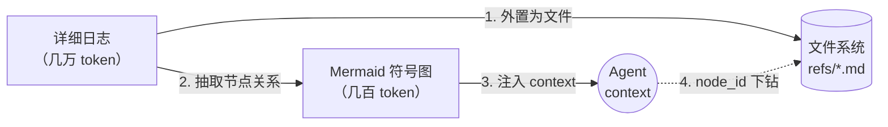

# TencentDB Agent Memory：用分层 + 符号化对抗 Agent 上下文膨胀

## 一句话核心判断

长任务跑久了，Agent 的"上下文窗口"会变成"上下文垃圾场"——这才是 Agent 真正难做工程的原因。TencentDB Agent Memory（`@tencentdb-agent-memory/memory-tencentdb`，仓库 `TencentCloud/TencentDB-Agent-Memory`）把记忆当成"分层文件系统 + 符号图"两件东西一起做：长会话里的工具日志压缩成 Mermaid 符号图（短期），跨会话的人物偏好/工作流抽成 L0→L3 的语义金字塔（长期）。最终在 SWE-bench 50 连发任务这种"上下文最紧张"的场景里砍掉 33% token、把通过率从 58.4% 推到 64.2%。

如果只在乎一次性对话、scope 也只是检索召回，那主流的 RAG 向量库已经够了；只有遇到"多轮、跨会话、必须保住细节可追溯"的真实工程场景，这套分层架构才有不可替代的价值。

## 系统地图：双轴架构

整体架构由两个相互正交的轴构成，每个轴解决一类问题：

```
                        短期（任务内）                          长期（跨任务）
                ┌──────────────────────────────────┐  ┌──────────────────────────────────┐
                │  Symbolic Short-term Memory      │  │  Layered Long-term Memory        │
                │  ──────────────────────────      │  │  ──────────────────────────      │
   信息结构：    │  全量工具日志 → Mermaid 符号图  │  │  会话语料 → Persona / Scenario   │
                │  + 节点 ID 可下钻                 │  │  L0 Conversation → L3 Persona    │
                │                                  │  │                                  │
   存储介质：    │  refs/*.md（外置）+ Mermaid 字符  │  │  SQLite + sqlite-vec（本地）      │
                │                                  │  │  + Markdown 文件（顶层结构）      │
                │                                  │  │                                  │
   替代问题：    │  "上下文太长"                    │  │  "记不住用户习惯"                │
                │                                  │  │                                  │
                └──────────────────────────────────┘  └──────────────────────────────────┘
                          ↓                                          ↓
                          └──────────┬───────────────────────────────┘
                                     ▼
                          Agent 决策循环（reasoning + tool calls）
```

短期轴解决"上下文窗口装不下日志"的问题：把一次任务内的工具输出（搜索结果、报错堆栈、代码 diff）压缩成可被人和 LLM 同时读懂的 Mermaid 图，配 `node_id` 随时下钻。

长期轴解决"下次还得向 Agent 复述 SOP"的问题：把跨会话的对话、原子事实、场景块、用户偏好堆成金字塔，顶层 Persona 直接喂给模型，需要细枝末节才往下钻。

两个轴都用**异构存储 + 渐进披露**（progressive disclosure）落地——底层保留全量事实以备回查，顶层只保留密度最高的结构化信息。

## 短期轴：Mermaid 符号图 + 节点下钻

### 压缩对象

长任务里 token 消耗最大的不是 LLM 思考，而是工具调用的中间产物：grep 命中、curl 返回体、stack trace、单测输出。这些内容往往动辄万 token，但里头的"关键节点"可能只有几十处。

### 压缩策略

短期轴做的事情按下面四步推进：

1. **全量日志外置**：工具原始输出落到 `refs/*.md` 文件，不进入 context。
2. **提炼关系图**：从外置日志里抽节点、节点间依赖、关键决策点，写成 Mermaid 图。
3. **轻量注入**：只把 Mermaid 文本塞进 context（仅几百 token），让 Agent 看图推理。
4. **按需下钻**：Agent 如果对某节点产生疑虑，调用 `node_id` 检索原始日志，临时拉回。

这套机制本质上是给 LLM 装了一个"虚拟内存"——context 是高速缓存，`refs/*.md` 是主存，需要哪段再分页拉。下面是它的简化伪数据流：



### 关键设计取舍

这套机制有几个不直观的地方值得记住：

- **Mermaid 选型而不是 JSON/纯文本**：Mermaid 对 LLM 是"自带分隔符的 DSL"，节点和边天然高密度；同样信息，JSON 表达会多吃约 30%-40% token。
- **下钻是显式触发**：上下文里不再保留自动全量回查，避免 Agent 习惯性"什么都看一眼"。
- **节点 ID 命名稳定**：方便后续跨任务引用同一节点，形成短期记忆与长期 Persona 的桥梁。

## 长期轴：L0→L3 的语义金字塔

### 四层结构

长期轴把跨会话的事实按粒度分四层，避免"扁平向量库只能硬搜"的痛点：

| 层级 | 名称 | 内容 | 典型用法 |
| --- | --- | --- | --- |
| L0 | Conversation | 原始会话记录 | 全量保留做证据 |
| L1 | Atom | 原子事实（一个人名、一个项目代号） | 实体检索、事实校验 |
| L2 | Scenario | 场景块（一个完整工作流） | 跨任务复用 SOP |
| L3 | Persona | 用户/项目的总体偏好和画像 | 长期喂入 system prompt |

顶层 L3 的 Markdown 文件会被默认注入到 Agent 的 context——这一层是给"该记住的偏好"准备的。下钻到 L2/L1/L0 是 Lazy（按需）的，避免顶层噪声。

### 与扁平向量库的差异

扁平向量库的典型缺陷：

- 召回时只能给"相似片段"，缺宏观结构
- 经常混入不相关片段，需要重排序
- 难做 Persona 级别的稳定抽象

分层语义金字塔正好反过来：顶层 L3 已经把宏观结构整理好了，Agent 拿到的是结构化偏好（"这个用户习惯让 Agent 先列计划再动手"），而不是一堆相似句子。L0-L1 全文检索覆盖事实校验路径，`node_id` 链接把上下层级串起来。

## 关键机制：可追溯的"钻取链"

可追溯是这套架构的隐藏杀手锏——任何被压缩的信息都能逐层下钻回原始证据：

```
Persona（顶层 Markdown）
  └─ node_id → Scenario（jsonl 索引）
                └─ Conversation 段（refs/*.md 原文）
```

压缩从不是信息丢失，是结构提升。下钻路径是确定性的，没有"摘要了回不去"的问题。这与传统摘要方案最大的区别：

| 维度 | 传统摘要压缩 | TencentDB 分层符号化 |
| --- | --- | --- |
| 是否可逆 | 否（摘要即丢弃原文） | 是（node_id + refs/*） |
| 信息密度 | 低（自然语言摘要） | 高（DSL/Mermaid） |
| 检索速度 | 走相似度匹配 | 顶层直读 + 节点索引 |
| 推理辅助 | 弱 | 强（图本身就是决策路径） |

## 任务流案例：SWE-bench 50 连发

挑一个 README 主推的 real-world 场景：50 个 SWE-bench 任务在同一个 session 里连发。标准 Agent 在任务 30 之后就开始"上下文污染"——前面任务里见过的错误信息开始出现在后续任务的判断里，导致通过率断崖。

接入 Plugin 后（README 里的官方数字）：

| Benchmark | 任务类型 | 接入前 | 接入后 | 相对变化 |
| --- | --- | --- | --- | --- |
| WideSearch | 短任务广搜索 | 33% pass | 50% pass | +51.52% |
| SWE-bench | 长任务 50 连发 | 58.4% pass | 64.2% pass | +9.93% |
| AA-LCR | 长对话 | 44.0% pass | 47.5% pass | +7.95% |
| PersonaMem | 长程人物画像 | 48% | 76% | +59% |

| Benchmark | 接入前 token | 接入后 token | 相对变化 |
| --- | --- | --- | --- |
| WideSearch | 221.31M | 85.64M | −61.38% |
| SWE-bench | 3474.1M | 2375.4M | −33.09% |
| AA-LCR | 112.0M | 77.3M | −30.98% |

需要明确的几点：

- 这些数字是 README 官方公布值，未在第三方独立验证。
- "Token 节省"是通过短期 Mermaid 压缩 + 长期分层复用两方面叠加得出。
- `+9.93%` 对 SWE-bench 看起来不大，但**绝对值**上每多 1% 都是有意义的工程改进。

## 适配边界

这套架构适合哪些场景，哪些场景不要硬上：

**适合**：

- Agent 需要跨多个 session 维持稳定工作流（代码 Agent、RPA Agent）
- 工具调用频繁，单次任务就可能耗尽几万 token
- 团队共享同一份"用户偏好/SOP"，需要可追溯的 Persona
- 已经在为"上下文不够用"付出预算代价

**不太适合**：

- 一次性问答、检索类应用——RAG 向量库已经够用
- 对延迟极度敏感的场景（节点 ID 下钻会走一次文件系统 IO）
- 资源受限设备——`refs/*.md` 落地需要一定磁盘预算

## 接入方式与最低门槛

最小安装流程（README Quick Start）：

```bash
openclaw plugins install @tencentdb-agent-memory/memory-tencentdb
openclaw gateway restart
```

默认 backend 是本地 SQLite + `sqlite-vec`，零外部依赖。也可选 OpenClaw Cloud 后端或多用户 Postgres 但需自行配置。

注意点：

- Node.js ≥ 22.16、OpenClaw ≥ 2026.3.13 是当前硬要求
- OpenClaw ≥ 2026.3.13 是 README badge 上的版本基线
- 跨机器同步靠 Markdown 文件 + `node_id`，不需要专门向量数据库服务
- 本地全部组件走 MIT 协议，方便 fork 自部署

## 这套架构给我们的提示

最后总结三点工程启示，跳出项目本身看趋势：

1. **分层 + 异构存储比"做更好的向量"更值得投资**：上下文工程的瓶颈从来不是检索质量，是结构质量。
2. **DSL/Mermaid 比自然语言摘要更适合作 Agent 的"压缩中间态"**：既保信息密度、又保 LLM 可读性。
3. **可钻取性比召回率更重要**：上层抽象 + 底层全文 + 节点索引，三件套比单一"超快向量检索"更能解决工程级问题。

## 适用人群

- 想认真做"Agent as Product" 的工程团队：这套架构能直接搬走当底层
- 已经碰到"上下文爆炸"性能瓶颈的 Agent 项目：短期记忆直接对症下药
- 需要长期 Persona/项目 SOP 沉淀的内容工作流：长期轴拿现成
- 普通 RAG 检索用户：如果只在做"一次性问答 + 文档召回"，这一层不是首选

## 参考链接

- 仓库：<https://github.com/TencentCloud/TencentDB-Agent-Memory>
- npm 包：`@tencentdb-agent-memory/memory-tencentdb`
- License：MIT
- 文档语言：English / 简体中文
