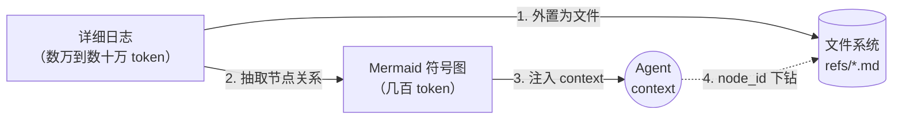

# TencentDB Agent Memory：用分层 + 符号化对抗 Agent 上下文膨胀

## 一句话核心判断

长任务跑久了，Agent 的"上下文窗口"会变成"上下文垃圾场"——这才是 Agent 真正难做工程的原因。TencentDB Agent Memory（`@tencentdb-agent-memory/memory-tencentdb`，仓库 `TencentCloud/TencentDB-Agent-Memory`）的答案是"符号化短期记忆 + 分层长期记忆"两轴并进：长会话里的工具日志压缩成 Mermaid 符号图（短期），跨会话的用户偏好和工作流抽成 L0→L3 的语义金字塔（长期）。官方数字里，SWE-bench 50 连发这种"上下文最紧张"的场景 token 砍掉 33%、通过率从 58.4% 推到 64.2%。

如果只在乎一次性对话，且需求只是检索召回，那主流的 RAG 向量库已经够了；只有遇到"多轮、跨会话、必须保住细节可追溯"的真实工程场景，这套分层架构才有不可替代的价值。

本文按发布时的 v1.0.0（2026-06-11）写成，2026-09-28 对照仓库现行状态复核并更新；期间项目发布了 Team Memory（团队记忆枢纽，2026-08-13），相关变化在正文单独交代。

## 系统地图：双轴架构

整体架构由两个相互正交的轴构成，每个轴解决一类问题：

```
                        短期（任务内）                          长期（跨任务）
                ┌──────────────────────────────────┐  ┌──────────────────────────────────┐
                │  Symbolic Short-term Memory      │  │  Layered Long-term Memory        │
                │  ──────────────────────────      │  │  ──────────────────────────      │
   信息结构：    │  全量工具日志 → 步级摘要(jsonl)  │  │  会话语料 → Persona / Scenario   │
                │  → Mermaid 符号图 + 节点 ID 下钻 │  │  L0 Conversation → L3 Persona    │
                │                                  │  │                                  │
   存储介质：    │  refs/*.md（外置）+ Mermaid 字符  │  │  SQLite + sqlite-vec（本地）      │
                │                                  │  │  + Markdown 文件（顶层结构）      │
                │                                  │  │                                  │
   替代问题：    │  "上下文太长"                    │  │  "记不住用户习惯"                │
                │                                  │  │                                  │
                └──────────────────────────────────┘  └──────────────────────────────────┘
                          ↓                                          ↓
                          └──────────┬───────────────────────────────┘
                                     ▼
                          Agent 决策循环（reasoning + tool calls）
```

短期轴解决"上下文窗口装不下日志"的问题：把一次任务内的工具输出（搜索结果、报错堆栈、代码 diff）压缩成可被人和 LLM 同时读懂的 Mermaid 图，配 `node_id` 随时下钻。

长期轴解决"下次还得向 Agent 复述 SOP"的问题：把跨会话的对话、原子事实、场景块、用户偏好堆成金字塔，顶层 Persona 直接喂给模型，需要细枝末节才往下钻。

两个轴共用同一套落地思路：异构存储 + 渐进披露（progressive disclosure）——底层留全量事实备查，越往上只留密度越高的结构化信息。

## 短期轴：Mermaid 符号图 + 节点下钻

### 压缩对象

长任务里 token 消耗最大的不是 LLM 思考，而是工具调用的中间产物：grep 命中、curl 返回体、stack trace（堆栈跟踪）、单测输出。README 给的量级参考是"数十万 token"，但里头的"关键节点"可能只有几十处。

### 压缩策略

短期轴对应插件的 Context Offload 能力。注意它是可选项，默认关闭，开启步骤见"接入方式"一节。开启后按五步推进：

1. **全量日志外置**：工具原始输出落到 `refs/*.md` 文件，不进入 context。
2. **步级摘要**：中间层把每一步的执行结果提炼成 `jsonl` 索引行，供快速定位。
3. **提炼关系图**：顶层把任务状态收敛成一张 Mermaid 画布。
4. **轻量注入**：只把 Mermaid 文本塞进 context（仅几百 token），让 Agent 看图推理。
5. **按需下钻**：Agent 对某节点产生疑虑时，沿 `node_id` 检索下层摘要乃至原始日志，临时拉回。

这套机制本质上是给 LLM 装了一个"虚拟内存"——context 常驻的是顶层画布，`jsonl` 摘要与 `refs/*.md` 原文是逐层回落的主存，需要哪段再分页拉。下面是它的简化伪数据流：


```mermaid
graph LR
    Log["详细日志<br/>（数万到数十万 token）"] -->|"1. 外置为文件"| FS[("文件系统<br/>refs/*.md")]
    Log -->|"2. 抽取节点关系"| MMD["Mermaid 符号图<br/>（几百 token）"]
    MMD -->|"3. 注入 context"| Agent(("Agent<br/>context"))
    Agent -. "4. node_id 下钻" .-> FS
```

### 关键设计取舍

实现里三个选型值得单独说，它们决定了这套机制能不能落地：

- **Mermaid 而不是 JSON/纯文本**：README 的说法是用"高密度、强拓扑"的 Mermaid 语法描绘任务状态流转，取代冗长的自然语言或扁平 JSON——节点和边自带分隔符，人和 LLM 都好读。
- **下钻是显式触发**：上下文里不再保留自动全量回查，避免 Agent 习惯性"什么都看一眼"。
- **节点 ID 命名稳定**：方便后续跨任务引用同一节点，形成短期记忆与长期 Persona 的桥梁。

## 长期轴：L0→L3 的语义金字塔

### 四层结构

长期轴把跨会话的事实按粒度分四层，避免"扁平向量库只能硬搜"的痛点：

| 层级 | 名称 | 内容 | 典型用法 |
| --- | --- | --- | --- |
| L0 | Conversation | 原始会话记录 | 全量保留做证据 |
| L1 | Atom | 原子事实（一个人名、一个项目代号） | 实体检索、事实校验 |
| L2 | Scenario | 场景块（一个完整工作流） | 跨任务复用 SOP |
| L3 | Persona | 用户/项目的总体偏好和画像 | 长期喂入 system prompt（系统提示词） |

顶层 L3 的 Markdown 文件会被默认注入到 Agent 的 context——这一层是给"该记住的偏好"准备的。下钻到 L2/L1/L0 是 Lazy（按需）的，避免顶层噪声。

### 与扁平向量库的差异

扁平向量库有三处软肋：

- 召回结果只是"相似片段"，没有宏观结构
- 容易混入不相关片段，得靠重排序补救
- 很难沉淀出 Persona 级别的稳定抽象

分层金字塔把同一件事在写入阶段就做完：L3 层按任务聚合出结构化偏好（"这个用户习惯让 Agent 先列计划再动手"），Agent 读到的是一句话判断而不是一堆相似句子；需要核实事实时，沿 `node_id` 下钻到 L0-L1 原文即可。

召回本身也不是单路向量：插件默认 `hybrid` 策略，BM25 关键词与向量语义两路召回用 RRF 融合，keyword、embedding、hybrid 三档可配；另有 `tdai_memory_search` / `tdai_conversation_search` 两个 Agent 工具，供模型在推理中主动查询记忆。

## 关键机制：可追溯的"钻取链"

真正让这套架构区别于普通摘要方案的，是可追溯：任何被压缩的信息都能逐层下钻回原始证据：

```
Persona（顶层 Markdown）
  └─ node_id / result_ref → Scenario（jsonl 索引）
                └─ Conversation 段（refs/*.md 原文）
```

压缩不是把信息丢掉，而是把它重组成更容易沿路径找回的结构。下钻路径是确定性的，不存在"摘要完就回不去了"。落到具体任务上，README 给了两组标准动作：续跑一个长任务，先看当前 Mermaid 任务画布，摘要不够细就查 JSONL，再不够才读 `refs/*.md` 原文；恢复一个历史任务则从元数据条目进入，打开当时的画布，定位 `node_id`，沿 `result_ref` 追到结果原文。两组动作走的是同一条链路，不依赖相似度检索。

这与传统摘要方案的分歧集中在四点上：

| 维度 | 传统摘要压缩 | TencentDB 分层符号化 |
| --- | --- | --- |
| 是否可逆 | 否（摘要即丢弃原文） | 是（node_id + refs/*） |
| 信息密度 | 低（自然语言摘要） | 高（DSL/Mermaid） |
| 检索速度 | 走相似度匹配 | 顶层直读 + 节点索引 |
| 推理辅助 | 弱 | 强（图本身就是决策路径） |

## 任务流案例：SWE-bench 50 连发

挑 README 主推的一个真实场景：50 个 SWE-bench 任务在同一个 session 里连发。README 强调这些成绩测的都是连续长程会话，不是单轮隔离测试——50 个任务跑下来，早期任务的报错细节、路径信息不断堆进上下文，模拟的正是真实长程 Agent 面对的上下文累积压力。

接入 Plugin 后（README 里的官方数字）：

| Benchmark | 任务类型 | 接入前 | 接入后 | 相对变化 |
| --- | --- | --- | --- | --- |
| WideSearch | 短任务广搜索 | 33% pass | 50% pass | +51.52% |
| SWE-bench | 长任务 50 连发 | 58.4% pass | 64.2% pass | +9.93% |
| AA-LCR | 长对话 | 44.0% pass | 47.5% pass | +7.95% |
| PersonaMem | 长程人物画像 | 48% | 76% | +59% |

| Benchmark | 接入前 token | 接入后 token | 相对变化 |
| --- | --- | --- | --- |
| WideSearch | 221.31M | 85.64M | −61.38% |
| SWE-bench | 3474.1M | 2375.4M | −33.09% |
| AA-LCR | 112.0M | 77.3M | −30.98% |

读这些数字之前，先说明三件事：

- 全部来自 README 官方公布值，未经第三方独立复测；测试的任务分布与你的真实负载不同，不能直接外推。
- README 把 WideSearch、SWE-bench、AA-LCR 三项归为短期记忆能力的收益，PersonaMem 归为长期记忆，所以 token 表只覆盖前三项。
- SWE-bench 的 `+9.93%` 看着不起眼，对应到 50 个任务上大约多通过 3 个（58.4%→64.2%）。对生产环境，这是稳定性的实质改善，不是噪音。

## 适配边界

这套架构适合哪些场景，哪些场景不要硬上：

**适合**：

- Agent 需要跨多个 session 维持稳定工作流（代码 Agent、RPA Agent）
- 工具调用频繁，单次任务就可能耗尽几万 token
- 团队共享同一份"用户偏好/SOP"，需要可追溯的 Persona
- 已经在为"上下文不够用"付出预算代价

**不太适合**：

- 一次性问答、检索类应用——RAG 向量库已经够用
- 对延迟极度敏感的场景——下钻要查本地索引和原文文件，比纯内存召回多一跳
- 磁盘紧张的环境——原始日志默认永不清理（`capture.l0l1RetentionDays` 默认 0），长跑的 Agent 要留意占用，必要时自己配保留天数

## 接入方式与最低门槛

最小安装流程（README Quick Start）：

```bash
openclaw plugins install @tencentdb-agent-memory/memory-tencentdb
openclaw gateway restart
```

装完并在配置里把 `memory-tencentdb.enabled` 打开后，长期记忆这条轴就默认工作了——对话捕获、记忆提取、场景聚合、Persona 生成、下一轮前的召回全部自动进行，不需要额外配置。

短期压缩则默认关闭，要手动开三步（README：requires version ≥ 0.3.4）：

```jsonc
// 1. 打开 offload 开关（~/.openclaw/openclaw.json）
{
  "memory-tencentdb": {
    "config": {
      "offload": { "enabled": true }
    }
  }
}
```

```jsonc
// 2. 注册 contextEngine slot，让 OpenClaw 把上下文卸载请求路由给本插件
{
  "plugins": {
    "slots": { "contextEngine": "memory-tencentdb" }
  }
}
```

```bash
# 3. 跑一次运行时补丁，挂接 after-tool-call 消息（OpenClaw 升级后需重跑）
bash scripts/openclaw-after-tool-call-messages.patch.sh
```

存储后端三选一：默认是本地 `SQLite + sqlite-vec`，零外部依赖；`storeBackend` 也可配 `tcvdb`（腾讯云向量数据库，仓库提供 `migrate-sqlite-to-tcvdb` 迁移工具）；要接云上托管的 Memory 实例，按腾讯云文档把 `mode` 配成 `client`，填实例地址、实例 ID 和 API Key。

注意点：

- Node.js ≥ 22.16 与 OpenClaw ≥ 2026.3.13 是当前硬要求（后者也是 README badge 上的版本基线）
- 腾讯云接入指引要求插件版本 ≥ 1.0.0；npm 当前最新为 1.0.3（2026-09-22），装完用 `openclaw plugins list` 确认
- 云端模式下，URL / API Key 建议用环境变量注入，别把密钥明文写进 `openclaw.json`
- 记忆产物全部落在 `~/.openclaw/memory-tdai/`：上层画布、Persona、场景块都是人能直接打开读的 Markdown，排错不用连数据库。跨 Agent、跨设备的记忆迁移在官方 Roadmap 上还是未完成项，多机复用目前要自己想办法
- 开源仓库走 MIT 协议，fork 自部署没有许可障碍；云上 Memory 实例则是腾讯云的托管服务，按控制台指引另行开通

## 发布之后的演进：Team Memory

本文发布后，项目在 2026-08-13 发布了 Team Memory，仓库定位从单机记忆插件升级为"团队级记忆枢纽"：把团队的对话、文档、代码和机构知识整理成四类共享记忆资产——Chat Memory、LLM-Wiki、Code Graph、Skill，供多个 Agent 和框架复用。本文描述的双轴架构没有被替换——当前 README 的 Highlights 一节仍是这两句话——npm 插件则已迭代到 1.0.3。

## 能带走的三个工程判断

这个项目值得带走的是三个可复用的工程判断：

1. **上下文工程的投入重点在结构，不在检索调参。** 日志、偏好、工作流按粒度分层存放，比在单一向量库里反复调相似度阈值更能控制长任务成本——L0-L3 和 `refs/*.md` 就是这套思路的成品。
2. **Agent 的压缩中间态该选高密度 DSL。** 一次工具调用转成 Mermaid 图只有几百 token，同一份信息写成 JSON 或自然语言摘要都更占空间，图本身还能当决策路径喂给模型。
3. **评估记忆方案先问可追溯性。** 上层有抽象、底层有全文、中间有索引，比单一"快向量检索"更能应付工程问题；只看召回率指标，会漏掉"压缩后回不回得去"这个关键问题。

## 适用人群

- 想认真做"Agent as Product"的工程团队：这套架构能直接搬走当底层
- 已经碰到"上下文爆炸"性能瓶颈的 Agent 项目：短期记忆直接对症下药
- 需要长期 Persona/项目 SOP 沉淀的内容工作流：长期轴拿现成
- 普通 RAG 检索用户：只做"一次性问答 + 文档召回"的话，这一层不是首选

真要接入，建议按这个顺序来：装完插件先拿长期记忆的默认收益（零配置），用真实业务对话验证 Persona 和场景块的质量；碰到长任务、token 压力大的场景，再按上面三步打开短期压缩，用一轮 SWE-bench 或真实长任务对比 token 账单。两个轴独立开关，不必一次全上。

## 常见问题

**装了插件但没有记忆效果？**
先 `openclaw plugins list` 看插件是否在列且版本 ≥ 1.0.0，再确认 OpenClaw 版本 ≥ 2026.3.13。旧版本用 `openclaw plugins update @tencentdb-agent-memory/memory-tencentdb` 升级（README 建议用原生命令升级，避免语义化版本范围导致插件被禁用）。

**API Key 写在配置文件里怕泄露？**
腾讯云接入指引建议用 `${TDAI_MEMORY_API_KEY}` 这类环境变量占位符注入，不要把密钥明文留在 `openclaw.json`。

**`node_id` 下钻找不到原文？**
钻取链依赖 `refs/*.md` 与节点索引的落盘位置。移动过数据目录、或配置过 `capture.l0l1RetentionDays` 让低层日志被清理，下钻就会断链；先检查 `~/.openclaw/memory-tdai/` 下的目录结构是否完整。

**只想先试短期压缩，不想动长期记忆？**
可以，短期压缩是独立开关。按"接入方式"一节的三步把它打开，收益来自 Mermaid 压缩，不依赖 L0-L3 分层——适合先小规模验证 token 收益，再决定长期怎么用。

## 参考链接

- 仓库：<https://github.com/TencentCloud/TencentDB-Agent-Memory>
- npm 包：[@tencentdb-agent-memory/memory-tencentdb](https://www.npmjs.com/package/@tencentdb-agent-memory/memory-tencentdb)
- 开源公告（腾讯云开发者社区，2026-05-13）：<https://cloud.tencent.com/developer/article/2668579>
- OpenClaw 接入指引（腾讯云文档中心）：<https://cloud.tencent.com/document/product/1813/132833>
- Team Memory 发布公告（Tencent Cloud，2026-08-13）：<https://www.tencentcloud.com/announce/detail/101465>
- 版本历史：仓库 [CHANGELOG.md](https://github.com/TencentCloud/TencentDB-Agent-Memory/blob/main/CHANGELOG.md)（截至复核日更新到 0.3.6，1.0.x 的变更以 npm releases 为准）
- License：MIT
