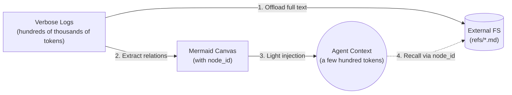
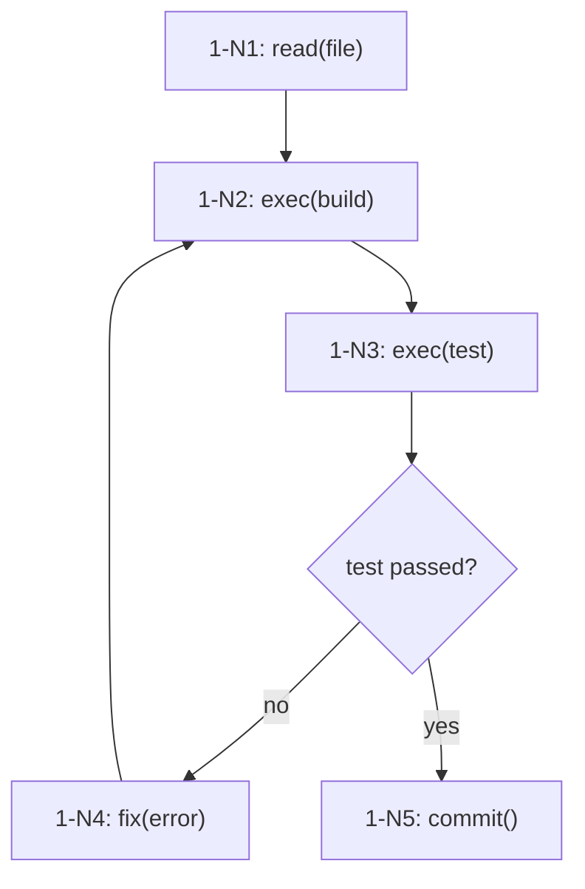

## 背景与痛点：为什么 Agent 需要记忆？

在使用 AI Agent 的过程中，你是否遇到过这样的情况：让 Agent 完成一个大型代码重构任务，它在前几个步骤表现良好，但随着对话历史越来越长，开始出现"忘记了之前的修改"、"重复执行已经做过的步骤"、甚至"上下文窗口爆掉"的问题？

这背后的根本原因是：**AI Agent 的上下文窗口是有限的，而现实世界的任务通常是长周期的。**

传统方案有两派：

- **无限流式上下文**：把完整对话历史都塞进 context，简单粗暴，但 token 成本天文数字，SWE-bench 实测单任务最高消耗 **3474M tokens**，而且随着历史增长，LLM 的注意力会被稀释，效果反而下降。
- **粗暴压缩/摘要**：定期对对话历史做摘要，但这是**不可逆的有损压缩**——原始细节丢失，一旦 Agent 需要回头验证某个具体步骤的执行细节，就无据可查。

TencentDB Agent Memory（也叫 **TDAI Memory** 或 **memory-tencentdb**）提出了第三种思路：**分层记忆 + 符号化记忆**，在 token 成本和信息完整性之间找到精妙的平衡。

> **核心理念**：记忆不是"把所有信息都塞进大脑"，而是"知道什么信息在哪里，需要时能快速找到"。

---

## 核心技术：四层语义金字塔

TDAI Memory 的架构建立在一个核心认知上：**记忆的形成和召回都应该是分层的**。它将 Agent 的记忆划分为四个层次（L0 → L3），每一层承担不同的职责，越往上信息密度越高，越往下信息完整性越强。

### L0 — 原始对话层（Lossless Evidence Layer）

L0 层记录完整的原始对话内容和所有工具调用的完整返回结果，存储在本地文件系统中。这一层**永不压缩**，所有详细信息都保留。

文件结构：

```
dataDir/
  refs/{sessionId}/{nodeId}.md       # 工具调用的完整原始输出
  offload/{sessionId}/offload.jsonl  # 每对 tool_call / tool_result 的完整记录
  mmd/{sessionId}/active.mmd        # 当前活跃任务的 Mermaid 状态图
```

L0 层的价值在于**可追溯**：当 Agent 在上层发现问题时，可以通过 `node_id` 快速定位到 L0 层的原始证据，而不是凭模糊记忆臆测。

### L1 — 原子记忆层（Atomic Facts Layer）

L1 层由 LLM 驱动，从 L0 层的原始对话中**提取原子级事实**，以结构化的方式存储到 SQLite 数据库中。每个原子记忆包含：

```typescript
interface L1Memory {
  id: string;
  sessionKey: string;
  content: string;       // 原子事实描述
  type: string;          // fact | preference | constraint | ...
  scene?: string;        // 所属场景（可选）
  createdAt: number;
}
```

L1 的触发条件有两种：
- **固定轮次触发**：每 N 轮对话（默认 5 轮）触发一次提取
- **空闲超时触发**：当 Agent 空闲超过一定时间（默认 10 分钟）时自动触发

L1 的关键设计是**去重**：通过 embedding 相似度检测，避免从同一会话中提取到重复的原子事实。

### L2 — 场景记忆层（Scenario Aggregation Layer）

L2 在 L1 的基础上进一步**聚合**：将多个相关的 L1 原子记忆聚合成场景块（Scene）。场景块描述的是一类可复用的问题解决模式，比如"如何处理 Git 冲突"、"数据库迁移的标准流程"。

```typescript
interface L2Scene {
  id: string;
  name: string;           // 场景名称
  summary: string;        // 一段话概括
  memoryIds: string[];     // 参与构成此场景的 L1 memory IDs
  agentSummary: string;    // LLM 生成的 Agent 视角总结
  createdAt: number;
  updatedAt: number;
}
```

L2 触发条件：每产生 50 个新 L1 记忆时触发一次场景聚合（可配置）。

### L3 — 用户画像层（Persona Profile Layer）

L3 是整个金字塔的顶端，从 L2 场景记忆和历史对话中提炼出**用户偏好和行为模式**，形成高度结构化的用户画像。画像不只记录"用户喜欢什么"，还包括"用户通常在什么场景下遇到什么问题"、"用户偏好的解决方案是什么"。

```typescript
interface L3Persona {
  id: string;
  name: string;
  userType: string;        // e.g. "senior-backend-developer"
  preferences: {
    codeStyle: string;
    communicationStyle: string;
    preferredTools: string[];
  };
  defaultWorkflows: string[];
  knownConstraints: string[];
  createdAt: number;
  updatedAt: number;
}
```

### 分层召回：按需逐层检索

当用户发起新对话时，TDAI Memory 的召回路径是：

1. **L3 Persona** 先被召回，提供用户偏好和背景知识
2. 如果需要更多细节，**L2 Scene** 补充分类场景信息
3. 如果还需要具体事实，**L1 Atom** 提供原子级证据
4. 最终需要原始工具输出时，通过 `node_id` 在 **L0 Refs** 中定位

整个召回过程由 LLM 在推理时自动驱动，不需要开发者手动指定层级。

---

## 杀手锏特性：上下文卸载（Context Offload）

如果说四层金字塔解决的是**跨会话的长期记忆**问题，那**上下文卸载（Context Offload）**解决的是**单会话内长期任务的上下文爆炸**问题。

这是 TDAI Memory 中最复杂、也是最具技术含量的模块。

### 问题：长任务中的上下文雪崩

在一个涉及数百次工具调用的长任务中，Agent 的上下文窗口很快就会被填满：

- 每次 `web_fetch` 返回几万字的页面内容
- 每次 `exec` 返回几十行的命令输出
- 每次代码搜索返回数十行的匹配结果

这些信息在**当时**可能有用，但一旦翻篇，它们就变成了沉默的 token 消耗大户。

### 解决方案：Mermaid 符号图 + 外存

Context Offload 的核心思想是：**把 verbose 的中间结果卸载到外部文件系统，只在上下文中保留一个 Mermaid 符号图**。

原始设计中的 Mermaid 图大约是这样的：



每个工具调用被赋予一个 `node_id`（格式为 `{sessionId}-N{序号}`），完整的调用输入/输出写入 `refs/{sessionId}/{nodeId}.md`，而上下文中只保留 Mermaid 图中一个节点符号：



### 四层压缩机制（Offload Pipeline）

Context Offload 并不只是"把东西存出去"这么简单。它有一个**多层次压缩管道**，动态决定什么时候轻度压缩、什么时候激进压缩。

#### L1 — 工具调用对压缩（Tool Pair Offload）

当一组 `tool_call` + `tool_result` 被确认为"已完成"时（通常在 Agent 调用下一个工具时认为前一个已结束），L1 压缩启动：

- 完整的 tool_call 信息被写入 `offload.jsonl`
- 上下文中这组消息被替换为一个轻量级的汇总文本
- 汇总格式：`[Offloaded Tool Result | node: {node_id}] Summary: {summary}`

#### L1.5 — Mermaid 状态图生成

从已卸载的工具调用对中，L1.5 层生成并持续更新 Mermaid 状态图。这个图捕获了任务的结构性进展，但**不包含任何 verbose 的实际数据**。每次新工具调用完成后，Mermaid 图会增量更新。

#### L2 — 节点 null 条目处理

有些工具调用因为某些原因没有被赋予有效的 `node_id`，当这类"悬空"条目积累到一定数量（默认 ≥ 4）时，触发 L2 管道：重新扫描所有未关联的条目，建立它们与活跃 Mermaid 图的关联。

#### L3 — 激进上下文压缩

当上下文 token 即将超过阈值时，L3 层启动**激进压缩**，根据消息的重要性分数决定保留哪些、压缩哪些。被压缩的消息会被替换为汇总，整个过程是**可审计的**——任何被压缩的内容都可以通过 `node_id` 找回原始版本。

### 插入点保护机制

Mermaid 图插入上下文时，代码有一个极为精细的保护逻辑：`adjustForToolCallPair()` 函数。

它的作用是：**确保 Mermaid 图永远不会插在一个 `assistant (tool_use)` 消息和它的 `tool_result` 消息之间**。因为如果插入位置错误，工具调用的成对关系就会被破坏，导致上下文混乱。

```typescript
function adjustForToolCallPair(messages: any[], idx: number): number {
  // 如果 idx 正好落在一对 tool_call / tool_result 之间
  // 就把插入位置回退到 tool_use 消息之前
  // 确保 pair 的完整性
}
```

---

## 性能实测：数字说话

光有架构不够看，实测数据才是硬道理。TDAI Memory 在三个主流基准测试上做了验证：

| 任务类型 | 基准 | OpenClaw 成功率 | 加插件后 | 相对提升 | Token 节省 |
|---------|------|:----------:|:----------:|:------:|:------:|
| **短时压缩** | WideSearch | 33% | **50%** | **+51.52%** | **−61.38%** |
| **短时压缩** | SWE-bench | 58.4% | **64.2%** | +9.93% | −33.09% |
| **短时压缩** | AA-LCR | 44.0% | **47.5%** | +7.95% | −30.98% |
| **长期记忆** | PersonaMem | 48% | **76%** | **+59%** | — |

几个关键数字解读：
- **WideSearch 成功率从 33% → 50%**：意味着 Agent 在复杂长任务中的可靠性提升了超过一半
- **Token 节省最高 61.38%**：WideSearch 从 221.31M tokens 压缩到 85.64M tokens，直接降低成本
- **PersonaMem 准确率从 48% → 76%**：长期记忆检索的效果提升近 30 个百分点

> 以上数据均在**连续长周期会话**下测量，而非单轮独立测试。这模拟了真实世界中 Agent 需要在多轮对话中维护上下文的需求。

---

## 使用指南：快速上手

### 安装（OpenClaw）

```bash
openclaw plugins install @tencentdb-agent-memory/memory-tencentdb
openclaw gateway restart
```

### 零配置启用

默认使用本地 SQLite + sqlite-vec 后端，不需要任何外部服务：

```jsonc
// ~/.openclaw/openclaw.json
{
  "memory-tencentdb": {
    "enabled": true
  }
}
```

启用后，TDAI Memory 自动处理：对话捕获、记忆提取、场景聚合、用户画像生成，以及下一轮对话前的记忆召回。

### 启用短时上下文压缩（可选，需 ≥ 0.3.4）

```jsonc
{
  "memory-tencentdb": {
    "config": {
      "offload": {
        "enabled": true
      }
    }
  },
  "plugins": {
    "slots": {
      "contextEngine": "openclaw-context-offload"
    }
  }
}
```

然后运行一次 patch（仅需执行一次）：

```bash
bash scripts/openclaw-after-tool-call-messages.patch.sh
```

### 外部向量数据库配置（可选）

默认使用本地 SQLite 向量扩展。如需使用腾讯云 VectorDB：

```typescript
// 配置结构
interface TcvdbConfig {
  url: string;           // 实例地址，如 "http://10.0.1.1:80"
  username: string;     // 默认 "root"
  apiKey: string;       // API Key
  database: string;      // 数据库名
  embeddingModel: string; // 默认 "bge-large-zh"
}
```

---

## 技术架构总览

```
┌─────────────────────────────────────────────────────────────────────┐
│                        OpenClaw / Hermes                             │
├─────────────────────────────────────────────────────────────────────┤
│                     capture (L0 Raw Conversation)                   │
├─────────────────────────────────────────────────────────────────────┤
│  ┌──────────────┐    L1 Extract    ┌──────────────────────────┐   │
│  │  refs/*.md   │◄────────────────│  L1 Atoms (SQLite + vec)  │   │
│  │  jsonl       │                  │  每会话最多20条原子记忆   │   │
│  └──────────────┘                  └────────────┬───────────┘   │
│                                                  │ L2 Aggregate  │
│                                        ┌─────────▼──────────┐     │
│                                        │  L2 Scenes (场景)   │     │
│                                        │  每用户最多15个场景  │     │
│                                        └─────────┬──────────┘     │
│                                                  │ L3 Distill    │
│                                        ┌─────────▼──────────┐     │
│                                        │  L3 Persona (画像)  │     │
│                                        │  用户偏好/工作流     │     │
│                                        └────────────────────┘     │
├─────────────────────────────────────────────────────────────────────┤
│                   Recall (Before Next Turn)                         │
│  Persona ──► Scene ──► Atom ──► Refs (按需逐层)                   │
├─────────────────────────────────────────────────────────────────────┤
│                  Context Offload (Short-term)                       │
│  Tool Pair (L1) ──► Mermaid Canvas (L1.5) ──► Null Backfill (L2)  │
│                                              ──► Aggressive (L3)   │
└─────────────────────────────────────────────────────────────────────┘
```

### 存储后端：异构存储策略

TDAI Memory 的存储设计遵循一个重要原则：**信息密度高的放结构化数据库，需要全文检索的放文件系统**。

| 层级 | 存储介质 | 说明 |
|------|---------|------|
| L0 Refs | 本地文件系统 `refs/*.md` | 工具原始输出，保留完整细节 |
| L0 Offload JSONL | 本地文件系统 | tool_call / tool_result 记录 |
| L1 Atoms | SQLite + sqlite-vec | 结构化原子记忆，支持向量检索 |
| L2 Scenes | Markdown 文件 | 场景摘要，人类可读 |
| L3 Personas | Markdown 文件 | 用户画像，人类可读 |

**异构存储的好处**：向量数据库擅长语义相似度检索，但不适合存储超长文本；文件系统擅长存储长文本，但不适合做语义查询。两者各司其职。

---

## 关键设计思想：从"记忆一切"到"知道在哪"

TDAI Memory 最值得学习的不是具体代码，而是**设计哲学**：

### 1. 可审计的压缩

压缩不是把信息丢掉，而是**把信息转移到更合适的位置，并保持索引能力**。任何被压缩的消息都可以通过 `node_id` 找回原始版本。压缩过程本身也是可审计的日志。

### 2. 渐进式披露（Progressive Disclosure）

不是一次性把所有记忆都塞给 Agent，而是根据任务需要**逐层唤醒**。在任务早期只提供高层的 Persona context，随着任务推进需要更多细节时才逐层深入。

### 3. 双重索引

每条 L0 记录既在 L0 文件系统中有原始文件，又在 L1 SQLite 中有结构化索引。这保证了**快速检索（SQLite）+ 完整证据（Refs 文件）的双重能力**。

### 4. 本地优先

默认配置下，TDAI Memory 完全运行在本地，不依赖任何外部 API 或云服务。这意味着**数据主权完全属于用户**，没有任何敏感信息离开本地机器。

---

## 项目地址与生态

- **GitHub**：[Tencent/TencentDB-Agent-Memory](https://github.com/Tencent/TencentDB-Agent-Memory)
- **Stars**：1,500+ ⭐
- **npm**：`@tencentdb-agent-memory/memory-tencentdb`
- **支持平台**：OpenClaw（主）、Hermes（次）
- **许可证**：MIT
- **Topics**：`agent` `ai-agent` `embedding` `llm` `local-first` `long-term-memory` `memory` `openclaw-plugin` `vector-search`

---

## 总结

TencentDB Agent Memory 解决了一个本质问题：**Agent 记忆不应该是一次性的上下文积累，而应该是分层、可追溯、按需检索的结构化信息管理系统。**

它的四层金字塔架构让不同生命周期的信息各得其所；上下文卸载机制让长任务不再受困于 token 限制；Mermaid 符号图让 Agent 和人类都能快速理解任务进展状态；可审计的压缩机制则保证了信息的完整性不会因为压缩而丢失。

如果你正在构建需要长期记忆的 AI Agent，这个项目非常值得深入研究——无论是直接使用它，还是从中学习"如何设计一个生产级的 Agent 记忆系统"。

---

**原文**：[Tencent/TencentDB-Agent-Memory](https://github.com/Tencent/TencentDB-Agent-Memory)