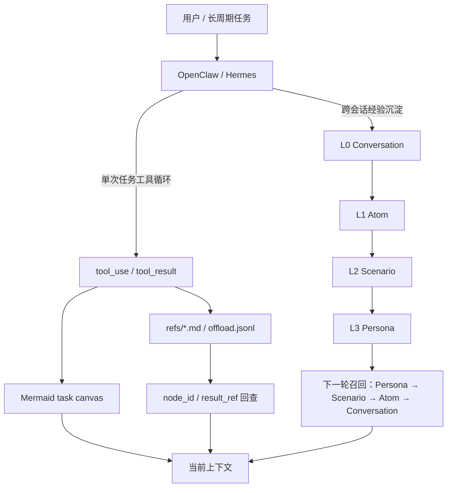
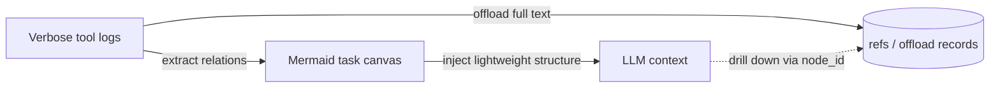

<!-- markdownlint-disable-file MD003 MD041 -->

大多数 Agent memory 项目都把问题定义得过窄：要么给历史做 embedding，要么定期做摘要。TencentDB Agent Memory 的可取之处，在于它先承认“记忆”其实包含两类完全不同的工程问题：跨会话经验沉淀，以及单次长任务里的上下文治理。

沿着这个视角去读，它的架构会清楚很多。L0 → L3 金字塔负责沉淀偏好、场景和经验；`refs/*.md`、`offload.jsonl`、Mermaid 画布则主要服务于短期 Context Offload。很多介绍把这两套机制混成一个“记忆分层”故事，结果概念越堆越多，边界反而越来越模糊。把它们拆开，项目的配置面、benchmark 和适用场景都会更容易判断。

---

## 先看全景图

先把长期记忆和短期 offload 放在同一张图里，后文的细节会更容易对上位置：



这张图故意把两条链分开画。上半部分回答“长期经验如何沉淀并在下一轮被召回”，下半部分回答“当前任务的冗长执行史如何被外置、压缩和回查”。如果不先把这两条链拆开，后面很容易把 Persona、Mermaid、`refs` 和 offload JSONL 误读成同一层系统。

---

## 1. Agent 的“记忆问题”其实有两类

很多 Agent 的“失忆”并不是模型突然变笨，而是系统把完全不同的信息都塞进了同一个上下文桶里：

- 用户长期偏好、项目背景、输出格式约束，本来应该跨会话保留。
- 工具调用日志、搜索结果、错误堆栈，本来只在当前长任务里有价值。

一旦这两类信息都靠聊天历史硬扛，系统很快就会碰到两个老问题：

| 问题 | 典型表现 | 更合适的解决路径 |
| ------ | ------ | ------ |
| **跨会话经验沉淀不足** | 每次都要重讲 SOP、代码风格、常用工具、输出格式 | 用 **长期记忆分层** 把经验提炼成可召回结构 |
| **单任务上下文越滚越大** | 搜索结果、命令输出、报错日志把上下文窗口挤满 | 用 **短期 Context Offload** 卸载冗长中间结果 |

TencentDB Agent Memory 把 **跨会话的长期保留** 和 **单任务的上下文治理** 拆成了两条相互配合、但并不相同的主线。

这也是这类项目最容易被写错的地方：`refs/*.md`、`offload.jsonl`、Mermaid 画布主要属于 **短期 offload 工件**；而 README 里说的 L0 → L3 语义金字塔，主要讨论的是 **长期个性化记忆的分层机制**。两者有关联，但不是一回事。

---

## 2. 长期记忆是信息分层，不是检索增强

项目对长期记忆的核心表述很明确：不要把所有历史切碎后丢进一个平铺向量库，而要做成一套 **progressive disclosure**（渐进式披露）的分层系统。先给 Agent 高层结构，需要细节时再往下钻。这里真正想解决的是“召回时先给方向，再给证据”，而不只是召回到更多内容。

### 2.1 四层语义金字塔分别在做什么

| 层级 | 存的是什么 | 解决什么问题 | 典型形态 |
| ------ | ------ | ------ | ------ |
| **L0 Conversation** | 原始对话、执行轨迹、底层证据 | 防止高层记忆脱离事实来源 | 原始会话记录、JSONL、底层存储记录 |
| **L1 Atom** | 原子事实、偏好、约束 | 把长对话切成可检索、可复用的最小单元 | 结构化记忆记录、向量 / 关键词索引 |
| **L2 Scenario** | 场景块、解决模式、场景摘要 | 让系统回忆“这类事通常怎么处理” | 人类可读的 scene block |
| **L3 Persona** | 用户画像、工作习惯、长期偏好 | 在新会话一开始给 Agent 提供方向感 | `persona.md` 一类的高密度摘要 |

重点不在层名，而在召回顺序：

1. 先用 **Persona / Scenario** 提供方向和语境。
2. 需要更具体的事实时，再去找 **Atom**。
3. 如果还要核对原始细节，就继续回到 **Conversation** 这一层。

可以把它理解成：上层负责结构，下层负责证据。它让系统在不同信息密度之间自由切换，而不是让 Agent“记住更多碎片”。

### 2.2 这不是“再加一个向量库”的原因

很多所谓 Agent memory 项目最后都会退化成一个问题：历史被切成很多 embedding 片段，召回时只能盲搜，缺少宏观引导。平铺向量库的问题在于召回噪声偏高，且系统很难回答“当前应该先信哪一层信息”。TencentDB Agent Memory 试图避开这个坑，方式有三点：

- **先有结构，再做检索**：先沉淀出 Scenario 和 Persona，而不是直接从碎片开始。
- **异构存储**：底层数据强调可检索，上层数据强调高信息密度和可读性。
- **保留回放链路**：从 Persona 可以下钻到 Scenario，再到 Atom，最后回到原始 Conversation。

源码和文档里对底层介质的描述并不是“只有一种存法”。在不同宿主和模块下，项目会组合使用 JSONL、SQLite、`sqlite-vec`，以及可选的腾讯云 VectorDB（TCVDB）。稳定不变的是设计目标：**底层保留证据，上层保留结构**。

### 2.3 默认节奏也说明了它的工程取舍

从 README 的参数表看，这套长期记忆机制刻意做了节奏控制，不是每轮都做一次昂贵提炼：

- `pipeline.everyNConversations = 5`：默认每 5 轮触发一次 L1 提取。
- `extraction.maxMemoriesPerSession = 20`：每次 L1 提取有上限，不让单次抽取失控。
- `pipeline.l1IdleTimeoutSeconds = 600`：用户空闲一段时间后也会触发提取。
- `persona.triggerEveryN = 50`：新增 50 条记忆后再更新 Persona。

这组默认值说明，项目把记忆提炼当成有成本的后台任务，而不是每轮都要发生的同步操作。因此“何时抽取”“抽多少”“多久更新画像”都需要被节流。

---

## 3. 短期 Context Offload 是带索引的外置执行史，不是摘要

长期记忆解决的是“下次还记不记得你”，短期 offload 解决的是“这次任务能不能不中途爆上下文”。前者回答 continuity，后者回答 survivability。

在长链路 Agent 任务里，拖垮上下文窗口的，通常是这些中间结果：

- 搜索工具返回的大段网页正文。
- 代码检索命中的几十行上下文。
- 构建、测试、抓取产生的长日志。

这些内容在生成后的几轮里仍有用，但当任务继续推进，它们更适合被卸载到外部存储，而不是一直占着上下文窗口。

### 3.1 短期 offload 的典型工件

这一部分的关键是把原文外置、同时保留回查索引，而不是“记住原文”。项目文档和源码里可以看到三类短期工件：

- **原始结果文件**：例如 `refs/*.md`，保存完整工具输出。
- **offload 记录**：例如 JSONL，记录 tool call、summary、`node_id`、`result_ref` 等关联信息。
- **Mermaid 任务画布**：把当前任务阶段压缩成高密度的结构图，留在上下文里给 Agent 使用。

这套结构可以概括为：**重文本在外部，轻符号在上下文，精确回查靠 `node_id` / `result_ref`。** 这比普通摘要多出来的是一条明确的回溯链，而不是不可逆的压缩结果。

### 3.2 这条短期管线是怎样工作的

如果按源码里的 offload 路径来理解，大致可以分成四段：

1. **Tool pair 捕获**
   一组 `tool_use` + `tool_result` 完成后，原始结果会被写入外部文件，offload 记录则负责保存摘要和映射关系。

2. **Mermaid 结构抽取**
   系统不把任务状态写成长篇文字，而是抽成 Mermaid 画布。这样做的好处是，Agent 读到的是流程关系和当前进度，而不是一整页历史日志。

3. **按压力分级压缩**
   当上下文接近阈值时，系统会先做较温和的替换；再往上才做更激进的删除和补偿式注入。源码里对应 mild / aggressive / emergency 多层处理，而不是一种“一刀切摘要”。

4. **必要时补历史结构，不是补全文**
   激进压缩后，系统会优先注入历史 Mermaid 结构，而不是把刚删掉的全文又塞回去。这样做保住了方向感，也避免压缩失去意义。

### 3.3 Mermaid 画布为什么比摘要更适合长任务

README 把这部分定义为 **symbolic memory**，也就是“用最少符号承载尽可能多的结构语义”。



Mermaid 画布节省的是 **LLM 的注意力预算**，不只是几个字符。模型不需要在一大段搜索结果里先找“现在任务做到哪一步”，而是先读到一张结构图：哪些节点做完了，哪些节点仍在进行，最近的焦点是什么。对于长链路 Agent，这种“先看结构、再钻细节”的读取顺序，比把几十段文本重新压成一段 prose 摘要更稳定。

### 3.4 一个容易被忽略的实现细节

在 `src/offload/mmd-injector.ts` 里，项目专门实现了 `adjustForToolCallPair()`。它做的事情很具体：**不要把 Mermaid 画布插进 `assistant tool_use` 和紧随其后的 `tool_result` 之间。**

如果插错位置，工具调用对的边界会被破坏，后续上下文就可能混乱。很多“压缩思路看起来没问题，但运行中总出怪事”的系统，问题就出在这种消息边界没有被认真维护。

这个细节说明，TencentDB Agent Memory 不只是概念层面的 memory 方案，它对宿主消息模型的约束是按实际运行问题来设计的。

### 3.5 一个长任务如何流过这套系统

把抽象层级换成一个具体任务，会更容易看出两条链路如何配合。假设用户让 Agent 修一个持续失败的测试，大致会经历这样的过程：

1. 新一轮对话开始时，L3 Persona 和 L2 Scenario 先提供背景，例如用户更在意最小改动、可验证性，以及沿用既有工作流；这些信息不需要每次都从聊天历史重读。
2. Agent 开始搜索代码、读取文件、运行测试。大段命令输出和检索结果不会一直留在上下文里，而是写入 `refs/*.md` 和 offload 记录。
3. 当前任务的阶段性进度被抽成 Mermaid 画布，模型在上下文里主要看到的是“已经查过什么、现在卡在哪里、下一步该往哪走”。
4. 当上下文接近阈值时，系统优先压缩旧的工具结果，但不会把整条任务脉络一起抹掉；需要回看细节时，再通过 `node_id` 或 `result_ref` 找回原始记录。
5. 任务结束后，本轮里较稳定的信息才有机会被提炼为 Atom、Scenario 或 Persona，供下一轮继续使用。

这样看，长期记忆负责把“以后还会用到的信息”沉淀下来，短期 offload 负责把“当前任务里已经用过、但暂时不该继续占上下文的信息”挪出去。两者处理的是同一轮工作里的不同时间尺度。

---

## 4. 它比两种常见做法多做了什么

如果把常见做法放在一起比较，差异会很清楚：

| 方案 | 优点 | 主要问题 |
| ------ | ------ | ------ |
| **把完整历史都塞进上下文** | 最省实现成本，前期效果直观 | token 成本线性膨胀，历史越长越稀释模型注意力 |
| **定期做摘要** | 成本比全量历史低 | 摘要通常不可逆，回查原始证据困难 |
| **TencentDB Agent Memory** | 长期经验和短期日志分开治理，支持下钻与回放 | 设计更复杂，需要维护抽取、索引、画布和宿主适配 |

它把复杂度从“把一切塞给模型”转移到“由系统做信息分层与索引管理”。复杂度从模型侧转移到了系统设计侧。这也是这类系统真正的分水岭：复杂度要么藏在 token 账单和不稳定行为里，要么提前暴露成可以被设计、观测和调试的系统组件。

---

## 5. benchmark 要看什么，不要只看什么

这个项目有参考价值的一点，是它没有只拿单轮 prompt 测试来展示效果，而是强调 **continuous long-horizon sessions**。也就是说，测试场景让上下文持续累积，而不是“做一次任务就结束”，逼近真实 Agent 的工作方式。对 memory 和 offload 来说，这一点比单次任务分数更重要，因为它们的价值本来就只有在历史开始堆积时才会显现。

| 能力 | 基准 | 原始结果 | 加插件后 | 变化 |
| ------ | ------ | ------ | ------ | ------ |
| **短期上下文压缩** | WideSearch | 成功率 33%，221.31M tokens | 成功率 **50%**，**85.64M tokens** | 成功率 **+51.52%**，token **-61.38%** |
| **短期上下文压缩** | SWE-bench | 成功率 58.4%，3474.1M tokens | 成功率 **64.2%**，**2375.4M tokens** | 成功率 +9.93%，token -33.09% |
| **短期上下文压缩** | AA-LCR | 成功率 44.0%，112.0M tokens | 成功率 **47.5%**，**77.3M tokens** | 成功率 +7.95%，token -30.98% |
| **长期记忆** | PersonaMem | 48% | **76%** | **+59%** |

比绝对数字更值得看的是评测方式：README 明确说明这些结果来自连续长会话，而不是互相独立的单回合实验。比如 SWE-bench 采用的是 **每个 session 连续运行 50 个任务**，目的就是模拟长周期任务里越来越强的上下文压力。

从结果本身也能看出两条主线的分工。WideSearch 上的提升最明显，说明 Context Offload 对长任务上下文治理影响最大；PersonaMem 的提升则更多反映了长期记忆金字塔在个性化召回上的作用。至于 SWE-bench 和 AA-LCR 的改进幅度更克制，这反而是更可信的信号：这类系统在特定问题上显著减少上下文失真和信息丢失，不是普适的性能倍增器。

这里还有一个很容易被误读的点：不要把 PersonaMem 的提升和 WideSearch 的提升放进同一条能力曲线里比较。前者更偏跨会话画像与偏好召回，后者更偏长任务里的上下文治理。它们共用同一套插件，但衡量的不是同一件事。

这比只看 isolated turns 更有参考价值，因为无论长期记忆还是 offload，收益通常都要在“历史越来越长”的场景里才看得出来。

真正需要避免的是把“token 降了”和“成功率升了”机械地绑在一起。对这类系统来说，更可靠的信号往往是：上下文占用显著下降，但任务成功率没有被压垮；或者在长会话压力变大时，成功率不再随着历史增长明显恶化。从这个角度看，WideSearch 和 PersonaMem 的结果比单轮 benchmark 更能说明这套设计的价值边界。

---

## 6. 采用顺序比参数本身更值得先想清楚

### 6.1 只想验证长期记忆，OpenClaw 的最小配置已经够用

```bash
openclaw plugins install @tencentdb-agent-memory/memory-tencentdb
openclaw gateway restart
```

```jsonc
// ~/.openclaw/openclaw.json
{
  "memory-tencentdb": {
    "enabled": true
  }
}
```

默认后端是本地 `SQLite + sqlite-vec`。**先体验长期记忆本身** 不需要一上来就接腾讯云 VectorDB，也不需要先搭额外的记忆服务。

如果你的目的只是验证下一轮对话能否召回偏好和任务背景，做到这一步已经够用。

### 6.2 需要长任务压缩时，再打开短期 Context Offload

短期 offload 在文档里属于可选功能，要求插件版本至少为 `0.3.4`。配置方式分两步：

```jsonc
{
  "memory-tencentdb": {
    "config": {
      "offload": {
        "enabled": true
      }
    }
  },
  "plugins": {
    "slots": {
      "contextEngine": "openclaw-context-offload"
    }
  }
}
```

```bash
bash scripts/openclaw-after-tool-call-messages.patch.sh
```

这里有两个容易忽略的点：

- **长期记忆本身不依赖这段 patch**。只有当你要启用短期 offload 时，才需要把 `contextEngine` 指到对应插件并执行 patch。
- **patch 不是永久免维护的**。README 说明得很清楚：OpenClaw 升级后要重新执行一次，避免 runtime hook 丢失。

### 6.3 Hermes 也能用，但思路是“provider + Gateway sidecar”

除了 OpenClaw，这个项目还支持 Hermes。README 给了两条路：

- **Docker 一体化镜像**：适合先跑通最短路径。
- **Hermes provider + Node.js Gateway sidecar**：适合更灵活的部署。

如果你走 Hermes provider 这条路，有一个部署细节不能混淆：Hermes 里的目录名必须是 **`memory_tencentdb`**，而不是 npm 包名里的 `memory-tencentdb`。前者是 provider key，后者只是包名和配置别名，两者不能混用。

---

## 7. 从实现里能抽出的四个判断

### 7.1 记忆必须是白盒，不能是黑盒

项目反复强调一个观点：当 recall 出错时，开发者不能只看到一串向量分数，还应该能追到 Persona、Scenario、Atom 和原始 Conversation。文档甚至明确告诉你：这些分层记忆工件都落在 `~/.openclaw/memory-tdai/` 下，可以直接打开看。

对白盒化要求高的团队，这一点会直接影响排错成本。memory 一旦不可观察，定位问题很快就会退化成试错。

### 7.2 它做的是宿主无关核心，不绑死某个平台

从 `TdaiCore + HostAdapter` 这一层抽象可以看出，项目没有把能力绑死在 OpenClaw 内部。Hermes 集成、本地 Gateway、provider 适配，其实都建立在这个思路上：**核心记忆逻辑尽量宿主无关，框架差异留给 adapter 层解决。**

### 7.3 本地优先，但不拒绝外部扩展

默认配置下，你可以直接使用本地 `SQLite + sqlite-vec`；如果需要更大规模或更集中化的存储，再切到 TCVDB。这个顺序也符合多数团队的接入路径：先本地验证，再决定是否引入远端存储。

### 7.4 检索不是非黑即白

参数表里提供了 `keyword`、`embedding`、`hybrid` 三种召回策略，推荐默认是 `hybrid`，也就是 BM25 + 向量 + RRF 融合。这个选择很符合真实场景：有些信息更适合关键词命中，有些偏语义相似，混合检索通常更稳。

---

## 8. 适用边界比功能列表更值得先看

### 8.1 最容易吃到红利的场景

- **长周期 coding agent**：一次任务里包含搜索、改代码、跑测试、看报错、再修复。
- **研究型 agent**：会连续抓网页、整理资料、比对多轮结论。
- **强个性化助手**：需要持续记住用户偏好、写作格式、团队约定。
- **需要白盒调试的系统**：你不只关心“记住了吗”，还关心“它是怎么记住的”。

### 8.2 收益有限的场景

- **短对话、短任务**：如果一次对话三五轮就结束，这套体系可能比问题本身还重。
- **极端低延迟场景**：记忆提炼、召回和 offload 都是有成本的。
- **完全不能接受本地状态留存**：哪怕默认是本地优先，也意味着你需要管理这份状态。

如果任务只持续三五轮，这套体系的收益很可能不足以覆盖接入成本；如果 Agent 已经开始承担长链路协作，收益会明显得多。

---

## 9. 为什么这套方案值得认真看

TencentDB Agent Memory 的价值在于把记忆改造成一套分层、可下钻、可回放、可审计的系统。它把 memory 从“模型上下文的副产品”推向“系统层的信息基础设施”。

更容易迁移到其他系统里的，是下面这些判断：

- **用户长期偏好** 不该和工具长日志混在一起。
- **高层结构** 不该替代底层证据。
- **压缩** 不该意味着不可逆。
- **长期记忆和短期 offload** 不该共享同一套评价口径。
- **记忆** 不该是黑盒数据库，而应该是一条能被人和 Agent 共同理解的链路。

Roadmap 还在继续。便携式记忆迁移、Skill 自动生成、可视化观测面板都还在后面；但就“给长周期 Agent 提供一套可运行、可检查的记忆框架”这件事来说，它已经具备比较完整的骨架。对多数工程团队而言，这已经比“再加一个记忆库”更接近可落地的答案。

---

## 10. 建议的阅读路径

如果你准备继续深挖，按这个顺序读会更顺：

1. 先看 [README](https://github.com/Tencent/TencentDB-Agent-Memory/blob/main/README.md) 或 [README_CN](https://github.com/Tencent/TencentDB-Agent-Memory/blob/main/README_CN.md)，建立整体定位。
2. 再看 [openclaw.plugin.json](https://github.com/Tencent/TencentDB-Agent-Memory/blob/main/openclaw.plugin.json)，理解配置面到底有多大。
3. 想看短期 offload 的真实实现，重点读 `src/offload/` 目录，尤其是 `mmd-injector.ts` 和 `hooks/llm-input-l3.ts`。
4. 如果你更关心跨框架接入，再去看 [Hermes provider README](https://github.com/Tencent/TencentDB-Agent-Memory/blob/main/hermes-plugin/memory/memory_tencentdb/README.md)。
5. 想把它放进实际环境，再补读 [scripts/README.memory-tencentdb-ctl.md](https://github.com/Tencent/TencentDB-Agent-Memory/blob/main/scripts/README.memory-tencentdb-ctl.md) 和 [CHANGELOG.md](https://github.com/Tencent/TencentDB-Agent-Memory/blob/main/CHANGELOG.md)。

---

## 11. 如果你准备采用，推荐顺序是这样的

如果要把这套方案放到实际系统里，采用顺序比一次开齐所有功能更重要：

1. 先开长期记忆，验证系统能否稳定沉淀 Persona、Scenario、Atom，并检查 recall 是否真的改善了下一轮的起步质量。
2. 只有在任务明显进入长链路、工具输出开始污染上下文时，再开启 Context Offload 和 `contextEngine` 插槽。
3. 本地 `SQLite + sqlite-vec` 能满足验证阶段时，不急着切 TCVDB；等到数据规模、部署形态或跨实例管理成为真实问题，再考虑远端存储。
4. Hermes 集成更适合已经确定要把记忆能力抽成宿主无关组件的团队；如果只是先验证效果，OpenClaw 的接入路径更短。

这样做的好处是，你能逐步回答三个不同问题：长期记忆有没有用，短期 offload 是否必要，外部存储和多宿主适配是否值得引入。把这三件事拆开验证，通常比“一次性开全套”更容易判断真实收益。

---

## 总结：它是信息治理层，不是记忆插件

TencentDB Agent Memory 值得看的是它把 Agent 的信息治理拆成了两条清晰主线：

- **长期记忆** 负责沉淀偏好、场景和经验。
- **短期 offload** 负责处理长任务里的日志膨胀和上下文压力。

这两条线合在一起，构成了一个更像生产系统的 Agent memory 方案。它把“记住什么、压缩什么、需要时怎么找回来”变成了可执行的工程设计，既不靠把一切塞进上下文，也不靠不可逆摘要。

如果你正在做长周期 Agent，可以直接从源码和配置入手；如果暂时还不需要完整接入，它也足够作为理解现代 Agent memory 设计的一份高质量样本。

---

## 参考资料

- [TencentDB Agent Memory GitHub 仓库](https://github.com/Tencent/TencentDB-Agent-Memory)
- [README（English）](https://github.com/Tencent/TencentDB-Agent-Memory/blob/main/README.md)
- [README_CN（简体中文）](https://github.com/Tencent/TencentDB-Agent-Memory/blob/main/README_CN.md)
- [Hermes memory_tencentdb README](https://github.com/Tencent/TencentDB-Agent-Memory/blob/main/hermes-plugin/memory/memory_tencentdb/README.md)
- [memory-tencentdb-ctl 运维文档](https://github.com/Tencent/TencentDB-Agent-Memory/blob/main/scripts/README.memory-tencentdb-ctl.md)
- [CHANGELOG](https://github.com/Tencent/TencentDB-Agent-Memory/blob/main/CHANGELOG.md)
