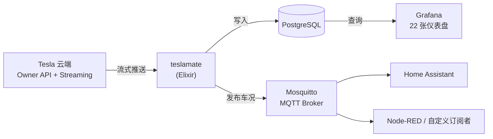

# teslamate-org/teslamate：自托管 Tesla 数据记录器，第一设计约束是别把车弄醒

## 一句话判断

TeslaMate 不是「另一款 Tesla App」。官方 App 解决控车，TeslaMate 解决记录：每一次行程、每一度充入的电、电池容量的长期衰减，全部落在你自己的 PostgreSQL 里，再用 Grafana 切片分析，通过 MQTT 把车况广播给 Home Assistant 这类自动化系统。

它成立的前提是一条硬件约束：Tesla 车辆被 API 反复查询时不会入睡，驻车耗电（vampire drain）随之上升。所以 TeslaMate 整个采集层的设计都围绕「尽快让车回到睡眠」展开——车一睡就断开连接，数据靠车辆主动唤醒时的流式推送积累。这也是它和早期轮询类脚本最本质的区别。

截至 2026-10-03，仓库 9,069 stars（AGPL-3.0-or-later，Elixir 实现），最新版 v4.3.0（2026-09-29 发布），由 JakobLichterfeld 主导维护，持续活跃。

## 学习目标

读完这篇，你将能：

- 说清 TeslaMate 的四个容器各管什么，一段充电数据如何流经整套系统
- 理解「别把车弄醒」为什么是第一设计约束，它决定了哪些使用方式不可行
- 按官方 docker-compose 路径完成部署，包括自己生成 Tesla API token 这一必要步骤
- 用内置的 MQTT Discovery 把车况接进 Home Assistant，写出正确的 MQTT 主题
- 判断 Tesla 的 API 政策变化（Owner API 与 Fleet API）对你的影响，以及你适不适合用 TeslaMate

## 目录

- [为什么 Tesla 的行车数据值得自托管](#为什么-tesla-的行车数据值得自托管)
- [全景地图：四个容器与一条数据流](#全景地图四个容器与一条数据流)
- [第一设计约束：别把车弄醒](#第一设计约束别把车弄醒)
- [部署：官方 docker-compose 路径](#部署官方-docker-compose-路径)
- [MQTT 与 Home Assistant 集成](#mqtt-与-home-assistant-集成)
- [预置仪表盘：22 张看板各自回答什么问题](#预置仪表盘22-张看板各自回答什么问题)
- [历史数据导入](#历史数据导入)
- [适用边界与已知约束](#适用边界与已知约束)
- [与其他 Tesla 数据方案对比](#与其他-tesla-数据方案对比)
- [常见问题](#常见问题)
- [自测题](#自测题)
- [相关资源](#相关资源)

## 为什么 Tesla 的行车数据值得自托管

Tesla 官方 App 集中在控车：开锁、空调、定位。它不给你的是：

- **每次行程的完整记录**：里程、能耗、海拔、起止点
- **完整的充电档案**：桩型、起始/结束电量（SOC，State of Charge，电池荷电状态百分比）、功率曲线、费用
- **电池健康趋势**：长期容量衰减估算
- **终身轨迹与驻车耗电分析**：什么时候在耗电、耗了多少

更关键的一点：**Tesla API 不提供历史数据**。TeslaMate 停机期间错过的行程和充电，事后补不回来（官方 FAQ 明确说明这一点）。这就是为什么部署要求一台 7×24 开机的机器——记录的价值随连续运行时间累积，装好六个月后的 Battery Health 仪表盘才开始有说服力。

> ⚠️ **安全提醒**：TeslaMate 官方 README 顶部警告，社区出现过伪装成 TeslaMate 的网站和 App Store 非官方应用。只从官方仓库 `teslamate-org/teslamate` 和官方文档 `docs.teslamate.org` 获取。

## 全景地图：四个容器与一条数据流

TeslaMate 的部署形态是四个协作容器，各管一层：

| 容器 | 职责 | 实现 |
|------|------|------|
| teslamate | 采集 Tesla 数据、持久化、Web 界面 | Elixir（Phoenix + LiveView） |
| database | 唯一事实源：车辆、行程、充电、地址 | PostgreSQL（官方 compose 用 `postgres:18-trixie`） |
| grafana | 可视化，内置 22 张仪表盘 | TeslaMate 定制的 `teslamate/grafana` 镜像 |
| mosquitto | MQTT Broker，向外部系统广播车况 | Eclipse Mosquitto |



用一次充电把这条链路走一遍：你把车插上充电桩，车辆唤醒并与 TeslaMate 建立流式连接；TeslaMate 解析推送的充电状态，把这次会话写入 Postgres 的充电记录，同时向 MQTT 发布 `charge_energy_added` 等主题；Grafana 侧，这次会话出现在 Charges 和 Charge Details 仪表盘里；Home Assistant 侧，一条「充电完成发通知」的自动化由 MQTT 消息触发。四个容器各司其职，数据只落库一次。

Web 界面支持 19 种语言，含简繁中文。地址反查基于 OpenStreetMap（Nominatim）。

## 第一设计约束：别把车弄醒

Tesla 车辆有一套不活跃计时器：持续被 API 查询，车就睡不着，驻车耗电持续发生。轮询模式的致命伤在这里——每次调用 Vehicle Data API 都会重置计时器，配置不当的轮询脚本会让车整夜睡不着。

TeslaMate 的做法是流式订阅加主动退避：

1. 车辆在线时（行驶、充电、刚被唤醒），通过 streaming 连接接收推送，数据以高精度入库；
2. 车辆空闲约 3 分钟后，TeslaMate 主动挂起记录，不再产生任何查询，给车辆留出入睡窗口；
3. 车辆进入睡眠后断开连接，直到下次被唤醒（开门、插枪、行驶）再重新订阅。

代价是：TeslaMate 不提供「随时召唤任意当前数据」的能力。它不主动唤醒车辆，所以「现在电量还剩多少」这类查询要么读缓存，要么由你显式唤醒车辆。这个取舍换来的，是车辆在 TeslaMate 运行下照常入睡。

对应的边界也清楚：如果你同时跑另一个会轮询的记录工具（比如 TeslaFi），两边会互相干扰，睡眠窗口被对方的查询填满，车照样睡不着。

## 部署：官方 docker-compose 路径

官方推荐路径是 Docker Compose，一次拉起四个容器。以下 compose 文件来自官方安装文档（`docs.teslamate.org`，Docker install），照抄即可：

```yaml
services:
  teslamate:
    image: teslamate/teslamate:latest
    restart: always
    environment:
      - ENCRYPTION_KEY=secretkey #replace with a secure key to encrypt your Tesla API tokens
      - DATABASE_USER=teslamate
      - DATABASE_PASS=password #insert your secure database password!
      - DATABASE_NAME=teslamate
      - DATABASE_HOST=database
      - MQTT_HOST=mosquitto
    ports:
      - 4000:4000
    volumes:
      - ./import:/opt/app/import
    cap_drop:
      - all

  database:
    image: postgres:18-trixie
    restart: always
    environment:
      - POSTGRES_USER=teslamate
      - POSTGRES_PASSWORD=password #insert your secure database password!
      - POSTGRES_DB=teslamate
    volumes:
      - teslamate-db:/var/lib/postgresql

  grafana:
    image: teslamate/grafana:latest
    restart: always
    environment:
      - DATABASE_USER=teslamate
      - DATABASE_PASS=password #insert your secure database password!
      - DATABASE_NAME=teslamate
      - DATABASE_HOST=database
    ports:
      - 3000:3000
    volumes:
      - teslamate-grafana-data:/var/lib/grafana

  mosquitto:
    image: eclipse-mosquitto:2
    restart: always
    command: mosquitto -c /mosquitto-no-auth.conf
    # ports:
    #   - 1883:1883
    volumes:
      - mosquitto-conf:/mosquitto/config
      - mosquitto-data:/mosquitto/data

volumes:
  teslamate-db:
  teslamate-grafana-data:
  mosquitto-conf:
  mosquitto-data:
```

三个地方值得注意：

- **`ENCRYPTION_KEY` 是必填项**，用于加密你的 Tesla API token，丢了这个 key，已存的 token 无法解密。数据库密码要在 `DATABASE_PASS` 和 `POSTGRES_PASSWORD` 两处保持一致。
- **Mosquitto 的 1883 端口默认不对宿主机开放**（注释状态）。四个容器在同一个 Docker 网络内互通，Home Assistant 如果跑在别的机器上，才需要取消注释并配上认证。
- **TeslaMate 数据库不需要 TimescaleDB**。官方基础安装就是原生 PostgreSQL；老教程里的 `timescale/timescaledb` 镜像已经过时。

启动后 `docker compose up -d`，剩下的流程在浏览器里完成：

1. **生成 token**。TeslaMate 不内置首次 token 的生成（这段逻辑需要频繁跟进 Tesla 的改动），官方要求你用 [Tesla Auth](https://github.com/adriankumpf/tesla_auth/releases/latest)（macOS/Linux/Windows，0.13.0+）或 iOS 的 Auth app for Tesla，登录自己的 Tesla 账号，拿到 access token 和 refresh token。
2. 打开 `http://<host>:4000`，在登录页输入这两个 token。
3. Grafana 在 `http://<host>:3000`，默认账号 `admin`，初始密码 `admin`，首次登录强制改密。
4. 回到 TeslaMate 的 Settings → URLs，填入 Web App 和 Dashboards 的地址，TeslaMate 与 Grafana 之间的跳转链接才会双向生效。
5. 等车辆下次被唤醒，数据开始入库；之后新添加到 Tesla 账号的车辆，需要在 Settings 里点 Reload vehicles 才会出现（车辆列表只在启动和刷新时读取）。

硬件门槛不高：官方要求至少 1 GB 内存、建议 2 GB；Docker 镜像提供 amd64 和 aarch64，树莓派 3 及以上的 64 位系统可以跑（armv7 已不再支持）。NixOS 用户走官方 flake module，声明式安装；Debian、FreeBSD、Unraid 在官方文档的 unsupported 目录里各有指引。

**安全边界要记住**：官方文档明确说这套部署只建议跑在家庭网络。要从外面访问，推荐 VPN、Cloudflare Tunnel、Tailscale、Zero Tier 这类不开端口的通道，或者按官方 advanced guides 里 Traefik / Apache2 的加固示例配置反代。特斯拉 token 一旦泄露，别人能定位和控制你的车。

## MQTT 与 Home Assistant 集成

TeslaMate 把车况发布到统一前缀的 MQTT 主题，格式是 `teslamate/cars/$car_id/<指标>`。几个常用主题：

| 主题 | 内容 |
|------|------|
| `teslamate/cars/$car_id/state` | 车辆状态（`online` / `asleep` / `charging` 等） |
| `teslamate/cars/$car_id/battery_level` | 电量百分比 |
| `teslamate/cars/$car_id/location` | 位置，JSON 格式（旧的 `latitude` / `longitude` 单值主题已弃用） |
| `teslamate/cars/$car_id/charge_energy_added` | 最近一次充电已充入的电量（kWh） |
| `teslamate/cars/$car_id/speed` | 车速（km/h） |
| `teslamate/cars/$car_id/odometer` | 总里程（km） |
| `teslamate/cars/$car_id/inside_temp` / `outside_temp` | 车内 / 车外温度（°C） |

完整主题表见官方 MQTT 文档；多实例共享一个 Broker 时可用 `MQTT_NAMESPACE` 区分命名空间。

Home Assistant 的接入已经不需要第三方自定义组件：TeslaMate 内置 MQTT Discovery，把 `MQTT_HOME_ASSISTANT_DISCOVERY` 设为 `true`，所有传感器实体会自动出现在 Home Assistant 里，无需手写 `mqtt_sensors.yaml`（可选配 `MQTT_HOME_ASSISTANT_DISCOVERY_URL` 让设备面板链接回 TeslaMate）。

另一个限制要说清：这些实体是**只读传感器**。要控车（锁门、开空调），需要 Home Assistant 的官方 Tesla 组件配合，而那个组件的轮询会把车弄醒——官方文档的做法是给它配极高的轮询间隔，再用自动化把 TeslaMate 的 MQTT 值填进去。只读场景用 TeslaMate 自己就够了。

## 预置仪表盘：22 张看板各自回答什么问题

Grafana 内置 22 张仪表盘（截图见官方文档），按回答的问题归类：

| 仪表盘 | 回答的问题 |
|--------|-----------|
| Battery Health | 电池实际容量相对标称值衰减了多少 |
| Projected Range | 按当前电池健康估算的剩余续航 |
| Charges / Charge Details | 单次充电：充入多少、功率曲线、电压电流 |
| Charging Stats | 充电桩使用频次、时长分布、费用 |
| Drives / Drive Details | 单次行程：距离、能耗、功率与海拔变化 |
| Drive Stats / Efficiency / Mileage | 长期统计：行程数、总里程、净/毛能耗、Wh/km |
| Vampire Drain | 驻车耗电发生在何时、耗了多少 |
| States / Timeline | 车辆在线、睡眠、驾驶、充电的时间分布 |
| Locations / Visited | 常去地点与终身行驶地图 |
| Updates | OTA 升级历史 |
| Temperatures | 车内外温度记录 |
| Overview / Trip / Statistics / Charge Level / Database Information | 综合概览、单次行程、全量统计、SOC 趋势、库大小等运维指标 |

新手最容易困惑的一点：能耗列显示 `null` 是正常的。Tesla API 不返回行程能耗，TeslaMate 基于充电数据反推估算，**至少要积累两次充电会话**（每次超过 10 分钟且充到 95% 以下）才会出现第一个估算值，之后每次充电都会回溯修正历史数据。

## 历史数据导入

如果之前用过 TeslaFi 或 tesla-apiscraper，TeslaMate 提供导入工具（标记为 BETA）：TeslaFi 侧按月导出 CSV，放进 teslamate 容器映射的 `./import` 目录导入。官方文档反复强调一件事——**导入前先做数据库备份**。导入是写库操作，失败的数据污染没有后悔药。

## 适用边界与已知约束

**适合**：

- 长期持有 Tesla，想把行车与充电数据留在自己手里
- 已经在用 Home Assistant / Node-RED，想把车况纳入家庭自动化
- 有一台 7×24 开机、至少 1 GB 内存的主机（NAS、树莓派、旧笔记本都行）

**不适合或要想清楚**：

- **只想控车**——官方 App 完全覆盖，TeslaMate 的控车能力有限，记录才是主业
- **不愿维护服务器**——升级、备份、反代、token 失效后的重新生成都要自己动手
- **Tesla 商用车队（Fleet）账号**——Tesla 正在关停 Fleet 车辆的 Owner API，这类账号必须迁移到官方 Fleet API，而 Fleet API 的记录分辨率低得多，其 Telemetry 最低每分钟推送（TeslaMate 默认使用的 Owner streaming 是每秒级）。个人账号目前不受影响，Owner API 仍可用
- **对 Tesla API 政策敏感**——TeslaMate 默认依赖非官方 Owner API 与 streaming 接口，Tesla 调整接口时需要等社区适配

**已知的运维事实**：

- 充电费用统计依赖手动配置电价，不同电价时段需要分别记录
- 国内访问需要稳定的网络出口，涉及 `auth.tesla.com`、`owner-api.teslamotors.com`、`streaming.vn.teslamotors.com` 和地址反查用的 `nominatim.openstreetmap.org`
- 数据库体积随行驶与充电频次增长，Grafana 的 Database Information 仪表盘可以随时看库大小；备份与恢复有官方文档（`maintenance/backup` / `restore`），值得在第一次装完就配好

## 与其他 Tesla 数据方案对比

| 方案 | 形态 | 数据在哪 | 关键差异 |
|------|------|----------|----------|
| TeslaMate | 自托管四容器 | 自己的 PostgreSQL | 数据所有权、22 张仪表盘、MQTT 集成、不额外增加驻车耗电 |
| TeslaFi | 第三方云服务（在营） | 第三方 | 无需维护，订阅付费，历史数据可导出 CSV 供 TeslaMate 导入 |
| Tessie | 第三方云服务（订阅制） | 第三方 | 同为 SaaS，数据在第三方 |
| tesla-apiscraper | 自托管脚本 | 本地 | 早期社区项目，轮询模式容易让车睡不着；TeslaMate 支持导入其历史数据 |

选择逻辑其实只有一条线：数据放谁那里、车被怎么对待。第三方 SaaS 省心，但数据不可迁移、依赖对方存活；TeslaMate 用一台常开主机换回数据所有权，代价是维护和初始配置。tesla-apiscraper 这类早期方案的历史意义大于实用意义——它们的轮询方式和 TeslaMate 的睡眠优先设计正好相反。

## 常见问题

### 车一直睡不着怎么办？

先排除外部轮询源（另一个记录工具、高频查询的 HA 组件）。老车（MCU1，2018 年 3 月前的 Model S/X）需要在车机上手动设置：Display → Energy saving 开启、Always connected 取消勾选、Cabin overheat protection 关闭。开了 accessory power 功能的，到 Controls → Charging 里关掉 Keep Accessory Power。

### AGPL-3.0-or-later 许可证对我有什么影响？

自托管自用没有影响。如果你修改代码后对外提供服务（SaaS）或分发，必须以同许可证开源你的修改；闭源衍生品不被允许，外部软件与 TeslaMate 的集成只能走 MQTT 这个官方支持的接口。提交 PR 需要签 FLA 2.0（通过 cla-assistant.io 自动完成）。

### 数据会丢吗？

Tesla API 不提供历史数据，TeslaMate 停机期间的行程和充电永远缺失。所以备份策略不是可选项：官方提供 backup / restore 文档，数据库卷纳入常规备份计划即可。

### 升级怎么做？

拉新镜像后按官方 upgrading 文档操作。TeslaMate 发版频繁（2026 年内已发布 v4.1.1、v4.2.0、v4.3.0），官方明确要求升级前先备份，跨大版本时可能要按特定顺序完成中间升级。

## 自测题

1. TeslaMate 为什么不用轮询而用流式订阅？调用 Vehicle Data API 对车辆的睡眠计时器有什么影响？
2. 官方 compose 里 Mosquitto 的 1883 端口为什么默认不对宿主机开放？Home Assistant 跑在另一台机器上时要改哪里？
3. 「Tesla API 不提供历史数据」这一事实，对部署位置的选择和备份策略分别意味着什么？
4. 哪类 Tesla 账号必须迁移到 Fleet API？迁移后对记录精度意味着什么？
5. AGPL-3.0-or-later 下，自托管自用、修改后 SaaS 化、写一个调用 MQTT 的外部工具，三者各自有什么义务？

## 相关资源

- 仓库：[teslamate-org/teslamate](https://github.com/teslamate-org/teslamate)
- 官方文档：[docs.teslamate.org](https://docs.teslamate.org/)（安装、环境变量、升级、备份恢复、集成指南都在此）
- Token 生成：[Tesla Auth](https://github.com/adriankumpf/tesla_auth/releases/latest)（TeslaMate 初始登录用）
- 仪表盘截图：[docs.teslamate.org/docs/screenshots](https://docs.teslamate.org/docs/screenshots/)
- 许可与商标：[NOTICE](https://github.com/teslamate-org/teslamate/blob/main/NOTICE)、[Trademark Policy](https://github.com/teslamate-org/teslamate/blob/main/TRADEMARK.md)
