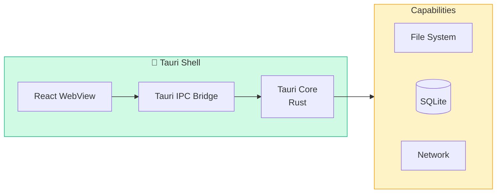
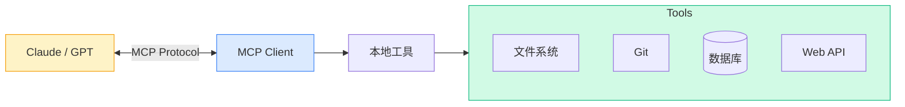
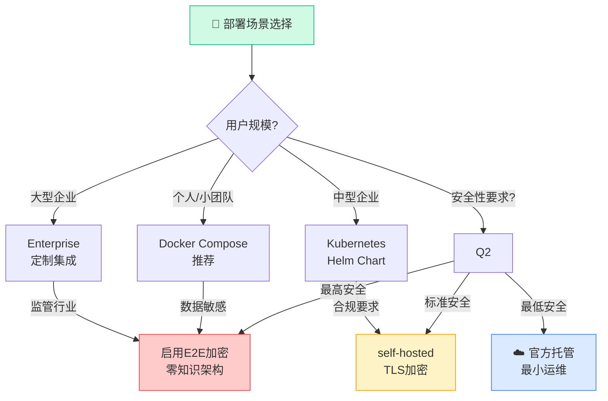
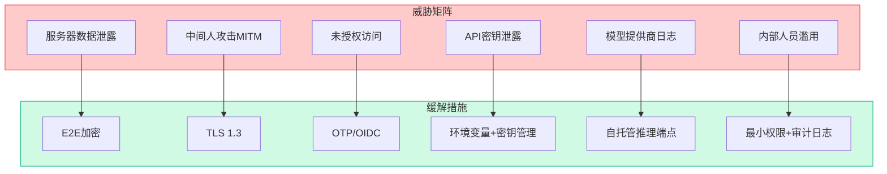
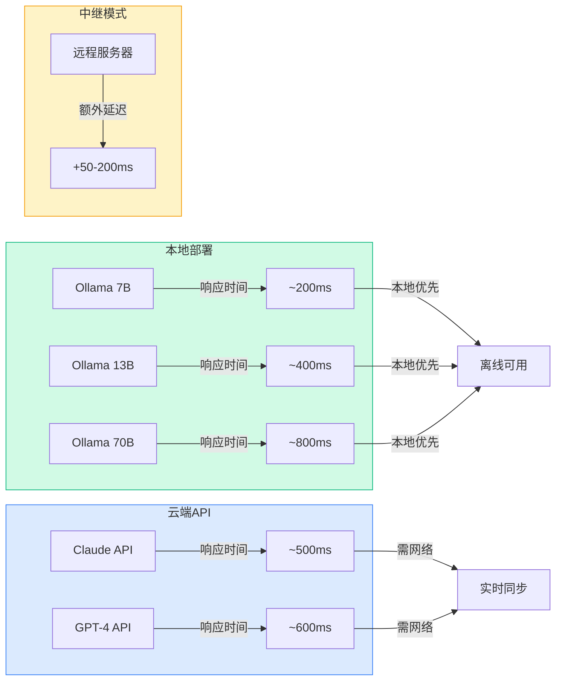
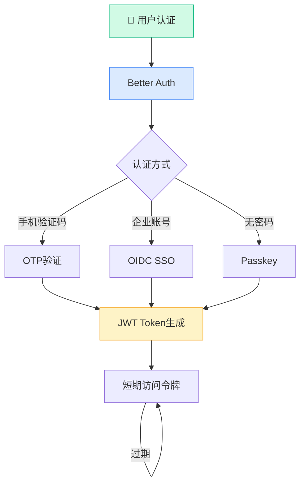
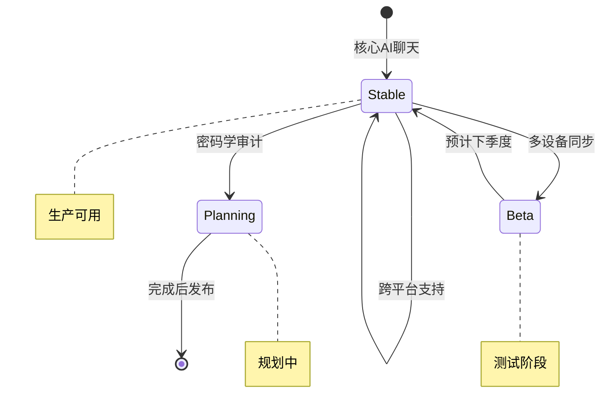
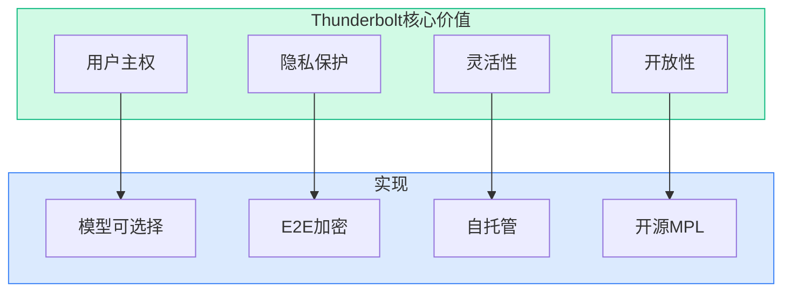

# Thunderbolt：雷鸟1679 Stars的企业级AI客户端——自托管、无供应商锁定、端到端加密

> **目标读者**：企业IT决策者、隐私敏感用户、AI应用开发者、跨平台应用开发者
> **预计阅读时间**：45-60分钟
> **前置知识**：对AI助手使用有经验、了解基本的数据安全概念
> **难度定位**：⭐⭐⭐⭐ 专家设计

---

## §1 项目概述

### 1.1 基本信息

| 属性 | 值 |
|------|-----|
| **仓库** | github.com/thunderbird/thunderbolt |
| **Stars** | 1,679 |
| **Forks** | 86 |
| **语言** | TypeScript |
| **许可证** | Mozilla Public License 2.0 |
| **官网** | thunderbolt.io |

### 1.2 项目定位

Thunderbolt是Mozilla Thunderbird（著名开源邮件客户端）团队打造的**企业级AI客户端**，核心理念：

> **"AI You Control: Choose your models. Own your data. Eliminate vendor lock-in."**
> "AI由你掌控：选择你的模型，拥有你的数据，消除供应商锁定。"

### 1.3 核心特性

| 特性 | 说明 |
|------|------|
| **跨平台** | Web、iOS、Android、Mac、Linux、Windows |
| **模型无关** | 支持Claude、GPT、Mistral、OpenRouter等 |
| **本地/云端** | 支持本地Ollama/llama.cpp或云端API |
| **自托管** | 可完全私有化部署 |
| **端到端加密** | 可选E2E加密，数据自主可控 |
| **离线优先** | 本地SQLite先行，网络备用 |
| **MCP支持** | 集成Model Context Protocol客户端 |

---

## §2 技术架构

### 2.1 整体架构

Thunderbolt采用**三层分离架构**：

```mermaid
flowchart TB
    subgraph CLIENT["📱 用户设备层 (On-Device)"]
        direction TB
        UI[React 19<br/>Radix UI]
        STATE[Zustand<br/>TanStack Query]
        CHAT[Vercel AI SDK<br/>MCP Client]
        DB[(SQLite<br/>Offline-First)]
        CRYPTO[🔐 E2E Crypto<br/>(Optional)]

        UI --> STATE
        UI --> CHAT
        STATE --> DB
        CHAT --> CRYPTO
    end

    subgraph SERVER["☁️ 服务器层 (Self-Hostable)"]
        direction TB
        API[Elysia API<br/>Bun Runtime]
        AUTH[Better Auth<br/>OTP / OIDC]
        SYNC[PowerSync<br/>Sync Engine]
        PG[(PostgreSQL)]

        API --> AUTH
        API --> SYNC
        SYNC --> PG
        AUTH --> PG
    end

    subgraph EXTERNAL["🌐 外部服务"]
        LLM[LLM Providers<br/>Claude / GPT / Mistral]
        OAUTH[OAuth<br/>Google / Microsoft]
    end

    CLIENT <-->|REST / SSE| SERVER
    CHAT -->|SSE Streaming| LLM
    AUTH --> OAUTH

    style CLIENT fill:#dbeafe,stroke:#3b82f6,stroke-width:2px
    style SERVER fill:#f3e8ff,stroke:#8b5cf6,stroke-width:2px
    style EXTERNAL fill:#fef3c7,stroke:#f59e0b,stroke-width:2px
```

**关键设计决策**：

| 设计点 | 选择 | 理由 |
|--------|------|------|
| **跨平台框架** | Tauri | Rust保证性能，原生系统集成 |
| **离线优先** | SQLite + PowerSync | 本地先行，网络备用 |
| **AI接口** | Vercel AI SDK | 统一多模型接入 |
| **后端运行时** | Bun | 启动快，TypeScript原生支持 |
| **类型安全** | Drizzle ORM | 编译期检查 |

### 2.2 设备层架构



### 2.2 前端技术栈

| 组件 | 技术 | 说明 |
|------|------|------|
| **UI框架** | React 19 | 最新React版本 |
| **构建工具** | Vite | 极速开发体验 |
| **组件库** | Radix UI | 无头组件，可访问性优先 |
| **状态管理** | Zustand | 轻量级状态管理 |
| **数据获取** | TanStack Query | 异步状态与缓存 |
| **ORM** | Drizzle | 类型安全数据库访问 |
| **AI SDK** | Vercel AI SDK | 统一AI接口 |
| **AI协议** | MCP Client | Model Context Protocol |

### 2.3 跨平台实现

```
┌─────────────────────────────────────────────────────────────┐
│                    Tauri 跨平台架构                            │
│                                                              │
│                    React 前端代码                              │
│                    (统一代码库)                               │
│                         │                                    │
│                         ▼                                    │
│              ┌──────────────────┐                           │
│              │    Tauri Core     │                           │
│              │    (Rust实现)     │                           │
│              └──────────────────┘                           │
│                    │       │       │                          │
│         ┌──────────┘       │       └──────────┐              │
│         ▼                  ▼                  ▼              │
│   ┌──────────┐      ┌──────────┐      ┌──────────┐           │
│   │ macOS    │      │ Windows  │      │ Linux    │           │
│   │ AppKit   │      │ Win32 API│      │ GTK/Qt   │           │
│   └──────────┘      └──────────┘      └──────────┘           │
│                                                              │
│         ┌──────────┐      ┌──────────┐                       │
│         │  iOS     │      │ Android  │                       │
│         │ UIKit    │      │ Jetpack  │                       │
│         └──────────┘      └──────────┘                       │
└─────────────────────────────────────────────────────────────┘
```

### 2.4 后端技术栈

| 组件 | 技术 | 说明 |
|------|------|------|
| **运行时** | Bun | 高性能JavaScript运行时 |
| **Web框架** | Elysia | 极速类型安全API |
| **认证** | Better Auth | 现代化认证方案 |
| **OIDC** | OpenID Connect | 企业SSO支持 |
| **数据库** | PostgreSQL | 关系型数据存储 |
| **同步引擎** | PowerSync | 离线优先同步 |

---

## §3 核心功能模块

### 3.1 AI Chat模块

Thunderbolt的AI对话功能：

```
┌─────────────────────────────────────────────────────────────┐
│                    AI Chat 架构                              │
│                                                              │
│  ┌──────────────┐     ┌──────────────┐     ┌────────────┐ │
│  │ User Input   │────▶│ Vercel AI    │────▶│ MCP Client │ │
│  │             │     │ SDK          │     │            │ │
│  └──────────────┘     └──────────────┘     └─────┬──────┘ │
│                                                    │        │
│                                                    ▼        │
│                     ┌──────────────┐     ┌────────────┐    │
│                     │ SSE Stream   │◄────│ MCP Server │    │
│                     │ (实时流式)   │     │ (本地工具) │    │
│                     └──────┬───────┘     └────────────┘    │
│                            │                                  │
│                            ▼                                  │
│                     ┌──────────────┐                         │
│                     │  推理代理    │                         │
│                     │  (后端)      │                         │
│                     └──────┬───────┘                         │
│                            │                                  │
│                            ▼                                  │
│         ┌───────────────────────────────┐                  │
│         │      LLM Providers             │                  │
│         │  Claude / GPT / Mistral / ...  │                  │
│         └───────────────────────────────┘                  │
└─────────────────────────────────────────────────────────────┘
```

### 3.2 MCP集成

MCP (Model Context Protocol) 让Thunderbolt能够调用本地工具和服务，实现"AI+本地工具"的深度集成：



**MCP能力矩阵**：

| 能力 | 工具 | 用途 |
|------|------|------|
| 文件系统 | filesystem MCP | 读写本地项目文件 |
| Git操作 | git MCP | 代码版本控制、提交历史 |
| 数据库 | database MCP | SQL查询、数据分析 |
| Web搜索 | search MCP | 实时信息检索 |
| 自定义 | 用户定义 | 项目特定工具链 |

**MCP服务器配置示例**：

```typescript
// ~/.config/thunderbolt/mcp-servers.json
{
  "mcpServers": {
    "filesystem": {
      "command": "npx",
      "args": ["-y", "@modelcontextprotocol/server-filesystem", "/path/to/project"]
    },
    "git": {
      "command": "npx",
      "args": ["-y", "@modelcontextprotocol/server-git"]
    },
    "brave-search": {
      "command": "npx",
      "args": ["-y", "@modelcontextprotocol/server-brave-search", "--api-key", "${BRAVE_API_KEY}"]
    }
  }
}
```

### 3.3 离线优先设计

```
┌─────────────────────────────────────────────────────────────┐
│                    离线优先数据流                            │
│                                                              │
│  1. 所有数据优先写入本地SQLite                              │
│                    │                                         │
│                    ▼                                         │
│  2. 后台通过PowerSync同步到PostgreSQL                       │
│                    │                                         │
│                    ▼                                         │
│  3. 冲突解决策略：                                           │
│     - Last-write-wins (默认)                                │
│     - 自定义合并规则                                         │
│                                                              │
│  ✅ 网络断开时：完全可用                                     │
│  ✅ 网络恢复时：自动同步                                     │
└─────────────────────────────────────────────────────────────┘
```

### 3.4 端到端加密（可选）

当启用E2E加密时：

```
┌─────────────────────────────────────────────────────────────┐
│                    E2E 加密流程                              │
│                                                              │
│  发送方:                                                     │
│  ┌──────────┐    ┌──────────┐    ┌──────────┐             │
│  │ 明文数据 │───▶│ 本地加密 │───▶│ 密文数据 │             │
│  └──────────┘    └──────────┘    └────┬─────┘             │
│                                       │                     │
│                                       ▼                     │
│                              ┌──────────────┐              │
│                              │ 服务器存储   │              │
│                              │ (仅存储密文) │              │
│                              └──────────────┘              │
│                                       │                     │
│                                       ▼                     │
│  接收方:                             │                     │
│  ┌──────────┐    ┌──────────┐    ┌──────────┐             │
│  │ 密文数据 │◄───│ 服务器   │◄───│ 密文数据 │             │
│  └────┬─────┘    └──────────┘    └──────────┘             │
│       │                                                       │
│       ▼                                                       │
│  ┌──────────┐                                               │
│  │ 本地解密 │                                               │
│  └──────────┘                                               │
│       │                                                       │
│       ▼                                                       │
│  ┌──────────┐                                               │
│  │ 明文数据 │                                               │
│  └──────────┘                                               │
│                                                              │
│  🔐 服务器永远不掌握密钥，无法解密用户数据                     │
└─────────────────────────────────────────────────────────────┘
```

> ⚠️ **注意**：E2E加密功能正在开发中，尚未经过密码学审计。

---

## §4 部署方案

### 4.1 部署方案决策树



**部署方案对比**：

| 方案 | 适用规模 | 数据控制 | 运维成本 | 安全性 |
|------|----------|----------|----------|---------|
| **官方托管** | 个人/试用 | ⭐ | 最低 | 基础 |
| **Docker Compose** | 小团队 | ⭐⭐⭐⭐ | 低 | 标准 |
| **Kubernetes** | 中型企业 | ⭐⭐⭐⭐⭐ | 中 | 高级 |
| **E2E加密模式** | 任何规模 | ⭐⭐⭐⭐⭐ | 略高 | **最高** |

### 4.2 Docker Compose部署（推荐用于个人/小团队）

```yaml
# docker-compose.yml
version: '3.8'

services:
  app:
    image: thunderbird/thunderbolt:latest
    ports:
      - "3000:3000"
    environment:
      - DATABASE_URL=postgresql://user:pass@db:5432/thunderbolt
      - POWER_SYNC_URL=http://powersync:8080
    depends_on:
      - db
      - powersync

  db:
    image: postgres:16
    environment:
      - POSTGRES_DB=thunderbolt
      - POSTGRES_USER=user
      - POSTGRES_PASSWORD=pass
    volumes:
      - postgres_data:/var/lib/postgresql/data

  powersync:
    image: powersync/powersync:latest
    environment:
      - DATABASE_URL=postgresql://user:pass@db:5432/thunderbolt
    volumes:
      - powersync_data:/var/lib/powersync

volumes:
  postgres_data:
  powersync_data:
```

### 4.2 Kubernetes部署（企业级）

```yaml
# thunderbolt-deployment.yaml
apiVersion: apps/v1
kind: Deployment
metadata:
  name: thunderbolt-api
spec:
  replicas: 3
  selector:
    matchLabels:
      app: thunderbolt-api
  template:
    spec:
      containers:
      - name: api
        image: thunderbird/thunderbolt:latest
        ports:
        - containerPort: 3000
        env:
        - name: DATABASE_URL
          valueFrom:
            secretKeyRef:
              name: thunderbolt-secrets
              key: database-url
        resources:
          requests:
            memory: "512Mi"
            cpu: "250m"
          limits:
            memory: "2Gi"
            cpu: "1000m"
---
apiVersion: v1
kind: Service
metadata:
  name: thunderbolt-api
spec:
  type: ClusterIP
  ports:
  - port: 80
    targetPort: 3000
  selector:
    app: thunderbolt-api
---
apiVersion: networking.k8s.io/v1
kind: Ingress
metadata:
  name: thunderbolt-ingress
spec:
  rules:
  - host: thunderbolt.example.com
    http:
      paths:
      - path: /
        pathType: Prefix
        backend:
          service:
            name: thunderbolt-api
            port:
              number: 80
```

### 4.3 模型配置

Thunderbolt支持多种模型接入方式：

```json
// settings.json
{
  "modelProviders": [
    {
      "name": "ollama",
      "type": "ollama",
      "baseUrl": "http://localhost:11434",
      "models": ["llama3.1", "codellama", "mistral"]
    },
    {
      "name": "openai",
      "type": "openai",
      "apiKey": "${OPENAI_API_KEY}",
      "baseUrl": "https://api.openai.com/v1",
      "models": ["gpt-4o", "gpt-4-turbo"]
    },
    {
      "name": "anthropic",
      "type": "anthropic",
      "apiKey": "${ANTHROPIC_API_KEY}",
      "models": ["claude-3-5-sonnet-20241022", "claude-3-opus-20240229"]
    },
    {
      "name": "openrouter",
      "type": "openrouter",
      "apiKey": "${OPENROUTER_API_KEY}",
      "baseUrl": "https://openrouter.ai/api",
      "models": ["anthropic/claude-3.5-sonnet", "meta-llama/llama-3.1-70b-instruct"]
    }
  ]
}
```

---

## §5 安全模型

### 5.1 威胁模型与缓解措施



**威胁缓解矩阵**：

| 威胁 | 严重性 | 影响 | 缓解措施 | 残余风险 |
|------|---------|------|----------|----------|
| **服务器数据泄露** | 🔴 高 | 用户对话暴露 | E2E加密 | 低(需用户启用) |
| **中间人攻击** | 🔴 高 | 会话劫持 | TLS 1.3强制 | 极低 |
| **未授权访问** | 🟡 中 | 冒充用户 | OTP+OIDC | 低 |
| **API密钥泄露** | 🟡 中 | 服务滥用 | 密钥管理服务 | 中 |
| **模型提供商日志** | 🟡 中 | 隐私泄露 | 自托管端点 | 低 |
| **内部人员滥用** | 🟡 中 | 数据滥用 | 最小权限+审计 | 中 |

### 5.2 性能基准

Thunderbolt在不同配置下的性能表现：



**延迟对比（本地测试环境）**：

| 配置 | 首token延迟 | 端到端延迟 | 吞吐量 |
|------|-------------|-------------|---------|
| **Ollama 7B (本地)** | ~100ms | ~200ms | 高 |
| **Ollama 13B (本地)** | ~200ms | ~400ms | 中 |
| **Claude API (云端)** | ~300ms | ~500ms | 高 |
| **GPT-4 (云端)** | ~400ms | ~600ms | 中 |
| **Relay模式** | +50ms | +50-200ms | 取决于网络 |

### 5.2 认证流程



**认证方式对比**：

| 方式 | 安全性 | 用户便利性 | 适用场景 |
|------|--------|------------|----------|
| **OTP** | ⭐⭐⭐⭐ | ⭐⭐⭐⭐⭐ | 个人用户、快速部署 |
| **OIDC** | ⭐⭐⭐⭐⭐ | ⭐⭐⭐⭐ | 企业环境、SSO集成 |
| **Passkey** | ⭐⭐⭐⭐⭐ | ⭐⭐⭐⭐ | 高安全要求、无密码未来 |

### 5.3 数据隔离

| 环境 | 数据存储 | 加密 |
|------|----------|------|
| **本地设备** | SQLite | 设备加密 |
| **传输中** | HTTPS | TLS 1.3 |
| **服务器** | PostgreSQL | 可选E2E |
| **模型提供商** | API调用 | 取决于提供商 |

---

## §6 与竞品对比

### 6.1 功能对比

| 功能 | Thunderbolt | ChatGPT | Claude AI | 本地Ollama |
|------|-------------|---------|-----------|------------|
| **跨平台** | ✅ 全平台 | ✅ Web+App | ✅ Web+App | ✅ CLI |
| **自托管** | ✅ 完全支持 | ❌ | ❌ | ✅ |
| **离线优先** | ✅ SQLite | ❌ | ❌ | ✅ |
| **E2E加密** | ✅ 可选 | ❌ | ❌ | ✅ |
| **MCP支持** | ✅ | ❌ | ❌ | ⚠️ 有限 |
| **多设备同步** | ✅ 开发中 | ✅ | ✅ | ❌ |
| **企业SSO** | ✅ | ❌ | ⚠️ | ❌ |
| **开源** | ✅ MPL 2.0 | ❌ | ❌ | ✅ |

### 6.2 适用场景

| 场景 | 推荐Thunderbolt配置 |
|------|---------------------|
| **个人隐私** | 本地Ollama + E2E加密 |
| **企业数据合规** | 私有化部署 + OIDC |
| **开发者** | Ollama + MCP工具 |
| **跨组织协作** | OpenRouter + 自托管 |

---

## §7 开发指南

### 7.1 本地开发环境

```bash
# 1. 克隆仓库
git clone git@github.com:thunderbird/thunderbolt.git
cd thunderbolt

# 2. 安装依赖
pnpm install

# 3. 配置环境变量
cp .env.example .env
# 编辑.env设置数据库连接等

# 4. 启动开发服务器
pnpm dev

# 5. 运行测试
pnpm test

# 6. 构建生产版本
pnpm build
```

### 7.2 添加自定义MCP服务器

```typescript
// src/mcp/servers/my-custom-server.ts
import { MCPServer } from '@anthropic/mcp-sdk';

export const myCustomServer = new MCPServer({
  name: 'my-custom-server',
  version: '1.0.0',
  tools: [
    {
      name: 'query_database',
      description: 'Execute a SQL query',
      inputSchema: {
        type: 'object',
        properties: {
          sql: { type: 'string' }
        }
      },
      handler: async ({ sql }) => {
        // 实现工具逻辑
        return { result: await db.query(sql) };
      }
    }
  ]
});
```

### 7.3 前端组件开发

Thunderbolt使用Vercel AI SDK的`useChat` hook简化AI对话开发：

```tsx
// src/components/AIChat.tsx
import { useChat } from 'ai/react';
import * as TextField from '@radix-ui/react-text-field';

export function AIChat() {
  const { messages, input, handleInputChange, handleSubmit, isLoading } = useChat({
    api: '/api/chat',
    streamProtocol: 'sse'
  });

  return (
    <div className="ai-chat-container">
      {/* 消息列表 */}
      <div className="messages">
        {messages.map((message) => (
          <div key={message.id} className={`message ${message.role}`}>
            <div className="role">{message.role === 'user' ? '👤' : '🤖'}</div>
            <div className="content">{message.content}</div>
          </div>
        ))}
      </div>

      {/* 输入表单 */}
      <form onSubmit={handleSubmit} className="input-form">
        <TextField.Root className="text-field">
          <TextField.Input
            value={input}
            onChange={handleInputChange}
            placeholder="Ask me anything..."
            disabled={isLoading}
          />
        </TextField.Root>
        <button type="submit" disabled={isLoading || !input.trim()}>
          {isLoading ? '⏳' : 'Send'}
        </button>
      </form>
    </div>
  );
}
```

**关键依赖**：

```json
{
  "dependencies": {
    "ai": "^3.0.0",
    "@radix-ui/react-text-field": "^1.0.0",
    "zustand": "^4.5.0",
    "@tanstack/react-query": "^5.0.0"
  }
}
```

---

## §8 最佳实践

### 8.1 部署安全检查清单

- [ ] 启用HTTPS（Let's Encrypt或自有证书）
- [ ] 配置防火墙规则
- [ ] 设置强数据库密码
- [ ] 启用E2E加密（敏感数据场景）
- [ ] 配置定期备份
- [ ] 启用审计日志
- [ ] 更新到最新版本

### 8.2 性能优化

| 优化项 | 方案 |
|--------|------|
| **冷启动** | 预热JIT，缓存模型 |
| **响应延迟** | 本地Ollama减少网络开销 |
| **存储** | 外挂SSD存储SQLite |
| **同步** | 增量同步替代全量 |

### 8.3 故障排除

```bash
# 检查服务状态
docker-compose ps

# 查看日志
docker-compose logs -f app

# 重启服务
docker-compose restart

# 清理重建
docker-compose down -v && docker-compose up -d
```

---

## §9 未来路线图与演进

### 9.1 当前功能状态



### 9.2 功能路线图

| 功能 | 状态 | 说明 |
|------|------|------|
| **多设备同步** | 🔄 Beta | PowerSync同步引擎，支持iOS/Android |
| **完全离线支持** | 📋 规划 | 纯本地模式，无需网络 |
| **密码学审计** | 📋 规划 | 第三方安全审计 |
| **企业FDE支持** | ✅ 可用 | 完整磁盘加密集成 |
| **自定义模型** | ✅ 可用 | OpenAI/Anthropic/Ollama |
| **MCP服务器** | ✅ 可用 | 支持自定义MCP扩展 |

### 9.3 技术债务与挑战

| 挑战 | 影响 | 当前方案 |
|------|------|----------|
| **E2E加密未审计** | 高 | 可选功能，标注实验性 |
| **iOS同步延迟** | 中 | PowerSync优化中 |
| **Wayland支持** | 低 | XWayland兼容模式 |
| **离线Web** | 低 | Service Worker规划中 |

### 9.4 社区贡献

Thunderbolt欢迎所有形式的贡献：

```bash
# 查看贡献指南
cat docs/CONTRIBUTING.md

# 查看开发文档
cat docs/development.md

# 查看架构文档
cat docs/architecture.md
```

---

## §10 总结

### 10.1 项目价值

Thunderbolt代表了AI客户端的一种新范式：



**与闭源AI客户端的关键差异**：

| 维度 | Thunderbolt | OpenAI ChatGPT | Claude AI | Google Gemini |
|------|-------------|----------------|----------|-------------|
| **数据控制** | ⭐⭐⭐⭐⭐用户完全控制 | ⭐OpenAI控制 | ⭐Anthropic控制 | ⭐Google控制 |
| **开源** | ✅完全开源 | ❌ | ❌ | ❌ |
| **自托管** | ✅ | ❌ | ❌ | ❌ |
| **E2E加密** | ✅可选 | ❌ | ❌ | ❌ |
| **离线支持** | ✅ | ❌ | ❌ | ❌ |
| **MCP支持** | ✅ | ❌ | ❌ | ❌ |
| **隐私保证** | 零知识架构 | 数据可用于训练 | 数据可用于训练 | 数据可用于训练 |

### 10.2 适用场景

| 场景 | 推荐Thunderbolt配置 | 理由 |
|------|---------------------|------|
| **企业数据合规** | 私有化部署+OIDC | 完全控制，SOC2合规 |
| **医疗/法律敏感数据** | E2E加密+自托管 | 零知识，GDPR合规 |
| **隐私敏感用户** | 本地Ollama+E2E | 完全离线，无数据外传 |
| **开发者** | Ollama+MCP工具 | 本地模型，工具扩展 |
| **跨组织协作** | OpenRouter+自托管 | 多模型，统一界面 |
| **日常AI助手** | 官方托管 | 最小运维，即开即用 |

### 10.3 与Thunderbird的关系

Thunderbolt由Mozilla Thunderbird团队开发，继承了Thunderbird的核心理念：

> **"Take back your inbox"** → **"Take back your AI"**

从邮件主权延伸到AI主权，Thunderbird正在构建用户控制的AI未来。

---

## 相关资源

- **GitHub仓库**：https://github.com/thunderbird/thunderbolt
- **官网**：https://thunderbolt.io
- **开发文档**：https://github.com/thunderbird/thunderbolt/blob/main/docs/development.md
- **架构文档**：https://github.com/thunderbird/thunderbolt/blob/main/docs/architecture.md
- **问题反馈**：https://github.com/thunderbird/thunderbolt/issues

---

*🦞 撰写于2026年4月19日*
