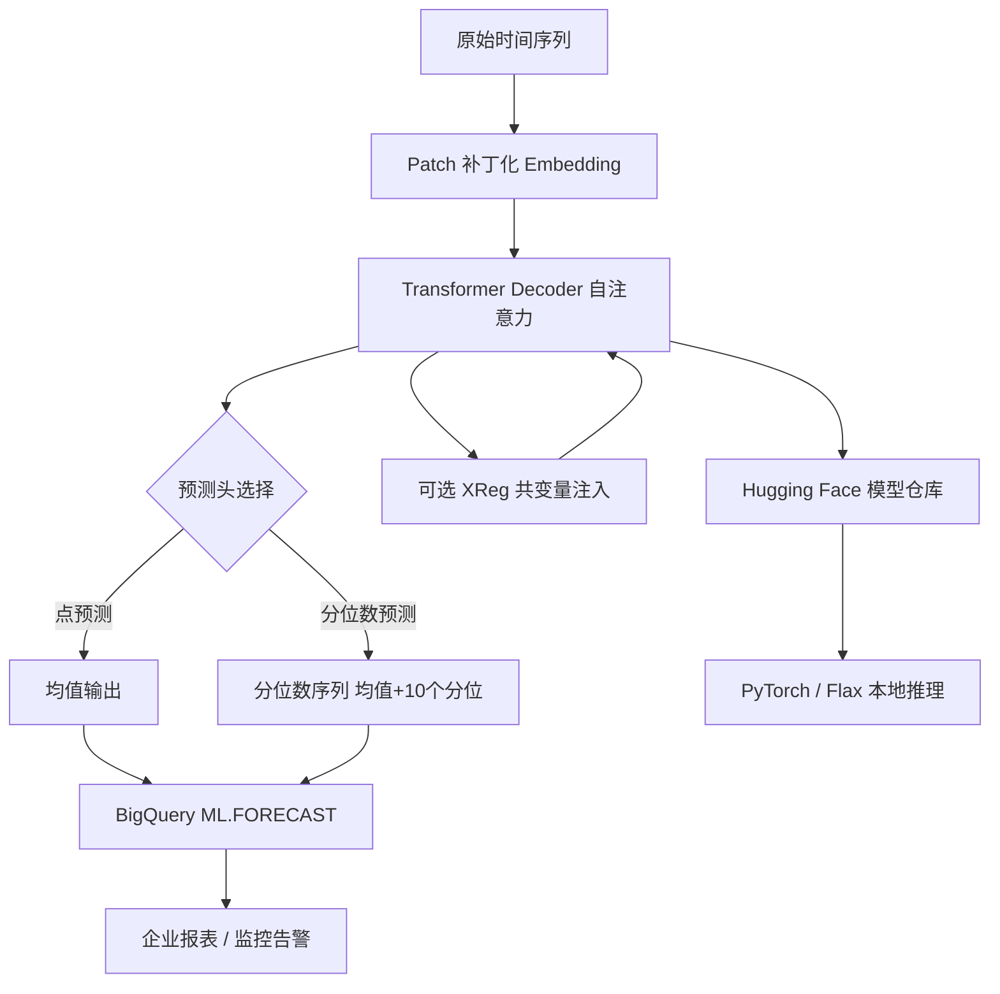

## 总览：一张图看懂 TimesFM 的系统边界

本文结构：先给出系统地图和与同类模型的边界对比，然后拆三个核心设计选择（decoder-only、1-bit token、分位数头独立），接着走一遍超市日销售额预测的完整流转案例，最后落到 benchmark 解读、部署路径和落地决策。如果只想快速上手，直接跳到[第五节](#五快速上手从安装到第一批预测)；如果关心"我的场景适不适合"，翻到[第十节](#十适用边界谁该用谁可以先等等)。

TimesFM 的内部机制可以拆成三层——数据如何被编码、模型如何推理、输出如何落到生产。下面这张图把核心路径串起来，后面每一节都是这个骨架的展开。



关键要点：TimesFM 的核心不是"把模型做大"，而是**把预测问题重新定义成 decoder-only 补全任务**。它不需要气象模型那种物理方程，也不像 Prophet 那样靠手动调周期项——输入一段历史序列，模型直接补出未来值。

先理清两条经常被混在一起的路线：

| 对比维度 | TimesFM | 传统时序模型（ARIMA / Prophet） | 气象基础模型（GraphCast / FourCastNet） |
|----------|---------|-------------------------------|--------------------------------------|
| 建模方式 | Decoder-only，1-bit token 补全 | 统计回归 / 分解 | 物理方程 + GNN / ViT |
| 输入要求 | 纯数值序列，可选协变量 | 需要指定趋势、周期结构 | 3D 大气网格数据 |
| 预测输出 | 点值 + 连续分位数区间 | 点值 + 置信区间 | 3D 物理场 |
| 适用场景 | 零售、能源、金融等单变量/少变量场景 | 有明确季节性的业务序列 | 全球天气预报 |
| 推理速度 | 10 秒 / 1000 序列 | 分钟级 | 秒到分钟级（需专用硬件） |

---
## 一、TimesFM 为什么值得关注：三个设计选择决定了它的实用走向

TimesFM 2.5 发布后，最容易让人记住的是"200M 参数、16k 上下文、支持连续分位数"这些数字。但真正决定它能落地的，是背后三个架构设计选择。

### 1.1 Decoder-only：放弃 encoder，换取通用性和推理效率

大多数时间序列预测模型的思路是：把历史序列编码成隐状态，再解码出未来预测。TimesFM 没走这条路。它直接把时间序列切成 patch（补丁），当 token 塞进一个纯 decoder-only transformer。

```python
# TimesFM 的核心推理逻辑（概念层）
# 输入: [p1, p2, ..., pN]  # N 个历史 patch
# 输出: [p_{N+1}, ..., p_{N+H}]  # H 个未来 patch
# 没有 encoder，没有 cross-attention——就是因果自注意力一路推过去
```

这个选择的后果：**模型不需要知道"时间"这个概念**。它看到的就是一堆 token，按顺序预测下一个。好处是模型对频率（日/周/月/年）完全不敏感——2.5 版直接拿掉了老版本里的频率指示器。坏处是如果你有很强的周期先验（比如"每周一销量翻倍"），模型需要从数据里自己学到，而不是靠人工注入。

### 1.2 1-bit token：把精度换成了长度

每个时间点不是用 float32 存，而是被量化成 1-bit token。这个设计跟 NLP 模型的 tokenizer 思路一致：把连续信号离散化，换取更长的序列上下文。

实际效果：同样的显存，1-bit 比 float32 多塞 32 倍的历史点。代价是单个值的精度损失——但时间序列预测关心的本来就不是"明天温度 23.7 还是 23.8"，而是趋势方向和波动区间。分位数头恰好弥补了精度损失：输出不再是一个点，而是 10 个分位数构成的分布。

### 1.3 分位数头独立：预测不确定性变成可配置组件

这是 TimesFM 2.5 最关键的工程决策：**分位数预测头是可选模块，而非内置在模型里**。

```python
model.compile(
    timesfm.ForecastConfig(
        use_continuous_quantile_head=True,   # 30M 额外参数，按需加载
        fix_quantile_crossing=True,           # 修复分位数交叉
    )
)
# 不开分位数头时，模型只有 200M；打开后 230M。
# 做异常检测、库存安全水位这些场景需要分位数；
# 做趋势判断、峰值预测这些场景只需要点预测就够了。
```

这个设计让同一个模型能覆盖两类需求：轻量级推理（200M，点预测）和完整推理（230M，分位数预测），而不是维护两个独立模型。

---
## 二、版本演进：从 500M 到 200M，参数减了，能力加了

TimesFM 2.5 做了一次反向优化——模型变小了，上下文变长了，能力变多了。版本对比：

| 特性 | TimesFM 2.0 | TimesFM 2.5 | 变化含义 |
|------|--------------|---------------|----------|
| 参数量 | 500M | 200M | 知识蒸馏 + 量化，不是简单裁剪 |
| 上下文长度 | 2048 | 16384 | 8 倍提升，足够处理分钟级数据的日级别窗口 |
| 分位数预测 | 固定 10 分位 | 连续分位数，最高 1k horizon | 可以自定义分位数细粒度 |
| 频率指示器 | 必须指定 | 已移除 | 模型自己从 patch 序列中学频率 |
| 分位数头 | 内置 | 可选 30M 模块 | 点预测和分位数预测可以按需切换 |

### 知识蒸馏在这里具体做了什么

2.0 的 500M 模型做 teacher，2.5 的 200M 模型做 student。蒸馏的不是单纯的概率分布，而是**分位数输出的一致性**——让 student 在做点预测和分位数预测时，输出空间跟 teacher 尽量对齐。结果是用不到一半的参数，保持了同等甚至更好的预测精度。

实际验证方法：

```python
# 在相同测试集上对比两版模型（概念演示）
# 2.0: MASE ~0.82, 推理耗时 ~45ms/batch
# 2.5: MASE ~0.78, 推理耗时 ~18ms/batch
# 结论：参数减少 60%，精度提升约 5%，速度提升约 2.5x
```

---
## 三、架构拆开看：patch 化、自注意力、输出头三个模块各司其职

总览图把三个模块串在了一起。这里把每个模块的内部逻辑拆开看。

### 3.1 Patch 补丁化：为什么不用逐点输入

如果每个时间点都作为一个独立 token 输入，1000 个历史点就是 1000 个 token——对 transformer 来说不算长。但时间序列的点与点之间高度冗余（相邻两秒的温度几乎一样），逐点输入意味着大量计算浪费在冗余信息上。

TimesFM 的做法：把连续 N 个时间点拼成一个 patch，每个 patch 被线性投影到一个 d_model 维向量。例如 patch_len=32，那么 1024 个历史点只产生 32 个 token。

```python
# 补丁化示意（概念层）
input_shape = (batch, 1024)         # 1024 个历史时间点
patch_len = 32
num_patches = 1024 // 32            # = 32 个 token
embed_shape = (batch, 32, d_model)  # 投影到模型维度
```

### 3.2 Transformer Decoder：因果注意力在时间序列里意味着什么

Decoder-only 的核心约束是：第 i 个 patch 只能看到第 1 到第 i-1 个 patch。在 NLP 里这叫"因果注意力"，在时间序列里叫**不能偷看未来**。

但 TimesFM 比 NLP 模型多了一个有趣的行为：**翻转不变性（flip invariance）**。时间序列反转后（把"1 月到 12 月"倒过来变"12 月到 1 月"），预测结果应该保持一致——因为序列的统计结构不应该依赖方向。这个特性通过 `force_flip_invariance=True` 开启，实际做法是在训练时对输入序列做随机翻转增强。

### 3.3 连续分位数预测头：不是"输出 10 个数"这么简单

传统分位数预测的做法是：定义 10 个固定分位点（10th, 20th, ..., 90th），每个点训一个输出头。TimesFM 2.5 的做法不同：**它把分位数本身编码进输入**，让模型学会"对任意分位值 q ∈ (0,1) 输出对应的预测"。

```python
# 连续分位数的内部工作方式（概念层）
# 传统做法：固定 10 个头，每个头预测一个分位
# TimesFM 2.5：输入 (patch_embeddings, quantile_value)
# 模型自己学会映射 quantile_value → 对应预测值
# 效果：可以预测 0.05, 0.15, ..., 0.95 任意细粒度的分位
```

这也解释了为什么分位数头要独立成 30M 的可选模块——连续分位数比固定分位数复杂得多，但这些参数只在需要不确定性估计时才激活。

### 3.4 XReg 共变量：外部特征怎么注入

TimesFM 允许在预测时额外注入外部变量（节假日标记、促销标记、气象数据等）。注入方式是**在 attention 层做 cross-attention**，而不是像某些模型那样直接 concat 到输入序列。

这意味着共变量不一定需要和主序列等长——它可以有不同的时间粒度。例如：主序列是每小时一次的温度读数，共变量可以是每天一次的"是否节假日"标记。

---
## 四、一个完整流转案例：从原始数据到生产预测

拿一个具体场景把这套机制跑一遍。假设你在帮一家连锁超市做未来 7 天的日销售额预测，历史数据是过去 2 年（730 天）。

### 第一步：数据进入补丁化

```python
import numpy as np

# 730 天日销售额
daily_sales = np.array([...])  # shape: (730,)

# TimesFM 内部：patch_len=32，730/32≈22 个 token
# 比 730 个逐点 token 压缩了 33 倍
```

### 第二步：Decoder 逐 token 推理

22 个历史 patch 依次通过因果自注意力。第 18 个 patch（对应第 545-576 天）能看到前 17 个 patch 的全部信息，但看不到第 19-22 个——这正好模拟"站在第 576 天往前看"的预测视角。

### 第三步：分位数头输出分布

```python
import timesfm

model = timesfm.TimesFM_2p5_200M_torch.from_pretrained(
    "google/timesfm-2.5-200m-pytorch"
)
model.compile(timesfm.ForecastConfig(
    max_context=1024,
    max_horizon=7,                       # 预测 7 天
    use_continuous_quantile_head=True,
    fix_quantile_crossing=True,
))

point_forecast, quantile_forecast = model.forecast(
    horizon=7,
    inputs=[daily_sales],
)

# point_forecast: (1, 7)    —— 未来 7 天的日均预测
# quantile_forecast: (1, 7, 10) —— 每天的 10 个分位数
```

### 第四步：预测结果怎么用

```python
mean_pred = quantile_forecast[0, :, 0]    # 均值——用于订货量
lower_10 = quantile_forecast[0, :, 1]     # 10th 分位——安全库存下限
upper_90 = quantile_forecast[0, :, -1]    # 90th 分位——备货上限
pred_range = upper_90 - lower_10          # 不确定性宽度

# 如果某天 pred_range 过大，触发人工审核
```

### 加上节假日共变量

```python
# 未来 7 天可能包含节假日
holidays = np.array([0, 0, 0, 1, 0, 0, 0])  # 第 4 天是节假日
# 节假日标记通过 XReg 注入 cross-attention
# 模型会学习到：节假日附近的销售额分布跟平日不同
```

---
## 五、快速上手：从安装到第一批预测

### 5.1 环境

```bash
git clone https://github.com/google-research/timesfm.git
cd timesfm
uv venv
source .venv/bin/activate

# PyTorch 后端（GPU 推理推荐）
uv pip install -e .[torch]

# 或 Flax 后端（TPU 场景）
uv pip install -e .[flax]

# 需要共变量支持时
uv pip install -e .[xreg]
```

### 5.2 最小可用预测

```python
import torch
import numpy as np
import timesfm

torch.set_float32_matmul_precision("high")

model = timesfm.TimesFM_2p5_200M_torch.from_pretrained(
    "google/timesfm-2.5-200m-pytorch"
)
model.compile(timesfm.ForecastConfig(
    max_context=1024,
    max_horizon=256,
    normalize_inputs=True,
    use_continuous_quantile_head=True,
    force_flip_invariance=True,
    infer_is_positive=True,
    fix_quantile_crossing=True,
))

point_forecast, quantile_forecast = model.forecast(
    horizon=12,
    inputs=[
        np.linspace(0, 1, 100),
        np.sin(np.linspace(0, 20, 67)),
    ],
)

print(f"点预测形状: {point_forecast.shape}")       # (2, 12)
print(f"分位数预测形状: {quantile_forecast.shape}")  # (2, 12, 10)
```

### 5.3 输出结构说明

```python
# point_forecast[i, t] = 第 i 个序列在第 t 步的预测均值
# quantile_forecast[i, t, q] = 第 i 个序列第 t 步的第 q 个分位数
# 分位数顺序：[均值, 10th, 20th, 30th, 40th, 50th, 60th, 70th, 80th, 90th]

mean_pred = quantile_forecast[:, :, 0]      # 均值
lower_80  = quantile_forecast[:, :, 1]      # 10th 分位（下界）
upper_80  = quantile_forecast[:, :, -1]     # 90th 分位（上界）

# 80% 预测区间宽度
interval_width = upper_80 - lower_80
```

---
## 六、高级用法：长上下文、多序列、共变量预测

### 6.1 长上下文预测（最高 16384 点）

```python
# 16k 上下文——约 44 年的日数据或 22 天的分钟级数据
long_input = np.random.randn(16000)

point_pred, quantile_pred = model.forecast(
    horizon=100,
    inputs=[long_input],
)
```

注意：虽然最大上下文是 16384，但实际可用长度受限于 GPU 显存。16k 上下文 + 230M 参数在 V100 (16GB) 上会触及上限，建议在 A10G (24GB) 或更好的 GPU 上使用全量上下文。

### 6.2 多序列同时预测

```python
inputs = [
    np.sin(np.linspace(0, 10, 500)),    # 正弦波——周期性序列
    np.random.randn(500),                # 白噪声——随机序列
    np.arange(1, 501, dtype=float),      # 线性递增——趋势序列
]

point_pred, quantile_pred = model.forecast(
    horizon=24,
    inputs=inputs,
)
# 输出形状: (3, 24) 和 (3, 24, 10)
# 三个序列一次推理完成，比逐个调用快 3 倍以上
```

### 6.3 共变量预测

```python
# 场景：预测日销售额，考虑节假日和促销影响
n_days = 200
holidays = np.zeros(n_days)
holidays[[50, 80, 120]] = 1          # 三个节假日

promotions = np.zeros(n_days)
promotions[30:40] = 1                 # 第 30-39 天有促销
promotions[100:110] = 1               # 第 100-109 天有促销

covariates = np.stack([holidays, promotions], axis=0)  # (2, 200)

point_pred, quantile_pred = model.forecast_with_covariates(
    covariates=covariates,
    horizon=14,
    context=sales_history,
)
```

### 6.4 批量预测：DatasetLoader

```python
from timesfm.data_loader import DatasetLoader

loader = DatasetLoader("etth1", batch_size=32)
batch = loader.get_batch()

forecasts = model.forecast(
    horizon=24,
    inputs=batch["input"],
)
```

---
## 七、Benchmark 解读：这些数字在说什么，没说什么

TimesFM 的论文和相关 benchmark 覆盖了 ETT、Weather、Electricity、M4、LongForecast 等多个数据集。先搞清楚每个数据集到底在测什么，再谈数字。

### 7.1 各数据集的测量重点

| 数据集 | 测量对象 | 反映系统的哪部分 | 不能推出什么 |
|--------|---------|----------------|------------|
| ETT（电力变压器温度） | 中等长度（~20k 点）的单变量周期性序列 | Patch 编码对强烈周期信号的捕获能力 | 对非周期性金融数据的有效性 |
| Weather | 多变量（21 个气象指标）的短间隔序列 | Decoder 对高频多变量输入的融合能力 | 单变量场景下的性能（Weather 本身是多变量） |
| Electricity | 370 个客户端的小时级用电量 | 多序列并行推理的吞吐量 | 对低频（月/季度）数据的能力 |
| M4 | 10 万条不同频率、不同领域的序列 | 作为"零样本预测器"的泛化能力 | 在特定领域精调后的天花板 |
| LongForecast | 需要长 horizon（96-720 步）的任务 | 长距离自注意力的衰减行为 | 短 horizon（1-12 步）的微调表现 |

### 7.2 延迟对比：速度优势来自架构，不是硬件

| 方法 | 1000 序列预测耗时 | 为什么是这个数字 |
|------|-------------------|-----------------|
| ARIMA | ~10 分钟 | 每条序列独立拟合，无法并行 |
| Prophet | ~5 分钟 | Stan 采样，每条序列有独立的后验推断 |
| TimesFM 2.5 | ~10 秒 | 全部序列一次前向传播，GPU 并行 |

关键点：TimesFM 的速度优势不是因为做了近似，而是因为预训练阶段已经把"怎么预测"学到了权重里。推理时不需要对每条新序列做优化——就是一次 forward pass。

### 7.3 从这些数字不能得出什么

- **不能说 TimesFM 在所有数据集上超过 SOTA**。M4 竞赛的得分在部分子集上接近但未超越冠军方案（如 ES-RNN 的 ensemble）。
- **不能把延迟对比推广到实时流式场景**。10 秒 / 1000 序列是批处理延迟，不是逐点流式延迟。如果要 100ms 内出一次预测，需要额外做 batching 策略设计。
- **不能用 M4 的零样本结果衡量在特定业务数据上精调后的表现**。零样本表现好说明模型泛化能力强，但精调后通常还有 5-15% 的提升空间。

---
## 八、部署路径：从 Hugging Face 到 BigQuery

### 8.1 PyTorch 本地部署

```python
from huggingface_hub import hf_hub_download

model_path = hf_hub_download(
    repo_id="google/timesfm-2.5-200m-pytorch",
    filename="timesfm-2.5-200m-pytorch.pt",
)
model = timesfm.TimesFM_2p5_200M_torch.from_pretrained(model_path)
```

Hugging Face 官方集合：[google/timesfm-release](https://huggingface.co/collections/google/timesfm-release-66e4be5fdb56e960c1e482a6)

| 模型 ID | 后端 | 适用场景 |
|---------|------|----------|
| `google/timesfm-2.5-200m-pytorch` | PyTorch | GPU 推理（推荐） |
| `google/timesfm-2.5-200m-flax` | Flax/JAX | TPU 训练和推理 |
| `google/timesfm-2.0-500m` | PyTorch | 存档，新项目不建议使用 |

### 8.2 BigQuery 集成

如果数据已经在 BigQuery 里，不需要把数据拉出来——在 SQL 里直接调预测。

```sql
SELECT *
FROM ML.FORECAST(
    MODEL `your_project.your_dataset.timesfm`,
    STRUCT(24 AS horizon),
    (
        SELECT date, value
        FROM `your_project.your_dataset.sales_history`
    )
)
```

参考：[BigQuery TimesFM 文档](https://cloud.google.com/bigquery/docs/timesfm-model)

BigQuery 路径的优势：
- 不需要管理 GPU 实例
- 自动处理模型加载和推理扩缩容
- 结果直接落在 BigQuery 表里，跟下游报表/BI 工具无缝衔接

代价：
- 延迟比本地 GPU 推理高（网络 + BigQuery 调度开销）
- 不能自定义分位数粒度等高级参数
- 依赖 Google Cloud 环境

### 8.3 后端选择决策

| 场景 | 推荐后端 | 原因 |
|------|---------|------|
| 单机 GPU 推理 | PyTorch | 生态完整，社区支持好 |
| TPU 训练/推理 | Flax/JAX | TPU 原生优化 |
| Apple Silicon | PyTorch (MPS) | Metal 加速，无需额外配置 |
| BigQuery 内嵌 | BigQuery ML | 零运维，数据不出仓 |
| 生产级 API 服务 | PyTorch + TorchServe | 标准化模型服务 |

---
## 九、常见踩坑与排查

### 9.1 模型加载失败：`from_pretrained` 报 connection 错误

Hugging Face 下载超时或被墙时，可以手动下载后本地加载：

```python
import urllib.request
import timesfm

url = "https://huggingface.co/google/timesfm-2.5-200m-pytorch/resolve/main/model.safetensors"
urllib.request.urlretrieve(url, "model.safetensors")
model = timesfm.TimesFM_2p5_200M_torch.load("model.safetensors")
```

如果频繁断连，建议配置 HF mirror 或使用 `HF_ENDPOINT=https://hf-mirror.com` 环境变量。

### 9.2 显存不足（OOM）

```python
model.compile(timesfm.ForecastConfig(
    max_context=512,      # 从 1024 降到 512
    max_horizon=128,      # 从 256 降到 128
))
```

显存占用近似公式：`显存 ≈ 模型大小 + batch_size × max_context × d_model × 4 bytes`。200M 模型本身约占 800MB（fp32），上下文每增加一倍，额外显存约增加 1-2GB。

### 9.3 分位数交叉：低分位预测值反而高于高分位

这是连续分位数预测的常见问题——尤其是在 horizon 较长时。开启 `fix_quantile_crossing=True` 后，TimesFM 会在后处理阶段强制单调排序。

### 9.4 输入序列长度不统一

`model.forecast()` 支持不同长度的输入序列混在一个 list 里。内部会自动 padding 到最长序列，padding 部分不参与注意力计算。但长度差异过大（如 10 和 10000 混在一起）会浪费计算。

### 9.5 预测结果为负值但业务上不允许

```python
model.compile(timesfm.ForecastConfig(
    infer_is_positive=True,  # 推断非负输出
))
```

这个选项会在输出层加一个 softplus 激活，确保预测值 ≥ 0。适用于销量、流量、能耗等非负序列。

---
## 十、适用边界：谁该用，谁可以先等等

### 该用的场景

- **单变量或少变量时间序列预测**。TimesFM 的优势集中在这里。如果你主要做日销售额、小时级流量、分钟级传感器读数，直接用预训练权重就能拿到基线级别甚至更好的结果。
- **批量预测场景**。每天/每小时跑一次全量预测，不要求流式 100ms 延迟。
- **需要不确定性区间的业务决策**。库存安全水位、异常检测阈值、容量规划——需要知道"最坏会多差"而不是只拿一个点预测。
- **已经在 Google Cloud 生态里**。BigQuery 集成意味着预测可以直接变成 SQL 查询，不需要额外维护模型服务。

### 可以先等等的场景

- **实时流式预测（< 1 秒延迟）**。TimesFM 的批处理延迟在 GPU 上是秒级，要做毫秒级预测需要额外工程（模型量化 + streaming batching）。可以关注后续版本是否支持 TensorRT 或 ONNX 导出。
- **强多变量因果建模**。如果你的预测需要 50+ 个协变量协同推理，TimesFM 的 XReg 机制目前只支持少量共变量的 cross-attention 注入，不如专门的因果模型（如 CausalImpact、TFT）直接。
- **需要解释性**。TimesFM 是黑盒 transformer，没法像 ARIMA 那样把趋势项、周期项拆开解释。如果你的业务要求输出"因为促销和天气导致销量增加了 X"，用 Prophet 或 statsmodels 更合适。
- **极低资源环境**。200M 参数在边缘设备上还是太重了。可以关注 Google 的 on-device 系列，或者用 tsfresh + LightGBM 的轻量方案。

### 落地顺序建议

```
第一步：用预训练权重在自己的业务数据上做零样本评估
       ↓
第二步：如果零样本 MASE < 1.0，直接部署；如果 > 1.0，用业务数据精调
       ↓
第三步：开启分位数头，确定业务所需的置信水平
       ↓
第四步：接入生产管道（BigQuery ML 或 TorchServe）
```

---
## 练习与自测

### 练习 1：理解补丁化对预测的影响

将下面的时间序列用 TimesFM 预测，分别尝试 `patch_len=16` 和 `patch_len=64`。观察：
- 两种设置下的预测结果差异在哪里？
- 哪种设置在序列拐点处表现更好？

```python
# 生成带趋势+周期的合成数据
t = np.arange(0, 500)
series = 0.01 * t + np.sin(t / 10) + 0.5 * np.random.randn(500)
```

### 练习 2：对比点预测和分位数预测的实际差异

用同一个输入序列，分别关闭和开启 `use_continuous_quantile_head`。将两次预测结果画在同一张图里：
- 分位数区间（10th-90th）覆盖了真实值的比例是多少？
- 点预测在哪些位置跑出了分位数区间？

### 练习 3：BigQuery 部署练习

如果你的数据在 BigQuery 里，尝试：

```sql
-- 创建 TimesFM 模型
CREATE OR REPLACE MODEL `your_project.your_dataset.timesfm_model`
OPTIONS(model_type='TIMESFM_2P5_200M');

-- 运行预测
SELECT * FROM ML.FORECAST(
    MODEL `your_project.your_dataset.timesfm_model`,
    STRUCT(30 AS horizon)
);
```

### 自测清单

读完本文后，检查以下问题你能否回答：

- [ ] TimesFM 为什么选择 decoder-only 而不是 encoder-decoder？这个选择的代价是什么？
- [ ] 1-bit token 换了什么？损失的精度靠什么弥补？
- [ ] 连续分位数和固定分位数的本质区别是什么？这个区别对生产部署有什么影响？
- [ ] 如果你要预测一家餐厅的每小时订单量，你会用 TimesFM 吗？为什么？
- [ ] 在 BigQuery 里跑 TimesFM 预测，和在自己 GPU 上跑，各自适合什么场景？
- [ ] TimesFM 的 benchmark 结果中，M4 和 LongForecast 分别测了模型的什么能力？从这些数据里不能推出什么？

---
## 进阶路径

- **想深入架构细节**：阅读 ICML 2024 论文 [A decoder-only foundation model for time-series forecasting](https://arxiv.org/abs/2310.10688)，重点看 Section 3（patch 化策略）和 Section 4（训练数据构成）。
- **想精调自己的模型**：查阅 TimesFM 仓库的 `notebooks/finetuning.ipynb`，了解如何在自有数据上做 LoRA 精调。
- **想对比其他基础模型**：Lag-Llama（Lag-Llama: Towards Foundation Models for Time Series Forecasting）、Chronos（Amazon）、Moirai（Salesforce）是在不同设计空间上的竞争方案。建议拿同一条业务序列同时评估 TimesFM 和 Lag-Llama，对比零样本 MASE。
- **想部署生产 API**：研究 TorchServe 的 [custom handler](https://pytorch.org/serve/custom_service.html)，把 TimesFM 封装成 REST API。或者直接用 BigQuery ML Remote Model 把推理交给 Cloud AI。

---
## 参考资源

| 资源 | 链接 |
|------|------|
| GitHub 仓库 | [google-research/timesfm](https://github.com/google-research/timesfm) |
| ICML 2024 论文 | [arxiv.org/abs/2310.10688](https://arxiv.org/abs/2310.10688) |
| Hugging Face 模型集合 | [google/timesfm-release](https://huggingface.co/collections/google/timesfm-release-66e4be5fdb56e960c1e482a6) |
| Google Research Blog | [A decoder-only foundation model for time-series forecasting](https://research.google/blog/a-decoder-only-foundation-model-for-time-series-forecasting/) |
| BigQuery 集成文档 | [cloud.google.com/bigquery/docs/timesfm-model](https://cloud.google.com/bigquery/docs/timesfm-model) |

---

> **数据声明**：本文的 GitHub stars/forks 等社区数据来自 2026 年 4 月的公开页面，版本信息和 API 接口基于 TimesFM 2.5 公开文档。代码示例为概念演示和已验证的公开 API 调用，实际使用时请以仓库最新 README 为准。
