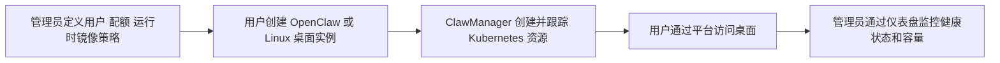
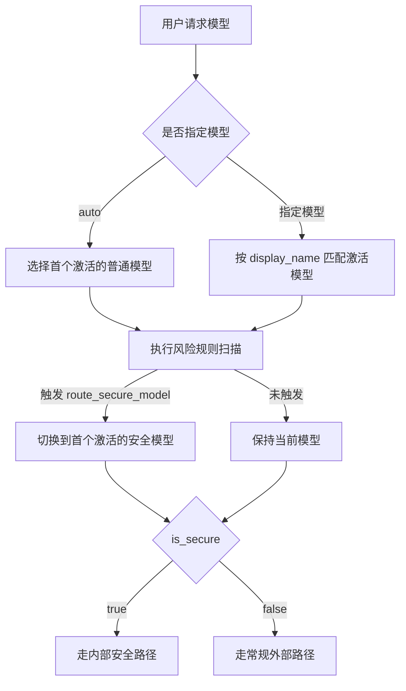

> 本文基于 ClawManager 上游 README.zh-CN 与 docs/aigateway.md 整理，校验时间为 2026-03-30。
>
> 目标读者：需要在 Kubernetes 中集中管理 OpenClaw 或 Linux 桌面运行时的运维工程师、平台工程师、技术负责人。
>
> 阅读收益：你会明确 ClawManager 能做什么、为什么值得用、如何快速部署、AI Gateway 到底解决了什么问题，以及上线后应该重点检查哪些环节。

## 1. 先用一句话理解 ClawManager

ClawManager 是一个面向团队和集群规模场景的 Kubernetes-first 控制平面，用来统一部署、运维并访问 OpenClaw 与 Linux 桌面运行时。

它并不是桌面运行时本身，而是围绕实例生命周期、配额、运行时镜像、访问代理和模型治理构建的一层管理平面。理解这一点很重要，因为它决定了 ClawManager 的真正价值不在“再造一个桌面”，而在“把原本分散、脆弱、难审计的桌面管理流程收拢为一套平台能力”。

## 2. 学习目标

读完本文后，你应该能够回答下面 6 个问题：

- ClawManager 与直接部署 OpenClaw 或 Webtop 相比，多出来的核心价值是什么？
- 它在 Kubernetes 中管理了哪些资源，哪些能力留给底层运行时本身？
- 团队为什么需要用户、配额、运行时镜像和访问代理的集中控制？
- AI Gateway 如何把模型访问从“直接调 Provider”升级为“可治理、可审计、可控成本”的平台入口？
- 初次部署完成后，应该按什么顺序验证平台是否可用？
- 如果要将它用于生产环境，哪些配置和运维习惯最值得优先建立？

## 3. 它适合什么场景

### 3.1 适合的典型场景

ClawManager 适合下面这类团队环境：

- 需要为多个用户创建桌面实例，而不是每个人各自手工部署。
- 希望集中管理 CPU、内存、存储、GPU 和实例数量配额。
- 希望将桌面服务保留在集群内部，而不是直接暴露 Pod 或 Service。
- 希望通过统一的浏览器入口提供桌面访问能力。
- 希望在 OpenClaw 场景中增加模型治理、审计追踪和成本核算。
- 希望同时支持管理员统一发放和用户自助创建实例。

### 3.2 不要对它期待错位

ClawManager 的官方定位非常明确：它是控制平面，不是通用虚拟化平台，也不是独立的模型网关产品。更准确的理解方式是：

- 如果你缺的是桌面运行时本身，ClawManager 不是替代品。
- 如果你缺的是团队级集中管理、统一访问和治理能力，ClawManager 才是问题的正解。
- 如果你的场景是单用户、单实例、短周期试用，直接部署运行时通常更轻。

## 4. 为什么团队会选择它

上游文档给出的价值点可以浓缩为 5 件事：

| 价值点 | 直接手工管理的典型问题 | ClawManager 的改进 |
| ------ | ------ | ------ |
| 用户与配额统一管理 | 用户多了以后，资源分配靠口头约束 | 用平台集中定义用户、角色和配额 |
| 运行时镜像统一治理 | 镜像版本散乱，环境不一致 | 管理后台统一维护运行时镜像卡片 |
| 生命周期集中控制 | 创建、停止、删除依赖人工排查 | 平台统一管理实例创建、启动、停止、重启、删除、查看和同步 |
| 安全桌面访问 | 直接暴露 Pod 或 Service，边界脆弱 | 通过平台认证后的代理链路访问桌面 |
| AI 模型治理 | 每个实例各自直连 Provider，缺少审计与成本视图 | 用 AI Gateway 提供统一入口、审计、成本与风险控制 |

其中最容易被低估的一点是“访问路径收口”。很多团队前期会把桌面服务直接暴露出去，短期看省事，长期会在权限、可追溯性和运维复杂度上付出更高成本。ClawManager 的平台代理模式，解决的就是这类隐性治理问题。

## 5. 核心能力总览

### 5.1 实例生命周期管理

ClawManager 支持的实例操作包括：创建、启动、停止、重启、删除、查看和同步。

这类能力的重要性不在于“按钮多”，而在于它把 Kubernetes 资源操作包装成了面向团队的业务动作。对普通用户来说，他们不需要直接理解 Pod、PVC、Service 之间的关系；对平台管理员来说，则可以把实例运维纳入统一流程。

### 5.2 支持的运行时类型

上游文档明确列出了 6 类运行时：

```yaml
runtime_types:
  - openclaw
  - webtop
  - ubuntu
  - debian
  - centos
  - custom
```

其中，`custom` 的意义很大。它说明 ClawManager 并没有把自己锁死在固定镜像集合上，而是保留了面向组织内部镜像规范的扩展空间。

### 5.3 运行时镜像卡片管理

官方文档特别强调，管理员可以在系统设置中查看或更新运行时镜像卡片。这一点非常关键，因为桌面平台真正难以长期维护的地方，往往不是“起得来”，而是“全员环境是否一致、镜像是否可控、更新是否可追溯”。

### 5.4 用户配额控制

ClawManager 支持的配额维度包括：

| 配额项 | 含义 |
| ------ | ------ |
| CPU | 用户可用的 CPU 额度 |
| 内存 | 用户可用的内存额度 |
| 存储 | 用户可用的存储额度 |
| GPU | 用户可用的 GPU 额度 |
| 实例数量 | 用户可创建的实例数上限 |

这套配额模型已经覆盖了大多数团队型桌面场景的核心约束。对平台负责人来说，这意味着资源分配终于可以从“临时沟通”升级为“平台策略”。

### 5.5 OpenClaw 的备份与迁移支持

README 还提到了一项很实用的能力：支持 OpenClaw 记忆与偏好设置的 Markdown 备份和迁移。这意味着 ClawManager 的价值不只体现在“把实例跑起来”，还体现在帮助团队保留用户上下文与使用连续性。

## 6. 架构与工作流

### 6.1 整体架构

上游文档给出的架构非常简洁，但足够表达系统边界：

```text
Browser
  -> ClawManager Frontend
  -> ClawManager Backend
  -> MySQL
  -> Kubernetes API
  -> Pod / PVC / Service
  -> OpenClaw / Webtop / Linux Desktop Runtime
```

把这张图翻译成工程语言，可以得到 3 个结论：

- 前端负责管理入口与用户操作承载。
- 后端一头连接 MySQL 持久化平台状态，一头连接 Kubernetes API 驱动实际资源。
- 桌面运行时被作为受管资源存在，而不是让用户直接操作底层集群对象。

### 6.2 产品工作流

官方产品流程可以概括成下面这条链路：



这个流程体现了 ClawManager 的真正定位：它把管理员关心的治理动作与用户关心的自助动作纳入了同一平台闭环。

### 6.3 为什么它坚持把访问留在平台里

官方配置说明有两条非常重要：

- 实例服务保留在 Kubernetes 集群内部网络。
- 桌面访问通过已认证的后端代理转发。

这意味着平台在设计上优先选择“统一入口 + 受控代理”，而不是“每个实例独立暴露”。从安全、审计和统一体验看，这是更适合团队管理的路线。

## 7. 快速部署

### 7.1 前置条件

开始之前，至少确保以下两件事成立：

- 你已经有一个可用的 Kubernetes 集群。
- `kubectl get nodes` 可以正常执行。

如果连这两点都没有满足，后续问题大概率不是 ClawManager 自身，而是底层集群或访问权限尚未就绪。

### 7.2 使用官方清单部署

官方推荐的起步方式很直接：

```bash
kubectl apply -f deployments/k8s/clawmanager.yaml
kubectl get pods -A
kubectl get svc -A
```

这三条命令不是机械步骤，而是一套最小验证路径：

- 第一条负责部署资源。
- 第二条确认核心 Pod 是否成功启动。
- 第三条确认服务是否已正确暴露到集群内部访问链路。

### 7.3 部署后先检查什么

建议你不要一部署完就急着登录页面，而是先做一轮平台可用性检查：

| 检查项 | 要确认什么 | 为什么重要 |
| ------ | ------ | ------ |
| Pod 状态 | 核心组件是否进入 Running 或 Ready | 这是最基础的系统健康信号 |
| Service 状态 | 平台服务是否创建成功 | 没有服务就没有后续访问链路 |
| 数据库连通性 | 后端是否能正常访问 MySQL | 后台状态与登录流程依赖持久化层 |
| Kubernetes API 访问 | 后端是否具备资源编排能力 | 无法编排就无法创建实例 |
| 浏览器访问路径 | 管理后台、Portal、桌面访问入口是否通 | 平台价值最终要落到可访问体验 |

## 8. 从源码构建

如果你不想直接使用官方 Kubernetes 清单，而是希望从源码构建，官方 README 给出了最直接的路径。

### 8.1 前端构建

```bash
cd frontend
npm install
npm run build
```

### 8.2 后端构建

```bash
cd backend
go mod tidy
go build -o bin/clawreef cmd/server/main.go
```

### 8.3 构建镜像

```bash
docker build -t clawmanager:latest .
```

这里有一个很值得注意的细节：前端、后端与整应用镜像构建路径都很清楚，说明项目并不是只能依赖预制产物，更适合团队按自己的 CI/CD 流程进行打包和交付。

## 9. 首次使用路径

### 9.1 默认账户

上游文档提供了默认账户信息：

| 场景 | 账户信息 |
| ------ | ------ |
| 默认管理员账户 | `admin / admin123` |
| 导入管理员用户默认密码 | `admin123` |
| 导入普通用户默认密码 | `user123` |

如果你把平台用于团队环境，第一件事不是“继续用默认密码”，而是尽快建立密码变更与访问控制流程。默认账户只适合启动验证，不适合作为长期配置。

### 9.2 官方建议的首次使用顺序

官方给出的首次使用路径是：

1. 使用管理员账户登录。
2. 创建或导入用户，并分配配额。
3. 在系统设置中查看或更新运行时镜像卡片。
4. 使用普通用户登录并创建实例。
5. 通过 Portal View 或 Desktop Access 访问桌面。

这套顺序本身就体现了产品设计理念：先建治理边界，再开放实例创建，最后才进入终端使用体验。

### 9.3 CSV 批量导入模板

如果你需要批量导入用户，可以使用官方给出的模板：

```csv
Username,Email,Role,Max Instances,Max CPU Cores,Max Memory (GB),Max Storage (GB),Max GPU Count (optional)
john,john@example.com,user,2,4,8,100,0
```

需要注意的是：

- `Email` 是可选项。
- `Max GPU Count (optional)` 是可选项。
- 其余列都是必填项。

对团队导入场景来说，这种设计已经足够实用，因为它把用户身份、角色和资源策略放进了同一份结构化输入。

## 10. AI Gateway：这套平台最有技术含量的部分

如果说 ClawManager 解决的是“桌面集中管理”，那么 AI Gateway 解决的就是“模型访问治理”。这也是它相对普通桌面平台最有差异化的部分。

### 10.1 AI Gateway 的一句话定义

AI Gateway 是 ClawManager 中负责模型访问治理的控制平面。它为 OpenClaw 实例提供统一的 OpenAI 兼容入口，并在上游 Provider 之上增加策略、审计和成本控制。

这句话的重点不在“兼容 OpenAI API”，而在“兼容只是入口，治理才是核心增量”。

### 10.2 它具体管哪些事

#### 模型管理

- 通过统一入口和路由屏蔽上游 Provider 差异。
- 支持 Provider 接入、发现和集中端点配置。
- 支持普通模型与安全模型的分层治理。
- 支持按模型配置激活状态、端点、凭据引用和价格策略。

#### 审计与追踪

- 用 `trace_id`、session ID 和 request ID 形成全链路关联。
- 持久化记录请求与响应，包括流式 SSE 响应。
- 记录风险命中、路由决策和最终调用状态。
- 支持按用户、模型、实例、时间窗口或 trace ID 检索。

#### 成本核算

- 记录 prompt、completion 与 total token。
- 在可用时支持 reasoning token 与 cached token 分类。
- 支持按模型配置输入、输出价格与币种。
- 支持对外部模型进行估算成本，对安全模型进行内部成本分摊。
- 支持从用户、实例、模型、会话等维度分析成本。

#### 风险控制

- 内置隐私、企业敏感数据、金融、安全合规等规则场景。
- 支持基于正则和自定义规则进行扩展。
- 支持 `block` 与 `route_secure_model` 等自动动作。
- 治理决策会被透明记录到审计链路中。
- 管理台支持规则测试与命中预览。

### 10.3 路由逻辑要点

AI Gateway 的路由逻辑并不是优先看 Provider 类型，而是优先看 `is_secure` 标记。这是理解其治理行为的关键。

官方文档描述的核心逻辑如下：

1. 如果请求使用 `model: "auto"`，网关会选择第一个处于激活状态且 `is_secure=false` 的模型。
2. 如果请求明确指定模型名，网关会按 `display_name` 匹配激活模型。
3. 网关会在转发前用已配置的风险规则扫描全部消息。
4. 如果风险评估触发 `route_secure_model`，请求会切换到第一个激活的安全模型。
5. 最终路由由 `is_secure` 决定：`true` 走内部安全路径，`false` 走常规外部路径。

这个设计很有代表性：平台没有把“安全”理解成某个单独 Provider，而是把它抽象成一层与路由决策直接耦合的治理属性。

### 10.4 AI Gateway 工作流



## 11. 配置与运维要点

### 11.1 官方明确提到的后端环境变量

README 中列出的常用后端环境变量如下：

| 变量 | 用途 |
| ------ | ------ |
| `SERVER_ADDRESS` | 服务监听地址 |
| `SERVER_MODE` | 服务运行模式 |
| `DB_HOST` | 数据库主机 |
| `DB_PORT` | 数据库端口 |
| `DB_USER` | 数据库用户 |
| `DB_PASSWORD` | 数据库密码 |
| `DB_NAME` | 数据库名 |
| `JWT_SECRET` | 平台认证所需密钥 |

这组变量本身已经说明了平台的最小运行依赖：Web 服务、数据库与认证密钥。对生产环境来说，`DB_PASSWORD` 与 `JWT_SECRET` 不应该以明文硬编码方式管理，而应该进入受控的密钥分发机制。

### 11.2 生产环境最值得优先做的 5 件事

下面这 5 项并不是官方“唯一正确答案”，但它们是从平台设计逻辑推导出的高优先级运维动作：

1. 第一时间替换默认密码，避免验证环境配置直接流入生产。
2. 把数据库与密钥管理纳入正式运维体系，而不是依赖手工配置。
3. 为运行时镜像建立版本管理和变更记录，避免用户环境漂移。
4. 把用户配额策略前置到平台层，而不是等资源打满后再补救。
5. 把 AI Gateway 的审计、成本和风险规则一起启用，避免模型治理只做一半。

## 12. 故障排查思路

顶级文档不能只教“怎么部署”，还要教“出问题时先看哪里”。下面这张表给出的是与官方部署路径一致的最小排查顺序。

| 现象 | 第一检查点 | 建议动作 |
| ------ | ------ | ------ |
| 部署后页面无法访问 | Service 与访问路径 | 先执行 `kubectl get svc -A`，确认服务是否存在 |
| 实例创建失败 | 后端与 Kubernetes API 连接 | 检查后端日志与集群访问权限 |
| 登录后状态异常 | 后端与 MySQL 连接 | 优先排查数据库配置和连通性 |
| 桌面无法打开 | 平台代理链路 | 确认后端代理是否正常、实例资源是否已就绪 |
| AI 调用结果异常 | AI Gateway 路由与风险规则 | 检查是否命中审计记录、路由切换或风险动作 |

如果你只记一个原则，请记住这句：先验证平台控制面是否健康，再验证实例层是否健康，最后再看用户访问层。这样排查效率通常最高。

## 13. 动手练习

为了确保你不是“看懂了”，而是真的“会用了”，建议按下面的顺序做 3 个练习：

### 13.1 练习 1：完成一次最小部署验证

目标：确认平台基础链路打通。

验收标准：

- 能成功执行官方清单部署。
- 能看到核心 Pod 与 Service。
- 能用默认管理员账户登录。

### 13.2 练习 2：完成一次用户导入与实例创建

目标：确认治理路径和自助路径都成立。

验收标准：

- 能通过 CSV 导入至少一个普通用户。
- 能为用户设置实例数和资源配额。
- 能以普通用户身份创建并访问桌面实例。

### 13.3 练习 3：完成一次 AI Gateway 治理验证

目标：确认模型访问不是“可调用”而已，而是“可治理”。

验收标准：

- 能区分普通模型与安全模型。
- 能观察到一次审计记录。
- 能验证至少一个风险动作，例如 `block` 或 `route_secure_model`。

## 14. 自测清单

如果下面 8 个问题你都能回答清楚，说明这篇文章对你已经产生了实际价值：

- ClawManager 和桌面运行时本身的职责边界分别是什么？
- 为什么团队场景更适合通过平台代理访问桌面，而不是直接暴露 Pod？
- 运行时镜像卡片管理解决了什么长期问题？
- 用户配额控制为什么应该放在平台层统一做？
- AI Gateway 相比直接调用模型 Provider，多出来的治理价值有哪些？
- `model: "auto"` 与 `route_secure_model` 在路由决策里分别扮演什么角色？
- 初次部署完成后，应该先验证哪几层链路？
- 把默认密码直接留在团队环境里，风险在哪里？

## 15. 总结

ClawManager 的核心价值，不是把 OpenClaw 或 Linux 桌面单独跑在 Kubernetes 上，而是把“实例管理、用户治理、访问代理、模型治理、审计追踪和成本分析”收敛为一个平台化控制面。

如果你的需求只是快速起一个桌面实例，那么它可能显得偏重；但如果你的目标是把多用户桌面运行时真正纳入团队级治理体系，ClawManager 的设计就很有针对性，尤其是 AI Gateway 这部分，已经明显超出了普通桌面管理工具的范畴。

## 16. 参考资料

- GitHub 仓库：[ClawManager](https://github.com/Yuan-lab-LLM/ClawManager)
- 中文 README：[README.zh-CN.md](https://github.com/Yuan-lab-LLM/ClawManager/blob/main/README.zh-CN.md)
- AI Gateway 文档：[docs/aigateway.md](https://github.com/Yuan-lab-LLM/ClawManager/blob/main/docs/aigateway.md)
