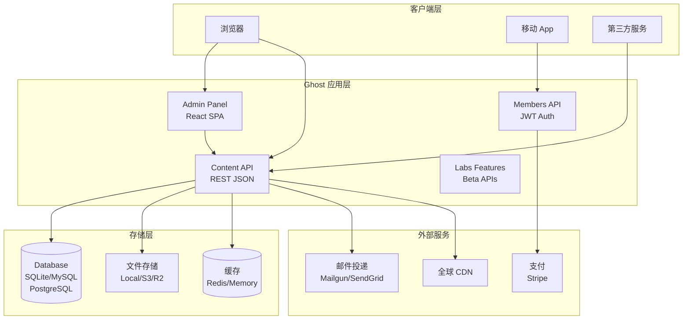
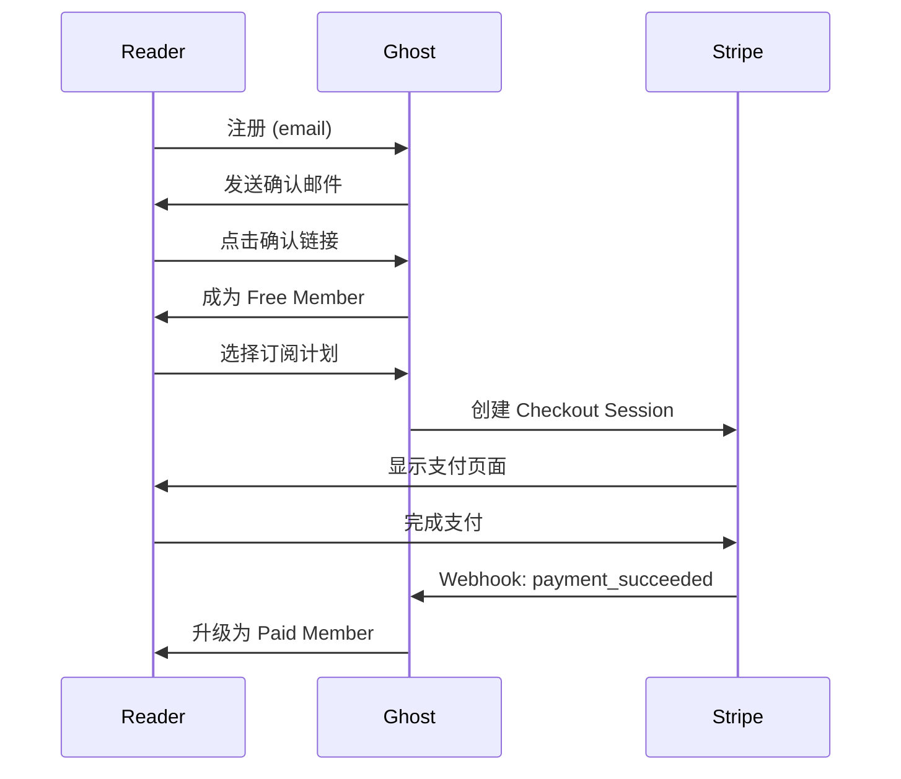

# Ghost：开源 Headless CMS 专家级技术文档

> **目标读者**：想要掌握 Ghost CMS 的开发者，内容创作者和技术决策者
> **核心问题**：Ghost 是什么？如何设计架构？如何定制和扩展？

---

## 1. 学习目标

完成本文档后，你将掌握：

- ✅ 理解 Ghost 作为 Headless CMS 的核心定位与适用场景
- ✅ 掌握 Ghost 的技术架构（Node.js + Handlebars + Content API）
- ✅ 能够独立完成本地开发环境搭建和生产环境部署
- ✅ 学会创建自定义主题和使用 Content API 进行二次开发
- ✅ 了解 Ghost 与 WordPress、Strapi 等竞品的核心差异
- ✅ 掌握 Ghost 的扩展机制（Custom Integrations、Members API）

---

## 2. 原理分析

### 2.1 什么是 Ghost？

**Ghost** 是一个专注于专业出版的 **Headless CMS**（无头内容管理系统）。与传统的 WordPress 等 monolithic CMS（单体 CMS）不同，Ghost 采用 **Headless 架构**，将内容管理（后端）与内容展示（前端）完全解耦。

> 💡 **类比理解**：把 Ghost 想象成一个「专业出版社的编辑系统」——编辑在后台撰写、排版文章，而最终的书籍封面、装帧由专门的平面设计师决定（前端）。两者通过「出版合同」（API）进行通信。

### 2.2 Ghost 的核心定位

| 维度 | Ghost | WordPress | Strapi | Contentful |
|------|-------|-----------|--------|------------|
| **架构** | Headless | Monolithic | Headless | Headless |
| **核心场景** | 专业出版/订阅/会员 | 通用建站 | API-first | 企业内容平台 |
| **内置会员系统** | ✅ 原生支持 | ❌ 需插件 | ❌ 需插件 | ❌ 额外付费 |
| **内置订阅系统** | ✅ 原生支持 | ❌ 需插件 | ❌ 需插件 | ❌ 额外付费 |
| **原生邮件 newsletters** | ✅ 内置 | ❌ 需插件 | ❌ 需插件 | ❌ 外部集成 |
| **技术栈** | Node.js | PHP | Node.js | 商业 SaaS |
| **许可证** | MIT | GPL v2 | MIT | 商业 |

### 2.3 为什么选择 Ghost？

**Ghost 解决的核心问题**：

1. **专业出版需求**：作家、记者、newsletters 作者需要一个不被复杂插件生态拖累的干净平台
2. **会员订阅 monetization**：内容创作者可以直接在 Ghost 后台设置会员等级、订阅价格，无需 Stripe/PayPal 集成
3. **邮件 newsletters**：Ghost 内置邮件投递服务（通过 Mailgun/SendGrid），告别第三方 newsletters 工具
4. **性能优先**：Ghost 核心代码精简，没有 WordPress 那样沉重的插件生态，加载速度天然更快

**Ghost 的设计哲学**：

> "Fiercely independent, professional publishing" — 强烈追求独立性，专业出版

Ghost 团队坚持开源精神，核心代码完全透明，不依赖大型平台，确保你的内容永远属于你自己。

### 2.4 Ghost 的技术边界

| 能力 | Ghost 支持 | Ghost 不支持 |
|------|-----------|-------------|
| 多语言/国际化 | ❌ 内置不支持，需主题实现 | i18n 插件 |
| 复杂权限工作流 | ✅ 角色系统（Owner/Editor/Author/Contributor） | 细粒度自定义角色 |
| 静态站点生成 | ❌ 动态渲染 | Hugo/Jekyll |
| 可视化页面构建 | ❌ 通过 Handlebars 模板 | Elementor/Divi |
| 数据库直接访问 | ✅ SQLite/MySQL/PostgreSQL | 建议通过 API |

---

## 3. 架构分析

### 3.1 整体架构

Ghost 采用经典的 **三层架构**：



### 3.2 核心技术栈

| 组件 | 技术选型 | 说明 |
|------|---------|------|
| **运行时** | Node.js | 异步 I/O，适合 I/O 密集型 CMS |
| **语言** | JavaScript + TypeScript | 61.5% JS + 29.1% TS |
| **Web 框架** | Express.js | Ghost 核心基于 Express |
| **数据库** | SQLite / MySQL / PostgreSQL | 通过 Bookshelf.js ORM |
| **模板引擎** | Handlebars | 前端主题模板，.hbs 文件 |
| **任务队列** | Bull | 基于 Redis 的后台任务队列 |
| **缓存** | Redis / Memory | 页面缓存、API 缓存 |
| **搜索** | SQLite FTS / Elasticsearch | 内置全文搜索 |

### 3.3 目录结构

```
TryGhost/Ghost/
├── .claude/              # Claude Agent 技能定义
│   └── skills/
├── .github/              # GitHub Actions CI/CD
├── .vscode/              # VSCode 配置
├── apps/                 # 子应用
│   └── admin-app/        # Ghost Admin 管理面板 (React)
├── ghost/                # Ghost 核心应用
│   └── src/
│       ├── core/         # 核心服务器
│       ├── models/       # 数据模型 (Bookshelf.js)
│       ├── services/     # 业务服务层
│       ├── api/          # REST API 端点
│       └── lib/          # 工具库
├── docker/               # Docker 相关配置
├── docs/                  # 项目文档
├── e2e/                   # 端到端测试
└── compose.dev.*.yaml  # Docker Compose 开发环境
```

### 3.4 数据模型

Ghost 的核心数据模型：

```mermaid
erDiagram
    Post ||--o{ PostTag : "has"
    Post ||--o{ PostAuthor : "written_by"
    Post ||--o{ PostMember : "accessible_to"
    Post ||--|| PostMeta : "has"
    Author ||--o{ PostAuthor : "writes"
    Tag ||--o{ PostTag : "tagged_to"
    Member ||--o{ PostMember : "subscribes"
    Member ||--|| Member-StripeCustomer : "has"
    Member ||--o{ EmailRecipient : "receives"
    Tier ||--o{ PostMember : "required_for"

    Post {
        uuid id PK
        string title
        text html
        text plaintext
        string slug
        string feature_image
        datetime published_at
        enum status draft|published|scheduled|internal
    }
    
    Author {
        uuid id PK
        string name
        string email
        string bio
        string profile_image
    }
    
    Tag {
        uuid id PK
        string name
        string slug
        string description
        string meta_title
    }
    
    Member {
        uuid id PK
        string email
        string name
        string stripe_customer_id
        datetime subscribed_at
        enum status free|paid|comped
    }
    
    Tier {
        uuid id PK
        string name
        string slug
        decimal price
        int duration
        enum type monthly|yearly|free
    }
```

### 3.5 API 架构

Ghost 提供两套主要 API：

| API | 认证方式 | 用途 |
|-----|---------|------|
| **Content API** | Public Key（只读） | 公开内容，前端主题使用 |
| **Admin API** | Admin API Key / JWT（读写） | 管理操作，第三方集成 |

**Content API 端点示例**：

```bash
# 获取最新文章
curl -X GET https://demo.ghost.io/ghost/api/content/posts/?key=YOUR_PUBLIC_KEY

# 响应
{
  "posts": [
    {
      "id": "5f7d8c9e...",
      "uuid": "...",
      "title": "Getting Started with Ghost",
      "html": "<p>...</p>",
      "slug": "getting-started",
      "published_at": "2026-03-30T00:00:00.000Z",
      "primary_author": { "name": "John", "slug": "john" },
      "tags": [{ "name": "Tutorial", "slug": "tutorial" }]
    }
  ],
  "meta": {
    "pagination": {
      "page": 1,
      "limit": 10,
      "total": 42
    }
  }
}
```

---

## 4. 功能详解

### 4.1 内容管理

**文章编辑器（Editor）**：

Ghost 使用基于 **Mobiledoc**（一种轻量级富文本格式）的富文本编辑器，支持：
- 实时预览
- Markdown 快捷键
- 内联图片/视频/文件嵌入
- 代码高亮（通过 Prism.js）
- 可嵌入第三方内容（YouTube、Twitter、Spotify 等）

**自定义内容类型（Custom Content）**：

Ghost v4+ 支持通过「Tiers」创建自定义会员等级：

```javascript
// 创建一个付费会员等级
const tier = await ghost.api.v2.tiers.add({
  name: 'Premium Monthly',
  slug: 'premium-monthly',
  type: 'paid',
  price: 9.00,
  currency: 'USD',
  interval: 'month',
  status: 'active'
});
```

### 4.2 会员与订阅系统

**Member（会员）** 是 Ghost 的核心概念之一：

| 功能 | 说明 |
|------|------|
| **免费会员** | 提供邮箱即可订阅 |
| **付费订阅** | 连接 Stripe，支持月付/年付 |
| **Comp'd 订阅** | 免费赠送的付费会员 |
| **邮件列表** | 免费/付费会员自动分组 |

**订阅流程**：



### 4.3 邮件 newsletters

Ghost 内置 **email newsletters** 功能：

| 功能 | 说明 |
|------|------|
| **自动发送** | 文章发布/定时发送时自动触发 |
| **手动发送** | 自定义邮件内容发送给指定会员组 |
| **邮件模板** | Handlebars 模板，完全可定制 |
| **投递服务** | Mailgun / SendGrid / Amazon SES |
| **追踪** | 开启/点击率统计 |

### 4.4 主题系统

Ghost 使用 **Handlebars** 作为主题模板引擎：

```
casper/                    # Ghost 默认主题
├── package.json
├── index.hbs              # 首页模板
├── post.hbs              # 文章页模板
├── page.hbs              # 页面模板
├── tag.hbs               # 标签页模板
├── author.hbs             # 作者页模板
├── default.hbs            # 基础布局
├── partials/              # 可复用组件
│   ├── header.hbs
│   ├── footer.hbs
│   ├── post-card.hbs
│   └── comments.hbs
└── assets/
    ├── css/
    ├── js/
    └── fonts/
```

**Hello World 主题示例**：

```handlebars
{{!< default}}
{{#post}}
<article class="post">
  <header class="post-header">
    <h1 class="post-title">{{title}}</h1>
    <time class="post-date">{{date published_at format="YYYY-MM-DD"}}</time>
  </header>
  
  <div class="post-content">
    {{content}}
  </div>
  
  <footer class="post-footer">
    {{#if @member}}
      <p>欢迎，{{@member.name}}！</p>
    {{else}}
      <a href="/#/portal/subscribe">订阅获取更多内容</a>
    {{/if}}
  </footer>
</article>
{{/post}}
```

### 4.5 Labs Features（实验性功能）

Ghost 在后台提供 **Labs** 页面，开启实验性功能：

| 功能 | 状态 | 说明 |
|------|------|------|
| **Public API** | ✅ 稳定 | 完整的 REST Content API |
| **Member Attributions** | 🟡 Beta | 追踪会员转化来源 |
| **Email Customization** | 🟡 Beta | 自定义邮件模板 |
| **Collections** | 🟡 Beta | 自定义内容集合 |
| **Tiers** | ✅ 稳定 | 会员等级系统 |

---

## 5. 使用说明

### 5.1 环境准备

**前置要求**：

| 依赖 | 版本要求 | 说明 |
|------|---------|------|
| Node.js | ≥18.x | 推荐 LTS 版本 |
| npm | ≥9.x | 或使用 Yarn |
| SQLite | 默认内置 | 可选 MySQL/PostgreSQL |
| Docker | ≥20.x | 推荐用于生产环境 |

### 5.2 本地开发环境

**方式一：使用 Ghost CLI（推荐）**：

```bash
# 1. 全局安装 Ghost CLI
npm install ghost-cli -g

# 2. 创建本地开发实例
ghost install local

# 3. 启动开发服务器
ghost start

# 4. 访问管理后台
# http://localhost:2368/ghost
```

**方式二：使用 Docker Compose**：

```bash
# 克隆代码仓库
git clone https://github.com/TryGhost/Ghost.git
cd Ghost

# 启动开发环境
docker compose -f compose.dev.yaml up

# 访问 http://localhost:2368
```

**方式三：手动源码运行**：

```bash
# 1. 克隆代码仓库
git clone https://github.com/TryGhost/Ghost.git
cd Ghost

# 2. 安装依赖
npm install

# 3. 配置环境变量
cp .env.example .env
# 编辑 .env 设置数据库连接等

# 4. 运行数据库迁移
npm run db:migrate

# 5. 启动开发服务器
npm run dev
```

### 5.3 生产环境部署

**方式一：Ghost(Pro) 托管服务**：

最简单的方式，由 Ghost 官方提供托管服务：
- 全球 CDN 加速
- 自动 SSL 证书
- 每日自动备份
- 24/7 监控

```bash
# 安装并部署到 Ghost(Pro)
npm install ghost-cli -g
ghost install --pro
```

**方式二：Docker 部署**：

```yaml
# docker-compose.yaml
version: '3.8'
services:
  ghost:
    image: ghost:6
    container_name: ghost-blog
    restart: unless-stopped
    ports:
      - "2368:2368"
    environment:
      url: https://your-domain.com
      database__client: mysql
      database__connection__host: mysql
      database__connection__user: ghost
      database__connection__password: ${DB_PASSWORD}
      database__connection__database: ghost
      mail__transport: SMTP
      mail__options__service: SendGrid
      mail__options__auth__user: apikey
      mail__options__auth__pass: ${SENDGRID_API_KEY}
    volumes:
      - ghost-content:/var/lib/ghost/content
    depends_on:
      - mysql

  mysql:
    image: mysql:8
    restart: unless-stopped
    environment:
      MYSQL_ROOT_PASSWORD: ${DB_PASSWORD}
      MYSQL_DATABASE: ghost
      MYSQL_USER: ghost
      MYSQL_PASSWORD: ${DB_PASSWORD}
    volumes:
      - mysql-data:/var/lib/mysql

volumes:
  ghost-content:
  mysql-data:
```

```bash
# 启动生产环境
docker compose up -d
```

**方式三：手动 Ubuntu 服务器部署**：

```bash
# 1. 安装 Node.js 18.x
curl -fsSL https://deb.nodesource.com/setup_18.x | sudo -E bash -
sudo apt-get install -y nodejs

# 2. 安装 Nginx
sudo apt-get install -y nginx

# 3. 安装 MySQL
sudo apt-get install -y mysql-server

# 4. 创建 MySQL 数据库
mysql -u root -p
CREATE DATABASE ghost;
CREATE USER 'ghost'@'localhost' IDENTIFIED BY 'your_password';
GRANT ALL PRIVILEGES ON ghost.* TO 'ghost'@'localhost';
FLUSH PRIVILEGES;
EXIT;

# 5. 安装 Ghost CLI
npm install ghost-cli -g

# 6. 安装 Ghost
sudo mkdir -p /var/www/ghost
sudo chown $USER:$USER /var/www/ghost
ghost install --dbhost localhost --dbuser ghost --dbpass your_password
```

### 5.4 主题安装与定制

**安装主题**：

```bash
# 通过 Ghost CLI 上传主题
ghost theme install ./my-custom-theme.zip

# 或者直接复制到 content/themes 目录
cp -r ./my-theme /var/lib/ghost/content/themes/
```

**开发自定义主题**：

```bash
# 1. 创建主题目录
mkdir -p content/themes/my-theme
cd content/themes/my-theme

# 2. 初始化主题
npm init -y
npm install ghost-cli

# 3. 链接到当前 Ghost 实例进行实时预览
ghost theme watch

# 4. 激活主题
ghost theme activate my-theme
```

### 5.5 API 集成

**使用 Content API 获取公开内容**：

```javascript
// 使用 Ghost SDK
const GhostContentAPI = require('@tryghost/content-api');

const api = new GhostContentAPI({
  url: 'https://demo.ghost.io',
  key: 'YOUR_PUBLIC_API_KEY',
  version: 'v6'
});

// 获取最新 5 篇文章
const posts = await api.posts.browse({
  limit: 5,
  include: ['author', 'tags']
});

posts.forEach(post => {
  console.log(`Title: ${post.title}`);
  console.log(`Author: ${post.primary_author.name}`);
});
```

**使用 Admin API 管理内容**：

```javascript
const GhostAdminAPI = require('@tryghost/admin-api');

const api = new GhostAdminAPI({
  url: 'https://my-ghost-site.com',
  key: 'YOUR_ADMIN_API_KEY'
});

// 创建新文章
const newPost = await api.posts.add({
  title: 'My New Article',
  html: '<p>This is the article content.</p>',
  status: 'draft',
  tags: ['tutorial', 'ghost']
});

console.log(`Created post with ID: ${newPost.id}`);
```

---

## 6. 开发扩展

### 6.1 自定义 Integration

Ghost 支持通过 **Custom Integrations** 扩展功能：

```javascript
// 在 Ghost Admin 中创建 Integration 后获取 API Key
const apiKey = 'YOUR_ADMIN_API_KEY:YOUR_ADMIN_API_SECRET';

// 使用 Integration API
const response = await fetch('https://my-ghost-site.com/ghost/api/admin/posts/', {
  headers: {
    'Authorization': `Ghost ${apiKey}`,
    'Content-Type': 'application/json'
  }
});
```

### 6.2 Webhook 机制

Ghost 支持触发 Webhook 通知外部服务：

| Webhook 事件 | 触发时机 |
|-------------|----------|
| `post.published` | 文章发布 |
| `post.unpublished` | 文章取消发布 |
| `post.scheduled` | 文章定时发布 |
| `member.added` | 新会员注册 |
| `member.paid` | 会员付费成功 |
| `subscriber.added` | 新订阅者 |

**配置 Webhook**：

```
Ghost Admin → Settings → Labs → Webhooks → Add Webhook
```

```json
// Webhook payload 示例 (post.published)
{
  "post": {
    "id": "5f7d8c9e...",
    "title": "New Article Published",
    "url": "https://my-site.com/new-article/",
    "published_at": "2026-03-30T10:00:00.000Z"
  },
  "member": null
}
```

### 6.3 插件开发（Custom Integrations）

创建一个 Slack 通知插件示例：

```javascript
// /custom-integrations/slack-notify/index.js
module.exports = {
  name: 'Slack Notifications',
  hooks: {
    'post.published': async (post, member, context) => {
      const webhookUrl = process.env.SLACK_WEBHOOK_URL;
      
      if (!webhookUrl) {
        console.warn('SLACK_WEBHOOK_URL not configured');
        return;
      }
      
      await fetch(webhookUrl, {
        method: 'POST',
        headers: { 'Content-Type': 'application/json' },
        body: JSON.stringify({
          text: `📝 New post published: "${post.title}"`,
          blocks: [
            {
              type: 'section',
              text: {
                type: 'mrkdwn',
                text: `*New article published*\n<${post.url}|${post.title}>`
              }
            }
          ]
        })
      });
    }
  }
};
```

### 6.4 数据库迁移

Ghost 使用 **Knex.js** 进行数据库迁移：

```bash
# 创建新的迁移文件
npx knex migrate:make add_custom_field_to_posts

# 编辑迁移文件
# ghost/core/server/data/migrations/versions/6.0/2026-03-30-add-custom-field.js
exports.up = async (knex) => {
  await knex.schema.alterTable('posts', (table) => {
    table.string('custom_subtitle', 255).nullable();
  });
};

exports.down = async (knex) => {
  await knex.schema.alterTable('posts', (table) => {
    table.dropColumn('custom_subtitle');
  });
};

# 运行迁移
npx knex migrate:latest
```

---

## 7. 最佳实践

### 7.1 性能优化

| 优化项 | 建议 | 实现方式 |
|--------|------|----------|
| **页面缓存** | 启用 Ghost 内置缓存 | `CACHE_CONTENT: true` |
| **静态资源 CDN** | 将图片等静态资源托管到 CDN | S3 + CloudFront |
| **数据库连接池** | 生产环境使用连接池 | `database__connection__pool: true` |
| **图片优化** | 使用 WebP 格式 + 懒加载 | Ghost 自动处理 |

### 7.2 安全配置

```bash
# .env 安全配置示例
NODE_ENV=production
url=https://your-ghost-site.com

# 数据库安全
database__client=mysql
database__connection__password=STRONG_RANDOM_PASSWORD

# 会话安全
SESSION_SECRET=STRONG_RANDOM_SECRET
Cookie__secure=true
Cookie__httpOnly=true

# API 安全
API_KEY=STRONG_ADMIN_API_KEY
```

**安全检查清单**：

- [ ] 启用 HTTPS（Let's Encrypt 或商业证书）
- [ ] 设置 `NODE_ENV=production`
- [ ] 使用强密码和安全的数据库凭据
- [ ] 限制 Ghost Admin 访问 IP（通过 Nginx）
- [ ] 定期更新 Ghost 到最新版本

### 7.3 备份策略

```bash
# 备份数据库
mysqldump -u ghost -p ghost > ghost_backup_$(date +%Y%m%d).sql

# 备份上传的文件
tar -czf ghost_content_$(date +%Y%m%d).tar.gz /var/lib/ghost/content/

# 备份完整配置
cp -r /var/www/ghost/config.production.json ./backup/
```

**推荐备份频率**：

| 备份类型 | 频率 | 保留时间 |
|---------|------|----------|
| 数据库 | 每日增量 | 30 天 |
| 文件（uploads） | 每周完整 | 90 天 |
| 配置 | 每次变更后 | 永久 |

---

## 8. 常见问题

### Q1: Ghost 和 WordPress 如何选择？

| 场景 | 推荐 | 原因 |
|------|------|------|
| 专业 newsletters / 会员订阅 | **Ghost** | 原生支持，开箱即用 |
| 复杂插件生态需求 | **WordPress** | 5万+ 插件生态 |
| Headless + API-first | **Ghost** 或 Strapi | Ghost 适合出版，Strapi 更灵活 |
| 企业内部 CMS | **WordPress** | 插件丰富，文档完善 |
| 简单博客 | **两者皆可** | 取决于团队技术栈偏好 |

### Q2: 如何迁移 WordPress 到 Ghost？

```bash
# 1. 在 WordPress 安装 Ghost Export 插件
# 2. 导出 Ghost 格式的 JSON 文件

# 3. 使用 Ghost CLI 导入
ghost import ./ghost-export.json
```

### Q3: Ghost 能否使用自定义域名？

✅ 可以。每个 Ghost 实例绑定一个域名。如需多域名，可使用 Ghost(Pro) 的多站点功能或自行搭建 Nginx 反向代理。

### Q4: 如何禁用 Ghost 的会员功能？

在 `Settings → Labs → Members` 中可以完全禁用会员系统，网站将变为纯内容展示模式。

### Q5: Ghost 支持多语言吗？

Ghost **不内置**多语言支持，但可以通过以下方式实现：
1. 使用 `localization` 主题助手 + 手动翻译 JSON 文件
2. 使用第三方 i18n 服务（Phrase / Lokalise）
3. 为每种语言创建独立 Ghost 实例，通过 Nginx 路由分发

---

## 9. 总结

### 核心要点

1. **Ghost = Headless CMS + 专业出版 + 会员变现**：三位一体，无需插件
2. **API-first 架构**：Content API + Admin API，支持任意前端
3. **原生会员系统**：免费/付费会员、订阅、email newsletters 全内置
4. **Handlebars 主题**：简单模板语言，完全掌控前端展示
5. **MIT 许可证**：完全开源，社区驱动

### 资源链接

| 资源 | 链接 |
|------|------|
| **官方网站** | https://ghost.org |
| **GitHub 仓库** | https://github.com/TryGhost/Ghost |
| **官方文档** | https://ghost.org/docs/ |
| **主题市场** | https://ghost.org/marketplace/ |
| **开发者论坛** | https://forum.ghost.org/ |
| **API 文档** | https://ghost.org/docs/content-api/ |

---

*文档信息：Ghost v6.24.0 | 更新日期：2026-03-30 | 难度：⭐⭐⭐⭐*
