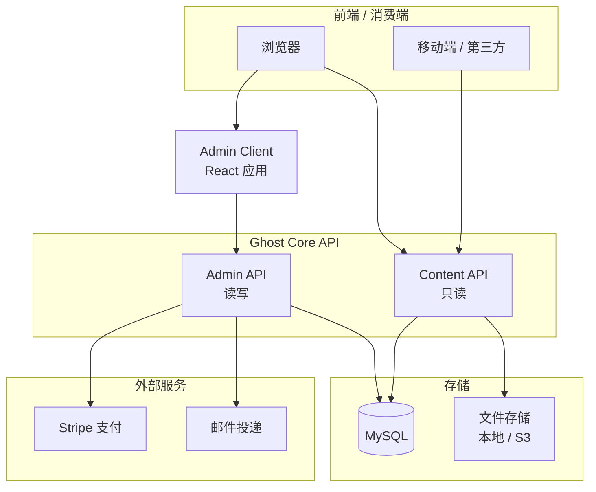
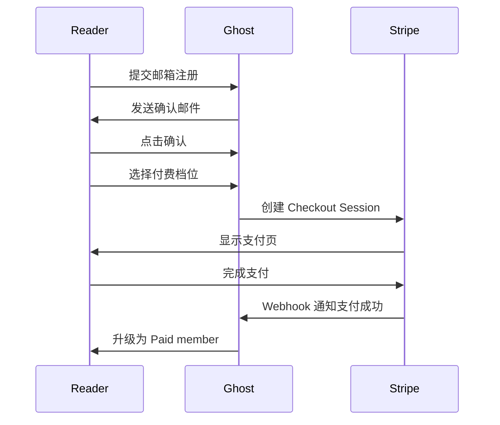

# Ghost：开源 Headless CMS 技术指南

Ghost 是一个把内容管理、邮件群发和会员订阅做进同一个产品的开源平台，代码基于 Node.js，以 MIT 许可证发布。它常被拿来和 WordPress 或 Substack 比较，但定位不同：它既不靠插件生态堆能力，也不锁死在第三方托管上，而是把"发布 + 邮件 + 变现"这段最常用的链路做扎实，剩下来的交给 API 和主题。

---

## 一、设计思路

### 1.1 Ghost 是什么

Ghost 本质上是一个自带管理后台和主题渲染层的 **RESTful JSON API**。内容存在数据库里，通过两套公开 API 对外提供：

| API | 用途 | 认证 |
|-----|------|------|
| Content API | 读取已发布内容，供前端 / App 使用 | 只读，公开 Key |
| Admin API | 创建、更新、删除内容与数据 | 读写，Admin Key / 会话 |

前端可以完全用 Ghost 自带的手写主题渲染，也可以把它彻底当"无头"：只要内容，自己用 React、Vue 或任何静态站点生成器渲染。

### 1.2 和 WordPress 的区别

| 维度 | Ghost | WordPress |
|------|-------|-----------|
| 定位 | 专业出版、订阅、会员 | 通用建站 |
| 会员与订阅 | 内置（连接 Stripe） | 需插件 |
| 邮件 newsletters | 内置 | 需插件 |
| 插件生态 | 弱，扩展靠 API / Webhook | 强，数万插件 |
| 数据库 | MySQL 8 | MySQL 等 |
| 许可证 | MIT | GPL v2 |

## 二、核心架构

### 2.1 三层结构

官方把整个系统拆成三层，对应三个清晰的分工：

- **Core JSON API**：内容的读写后端，负责存取、权限、Webhook。
- **Admin Client**：一个单独的前端应用，给编辑和运营用，写作、配邮件、看数据都在这里。
- **Front-end 主题层**：用 Handlebars 渲染的页面模板，决定读者看到的样子。


```mermaid
graph TD
    subgraph Client["前端 / 消费端"]
        Browser[浏览器]
        App[移动端 / 第三方]
    end

    subgraph Core["Ghost Core API"]
        ContentAPI[Content API<br/>只读]
        AdminAPI[Admin API<br/>读写]
    end

    subgraph Storage["存储"]
        DB[(MySQL)]
        Files[文件存储<br/>本地 / S3]
    end

    subgraph Services["外部服务"]
        Stripe[Stripe 支付]
        Mail[邮件投递]
    end

    Browser --> AdminClient[Admin Client<br/>React 应用]
    AdminClient --> AdminAPI
    Browser --> ContentAPI
    App --> ContentAPI
    AdminAPI --> DB
    ContentAPI --> DB
    ContentAPI --> Files
    AdminAPI --> Stripe
    AdminAPI --> Mail
```

`core` 和 `content` 是仓库里两个顶层目录，也对应部署时的两条线：`core` 是不能改的代码，`content` 是用户可以加东西的地方（主题、图片、自定义设置）。

### 2.2 技术栈

| 组件 | 选型 | 说明 |
|------|------|------|
| 运行时 | Node.js | 异步 I/O，适合内容这类 I/O 密集场景 |
| Web 框架 | Express | REST API 基于 Express 实现 |
| ORM | Bookshelf.js | 数据访问层，抽象 MySQL |
| 数据库 | MySQL 8 | 官方唯一支持的数据库；SQLite 仅开发环境 |
| 模板引擎 | Handlebars | 主题模板，`.hbs` 文件 |
| 编辑器 | Lexical（React） | Koenig 编辑器基于 Meta 的 Lexical |

> 早期 Ghost 编辑器用的是 Ember + Mobiledoc，2023 年 Koenig 重写为 React + Copyright Lexical，移动端编辑和大型文章处理得到明显改善。集成方需要跟着从 Mobiledoc 迁移到 Lexical 的数据结构。

## 三、编辑器与内容模型

### 3.1 Koenig 编辑器

Admin 里的编辑器叫 **Koenig**，采用块级编辑（block editor），常用操作如下：

- `/` 斜杠命令插入卡片：图片、视频、代码、书签、Callout、嵌入
- 原生 Markdown 快捷键，粘贴 HTML 自动转换
- 发布后写操作历史，可回滚
- 内联图片剪切、缩放

内容在数据库里以 Lexical 的 JSON 结构存储，而不是一段纯粹的 HTML 字符串。通过 Admin API 读写内容时需要理解这个格式，直接用 HTML 传参通常是错的。

### 3.2 内容类型与状态

| 类型 | 说明 |
|------|------|
| Post | 文章，显示在 feed 中，可定时、可发邮件 |
| Page | 页面，一般不进 feed，适合"关于我们"这类静态页 |
| Tag | 标签，用于组织和筛选 |
| Author | 作者，可多作者协作 |

文章状态机：`draft`（草稿）→ `scheduled`（定时）→ `published`（发布），另有归档等状态。

## 四、会员、订阅与邮件

这是 Ghost 相对普通 CMS 的核心差异，也是一开始就内置的：

### 4.1 会员模型

| 类型 | 说明 |
|------|------|
| Free member | 用邮箱即可订阅免费 newsletters |
| Paid member | 订阅付费内容，连接 Stripe 计费 |
| Comped member | 管理端手动赠送的付费成员 |

### 4.2 订阅流程


```mermaid
sequenceDiagram
    participant Reader
    participant Ghost
    participant Stripe

    Reader->>Ghost: 提交邮箱注册
    Ghost->>Reader: 发送确认邮件
    Reader->>Ghost: 点击确认
    Reader->>Ghost: 选择付费档位
    Ghost->>Stripe: 创建 Checkout Session
    Stripe->>Reader: 显示支付页
    Reader->>Stripe: 完成支付
    Stripe->>Ghost: Webhook 通知支付成功
    Ghost->>Reader: 升级为 Paid member
```

### 4.3 邮件 newsletters

- 发布文章时可选择是否同时作为 newsletter 发送，可限定发送对象（全部 / 免费 / 付费）
- 通过 SMTP 或邮件服务商（Mailgun、Postmark、Amazon SES）投递
- 手动发送支持自定义内容，可看到打开率等基础统计
- 邮件模板和站点前端区域可分别定制

## 五、主题开发

Ghost 主题用 Handlebars 编写，目录结构约定固定：`default.hbs` 是外层布局，`index.hbs`、`post.hbs`、`tag.hbs` 等对应不同页面。

一个最简文章模板：

```handlebars
{{!< default}}
{{#post}}
<article>
  <h1>{{title}}</h1>
  <time>{{date published_at format="YYYY-MM-DD"}}</time>
  <div>{{content}}</div>
</article>
{{/post}}
```

关键约定：

- `{{!< default}}` 声明继承外层布局
- `{{#post}}`、`{{#foreach}}` 这类 helper 控制上下文
- 主题除了渲染，还能注册自定义路由、注入脚本，但**扩展能力以 Handlebars 和 API 调用为主，没有插件运行时**

Ghost 提供官方兼容性检查工具 GScan，上传前先跑一遍能避免语法导致的白屏。

## 六、API 接入

### 6.1 Content API（读取内容）

```curl
curl "https://your-site.com/ghost/api/content/posts/?key=YOUR_CONTENT_KEY&limit=5&include=tags,authors"
```

- 公开可读，适合服务端渲染、静态站点和前端直接调用
- 支持过滤语法，如 `filter=tag:tech+featured:true`
- 结果可全文缓存，无调用次数硬限制

### 6.2 Admin API（写入与管理）

集成用 Admin Key 需要先拿 `id:secret` 生成短期 JWT，再放进 `Authorization: Ghost <jwt>` 请求头；直接拼明文 key 是不安全的，放在服务端调用更合适。Ghost 6 的正文以 `lexical` JSON 字符串传入，不再用 `mobiledoc` 字段。

```curl
curl -X POST "https://your-site.com/ghost/api/admin/posts/" \
  -H "Content-Type: application/json" \
  -H "Accept-Version: v6.0" \
  -H "Authorization: Ghost <jwt>" \
  -d '{"posts":[{"title":"新文章","status":"draft","lexical":"{\"root\":{\"children\":[]}}"}]}'
```

> Ghost 6 起所有 API 的分页上限统一为单次 100 条，`?limit=all` 已移除。要取更多数据必须翻页。

### 6.3 Webhook

可以订阅事件，把 Ghost 的变更推给外部服务，常用事件：

| 事件 | 触发时机 |
|------|---------|
| `post.published` | 文章发布 |
| `post.unpublished` | 文章取消发布 |
| `post.scheduled` | 文章进入定时队列 |
| `member.added` | 新成员 |

典型做法：订阅 `post.published`，Webhook 回调触发你的构建系统或同步逻辑。

## 七、部署与运维

### 7.1 本地开发

用 Ghost CLI 最省事：

```bash
npm install ghost-cli -g
ghost install local   # 在目录里起一个本地实例
ghost start           # 启动
```

默认监听 `127.0.0.1:2368`，管理后台在 `http://localhost:2368/ghost`。

### 7.2 生产部署

自托管生产环境通常的形态：

- **数据库**：MySQL 8（官方唯一支持，SQLite 只建议开发用）
- **反向代理**：Nginx 或 Caddy，负责 HTTPS 和静态资源
- **进程守护**：systemd，或用 Docker Compose 包成容器
- **文件存储**：默认本地磁盘，可换成 S3 等存储适配器

一个最小 Docker Compose：

```yaml
services:
  ghost:
    image: ghost:6
    restart: unless-stopped
    ports:
      - "2368:2368"
    environment:
      url: https://your-domain.com
      database__client: mysql
      database__connection__host: mysql
      database__connection__database: ghost
      database__connection__user: ghost
      database__connection__password: ${DB_PASSWORD}
      mail__transport: SMTP
      mail__options__service: Mailgun
      mail__options__auth__user: apikey
      mail__options__auth__pass: ${MAILGUN_KEY}
    volumes:
      - ghost-content:/var/lib/ghost/content
    depends_on:
      - mysql

  mysql:
    image: mysql:8
    restart: unless-stopped
    environment:
      MYSQL_ROOT_PASSWORD: ${DB_ROOT_PASSWORD}
      MYSQL_DATABASE: ghost
      MYSQL_USER: ghost
      MYSQL_PASSWORD: ${DB_PASSWORD}
    volumes:
      - mysql-data:/var/lib/mysql

volumes:
  ghost-content:
  mysql-data:
```

运维清单：

- 关闭不安全依赖：MySQL 不要暴露到公网
- `url` 必须是最终对外域名，且前后一致
- 邮件服务商 key 走环境变量，不要写死在配置里
- 定期备份 `content` 目录和数据库；数据主要在库和上传文件里
- 升级前先看官方 Breaking Changes 页面，尤其是主题和 API 变更

## 八、适用边界与误用提示

### 8.1 适合的场景

- 内容创作者需要"发布 + 邮件订阅 + 会员付费"一站打通
- 团队想要自己的品牌和域名，不依赖 Substack 这类平台抽成
- 前端想要完全自由，把 Ghost 只当内容后端

### 8.2 不适合或需要绕过的场景

| 需求 | Ghost 现实 |
|------|-----------|
| 多语言 i18n | 不内置，靠主题或独立站点实现 |
| 复杂自定义角色权限 | 只有 Owner / Admin / Editor / Author / Contributor 五档，不能细粒度定制 |
| 海量自定义字段的数据表 | 不提供可视化建表；这是业务系统，不是开发框架 |
| 插件生态 | 几乎没有；扩展靠 API + Webhook + 主题 |
| 静态站点生成 | 自带是动态渲染；要静态化需配合 SSG 拉取 Content API |

## 九、常见问题

### Q1: 该用 Ghost 还是 WordPress？

主要看是否需要内置的 newsletter 和会员闭环。要做付费订阅内容，Ghost 开箱即用；要靠插件生态拼装复杂站点，WordPress 更灵活。

### Q2: Ghost 能完全当"无头"用吗？

能。不用自带主题，直接调 Content API 拿数据，前端自己渲染。实际上 Ghost 官方就有配合 Astro、Next.js 等 SSG 的用法。

### Q3: 需要安装 PostgreSQL 吗？

推荐用 MySQL 8。SQLite 只在开发环境，PostgreSQL 官方团队不维护支持，自托管与其踩坑不如直接上 MySQL。

### Q4: 编辑器用的什么格式存储？

Ghost 6 用 Lexical 的 JSON 结构存储内容。要通过 API 写正文，用对应的 JSON 格式，别把 HTML 直接塞进去。

### Q5: 数据能搬走吗？

能。数据在 MySQL，图片在 `content`，配置和内容都可以导出导入。因为基于开源且数据自持，不存在被平台锁定无法迁出的问题。

## 十、自测

简洁回答下面几题，检验是否抓住重点：

1. Ghost 的 Content API 和 Admin API，权限和用途各是什么？
2. 为什么说 Ghost 是"自带渲染层的 REST API"，而不是"前端 + 后端一体"的传统 CMS？
3. Ghost 6 对数据库和 Node.js 版本有什么硬性要求？
4. Koenig 编辑器从 Mobiledoc 换到 Lexical，对做集成的开发者意味着什么？
5. 想实现"文章发布后自动通知外部系统"，你该用什么机制？

参考答案：1．Content 只读公开、Admin 读写鉴权；2．内容和管理、渲染分离，前端可用主题也可自建；3．MySQL 8、Node.js 22（SQLite 仅开发）；4．正文存储格式从 Mobiledoc 变为 Lexical JSON，集成需适配；5．订阅 `post.published` Webhook。

## 十一、练习

1. **本地起一个 Ghost**：用 Ghost CLI 搭本地实例，分别用 Content API 和 Admin API 各成功请求一次，观察返回字段。
2. **写一个主题片段**：在默认主题基础上改 `post.hbs`，渲染出标题、日期和正文，用 GScan 校验无报错。
3. **打通邮件**：接一个 SMTP 服务商，发布一篇带 newsletter 的文章，确认邮件能送达。
4. **接一个外部前端**：用任一前端拉取 Content API 的文章列表，验证"无头"用法成立。

## 十二、进阶路径

- 读官方 Architecture 文档，理解 `core` / `content` 分工和 API 分层。
- 深入 Admin API，实现"从外部发布工具发布文章"的完整链路。
- 研究 Lexical 正文格式，写工具把其他编辑器内容转成 Ghost 可导入的结构。
- 用 Webhook + 外部构建系统，搭一套"发布即触发重新构建"的流水线。

## 参考链接

- 官方网站：https://ghost.org
- 仓库：https://github.com/TryGhost/Ghost
- 官方文档：https://ghost.org/docs/
- 架构说明：https://ghost.org/docs/architecture/
- Breaking Changes：https://ghost.org/docs/changes/
- Webhook 说明：https://ghost.org/docs/webhooks/

*文档信息：基于 Ghost 6.x | 更新日期：2026-03-30*