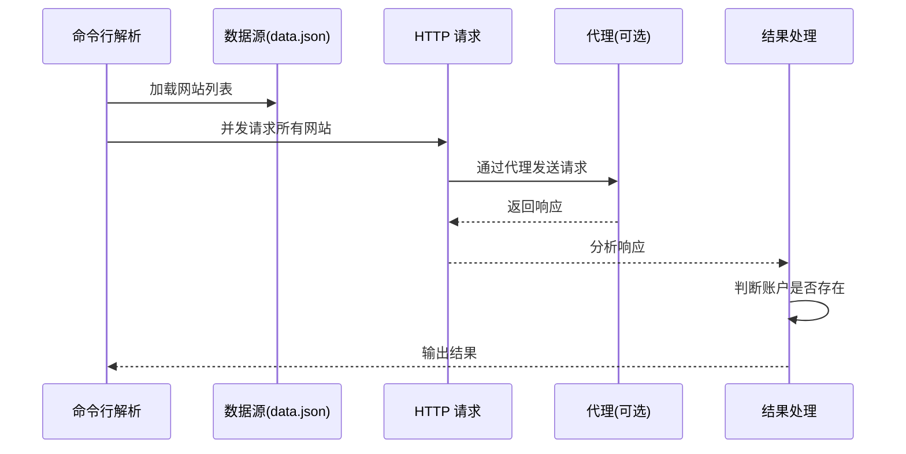

# Sherlock：跨 400+ 社交网络用户名侦查工具

> **目标读者**：安全研究人员、渗透测试工程师、OSINT 爱好者
> **前置知识**：命令行基础、Python 3、HTTP 请求基本概念

---

## 学习目标

完成本文后，你将掌握：

- 理解 Sherlock 的设计理念与 OSINT 侦查原理
- 掌握多种安装方式（pipx、pip、Docker、dnf）
- 熟练使用 Sherlock 进行单用户和多用户查询
- 理解输出格式（TXT、CSV、XLSX）
- 通过代理或 Tor 实现匿名请求
- 自定义数据源与超时设置
- 部署 Apify Actor 实现云端运行
- 理解源码结构并参与开发

---

## 一、项目概述与背景

### 1.1 什么是 Sherlock？

Sherlock（[sherlock-project/sherlock](https://github.com/sherlock-project/sherlock)）是一款开源的 **OSINT（开源情报搜集）工具**，通过用户名在 **400+ 社交网络平台**上搜索目标账户。

**定位**：让安全研究人员和渗透测试工程师能够快速发现目标在互联网上的数字足迹，也适合普通用户检查自己的用户名是否被占用。


### 1.2 项目数据

| 指标 | 数值 |
|------|------|
| GitHub Stars | **68.5k** |
| GitHub Forks | **7.9k** |
| 许可证 | MIT |
| 最新版本 | v0.16.0（2025-09-16） |
| Commits | **2,919** |
| 贡献者 | 数百位，活跃维护 |
| 支持网站数 | **400+** |
| 主要语言 | Python（97.3%） |

### 1.3 它解决了什么问题？

| 问题 | Sherlock 的解决方案 |
|------|-------------------|
| 手动在每个平台搜索用户名 | 自动化批量搜索 |
| 不知道哪些平台有账户 | 并发请求 400+ 网站 |
| 匿名性要求 | 代理 / Tor 支持 |
| 结果分散 | 统一输出（TXT/CSV/XLSX） |
| 云端部署需求 | Apify Actor 支持 |

### 1.4 适用场景

| 场景 | 说明 |
|------|------|
| 渗透测试 | 信息收集阶段快速定位目标账户 |
| 数字取证 | 追踪嫌疑人网络足迹 |
| 品牌保护 | 监控仿冒账户 |
| 个人安全 | 检查自己是否被冒用 |
| OSINT 研究 | 学术研究和社会工程演练 |

---

## 二、快速开始：15 分钟入门

### 2.1 环境要求

- Python >= 3.9
- pip / pipx / uv（任选其一）
- Git（可选，源码安装用）
- Tor 或代理（可选，用于匿名请求；Tor 需通过 `--proxy` 使用）

### 2.2 安装方式

Sherlock 支持多种安装方式，根据你的操作系统选择合适的方法：

#### 方式一：pipx 安装（推荐）

```bash
# 安装 pipx（如果还没有）
python3 -m pip install pipx
pipx install sherlock-project
```

#### 方式二：pip / uv 安装

```bash
pip install sherlock-project
# 或
uv tool install sherlock-project
```

#### 方式三：Docker 安装（无需配置环境）

```bash
docker run -it --rm sherlock/sherlock user123
```

#### 方式四：dnf 安装（Fedora/RHEL）

```bash
sudo dnf install sherlock-project
```

#### 方式五：从源码安装

```bash
# 克隆仓库
git clone https://github.com/sherlock-project/sherlock.git
cd sherlock

# 安装依赖与本体
pip install -r requirements.txt

# 验证安装
sherlock --help
```

> ⚠️ **注意**：ParrotOS 和 Ubuntu 24.04 的第三方软件包目前存在兼容性问题（已损坏），建议使用 `uv`/`pipx`/`pip` 或 Docker 安装。

### 2.3 基本使用

#### 搜索单个用户名

```bash
sherlock user123
```

结果将保存到 `user123.txt` 文件中。

#### 搜索多个用户名

```bash
sherlock user1 user2 user3
```

每个用户名对应生成一个结果文件。

#### 指定输出文件夹

```bash
sherlock user1 user2 user3 --folderoutput ./results
```

#### 浏览器直接打开结果

```bash
sherlock user123 --browse
```

---

## 三、核心功能详解

### 3.1 命令行参数完整列表

```bash
$ sherlock --help

usage: sherlock [-h] [--version] [--verbose] [--folderoutput FOLDEROUTPUT]
                [--output OUTPUT] [--csv] [--xlsx] [--site SITE_NAME]
                [--proxy PROXY_URL] [--dump-response] [--json JSON_FILE]
                [--timeout TIMEOUT] [--print-all] [--print-found]
                [--no-color] [--browse] [--local] [--nsfw] [--txt]
                [--ignore-exclusions]
                USERNAMES [USERNAMES ...]

Sherlock: Find Usernames Across Social Networks (Version 0.16.0)
```

**位置参数**

| 参数 | 说明 |
|------|------|
| `USERNAMES` | 要搜索的用户名，支持一个或多个；可用 `{?}` 匹配相似用户名（替换为 `_`、`-`、`.`） |

**可选参数**

| 参数 | 说明 |
|------|------|
| `-h, --help` | 显示帮助信息 |
| `--version` | 显示版本和依赖信息 |
| `-v, --verbose, -d, --debug` | 显示调试信息和指标 |
| `-fo, --folderoutput` | 多用户名时，结果保存到此文件夹 |
| `-o, --output` | 单用户名时，结果保存到此文件 |
| `--csv` | 生成 CSV 文件 |
| `--xlsx` | 生成 Excel 文件 |
| `--txt` | 生成 TXT 文件 |
| `--site SITE_NAME` | 只搜索指定站点，可重复指定多个 |
| `-p, --proxy` | 使用代理，如 `socks5://127.0.0.1:1080` |
| `--dump-response` | 将 HTTP 响应输出到 stdout，便于针对性调试 |
| `-j, --json JSON_FILE` | 从 JSON 文件（或在线 JSON、上游 PR 编号）加载用户名数据 |
| `--timeout TIMEOUT` | 请求超时时间（秒），默认 60 |
| `--print-all` | 输出所有网站（包括未找到的） |
| `--print-found` | 只输出找到的网站 |
| `--no-color` | 不使用彩色输出 |
| `-b, --browse` | 在默认浏览器打开所有结果 |
| `-l, --local` | 强制使用本地 `data.json` |
| `--nsfw` | 包含 NSFW 网站检查 |
| `--ignore-exclusions` | 忽略上游排除规则（可能产生更多误报） |

### 3.2 输出格式详解

#### 3.2.1 文本输出（默认）

```bash
sherlock user123
```

输出示例：

```
[+] Profile found: GitHub
[+] Profile found: Instagram
[-] Profile not found: Twitter
[+] Profile found: LinkedIn
...
```

#### 3.2.2 CSV 输出

```bash
sherlock user123 --csv
```

生成 `user123.csv` 文件，包含每个站点的名称、对应 URL 与检测结果，可在 Excel 或数据分析工具中查看。

#### 3.2.3 Excel 输出

```bash
sherlock user123 --xlsx
```

生成 `user123.xlsx` 文件，适合进行数据排序与筛选。

#### 3.2.4 从 JSON 文件加载用户名

`--json` 用于**输入**用户名清单，而非输出格式：

```bash
# 从本地文件加载
sherlock --json usernames.json

# 从在线 JSON 加载
sherlock --json https://example.com/users.json

# 加载指定上游 PR 的用户数据
sherlock --json 1234
```

JSON 文件内容示例：

```json
{
  "usernames": ["user123", "user456"]
}
```

### 3.3 匿名请求配置

#### 3.3.1 使用代理

```bash
sherlock user123 --proxy socks5://127.0.0.1:1080
```

> **说明**：旧版本提供 `--tor` / `--unique-tor` 参数，已于 2025 年 10 月移除（PR #2200）。如需通过 Tor 匿名请求，可搭配本地 Tor 服务使用代理，例如 `--proxy socks5://127.0.0.1:9050`（Tor 默认 SOCKS 端口）。

#### 3.3.2 代理池轮换

结合外部代理池工具（如 proxychains）轮换出口 IP：

```bash
proxychains4 sherlock user123
```

### 3.4 高级查询选项

#### 3.4.1 只搜索特定网站

```bash
# 只搜索 GitHub 和 Twitter
sherlock user123 --site github --site twitter
```

#### 3.4.2 自定义超时

```bash
# 设置 30 秒超时
sherlock user123 --timeout 30
```

#### 3.4.3 相似用户名变体

```bash
# {?} 会依次替换为 _、-、.，分别检查
sherlock "user{?}name"
```

#### 3.4.4 包含 NSFW 网站

```bash
sherlock user123 --nsfw
```

#### 3.4.5 使用本地数据源

```bash
sherlock user123 --local
```

---

## 四、云端部署：Apify Actor

如果你不想在本地安装，可以使用 Apify Actor 在云端运行 Sherlock。

### 4.1 什么是 Apify Actor？

Apify Actor 是运行在 Apify 平台上的云端程序。Sherlock 仓库内置 `.actor/` 目录，可直接构建部署到 Apify 平台，无需本地环境即可批量查询。

### 4.2 云端运行的优势

| 优势 | 说明 |
|------|------|
| 无需安装 | 直接在浏览器运行 |
| 免费配额 | 每月有一定免费计算时间 |
| 全球分布 | 多个地理位置可选 |
| API 支持 | 可编程调用 |
| 自动扩展 | 无需管理服务器 |

### 4.3 部署方法

1. 在 [Apify](https://apify.com) 平台新建 Actor，关联 `sherlock-project/sherlock` 仓库
2. 平台自动识别 `.actor/actor.json` 构建配置
3. 输入用户名列表后运行，结果通过平台输出

---

## 五、源码架构解析

### 5.1 目录结构

```
sherlock/
├── .actor/                  # Apify Actor 配置
├── .github/                 # GitHub Actions CI/CD
├── devel/                   # 开发文档
├── docs/                    # 用户文档
├── sherlock_project/        # 核心代码
│   ├── __init__.py
│   ├── __main__.py          # 入口（python -m sherlock_project）
│   ├── sherlock.py          # 主逻辑与 CLI
│   ├── sites.py             # 网站数据加载与校验
│   ├── result.py            # 结果对象与状态枚举
│   ├── notify.py            # 结果通知
│   ├── py.typed             # 类型标记
│   └── resources/
│       ├── data.json        # 400+ 网站检测规则
│       └── data.schema.json # 数据 Schema 校验
├── tests/                   # 测试用例
├── pyproject.toml           # 项目配置与打包
├── pytest.ini               # Pytest 配置
├── tox.ini                  # Tox 配置
└── Dockerfile               # Docker 配置
```

### 5.2 核心模块

| 模块 | 职责 |
|------|------|
| `sherlock.py` | 主逻辑：CLI 解析、并发查询调度、输出生成 |
| `sites.py` | 加载并校验 400+ 网站数据（data.json） |
| `result.py` | 结果对象 QueryResult 与状态枚举 QueryStatus |
| `notify.py` | 结果通知（邮件、Apprise 等） |

### 5.3 数据源结构

每个社交网络的检测规则定义在 `sherlock_project/resources/data.json` 中：

```json
{
  "1337x": {
    "url": "https://www.1337x.to/user/{}/",
    "urlMain": "https://www.1337x.to/",
    "errorType": "message",
    "errorMsg": ["<title>Error something went wrong.</title>", "<head><title>404 Not Found</title></head>"],
    "regexCheck": "^[A-Za-z0-9]{4,12}$",
    "username_claimed": "FitGirl"
  }
}
```

字段含义：

| 字段 | 说明 |
|------|------|
| `url` | 用户名页面模板，`{}` 处替换用户名 |
| `urlMain` | 站点主页 |
| `errorType` | 判断不存在的依据：`status_code`（HTTP 状态码）或 `message`（页面内容） |
| `errorMsg` | 判定"不存在"的响应特征 |
| `regexCheck` | 用户名格式校验正则 |
| `username_claimed` | 已知存在的用户名（用于测试验证） |

### 5.4 请求流程



---

## 六、扩展开发指南

### 6.1 添加新网站

在 `sherlock_project/resources/data.json` 中添加新站点条目：

```json
"mywebsite": {
    "url": "https://mywebsite.com/user/{}",
    "urlMain": "https://mywebsite.com/",
    "errorType": "status_code",
    "errorMsg": ["404"],
    "username_claimed": "example"
}
```

> 建议使用 `data.schema.json` 校验格式，并参照 `tests/` 中的站点测试模式补充验证。

### 6.2 贡献代码

1. **Fork 仓库**

2. **创建分支**

```bash
git checkout -b feature/new-site
```

3. **添加网站或修复问题**

4. **运行测试**

```bash
# 安装依赖
python3 -m pip install -r requirements.txt

# 运行测试
pytest tests/

# 运行 lint
python -m flake8 sherlock_project/
```

5. **提交 Pull Request**

### 6.3 测试覆盖

```bash
# 完整测试
pytest tests/ -v

# 带覆盖率报告
pytest tests/ --cov=sherlock_project

# 只运行特定测试
pytest tests/test_sherlock.py -v
```

---

## 七、使用场景实战

### 7.1 渗透测试信息收集

在渗透测试的信息收集阶段，使用 Sherlock 快速定位目标的网络足迹：

```bash
# 假设目标是 "john.doe"
sherlock "john.doe" --proxy socks5://127.0.0.1:9050 --output john-doe-report.txt

# 查看哪些网站有账户
cat john-doe-report.txt | grep "Profile found"
```

### 7.2 品牌保护监控

企业安全团队可以使用 Sherlock 监控品牌被冒用的情况：

```bash
# 监控公司名称，输出 CSV 便于比对
sherlock "yourcompany" --print-found --csv --output company-monitor.csv

# 定期运行并比对结果
diff old-report.csv new-report.csv
```

### 7.3 数字取证追踪

在数字取证场景中，追踪嫌疑人的网络活动：

```bash
# 使用代理保持匿名
sherlock "suspect_username" --proxy socks5://127.0.0.1:9050 --csv --xlsx
```

### 7.4 批量查询

对于多个目标，使用批量查询提高效率：

```bash
# 准备用户名列表
printf "user1\nuser2\nuser3\nuser4" > targets.json

# 通过 --json 批量加载
sherlock --json targets.json --csv --folderoutput ./batch-results/
```

---

## 八、推荐做法

### 8.1 匿名使用建议

| 场景 | 推荐配置 |
|------|----------|
| 基本使用 | 直连 |
| 隐私要求 | `--proxy socks5://127.0.0.1:9050`（本地 Tor） |
| 绕过地域限制 | 海外代理 |
| 高频查询 | 代理池轮换 |

### 8.2 结果分析

```bash
# 只显示找到的账户
sherlock user123 --print-found

# 显示详细日志
sherlock user123 --verbose

# 生成多种格式报告
sherlock user123 --csv --xlsx --txt
```

### 8.3 性能优化

| 优化项 | 方法 |
|--------|------|
| 减少超时 | `--timeout 10`（快速失败） |
| 并发请求 | 默认已支持 |
| 使用本地数据 | `--local` |
| 选择性网站 | `--site github --site twitter` |

---

## 九、常见问题

### Q1: 安装失败怎么办？

**解决方案**：
1. 确保 Python 版本 >= 3.9
2. 使用虚拟环境：

```bash
python3 -m venv sherlock-env
source sherlock-env/bin/activate
pip install sherlock-project
```

### Q2: 代理请求超时？

**可能原因**：
- 代理服务未正确安装或运行
- 代理端口配置错误
- 代理出口节点被封

**解决方案**：

```bash
# 确认本地 Tor 运行（默认 SOCKS 端口 9050）
tor --version

# 使用显式代理地址
sherlock user123 --proxy socks5://127.0.0.1:9050
```

### Q3: 结果不准确？

**可能原因**：
- 某些网站更新了检测逻辑
- 网络问题导致请求失败

**解决方案**：
- 使用 `--local` 强制使用本地数据源
- 检查 `--verbose` 日志排查问题
- 提交 Issue 或 Pull Request 更新检测规则

### Q4: 如何处理 Rate Limit？

**解决方案**：
- 使用 `--timeout` 增加超时时间
- 使用 `--proxy` 切换 IP
- 使用代理池轮换 IP

### Q5: 支持中文网站吗？

**支持**。Sherlock 支持部分中文平台（如知乎、哔哩哔哩、Gitee 等）。完整列表可在[官方站点列表](https://github.com/sherlock-project/sherlock/blob/master/sites.md)查看。

---

## 十、总结

Sherlock 是一款强大的 OSINT 侦查工具，它的价值在于：

| 优势 | 说明 |
|------|------|
| **全面覆盖** | 400+ 社交网络一网打尽 |
| **高效快速** | 并发请求，秒级完成 |
| **隐私保护** | 代理支持（含 Tor） |
| **多格式输出** | TXT/CSV/XLSX |
| **云端运行** | Apify Actor 无需安装 |
| **易于扩展** | 通过 data.json 添加新网站 |
| **活跃维护** | 数百位贡献者持续更新 |

**下一步推荐**：

1. [安装 Sherlock](#二快速开始15-分钟入门)：选择适合你的安装方式
2. [尝试基本查询](#三核心功能详解)：搜索一个用户名看看效果
3. [阅读源码](#五源码架构解析)：深入理解工作原理
4. [贡献代码](#六扩展开发指南)：为项目添砖加瓦

---

**文档信息**

- 难度：进阶
- 类型：完整教程
- 更新日期：2026-09-10
- GitHub：https://github.com/sherlock-project/sherlock

由钳岳星君撰写 | 项目源码：https://github.com/sherlock-project/sherlock
