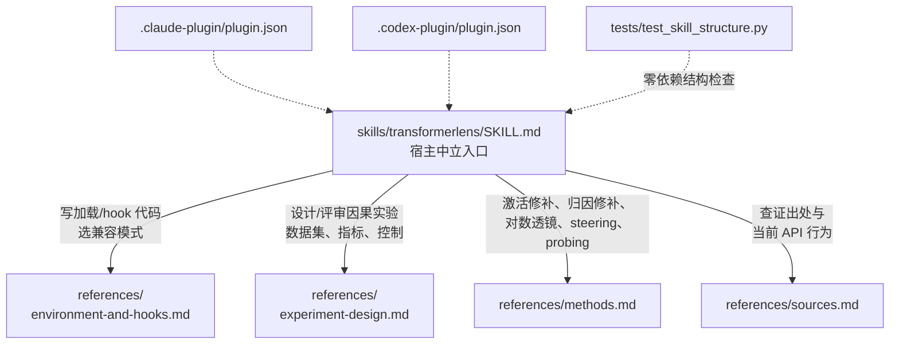

这个仓库真正解决的不是"替你写可解释性代码"，而是把机制可解释性实验里最容易出错的那些判断——目标 token 怎么定、什么才算因果证据、归因修补该在哪个点求梯度——固化成一份 AI Agent 可执行的研究纪律。它自己经历过一次形态切换：2026 年 5 月出生时是六个 Python 模块的包装库，9 月被作者推倒，重写为纯指令文档的 Agent Skill。今天再评估它，得按后者来。

## 项目坐标

| 项目 | 信息 |
|------|------|
| **仓库** | [Durararananke/transformerlens-skill](https://github.com/Durararananke/transformerlens-skill)（旧名 `transformerlens_skill`，已 301 重定向） |
| **Stars / Forks** | 2 / 0 |
| **语言** | Python（唯一 Python 文件是结构测试；主体是 Markdown 指令文档） |
| **License** | 仓库无有效许可文本：`LICENSE` 是空文件，README 与插件清单声称 MIT，GitHub API 因此报 NOASSERTION |
| **最后推送** | 2026-09-04 |
| **形态** | Agent Skill（`SKILL.md` + 4 份 references + 双宿主插件清单），无 Python 依赖 |
| **数据口径** | Stars、目录结构与提交历史均核对自 GitHub API 与 master 分支，日期 2026-10-05 |

Stars 只有个位数，这不是一个有社区的项目，它的价值全在内容本身——下面按它实际的组织方式拆开看。

## 系统地图

整个仓库是一个标准的可移植 Agent Skill 包：一份宿主中立的入口，四份按任务分流的参考文档，两份插件元数据让同一个 skill 目录能被不同 AI 编码工具加载，外加一个零依赖的结构测试守护这套布局。



| 文件 | 职责 |
|------|------|
| `SKILL.md` | 入口与总纲：任务路由、七步核心工作流、六条正确性约束 |
| `references/environment-and-hooks.md` | 模型加载、TransformerLens 3 迁移、hook 命名与张量轴语义、tokenization、hook 生命周期、梯度与内存 |
| `references/experiment-design.md` | 可证伪假设、反事实数据集构造、指标选择、负控制、可复现性记录 |
| `references/methods.md` | 各分析范式（修补、透镜、消融、steering、probing）的原理要点与失败模式 |
| `references/sources.md` | TransformerLens 官方文档链接与四篇方法论文出处 |
| `.claude-plugin/` / `.codex-plugin/` | Claude Code 与 Codex 的插件元数据，指向同一个 `skills/` 目录 |
| `tests/test_skill_structure.py` | 无第三方依赖的结构测试：必需文件存在、清单是合法 JSON、frontmatter 可移植、文档内链接可解析 |

SKILL.md 开篇第一句就划了边界："The user's instructions take precedence over this skill"——用户指令优先于 skill。第二句给出它的自我定位：**供应研究判断，不供应罐头实验**（"This skill supplies research judgment, not a canned experiment"），要求 Agent 写"能回答问题的最小任务特定代码"，并保留用户项目里已有的约定。这两句决定了它和 5 月那个模块库版本的根本区别：不给你可 `import` 的函数，只约束你写代码时做决策的方式。

## 核心工作流：先 estimand，后 hook

SKILL.md 的核心工作流有七步，顺序本身就是论点：大多数糟糕的可解释性实验，错在动手前而不是写代码时。

1. **先陈述行为声明和估计量（estimand），再选 hook**。模型输出是什么、样本级怎么聚合、改善方向是哪边、目标是单个 token 还是序列——这些必须在选 hook 点之前定下来。
2. **从项目文件确认环境假设**。生成的代码要记录包版本、模型架构、tokenizer 与聊天模板、配置、hook 名和观察到的张量形状。新写的 TransformerLens 3 代码优先用 `TransformerBridge`；只有项目有意钉死在旧版时才保留 legacy 路径。
3. **在代码里定义配对的干净/损坏数据集**。改变目标特征的同时控制模板、长度、padding、答案位置和无关语义；要做 token 对齐检查，而不是只比张量形状。
4. **先写干净与损坏基线，再写干预代码**。指标要报告原始基线值，并暴露归一化分母在什么情况下会不稳定。
5. **从最粗粒度的干预开始，把细化做成可配置项**。代码里内置 hook 是否触发、激活形状、轴含义、设备、dtype、干预范围的检查。
6. **配齐负控制和重复实验**：随机位置修补、打乱配对、替换损坏方式、多种子、held-out 提示，以及"对梯度提出的候选做精确修补验证"。
7. **输出结构要分得清四件事**：什么被操纵、什么被测量、选定干预下的因果效应、以及更大范围的机制解释。

这套流程的每一环都能在它的参考文档里找到对应的展开，下面挑最值钱的三处细说。

## 正确性约束：这份 skill 最值钱的部分

SKILL.md 的"Correctness constraints"一节列了六条硬约束，全部针对可解释性研究里真实存在、且 reviewers 反复指出的错误。逐条看。

**目标 token 必须预注册，不许看基线答案抄近路。** 当任务本身有已知答案时，禁止从"基线恰好排名最高的 token"反推目标；要显式 tokenize 目标，多 token 答案用 teacher-forced 序列对数概率这类预先声明的序列指标处理。这条约束堵的是一种隐蔽的循环论证——用模型自己的输出定义"正确答案"，再拿它评估干预效果。

**分清什么是因果证据，什么不是。** 注意力权重、logit lens 投影、probe 准确率、梯度、相关性——这些单独拿出来都不能当因果证据。方法文档里对每一项都给了理由：注意力模式只显示路由权重，不显示贡献大小；logit lens 只暴露"在最终词表基底下线性可解码"的信息，不 literally 揭示模型在某层"相信"什么；probe 准确率只说明在给定探针和数据划分下可解码，不说明模型使用了该特征。

**修补方向和分数方向必须显式。** 对 clean-into-corrupted 方向、指标越大越好的设定，归一化恢复分数是 `(patched - corrupted) / (clean - corrupted)`；同时报告原始值，并对接近零的分母做防护。实验设计文档进一步说：这个比值低于 0 或高于 1 都可能出现，而且有信息量，不要裁剪掉；分母接近零、反向或不稳定的样本要剔除或单独报告。

**归因修补的展开点必须在损坏端。** 作为精确修补的一阶泰勒近似，归因修补的标准形式是 `delta_m ≈ grad_a m(a_corrupt) · (a_clean - a_corrupt)`——前向激活和梯度都必须来自 corrupted run。用 clean run 的梯度是另一个泰勒展开，不能冒充标准的 corrupted-baseline 近似。方法文档还列了它失效的典型场景：大幅 residual 移动、饱和的 softmax/MLP 区域、长组合电路的早期位点、只有联合起作用的特征——所以它只能用来筛选候选，重要候选必须回到精确修补验证。

**hook 生命周期要收口。** 用上下文管理器或一次性 hook 调用圈定作用域，只移除实验自己拥有的 hook；禁止在已有项目里随手 `reset_hooks()`，因为那会静默清掉调用方装的 hook。hook 内要把源激活搬到目标激活的设备和 dtype，不要指望分片模型只有一个 `cfg.device`。

**内存要先估算再动手。** 缓存字节数等于所有张量维度、dtype 大小、位点数的乘积（需要梯度时再乘二），全量缓存对大模型几乎总是不合理的；用 `names_filter`、位置切片、分层停止、分批和 CPU 缓存。梯度类测量不要包在 inference/no-grad 模式里——归因修补需要梯度回传，这是新手常踩的坑。

## 环境与 hook 语义：按架构实证，不按惯例假设

`environment-and-hooks.md` 是四份参考文档里工程细节最密的一份，主线只有一个：TransformerLens 的便利抽象不能免检。

加载层面，TransformerLens 3 把 `TransformerBridge` 确立为新工作的推荐路径：

```python
from transformer_lens.model_bridge import TransformerBridge

model = TransformerBridge.boot_transformers(model_id, device=device, dtype=dtype)
```

skill 特意注明这段代码是"API 定向"而非"可以照抄的加载器"——`model_id`、设备、dtype、认证、远程代码策略、量化、分片都要从用户的实际环境里确定。`TransformerBridge` 默认保留 Hugging Face 原始权重；只有当分析需要旧版 HookedTransformer 坐标系或 hook 别名时（比如复现旧的 logit lens / 直接 logit 归因结果），才调用 `enable_compatibility_mode()`。选择要记录在案，因为权重折叠和居中处理会让缓存的残差坐标和原始 logits 差一个常数，尽管生成文本不变。

hook 命名与张量轴这一节的态度更直接：文档列出了 decoder-only 模型的常见约定（residual 类张量 `[batch, position, d_model]`、注意力 pattern `[batch, head, destination_position, source_position]` 等），但紧跟一句——这些不是普适契约。分组查询注意力（GQA）会给 K/V 一个 `n_key_value_heads` 轴而不是 `n_heads`；多头潜在注意力（MLA）可能根本没有有意义的 Q/K/V 分裂别名；MoE、post-norm、编码器-解码器、多模态、局部注意力都需要按架构具体解释。"hook 存在"本身不能证明它带着 legacy 语义。bridge 原生的块级命名是 `hook_in`/`hook_out`，`hook_resid_pre` 这类旧名只有开兼容模式才可能可用——优先用模型 hook 注册表里实际存在的名字。

tokenization 一节同样反直觉：裸字符串和聊天模板包装后的对话是不同的实验输入；BOS 行为要显式声明，不能假设所有模型用同一种 BOS 约定；等长是位置对齐修补的必要条件而非充分条件——位置对应要反映相同的"角色"，不是相同的整数下标；永远不要修补 padded 位置。

## 实验设计：反事实、指标与控制

`experiment-design.md` 把"怎么设计一个能站稳的因果实验"拆成四步，其中两步值得展开。

**反事实构造**有一份检查清单：干净条件确实表现出目标行为；损坏在不把提示变得无意义的前提下拉开足够差距；模板、答案位置、token 数、标点、聊天包装、padding 全部受控；源激活不能携带"答案 token 身份"这类容易混入的无关线索。文档还提醒：换例重采样（interchange/resampling）式修补通常比补零或任意常数更贴近激活流形，但两者回答的是不同的问题；每个干预都要说清楚测的是必要性、充分性、中介还是仅仅敏感度。

**指标选择**的原则是"在看热力图之前定指标"。对二分类的 next-token 对比，优先用每样本 logit 差 `m(logits) = logit(correct) - logit(contrast)`；概率会饱和、掩盖有意义的变化，所以非二元目标用 target logit 或对数概率并说明理由。逐样本算完再聚合，报告分布和不确定性，而不是只看 batch 的第 0 行。

控制变量部分给了一份能暴露"最合理伪影"的负控制清单：随机层/头/位置修补、打乱配对、对位置对齐但语义无关的 token 修补、多种损坏强度、zero/mean/resample 三种消融对比离流形敏感度、提示改写与 held-out 模板、多随机种子，以及对梯度/probe/注意力提出的候选做精确修补。大扫描要配多重比较校正或 held-out 验证；电路发现和电路确认的样本要分开。

最后是可复现性记录清单——模型仓库与 revision、TransformerLens/Transformers/PyTorch 版本、加载与兼容模式选择、精确 prompt 或数据集版本、hook 名与观察形状、指标公式与基线值、种子与样本量、负控制结果。文档还建议把数值不变量编码进代码：恒等 hook 不应改变输出；在合适边界做全量 clean 状态替换应逼近 clean 续写；声称的按头分解在和架构允许时应能加和回层输出。这些不变量是免费的正确性检查，跑实验时顺带完成。

## 一次激活修补实验的完整流转

把上面的机制串起来，看一个典型任务——"定位模型在哪里知道艾菲尔铁塔在巴黎"——在这个 skill 指导下的完整路径。

Agent 接到问题后，第一步不是加载模型，而是把行为声明写成可检验的形式：在损坏提示"The Colosseum is in"的上下文里，把某层某位置的激活替换成干净提示"The Eiffel Tower is in"的对应激活，" Paris"的 logit 差恢复多少。估计量明确，才选 hook 点。第二步检查环境：读项目的 lockfile 确认 transformer_lens 版本，若装的是 3.x 就用 `TransformerBridge.boot_transformers` 加载，并跑一个单样本缓存检查列出 hook 名和实际形状。第三步构造配对数据集：两条提示模板同构、长度相同、只有主体词不同，tokenize 后逐 token 核对对齐。第四步跑干净与损坏基线，记录原始 logit 差——如果损坏没把" Paris"的分数拉下来，实验在动手修补前就该终止。第五步从 residual stream 的整层修补开始（最粗粒度），确认有信号后再把细化到头级的选项打开；归因修补的梯度在 corrupted 激活处求，用来给头级候选排序，排在前面的候选回到精确修补验证。第六步补负控制：随机位置修补、打乱配对、把" Rome"换成" Paris"验证答案 token 身份没有泄漏。最后输出时，把操纵对象、测量对象、因果效应和"这只说明在该反事实分布下的效应，不等于'事实存储于此'"分层写清。

这个流程没有一步是现成代码——skill 提供的是每一步的检查点和方向约束，代码由 Agent 按项目环境现写。这正是它和 5 月那个模块库版本的分水岭。

## 从模块库到 skill：一次值得注意的转型

git 历史完整记录了这次转身。2026-05-17 一天之内 13 个提交：脚手架、`feat: implement all 6 TransformerLens skill modules`、README 打磨——产出是一个 `src/transformerlens_skill/` 下的 Python 包：`models.py` 和 `utils.py` 两个辅助模块，加上激活修补、归因修补、因果追踪、对数透镜、模型 steering、基础操作六个功能模块，README 里"Supported Models"表列着 Llama 3、Qwen 3、Gemma 3，并注明"This repository was completed with assistance from Codex"。6 月 13 日更新过一次 README 和 LICENSE 后，项目沉寂了近三个月。9 月 4 日，"Modify structure"提交把 `src/` 整体删除，换成今天的 skill 布局。

转型的动因，新 README 的开头写得明白：TransformerLens 迭代很快，模型架构各不相同，一个干预是否有效取决于研究问题——这三件事让"封装好的模块"天然脆弱。同样的判断也解释了内容重心的迁移：旧版把力气花在 API 封装上，新版把全部篇幅给了实验方法论（estimand、反事实、控制、证据边界）。旧版 README 里甚至有一处 import 笔误（示例写 `from transformerlens_skill.nnsight_basics import ...`，包里实际叫 `basics.py`），这类"示例与实现脱节"恰是封装路线的典型维护负担——skill 路线下不存在这个问题，因为根本没有需要保持同步的 API。

对观察者来说，这个案例的启示比仓库本身更值钱：当底层框架 API 快速演化、而领域知识的重心在"怎么设计实验"时，把知识封装成函数不如把它写成 Agent 可执行的判断。

## 采用建议

**安装**。三种宿主共用同一个 `skills/transformerlens` 目录：Codex 复制到 `$CODEX_HOME/skills/transformerlens`；Claude Code 开发期用 `claude --plugin-dir /absolute/path/to/transformerlens-skill` 加载，或复制到 `~/.claude/skills/transformerlens`；DeepSeek Harness 复制到 `<project>/.dsh/skills/transformerlens` 或 `~/.dsh/skills/transformerlens`。调用方式：Codex/DeepSeek Harness 里用 `$transformerlens`，Claude Code 里插件形式为 `/transformerlens-skill:transformerlens`、独立安装形式为 `/transformerlens`；自然语言提出 TransformerLens 或机制可解释性任务也能触发。

**适用边界**。skill 的 frontmatter 自己写了负面清单：普通推理、不触及内部激活的常规模型训练不要用它。它触发的场景是模型与 hook 检查、激活/归因修补、残差分解、logit lens、消融、激活 steering 和 probing。

**谁该用，谁不必**。用 TransformerLens 做研究（复现论文、跑修补实验、写课程作业）的人，这个 skill 能把一批常见的实验设计错误提前拦住，成本只是往 skills 目录放几个文件——值得直接用。做生产推理、微调训练、不看内部激活的工程，用不上。想要一个开箱即用的修补函数库的老用户，这个仓库已经回不去了，旧版代码可以从 2026-09-04 之前的提交里翻（commit `21edbfc` 是模块库形态的末版），但要注意那版自带 `nnsight_basics` 的示例笔误，且此后无人维护。最后提醒一句：仓库没有有效许可证文本——`LICENSE` 是空文件，README 和插件清单写的 MIT 没有对应的许可正文。想复用其中的文字内容（比如 references 里的实验纪律），先让作者补一份完整的 MIT 许可文本再用，避免踩著作权的灰色地带。
