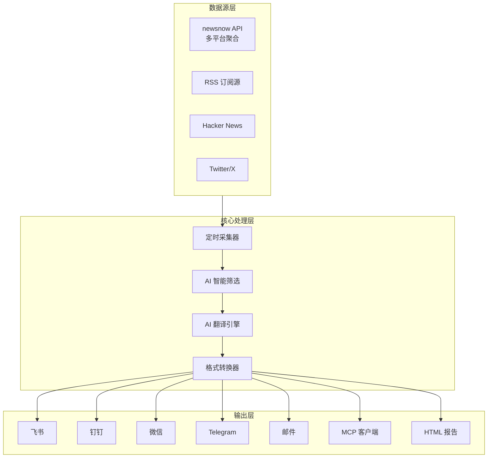

# TrendRadar：54K Stars 的 AI 热点新闻助手，一键部署支持飞书/钉钉/微信多渠道推送

## 🎯 概述

**TrendRadar** 是一款面向 AI 时代的热点新闻助手，主打"**30 秒部署**"和"**AI 智能筛选**"。用户只需用日常语言描述自己感兴趣的领域，AI 自动过滤无关信息，只推送真正相关的新闻。支持飞书、钉钉、微信、Telegram、邮件等 **9 大通知渠道**，还提供 **MCP 客户端**让 AI Agent 直接调用。

> **GitHub**: [sansan0/TrendRadar](https://github.com/sansan0/TrendRadar)  
> **Stars**: 54,020 ⭐  
> **Forks**: 2,892  
> **版本**: v6.6.1  
> **许可证**: GPL-3.0

### 一句话定位

**"Say goodbye to endless scrolling, only see the news you truly care about"** —— 告别无效刷屏，只看真正关心的新闻资讯。

### 解决的核心痛点

| 痛点 | 传统方案 | TrendRadar |
|------|---------|------------|
| 新闻太多太杂 | 手动刷多个平台 | AI 按兴趣自动筛选 |
| 关键词匹配不准 | 硬编码关键词，误报率高 | 自然语言描述兴趣，AI 智能打分 |
| 推送配置复杂 | 每个平台单独配置 | 统一配置，多渠道一键推送 |
| AI Agent 无法获取新闻 | 需要写爬虫 | MCP 客户端直接调用 |
| 部署困难 | 需要服务器、域名、证书 | GitHub Actions 一键部署 |

---

## 🏛️ 系统架构

### 核心组件



### 技术栈

| 组件 | 技术选型 | 说明 |
|------|---------|------|
| **语言** | Python | 生态丰富，易于扩展 |
| **调度** | GitHub Actions | 零成本托管 |
| **部署** | Docker | 一键部署 |
| **AI 筛选** | GPT/Claude API | 自然语言理解 |
| **翻译** | GPT/Claude API | 多语言支持 |
| **推送** | 9 大渠道 SDK | 覆盖主流平台 |
| **MCP** | Model Context Protocol | AI Agent 集成 |

---

## 🎯 核心功能

### 1. AI 智能筛选

传统方案需要用户手动定义关键词（如 "AI" AND "LLM"），但关键词匹配有以下问题：
- 无法理解同义词（"大模型"vs"LLM"）
- 无法处理组合意图（"AI 创业"vs"AI 股票"）
- 误报率高（"AI" 可能匹配到"某公司 AI 部门裁员"）

TrendRadar 的 AI 筛选使用自然语言描述兴趣：

```yaml
# config/custom/ai/interests.txt
我想看 AI 和新能源相关新闻

具体来说：
- AI 行业动态：LLM 发布、AI 创业公司、技术突破
- 新能源汽车：特斯拉、比亚迪、宁德时代
- 不看：AI 娱乐化内容、游戏 AI
```

AI 会：
1. 提取关键标签：AI, LLM, 新能源， 特斯拉， 比亚迪
2. 对每条新闻打分（0-100）
3. 只推送高置信度相关新闻
4. 如 AI 筛选异常，自动切回关键词匹配

### 2. 多渠道推送

| 渠道 | 状态 | 特点 |
|------|------|------|
| **飞书** | ✅ 支持 | 支持富文本，按 30KB 拆分 |
| **钉钉** | ✅ 支持 | 支持富文本，按 20KB 拆分 |
| **微信** | ✅ 支持 | 公众号/企业微信 |
| **Telegram** | ✅ 支持 | Bot 推送 |
| **邮件** | ✅ 支持 | SMTP 发送 |
| **Slack** | ✅ 支持 | Webhook |
| **ntfy** | ✅ 支持 | 自托管通知 |
| **Bark** | ✅ 支持 | iOS 推送 |
| **通用 Webhook** | ✅ 支持 | 自定义集成 |

### 3. MCP 客户端支持

TrendRadar 可以作为 **MCP 服务器**使用，让 AI Agent 直接获取新闻：

```typescript
// AI Agent 调用示例
const news = await mcpClient.get_trending_news({
  platform: "hackernews",
  limit: 10,
  interests: "AI, LLM, startup"
});
```

MCP 工具列表：
- `get_trending_news` - 获取趋势新闻
- `get_news_by_keyword` - 按关键词搜索
- `get_channel_format_guide` - 获取各渠道格式指南
- `analyze_news_trend` - 分析新闻趋势

### 4. 30 秒部署

TrendRadar 提供了多种部署方式，最快 **30 秒**即可完成：

#### 方式一：GitHub Actions 一键部署（推荐）

```bash
# 1. Fork 项目
# 2. 配置 config.yaml（密钥等）
# 3. 启用 GitHub Actions
# 4. 完成！
```

#### 方式二：Docker 部署

```bash
docker run -d \
  -v $(pwd)/config.yaml:/app/config.yaml \
  -p 8000:8000 \
  wantcat/trendradar
```

#### 方式三：GitHub Pages

```bash
# 生成静态 HTML 报告
python generate_report.py --output ./docs
# 推送至 GitHub Pages
```

---

## ⚙️ 配置详解

### 配置文件结构

```yaml
# config.yaml

# 通知渠道配置
channels:
  feishu:
    webhook_url: "https://open.feishu.cn/..."
    enabled: true
  
  telegram:
    bot_token: "xxx"
    chat_id: "xxx"
    enabled: true

# AI 筛选配置
ai_filter:
  enabled: true
  api_key: "${OPENAI_API_KEY}"
  model: "gpt-4o"
  confidence_threshold: 70

# 定时任务配置
schedule:
  preset: "morning_evening"  # 预设模板
  # 或者自定义
  windows:
    - name: "早间"
      start: "08:00"
      end: "09:00"
      push: true
      analysis: true
```

### Timeline 调度配置

```yaml
# timeline.yaml

presets:
  morning_evening:
    name: "早晚汇总"
    windows:
      - period: "morning"
       采集: "07:30"
        推送: "08:00"
        分析: true
      - period: "evening"
        采集: "18:30"
        推送: "19:00"
        分析: true

  always_on:
    name: "全天候"
    windows:
      - period: "all"
        采集: "*/30 * * * *"
        推送: "*/60 * * * *"
        分析: false
```

---

## 📖 使用指南

### 基础使用：让 AI 按兴趣推送新闻

```bash
# 1. 配置兴趣描述
echo "我想看 AI 和新能源相关新闻" > config/custom/ai/interests.txt

# 2. 启用 AI 筛选
sed -i 's/ai_filter_enabled: false/ai_filter_enabled: true/' config.yaml

# 3. 配置推送渠道
export FEISHU_WEBHOOK="https://..."

# 4. 启动
python trendradar.py
```

### 进阶使用：作为 MCP 客户端

```bash
# 1. 配置 MCP 服务器
export MCP_SERVER_URL="http://localhost:8000"

# 2. 使用 AI Agent 调用
# 在 Claude Code / Cursor 等工具中：
#
# /search news about AI startups
# → MCP 调用 get_trending_news(platform="hackernews", interests="AI startup")
```

### 高级用法：多时段差异化配置

```yaml
timeline:
  windows:
    # 早上：快速浏览科技头条
    - name: "科技早报"
      time: "08:00"
      keywords: ["AI", "LLM", "Tech"]
      push: true
    
    # 晚上：深度分析金融 AI
    - name: "金融晚报"
      time: "19:00"
      keywords: ["FinTech", "AI trading"]
      ai_filter: true
      ai_interests: |
        我关注金融 AI 量化交易
        包括：AI 选股、智能投顾、算法交易
      push: true
```

---

## 🔧 与同类工具对比

| 特性 | TrendRadar | newsnow | RSSHub | N8N |
|------|------------|---------|--------|-----|
| **Stars** | 54k | 23k | 24k | 42k |
| **AI 筛选** | ✅ 原生支持 | ❌ | ❌ | 需工作流 |
| **MCP 支持** | ✅ | ❌ | ❌ | ❌ |
| **多渠道推送** | 9 个渠道 | 基础 | 需配置 | 需工作流 |
| **30 秒部署** | ✅ GitHub Actions | ✅ | ❌ | ❌ |
| **中文支持** | ✅ 完善 | ✅ | ✅ | ✅ |

---

## 🎓 设计原则总结

### 核心设计理念

1. **AI First**：用 AI 替代硬编码关键词匹配
2. **零成本部署**：GitHub Actions 托管，无需服务器
3. **多渠道统一**：一个配置，多个渠道
4. **MCP 原生**：让 AI Agent 直接消费新闻

### 可复用的架构经验

| 经验 | 应用场景 |
|------|---------|
| **兴趣描述 > 关键词** | AI 筛选新闻、推荐系统 |
| **定时采集 + AI 筛选** | 新闻聚合、内容推荐 |
| **MCP 协议** | AI Agent 工具集成 |
| **多渠道适配** | 统一推送平台差异 |

---

## 🔗 资源链接

| 资源 | 链接 |
|------|------|
| GitHub | [sansan0/TrendRadar](https://github.com/sansan0/TrendRadar) |
| 在线 Demo | [sansan0.github.io/TrendRadar](https://sansan0.github.io/TrendRadar) |
| Docker | [hub.docker.com/r/wantcat/trendradar](https://hub.docker.com/r/wantcat/trendradar) |
| MCP 文档 | [modelcontextprotocol.io](https://modelcontextprotocol.io/) |
| 数据 API | [ourongxing/newsnow](https://github.com/ourongxing/newsnow) |

---

*🦞 TrendRadar：让 AI Agent 真正拥有个性化新闻感知能力。*
