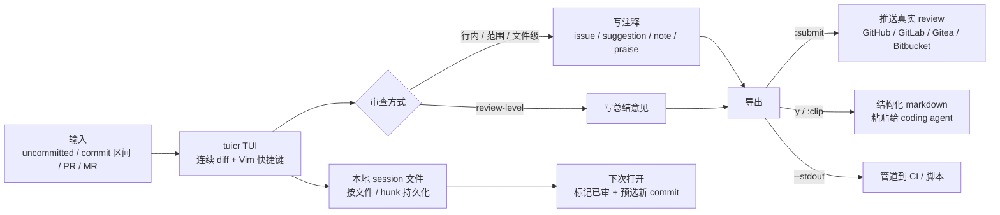

# tuicr：终端里的代码审查，一套 Vim 快捷键推 GitHub / GitLab / Gitea / Bitbucket

## 一句话判断

tuicr（读作 *tweaker*）是一个用 Rust 编写的终端代码审查 TUI（Text-based User Interface，文本终端界面），把"在浏览器里点 PR review"这件事搬进终端：GitHub 风格的连续 diff（按行级展示代码改动的视图）、Vim 全套快捷键、行内/范围/文件级注释、原生推送评论到 GitHub / GitLab / Gitea / Bitbucket（另支持 Azure DevOps），对 git、jj（Jujutsu）、mercurial 三种 VCS 同样友好。最新版本 v0.21.0（2026-08-06），MIT 协议，单静态二进制。

## 项目概览

| 维度 | 事实 |
|------|------|
| 仓库 | `agavra/tuicr` |
| 语言 | Rust |
| 协议 | MIT |
| 官网 | [tuicr.dev](https://tuicr.dev/) |
| 最新版本 | v0.21.0（2026-08-06） |
| GitHub Stars / Forks | 2.5k / 188 |
| 安装形态 | 单静态二进制，无运行时依赖 |

tuicr 的设计目标很明确：让"代码审查"这个高频但又被打断的工作流，回到键盘上——不离开终端、不打开浏览器、不会被上百个 tab 淹没。开发者从 `tuicr` 一个命令开始，到 `:submit` 把整个审查推回 PR 页，中间全程在 TUI 里完成。



数据从左侧进来，经 TUI 审查后往三个方向出去，审查进度落在本地 session 文件里随时续接。下文按"进入 → 审查 → 导出 → 续接"的顺序展开。

## 安装

安装方式按场景挑，包管理器、脚本、源码都覆盖：

```bash
# 一键脚本（Linux / macOS）
curl -fsSL tuicr.dev/install.sh | sh

# Homebrew（macOS / Linux）
brew install tuicr

# Arch Linux（pacman）
sudo pacman -S tuicr

# Cargo
cargo install tuicr

# Mise
mise use github:agavra/tuicr

# Nix（临时运行）
nix run github:agavra/tuicr

# 从源码
git clone https://github.com/agavra/tuicr.git
cd tuicr
cargo install --path .
```

不想走包管理器的话，每个 release 也附带 Linux / macOS / Windows 的预编译二进制，从 [GitHub Releases](https://github.com/agavra/tuicr/releases) 直接下载。

更新也是一行：

```bash
tuicr update          # 升级到最新版
tuicr update 0.18.0   # 回滚或安装指定版本
```

`tuicr update` 会探测当前二进制由谁管理，并走对应通道：Homebrew / Cargo / Mise / Nix profile 各自用自己的升级路径，install-script 与手动下载的二进制走原地替换，且会做 SHA-256 校验。精确版本安装（`tuicr update 0.18.0`）只支持 Cargo 和直接下载的二进制；Homebrew / Mise / Nix 想要锁版本，用各自包管理器的 pinning 流程。`nix run` 每次都是临时运行，换版本重跑一次即可；想装成可被 `tuicr update` 管理，用 `nix profile install github:agavra/tuicr`。

## 快速上手

日常入口基本都在这了：

```bash
tuicr                  # 从 commit 选择器开始
tuicr tui              # 显式进入 TUI（等价于默认入口）
tuicr -w               # 直接审查未提交更改（跳过选择器）
tuicr -r main..HEAD    # 审查一个 commit 区间
tuicr pr 125           # 拉取 GitHub / Gitea / Bitbucket PR #125
tuicr mr 125           # 拉取 GitLab MR #125
tuicr --stdout         # 管道输出到 stdout（用于脚本/agent 集成）
tuicr review list      # 列出本机已保存的审查 session
```

VCS 自动检测：git、jj、Mercurial 三套都接，工作目录是哪个就按哪个读。Jujutsu 仓库直接读 change set，不必先 `jj git export`。

第一次进 TUI 的工作循环只有三步：

1. 用 `j` / `k` / `Ctrl-d` / `Ctrl-u` / `g` / `G` 在 diff 流里穿梭，`{` / `}` 跳到上/下一个文件，`[` / `]` 跳到上/下一个 hunk（一个连续的改动块）。
2. 光标停在目标行按 `c`，写注释；多行范围按 `v` 进入 visual mode 选区再写；整文件 `C`；review-level（整份审查的总结意见）用 `<leader>c`（leader 默认 `;`，即 `;c`）。
3. 写完按 `y` 复制结构化 markdown 到剪贴板，或 `:submit` 直接推送到 GitHub / GitLab / Gitea / Bitbucket。

### 一次 PR 审查的完整旅程

把上面三条串成一次真实工作流，拿 `tuicr pr 125` 审查队友的 PR 为例：

1. 命令发出后，tuicr 自动检测到当前是 git 仓库，从远端拉下 PR #125 的 diff 和 commit 列表，进入连续 diff 视图。
2. 用 `[` / `]` 在 hunk 之间跳，`{` / `}` 切文件。在某行发现魔法数，按 `c` 写一条 `issue` 注释；又选中一段逻辑按 `v` 圈起来补一条 `suggestion`。
3. 全部看完后按 `<leader>c` 写 review-level 总结意见，按 `r` 把已审文件标记为 done。
4. 直接 `:submit` 选择 Request changes，内联注释作为真实行级 review 落在 PR 上，总结意见变成 review summary。
5. 下班前没审完？`tuicr` 退出时把进度写进 session 文件，第二天 `tuicr pr 125` 打开，已审 commit 标 ✓，直接续审剩下部分。

这个循环里，进入、审查、导出、续接四条主线各司其职，后面逐一展开。

## 核心能力

### 1. GitHub 风格的连续 diff

不切窗口、不分 tab，所有改动文件在同一屏连续滚动，按 GitHub PR 的视觉习惯排版。配合相对行号（`relative_line_numbers = true`）和 Vim 的 `{N}G` 跳转，长 diff 里也能直接落到目标行。

### 2. PR 级别的注释模型

注释不是字符串，而是有"靶位"的对象：

| 靶位 | 触发 |
|------|------|
| 单行注释 | 光标停在行上，按 `c` |
| 多行范围 | `v` 进入 visual mode 选区，按 `c` |
| 整文件注释 | `C` |
| Review-level 总结 | `<leader>c`（leader 默认 `;`，即 `;c`） |

每条注释还可以打类型标签（comment type）。类型不是内置死的，而是配置项：官方示例推荐 `issue` / `suggestion` / `note` / `praise` 四类，每个类型可配标签、颜色和定义（给 LLM 看的语义说明）；不配置则默认无类型。`Tab` 键在写注释时按配置顺序循环切换类型。

### 3. 跨 session 的审查持久化

审查状态按文件 / hunk 粒度写到本地 session 文件，下次打开同一 PR 时：

- 已经审过的 commit 在内联选择器里标 ✓
- 重新打开同一 PR 时，会预选比"上次已提交审查"更新的 commit（GitHub / GitLab 支持；Bitbucket 不记录 approval 覆盖的 commit，故不支持此预选）

也就是说，**审查进度是真正可中断、可恢复的**——昨天没审完的 PR，今天 `tuicr pr 125` 一打开直接接着干。

### 3.1 不开 TUI 也能读写 session：review CLI 与库接口

session 不只是给 TUI 自己用的，`tuicr review` 子命令和 Rust 库 API 都能直接读写，默认输出 JSON：

```bash
tuicr review list --repo .                          # 当前 checkout 的 session
tuicr review list --all                             # 所有仓库的全部 session
tuicr review comments --session agavra/tuicr@main/worktree   # 打印某 session 的注释
tuicr review add --session agavra/tuicr@main/worktree \
  --target-file src/main.rs --line 42 --side new --type issue \
  "Handle the empty case here."                     # 追加一条行级注释
```

TUI 一进入审查目标就落盘一个 session 文件，协作工具可以立刻往里加注释；退出时若该文件仍无注释、也无已审文件，tuicr 会自动清掉。`list` 输出带 `active` 布尔位，agent 能直接选中正在进行的会话。Rust 侧暴露了 `ReviewStore`，可以列 session、加载 session、按与 TUI 相同的插入原语添加 review / file / line / range 级注释——想基于审查进度搭自定义流水线的团队，不需要碰 TUI 内部。

### 4. 三种导出目标

**A. 推到远程平台（`:submit`）**

- GitHub：Comment / Approve / Request changes / Draft 四种动作，内联评论作为真实 PR review 落点，review-level 评论变成 review summary。需要 `gh` 已认证到目标仓库。
- GitLab：Comment / Approve / Request changes（需你是 assigned reviewer）。需要 `glab` 已认证。Draft 不可用，自托管实例需看 `docs/GITLAB.md`。
- Gitea：Comment / Approve / Request changes / Draft 四种动作，内联评论作为 review comments，review-level 评论变成 summary，一次请求完成。需要 `tea` 已登录目标实例（`tea logins add`）。多行注释会折叠到最后一行——Gitea 没有 range 形式。
- Bitbucket Cloud：Comment / Approve 两档，内联评论支持多行范围。需要 `bkt` 已认证到 `bitbucket.org`。Request changes / Draft 未支持；Bitbucket Data Center 不在范围内。
- Azure DevOps：Comment / Approve / Request changes 三种动作，内联评论作为 PR comment threads，Approve / Request changes 还会投 reviewer 票。认证走 `AZURE_DEVOPS_EXT_PAT`（优先）或 `az login`；需在仓库本地 clone 里运行——Azure 没有 unified-diff API，diff 由 `git diff base...head` 构建。

**B. 复制 markdown 到剪贴板（`y` 或 `:clip`）**

每条注释带编号 + 类型 + 文件/行锚点：

```markdown
I reviewed your code and have the following comments. Please address them.

1. `src/auth.rs` — Consider adding unit tests
2. `src/auth.rs:42` — Magic number should be a named constant
3. `src/auth.rs:50-55` — This block could be refactored
```

粘贴给 Claude / Codex / Cursor / 任何 LLM 都能直接消费——这是为 "agent loop"（AI 编程助手循环工作流）准备的出口。

**C. Pipe 到 stdout（`--stdout`）**

```bash
tuicr --stdout > review.md
tuicr --stdout | pbcopy
```

把 markdown 流给任何下游：CI 作业、自家脚本、再 `pbcopy` 一轮。

### 5. 三 VCS 同源

`jj`（Jujutsu）、`git`、`hg`（Mercurial）三套版本控制都接，自动检测。Mercurial 在同类工具里几乎是 tuicr 独家支持——hunk、lumen、`gh pr review`、`git diff` 都不接 hg。

### 6. Agent skill 集成

仓库自带 `skills/tuicr/SKILL.md`，把 `/tuicr` skill 投喂给 Claude Code 或 Codex 后，agent 会在 tmux / Zellij / Herdr 分屏里自动开 tuicr；你审完按 `y`，评论自动回到 agent 会话。对 "agent 写代码，人在 TUI 里 review" 的工作流是开箱即用。

## 配置与主题

配置文件路径：

- Linux / macOS：`~/.config/tuicr/config.toml`
- Windows：`%APPDATA%\tuicr\config.toml`

一份最小配置长这样：

```toml
theme = "catppuccin-mocha"
diff_view = "side-by-side"   # 或 "unified"
ignore_whitespace = false    # 本地 VCS diff 是否忽略所有空白
appearance = "system"        # 或 "dark" / "light"
mouse = true
leader = ";"                 # leader 前缀键
comment_vim = false          # 注释输入框是否走 vim modal
relative_line_numbers = false
review_watch_interval_ms = 1000  # 持久化审查轮询间隔，0 = 禁用

comment_types = [
  { id = "note", label = "question", definition = "ask for clarification", color = "yellow" },
  { id = "suggestion", definition = "possible improvements" },
  { id = "issue", definition = "problems to fix" },
  { id = "praise", definition = "positive feedback" },
]
```

### 内置主题（20+）

`dark` / `light` / `ayu-light` / `ayu-mirage` / `onedark` / `github-light` / `github-dark` / `catppuccin-latte` / `catppuccin-frappe` / `catppuccin-macchiato` / `catppuccin-mocha` / `everforest-dark` / `everforest-light` / `gruvbox-dark` / `gruvbox-light` / `nord-dark` / `nord-light` / `nord-dark-high-contrast` / `nord-light-high-contrast` / `solarized-light` / `solarized-dark` / `tokyo-night-storm` / `tokyo-night-day`。

### 自定义主题

设置 `theme = "my-theme"` 或 `tuicr --theme my-theme`，然后在 `~/.config/tuicr/themes/my-theme.toml` 写一份。还可以挂自定义语法高亮 `syntax_theme = "my-syntax.tmTheme"`。

仓库 `examples/tuicr-teal.toml` + `examples/tuicr-teal-syntax.tmTheme` 给了一份完整可抄的范例。

完整选项与解析优先级参见 `docs/CONFIG.md`，`.tuicrignore` 规则同文档。

## 快捷键速查

第一次进 TUI 用得到的最常用键：

| 键 | 动作 |
|------|------|
| `j` / `k` | 下 / 上移动 |
| `h` / `l` | 左 / 右滚动 |
| `Ctrl-d` / `Ctrl-u` | 半页下 / 上滚动 |
| `Ctrl-f` / `Ctrl-b` | 整页下 / 上滚动 |
| `g` / `G` | 跳到第一 / 最后一个文件 |
| `{N}G` | 跳到当前文件第 N 行 |
| `{` / `}` | 上 / 下一个文件 |
| `[` / `]` | 上 / 下一个 hunk |
| `Enter` | 展开 / 收起 hunk 之间的隐藏上下文 |
| `m` / `M` | 下 / 上一条注释 |
| `/` | 搜索当前焦点面板（diff / 文件树 / 帮助，大小写不敏感） |
| `n` / `N` | 下 / 上一个搜索匹配（循环） |
| `i` / `e`（文件树） | 按正则 include / exclude 过滤文件，同时收窄文件树和 diff |
| `I` / `E`（文件树） | 清除 include / exclude 过滤 |
| `c` / `C` | 单行 / 整文件注释 |
| `<leader>c` | review-level 总结注释 |
| `v` / `V` | visual mode 范围选择 |
| `r` | 切换文件为已审查 |
| `R` | 切换 hunk 为已审查 |
| `dd` | 删除光标处注释 |
| `i` | 编辑光标处注释（vim 模式：光标在开头） |
| `e` / `:edit` | 在 `$EDITOR` 打开当前文件 |
| `y` / `Y` | 复制全部审查 / 复制光标处单条注释到剪贴板 |
| `:submit` | 推送到 GitHub / GitLab / Gitea / Bitbucket |
| `Tab`（`:` 提示符） | 补全或循环候选命令 |
| `?` | 切换完整帮助 |

TUI 内按 `?` 随时拉出完整参考。

## 与其他工具的对比

README 给出的对照表（社区维护的可验证事实，截至 v0.21.0）：

| 能力 | tuicr | hunk | lumen | gh pr review | git diff |
|------|:---:|:---:|:---:|:---:|:---:|
| TUI diff viewer | ✅ | ✅ | ✅ | ❌ | ❌ |
| TUI 内写注释 | ✅ | ✅ | ✅ | ❌ | ❌ |
| Vim 快捷键（完整模型） | ✅ | ❌ | partial¹ | ❌ | ❌ |
| 推 inline review 到 GitHub | ✅ | ❌ | ❌ | partial² | ❌ |
| 推 inline review 到 GitLab | ✅ | ❌ | ❌ | ❌ | ❌ |
| 推 inline review 到 Gitea | ✅ | ❌ | ❌ | ❌ | ❌ |
| 推 inline review 到 Bitbucket | ✅ | ❌ | ❌ | ❌ | ❌ |
| Agent-ready markdown 导出 | ✅ | via CLI skill | ❌ | ❌ | ❌ |
| git | ✅ | ✅ | ✅ | ❌ | ✅ |
| jj | ✅ | ✅ | ✅ | ❌ | ❌ |
| Mercurial | ✅ | ❌ | ❌ | ❌ | ❌ |
| 单静态二进制 | ✅ | ✅³ | ✅ | ✅ | ✅ |

¹ lumen 只有 `j` / `k` 导航，没有 visual mode、`{N}G`、`Ctrl-d` / `Ctrl-u` 这些更广义的 Vim 模型。
² `gh pr review` 只能在 review-level 发 approve / comment / request-changes，没有行内注释。
³ hunk 在 macOS / Linux 提供 standalone binary，Windows 安装走 npm（需 Node 22+）。

**tuicr 的独占领地**：完整 Vim 模型 × 四平台推送 × 三 VCS × 单静态二进制。其它工具最多覆盖其中两条。

## 适用场景

按工作流挑：

- **习惯 Vim / tmux 的后端 / 基础设施工程师**：审查 diff 时不需要离开终端，j/k 一路翻，c 写注释，`:submit` 走人。整段操作不进浏览器。
- **重度 jj / Mercurial 用户**：同类工具对这两种 VCS 支持稀疏，tuicr 是少数同时接住的。
- **跨平台团队**（GitHub / GitLab / Gitea / Bitbucket 混用）：不用为不同平台切换不同工具，一份配置、一套快捷键通吃。
- **AI agent 协作流**：把 `/tuicr` skill 喂给 Claude Code 或 Codex，让 agent 自己开 TUI 分屏；你审完 `y` 一按，结构化评论回灌给 agent，闭环。
- **离线 / 远程开发场景**：没有浏览器的环境（容器、SSH、低带宽终端）下，本地 diff + 写好注释 → `y` 复制 → 联机时粘贴提交，或 `:submit` 在认证可用时直推。

不适合的场景：需要图片对比、复杂合并冲突图、跨多仓库联邦 diff 的超大规模 review——这类仍建议 GitHub / GitLab Web。

## 怎么决定要不要用

按团队现状排个优先级：

- **最该先上**：个人开发者、小团队、以及常驻终端的工程师。tuicr 解决的是"审查这个动作本身被打断"的问题，人越少、越在终端里工作，收益越直接。装一个、审一个 PR 就能判断合不合手。
- **值得评估**：团队混用 GitHub / GitLab / Gitea / Bitbucket，或有人重度用 jj / Mercurial。这两类用别的工具要各配一套，tuicr 一份配置全覆盖。
- **可以先等**：团队审查完全依赖 Web 端强交互（图片比对、合并冲突可视化、跨仓库联邦视图），或对 review 自动化无感。这些场景 tuicr 不覆盖，强行迁入反而多一套工具。

一句话：tuicr 不是要替代 Web review，而是把"纯代码审查"这一段从浏览器里剥离出来。想清楚你缺的是不是这一段，再决定装不装。

## 资源

- 仓库：[github.com/agavra/tuicr](https://github.com/agavra/tuicr)
- 官网：[tuicr.dev](https://tuicr.dev/)
- 安装脚本：[tuicr.dev/install.sh](https://tuicr.dev/install.sh)
- Crates：[crates.io/crates/tuicr](https://crates.io/crates/tuicr)
- 文档：`docs/CONFIG.md` / `docs/KEYBINDINGS.md` / `docs/GITLAB.md` / `docs/GITEA.md` / `docs/BITBUCKET.md` / `docs/AZURE.md` / `docs/REVIEW_CLI.md`
- Agent skill：`skills/tuicr/SKILL.md`