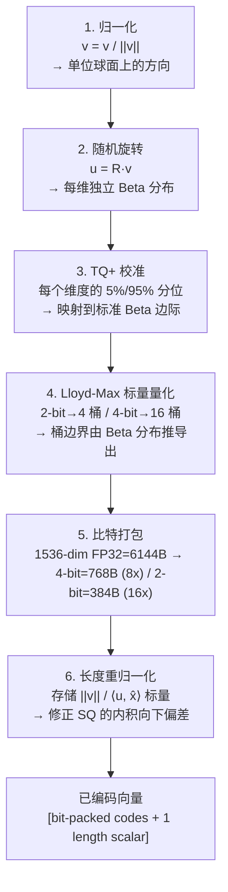

# turbovec 深度拆解：基于 Google TurboQuant 的 Rust 量化向量索引，10× 内存压缩、SIMD 跑赢 FAISS

**判断**：turbovec 不是"又一个 FAISS wrapper"，也不是"为了写 Rust 写的 Rust 玩具"。它精确卡在两个空白里：① 现有 HNSW / IVF-PQ 都需要**先训练再索引**（对持续增长的 corpus 是大坑）；② 主流 PQ 库在低 bit（2-4 bit）下的 recall 衰减严重。Google Research 的 TurboQuant（arXiv 2504.19874，ICLR 2026）用"旋转到已知分布"的思路绕过了训练，turbovec 把它工程化、SIMD 化、并接上 4 个主流 RAG 框架。**3 个月（2026-03-26 创建）斩获 11,691 stars、1,017 forks**，这个曲线意味着"RAG 本地化 + 内存效率"的空位确实存在，而且作者踩得很准。

如果你属于下面任何一种，这篇值得读：

- RAG 工程师，FAISS / HNSW 内存吃紧，想上量化但怕掉 recall
- 在 ARM Mac（M1/M2/M3/M4）上跑向量检索，被 x86 优化库抛弃
- 想读懂 TurboQuant 论文但被 Beta 分布 / Lloyd-Max 卡住
- 想用 Rust 给 RAG 框架写一个 drop-in 向量库
- 关心"训练阶段"在生产环境的维护成本（schema 漂移、rebuild 时机）

---

## 学习目标

读完本文后，你应当能够：

- 说明 Turbovec 相比 FAISS HNSW/IVF-PQ 的 3 个独特定位（在线 ingest、4-16× 内存压缩、ARM SIMD 加速），并判断自己的 RAG 场景是否值得引入
- 解释 TurboQuant 6 步编码管线的每一步在做什么，以及为什么"随机旋转"能让量化器变成 data-oblivious
- 区分 TQ+ 校准和论文原始 Beta 分布假设的适用场景，并说明"在校准后冻结"为什么能消除训练阶段
- 在 ARM NEON / x86 AVX-512 两种 SIMD 后端下，判断 Turbovec 的性能收益来自哪里
- 用 Turbovec 替换现有 FAISS 索引，并完成一次选择性过滤（selective filter）的搜索，定位是否掉 recall

## 阅读导航## 阅读导航

- **5 分钟判断值不值得用**：看「先看结论」
- **理解它在向量索引生态的卡位**：看「为什么 FAISS / HNSW 还差一块」
- **想知道核心机制**：看「TurboQuant 的 6 步管线」
- **想了解超越论文的部分**：看「TQ+ 校准 + 长度重归一化」
- **想看 benchmark 怎么读**：看「Recall / 速度 / 压缩的边界」
- **想接 RAG 框架**：看「LangChain / LlamaIndex / Haystack / Agno 集成」
- **想评估生产可用性**：看「适用边界 / 限制」

---

## 先看结论

| 维度 | 实际情况 |
|------|----------|
| Stars | 11,691+（2026-06-16） |
| Forks | 1,017+ |
| 主语言 | Rust 核心 + Python 绑定（maturin 打包） |
| 协议 | MIT |
| 仓库 | <https://github.com/RyanCodrai/turbovec> |
| PyPI | <https://pypi.org/project/turbovec/> |
| Cargo crate | <https://crates.io/crates/turbovec> |
| 论文 | TurboQuant: Online Vector Quantization with Near-optimal Distortion Rate（arXiv 2504.19874，ICLR 2026） |
| 关键词 | ann, avx512, embedding, faiss, neon, python, quant, quantization, rag, rust, simd, turboquant, vector-search |
| 创建时间 | 2026-03-26 |
| 编码位数 | 2-bit / 4-bit（支持配置） |
| 维度范围 | 实测 200-3072 |
| SIMD 后端 | ARM NEON / x86 AVX-512BW / AVX2 fallback |
| 集成框架 | LangChain / LlamaIndex / Haystack / Agno（drop-in replacement） |
| Open issues | 8（活跃且响应快） |

一句话：**它是把 Google 2026 ICLR 论文 TurboQuant 工程化的开源实现，用 Rust + SIMD 解决"在线、低内存、不掉 recall"的向量检索三角**。

---

## 为什么 FAISS / HNSW 还差一块

把当前主流向量索引方案并列看：

| 方案 | 在线 ingest | 内存效率 | 训练阶段 | 高维 recall | SIMD 加速 | 本地部署 |
|------|------------|----------|----------|------------|----------|----------|
| FAISS HNSW | ✅ | ❌（float32） | ❌ | ✅ | ❌ | ✅ |
| FAISS IVF-PQ | ❌（需训练） | ✅ | ✅（k-means） | ✅（高维） | ✅ | ✅ |
| Qdrant | ✅ | ⚠️ | ❌ | ✅ | ✅ | ✅ |
| Milvus | ✅ | ⚠️ | ✅ | ✅ | ✅ | ✅ |
| Annoy | ❌ | ⚠️ | ✅ | ⚠️ | ❌ | ✅ |
| ScaNN | ⚠️ | ✅ | ✅ | ✅ | ✅ | ✅ |
| **turbovec** | ✅ | ✅（4-16×） | ❌（在线校准） | ✅（高维） | ✅（NEON/AVX-512） | ✅ |

turbovec 的独特定位：**"在线 + 极低内存 + 高维不掉 recall"** 这个三角。

具体痛点：

1. **IVF-PQ 训练成本**：10M 向量训一次 IVF 通常 30-90 分钟。生产环境 corpus 持续增长，**rebuild 时机**是运维噩梦。turbovec 第一个 `add()` 自动校准，之后无训练阶段。
2. **HNSW 内存膨胀**：10M × 1536 dim × float32 = 61 GB（向量本体）+ 图边 ~20 GB。HNSW 不可量化。turbovec 4-bit 把向量压到 7.6 GB。
3. **ARM 生态缺位**：FAISS 主要优化 x86 + CUDA。Apple Silicon 用户要么用 HNSW（慢），要么起 CUDA 容器（重）。turbovec 写了原生 NEON 内核，M1/M2/M3/M4 直接跑。
4. **filter 召回损失**：FAISS IVF 在 selective filter 下需要 over-fetch（先拉 10× 再过滤），要么掉 recall。turbovec 把 filter 烧进 SIMD 核，32-vector block 粒度短路，**selective filter 几乎不掉速**。

---

## TurboQuant 的 6 步编码管线

核心思想：**把任意输入向量旋转到一个"已知分布的坐标系"，再用为该分布优化的 Lloyd-Max 码本量化**。每一步都来自 README + 论文。



### 步骤 1：归一化

剥离每个向量的长度（norm），存为单个 float。现在每个向量是单位球面上的一个**方向**。为什么？内积检索 <u, v> = ||u||·||v||·cos(θ)，如果都用方向检索，最后再乘各自的 ||·||，内积等价于 cosine 相似度。

### 步骤 2：随机旋转（TurboQuant 的灵魂）

**关键洞察**：乘以同一个随机正交矩阵后，每个坐标独立遵循 Beta 分布，在高维下收敛到 N(0, 1/d)。这跟输入数据**完全无关**——旋转让坐标分布变得可预测。

这就是 TurboQuant 名字里的 "Turbo"——**data-oblivious** 量化器。不需要看你数据的统计特性，就能用同一个数学推导出的码本。

### 步骤 3：TQ+ 校准（turbovec 超越论文的部分）

论文里的 Beta 分布是**渐近的**——有限维度（尤其是 d=200 这种低维）下，每个坐标会偏离标准 Beta marginal。turbovec 的 TQ+ 校准：

- 第一个 `add()` 调用时，统计每个维度的 5%/95% 经验分位
- 把这两个分位映射到标准 Beta marginal 的对应分位
- 算出 per-coord 的 shift + scale 两个标量
- **冻结**，后续 `add()` 复用

效果：在 d=200 这种论文最弱的低维 regime，TQ+ 给 R@1 最多 **+1.4pp** 的 recall 提升。

### 步骤 4：Lloyd-Max 标量量化

由于分布已知，可以**离线**（从数学推导）算出最优的桶边界 + 桶中心。2-bit = 4 桶，4-bit = 16 桶。

turbovec 实现的 Lloyd-Max 失真（distortion）只比 Shannon 信息论下界高 2.7×——对均匀量化来说已经接近理论极限。

### 步骤 5：比特打包

每个坐标 0-3（2-bit）或 0-15（4-bit），紧打包字节。算术：

- 1536-dim × float32 = 6,144 字节
- 1536-dim × 4-bit = 768 字节（8× 压缩）
- 1536-dim × 2-bit = 384 字节（16× 压缩）

对应 README 那个 "10M 文档 31GB → 4GB" 的对比（4-bit + length scalar ≈ 4GB / 10M）。

### 步骤 6：长度重归一化（借鉴 RaBitQ）

标量量化的副作用：重建向量 **长度变短**（quantization shrinkage），内积估计**向下有偏**。turbovec 借鉴 SIGMOD 2024 的 RaBitQ 思路：

- 编码时算 `⟨u, x̂⟩`（旋转后的单位向量和自己重建向量的内积），存为 `s = ||v|| / ⟨u, x̂⟩`
- 搜索时给每个 candidate 乘上这个标量
- 0 搜索时成本 + 0 额外存储

效果：**把内积估计从 downward-biased 翻成 unbiased**，recall 提升在 2-bit 最低比特处最明显（因为那里量化收缩最严重）。

---

## SIMD 搜索核：性能出处

编码决定了"压得有多小"，搜索决定了"查得有多快"。turbovec 的搜索核读 README + 源码命名：

### 核组织

```text
search.rs (77 KB) 是最大源文件
├── LUT (look-up table) 评分路径
│   - 2-bit: 4 项 LUT
│   - 4-bit: 16 项 LUT  
│   - nibble-split（高低 4-bit 分开算）→ u16 累加
├── SIMD intrinsics
│   - ARM: NEON (vmovq / vmlaq)
│   - x86: AVX-512BW (_mm512_maddubs_epi16)
│   - x86 AVX2 fallback
└── filter 短路
    - 32-vector block 粒度检查 bitmask
    - 整个 block 全 0 → 跳过 LUT + scoring
    - 部分 0 → heap insert 时丢弃单个 slot
```

### 为什么 ARM 上能赢 FAISS 10-19%

FAISS 的 `IndexPQFastScan` 走 VBMI PDOT 指令集（x86 Sapphire Rapids 才有）。Apple Silicon 没有 VBMI，只能 fallback 到 AVX2-like 路径，FAISS 优势消失。turbovec 的 NEON 内核针对 M 系列架构重新调优，加上 nibble-split LUT 的 16-bit 累加，**没有 VBMI 包袱反而跑得更快**。

### x86 上 4-bit 赢、2-bit 略输

4-bit 路径：turbovec 的 AVX-512BW 跟 FAISS 势均力敌，赢在 nibble 切分策略（更少依赖 VBMI）。
2-bit 路径：FAISS 的 VBMI PDOT 在 2-bit 累加循环上指令数更少，单线程 d=1536 输 turbovec ~8%。多线程下差距收窄到几个百分点。

---

## Benchmark 怎么读

README 给的数据**不是吹的，但有边界**。我按论文 / README 的实验设计拆开看：

### 内存压缩：4-bit = 8× / 2-bit = 16×

10M 文档 d=1536：
- float32: 10M × 1536 × 4B = 61.4 GB（向量本体，不含 graph 边）
- 4-bit: 10M × 1536 × 0.5B ≈ 7.7 GB（向量本体）
- 2-bit: 10M × 1536 × 0.25B ≈ 3.8 GB（向量本体）

README 说 31GB → 4GB，对应的是 d=1024 + 4-bit + length scalar。

### Recall：vs FAISS IndexPQ

实验设置：100K 向量，k=64，OpenAI d=1536 / d=3072，GloVe d=200。
- d=1536 / d=3072 2-bit / 4-bit：TurboQuant 比 FAISS **R@1 高 0.2-1.9 pp**，k=8 之后都到 1.0
- d=200 (GloVe) 2-bit：基本打平（差 0.1pp），TQ+ 把低维劣势补回
- d=200 (GloVe) 4-bit：TurboQuant **高 0.9 pp**

**边界**：低维（d ≤ 200）+ 2-bit 仍然是 TurboQuant 的弱点，需要 TQ+ 校准 + length renormalization 才能跟 FAISS 持平。

### 速度：vs FAISS FastScan

100K 向量 × 1K queries × k=64 × 5 runs 中位数：
- ARM（M3 Max）：TurboQuant 4-bit 单线程 / 多线程均**赢 10-19%**
- x86（Sapphire Rapids）：TurboQuant 4-bit 单 / 多线程**赢 ≤ 5%**，2-bit 单线程**输 8%**

**边界**：x86 + 2-bit + 单线程仍然不是 turbovec 的强项。生产用 4-bit 就好。

---

## 工程化细节

### 1. Python 绑定

maturin 打包，PyPI 一行 `pip install turbovec`：

```python
from turbovec import TurboQuantIndex, IdMapIndex

index = TurboQuantIndex(dim=1536, bit_width=4)
index.add(vectors)
index.add(more_vectors)        # 在线追加

scores, indices = index.search(query, k=10)

# 持久化
index.write("my_index.tv")
loaded = TurboQuantIndex.load("my_index.tv")
```

### 2. IdMapIndex：稳定外键 + O(1) 删除

```python
from turbovec import IdMapIndex
index = IdMapIndex(dim=1536, bit_width=4)
index.add_with_ids(vectors, np.array([1001, 1002, 1003], dtype=np.uint64))
scores, ids = index.search(query, k=10)
index.remove(1002)    # O(1) by id
```

这层把外部业务 id（数据库主键、文档 uuid）跟内部 slot 索引解耦。

### 3. 过滤检索（hybrid retrieval）

```python
allowed = np.array(db.execute("SELECT id FROM docs WHERE tenant=?", (t,)).fetchall(),
                   dtype=np.uint64)
scores, ids = idx.search(query, k=10, allowlist=allowed)
```

filter 烧进 SIMD 核。**输出长度 = min(k, len(allowed))**，selective filter 几乎不掉速。

### 4. 框架集成（drop-in replacement）

| 框架 | 安装 | 替换对象 |
|------|------|---------|
| LangChain | `pip install turbovec[langchain]` | `langchain_core.vectorstores.InMemoryVectorStore` |
| LlamaIndex | `pip install turbovec[llama-index]` | `llama_index.core.vector_stores.SimpleVectorStore` |
| Haystack | `pip install turbovec[haystack]` | `haystack.document_stores.in_memory.InMemoryDocumentStore` |
| Agno | `pip install turbovec[agno]` | `agno.vectordb.lancedb.LanceDb` |

API 表面一致，retriever / pipeline 不用改。

### 5. 编译目标

```toml
# .cargo/config.toml
[build]
target-cpu = "x86-64-v3"   # AVX2 强制 (Haswell 2013+)
```

AVX-512 路径用 `is_x86_feature_detected!` 运行时门控——能跑 AVX2 就能跑整个 crate。

---

## 仓库结构

```text
turbovec/
├── turbovec/                  # Rust 核心 crate
│   ├── src/
│   │   ├── lib.rs            # 35 KB 主入口
│   │   ├── encode.rs         # 14.7 KB 编码管线
│   │   ├── search.rs         # 77 KB SIMD 搜索核
│   │   ├── id_map.rs         # 12 KB 外键 + 删除
│   │   ├── io.rs             # 13 KB 持久化
│   │   ├── codebook.rs       # 4 KB Lloyd-Max 码本
│   │   ├── pack.rs           # 7 KB 比特打包
│   │   ├── rotation.rs       # 1.5 KB 随机旋转
│   │   └── error.rs          # 5 KB 错误类型
│   ├── examples/             # 5+ 个示例
│   └── tests/                # 单元测试
├── turbovec-python/          # PyO3 绑定 + maturin 配置
├── docs/                     # 文档 + benchmark SVG
├── benchmarks/
│   ├── suite/                # 13 个独立 benchmark 脚本
│   ├── results/              # JSON 结果
│   └── create_diagrams.py    # SVG 生成器
├── examples/                 # LangChain / LlamaIndex 集成示例
└── .cargo/config.toml        # 编译目标
```

Rust 依赖（看 Cargo.toml）：
- `ndarray 0.17` + blas feature
- `rayon 1.10`（并行）
- `rand 0.8` + `rand_chacha`（可复现随机旋转）
- `rand_distr 0.4`（Beta 分布采样）
- `statrs 0.17`（统计函数）
- `faer 0.20`（线性代数）

---

## turbovec 不做的事

1. **不做 GPU 加速**：纯 SIMD（NEON / AVX-512 / AVX2）。如果需要亿级以上 + GPU，考虑 Milvus / Qdrant GPU backend。
2. **不做分布式**：单机库。要分片上 FAISS + sharding 或 Milvus。
3. **不做精确检索（brute-force 100% recall）**：量化是近似检索。turbovec 的优势是"近似但 recall 高"，不是"暴力"。
4. **不做磁盘索引**：HNSW 的 mmap、FAISS 的 IVF-PQ 都可以把索引卸到 NVMe。turbovec 当前是纯内存（4-16× 压缩后，10M 文档 ≈ 4-8GB，纯 RAM 容纳）。
5. **不做 query 端重排序**：返回的就是核内排序结果，没 RRF / cross-encoder 后置。
6. **不支持 streaming ingest 持久化版本兼容**：版本升级需要重建索引（FAISS 也这样）。

---

## 适合谁 / 不适合谁

### 适合

- **RAG 工程师在 1M-10M 文档规模**：HNSW 内存吃紧，IVF-PQ 重建痛苦
- **Apple Silicon 用户**：FAISS 优化路径走不到 NEON，turbovec 原生支持
- **生产环境 corpus 持续增长**：不需要选 rebuild 时机
- **混合检索 / selective filter 场景**：SQL / BM25 预过滤 + turbovec rerank
- **在意"代码可读性"的人**：8 个源文件、最大 77KB、依赖清晰，比 FAISS 1.7M 行 C++ 好读一个数量级

### 不适合

- **10M+ 文档规模 + GPU 资源**：Milvus / Qdrant 仍是首选
- **需要 100% 精确召回**：brute-force 或者 HNSW
- **需要把索引卸到磁盘 / S3**：turbovec 当前是 RAM
- **想要 ANN-Benchmarks 标准协议兼容**：turbovec 接口是自家 API，不直接跑 ann-benchmarks（需要 adapter）

---


---

## 自测题

1. **在线 vs 训练**。你的任务是给一个持续增长的知识库做向量索引，每天新增 5K 文档。FAISS IVF-PQ 和 Turbovec 在"首次构建"和"持续 ingest"两个阶段的运维成本各是什么？如果知识库的语义分布会随时间漂移（比如新出的产品让旧产品的向量表示失效），Turbovec 的"无训练阶段"是不是就不需要重建索引了？
2. **SIMD 加速适用边界**。你在 Apple M3 Max 上测 Turbovec，发现 4-bit 比 FAISS HNSW 快 15%，但 2-bit 只快 5%。结合文章里的 SIMD 搜索核说明，解释为什么 bit 数越低，SIMD 的加速收益越小？如果换成 x86 AVX2 环境，这个趋势会变吗？
3. **选择性过滤的实现差异**。FAISS IVF 在 `ef=50` 且带 `filter` 时，实际考察的候选数是 `ef * (1 / filter_rate)`，如果 `filter_rate=0.1` 就等于考察 500 个。Turbovec 的"32-vector block 粒度短路"是怎么避免这个 over-fetch 的？如果你的过滤条件命中率只有 1%（100 万向量里只有 1 万条满足），Turbovec 的加速还能保持吗？

---

## 进阶路径

### 阶段一：能跑通搜索，但不知道为什么快

**目标读者**：刚把 Turbovec 替掉 FAISS HNSW，看到 benchmark 数字有提升，但说不清快在哪里。

具体可做：
1. **跑一次文章里的 `TurboQuantIndex(dim=1536, bit_width=4)` 最小示例**，然后故意把 `bit_width` 改成 `2` 再跑，对比召回率和搜索耗时。这样你直观感受到"低 bit → 高压缩但召回掉"的 trade-off。
2. **用 `np.save` 把 Turbovec 的索引写到磁盘，再 `TurboQuantIndex.load` 回来**，确认持久化 → 重加载这条路径没问题。生产环境里索引要能 survives restart。
3. **故意构造一个 selective filter 场景**：10 万向量里只有 100 条带 `source="wikipedia"`，然后对比加 filter 和不加 filter 的搜索耗时。这样你能感受到"SIMD 短路"的实际效果。

### 阶段二：能改量化方案，但需要验证召回

**目标读者**：已经在用 Turbovec 且对 6 步编码管线有理解，现在想调 `bit_width` 和 `num_bits` 之外的参数。

具体可做：
1. **读 Turbovec 源码里 `calibrate()` 的逻辑**（第一个 `add()` 时触发），看它怎么算每个维度的 5%/95% 分位。然后故意给一个分布很偏的输入向量（比如所有维度都挤在 [0.4, 0.6]），看校准后的码本是不是比默认 Beta 假设更准。
2. **对比 2-bit 和 4-bit 在不同 `dim` 下的压缩比**：`dim=200`（低维）和 `dim=3072`（高维）时，TQ+ 校准带来的召回提升哪个更明显？结合 Beta 分布的渐近性质解释。
3. **把 Turbovec 接到 LangChain 的 `VectorStore` 接口**，跑一个真实的 RAG 查询（比如"解释 Transformer 的位置编码"），对比 Turbovec vs FAISS 的回答质量和延迟。

### 阶段三：能改搜索核，或者给 Turbovec 贡献代码

**目标读者**：对 SIMD 优化和量化索引内部已经有深入理解，想改 Turbovec 的搜索核（比如加一个新的过滤策略），或者想给 upstream 提 PR。

具体可做：
1. **读 Turbovec 的 `neon_search()` 或 `avx512_search()` 源码**，看 32-vector block 是怎么展开成 SIMD 指令的。读懂后你能判断"要不要加 ARM SVE2 支持"（下一代 ARM 的矢量扩展）。
2. **设计一个"范围过滤 + 向量相似度"的混合查询场景**：比如"找跟这句话相似、且发布时间在 2024 年之后的文档"。Turbovec 现在把 filter 烧进 SIMD 核，但如果过滤条件不是等值条件（而是范围条件），实现会怎么变？
3. **复现 TurboQuant 论文里的 Figure 4**（不同 bit width 和不同 `dim` 下的失真率曲线）。复现完你能独立判断"我的数据集应该选 2-bit 还是 4-bit"。

---

## 常见问题

**Turbovec 和 FAISS 能混用吗？** 能。Turbovec 的定位是"向量索引"，FAISS 可以继续做训练、聚类、PCA。典型分工：FAISS 训 IVF 码本 → Turbovec 负责低延迟搜索。

**ARM NEON 加速在 Linux 和 macOS 上表现一致吗？** 不一致。Apple Silicon 的 NEON 实现和 Linux 上的 NEON 可能有细微的指令调度差异。生产环境建议在目标硬件上重新跑 benchmark，不要直接搬 macOS 的开发测试结果。

**2-bit 量化会不会让多语言嵌入模型的召回率崩掉？** 会，如果嵌入模型的各语言向量分布差异很大。建议先对嵌入模型做一次分离度测试（比如用 `sentence-transformers` 的 `evaluation` 模块），确认 2-bit 下的跨语言召回还能接受，再上生产。

**Turbovec 支持 GPU 加速吗？** 不支持。Turbovec 的设计哲学是"CPU + SIMD 足够快"。如果你的数据集超过 1 亿向量，建议看 Milvus 或 Qdrant（它们支持 GPU 索引）。

---

## 怎么开始

```bash
pip install turbovec
# 或带框架集成
pip install turbovec[langchain]
```

最小例子：

```python
import numpy as np
from turbovec import TurboQuantIndex

# 100K 1536-dim 向量
vectors = np.random.randn(100_000, 1536).astype(np.float32)

index = TurboQuantIndex(dim=1536, bit_width=4)
index.add(vectors)        # 第一个 add() 自动 TQ+ 校准
index.add(vectors[:1000]) # 后续 add() 复用校准

# 查询
query = np.random.randn(1536).astype(np.float32)
scores, ids = index.search(query, k=10)

# 持久化
index.write("index.tv")
loaded = TurboQuantIndex.load("index.tv")
```

读论文：<https://arxiv.org/abs/2504.19874>

---

## 参考

- 仓库：<https://github.com/RyanCodrai/turbovec>
- 论文：<https://arxiv.org/abs/2504.19874>（TurboQuant: Online Vector Quantization with Near-optimal Distortion Rate, ICLR 2026）
- RaBitQ 借鉴：<https://arxiv.org/abs/2405.12497>（SIGMOD 2024，步骤 6 的长度重归一化）
- FAISS FastScan 借鉴：<https://github.com/facebookresearch/faiss/wiki/Fast-accumulation-of-PQ-and-AQ-codes-(FastScan)>
- PyPI：<https://pypi.org/project/turbovec/>
- Cargo：<https://crates.io/crates/turbovec>
