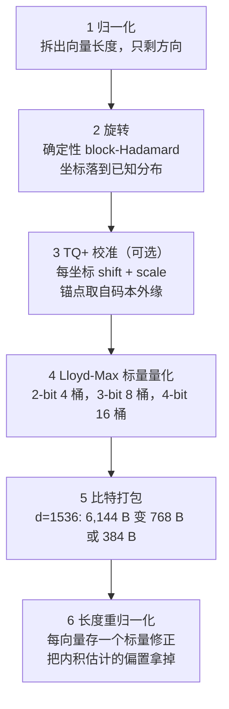

## 先给判断

turbovec 省掉的不是磁盘，也不是内存，是**训练这一步**。

带量化的向量索引通常分两半：先跑一遍数据学码本——IVF 要聚类选中心，乘积量化（Product Quantization，PQ）要学子空间划分——再把数据压进学到的码本。前半段决定后半段能压多小，所以语料一涨、分布一漂，就要重新训一遍再重建索引。turbovec 走的路线是：先用一次随机旋转把任意输入推到"分布已知"的坐标系里，码本就从数学推导里来，不必从你的数据里来。Google 那篇 TurboQuant 论文给这个性质起了名字叫 data-oblivious，并证明了它的失真率下界；turbovec 是把它写成 Rust、配上 SIMD 搜索核、再包上 Python 接口和一套持久化格式的那份代码。

第二件事更重要，也更不显眼：**它把压缩后的编码按 SIMD 寄存器能直接做点积的顺序存**。压得多小是码本决定的，查得多快是这份布局决定的，而后者才是它跑在 FAISS 前面的原因：4-bit 那一档，在它自己测的每个配置上都快过对应的对照物，单线程 0.739 ms 对 2.565 ms（d=1536，x86）。

版本坐标要说清楚，因为 1.0 之前它一直在动。turbovec 2026-03-26 建仓库，2026-08-18 发 1.0.0，Rust crate 和 Python 包第一次合到同一个版本号（之前分别漂到 0.9.0 和 0.8.0）。1.0 承诺的东西也写得很具体：磁盘格式 v7，也就是这个版本写出的文件，往后的版本仍然要读得动。

本文的核对基准是 2026-09-19 的 `main`（提交 `ccab9f3`，标题就是 `release: 1.0.0 (#537)`，仓库最后一次推送 2026-09-13）。仓库元数据取自 GitHub API（应用程序接口）当日读数：17,201 stars、1,472 forks、17 个开放 issue、7 名贡献者（含 dependabot）。crates.io 上 1.0.0 累计 60,037 次下载。逐条核实过的材料依次是 README、`turbovec/src/` 源码、`docs/api.md`、`CHANGELOG.md`、`Cargo.toml`、`.cargo/config.toml`，加上 `benchmarks/suite/` 的 75 个脚本与 `benchmarks/results/` 的 JSON，以及论文 arXiv:2504.19874。凡是只出现在 README 首页、源码里找不到对应的东西，下面都标了出处。

## 先分清三样东西

读者最容易把下面三层搅在一起，拆开之后再看细节会省事很多：

| 层 | 具体是什么 | 谁在维护 | 会怎么变 |
|----|-----------|---------|---------|
| 算法 | TurboQuant：随机旋转 → 坐标服从 Beta 分布 → 逐坐标最优标量量化 | 论文作者 | 论文还在动（arXiv API 的 updated 字段是 2026-09-19），性质和码本推导则是稳定的 |
| 编码格式 | turbovec 的 v5 / v6 / v7 文件布局 | 仓库 | 1.0.0 起只读写 v7；v1–v4 完全解不开 |
| 搜索核 | NEON SDOT/SMMLA、AVX-512 VNNI + `vpermb`、AVX2、标量兜底 | 仓库 | 每次性能爬坡都动它，`benchmarks/hillclimb/` 里有逐条假设的日志 |

论文一侧的归属也要写准。作者四位：Amir Zandieh 与 Vahab Mirrokni 在 Google Research，Majid Hadian 在 Google DeepMind，Majid Daliri 在纽约大学。turbovec 的 README 把它称作 "Google Research 的 TurboQuant"，并把 "(ICLR 2026)" 写在引用行里；arXiv 的摘要页只有 "25 pages"，没有会议字段。所以"ICLR 2026"这个说法目前的出处是 turbovec 仓库，不是 arXiv。

## 它比的是 FAISS 的哪一个索引

这是最容易读错的一步。turbovec 不是 HNSW 的替代品，它对照的是 FAISS 的乘积量化家族：召回率比 `IndexPQ`（LUT256、`nbits=8`、float32 查找表），速度比 `IndexPQFastScan`。README 明说这个选择是故意的——`IndexPQ` 是多数生产用户真会用的那个，比论文里自带的 u8 查找表自定义 PQ 更难打。

顺带纠一个常见误解：**HNSW 不是不能量化**。FAISS 主线里就有 `IndexHNSWPQ`、`IndexHNSWSQ`，还有 `IndexHNSWRaBitQ`。"HNSW 必须 float32 存原始向量"这句话在 2026 年已经不成立。turbovec 和它们的差别不在能不能量化，而在图索引的邻居表本身那份内存开销，以及量化之后搜索还要不要沿图走。

能确实核实的差异，是下面这张表。它只列仓库自己给了证据的格子：

| 维度 | turbovec 1.0.0 | FAISS `IndexPQ` / `IndexPQFastScan` |
|------|----------------|-------------------------------------|
| 首次索引前的准备 | 无训练步骤；码本由 `codebook(bit_width, dim)` 从 Beta 分布推导 | `IndexPQ` 要 `train()`，学的是子空间划分 |
| 追加向量的代价 | 单条 `add()` 6.3–19.7 µs；100 条一批摊到 4.6–16.3 µs/条 | README 对照表里给的是同一测法下慢 7.6–13.9 倍（单条） |
| 按 id 删除 | `IdMapIndex.remove()` O(1) swap-and-pop，0.44–1.22 µs | `IndexIDMap` 上的 `remove_ids` 每次重排存储编码：100K 规模下单条 0.19–1.02 **秒** |
| 带过滤的 top-k | 谓词进核内，块粒度短路，返回 `min(k, 允许条数)` | 需要 over-fetch 再丢弃，或者自己循环取更多候选 |
| 增量落盘 | `sync(path)` 只写变化的块，一次 `sync_all` | 对照表里没测这一项，`write_index` 是整体重写 |
| 多精度、GPU、IVF 粗量化 | 都没有 | 都有 |

最后一行是它让掉的东西，不是它赢来的东西。

## 编码这条线：六步，以及三步和论文不一样

README 的 "How it works" 给了一个六步编号列表，下面逐步说清"是什么"，并把 turbovec 与论文不同、或者仓库内部口径不一致的地方单独标出来。


```mermaid
flowchart TB
  A["1 归一化<br/>拆出向量长度，只剩方向"] --> B["2 旋转<br/>确定性 block-Hadamard<br/>坐标落到已知分布"]
  B --> C["3 TQ+ 校准（可选）<br/>每坐标 shift + scale<br/>锚点取自码本外缘"]
  C --> D["4 Lloyd-Max 标量量化<br/>2-bit 4 桶，3-bit 8 桶，4-bit 16 桶"]
  D --> E["5 比特打包<br/>d=1536: 6,144 B 变 768 B 或 384 B"]
  E --> F["6 长度重归一化<br/>每向量存一个标量修正<br/>把内积估计的偏置拿掉"]
```

**步骤 1 归一化。** 每条向量拆出一个长度存成单个浮点，剩下的坐标落在单位球面上。内积检索于是可以先算方向、再乘回各自的长度。

**步骤 2 旋转，以及一次被隐掉的重写。** 这一步是全部机制的地基：乘同一个正交矩阵之后，每个坐标独立服从 Beta 分布，高维下收敛到近似高斯。论文 §1.3 写的是收敛到 `N(1, 1/d)`，README 写的是 `N(0, 1/d)`，两处口径不一致；工程侧不用选，`turbovec/src/encode.rs` 的 `tqplus_anchor` 里注释写清了它自己的约定——Beta 定义在 `[0,1]`，"canonical marginal" 是它平移到 `[-1,1]` 的版本，所以对称中心是 0。

真正值得记的是 1.0 里换掉的实现。**0.9.0 及之前这一步真的在乘一个稠密随机正交矩阵**（对高斯矩阵做 QR 分解）；现在换成了全局置换加分块 Hadamard 变换（`turbovec/src/rotation.rs`）。设 `B` 为 `dim` 的最大 2 的幂因子——`dim` 是 8 的倍数，所以 `B ≥ 8`。一轮做三件事：先做一次跨全部 `dim` 个坐标的 Fisher-Yates 置换，再做一次逐坐标 ±1 符号翻转，最后在每个连续 `B` 坐标块内部做归一化 Walsh-Hadamard 变换（乘 `1/√B`）。置换和符号都取自 ChaCha8 的字节流。轮数是常量 `K = 2`，注释标了 DO NOT CHANGE：它是 v5 起磁盘格式契约的一部分，改动等于废掉所有存量索引。整个变换没有矩阵、没有 GEMM，每一步只是加、减和乘一个固定常数，归约顺序写死，也不用 FMA。

置换排在一轮的最前面是有理由的：**块不能由输入里的相邻坐标凑成**。embedding（嵌入向量）里有一类坐标是按重要性排的，也就是 matryoshka / MRL 那种，`rotation.rs` 点名了 OpenAI text-embedding-3 与 Nomic。PCA 投影后的向量也一样，能量随坐标下标单调下降。这类输入直接切块，每个块就成了一小段"高能量相邻坐标"，Hadamard 去相关不了。先做一次全局置换，变换就对坐标顺序不敏感了。

换来的性质是**跨平台逐位一致**。旧那条路做不到，而且原因有三个，`rotation.rs` 的注释逐个点了名字（issue #206）。一是它读全局 rayon 线程池、又用 `faer` 那套顺序相关的并行 Householder 归约，于是输出随 `RAYON_NUM_THREADS` 变化，`dim ≥ 1536` 时就会。二是高斯采样用的是 transcendental Ziggurat，`dim ≥ 3072` 时结果会随 libm 实现漂移。三是旋转矩阵乘法被派发到各操作系统各自的 BLAS 后端，所以**编码字节按平台不同**。分块 Hadamard 从构造上把这三个来源一起去掉，顺带甩掉 42 MB 的 OpenBLAS 依赖。这也是 `Cargo.toml` 里 `rand_chacha` 被钉成 `=0.3.1` 的原因：那串字节流已经写进 v5 之后编码的每一条向量里，上游一个小版本改了字节流，就等于悄悄废掉全部存量索引。

这条历史对读者的实际含义：1.0.0 读不懂 v5 之前的文件，因为那些码是在一个本构建复现不出来的旋转下编出来的。`docs/api.md` 的说法是 v1–v4 只能从原始向量重建。

**步骤 3 TQ+ 校准。** 论文里没有叫 "TQ+" 的变体，这个名字是 turbovec 给"校准后的 TurboQuant"起的。它要补的洞很具体：Beta 分布是渐近结论，有限维度、尤其是坐标分布有重尾的时候，个别坐标会偏离标准形状，直接套码本就要吃亏。做法是给每个坐标配一个 shift 和一个 scale，把这条坐标的经验分位映射到码本最外缘那对质心上。

映射到哪一档概率，是这一步的全部技术含量所在，而它踩过一次坑。早期版本固定取 5%/95%。`encode.rs` 的注释把改掉的动机写成了数字：超过最外层质心的值本来就会塌进同一个桶，误差无上界，所以正确的锚点应该是 `P(|x| ≤ c_outer)`——码本停在哪里，就锚在哪里。这个点在 2-bit 约 0.933，3-bit 约 0.984，4-bit 约 0.996，**跟着位宽走，不能是常数**。固定 0.95 只在 2-bit 侥幸对了：在 3 和 4 bit 上它拟合的是一个内部量子点，把尾巴抻到码本最高层之外很远。注释给的实测例子是在 lastfm-64（逐坐标峰度 26）上，4-bit 的拟合把数据放大了 2 倍，第 99.9 百分位落在 |x| ≈ 1.33，而最外缘质心只有 0.313，R@10 于是从恒等映射的 0.4835 掉到 0.1439；换成按码本取锚点后是 0.6022。这条改动记为 #454。

**校准是显式的，索引自己不会去拟合。** 必须调一次 `idx.calibrate(sample)`（Rust 侧是 `calibrate` / `calibrate_2d`），此后状态被提交并被每次 `add()` 复用；`idx.calibration_state` 只会报 `"uncalibrated"` 或 `"calibrated"` 两个值之一。从来没校准过的索引就是普通 TurboQuant，而且它的编码字节与 `add()` 怎么分批、什么顺序无关。

样本量给的是建议而非强制：`RECOMMENDED_CALIBRATION_ROWS = 1000`，`MIN_CALIBRATION_ROWS = 2`。下限 2 行是结构边界——锚点需要每条坐标一对有序统计量；再往上都是质量判断，语料本来就不足时全量喂进去也比不喂好。注释里的实测是：1000 行随机抽样与用整份 10 万行语料拟合相比，R@10 最多差约 0.5 个百分点。四份语料的对照如下，只有 gte-small-384 跑了三个种子：

| 语料 | 1000 行抽样 R@10 | 全量拟合 R@10 |
|------|-----------------|--------------|
| gte-small-384 | 0.9034 / 0.9027 / 0.9056 | 0.9083 / 0.9082 / 0.9082 |
| OpenAI-1536 | 0.9655 | 0.9661 |
| GloVe-200 | 0.8746 | 0.8757 |
| SIFT-128 | 0.8537 | 0.8514 |

全部前提是这个抽样**随机**——同样大小的有序或聚簇样本会拟出一对偏移且过窄的分位数，把召回率打掉。

还有两个只在事后才看得见的代价。第一，`calibrate()` 在已填充的索引上会用手里的码重编每一行（不需要原始向量），所以"先灌一大批未校准的、再校准"比"先校准再加"要差几个点召回——重编是第二次量化。第二，如果先前那次校准偏得很厉害，重拟合救不回来：过窄的拟合在编码时已经把坐标裁到最外缘质心上，裁掉的信息不在码里，只能从原始向量重建。

收益侧仓库给两个数：`docs/api.md` 说平均约 +2.5 个百分点 R@10，各向异性最强的一档上到约 +8.7；README 的步骤 3 说在最漂的格子（GloVe 2-bit）上 R@1 最多 +2.2pp。这两句和下面的 JSON 实测是能对上的。

**步骤 4 Lloyd-Max 标量量化。** 分布既然已知，桶边界和质心就从公式算，与你的数据无关，一次算好按位宽存着。README 给的位置是：这套码本的均方误差失真落在香农率失真下界的 2.7 倍以内。这句话容易读成"只差 2.7 倍所以不够好"，实际它是论文用 Yao 的极小极大原理证出来的那类常数因子——论文 §3.3 给的下界形式是 `D_prod(Q) ≥ (1/d)·(1/4^b)`，任何随机化量化器都绕不过去。顺带说清：Lloyd-Max 是**非均匀**量化，"均匀量化已经接近理论极限"那种说法是把两件事说反了。

**步骤 5 比特打包。** 每坐标变成一个 0–3 或 0–15 的小整数，紧排进字节。`d=1536` 时 6,144 字节变 768 字节（4-bit，8×）或 384 字节（2-bit，16×），3-bit 落在中间。

README 首页那句 "10M 文档 float32 要 31 GB，turbovec 装得进 4 GB" 没写维度，别默认它是 d=1536。仓库实测的 4-bit 压缩比是 8.0×（见下节），31 GB → 4 GB 正好就是这个 8 倍；反推每条约 3.2 KB，即 float32 下 768 维上下。真要放 10M 条 d=1536 的向量，float32 是 61.4 GB（十进制），4-bit 后约 7.7 GB。差的那一档不是它做不到，是首页那句话换了一个更小的维度。

**步骤 6 长度重归一化。** 标量量化有个系统性副作用：重建出来的单位方向总比原向量短一点，于是内积估计向下有偏。turbovec 的补法是在编码时多算一次内积 `⟨u, x̂⟩`（旋转后的单位向量和它自己重建出来的向量之间），把 `||v|| / ⟨u, x̂⟩` 存成每向量一个标量；搜索核在压堆之前拿它乘一下候选得分。估计量从 downward-biased 变成无偏，查询时零额外计算、零额外存储；编码侧每向量多一个 `d` 维点积，README 给量级是 100 万条 d=1536 不到一秒，一次性的入库成本。收缩最严重的低比特处收益最大。

这里有一处措辞值得较真。README 的引用段说这一步借鉴的是 RaBitQ（arXiv:2405.12497，SIGMOD 2024）的每向量长度修正。而论文自己的 §3.2 "Inner-product Optimal TurboQuant" 已经处理过同一个问题：它的路线是接在一种基于 sketching 的 1-bit 量化上，拿无偏的内积估计，摘要里那句"MSE 最优的量化器会在内积估计上引入偏置，我们给出无偏估计量"讲的就是这一节。所以更准确的说法是：**问题论文也解了，turbovec 选了另一条更便宜的路**，把两阶段估计换成每向量一个标量。哪个更好，仓库没测，两边的数字也没在同一份语料上对过。

## 搜索核：为什么 4-bit 反而比 2-bit 快

编码决定压多小，布局决定查多快。三件事按顺序发生：查询向量旋转进同一个坐标系，码本值建一张查找表（LUT），然后把编码和 LUT 喂给 SIMD 核。2-bit 一张 4 项表，4-bit 一张 16 项表，查完在 u16 累加器里加。

看仓库自己发出来的每查询毫秒数（100K 向量、1K 查询、k=64、5 次运行的中位数；ARM 是 GCP c4a-standard-8 / Google Axion 8 vCPU，x86 是 Xeon Platinum 8481C / Sapphire Rapids 8 vCPU）：

| 环境 / 线程 | d=1536 4-bit（turbovec / FAISS） | d=1536 2-bit | d=3072 4-bit | d=3072 2-bit |
|------------|----------------------------------|--------------|--------------|--------------|
| ARM 单线程 | **1.095 / 4.023 ms**（3.67×） | 1.566 / 2.026（1.29×） | 2.364 / 7.947（3.36×） | 3.178 / 3.946（1.24×） |
| ARM 8 线程 | **0.143 / 0.499**（3.49×） | 0.195 / 0.248（1.27×） | 0.285 / 0.987（3.46×） | 0.403 / 0.491（1.22×） |
| x86 单线程 | **0.739 / 2.565**（3.47×） | 0.961 / 1.225（1.27×） | 1.480 / 5.208（3.52×） | 1.934 / 2.556（1.32×） |
| x86 8 线程 | **0.185 / 0.590**（3.19×） | 0.282 / 0.297（1.05×） | 0.346 / 1.177（3.40×） | 0.514 / 0.592（1.15×） |

倍数是直接用 JSON 里的 `faiss_ms_per_query / tq_ms_per_query` 算的，四档 4-bit 的均值分别是 ARM 3.5×、x86 3.4×，与 README 正文一致。

这张表最该读出来的一条，不是 turbovec 赢多少，而是**同一套代码里 4-bit 比 2-bit 更快**：x86 单线程 d=1536 是 0.739 对 0.961 ms。想"把比特压到 2 换速度"，在这里是反向操作。

原因在指令形状上。4-bit 的路径可以直接用点积指令把编码和 LUT 表项逐字节相乘累加——ARM 侧是 SDOT / SMMLA，x86 侧是 AVX-512 VNNI 的 `_mm512_dpbusd`。2-bit 只有 4 个码字，一次长累加攒不满，于是 turbovec 改用 `vpermb` 做字节级查表（对应 `search.rs` 里的 `search_single_query_vnni_blk2`、`score_block_permute_smmla_neon` 这类函数），累加循环短，指令数反而占多。README 的说法与此一致：2-bit 那一档是 `vpermb` 的 LUT scan 在扛短的 2-bit 累加循环。

表里第二个信号：**最弱的格子是 x86 多线程 2-bit，只有 1.05×**（0.282 对 0.297 ms）。仓库首页那句 "beat FAISS in every measured config" 在这个格子上是真的，但"赢 5%"和"赢 3.5 倍"在容量规划上不是同一件事。

还有一个只在源码里看得到的闸门：`BLOCK = 32`，单条查询要不要走块级并行，取决于块数是否到 `SINGLE_QUERY_PARALLEL_MIN_BLOCKS = 1024`，也就是**向量数过 32,768 才开**。这个数字是量出来的——注释给了 A/B（14 核 arm64、dim=128、k=10、nq=1）：n=8192 时并行只有 0.64×，16384 时 0.77×，32768 时 0.98×，65536 时 1.34×。阈值之前是 256 块（约 n=8192 就开池），那时候一次线程池交接比整趟扫描本身还贵。CHANGELOG 里 1.0.0 修的那个"aarch64 上索引一过 32768 条搜索就变慢"，是同一个边界上的另一件事。

## 数字怎么读：召回、压缩与运维面

### 召回：给 FAISS 同样的字节预算

召回率的实验设置是：100K 向量、k=64、种子 42，对照 `IndexPQ(m, nbits=8)`，并且 `m` 按 turbovec 的码率配平——2-bit 用 `m = d/4`，4-bit 用 `m = d/2`，两边每条向量都是同样多的字节。校准样本 1024 行。`benchmarks/results/recall_*.json` 里同时存了 `tq_recalls`（未校准）、`tqplus_recalls`（校准后）和 `faiss_recalls` 三列。

| 数据集 / 位宽 | R@1 FAISS | R@1 未校准 | R@1 校准后 | k=8 之后 |
|--------------|-----------|-----------|-----------|---------|
| OpenAI d=1536 2-bit | 0.872 | 0.888 | **0.901**（+2.9pp） | 双方 1.0 |
| OpenAI d=1536 4-bit | 0.966 | 0.967 | 0.959（**−0.7pp**） | 双方 1.0 |
| OpenAI d=3072 2-bit | 0.912 | 0.915 | **0.931**（+1.9pp） | 双方 1.0 |
| OpenAI d=3072 4-bit | 0.972 | 0.972 | **0.981**（+0.9pp） | 双方 1.0 |
| GloVe d=200 2-bit | 0.5643 | 0.5503 | 0.5723（+0.8pp） | FAISS 从 k≈8 起小幅领先（0.9252 对 0.9226） |
| GloVe d=200 4-bit | 0.841 | 0.8583 | 0.860（+1.9pp） | 双方向 1.0 收敛 |

三个数字层面的判断。第一，OpenAI 那两个高维档上，四格里三格校准后赢 FAISS，但差距只在 R@1、R@2 看得见——k 到 8 双方都是 1.0，所以这张表**不支持**任何"k 越大差得越多"的读法。第二，d=1536 4-bit 那一格校准后反而输给未校准（0.959 对 0.967），README 自己也把它列成落后的那一格；校准不是白拿的。第三，真正有信息量的是 GloVe d=200：未校准的 TurboQuant 在 2-bit 上明确落后 FAISS（0.5503 对 0.5643），TQ+ 把它翻成领先；而低维这一档上双方都不是满分召回，R@1 只有 0.55–0.57，k 要到 64 才逼近 1.0。低维词向量风格嵌入才是量化的难处所在，选它当唯一测试集是诚实的，选它当结论是危险的。

### 压缩：实测比值和理论比值的差在哪

`benchmarks/results/compression.json` 测的是 100K 向量的落盘体积（单位 MiB），`fp32_mb` 是同一批向量的 float32 大小：

| 数据集 / 位宽 | float32 | 索引 | 压缩比 |
|--------------|---------|------|--------|
| GloVe d=200 4-bit | 76.3 | 9.9 | 7.7× |
| GloVe d=200 2-bit | 76.3 | 5.1 | 14.8× |
| OpenAI d=1536 4-bit | 585.9 | 73.6 | **8.0×** |
| OpenAI d=1536 2-bit | 585.9 | 37.0 | **15.8×** |
| OpenAI d=3072 4-bit | 1171.9 | 146.9 | 8.0× |
| OpenAI d=3072 2-bit | 1171.9 | 73.6 | 15.9× |

d=1536 4-bit 纯编码是 768 B/条，实测 73.6 MiB/100K ≈ 772 B/条，多出来的是每向量那个长度标量、码本和头部；2-bit 同理。所以压缩比要按 8.0× / 15.8× 记，不是"8× 整"。d=200 那一档掉到 7.7× / 14.8×，也是这个固定开销在低维下占比更高。

### 运维面：这才是仓库最舍得给数字的地方

搜索速度只是它测的四类之一。另外三类是插入、删除和落盘，全都用同一份 100K 语料、5 次中位数、并且**把调用方真正付的 Python 每操作开销计进去**：

- 单条 `add()` 到已建好的热索引上：6.3–19.7 µs，比 FAISS 的单条 `add()` 快 7.6–13.9 倍。
- 100 条一批：摊到 4.6–16.3 µs/条，比同批量灌进 FAISS 快 4.6–15.1 倍。
- `IdMapIndex.remove(id)`：O(1) swap-and-pop 加 id 表维护，n=1 时 0.44–1.22 µs、n=100 时 0.59–1.37 µs。
- FAISS 侧同一个用户可见操作（在 `IndexIDMap` 包住 `IndexPQFastScan` 上调 `remove_ids`）：100K 规模下单条 **0.19–1.02 秒**，每次调用都要重排存储的编码，代价随码长翻倍。删除图用的是对数轴。

这四条放一起才说明"在线"这个词的分量：turbovec 省掉的是训练步骤，但真正的运维差别体现在**删除**。一个每天要删旧文档的知识库，在 FAISS 那条路上每次删除付掉几百毫秒到一秒的重排；在这里是微秒。README 没测的边界也要说：这个对比是 100K 规模、单条操作，不是亿级；FAISS 那侧的数字是 `remove_ids` 的用户可见代价，不等于它的批量重建策略。

## 一次带租户过滤的检索走过什么

把上面的东西串起来。一个多租户 RAG（检索增强生成）服务，索引里 200 万条文档向量（d=1536、4-bit、`IdMapIndex`），现在要回答一个只该看 tenant=42 那批文档的问题：

1. **建索引。** `IdMapIndex(dim=1536, bit_width=4)`。此刻 `dim` 已提交，`calibration_state` 是 `uncalibrated`。
2. **先校准，再灌数据。** 从目标语料里随机抽 1024 行喂 `idx.calibrate(sample)`。这一步放在 `add_with_ids` 之前，因为放在之后要付第二次量化的损失（`docs/api.md` 明说"先灌一大批未校准的再校准，比先校准再加差几个点"）。
3. **入库。** 每条 `add_with_ids` 触发：拆长度存标量 → 两轮 block-Hadamard 旋转 → 乘上第 2 步冻结的 per-coordinate shift/scale → 查码本取 4-bit 码字 → 打包进所在的那个 32 向量块。编码字节当场决定，没有回头重训。
4. **业务侧收窄候选。** SQL 先算出 tenant=42 的 3 万个文档 id。
5. **检索。** `idx.search(query, k=10, allowlist=allowed_ids)`。查询走同一条旋转，建 16 项 LUT，然后进 SIMD 核：每 32 条一块，整块都不在允许集合里就直接短路，连 LUT 和打分都不做；块内不允许的槽在压堆那一步被丢掉。
6. **还原。** 每条候选的得分乘上它自己那个 `||v|| / ⟨u, x̂⟩` 标量，进大小为 10 的堆。返回 `(scores, ids)`，`ids` 是第 3 步传进去的那批 uint64 业务 id，输出形状 `(1, min(10, 30000))`，没有 −1 或 NaN 填充。
7. **落盘。** `idx.sync("index.tvim")`：只写变化的块加一个提交头，一次 fsync。

上面第 5 步那个 allowlist，换一个索引类型就是完全不同的坑。**`TurboQuantIndex` 收的是 `mask`（按槽位的布尔数组），而任何一次改动都让 mask 失效**——不只是改长度的那种。`swap_remove(i)` 会把最后一条搬到槽位 i 上，所以 `swap_remove(i)` 加一次 `add(...)` 会把 `len(idx)` 还原成原样，而槽 i 里已经是另一条向量；长度检查只比长度，这种 mask 校验通过，然后安静地筛了一批你并不想筛的向量。仓库写得很直白：索引外面不漏东西，也不报错，选中的集合就是错的。`IdMapIndex` 的 allowlist 没有这个失效路径，因为它指的是外部 id，而索引从不重编号——代价是 allowlist 里出现一个已被删除的 id 会抛 `KeyError`（Rust 侧 `SearchError::UnknownId`），而不是悄悄解析到别的向量上。要跨删除持有引用，就用 `IdMapIndex`。

## 持久化这条线：三种写法，和一个没有校验和的事实

三个 API 各管一件事：`write(path)` 整体重写；`sync(path)` 增量提交；`to_bytes()` / `from_bytes()` 内存序列化。

`write()` 的原子性靠临时文件加 rename，末尾 fsync。`durable=False` 跳过 fsync，快，但断电可能丢整个文件；`durable=True` 时如果 rename 之后的目录 fsync 失败，保存仍然算成功（文件已提交可见），只抛一个 `RuntimeWarning` 说明这次 rename 不一定挺得过掉电。Rust 侧不是布尔参数而是 `write_with_durability(path, io::Durability::Fast | Durable)`。

`sync()` 是 1.0 加的第二种容器格式（magic `TV7\0`，内部 `V7_VERSION = 2`），为反复小提交而设计。追加只写新的 32 行块和一个提交头；删除干脆不写块，挂在提交头的 redo 操作上，后面某次同步再把它折进块里。只有两种事件会整份重写：显式一次 `calibrate()`（要重编所有码），以及累积删除多到超过提交头的操作容量。加载进来的索引绑在它来源那条路径上，后续继续增量往前同步。

持久性上，每次 `sync()` 返回即已落盘，没有 fast 模式，fsync 用的是 `sync_all` 而不是只刷数据的变体。文件里放两个交替使用的提交头，写坏一头就用另一头；每个头都点名自己那批块和块的摘要，所以"头落盘了、数据还没落盘"这种提交会被检出，而不是当成有效状态端出去。每次全量写还会盖一个随机 nonce，别的进程换掉了同一个路径，下一次 `sync()` 会报出来而不是覆盖人家的提交——但两个进程并发同步同一个路径仍然不支持，这个检查只是让不支持变得吵，不是把它变安全。反过来 `from_bytes` 只认 `write()` 那种容器：v7 需要随机访问（两头提交记录、定长块、redo 操作），字节流满足不了。

格式版本这一层，1.0.0 是硬切：只读写 v7，早期版本写的 `.tv` / `.tvim` 直接拒读（错误里点名它是哪个版本，不会误读）。新增的 `turbovec::convert` 在 v5/v6/v7 之间双向搬运（`cargo run --example convert -- <in> <out> v7`），所以老文件不必重建；v1–v4 因为旋转换过实现，只能从原始向量重建。v7 文件旧版本读不了，它们的加载器是拒绝版本字节而不是错误解析。

最该提前知道的一件事：**两种格式都不校验载荷完整性**。头部、码本、scale、校准尾段是值级检查（要求有限、在支撑范围内），但码字节一个校验位都没有。仓库做了个彻底的实验：把一个 4,114 字节 `.tv` 文件的 32,912 个比特逐个翻一遍再加载，结果 1,460 次（4%）被拒，**31,452 次（96%）加载成功并返回一个不同的索引**。分节看更清楚：144 个头部比特全被拦，992 个码本比特拦下 988，3,072 个 scale 比特拦 169，4,128 个校准尾段拦 159，而 24,576 个码比特拦下 **0**。这不是疏漏而是划界：写路径是原子的，写不出撕裂的索引；写完之后从外面进来的损坏（坏盘、截断的拷贝、传输出错）不在范围内。要检出来，自己给文件加校验和，或者放在有校验的文件系统上。

加载侧倒是做了实事：文件里存的就是核内要用的顺序布局，所以没有 O(n·dim) 的重排、也没有首查前解码本；x86 在加载时做一次块内 nibble 交错（线程化 SIMD，77 MB 索引约 2 ms），旋转由 `dim` 重建、不到 1 ms，跨平台 load → re-save 逐字节一致。

## API 表面与硬约束

```python
from turbovec import TurboQuantIndex, IdMapIndex
import numpy as np

# 1) 建：bit_width 取 2/3/4；dim 必须是 8 的正整数倍且 <= 16384
idx = IdMapIndex(dim=1536, bit_width=4)

# 2) 先校准，再灌：sample 是随机、有代表性的 ~1024 行 float32
idx.calibrate(sample)                    # 可选；不做就是普通 TurboQuant
idx.add_with_ids(vectors, ids)           # vectors: C 连续的 (n, dim) float32
idx.sync("docs.tvim")                    # 增量落盘，返回即持久

scores, ids = idx.search(query, k=10, allowlist=allowed_ids)
ok = idx.remove(1002)                    # O(1)，返回 id 在不在
idx.dim, idx.bit_width, idx.calibration_state
```

Rust 侧的构造函数是 `TurboQuantIndex::new(dim, bit_width)`（`new_lazy` 允许延后定维度，但懒索引第一次必须用 `add_2d(vectors, dim)`，扁平的 `add(&[f32])` 在未提交维度时会 panic——这是 Rust 特有的，Python 数组自带形状）。带 `Result` 的入口是 `try_search` / `try_search_with_mask` / `try_search_with_allowlist`，直接返回元组的那几个是对应条件下的 panic 版本。

约束清单，全部来自 `docs/api.md` 与 `error.rs`：

| 约束 | 具体值 | 不满足时 |
|------|--------|---------|
| 位宽 | `bit_width ∈ {2, 3, 4}` | `ConstructError::BitWidthOutOfRange` |
| 维度 | 8 的正整数倍，`≤ 16384`（`MAX_DIM`） | `ConstructError::DimNotPositiveMultipleOf8` / `DimTooLarge` |
| 输入 dtype | 必须是连续 float32，不做隐式转换 | `ValueError`，而不是悄悄 `astype` |
| 坐标幅度 | 非有限值或 `|value| ≥ 1e16` 拒收 | `ValueError`（`InvalidQueryValue` 在 Rust 侧） |
| 极小范数向量 | L2 范数 `≤ 1e-10` 没有可表示方向 | 以 scale 0 存下，对所有查询得分 0 |
| 空 allowlist | — | `ValueError`（Rust `SearchError::AllowlistEmpty`） |
| 未知 id | allowlist 里含已删除的 id | `KeyError` / `SearchError::UnknownId` |

还有一条只在源码里写着的：查询向量乘任何正常数，返回的 id 顺序不变（`tests/query_scale_invariance.rs` 守着），前提是乘完之后坐标仍在 float32 正规范围（最小正规数 `1.18e-38`）；压到次正规坐标就会丢相对精度、改变排序，实测在 `dim=256` 约 1e-36、`dim=768` 约 1e-35 处出现，远低于任何真实嵌入的量级。返回的分数是内积，随查询尺度线性变化。

框架集成仍是四家，`turbovec-python/python/turbovec/` 下 `langchain.py` / `llama_index.py` / `haystack.py` / `agno.py` 各一个，`docs/integrations/` 各有文档：

| 框架 | 安装 | 替换对象 |
|------|------|---------|
| LangChain | `pip install turbovec[langchain]` | `langchain_core.vectorstores.InMemoryVectorStore` |
| LlamaIndex | `pip install turbovec[llama-index]` | `llama_index.core.vector_stores.SimpleVectorStore` |
| Haystack | `pip install turbovec[haystack]` | `haystack.document_stores.in_memory.InMemoryDocumentStore` |
| Agno | `pip install turbovec[agno]` | `agno.vectordb.lancedb.LanceDb` |

`docs/api.md` 顺手交代了这四家共同的选择：集成层内部一律用 `IdMapIndex`，因为框架需要跨删除稳定的外部 id。

## 集成层替你做的另外四件事

核心引擎只有一个：内积。四个适配之所以还能叫 drop-in，靠的是 `turbovec-python/python/turbovec/` 下四个私有模块各自补齐一件上游语义。要换进现有管线，这四处才是会碰到的东西。

**相似度口径（`_similarity.py`）。** 每个集成存储在建库时固定一种模式，并写进持久化的 side-car（旁挂的元数据文件）。`"cosine"` 是默认：文档向量和查询向量都先做 L2 归一化再进量化索引，于是引擎那个原始内积就是真的余弦相似度，落在 `[-1, 1]`，存储里的阈值判断对任意模长的嵌入都成立。`"dot_product"` 按原样存取，得分是裸内积，排序对模长敏感。直接用 `TurboQuantIndex` / `IdMapIndex` 没有这一层——`docs/api.md` 全篇没有相似度模式这个参数，想要余弦得自己归一化。

**批内重复 id（`_dedup.py`）。** 四家上游对"同一次写入里 id 重复"的处理各不相同，而每个 wrapper 必须对上自己上游的行为才算真的替换。LangChain 的 `InMemoryVectorStore` 遇到重复键覆盖（KEEP_LAST）；LlamaIndex 直接拒绝批内重复的 `node_id`（REJECT）；Agno 的 LanceDb 是追加语义，每行都留（KEEP_ALL）；Haystack 暴露运行时的 `DuplicatePolicy`，可选 FAIL / SKIP / OVERWRITE，而且它是有状态的——除了批内，还要跟已有存储里的老数据去重。

**长批次可中断（`_interruptible.py`，#216）。** Rust 内核确实放开了 GIL（#186），但 Python 的信号只在主线程投递，而主线程正卡在 Rust 调用里。issue 里量到的现象是：一次约 14 秒的批量 `search` 上，Ctrl-C 要等 12.9 秒才被响应；一次约 9 秒的 `add` 上是 7.7 秒。修法不在核心里，而是在 Python 侧把大批次按行切成若干片、每片调一次原始内核，切片之间控制权回到 Python，排队中的 `KeyboardInterrupt` 就能被处理。切片粒度是包级导出的常量 `BATCH_CHUNK_SIZE`，也就是说这是一个你可以按自己的响应性预算调的旋钮。

**两份产物的对账（`_persist.py`）。** 每个 wrapper 落盘两样东西：二进制的 `.tvim` 索引，外加一份 JSON side-car，里面是 handle 到文档正文的映射。查询时索引返回的 u64 handle 要经这张表还原成文档。两者一旦不同步——拷贝只拷了一半、拿回了旧备份、side-car 被手改过——handle 就解不出来，报错会是查询深处一个看不出所以然的 `KeyError`。`check_persisted_handles` 把它变成加载期一个干净的 `ValueError`。

## 代码库本身长什么样

`main` 上的目录树，与 1.0.0 一致：

```text
turbovec/
├── turbovec/                    # Rust 核心 crate，src/ 共 13 个 .rs
│   ├── src/
│   │   ├── search.rs    211,506 B  SIMD 核、块并行、top-k
│   │   ├── lib.rs       208,716 B  公开索引类型、生命周期、闸门常量
│   │   ├── encode.rs     87,138 B  编码、TQ+ 拟合与锚点推导
│   │   ├── io_v7.rs      84,820 B  sync 容器（TV7\0）
│   │   ├── id_map.rs     72,320 B  外部 id + O(1) 删除
│   │   ├── pack.rs       60,209 B  比特打包与 nibble 布局
│   │   ├── rotation.rs   58,333 B  block-Hadamard 旋转
│   │   ├── kernel_tests.rs 64,463 B 核内单测（仅测试构建）
│   │   ├── io.rs         35,243 B  write/load、原子替换
│   │   ├── error.rs      25,389 B  错误类型
│   │   ├── convert.rs    20,240 B  v5/v6/v7 互转
│   │   ├── codebook.rs   13,598 B  Lloyd-Max 码本
│   │   └── warning.rs     3,661 B  RuntimeWarning 桥
│   ├── examples/          17 个（convert、insert_bench、kernel_roofline*、
│   │                      probe_2bit_*、vnni_*、sve_tbl_probe、stream_bw …）
│   └── tests/             39 个集成测试文件
├── turbovec-python/        # PyO3 绑定、4 个框架适配、27 个测试文件
├── benchmarks/
│   ├── suite/             75 个自包含脚本（recall / speed / insert / persist / remove / sync / compression）
│   ├── results/           每个脚本对应一份 JSON
│   └── hillclimb/         3 份 GOAL + 6 份 LOG + 三份原始汇编
├── docs/                  api.md、四份集成文档、全部 SVG
└── .cargo/config.toml      x86_64 的 target-cpu 基线
```

三个和"读得动"有关的判断。第一，直接依赖只有 5 个：`rayon 1.12`、`ordered-float 4`、`rand 0.8`、`rand_chacha =0.3.1`、`statrs =0.17.1`。线性代数库已经不在依赖图里（旋转改成 Hadamard 之后不需要），统计库只剩下算 Beta 分布 CDF 这一种用法：`codebook.rs` 里两处用来推码本边界，`encode.rs` 里一处取校准锚点。第二，`search.rs` 和 `lib.rs` 都是 200 KB 量级的单文件，热点逻辑和它旁边的注释混在一起；读的时候按注释里的 issue 号跳，不要按行号顺序读。

第三，`benchmarks/hillclimb/` 是这个仓库最有意思的部分：性能工作以"目标 + 逐假设日志"的形式入库。`GOAL_2bit.md` 把成功定义写成一个标量——8 个格子的调和平均，格子是 `{arm,x86} × {ST,MT} × {nq=1, nq=100}`，k=10、N=200k、dim=768。闸门写死成三条：分数、id、tie-break 顺序逐位一致；`cargo test` 全绿；nq 与 N 扫描上任何一点都不许退超过 3%。停止条件是 20 次连续无收益，赢一次就重置计数。`LOG_search.md` 里连实验机本身都记：x86 那台因为尝试开虚拟 PMU（c3-standard-8 的 v1 和 beta API 都不支持）被误删，加上 us-central1-a 和 -b 缺货，中途搬去 us-central1-c；日志随后给出新机对中位 59.958 对旧机 59.878，差 0.13%，据此判定已记录的基线仍可沿用、不需要重新校准。把一次云可用区迁移写进性能日志，为的是让下一个读日志的人不必重跑就知道有没有污染。

编译目标上有一处容易写反，值得单列：`.cargo/config.toml` 把 x86_64 的基线设成 **`x86-64-v2`**（SSE4.2 时代，2008 年 Nehalem 起），不是 v3。理由写得很清楚：分派序言、LUT 构建、旋转循环、堆更新和标量兜底这些非核代码必须在每一台它声称支持的 x86_64 上跑，而这些代码是在 `is_x86_feature_detected!` 选中具体内核**之前**执行的；把基线抬到 v3 或 v4 会让周围这些代码在没有 AVX2 的机器上先 SIGILL，把标量兜底废掉（issue #137）。AVX2 和 AVX-512 内核自己带 `#[target_feature]`，编译时就按完整特性集生成。

`turbovec/Cargo.toml` 声明 `rust-version = "1.89"`，注释里给的是在 x86_64 目标上量出来的：`cargo check -p turbovec --target x86_64-unknown-linux-gnu --locked --all-targets`，1.83 报 153 个错、1.88 报 151 个、1.89 通过。设门槛的是 AVX-512 内核——`stdarch_x86_avx512` 在 1.89 之前不稳定，稳定时还有两个内在函数改了签名。同一个注释提醒了一句会坑住 ARM 上的核查者：这些内核在 aarch64 上被 `#[cfg(target_arch = "x86_64")]` 整个摘掉，所以在 Apple Silicon 上跑 `cargo +1.83 check` 会干净通过，历史上两次"MSRV 报高了"的反馈都是这么来的。CI 的 msrv 那条腿在 ubuntu-latest 上构建声明的工具链，只能抓"报低了"。

Python 侧：PyO3 0.29 带 `abi3-py39`、`numpy 0.29`、`requires-python >= 3.9`、maturin 打包（构建要求 `maturin>=1.12,<2.0`）。abi3 加上"额外依赖取到声明的下限"这两件事各自有自己的 CI job。

## 它不做什么

按仓库现状，这些是明确的能力边界，不是"暂未优化"：

1. **没有 GPU 路径。** 纯 CPU + SIMD。
2. **没有分布式。** 单机库，没有分片、副本、共识。
3. **没有 IVF 粗量化、没有图索引。** 搜索是块级全扫加 SIMD 打分；`search.rs` 里没有"只访问一部分候选"的结构。
4. **没有 mmap 检索。** 加载时把码读进内存；文件里存的是布局就绪的编码，这省的是重排，不是常驻内存。
5. **核心引擎没有重排接口。** `search()` 返回的就是核内 top-k；RRF、cross-encoder 这类后置要在调用方接（四个框架适配里只有 Agno 那个转发框架自带的 `Reranker`）。
6. **v1–v4 索引读不回来。** v5/v6/v7 之间可以搬，更早的只能重建，因为旋转换过实现。

## 采用顺序与不必用的场合

按下面的顺序试，成本从低到高：

1. **先在 100 万条量级上做对照，别先做架构。** 同一份嵌入、同一个查询集，跑 turbovec 4-bit 与 FAISS `IndexPQ`，看 R@1 掉多少。仓库自己的 GloVe 结果是低维那档最不容乐观，先确认你的维度落在哪。
2. **校准单独验证。** 抽 1024 行随机样本调一次 `calibrate()`，比对 `uncalibrated` 时的召回。如果这一档让你涨点，就把它当成建库前置步骤固定下来；如果掉（d=1536 4-bit 那一格就是掉的），说明你的数据本来就贴近标准形状，那就老老实实当普通 TurboQuant 用。
3. **确认 id 空间。** 只要有任何删除，就用 `IdMapIndex`；`TurboQuantIndex` 的槽位在 `swap_remove` 之后会重编号，一切外部引用（尤其是 mask）都要重建。
4. **落盘策略先定成 `sync()`。** 检查点场景就试一次完整回路：改 1000 条 → `sync()` → 重开 → 首查。仓库把这条叫 round-trip，并且是唯一给 TurboQuant 数字、没给 FAISS 对照的路径。
5. **最后才问"要不要换掉整个向量层"。** 如果只是要省内存并且能接受一次离线训练，FAISS 的量化路径仍在。

不必用它的场合同样具体：亿级以上并配 GPU 的部署；需要 100% 精确召回；要 IVF 粗量化或图索引这类"不看全部候选"的结构；低维（d ≤ 200）词向量风格嵌入且只能上 2-bit——那里未校准的 TurboQuant 实测是落后 `IndexPQ` 的（GloVe 2-bit R@1 0.5503 对 0.5643），需要校准才翻得过来；以及要求索引文件自带完整性校验的场景，这一项它明确不做。

## 四类对得上日志的故障

下面四类现象，每一类都能对回前文某一条机制，所以查的顺序就是读的顺序。

**索引拒读，错误里点着一个版本号。** 是格式闸门，不是数据坏了：1.0.0 只读 v7。先 `turbovec::convert`（或 `cargo run --example convert -- <in> <out> v7`）搬一次；错误点名 v1–v4 就没有搬运路径，只能从原始向量重建。

**加过滤之后结果集不对，但没有任何异常。** 九成是 `TurboQuantIndex` 的 mask 在 `swap_remove` 之后失效。长度检查拦不住它——一次删除加一次新增会把长度还原，槽位里换成了别的向量。改成 `IdMapIndex` + `allowlist`，或者每次改动后重建 mask。

**召回比预期低，且校准看起来"没生效"。** 查三件事：`calibration_state` 是不是真的 `calibrated`；样本是不是随机抽的（有序或聚簇样本会拟出过窄的分位数并主动破坏召回）；是不是先灌了一大批未校准数据再校准（重编等于第二次量化）。第三种能靠重拟合缓解，先前那次拟合偏得厉害的那一种不能，只能重建。

**搜索耗时随索引规模出现台阶。** 32,768 是单查询并行阈；CHANGELOG 也把"aarch64 上索引一过 32768 条搜索变慢"列为 1.0.0 修掉的一条长寿命缺陷。先确认跑的是 1.0.0，再判断自己看到的是阈值本身还是旧缺陷。

还有两类要提前设防：`sync()` 只支持一条路径一个写者（并发同步不支持，nonce 检查让这种情况报错而不是覆盖数据）；以及加载一个从外部来、可能被截断或改过的文件不会报错——96% 的比特翻转照样能加载。上线前自己加校验和。

## 五个自测题

1. **训练这一步到底省掉了什么。** 一个每天新增 5 千条、每季度淘汰旧内容的知识库，在 FAISS `IndexPQ` 与 turbovec 上分别列出首次建库、日常追加、日常删除三件事的成本。哪一件事在 turbovec 上仍然存在，只是换了名字？（提示：看 `calibrate()` 的语义和它在已填充索引上做了什么。）
2. **为什么 4-bit 比 2-bit 快。** 用上表里 x86 单线程 d=1536 那两个数字（0.739 / 0.961 ms）解释：更少的比特为什么对应了更多时间？把答案落到"每个 128 位寄存器能装几个码字、累加循环有几步"上，再判断如果只有 2-bit 的内存预算，你愿意付多少时间。
3. **校准的锚点为什么不能是常数。** 2-bit 约 0.933、4-bit 约 0.996：为什么固定 0.95 在 2-bit 上没事、在 4-bit 上会把 R@10 从 0.4835 打到 0.1439？答案要落在"最外层质心之外会发生什么"。
4. **逐位一致值多少钱。** `rand_chacha` 和 `statrs` 被钉成精确版本，`Beta::cdf` 的任何变化都会改掉编码字节。请把这条约束和"跨平台 load → re-save 逐字节一致"以及"v1–v4 读不回来"三件事串起来：升级依赖的小版本，收益和代价分别落在谁身上？
5. **31 GB → 4 GB 这句话怎么读。** 用 `compression.json` 里 d=1536 4-bit 的 8.0× 反推 README 首页那对数字隐含的维度，再算 10M 条 d=1536 的 float32 实际体积。你的语料更接近哪一种？

## 下一步读什么

- `docs/api.md`：两个索引类型的完整方法表、`.tv` / `.tvim` 的逐字段布局、`sync()` 的成本模型、以及那次位翻转实验的分节数字。想评估生产可用性，这份比 README 有用。
- `turbovec/src/rotation.rs` 的模块头注释（前 60 行）：确定性旋转为什么能跨平台一致、旧 QR 路线是哪三个原因导致字节不稳定。
- `turbovec/src/encode.rs` 里 `tqplus_anchor` 与 `RECOMMENDED_CALIBRATION_ROWS` 两处注释：一个概率档位是怎么从码本推出来的，以及抽样大小与抽样方式各自的边界。
- `turbovec/src/search.rs` 顶部常量：`BLOCK`、`FLUSH_EVERY`、`SINGLE_QUERY_PARALLEL_MIN_BLOCKS` 与 `MIN_TILE_BLOCKS_{NEON,X86}` 的比例，把并发阈值和线程池交接成本的关系读成一个可迁移的判断。
- `benchmarks/hillclimb/GOAL_*.md`：想在自己的项目里引入"逐假设记录"的性能工作法，这几份是最省事的范本。
- 论文 arXiv:2504.19874 的 §3.1–§3.3：MSE 最优、内积最优、下界证明。turbovec 实现的是 §3.1 的路线加自己的第 6 步，§3.2 那条两阶段路线它没有用。

## 参考资料

- 仓库：<https://github.com/RyanCodrai/turbovec>
- 论文：Amir Zandieh、Majid Daliri、Majid Hadian、Vahab Mirrokni，*TurboQuant: Online Vector Quantization with Near-optimal Distortion Rate*，arXiv:2504.19874（v1 提交于 2025-04-28，25 页）— <https://arxiv.org/abs/2504.19874>
- 长度重归一化所借鉴的每向量修正：*RaBitQ: Quantizing High-Dimensional Vectors with a Theoretical Error Bound for Approximate Nearest Neighbor Search*，arXiv:2405.12497（SIGMOD 2024）— <https://arxiv.org/abs/2405.12497>
- x86 打包布局、nibble LUT 与 u16 累加的来源：FAISS Wiki，*Fast accumulation of PQ and AQ codes (FastScan)* — <https://github.com/facebookresearch/faiss/wiki/Fast-accumulation-of-PQ-and-AQ-codes-(FastScan)>
- Lloyd-Max 标量量化：S. Lloyd，*Least squares quantization in PCM*（1982）；J. Max，*Quantizing for minimum distortion*（1960）
- PyPI：<https://pypi.org/project/turbovec/>（1.0.0，2026-08-18；Python 包从未发布 0.9.0）
- crates.io：<https://crates.io/crates/turbovec>（1.0.0；首发 2026-04-13，累计下载 60,037）

---

*本文的核对基准：`main` 分支提交 `ccab9f3`（2026-08-18 发布的 1.0.0，仓库最后推送 2026-09-13）、GitHub API 2026-09-19 读数、PyPI 与 crates.io 同日读数，以及 arXiv API 的当日元数据。*

*三处最容易先失效的地方：README 首页那对 31 GB / 4 GB（若作者补上维度，就要改写）；`benchmarks/results/` 里的每查询毫秒数（换机器或换内核会重跑）；以及"只有 v7 读得动"这一条（下一个格式版本会再改一次）。*
